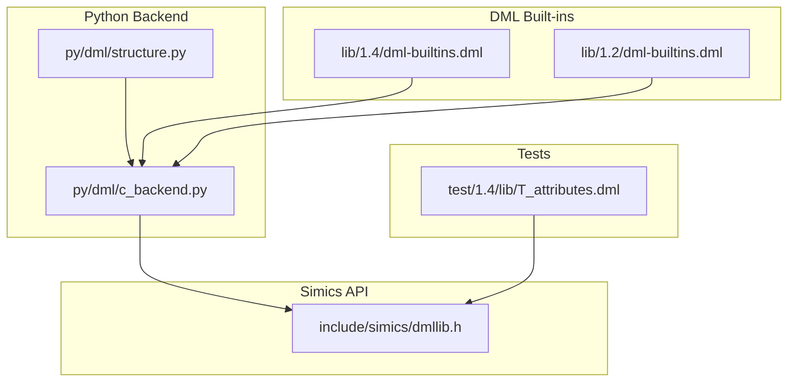
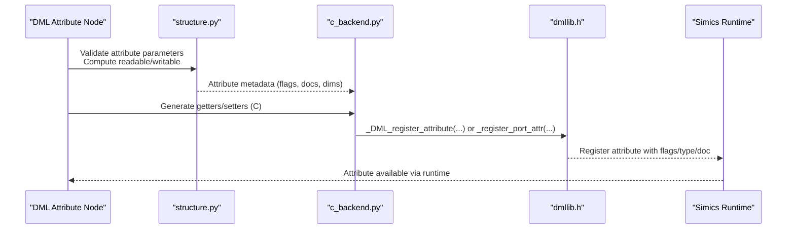
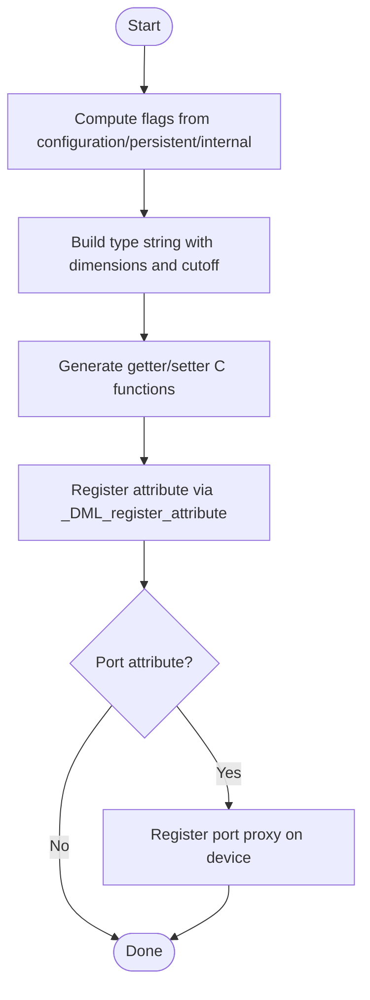
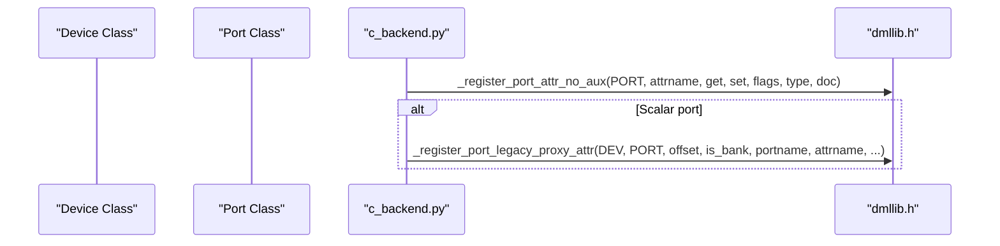
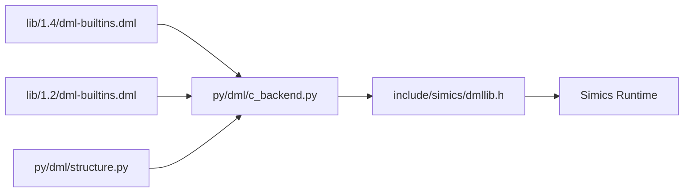

# Attribute Registration System

<cite>
**Referenced Files in This Document**
- [c_backend.py](file://py/dml/c_backend.py)
- [structure.py](file://py/dml/structure.py)
- [dmllib.h](file://include/simics/dmllib.h)
- [dml-builtins.dml](file://lib/1.4/dml-builtins.dml)
- [dml-builtins.dml](file://lib/1.2/dml-builtins.dml)
- [messages.py](file://py/dml/messages.py)
- [T_attributes.dml](file://test/1.4/lib/T_attributes.dml)
</cite>

## Table of Contents
1. [Introduction](#introduction)
2. [Project Structure](#project-structure)
3. [Core Components](#core-components)
4. [Architecture Overview](#architecture-overview)
5. [Detailed Component Analysis](#detailed-component-analysis)
6. [Dependency Analysis](#dependency-analysis)
7. [Performance Considerations](#performance-considerations)
8. [Troubleshooting Guide](#troubleshooting-guide)
9. [Conclusion](#conclusion)

## Introduction
This document explains the attribute registration system that exposes DML attributes to the Simics runtime. It covers how attributes are generated (including getter/setter creation), how flags and documentation are managed, naming conventions, port proxy attribute creation, and configuration parameter processing. It also documents the registration of different attribute types (registers, connections, and regular attributes), attribute type strings, dimension handling, array attribute generation, validation and conflict detection, and integration with Simics attribute registration APIs.

## Project Structure
The attribute registration pipeline spans Python backend code, DML built-in templates, and the Simics C API header:
- Python backend generates C getters/setters and registers attributes with Simics.
- DML built-ins define attribute templates and documentation/flag computation.
- The Simics C API header provides the registration functions.

**Diagram sources**
- [c_backend.py](file://py/dml/c_backend.py#L379-L652)
- [structure.py](file://py/dml/structure.py#L2160-L2263)
- [dmllib.h](file://include/simics/dmllib.h#L1884-L1916)
- [dml-builtins.dml](file://lib/1.4/dml-builtins.dml#L764-L792)
- [dml-builtins.dml](file://lib/1.2/dml-builtins.dml#L288-L367)
- [T_attributes.dml](file://test/1.4/lib/T_attributes.dml#L49-L95)

**Section sources**
- [c_backend.py](file://py/dml/c_backend.py#L379-L652)
- [structure.py](file://py/dml/structure.py#L2160-L2263)
- [dmllib.h](file://include/simics/dmllib.h#L1884-L1916)
- [dml-builtins.dml](file://lib/1.4/dml-builtins.dml#L764-L792)
- [dml-builtins.dml](file://lib/1.2/dml-builtins.dml#L288-L367)
- [T_attributes.dml](file://test/1.4/lib/T_attributes.dml#L49-L95)

## Core Components
- Attribute generation and registration:
  - Getter/setter function generation and registration for attributes, registers, and connections.
  - Attribute flag computation based on configuration parameters.
  - Documentation handling and warnings for missing documentation.
- Naming conventions:
  - Attribute names are derived from prefixes and identifiers, with special handling for confidential registers.
- Port proxy attributes:
  - Compatibility proxies for port attributes on device objects in older Simics versions.
- Validation and conflict detection:
  - Illegal attribute names, duplicate registrations, and missing get/set for checkpointable attributes.

**Section sources**
- [c_backend.py](file://py/dml/c_backend.py#L379-L652)
- [structure.py](file://py/dml/structure.py#L2160-L2263)
- [messages.py](file://py/dml/messages.py#L570-L590)

## Architecture Overview
The attribute registration system orchestrates the following flow:
- DML attribute nodes are processed to compute flags, documentation, and dimensionality.
- Python backend generates C getters/setters and registers attributes via Simics API.
- For port attributes, compatibility proxy attributes may be registered on the device class.

**Diagram sources**
- [structure.py](file://py/dml/structure.py#L2160-L2263)
- [c_backend.py](file://py/dml/c_backend.py#L379-L652)
- [dmllib.h](file://include/simics/dmllib.h#L1884-L1916)

## Detailed Component Analysis

### Attribute Generation and Registration
- Getter/setter generation:
  - Generates C functions for get and set, handling multi-dimensional arrays and optional cutoff for connect attributes.
  - Uses inline DML methods for get/set and applies state-change notifications.
- Registration:
  - Computes flags from configuration, persistence, and internal flags.
  - Builds type strings with array dimensions and cutoff markers.
  - Registers attributes on port classes or device classes; for ports, may also register a proxy on the device.

**Diagram sources**
- [c_backend.py](file://py/dml/c_backend.py#L379-L652)
- [dmllib.h](file://include/simics/dmllib.h#L1884-L1916)

**Section sources**
- [c_backend.py](file://py/dml/c_backend.py#L379-L652)
- [dmllib.h](file://include/simics/dmllib.h#L1884-L1916)

### Attribute Flag Management
- Flags are computed from:
  - configuration: required, optional, pseudo.
  - persistent: persistent flag.
  - internal: internal flag (derived from documentation or confidentiality).
- These flags are combined into a bitmask passed to the registration API.

**Section sources**
- [c_backend.py](file://py/dml/c_backend.py#L39-L59)
- [dml-builtins.dml](file://lib/1.4/dml-builtins.dml#L778-L787)

### Documentation Handling
- Long documentation is derived from:
  - Explicit documentation parameter.
  - Fallback to shown_desc or auto-generated register/connect descriptions.
- Short documentation is used for confidentiality and fallbacks.
- Missing documentation triggers warnings for required attributes and connects.

**Section sources**
- [c_backend.py](file://py/dml/c_backend.py#L61-L82)
- [dml-builtins.dml](file://lib/1.4/dml-builtins.dml#L764-L775)
- [structure.py](file://py/dml/structure.py#L507-L521)

### Attribute Naming Conventions
- Names are constructed from:
  - Optional port prefix for port-scoped attributes.
  - Group prefix and C-style identifier for the attribute.
- Confidential registers receive anonymized names to avoid collisions.

**Section sources**
- [c_backend.py](file://py/dml/c_backend.py#L380-L386)

### Port Proxy Attribute Creation
- For port attributes, a compatibility proxy may be registered on the device class:
  - Reads/writes are forwarded to the port object’s attribute.
  - Required port attributes are propagated via default attribute setting when configured.
- For port arrays, a direct registration on the port class is used; for scalar ports, a proxy is added on the device.

**Diagram sources**
- [c_backend.py](file://py/dml/c_backend.py#L588-L631)
- [dmllib.h](file://include/simics/dmllib.h#L2080-L2127)

**Section sources**
- [c_backend.py](file://py/dml/c_backend.py#L588-L631)
- [dmllib.h](file://include/simics/dmllib.h#L2080-L2127)

### Configuration Parameter Processing
- Configuration controls registration:
  - none: skip registration.
  - required/optional/pseudo: set flags accordingly.
- Readable/writable flags are inferred from presence of get/set methods or allocate_type in DML 1.2, or from parameters in DML 1.4.

**Section sources**
- [structure.py](file://py/dml/structure.py#L2166-L2192)
- [c_backend.py](file://py/dml/c_backend.py#L507-L521)

### Registration of Different Attribute Types
- Regular attributes:
  - Registered via _DML_register_attribute with computed flags, type string, and documentation.
- Registers:
  - Type strings include array dimensions; documentation may be auto-generated for confidential registers.
- Connections:
  - Optional connections may allow cutoff in type strings; documentation includes required interface lists.

**Section sources**
- [c_backend.py](file://py/dml/c_backend.py#L523-L631)
- [dml-builtins.dml](file://lib/1.4/dml-builtins.dml#L1118-L1132)

### Attribute Type Strings and Dimension Handling
- Type strings are built by wrapping the base type with array brackets for each dimension.
- For optional connect attributes, cutoff markers indicate dynamic length support.
- Multi-dimensional arrays are serialized/deserialized with nested lists or raw bytes for specific element types.

**Section sources**
- [c_backend.py](file://py/dml/c_backend.py#L578-L586)
- [dmllib.h](file://include/simics/dmllib.h#L3514-L3522)
- [serialize.py](file://py/dml/serialize.py#L147-L161)

### Array Attribute Generation
- Multi-dimensional arrays:
  - Loop variables are generated for each dimension.
  - Getter allocates nested lists and fills them by iterating indices.
  - Setter supports cutoff for optional connect attributes, allowing partial lists.
- Serialization:
  - Arrays are serialized as nested lists or raw data for byte-like elements.

**Section sources**
- [c_backend.py](file://py/dml/c_backend.py#L451-L504)
- [c_backend.py](file://py/dml/c_backend.py#L387-L449)
- [serialize.py](file://py/dml/serialize.py#L147-L161)

### Attribute Validation and Conflict Detection
- Duplicate attribute names:
  - Enforced per port/device scope; reports collisions with original site.
- Illegal attribute names:
  - Certain names are reserved and reported as illegal.
- Missing get/set for checkpointable attributes:
  - Attributes with required/optional configuration must have readable/writable set; otherwise errors are raised.
- Tests validate runtime behavior of attributes (get/set, type checks).

**Section sources**
- [c_backend.py](file://py/dml/c_backend.py#L97-L110)
- [messages.py](file://py/dml/messages.py#L570-L590)
- [structure.py](file://py/dml/structure.py#L2160-L2263)
- [T_attributes.dml](file://test/1.4/lib/T_attributes.dml#L49-L95)

### Integration with Simics Attribute Registration APIs
- Legacy registration:
  - _DML_register_attribute wraps SIM_register_typed_attribute with trampolines.
- Modern registration:
  - _DML_register_attributes centralizes registration for all attributes, computing type strings with dimensions and applying parent-object vs port-object dispatchers.
- Port proxy registration:
  - _register_port_attr/_register_port_legacy_proxy_attr handle both direct port registration and device-side proxies.

**Section sources**
- [dmllib.h](file://include/simics/dmllib.h#L1884-L1916)
- [dmllib.h](file://include/simics/dmllib.h#L3507-L3537)
- [dmllib.h](file://include/simics/dmllib.h#L2080-L2127)

## Dependency Analysis
The attribute registration system depends on:
- Python backend to generate C code and orchestrate registration.
- DML built-ins to define attribute templates and compute flags/documentation.
- Simics C API for actual registration.

**Diagram sources**
- [c_backend.py](file://py/dml/c_backend.py#L379-L652)
- [structure.py](file://py/dml/structure.py#L2160-L2263)
- [dmllib.h](file://include/simics/dmllib.h#L1884-L1916)
- [dml-builtins.dml](file://lib/1.4/dml-builtins.dml#L764-L792)
- [dml-builtins.dml](file://lib/1.2/dml-builtins.dml#L288-L367)

**Section sources**
- [c_backend.py](file://py/dml/c_backend.py#L379-L652)
- [structure.py](file://py/dml/structure.py#L2160-L2263)
- [dmllib.h](file://include/simics/dmllib.h#L1884-L1916)
- [dml-builtins.dml](file://lib/1.4/dml-builtins.dml#L764-L792)
- [dml-builtins.dml](file://lib/1.2/dml-builtins.dml#L288-L367)

## Performance Considerations
- Attribute registration order is deterministic for subobjects to ensure consistent behavior.
- Multi-dimensional array serialization uses nested lists or raw data for efficiency; cutoff support reduces overhead for optional connect arrays.
- State change notifications are emitted only when necessary to minimize runtime overhead.

## Troubleshooting Guide
Common issues and resolutions:
- Illegal attribute name:
  - Use a different name; the system prevents conflicts with reserved names.
- Duplicate attribute registration:
  - Ensure unique names per port/device scope.
- Missing get/set for checkpointable attributes:
  - Provide readable/writable methods or adjust configuration to “none”.
- Runtime attribute behavior:
  - Verify type strings and dimension handling; tests demonstrate expected get/set behavior and type checks.

**Section sources**
- [messages.py](file://py/dml/messages.py#L570-L590)
- [structure.py](file://py/dml/structure.py#L2160-L2263)
- [T_attributes.dml](file://test/1.4/lib/T_attributes.dml#L49-L95)

## Conclusion
The attribute registration system integrates DML attribute definitions with Simics runtime through a robust pipeline that generates getters/setters, computes flags and documentation, enforces validation and naming rules, and registers attributes with appropriate type strings and dimension handling. It supports port proxy attributes for backward compatibility and provides strong validation to prevent conflicts and misconfigurations.