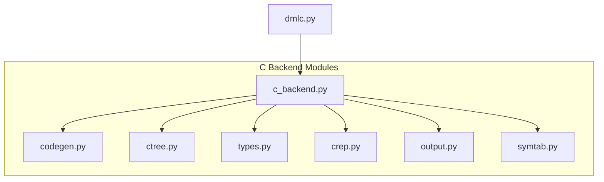
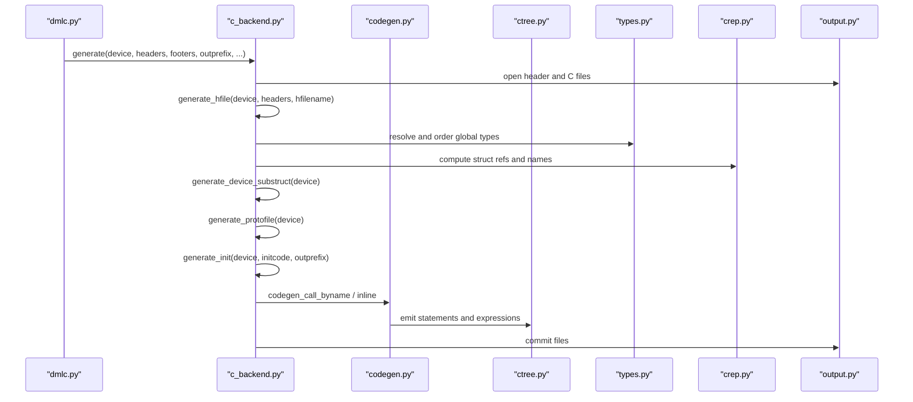
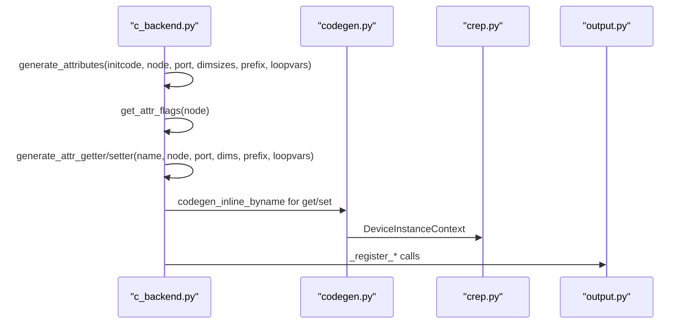
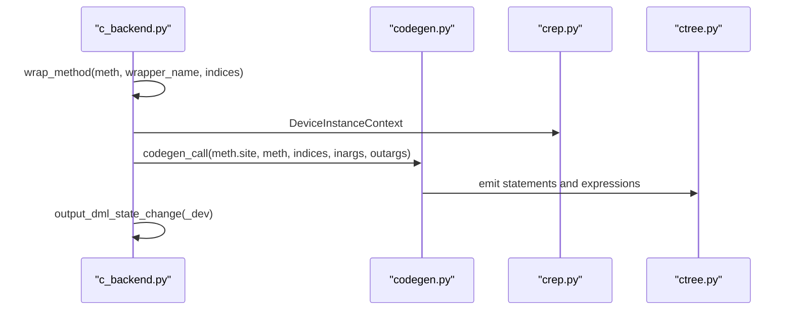
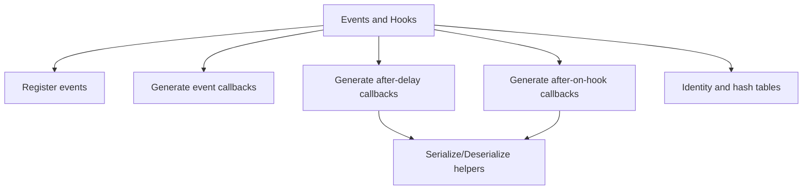
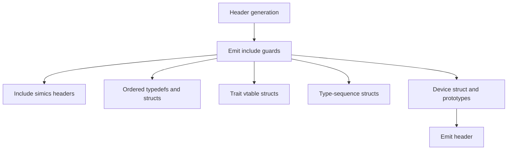
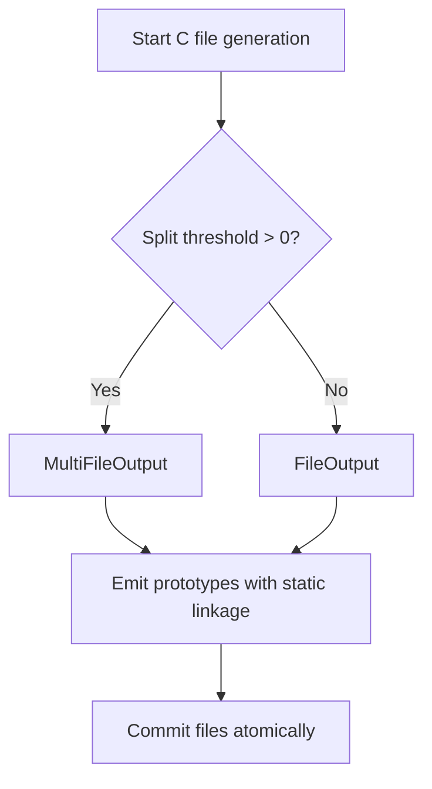
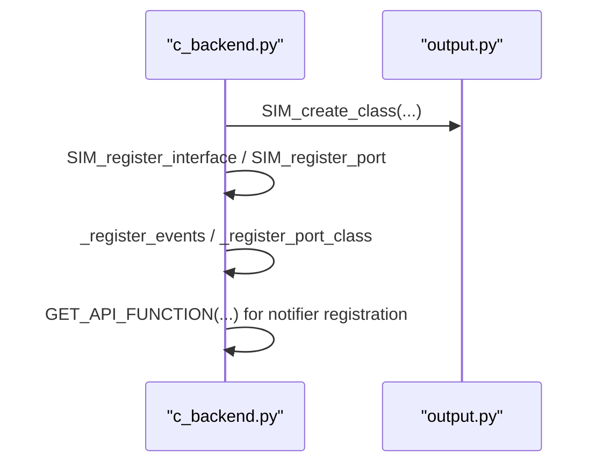
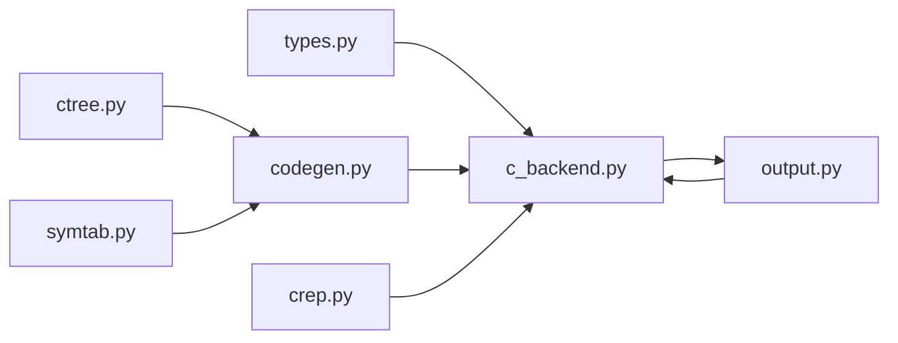

# C Code Generation Backend

<cite>
**Referenced Files in This Document**
- [c_backend.py](file://py/dml/c_backend.py)
- [codegen.py](file://py/dml/codegen.py)
- [ctree.py](file://py/dml/ctree.py)
- [types.py](file://py/dml/types.py)
- [crep.py](file://py/dml/crep.py)
- [output.py](file://py/dml/output.py)
- [symtab.py](file://py/dml/symtab.py)
- [dmlc.py](file://py/dml/dmlc.py)
</cite>

## Table of Contents
1. [Introduction](#introduction)
2. [Project Structure](#project-structure)
3. [Core Components](#core-components)
4. [Architecture Overview](#architecture-overview)
5. [Detailed Component Analysis](#detailed-component-analysis)
6. [Dependency Analysis](#dependency-analysis)
7. [Performance Considerations](#performance-considerations)
8. [Troubleshooting Guide](#troubleshooting-guide)
9. [Conclusion](#conclusion)

## Introduction
This document explains the C code generation backend that transforms validated DML structures into optimized C code. It covers the backend architecture, AST-to-C translation strategies, code generation patterns, output formatting, and integration with the Simics API. It documents how device structures, method wrappers, attribute handlers, and register access functions are generated, along with optimization techniques for memory layout, function generation, and code organization. It also addresses code splitting strategies, header file generation, and symbol table management.

## Project Structure
The C backend is implemented primarily in the Python module `py/dml/c_backend.py`, with supporting infrastructure in several other modules:
- Code generation engine: `py/dml/codegen.py`
- C intermediate representation (IR): `py/dml/ctree.py`
- Type system: `py/dml/types.py`
- Name and structure reference helpers: `py/dml/crep.py`
- Output and formatting: `py/dml/output.py`
- Symbol tables: `py/dml/symtab.py`
- Command-line entry point: `py/dml/dmlc.py`



**Diagram sources**
- [c_backend.py](file://py/dml/c_backend.py#L1-L120)
- [codegen.py](file://py/dml/codegen.py#L1-L120)
- [ctree.py](file://py/dml/ctree.py#L1-L120)
- [types.py](file://py/dml/types.py#L1-L120)
- [crep.py](file://py/dml/crep.py#L1-L120)
- [output.py](file://py/dml/output.py#L1-L120)
- [symtab.py](file://py/dml/symtab.py#L1-L120)
- [dmlc.py](file://py/dml/dmlc.py#L300-L360)

**Section sources**
- [c_backend.py](file://py/dml/c_backend.py#L1-L120)
- [dmlc.py](file://py/dml/dmlc.py#L300-L360)

## Core Components
- Device structure generator: Builds the device struct and nested substructures, emitting typedefs and struct definitions.
- Attribute handler generator: Produces getters/setters for DML attributes and registers them with the Simics runtime.
- Method wrapper generator: Wraps DML methods into C functions with proper error handling and device context injection.
- Event and hook generators: Generates event registration, callback functions, and hook-related artifacts.
- Serialization and identity helpers: Provides serialization functions and identity tables for checkpointing and runtime lookups.
- Output and splitting: Manages header/body generation, include guards, and optional multi-file splitting.

Key responsibilities:
- Translate DML object types to C types and struct layouts.
- Generate function prototypes and definitions for device lifecycle, resets, and methods.
- Integrate with Simics API via generated function calls and registration routines.
- Optimize memory layout and reduce code duplication through shared helpers.

**Section sources**
- [c_backend.py](file://py/dml/c_backend.py#L115-L223)
- [c_backend.py](file://py/dml/c_backend.py#L374-L379)
- [c_backend.py](file://py/dml/c_backend.py#L525-L632)
- [c_backend.py](file://py/dml/c_backend.py#L712-L763)
- [c_backend.py](file://py/dml/c_backend.py#L1008-L1110)
- [c_backend.py](file://py/dml/c_backend.py#L1355-L1377)
- [c_backend.py](file://py/dml/c_backend.py#L1378-L1435)
- [c_backend.py](file://py/dml/c_backend.py#L1437-L1442)
- [c_backend.py](file://py/dml/c_backend.py#L1444-L1471)
- [c_backend.py](file://py/dml/c_backend.py#L1548-L1559)
- [c_backend.py](file://py/dml/c_backend.py#L1560-L1598)
- [c_backend.py](file://py/dml/c_backend.py#L1945-L2025)

## Architecture Overview
The backend orchestrates generation in stages:
1. Parse and validate DML, build the device model.
2. Generate headers (structs, prototypes, traits, and identity tables).
3. Generate C body (functions, event callbacks, attribute handlers, method wrappers).
4. Optionally split output into multiple files based on size thresholds.
5. Commit files atomically.



**Diagram sources**
- [dmlc.py](file://py/dml/dmlc.py#L739-L743)
- [c_backend.py](file://py/dml/c_backend.py#L3314-L3323)
- [c_backend.py](file://py/dml/c_backend.py#L1945-L2025)
- [c_backend.py](file://py/dml/c_backend.py#L3302-L3312)
- [codegen.py](file://py/dml/codegen.py#L58-L65)
- [ctree.py](file://py/dml/ctree.py#L420-L433)
- [types.py](file://py/dml/types.py#L86-L91)
- [crep.py](file://py/dml/crep.py#L93-L104)

## Detailed Component Analysis

### Device Structure Generation
The backend constructs the device struct and nested substructures. It:
- Computes storage types for nodes and arrays.
- Emits struct definitions and typedefs.
- Enforces size constraints and emits assertions for memory layout.
- Handles anonymous and named structs, typedef ordering, and forward references.

```mermaid
flowchart TD
Start(["Start print_device_substruct"]) --> CheckObj["Check node.objtype"]
CheckObj --> |device| DevMembers["Collect device members<br/>obj, static vars, state change"]
CheckObj --> |register/field (1.2)| RegField["Compute storage type<br/>and nested fields"]
CheckObj --> |bank/port/subdevice| PortMembers["Add _obj pointer<br/>and recurse children"]
CheckObj --> |interface/group/event/connect| Composite["Recurse children<br/>compose members"]
CheckObj --> |parameter/method| Skip["No storage"]
DevMembers --> Emit["Emit struct definition"]
RegField --> Emit
PortMembers --> Emit
Composite --> Emit
Skip --> End(["End"])
Emit --> End
```

**Diagram sources**
- [c_backend.py](file://py/dml/c_backend.py#L115-L223)

**Section sources**
- [c_backend.py](file://py/dml/c_backend.py#L115-L223)
- [c_backend.py](file://py/dml/c_backend.py#L354-L358)
- [types.py](file://py/dml/types.py#L86-L91)

### Attribute Handler Generation
The backend generates getters and setters for DML attributes and registers them with the Simics runtime. It:
- Computes attribute flags and types.
- Generates C wrappers for get/set with array/list support.
- Registers attributes via runtime APIs, including port-specific attributes.



**Diagram sources**
- [c_backend.py](file://py/dml/c_backend.py#L525-L632)
- [c_backend.py](file://py/dml/c_backend.py#L387-L450)
- [c_backend.py](file://py/dml/c_backend.py#L451-L504)
- [codegen.py](file://py/dml/codegen.py#L58-L65)
- [crep.py](file://py/dml/crep.py#L31-L42)

**Section sources**
- [c_backend.py](file://py/dml/c_backend.py#L387-L504)
- [c_backend.py](file://py/dml/c_backend.py#L525-L632)

### Method Wrapper Generation
DML methods are wrapped into C functions with:
- Proper device context injection.
- Index handling for arrays/banks.
- Failure handling and state change notifications.



**Diagram sources**
- [c_backend.py](file://py/dml/c_backend.py#L712-L763)
- [codegen.py](file://py/dml/codegen.py#L58-L65)
- [crep.py](file://py/dml/crep.py#L31-L42)
- [ctree.py](file://py/dml/ctree.py#L420-L433)

**Section sources**
- [c_backend.py](file://py/dml/c_backend.py#L712-L763)

### Event and Hook Artifacts
The backend generates:
- Event registration and callbacks.
- After-delay and after-on-hook callbacks.
- Serialization helpers for event data.
- Identity tables and hash tables for runtime lookups.



**Diagram sources**
- [c_backend.py](file://py/dml/c_backend.py#L1030-L1110)
- [c_backend.py](file://py/dml/c_backend.py#L1111-L1210)
- [c_backend.py](file://py/dml/c_backend.py#L1232-L1285)
- [c_backend.py](file://py/dml/c_backend.py#L1480-L1524)

**Section sources**
- [c_backend.py](file://py/dml/c_backend.py#L1030-L1110)
- [c_backend.py](file://py/dml/c_backend.py#L1111-L1210)
- [c_backend.py](file://py/dml/c_backend.py#L1232-L1285)
- [c_backend.py](file://py/dml/c_backend.py#L1480-L1524)

### Header and Prototype Generation
Headers are generated with:
- Include guards.
- Forward declarations and typedefs.
- Trait vtable structs and late global struct definitions.
- Prototypes for exported functions.



**Diagram sources**
- [c_backend.py](file://py/dml/c_backend.py#L259-L372)
- [c_backend.py](file://py/dml/c_backend.py#L308-L351)
- [c_backend.py](file://py/dml/c_backend.py#L339-L342)
- [c_backend.py](file://py/dml/c_backend.py#L374-L379)

**Section sources**
- [c_backend.py](file://py/dml/c_backend.py#L259-L372)
- [c_backend.py](file://py/dml/c_backend.py#L374-L379)

### Code Splitting and Output Management
The backend supports splitting the C file when a threshold is exceeded:
- MultiFileOutput tracks split points.
- Prototypes are emitted with appropriate linkage.
- Files are committed atomically.



**Diagram sources**
- [c_backend.py](file://py/dml/c_backend.py#L3302-L3312)
- [c_backend.py](file://py/dml/c_backend.py#L374-L379)
- [output.py](file://py/dml/output.py#L99-L126)

**Section sources**
- [c_backend.py](file://py/dml/c_backend.py#L3302-L3312)
- [c_backend.py](file://py/dml/c_backend.py#L374-L379)
- [output.py](file://py/dml/output.py#L99-L126)

### Integration with Simics API
Generated code integrates with the Simics API by:
- Creating and registering device classes.
- Initializing traits, identity tables, and event classes.
- Registering interfaces, ports, and attributes.
- Emitting runtime calls for events, hooks, and notifications.



**Diagram sources**
- [c_backend.py](file://py/dml/c_backend.py#L1945-L2025)
- [c_backend.py](file://py/dml/c_backend.py#L963-L998)
- [c_backend.py](file://py/dml/c_backend.py#L1309-L1340)

**Section sources**
- [c_backend.py](file://py/dml/c_backend.py#L1945-L2025)
- [c_backend.py](file://py/dml/c_backend.py#L963-L998)
- [c_backend.py](file://py/dml/c_backend.py#L1309-L1340)

## Dependency Analysis
The C backend relies on a layered design:
- Type system resolves and orders types for correct C declarations.
- Code generation builds IR statements and expressions.
- Name and reference helpers compute struct offsets and C identifiers.
- Output manages file writing and splitting.



**Diagram sources**
- [c_backend.py](file://py/dml/c_backend.py#L15-L28)
- [codegen.py](file://py/dml/codegen.py#L14-L26)
- [ctree.py](file://py/dml/ctree.py#L14-L25)
- [types.py](file://py/dml/types.py#L53-L63)
- [crep.py](file://py/dml/crep.py#L7-L13)
- [output.py](file://py/dml/output.py#L8-L10)
- [symtab.py](file://py/dml/symtab.py#L15-L16)

**Section sources**
- [c_backend.py](file://py/dml/c_backend.py#L15-L28)
- [codegen.py](file://py/dml/codegen.py#L14-L26)
- [ctree.py](file://py/dml/ctree.py#L14-L25)
- [types.py](file://py/dml/types.py#L53-L63)
- [crep.py](file://py/dml/crep.py#L7-L13)
- [output.py](file://py/dml/output.py#L8-L10)
- [symtab.py](file://py/dml/symtab.py#L15-L16)

## Performance Considerations
- Memory layout optimization:
  - Device struct size constrained via static assertions to fit in 32-bit offsets.
  - Ordered type declaration prevents forward-reference issues and reduces rework.
- Function generation:
  - Shared helpers minimize code duplication (e.g., index enumeration tables).
  - Memoization and early exits in codegen reduce redundant checks.
- Output organization:
  - Optional multi-file splitting reduces compilation overhead for large models.
- Runtime integration:
  - Hash tables and identity tables accelerate lookups during checkpointing and event dispatch.

[No sources needed since this section provides general guidance]

## Troubleshooting Guide
Common issues and resolutions:
- Attribute registration conflicts:
  - Duplicate attribute names cause collisions; ensure unique names per port/device.
- Type resolution errors:
  - Unknown or recursive types lead to errors; verify typedefs and forward declarations.
- Event and hook mismatches:
  - Incorrect callback signatures or missing serializers/deserializers cause runtime failures.
- Splitting artifacts:
  - Large models exceeding the threshold may require adjusting split size or reviewing prototype linkage.

**Section sources**
- [c_backend.py](file://py/dml/c_backend.py#L97-L110)
- [types.py](file://py/dml/types.py#L92-L118)
- [c_backend.py](file://py/dml/c_backend.py#L1111-L1183)

## Conclusion
The C code generation backend provides a robust pipeline to transform validated DML structures into efficient, Simics-compatible C code. It emphasizes correct type generation, memory layout, and runtime integration while offering practical optimizations such as code splitting and shared helpers. The modular architecture ensures maintainability and extensibility for evolving DML features and API versions.