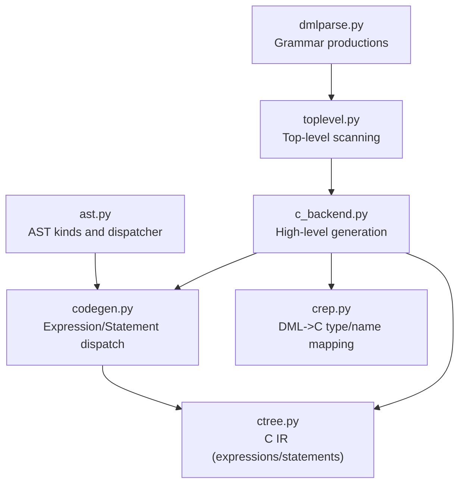
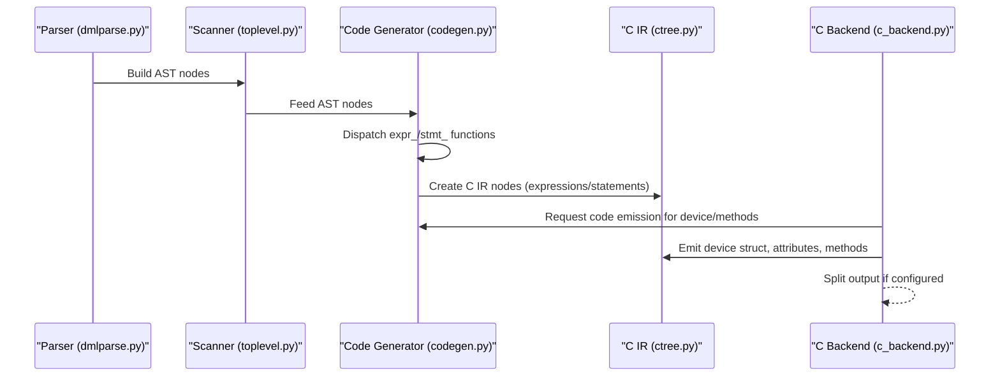
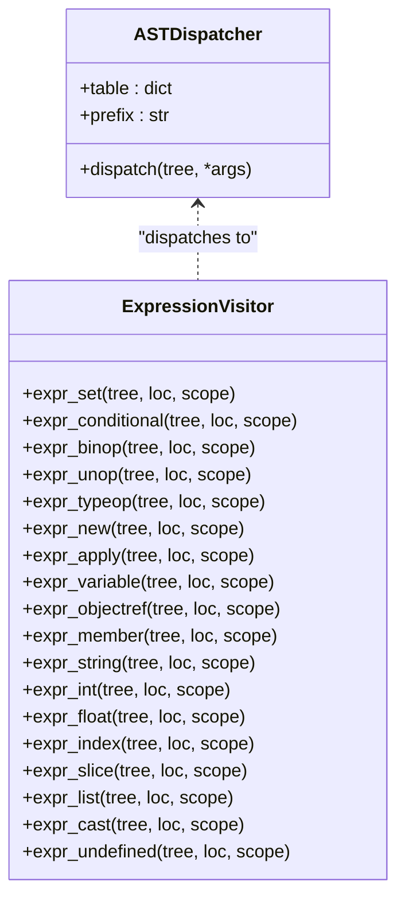
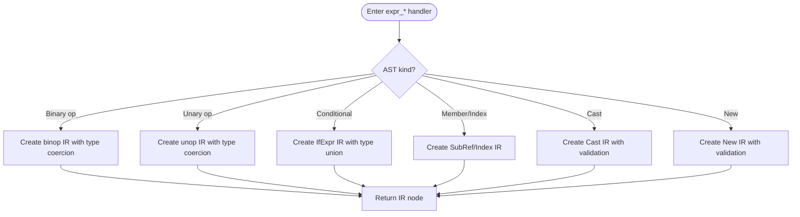
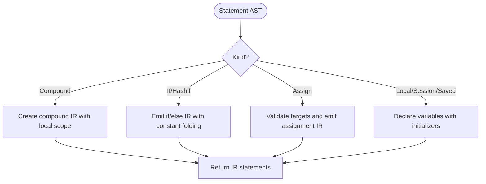
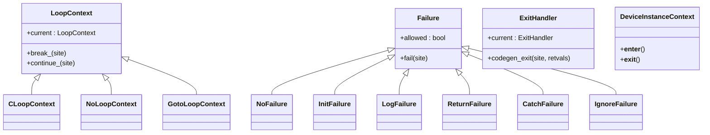
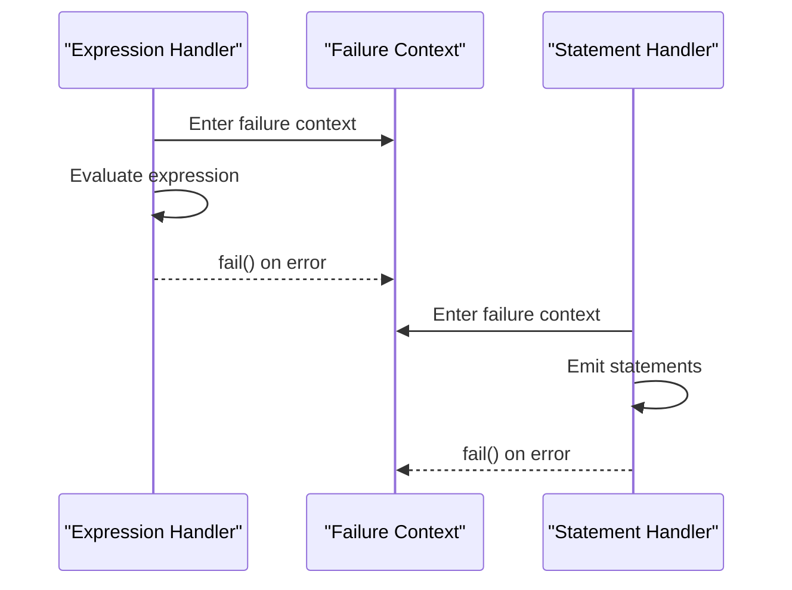
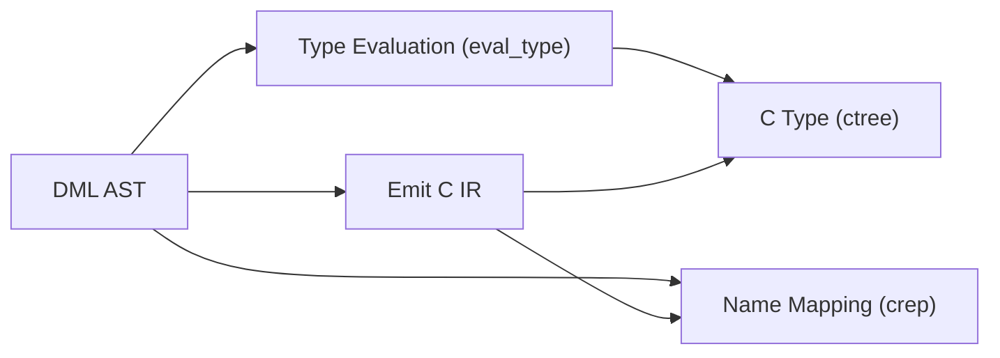
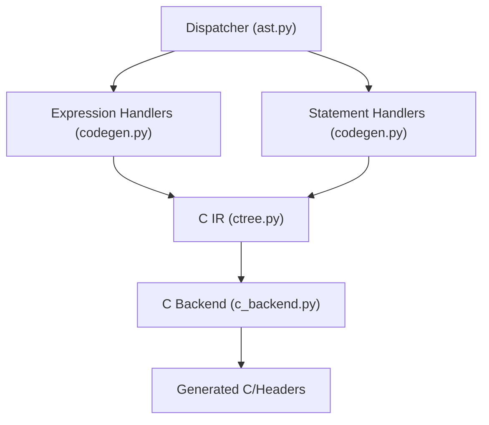
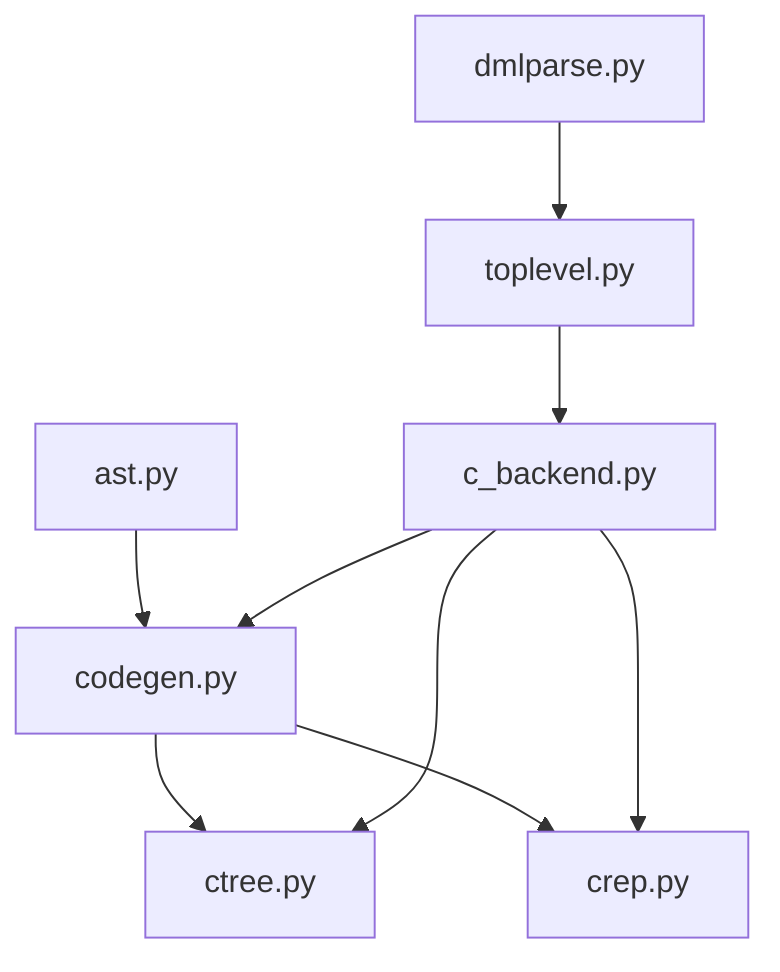

# Core Code Generation Strategies

<cite>
**Referenced Files in This Document**
- [c_backend.py](file://py/dml/c_backend.py)
- [codegen.py](file://py/dml/codegen.py)
- [ctree.py](file://py/dml/ctree.py)
- [ast.py](file://py/dml/ast.py)
- [crep.py](file://py/dml/crep.py)
- [toplevel.py](file://py/dml/toplevel.py)
- [dmlparse.py](file://py/dml/dmlparse.py)
</cite>

## Table of Contents
1. [Introduction](#introduction)
2. [Project Structure](#project-structure)
3. [Core Components](#core-components)
4. [Architecture Overview](#architecture-overview)
5. [Detailed Component Analysis](#detailed-component-analysis)
6. [Dependency Analysis](#dependency-analysis)
7. [Performance Considerations](#performance-considerations)
8. [Troubleshooting Guide](#troubleshooting-guide)
9. [Conclusion](#conclusion)

## Introduction
This document explains the core code generation strategies that underpin the C backend for the Device Modeling Language (DML). It focuses on the translation patterns from DML AST nodes to C constructs, the visitor-style dispatch mechanism, AST traversal strategies, and the code generation pipeline. It also covers type mappings, expression and statement generation, context management, error handling, and the modular design enabling extensible generation patterns.

## Project Structure
The C backend is implemented primarily in three modules:
- c_backend.py: orchestrates high-level generation (headers, prototypes, device struct, attributes, methods, and integration points)
- codegen.py: implements the visitor-style AST dispatch for expressions and statements, type evaluation, and control flow/error handling contexts
- ctree.py: defines the C intermediate representation (IR) of expressions and statements, plus helpers for emitting C code

Supporting modules:
- ast.py: defines the DML AST node kinds and a dispatcher infrastructure
- crep.py: maps DML types and nodes to C representations (names, types, storage)
- toplevel.py and dmlparse.py: provide top-level parsing and scanning that feed AST nodes into the generator

**Diagram sources**
- [ast.py](file://py/dml/ast.py#L156-L171)
- [codegen.py](file://py/dml/codegen.py#L975-L984)
- [ctree.py](file://py/dml/ctree.py#L1-L186)
- [c_backend.py](file://py/dml/c_backend.py#L1-L120)
- [crep.py](file://py/dml/crep.py#L157-L193)
- [toplevel.py](file://py/dml/toplevel.py#L145-L174)
- [dmlparse.py](file://py/dml/dmlparse.py#L806-L860)

**Section sources**
- [c_backend.py](file://py/dml/c_backend.py#L1-L120)
- [codegen.py](file://py/dml/codegen.py#L975-L984)
- [ctree.py](file://py/dml/ctree.py#L1-L186)
- [ast.py](file://py/dml/ast.py#L156-L171)
- [crep.py](file://py/dml/crep.py#L157-L193)
- [toplevel.py](file://py/dml/toplevel.py#L145-L174)
- [dmlparse.py](file://py/dml/dmlparse.py#L806-L860)

## Core Components
- AST dispatcher infrastructure: Provides a uniform dispatch mechanism for DML AST nodes to generation functions.
- Expression and statement visitors: Convert DML expressions and statements into C IR nodes, handling type conversions, control flow, and error contexts.
- C IR (ctree): A typed, structured representation of C code with helpers to emit C statements and expressions.
- High-level generator (c_backend): Builds device structures, attributes, methods, and integration points; coordinates splitting and output.
- Type/name mapping (crep): Bridges DML types/names to C equivalents and storage decisions.

Key responsibilities:
- Translate DML constructs to C constructs via visitor dispatch
- Manage scoping, context, and control flow during generation
- Enforce type safety and emit appropriate C code with correct signatures and initializers
- Modularize generation to enable extensions and specialized backends

**Section sources**
- [ast.py](file://py/dml/ast.py#L156-L171)
- [codegen.py](file://py/dml/codegen.py#L975-L984)
- [ctree.py](file://py/dml/ctree.py#L339-L357)
- [c_backend.py](file://py/dml/c_backend.py#L1-L120)
- [crep.py](file://py/dml/crep.py#L157-L193)

## Architecture Overview
The generation pipeline proceeds as follows:
- Top-level scanning parses DML and builds AST nodes
- The code generator traverses AST nodes using dispatcher functions
- Expressions are converted to C IR with type checking and conversions
- Statements are emitted as C IR statements with control flow and error handling
- The high-level generator composes device structures, attributes, methods, and integration code
- Output is written to header, prototype, and C files, with optional splitting

**Diagram sources**
- [dmlparse.py](file://py/dml/dmlparse.py#L806-L860)
- [toplevel.py](file://py/dml/toplevel.py#L145-L174)
- [codegen.py](file://py/dml/codegen.py#L975-L984)
- [ctree.py](file://py/dml/ctree.py#L1-L186)
- [c_backend.py](file://py/dml/c_backend.py#L3278-L3552)

## Detailed Component Analysis

### Visitor Pattern and AST Traversal
The code generator uses a dispatcher-based visitor pattern:
- A dispatcher table maps AST kinds to handler functions prefixed with expr_ or stmt_
- Expression handlers convert DML expressions to C IR nodes, performing type checks and conversions
- Statement handlers emit C IR statements, managing control flow and scoping

**Diagram sources**
- [ast.py](file://py/dml/ast.py#L156-L171)
- [codegen.py](file://py/dml/codegen.py#L975-L1599)

**Section sources**
- [ast.py](file://py/dml/ast.py#L156-L171)
- [codegen.py](file://py/dml/codegen.py#L975-L1599)

### Expression Translation Patterns
Common translation patterns include:
- Binary and unary operators mapped to C IR constructors with type coercion
- Conditional expressions converted to ternary expressions with type unions
- Member access and indexing translated to C IR member/subscript nodes
- Casts and type-of expressions validated and emitted as C IR casts
- New expressions validated and emitted as C IR allocations

**Diagram sources**
- [codegen.py](file://py/dml/codegen.py#L1051-L1177)
- [codegen.py](file://py/dml/codegen.py#L1178-L1321)
- [codegen.py](file://py/dml/codegen.py#L1318-L1321)

**Section sources**
- [codegen.py](file://py/dml/codegen.py#L1051-L1321)

### Statement Generation Pipeline
Statement generation:
- Compound blocks introduce local scopes and collect declarations
- If/else and hash-if branches are emitted with constant folding in DML 1.2
- Assignment targets and initializers are validated and emitted as assignment statements
- Local/session/saved variable declarations are handled with proper initializers and scoping

**Diagram sources**
- [codegen.py](file://py/dml/codegen.py#L1907-L1917)
- [codegen.py](file://py/dml/codegen.py#L1923-L1943)
- [codegen.py](file://py/dml/codegen.py#L2191-L2246)
- [codegen.py](file://py/dml/codegen.py#L2333-L2399)

**Section sources**
- [codegen.py](file://py/dml/codegen.py#L1907-L2399)

### Context Management During Generation
Generation uses several context managers:
- Loop contexts manage break/continue semantics and loop stack
- Failure contexts define how exceptions are handled (init, log, return, catch, ignore)
- Exit handlers manage returns and memoized exits
- Device instance context ensures device references are available during generation

**Diagram sources**
- [codegen.py](file://py/dml/codegen.py#L95-L148)
- [codegen.py](file://py/dml/codegen.py#L149-L214)
- [codegen.py](file://py/dml/codegen.py#L215-L233)

**Section sources**
- [codegen.py](file://py/dml/codegen.py#L95-L233)

### Error Handling Strategies
The generator centralizes error handling:
- Failure contexts translate DML exceptions into appropriate C mechanisms (returns, logs, throws)
- Statement and expression handlers raise or suppress errors depending on context
- Top-level scanning reports errors encountered during generation

**Diagram sources**
- [codegen.py](file://py/dml/codegen.py#L149-L214)
- [toplevel.py](file://py/dml/toplevel.py#L165-L174)

**Section sources**
- [codegen.py](file://py/dml/codegen.py#L149-L214)
- [toplevel.py](file://py/dml/toplevel.py#L165-L174)

### Relationship Between DML Constructs and C Representations
- Types: DML types are evaluated and mapped to C types via crep; arrays, pointers, structs, and vectors are represented as C IR types
- Names and storage: DML names are mangled to C identifiers; storage decisions are made per node type
- Methods: Fully-typed methods become C functions; inline/shared methods are handled specially
- Attributes: Device attributes are generated as getters/setters with flags and documentation
- Events/hooks: After delays, immediate callbacks, and hook-based after are emitted as C IR events

**Diagram sources**
- [codegen.py](file://py/dml/codegen.py#L1437-L1633)
- [crep.py](file://py/dml/crep.py#L157-L193)
- [ctree.py](file://py/dml/ctree.py#L1-L186)

**Section sources**
- [codegen.py](file://py/dml/codegen.py#L1437-L1633)
- [crep.py](file://py/dml/crep.py#L157-L193)
- [ctree.py](file://py/dml/ctree.py#L1-L186)

### Modular Design for Extensible Generation
Extensibility is achieved through:
- Dispatcher-driven visitor pattern allowing new AST kinds and handlers
- C IR abstraction enabling backend-specific emission without changing dispatch logic
- Context managers isolating concerns (loops, failures, exits)
- High-level generator composing device structures and integration points

**Diagram sources**
- [ast.py](file://py/dml/ast.py#L156-L171)
- [codegen.py](file://py/dml/codegen.py#L975-L984)
- [ctree.py](file://py/dml/ctree.py#L1-L186)
- [c_backend.py](file://py/dml/c_backend.py#L3278-L3552)

**Section sources**
- [ast.py](file://py/dml/ast.py#L156-L171)
- [codegen.py](file://py/dml/codegen.py#L975-L984)
- [ctree.py](file://py/dml/ctree.py#L1-L186)
- [c_backend.py](file://py/dml/c_backend.py#L3278-L3552)

## Dependency Analysis
The following diagram shows key dependencies among the generation modules:

**Diagram sources**
- [ast.py](file://py/dml/ast.py#L156-L171)
- [codegen.py](file://py/dml/codegen.py#L975-L984)
- [ctree.py](file://py/dml/ctree.py#L1-L186)
- [crep.py](file://py/dml/crep.py#L157-L193)
- [c_backend.py](file://py/dml/c_backend.py#L1-L120)
- [toplevel.py](file://py/dml/toplevel.py#L145-L174)
- [dmlparse.py](file://py/dml/dmlparse.py#L806-L860)

**Section sources**
- [ast.py](file://py/dml/ast.py#L156-L171)
- [codegen.py](file://py/dml/codegen.py#L975-L984)
- [ctree.py](file://py/dml/ctree.py#L1-L186)
- [crep.py](file://py/dml/crep.py#L157-L193)
- [c_backend.py](file://py/dml/c_backend.py#L1-L120)
- [toplevel.py](file://py/dml/toplevel.py#L145-L174)
- [dmlparse.py](file://py/dml/dmlparse.py#L806-L860)

## Performance Considerations
- Constant folding and dead branch elimination in DML 1.2 reduces generated code volume
- Control flow analysis helps detect unreachable code and avoid unnecessary branches
- Initializer evaluation and type coercion are performed early to minimize runtime overhead
- Output splitting reduces compilation time for large models

## Troubleshooting Guide
Common issues and resolutions:
- Type errors during expression/statement generation are reported and often recoverable
- Missing or mismatched initializers raise explicit errors during initializer evaluation
- Constant condition errors in hash-if and if statements are detected and reported
- Failure contexts must be used appropriately to ensure correct exception handling in generated code

**Section sources**
- [codegen.py](file://py/dml/codegen.py#L1779-L1866)
- [codegen.py](file://py/dml/codegen.py#L2191-L2246)
- [codegen.py](file://py/dml/codegen.py#L149-L214)

## Conclusion
The C backend’s code generation strategy centers on a robust dispatcher-based visitor pattern, a strongly typed C IR, and careful context management. Together, these components provide a modular, extensible framework for translating DML constructs into efficient, maintainable C code, with strong error handling and performance-conscious optimizations.