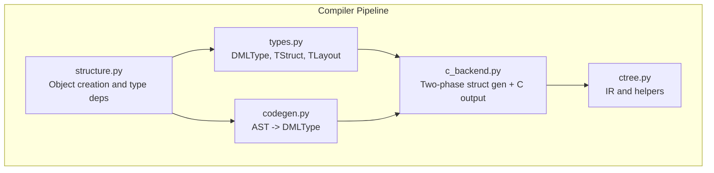
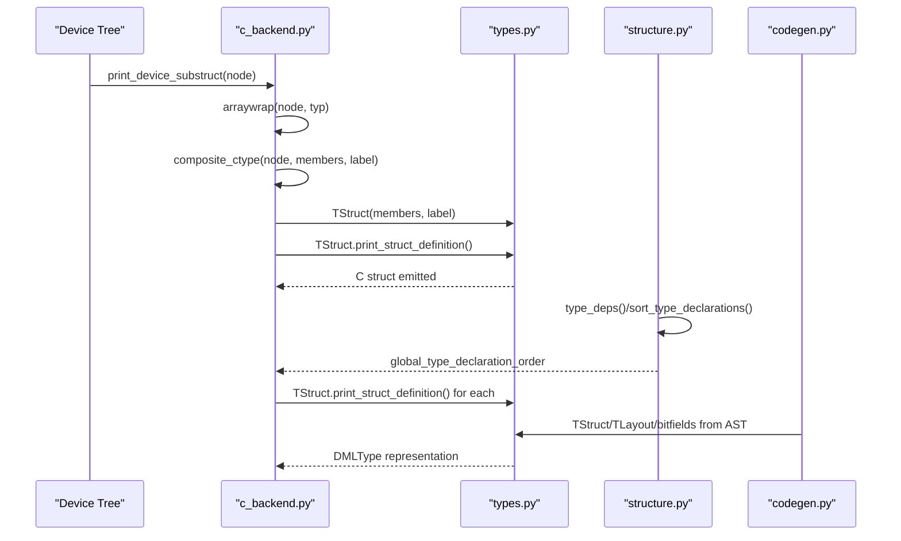
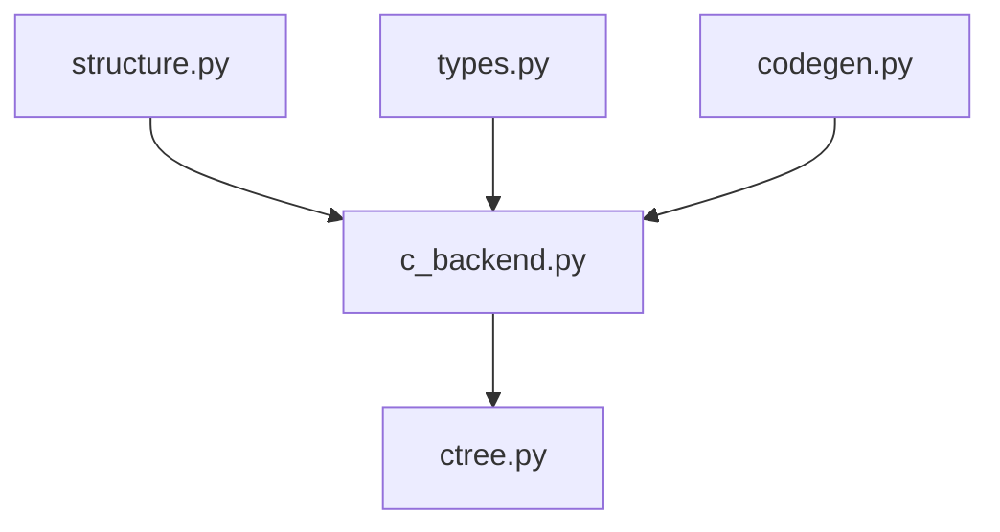

# Device Structure Generation

<cite>
**Referenced Files in This Document**
- [c_backend.py](file://py/dml/c_backend.py)
- [structure.py](file://py/dml/structure.py)
- [types.py](file://py/dml/types.py)
- [ctree.py](file://py/dml/ctree.py)
- [codegen.py](file://py/dml/codegen.py)
- [dml-builtins.dml](file://lib/1.4/dml-builtins.dml)
</cite>

## Table of Contents
1. [Introduction](#introduction)
2. [Project Structure](#project-structure)
3. [Core Components](#core-components)
4. [Architecture Overview](#architecture-overview)
5. [Detailed Component Analysis](#detailed-component-analysis)
6. [Dependency Analysis](#dependency-analysis)
7. [Performance Considerations](#performance-considerations)
8. [Troubleshooting Guide](#troubleshooting-guide)
9. [Conclusion](#conclusion)

## Introduction
This document explains how the DML compiler generates C struct definitions that represent device models. The generation follows a two-phase process:
- Phase 1: Build a DML-type representation using DMLType and TStruct.
- Phase 2: Print the C struct definition from the DML-type representation.

It covers how device hierarchies translate into C struct layouts, including arrays, pointers, embedded objects, and anonymous structs. It also documents type dependency resolution, forward reference handling, struct label mangling, and typedef management for complex type hierarchies.

## Project Structure
The device structure generation spans several modules:
- c_backend.py: Implements the two-phase generation pipeline and prints C structs.
- structure.py: Manages object creation, parameter merging, and type dependency sorting.
- types.py: Defines DML types including TStruct and TLayout.
- ctree.py: Provides intermediate constructs and helpers for code emission.
- codegen.py: Converts DML AST fragments into DML types (structs, layouts, bitfields).
- dml-builtins.dml: Supplies standard templates and parameters for device components.

**Diagram sources**
- [structure.py](file://py/dml/structure.py#L1-120)
- [types.py](file://py/dml/types.py#L1200-1250)
- [codegen.py](file://py/dml/codegen.py#L1460-1520)
- [c_backend.py](file://py/dml/c_backend.py#L111-L137)
- [ctree.py](file://py/dml/ctree.py#L1-L120)

**Section sources**
- [c_backend.py](file://py/dml/c_backend.py#L111-L137)
- [structure.py](file://py/dml/structure.py#L1-L120)
- [types.py](file://py/dml/types.py#L1200-1250)
- [codegen.py](file://py/dml/codegen.py#L1460-1520)
- [ctree.py](file://py/dml/ctree.py#L1-L120)

## Core Components
- Two-phase generation in c_backend.py:
  - Phase 1: Build DMLType/TStruct from device hierarchy.
  - Phase 2: Print C struct definition via TStruct.print_struct_definition().
- Type dependency resolution in structure.py:
  - type_deps() computes dependencies among typedefs and structs.
  - sort_type_declarations() topologically orders types for correct C emission.
- Composite type generation in c_backend.py:
  - composite_ctype() builds TStruct with member filtering and label mangling.
  - arraywrap() wraps types in TArray for arrays.
- Struct definition printing in types.py:
  - TStruct.print_struct_definition() emits C struct bodies.
- Layout and bitfields in codegen.py:
  - TLayout and bitfields AST fragments are converted to DML types.
- Embedded objects and arrays:
  - Bank/port/subdevice members are embedded as struct members or pointers depending on DML version and naming.

**Section sources**
- [c_backend.py](file://py/dml/c_backend.py#L111-L223)
- [structure.py](file://py/dml/structure.py#L288-L394)
- [types.py](file://py/dml/types.py#L1236-L1244)
- [codegen.py](file://py/dml/codegen.py#L1460-L1520)

## Architecture Overview
The generation process transforms DML device hierarchies into C structs in two stages:

**Diagram sources**
- [c_backend.py](file://py/dml/c_backend.py#L111-L223)
- [types.py](file://py/dml/types.py#L1236-L1244)
- [structure.py](file://py/dml/structure.py#L288-L394)
- [codegen.py](file://py/dml/codegen.py#L1460-L1520)

## Detailed Component Analysis

### Two-Phase Structure Building with DMLType and TStruct
- Phase 1: print_device_substruct(node) recursively computes the DMLType for each node:
  - Uses arraywrap() to wrap types in TArray for multi-dimensional arrays.
  - Uses composite_ctype() to build TStruct with filtered members and mangled labels.
- Phase 2: TStruct.print_struct_definition() emits the C struct body with member declarations.

Key behaviors:
- Member filtering ignores None types.
- Label mangling ensures unique struct labels for different ancestors.
- Arrays are wrapped in reverse dimension order.

**Section sources**
- [c_backend.py](file://py/dml/c_backend.py#L111-L223)
- [types.py](file://py/dml/types.py#L1236-L1244)

### Composite Type Generation and Member Ordering
- composite_ctype() filters out None members and constructs TStruct with a label.
- Member ordering strategy:
  - Device members include a conf_object_t base and static vars.
  - Bank/port/subdevice embed conf_object_t pointers or members depending on naming and version.
  - Other nodes embed their subcomponents as struct members.

Array wrapping:
- arraywrap() iterates node.dimsizes in reverse to wrap the base type in TArray for each dimension.

**Section sources**
- [c_backend.py](file://py/dml/c_backend.py#L125-L223)

### Memory Layout Optimizations
- Anonymous struct generation:
  - Anonymous structs are assigned unique labels and printed when first referenced.
- Typedef management:
  - Named structs receive typedefs for forward references.
  - Topological ordering ensures dependent structs are emitted after their dependencies.
- Forward reference handling:
  - Structs can be referenced by label before definition, but definitions must precede direct usage as struct members.
  - Extern typedefs cannot be referenced by label; only by typename.

**Section sources**
- [c_backend.py](file://py/dml/c_backend.py#L286-L347)
- [structure.py](file://py/dml/structure.py#L288-L394)

### Struct Definition Printing and Type Dependencies
- type_deps() determines dependencies for typedefs and structs:
  - Struct members and arrays require struct definitions before use.
  - Pointers and vectors defer to base types without requiring struct definitions.
- sort_type_declarations() topologically sorts typedefs and anonymous structs for emission order.

**Section sources**
- [structure.py](file://py/dml/structure.py#L288-L394)

### Device, Bank, Port, and Component Structures
- Device:
  - Base member: conf_object_t.
  - Static vars appended as members.
  - Immediate-after state pointer included.
- Bank/Port/Subdevice:
  - Named banks/ports include a conf_object_t pointer member.
  - Subdevice members are embedded similarly.
- Attribute/Interface/Group/Event/Connect/Register/Field/Implement:
  - Members are embedded as struct members when applicable.
  - Special handling for DML 1.2 attribute allocation vs. composite embedding.

Array wrapping and pointer indirection:
- arraywrap() wraps types in TArray for each dimension.
- Pointer indirection is used for conf_object_t members of bank/port/subdevice.

Embedded object handling:
- Embedded objects are represented as struct members or pointers depending on node type and naming rules.

**Section sources**
- [c_backend.py](file://py/dml/c_backend.py#L139-L223)

### Struct Label Mangling and Anonymous Struct Generation
- Label mangling:
  - composite_ctype() constructs labels from ancestor names to avoid conflicts.
- Anonymous struct generation:
  - Anonymous structs are assigned unique labels and printed upon first use.

**Section sources**
- [c_backend.py](file://py/dml/c_backend.py#L125-L137)
- [types.py](file://py/dml/types.py#L1208-L1217)

### Typedef Management for Complex Hierarchies
- Named structs receive typedefs for forward references.
- Anonymous structs are emitted with struct definitions when referenced.
- Late global struct definitions are tracked and emitted after regular typedefs.

**Section sources**
- [c_backend.py](file://py/dml/c_backend.py#L308-L347)
- [types.py](file://py/dml/types.py#L1198-L1201)

### Layouts, Bitfields, and Register Structures
- Layouts and bitfields are converted to DML types via codegen.py:
  - TLayout stores endian and member declarations; resolves to a struct-like type.
  - Bitfields define fixed-width integer members with MSB/LSB positions.
- These types integrate seamlessly into the two-phase generation pipeline.

**Section sources**
- [codegen.py](file://py/dml/codegen.py#L1460-L1520)
- [types.py](file://py/dml/types.py#L1254-L1321)

### Port Object Integration (DML 1.4)
- DML 1.4 introduces bank parameters and session variables that influence struct generation.
- The bank template includes session variables for callbacks and connections.

**Section sources**
- [dml-builtins.dml](file://lib/1.4/dml-builtins.dml#L1892-L1927)

## Dependency Analysis
The generation pipeline depends on:
- structure.py for object creation and dependency computation.
- types.py for DML type representations and struct printing.
- codegen.py for converting AST fragments to DML types.
- c_backend.py orchestrating the two-phase generation and C output.

**Diagram sources**
- [structure.py](file://py/dml/structure.py#L1-L120)
- [types.py](file://py/dml/types.py#L1200-1250)
- [codegen.py](file://py/dml/codegen.py#L1460-1520)
- [c_backend.py](file://py/dml/c_backend.py#L111-L137)
- [ctree.py](file://py/dml/ctree.py#L1-L120)

**Section sources**
- [structure.py](file://py/dml/structure.py#L1-L120)
- [types.py](file://py/dml/types.py#L1200-1250)
- [codegen.py](file://py/dml/codegen.py#L1460-1520)
- [c_backend.py](file://py/dml/c_backend.py#L111-L137)
- [ctree.py](file://py/dml/ctree.py#L1-L120)

## Performance Considerations
- Topological sorting of types minimizes repeated emissions and avoids incomplete type errors.
- Anonymous struct emission occurs only on first use, reducing unnecessary definitions.
- Array wrapping uses reverse iteration over dimsizes to maintain correct C layout.

## Troubleshooting Guide
Common issues and resolutions:
- Empty struct errors:
  - Layouts and bitfields must have non-empty members; otherwise, empty struct errors are raised.
- Function members in structs:
  - Struct members cannot be functions; function struct members are rejected.
- Cycle detection in typedefs:
  - Cycles in type dependencies are detected and reported; offending typedefs are removed and the process retries.

**Section sources**
- [codegen.py](file://py/dml/codegen.py#L1460-L1520)
- [structure.py](file://py/dml/structure.py#L375-L384)

## Conclusion
The DML device structure generation uses a robust two-phase approach: first building DML types with TStruct, then printing C structs with careful attention to member ordering, array wrapping, pointer indirection, anonymous structs, and typedef management. Type dependency resolution and topological sorting ensure correct C emission order, while label mangling prevents struct name collisions across device hierarchies.