# Method and Function Generation

<cite>
**Referenced Files in This Document**
- [c_backend.py](file://py/dml/c_backend.py)
- [codegen.py](file://py/dml/codegen.py)
- [ctree.py](file://py/dml/ctree.py)
- [traits.py](file://py/dml/traits.py)
</cite>

## Table of Contents
1. [Introduction](#introduction)
2. [Project Structure](#project-structure)
3. [Core Components](#core-components)
4. [Architecture Overview](#architecture-overview)
5. [Detailed Component Analysis](#detailed-component-analysis)
6. [Dependency Analysis](#dependency-analysis)
7. [Performance Considerations](#performance-considerations)
8. [Troubleshooting Guide](#troubleshooting-guide)
9. [Conclusion](#conclusion)

## Introduction
This document explains how DML (Device Modeling Language) compiles methods and functions into C-callable interfaces. It covers wrapper function generation, parameter marshalling, return value handling, error propagation, method signature generation, static trampoline creation, and method dispatch mechanisms. It also documents how method arrays, dimension parameters, and port object integration are handled for method calls.

## Project Structure
The method and function generation pipeline spans several modules:
- Backend emission and trampoline generation
- Method signature computation and C function generation
- Call-site generation and output argument management
- Trait method wrapping and exported function creation

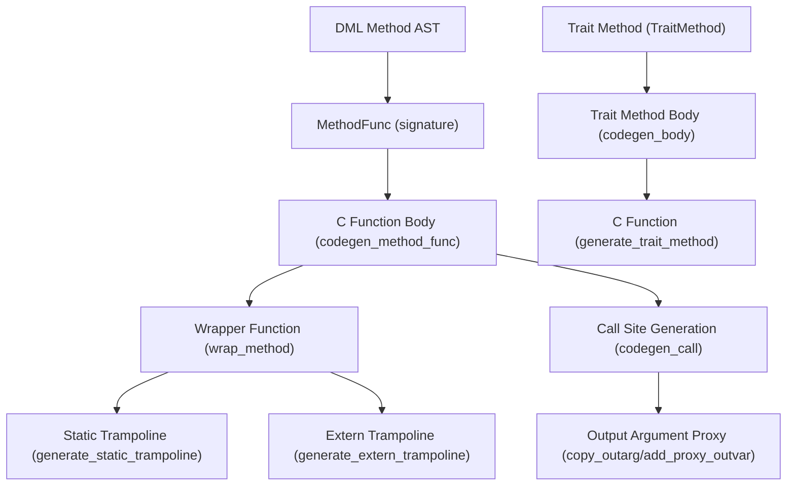

**Diagram sources**
- [c_backend.py](file://py/dml/c_backend.py#L712-L763)
- [c_backend.py](file://py/dml/c_backend.py#L2027-L2072)
- [codegen.py](file://py/dml/codegen.py#L3692-L3847)
- [codegen.py](file://py/dml/codegen.py#L4035-L4137)
- [traits.py](file://py/dml/traits.py#L218-L271)

**Section sources**
- [c_backend.py](file://py/dml/c_backend.py#L712-L763)
- [c_backend.py](file://py/dml/c_backend.py#L2027-L2072)
- [codegen.py](file://py/dml/codegen.py#L3692-L3847)
- [codegen.py](file://py/dml/codegen.py#L4035-L4137)
- [traits.py](file://py/dml/traits.py#L218-L271)

## Core Components
- Method signature generation and C function prototypes
- Wrapper function generation for DML methods
- Static and extern trampoline creation
- Call-site generation with parameter marshalling and output argument handling
- Trait method wrapping and exported function creation
- Method dispatch and port object integration

**Section sources**
- [codegen.py](file://py/dml/codegen.py#L3670-L3691)
- [codegen.py](file://py/dml/codegen.py#L3692-L3847)
- [c_backend.py](file://py/dml/c_backend.py#L712-L763)
- [c_backend.py](file://py/dml/c_backend.py#L2027-L2072)
- [traits.py](file://py/dml/traits.py#L218-L271)

## Architecture Overview
The system converts DML methods into C-callable functions with the following stages:
- Signature computation: Determine C return type and parameter types, including implicit device pointer and indices.
- Function body generation: Build the C function body with proper failure handling and output argument semantics.
- Wrapper emission: Emit a wrapper that validates device context and invokes the generated function.
- Trampoline emission: Emit static trampolines for non-independent methods and extern trampolines for 1.4 exports.
- Call-site generation: At call-sites, marshal inputs, manage output arguments, and propagate errors.

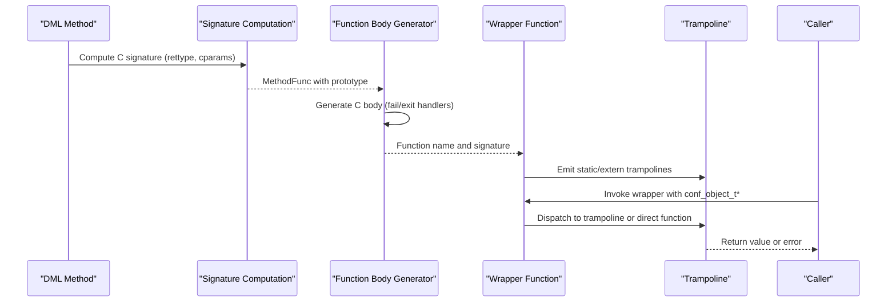

**Diagram sources**
- [codegen.py](file://py/dml/codegen.py#L3670-L3691)
- [codegen.py](file://py/dml/codegen.py#L3806-L3847)
- [c_backend.py](file://py/dml/c_backend.py#L712-L763)
- [c_backend.py](file://py/dml/c_backend.py#L2027-L2072)

## Detailed Component Analysis

### Method Signature Generation and C Function Prototypes
- Return type determination:
  - Throws methods return a boolean success indicator.
  - Methods with output parameters return the first output parameter; remaining outputs are passed by pointer.
  - Methods with no outputs return void.
- Parameter type conversion:
  - Implicit parameters include device pointer and method indices.
  - Output parameters are converted to pointers in the C signature.
  - Endian integer parameters are treated as regular integers for signature purposes.
- Method function representation:
  - MethodFunc encapsulates a fully typed method instance and computes its prototype and C function type.

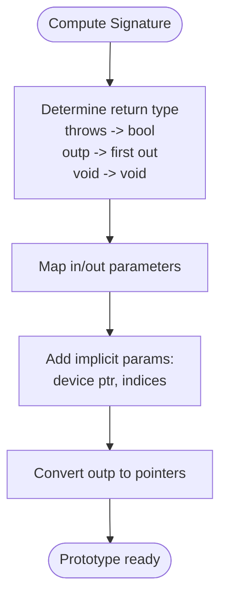

**Diagram sources**
- [codegen.py](file://py/dml/codegen.py#L3670-L3691)
- [codegen.py](file://py/dml/codegen.py#L3692-L3753)

**Section sources**
- [codegen.py](file://py/dml/codegen.py#L3670-L3691)
- [codegen.py](file://py/dml/codegen.py#L3692-L3753)

### Wrapper Function Generation for DML Methods
- The wrapper accepts a conf_object_t pointer as the first argument and returns the output value if applicable.
- For port-object wrappers, indices are extracted from the port object’s index array.
- The wrapper initializes output variables, executes the method call with logging of failures, and returns the result.
- It ensures device state change notifications are emitted after execution.

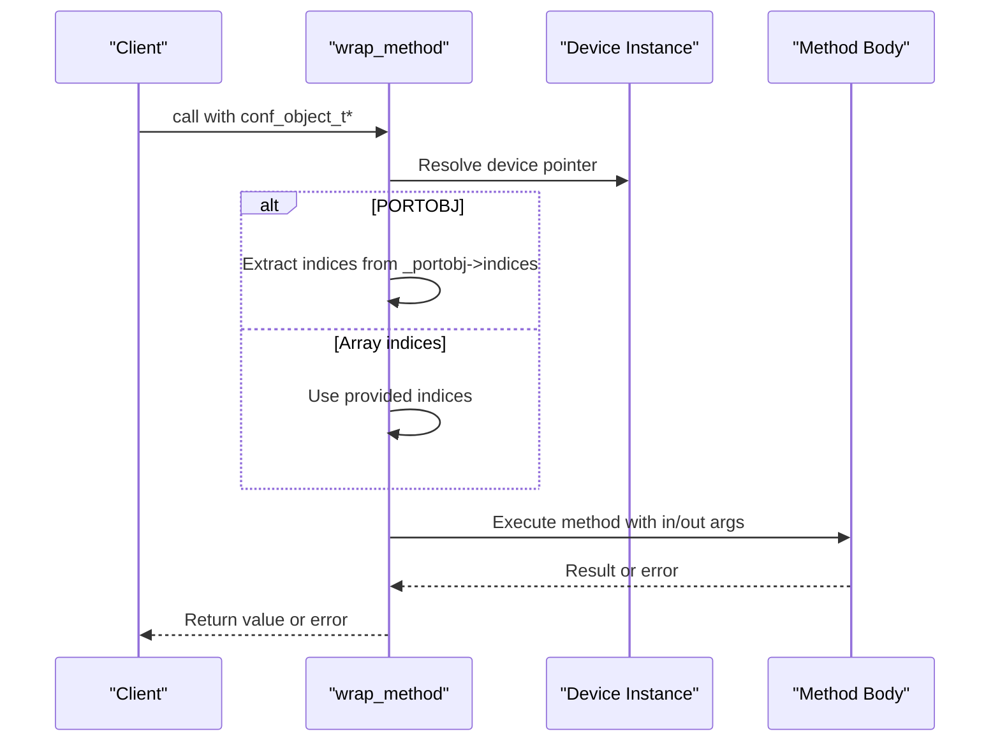

**Diagram sources**
- [c_backend.py](file://py/dml/c_backend.py#L712-L763)

**Section sources**
- [c_backend.py](file://py/dml/c_backend.py#L712-L763)

### Static Trampoline Creation
- Static trampolines are emitted for non-independent methods to ensure correct device context and to bridge to the generated function.
- They assert the object pointer and class identity, set the device pointer, call the generated function, and notify state changes.

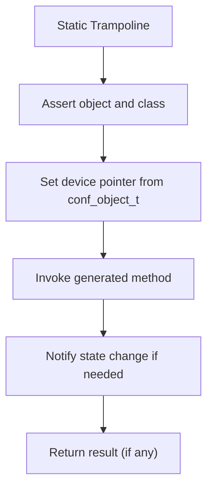

**Diagram sources**
- [c_backend.py](file://py/dml/c_backend.py#L2027-L2047)

**Section sources**
- [c_backend.py](file://py/dml/c_backend.py#L2027-L2047)

### Extern Trampoline Creation (1.4 Export)
- Extern trampolines are emitted for exported methods in DML 1.4.
- They forward to the static trampoline for non-independent methods or directly to the generated function for independent methods.
- They ensure exported names are consistent with the DML version and independence.

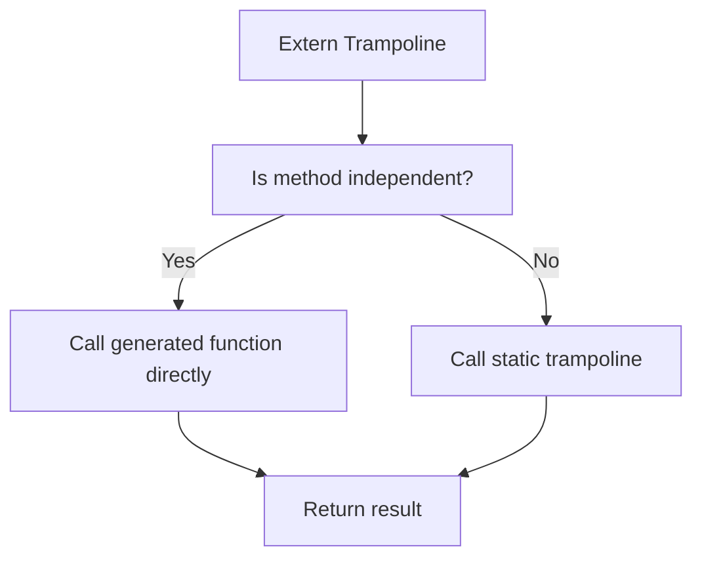

**Diagram sources**
- [c_backend.py](file://py/dml/c_backend.py#L2049-L2072)

**Section sources**
- [c_backend.py](file://py/dml/c_backend.py#L2049-L2072)

### Implementation Method Generation for Interface Compliance
- Trait methods define signatures and bodies for vtables.
- The trait method body is generated with appropriate failure and exit handlers, memoization support, and default method resolution.
- The generated function is emitted with a stable C name and signature.

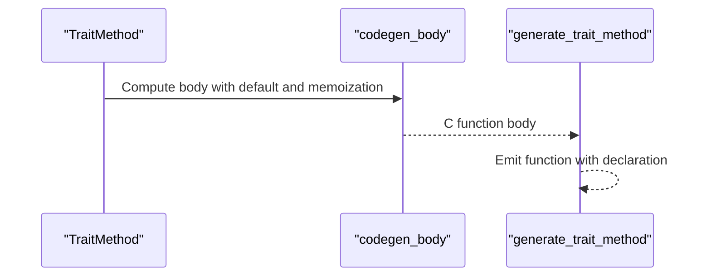

**Diagram sources**
- [traits.py](file://py/dml/traits.py#L218-L271)
- [c_backend.py](file://py/dml/c_backend.py#L2184-L2194)

**Section sources**
- [traits.py](file://py/dml/traits.py#L218-L271)
- [c_backend.py](file://py/dml/c_backend.py#L2184-L2194)

### Method Dispatch Mechanisms
- Method dispatch occurs at call-sites via codegen_call, which verifies argument types and constructs the call expression.
- For trait methods, codegen_call_traitmethod handles implicit endian integer conversions and constructs the call accordingly.
- Calls may be intercepted for special handling (e.g., memoized or startup methods).

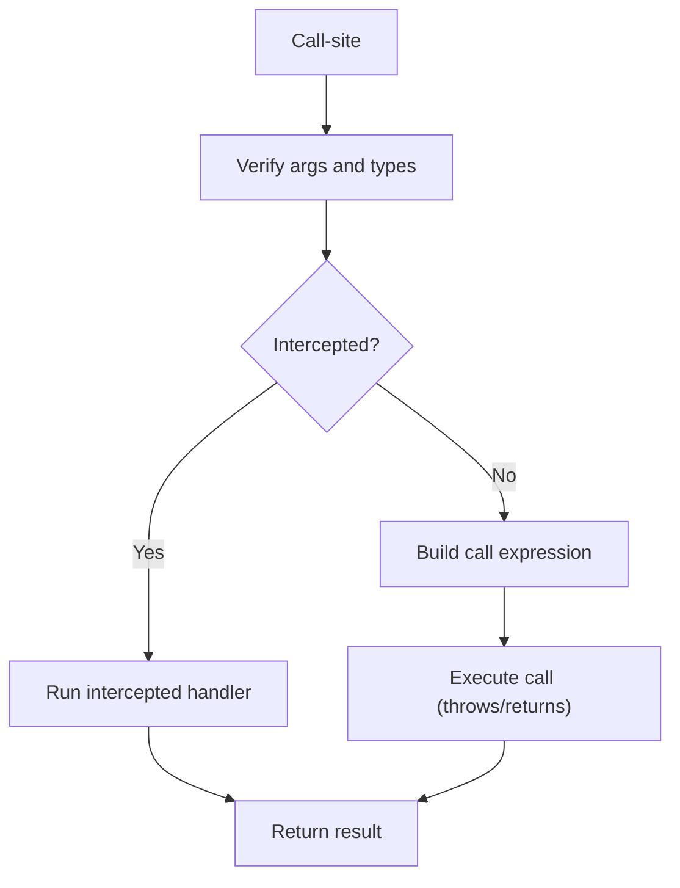

**Diagram sources**
- [codegen.py](file://py/dml/codegen.py#L4035-L4065)
- [codegen.py](file://py/dml/codegen.py#L4022-L4033)

**Section sources**
- [codegen.py](file://py/dml/codegen.py#L4035-L4065)
- [codegen.py](file://py/dml/codegen.py#L4022-L4033)

### Parameter Marshalling and Output Argument Management
- Input parameters are type-checked against the method signature.
- Output arguments are managed via proxy variables to prevent corruption on exceptions:
  - A proxy variable is allocated per output parameter.
  - The proxy is passed to the generated function.
  - After the call, the proxy value is copied back to the original output argument.
- For throws=true, the call is wrapped in a conditional that invokes the current failure handler on error.
- For throws=false, the call result is directly assigned to the first output argument if present.

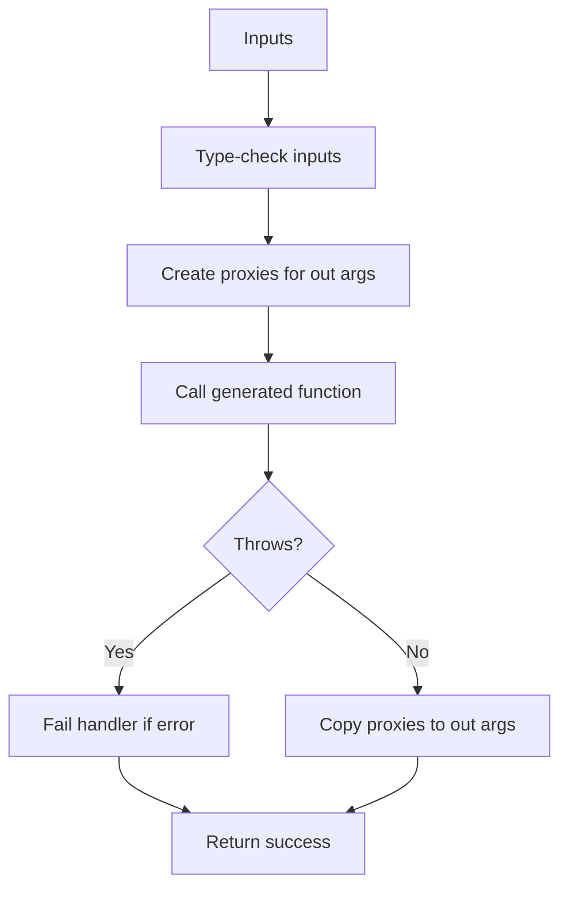

**Diagram sources**
- [codegen.py](file://py/dml/codegen.py#L4096-L4137)
- [codegen.py](file://py/dml/codegen.py#L4067-L4094)

**Section sources**
- [codegen.py](file://py/dml/codegen.py#L4096-L4137)
- [codegen.py](file://py/dml/codegen.py#L4067-L4094)

### Handling of Method Arrays, Dimension Parameters, and Port Objects
- Method arrays and dimensions:
  - Implicit indices are added to the signature for multi-dimensional methods.
  - Index assertions are emitted for 1.4 methods to validate bounds.
- Port object integration:
  - For port-object wrappers, the wrapper extracts indices from the port object’s index array and uses them to call the method.
  - The wrapper resolves the device pointer from the port object and ensures correct context.

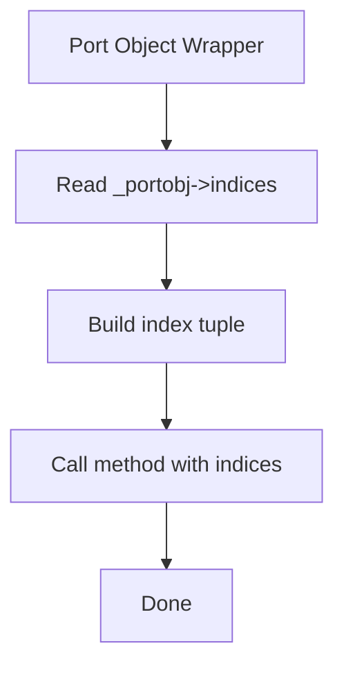

**Diagram sources**
- [c_backend.py](file://py/dml/c_backend.py#L712-L763)

**Section sources**
- [c_backend.py](file://py/dml/c_backend.py#L712-L763)

## Dependency Analysis
The following diagram shows key dependencies among the modules involved in method and function generation:

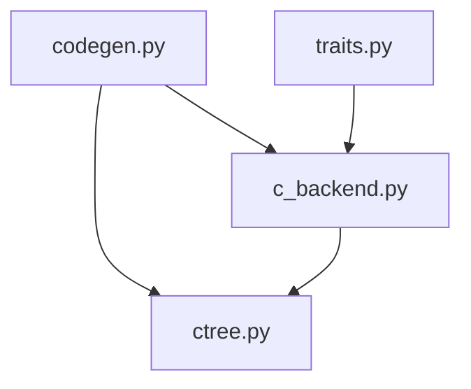

**Diagram sources**
- [codegen.py](file://py/dml/codegen.py#L1-L50)
- [c_backend.py](file://py/dml/c_backend.py#L1-L30)
- [ctree.py](file://py/dml/ctree.py#L1-L30)
- [traits.py](file://py/dml/traits.py#L1-L30)

**Section sources**
- [codegen.py](file://py/dml/codegen.py#L1-L50)
- [c_backend.py](file://py/dml/c_backend.py#L1-L30)
- [ctree.py](file://py/dml/ctree.py#L1-L30)
- [traits.py](file://py/dml/traits.py#L1-L30)

## Performance Considerations
- Minimizing allocations: Output argument proxies are allocated once per call and reused within the call scope.
- Early return paths: Failure handlers and exit handlers avoid unnecessary work when exceptions occur.
- Static trampolines: Reuse of trampolines reduces overhead for repeated calls to non-independent methods.
- Memoization: For independent and startup methods, memoization avoids recomputation and improves performance.

## Troubleshooting Guide
Common issues and diagnostics:
- Name collisions for exported methods: When multiple export statements use the same name, a name collision error is reported.
- Missing output argument types: If output argument types are not fully inferred, a type error is raised.
- Incorrect number of return values: Mismatches between declared outputs and provided return values trigger an error.
- Port object index mismatches: Using incorrect indices or mismatched dimensions leads to assertion failures or runtime errors.

**Section sources**
- [codegen.py](file://py/dml/codegen.py#L3975-L3987)
- [codegen.py](file://py/dml/codegen.py#L4004-L4012)
- [codegen.py](file://py/dml/codegen.py#L3852-L3856)
- [c_backend.py](file://py/dml/c_backend.py#L712-L763)

## Conclusion
The DML backend transforms methods and functions into robust C-callable interfaces. It manages signatures, marshals parameters, handles output arguments safely, and propagates errors appropriately. Static and extern trampolines ensure correct dispatch and context handling, while wrappers integrate port objects and method arrays seamlessly. The trait-based method generation guarantees interface compliance and supports advanced features like memoization and default method resolution.