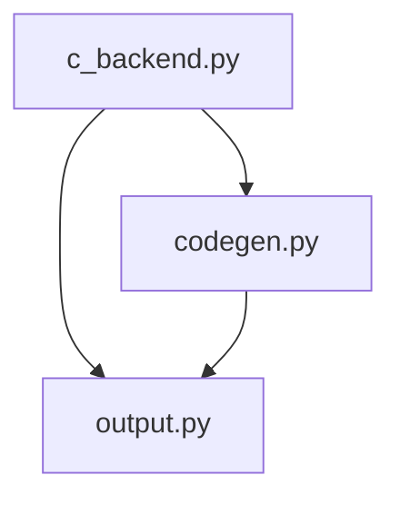
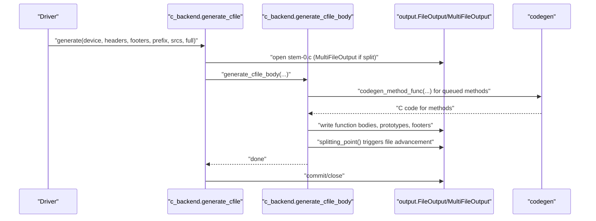
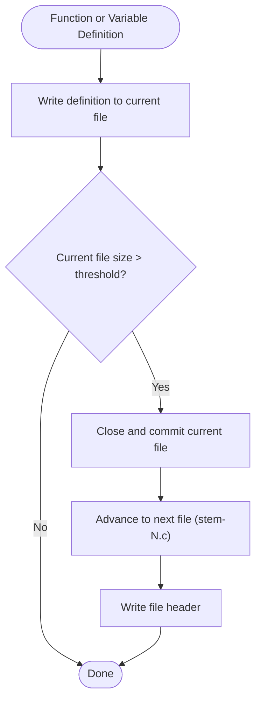
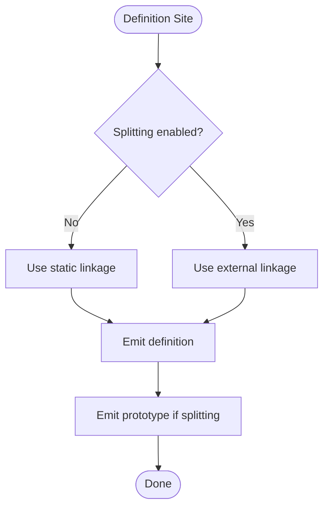
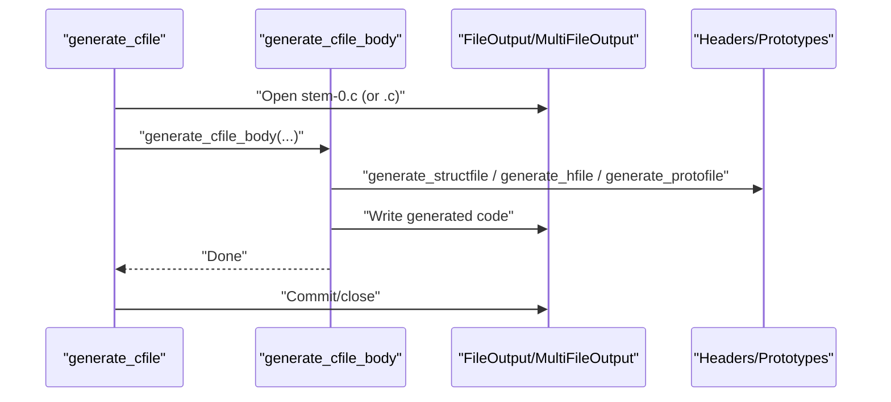
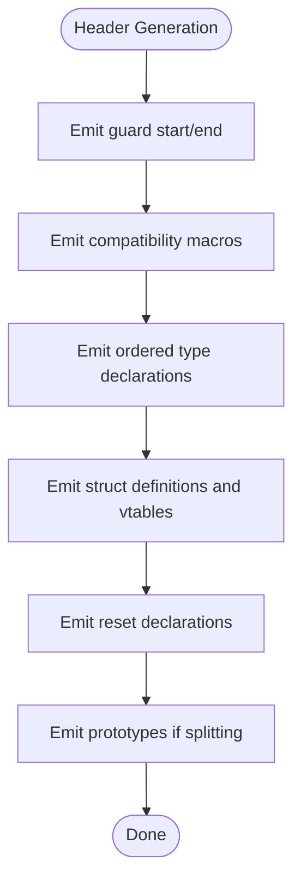
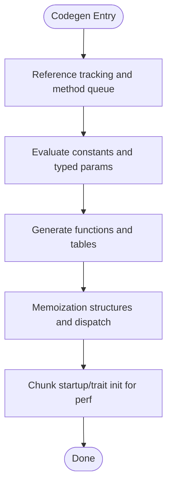
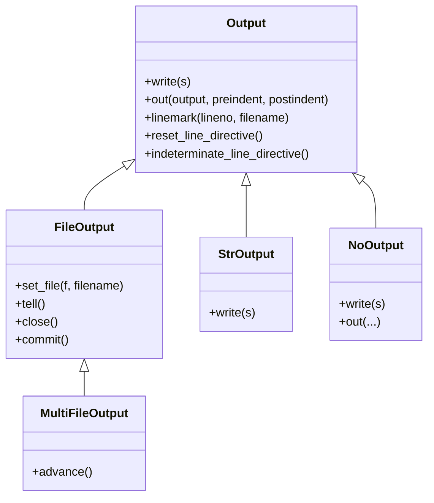

# Optimization and Output Management

<cite>
**Referenced Files in This Document**
- [c_backend.py](file://py/dml/c_backend.py)
- [codegen.py](file://py/dml/codegen.py)
- [output.py](file://py/dml/output.py)
</cite>

## Table of Contents
1. [Introduction](#introduction)
2. [Project Structure](#project-structure)
3. [Core Components](#core-components)
4. [Architecture Overview](#architecture-overview)
5. [Detailed Component Analysis](#detailed-component-analysis)
6. [Dependency Analysis](#dependency-analysis)
7. [Performance Considerations](#performance-considerations)
8. [Troubleshooting Guide](#troubleshooting-guide)
9. [Conclusion](#conclusion)

## Introduction
This document explains the optimization techniques and output management strategies used by the C backend during code generation for large device models. It covers:
- Code splitting strategies and the splitting threshold mechanism
- Function grouping and linkage decisions
- Output file management for multi-file generation
- Optimization passes and related code generation choices
- Output formatting, header generation, and include directive management
- Prototype generation and guard macro management
- Integration with the broader compilation pipeline and output stream management

## Project Structure
The C backend orchestrates code generation through a small set of focused modules:
- c_backend.py: Top-level generation logic, splitting, file management, headers, guards, and function grouping/linkage
- codegen.py: Method code generation, failure handling, memoization, and auxiliary structures
- output.py: Output stream abstraction, file commit semantics, and line directive management

**Diagram sources**
- [c_backend.py](file://py/dml/c_backend.py#L3235-L3552)
- [codegen.py](file://py/dml/codegen.py#L1-L120)
- [output.py](file://py/dml/output.py#L28-L137)

**Section sources**
- [c_backend.py](file://py/dml/c_backend.py#L3235-L3552)
- [codegen.py](file://py/dml/codegen.py#L1-L120)
- [output.py](file://py/dml/output.py#L28-L137)

## Core Components
- MultiFileOutput and splitting_point: Implements multi-file output and splitting based on a configurable threshold
- start_function_definition and add_variable_declaration: Enforce function and variable linkage rules and prototype emission
- generate_cfile and generate_cfile_body: Drive the generation pipeline, including headers, prototypes, and footers
- Output stream abstractions: FileOutput, StrOutput, and NoOutput manage output buffering, commits, and line directives

Key responsibilities:
- Optimize for large models by splitting C files at strategic boundaries
- Emit prototypes and static linkage appropriately to reduce cross-file dependencies
- Manage header guards and include directives for generated headers
- Control line directives and coverity markers for debuggability and static analysis

**Section sources**
- [c_backend.py](file://py/dml/c_backend.py#L3235-L3277)
- [c_backend.py](file://py/dml/c_backend.py#L3254-L3267)
- [c_backend.py](file://py/dml/c_backend.py#L3279-L3313)
- [c_backend.py](file://py/dml/c_backend.py#L3314-L3552)
- [output.py](file://py/dml/output.py#L28-L137)

## Architecture Overview
The C backend’s generation flow integrates code generation, output streaming, and file management:

**Diagram sources**
- [c_backend.py](file://py/dml/c_backend.py#L3279-L3313)
- [c_backend.py](file://py/dml/c_backend.py#L3314-L3552)
- [output.py](file://py/dml/output.py#L99-L126)
- [codegen.py](file://py/dml/codegen.py#L3380-L3424)

## Detailed Component Analysis

### Code Splitting Strategies and Threshold Mechanism
- MultiFileOutput extends FileOutput to support multi-file generation. It writes a header to each file and advances to the next file when the current file exceeds a size threshold.
- splitting_point is invoked after emitting each function or variable definition. It checks the current file’s byte position against c_split_threshold and, if exceeded, closes the current file, commits it, opens the next file, and writes the header again.
- Linkage control: start_function_definition and add_variable_declaration set static linkage when not splitting, and external linkage when splitting, to minimize cross-file dependencies and reduce recompilation impact.

**Diagram sources**
- [c_backend.py](file://py/dml/c_backend.py#L3235-L3277)
- [c_backend.py](file://py/dml/c_backend.py#L3269-L3277)
- [output.py](file://py/dml/output.py#L115-L126)

**Section sources**
- [c_backend.py](file://py/dml/c_backend.py#L3235-L3277)
- [c_backend.py](file://py/dml/c_backend.py#L3254-L3267)
- [output.py](file://py/dml/output.py#L99-L126)

### Function Grouping and Linkage Decisions
- start_function_definition enforces linkage:
  - Static linkage when not splitting (local to the generated translation unit)
  - External linkage when splitting (exposed across files)
- add_variable_declaration similarly manages linkage and prototype emission:
  - Emits prototypes globally when splitting
  - Uses static linkage when not splitting
- This ensures that:
  - Large models remain compilable by avoiding excessive inter-file dependencies
  - Generated functions and variables are visible where needed

**Diagram sources**
- [c_backend.py](file://py/dml/c_backend.py#L3254-L3267)

**Section sources**
- [c_backend.py](file://py/dml/c_backend.py#L3254-L3267)

### Output File Management for Generated C Code
- generate_cfile sets up the top-of-file header, selects MultiFileOutput if splitting is enabled, and delegates to generate_cfile_body.
- generate_cfile_body orchestrates:
  - Initialization code assembly (init_code buffer)
  - Generation of device lifecycle functions, events, traits, and methods
  - Registration of attributes, hooks, and serialized state
  - Footer emission and finalization
- The pipeline emits three artifacts:
  - Device-specific .c file(s)
  - Struct header (-struct.h)
  - Public header (.h)
  - Prototypes file (-protos.c)

**Diagram sources**
- [c_backend.py](file://py/dml/c_backend.py#L3279-L3313)
- [c_backend.py](file://py/dml/c_backend.py#L3522-L3552)

**Section sources**
- [c_backend.py](file://py/dml/c_backend.py#L3279-L3313)
- [c_backend.py](file://py/dml/c_backend.py#L3522-L3552)

### Header File Generation and Include Directive Management
- generate_hfile emits:
  - Guard macros derived from the filename
  - Compatibility and prefix macros
  - Ordered type declarations respecting C forward-declaration constraints
  - Struct definitions and trait vtables
  - Device reset declarations and STATIC_ASSERT for device struct sizing
- generate_structfile emits:
  - Forward declaration of the device struct type
  - Initialization function declaration
  - Exported method declarations when applicable
- generate_protofile emits function prototypes with appropriate linkage for multi-file builds.

**Diagram sources**
- [c_backend.py](file://py/dml/c_backend.py#L239-L373)
- [c_backend.py](file://py/dml/c_backend.py#L374-L379)
- [c_backend.py](file://py/dml/c_backend.py#L2399-L2400)

**Section sources**
- [c_backend.py](file://py/dml/c_backend.py#L239-L373)
- [c_backend.py](file://py/dml/c_backend.py#L374-L379)
- [c_backend.py](file://py/dml/c_backend.py#L2399-L2400)

### Optimization Passes and Related Code Generation Choices
- Dead code elimination:
  - Methods are queued and generated only when referenced. Unused methods are not emitted, reducing binary size and compilation time.
  - The backend reports unused methods in porting mode to guide migration.
- Constant folding and propagation:
  - Static initializers and typed parameters are evaluated early, enabling constant propagation where applicable.
  - Some expressions are emitted as static allocations or aligned temporaries to improve performance and meet ABI constraints.
- Memory layout optimization:
  - Device struct sizing is constrained via a compile-time assertion to fit within 32-bit offsets, encouraging compact layouts.
  - Index enumeration tables and tuple tables are precomputed to avoid runtime overhead.
- Memoization:
  - Memoized methods and trait methods use dedicated structures and switch-based dispatch to cache results and avoid recomputation.
- Startup and trait initialization:
  - Startup calls are chunked into small functions to mitigate compiler performance issues with variable tracking.

**Diagram sources**
- [codegen.py](file://py/dml/codegen.py#L87-L94)
- [c_backend.py](file://py/dml/c_backend.py#L1548-L1559)
- [c_backend.py](file://py/dml/c_backend.py#L2671-L2693)

**Section sources**
- [codegen.py](file://py/dml/codegen.py#L87-L94)
- [c_backend.py](file://py/dml/c_backend.py#L1548-L1559)
- [c_backend.py](file://py/dml/c_backend.py#L2671-L2693)

### Integration with the Broader Compilation Pipeline and Output Stream Management
- Output stream management:
  - FileOutput writes to a temporary file and atomically renames upon commit, preventing partial writes.
  - MultiFileOutput extends this to rotate files when the threshold is exceeded.
  - StrOutput captures generated code for later insertion into buffers (e.g., init_code) or for size statistics.
  - NoOutput suppresses output for diagnostics runs.
- Line directive and debug support:
  - allow_linemarks and disallow_linemarks control emission of #line directives and coverity markers.
  - site_linemark and reset_line_directive maintain accurate source locations for errors and debuggers.
- Full module exports:
  - For legacy API versions, a local init wrapper is emitted to expose the initialization routine.

**Diagram sources**
- [output.py](file://py/dml/output.py#L28-L137)
- [output.py](file://py/dml/output.py#L99-L126)
- [output.py](file://py/dml/output.py#L127-L137)
- [output.py](file://py/dml/output.py#L93-L98)
- [c_backend.py](file://py/dml/c_backend.py#L3235-L3250)

**Section sources**
- [output.py](file://py/dml/output.py#L28-L137)
- [output.py](file://py/dml/output.py#L99-L126)
- [c_backend.py](file://py/dml/c_backend.py#L3235-L3250)

## Dependency Analysis
- c_backend.py depends on:
  - codegen.py for method code generation and failure/memoization constructs
  - output.py for output streams and line directive management
- codegen.py depends on:
  - ctree/expression/type systems for AST manipulation and type checking
  - output.py for emitting code into the current output context
- output.py is foundational and used by both modules for file management and formatting.

**Diagram sources**
- [c_backend.py](file://py/dml/c_backend.py#L15-L27)
- [codegen.py](file://py/dml/codegen.py#L14-L26)
- [output.py](file://py/dml/output.py#L1-L26)

**Section sources**
- [c_backend.py](file://py/dml/c_backend.py#L15-L27)
- [codegen.py](file://py/dml/codegen.py#L14-L26)
- [output.py](file://py/dml/output.py#L1-L26)

## Performance Considerations
- Multi-file generation reduces per-file complexity and improves incremental build performance by limiting cross-file dependencies.
- Static linkage in non-split mode minimizes symbol visibility and reduces linker overhead.
- Chunked initialization of traits and startup calls mitigates compiler performance regressions with variable tracking.
- Precomputed index and tuple tables eliminate runtime loops and improve hot-path performance.
- Early evaluation of constants and typed parameters reduces dynamic computation in generated code.

[No sources needed since this section provides general guidance]

## Troubleshooting Guide
- Splitting not occurring:
  - Verify c_split_threshold is configured and that splitting_point is invoked after function/variable definitions.
- Incorrect linkage or unresolved symbols:
  - Ensure start_function_definition/add_variable_declaration are used for definitions; prototypes are emitted when splitting.
- Partial or corrupted output files:
  - Confirm FileOutput/MultiFileOutput commit semantics are respected; temporary files are renamed atomically.
- Debugging line numbers:
  - Use allow_linemarks/disallow_linemarks around sections where line directives must be emitted or suppressed.
- Unused method warnings:
  - Review porting diagnostics to identify methods that are not referenced and thus not generated.

**Section sources**
- [c_backend.py](file://py/dml/c_backend.py#L3269-L3277)
- [c_backend.py](file://py/dml/c_backend.py#L3254-L3267)
- [output.py](file://py/dml/output.py#L115-L126)
- [output.py](file://py/dml/output.py#L235-L263)

## Conclusion
The C backend employs a robust combination of output stream management, function grouping, and multi-file splitting to scale code generation for large device models. By controlling linkage, emitting prototypes judiciously, and leveraging chunked initialization, it achieves improved compilation performance and reduced cross-file coupling. The header and include management, guard macros, and line directive controls further enhance debuggability and integration with the broader compilation pipeline.