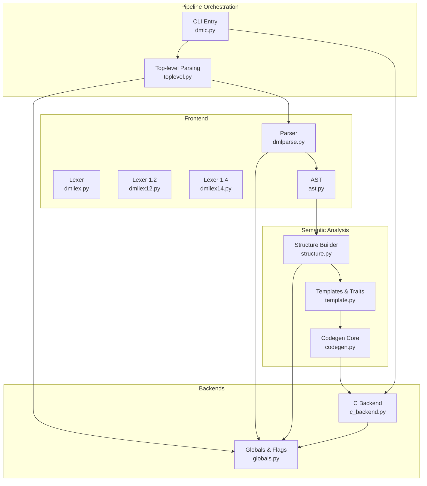
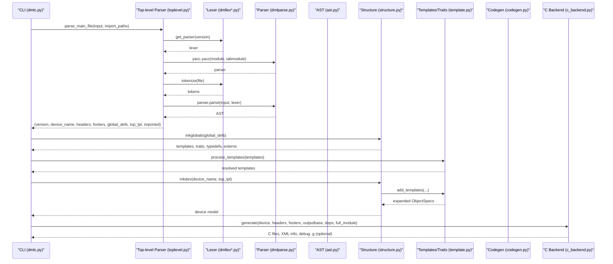
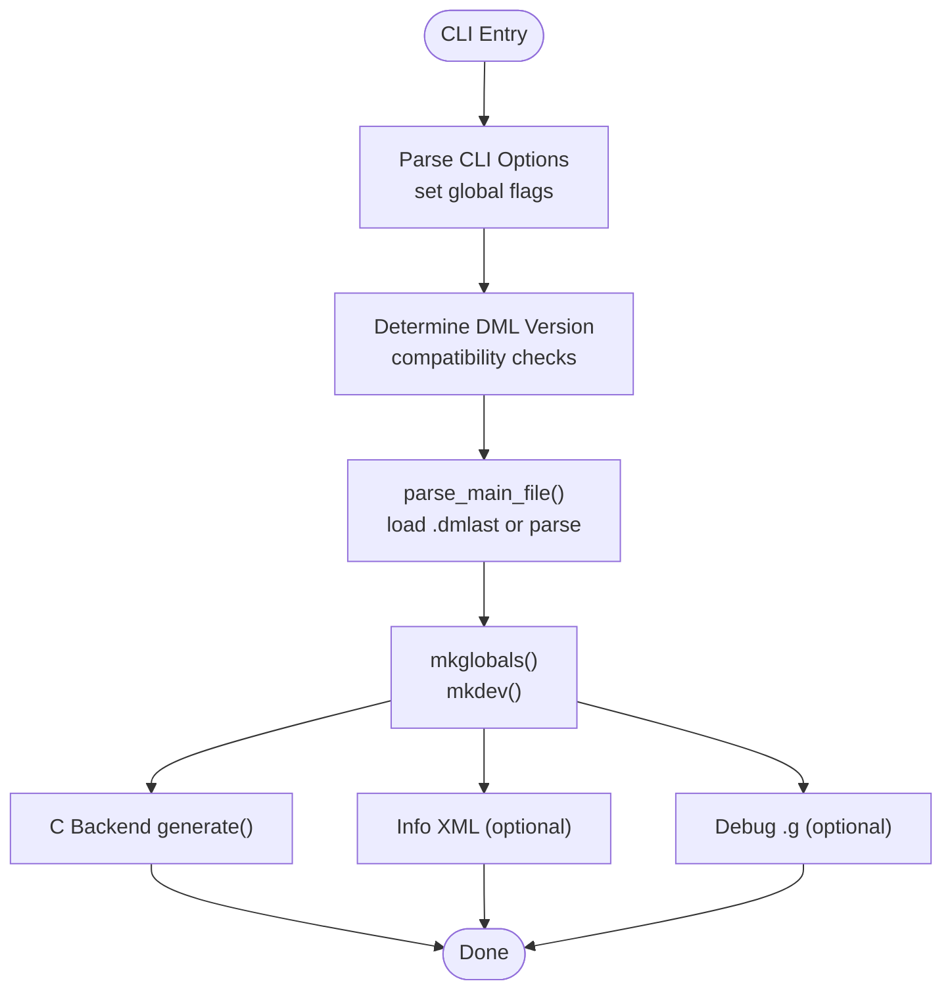
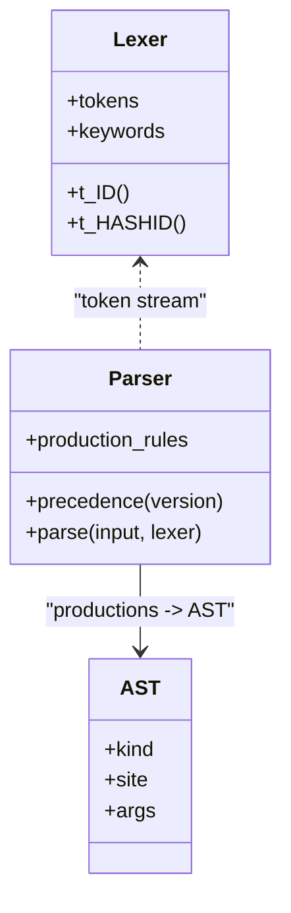
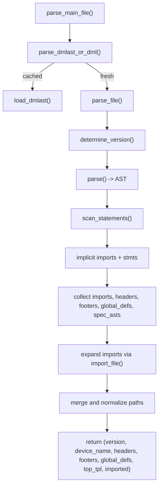
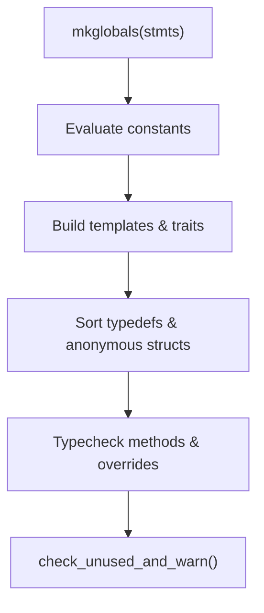
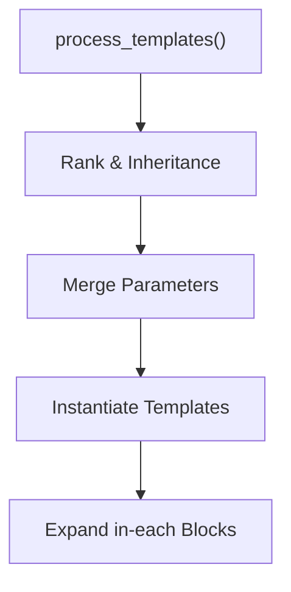
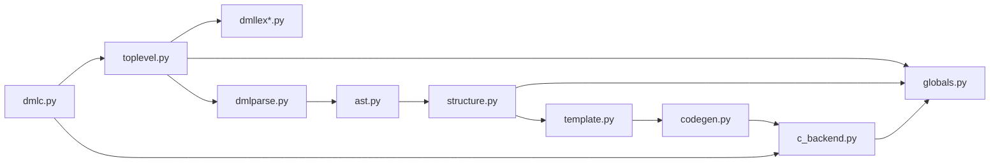

# Compilation Pipeline Overview

<cite>
**Referenced Files in This Document**
- [dmlc.py](file://py/dml/dmlc.py)
- [toplevel.py](file://py/dml/toplevel.py)
- [dmllex.py](file://py/dml/dmllex.py)
- [dmllex12.py](file://py/dml/dmllex12.py)
- [dmllex14.py](file://py/dml/dmllex14.py)
- [dmlparse.py](file://py/dml/dmlparse.py)
- [ast.py](file://py/dml/ast.py)
- [structure.py](file://py/dml/structure.py)
- [template.py](file://py/dml/template.py)
- [codegen.py](file://py/dml/codegen.py)
- [c_backend.py](file://py/dml/c_backend.py)
- [globals.py](file://py/dml/globals.py)
</cite>

## Table of Contents
1. [Introduction](#introduction)
2. [Project Structure](#project-structure)
3. [Core Components](#core-components)
4. [Architecture Overview](#architecture-overview)
5. [Detailed Component Analysis](#detailed-component-analysis)
6. [Dependency Analysis](#dependency-analysis)
7. [Performance Considerations](#performance-considerations)
8. [Troubleshooting Guide](#troubleshooting-guide)
9. [Conclusion](#conclusion)

## Introduction
This document explains the DML compilation pipeline architecture, covering the multi-stage process from DML source parsing through AST construction, semantic analysis, template processing, and code generation. It documents the pipeline orchestration, stage dependencies, and data flow between components. It also describes how language versions 1.2 and 1.4 influence the pipeline, error handling mechanisms, and the coordination between frontend parsing and backend code generation.

## Project Structure
The DML compiler is implemented primarily in the py/dml package. Key modules include:
- Command-line entry point and orchestration
- Frontend parsing (lexer and parser)
- AST representation and dispatch
- Semantic analysis and structure building
- Template processing and trait resolution
- Code generation to C and auxiliary outputs
- Global state and compatibility flags

**Diagram sources**
- [dmlc.py](file://py/dml/dmlc.py#L309-L760)
- [toplevel.py](file://py/dml/toplevel.py#L39-L64)
- [dmllex.py](file://py/dml/dmllex.py#L1-L280)
- [dmllex12.py](file://py/dml/dmllex12.py#L1-L21)
- [dmllex14.py](file://py/dml/dmllex14.py#L1-L44)
- [dmlparse.py](file://py/dml/dmlparse.py#L1-L120)
- [ast.py](file://py/dml/ast.py#L1-L172)
- [structure.py](file://py/dml/structure.py#L74-L287)
- [template.py](file://py/dml/template.py#L1-L200)
- [codegen.py](file://py/dml/codegen.py#L1-L200)
- [c_backend.py](file://py/dml/c_backend.py#L1-L120)
- [globals.py](file://py/dml/globals.py#L1-L107)

**Section sources**
- [dmlc.py](file://py/dml/dmlc.py#L309-L760)
- [toplevel.py](file://py/dml/toplevel.py#L39-L64)

## Core Components
- CLI entry point orchestrates parsing, processing, and code generation, and manages flags for warnings, compatibility, and output modes.
- Top-level parsing discovers the DML version, loads/produces .dmlast cache, expands imports, and categorizes top-level statements.
- Lexer and parser select version-specific lexical rules and grammar productions to build an AST.
- AST defines nodes and dispatch mechanism for later transformations.
- Structure builder evaluates global constants, builds templates and traits, sorts type declarations, and performs method override/type checks.
- Template processor resolves template ranks, merges parameters, and instantiates templates.
- Code generation core handles method queues, failure handling, and inline/invoke code generation.
- C backend emits C headers/types, attributes, methods, and device initialization, coordinating with global flags and compatibility settings.

**Section sources**
- [dmlc.py](file://py/dml/dmlc.py#L309-L760)
- [toplevel.py](file://py/dml/toplevel.py#L114-L127)
- [dmllex.py](file://py/dml/dmllex.py#L1-L280)
- [dmllex12.py](file://py/dml/dmllex12.py#L1-L21)
- [dmllex14.py](file://py/dml/dmllex14.py#L1-L44)
- [dmlparse.py](file://py/dml/dmlparse.py#L1-L120)
- [ast.py](file://py/dml/ast.py#L1-L172)
- [structure.py](file://py/dml/structure.py#L74-L287)
- [template.py](file://py/dml/template.py#L1-L200)
- [codegen.py](file://py/dml/codegen.py#L1-L200)
- [c_backend.py](file://py/dml/c_backend.py#L1-L120)
- [globals.py](file://py/dml/globals.py#L1-L107)

## Architecture Overview
The pipeline is orchestrated by the CLI entry point, which:
- Parses command-line options and sets global flags (warnings, compatibility, debuggable, split C file threshold).
- Invokes top-level parsing to determine DML version, load cached AST if available, and import dependencies.
- Processes the AST into a device model via structure building and template instantiation.
- Generates C output and optional auxiliary artifacts (info XML, debug .g).

**Diagram sources**
- [dmlc.py](file://py/dml/dmlc.py#L676-L760)
- [toplevel.py](file://py/dml/toplevel.py#L39-L64)
- [dmllex.py](file://py/dml/dmllex.py#L1-L280)
- [dmllex12.py](file://py/dml/dmllex12.py#L1-L21)
- [dmllex14.py](file://py/dml/dmllex14.py#L1-L44)
- [dmlparse.py](file://py/dml/dmlparse.py#L1-L120)
- [ast.py](file://py/dml/ast.py#L1-L172)
- [structure.py](file://py/dml/structure.py#L74-L287)
- [template.py](file://py/dml/template.py#L1-L200)
- [codegen.py](file://py/dml/codegen.py#L1-L200)
- [c_backend.py](file://py/dml/c_backend.py#L1-L120)

## Detailed Component Analysis

### CLI Orchestration and Pipeline Entry
- Parses CLI options, sets global flags (warnings, compatibility, debuggable, split thresholds), and initializes profiling/logging.
- Determines DML version from the source and enforces compatibility constraints.
- Coordinates dependency generation, AI diagnostics export, and porting logs.
- Executes the pipeline stages and reports failures or exits with appropriate codes.

**Diagram sources**
- [dmlc.py](file://py/dml/dmlc.py#L309-L760)
- [toplevel.py](file://py/dml/toplevel.py#L39-L64)

**Section sources**
- [dmlc.py](file://py/dml/dmlc.py#L309-L760)

### Frontend Parsing: Lexing and Parsing
- Lexer modules define tokens and keywords for both versions. Version 1.2 adds legacy tokens; 1.4 introduces hash-prefixed keywords and operators.
- Parser selects grammar and precedence tables based on DML version and constructs AST nodes.
- Site tracking and extended span tracking are available for porting diagnostics.

**Diagram sources**
- [dmllex.py](file://py/dml/dmllex.py#L1-L280)
- [dmllex12.py](file://py/dml/dmllex12.py#L1-L21)
- [dmllex14.py](file://py/dml/dmllex14.py#L1-L44)
- [dmlparse.py](file://py/dml/dmlparse.py#L50-L120)
- [ast.py](file://py/dml/ast.py#L7-L31)

**Section sources**
- [dmllex.py](file://py/dml/dmllex.py#L1-L280)
- [dmllex12.py](file://py/dml/dmllex12.py#L1-L21)
- [dmllex14.py](file://py/dml/dmllex14.py#L1-L44)
- [dmlparse.py](file://py/dml/dmlparse.py#L50-L120)
- [ast.py](file://py/dml/ast.py#L7-L31)

### AST Construction and Dispatch
- AST nodes carry kind, site, and args. A dispatcher enables pattern-based traversal and transformation.
- The AST module centralizes node kinds and dispatch helpers.

**Section sources**
- [ast.py](file://py/dml/ast.py#L7-L172)

### Top-Level Parsing and Import Resolution
- Determines DML version, optionally warns for missing version statements under compatibility, and removes the version tag from input before parsing.
- Loads cached .dmlast when available and fresh; otherwise parses the file.
- Scans top-level statements into imports, headers, footers, global definitions, and device-spec AST fragments.
- Resolves imports across explicit and implicit paths, normalizing absolute paths and tracking dependency spellings.

**Diagram sources**
- [toplevel.py](file://py/dml/toplevel.py#L245-L458)

**Section sources**
- [toplevel.py](file://py/dml/toplevel.py#L66-L127)
- [toplevel.py](file://py/dml/toplevel.py#L129-L186)
- [toplevel.py](file://py/dml/toplevel.py#L245-L458)

### Semantic Analysis and Structure Building
- Evaluates global constants and symbols into a global scope.
- Processes templates and traits, sorts type declarations topologically, and validates type and method override compatibility.
- Checks unused symbols and reports warnings according to version-specific rules.

**Diagram sources**
- [structure.py](file://py/dml/structure.py#L74-L287)

**Section sources**
- [structure.py](file://py/dml/structure.py#L74-L287)

### Template Processing and Parameter Merging
- Templates are ranked and merged according to inheritance and precedence rules.
- Parameters are merged across ranks, with special handling for DML 1.2 and overrides.
- Instantiation wraps sites and expands in-each blocks.

**Diagram sources**
- [template.py](file://py/dml/template.py#L1-L200)

**Section sources**
- [template.py](file://py/dml/template.py#L1-L200)

### Code Generation Core
- Manages method queues, exported methods, and failure contexts.
- Provides inline and call generators, loop contexts, and failure handlers for robust code emission.
- Handles type evaluation, initializer generation, and method signature computation.

**Section sources**
- [codegen.py](file://py/dml/codegen.py#L1-L200)

### C Backend Generation
- Emits C headers, struct definitions, and attribute registration code.
- Generates getters/setters, method wrappers, and interface implementations.
- Supports splitting large C files, registering attributes, and emitting state-change notifications.

**Section sources**
- [c_backend.py](file://py/dml/c_backend.py#L1-L120)

### Global State and Compatibility
- Maintains DML version, API version, compatibility flags, and global structures for code generation.
- Controls debuggable mode, coverity pragmas, and line marking behavior.

**Section sources**
- [globals.py](file://py/dml/globals.py#L1-L107)

## Dependency Analysis
The pipeline exhibits tight coupling between frontend and backend modules, with clear separation of concerns:
- Frontend (lexer/parser/AST) produces a version-aware AST.
- Semantic analysis consumes AST to build templates, traits, and type graphs.
- Code generation consumes the structured model to emit C and auxiliary outputs.
- CLI coordinates all stages and applies global flags.

**Diagram sources**
- [dmlc.py](file://py/dml/dmlc.py#L309-L760)
- [toplevel.py](file://py/dml/toplevel.py#L39-L64)
- [dmllex.py](file://py/dml/dmllex.py#L1-L280)
- [dmllex12.py](file://py/dml/dmllex12.py#L1-L21)
- [dmllex14.py](file://py/dml/dmllex14.py#L1-L44)
- [dmlparse.py](file://py/dml/dmlparse.py#L1-L120)
- [ast.py](file://py/dml/ast.py#L1-L172)
- [structure.py](file://py/dml/structure.py#L74-L287)
- [template.py](file://py/dml/template.py#L1-L200)
- [codegen.py](file://py/dml/codegen.py#L1-L200)
- [c_backend.py](file://py/dml/c_backend.py#L1-L120)
- [globals.py](file://py/dml/globals.py#L1-L107)

**Section sources**
- [dmlc.py](file://py/dml/dmlc.py#L309-L760)
- [toplevel.py](file://py/dml/toplevel.py#L39-L64)

## Performance Considerations
- Parser caching: .dmlast cache reduces repeated parsing and import expansion.
- Dependency tracking: The pipeline records imported files and their spellings to minimize redundant work.
- Splitting C output: Large devices can be split into multiple C files to improve build performance.
- Timing and profiling: Optional timing and profiling hooks can be enabled via environment variables.

[No sources needed since this section provides general guidance]

## Troubleshooting Guide
Common issues and diagnostics:
- Unexpected EOF or malformed version statements during parsing raise syntax errors with precise site information.
- Import errors and version mismatches between imported files and the main file are reported with actionable messages.
- Unused symbols and method overrides trigger warnings, with version-specific variants.
- Compatibility flags disable deprecated features and guide migration to newer API versions.
- Debuggable mode and AI diagnostics can be enabled to aid development and automated error reporting.

**Section sources**
- [toplevel.py](file://py/dml/toplevel.py#L245-L325)
- [toplevel.py](file://py/dml/toplevel.py#L334-L350)
- [structure.py](file://py/dml/structure.py#L449-L462)
- [dmlc.py](file://py/dml/dmlc.py#L766-L787)

## Conclusion
The DML compilation pipeline integrates a version-aware frontend, robust semantic analysis, template-driven object modeling, and a configurable C backend. The CLI orchestrates stages, enforces compatibility, and coordinates output generation. Version differences between 1.2 and 1.4 primarily affect lexing, parsing, and code generation semantics, while the core orchestration remains consistent. The design emphasizes modularity, diagnostics, and extensibility for evolving language features.