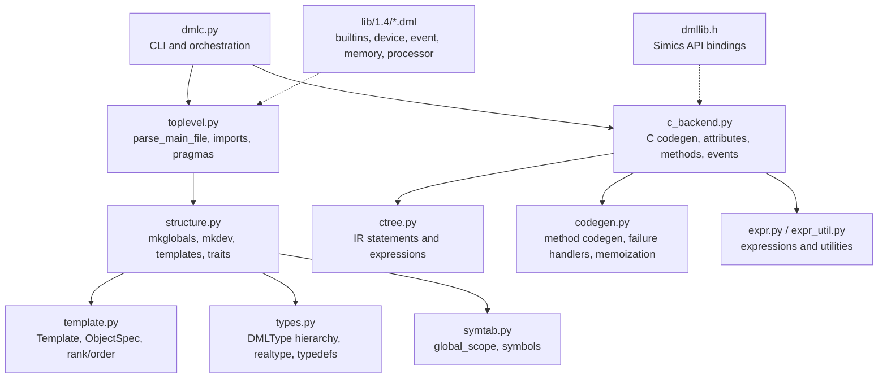
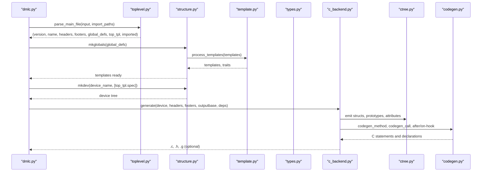
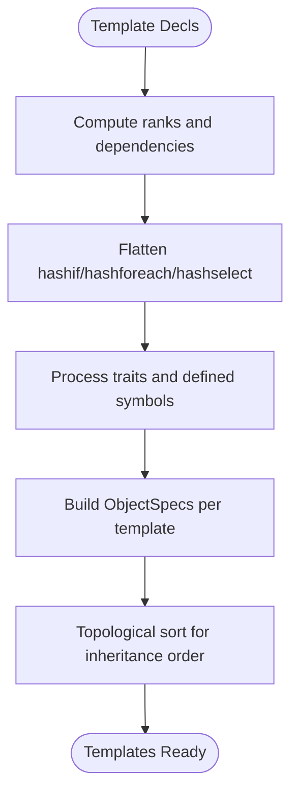
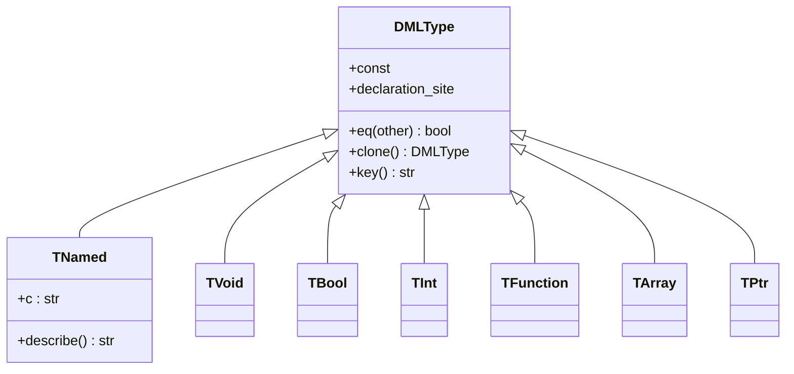
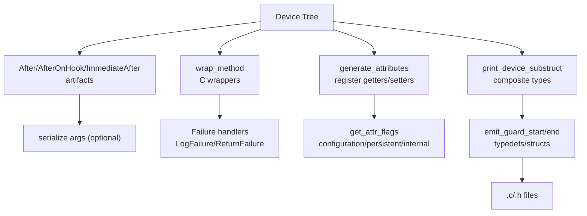
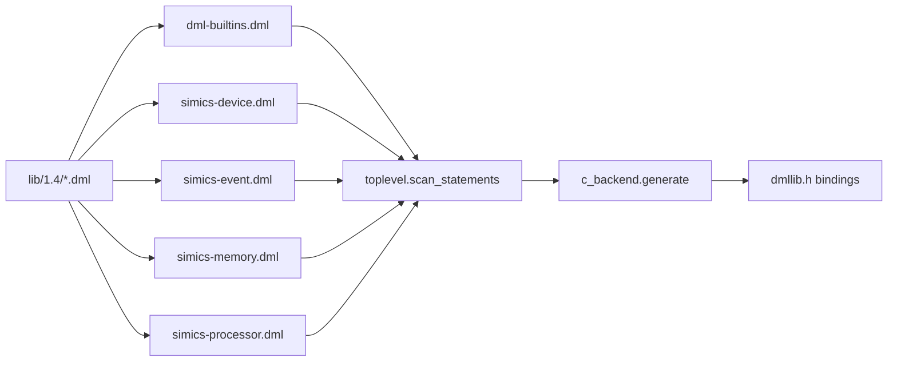
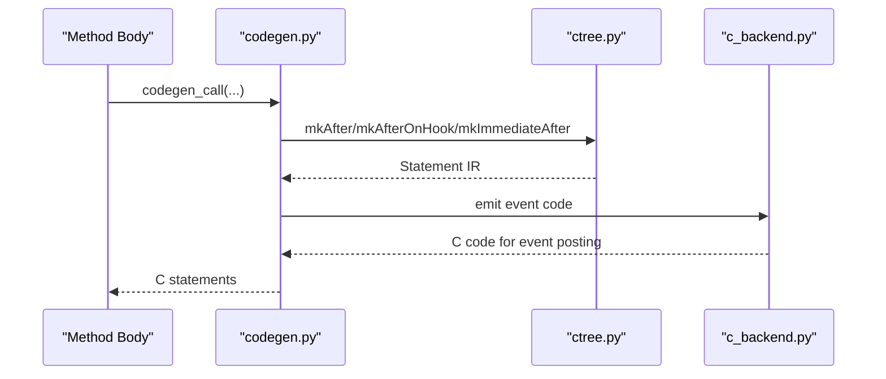
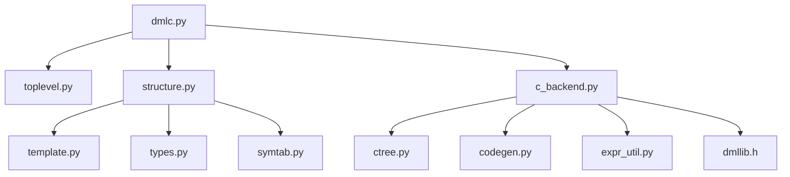

# Compilation and Code Generation

<cite>
**Referenced Files in This Document**
- [README.md](file://README.md)
- [dmlc.py](file://py/dml/dmlc.py)
- [toplevel.py](file://py/dml/toplevel.py)
- [structure.py](file://py/dml/structure.py)
- [template.py](file://py/dml/template.py)
- [types.py](file://py/dml/types.py)
- [ctree.py](file://py/dml/ctree.py)
- [c_backend.py](file://py/dml/c_backend.py)
- [codegen.py](file://py/dml/codegen.py)
- [symtab.py](file://py/dml/symtab.py)
- [expr.py](file://py/dml/expr.py)
- [expr_util.py](file://py/dml/expr_util.py)
- [dmllib.h](file://include/simics/dmllib.h)
- [dml-builtins.dml](file://lib/1.4/dml-builtins.dml)
- [simics-api.dml](file://lib/1.4/simics-api.dml)
- [simics-device.dml](file://lib/1.4/simics-device.dml)
- [simics-event.dml](file://lib/1.4/simics-event.dml)
- [simics-memory.dml](file://lib/1.4/simics-memory.dml)
- [simics-processor.dml](file://lib/1.4/simics-processor.dml)
- [utility.dml](file://lib/1.4/utility.dml)
</cite>

## Table of Contents
1. [Introduction](#introduction)
2. [Project Structure](#project-structure)
3. [Core Components](#core-components)
4. [Architecture Overview](#architecture-overview)
5. [Detailed Component Analysis](#detailed-component-analysis)
6. [Dependency Analysis](#dependency-analysis)
7. [Performance Considerations](#performance-considerations)
8. [Troubleshooting Guide](#troubleshooting-guide)
9. [Conclusion](#conclusion)

## Introduction
This document explains the Device Modeling Language (DML) compilation and code generation system. It covers the multi-stage pipeline from DML source to optimized C code, the C backend architecture and code generation strategies, Simics integration for API binding and device registration, debug information and symbol tables, and performance profiling. It also details AST transformations, template expansion, memory management, and event system integration in the generated code.

## Project Structure
The DML compiler is implemented in Python and organizes functionality into focused modules:
- Command-line entry point and orchestration
- Parsing and top-level scanning
- Template processing and object structure assembly
- Type system and symbol tables
- Code generation and C backend
- Event system and memory management helpers
- Library modules for Simics integration

**Diagram sources**
- [dmlc.py](file://py/dml/dmlc.py#L309-L800)
- [toplevel.py](file://py/dml/toplevel.py#L359-L459)
- [structure.py](file://py/dml/structure.py#L74-L275)
- [template.py](file://py/dml/template.py#L362-L433)
- [types.py](file://py/dml/types.py#L1-L120)
- [symtab.py](file://py/dml/symtab.py#L1-L120)
- [c_backend.py](file://py/dml/c_backend.py#L1-L120)
- [ctree.py](file://py/dml/ctree.py#L1-L120)
- [codegen.py](file://py/dml/codegen.py#L1-L120)
- [expr.py](file://py/dml/expr.py#L1-L120)
- [expr_util.py](file://py/dml/expr_util.py#L1-L120)
- [dmllib.h](file://include/simics/dmllib.h#L1-L120)
- [dml-builtins.dml](file://lib/1.4/dml-builtins.dml#L1-L120)
- [simics-api.dml](file://lib/1.4/simics-api.dml#L1-L120)
- [simics-device.dml](file://lib/1.4/simics-device.dml#L1-L120)
- [simics-event.dml](file://lib/1.4/simics-event.dml#L1-L120)
- [simics-memory.dml](file://lib/1.4/simics-memory.dml#L1-L120)
- [simics-processor.dml](file://lib/1.4/simics-processor.dml#L1-L120)
- [utility.dml](file://lib/1.4/utility.dml#L1-L120)

**Section sources**
- [README.md](file://README.md#L1-L117)
- [dmlc.py](file://py/dml/dmlc.py#L309-L800)
- [toplevel.py](file://py/dml/toplevel.py#L359-L459)

## Core Components
- CLI and orchestration: Parses options, sets globals, orchestrates parsing, structure building, and code generation.
- Parser and scanner: Determines DML version, parses files, expands imports, handles pragmas, and produces AST fragments.
- Templates and traits: Processes template hierarchies, ranks, and trait implementations; flattens conditions and in-each blocks.
- Types and symbols: Resolves named types, enforces type safety, manages global symbol tables.
- Code generation: Translates DML constructs to C, generates attributes, methods, events, and supporting structures.
- IR and expressions: Provides a typed intermediate representation for statements and expressions.
- Simics integration: Generates API bindings, device registration, and runtime behavior glue.

**Section sources**
- [dmlc.py](file://py/dml/dmlc.py#L309-L800)
- [toplevel.py](file://py/dml/toplevel.py#L114-L186)
- [structure.py](file://py/dml/structure.py#L74-L275)
- [template.py](file://py/dml/template.py#L362-L433)
- [types.py](file://py/dml/types.py#L120-L220)
- [symtab.py](file://py/dml/symtab.py#L1-L120)
- [c_backend.py](file://py/dml/c_backend.py#L1-L120)
- [ctree.py](file://py/dml/ctree.py#L1-L120)
- [codegen.py](file://py/dml/codegen.py#L1-L120)

## Architecture Overview
The DML compiler follows a staged pipeline:
1. Parse DML source and imports, determine language version, and collect top-level definitions.
2. Expand templates, compute ranks, and assemble object specifications.
3. Build global symbol tables, resolve types, and validate traits/methods.
4. Generate C code for device structures, attributes, methods, and event infrastructure.
5. Integrate with Simics APIs for device registration and runtime behavior.

**Diagram sources**
- [dmlc.py](file://py/dml/dmlc.py#L676-L760)
- [toplevel.py](file://py/dml/toplevel.py#L359-L459)
- [structure.py](file://py/dml/structure.py#L74-L275)
- [template.py](file://py/dml/template.py#L362-L433)
- [types.py](file://py/dml/types.py#L120-L220)
- [c_backend.py](file://py/dml/c_backend.py#L1-L120)
- [ctree.py](file://py/dml/ctree.py#L1-L120)
- [codegen.py](file://py/dml/codegen.py#L1-L120)

## Detailed Component Analysis

### Multi-stage Compilation Pipeline
- Version detection and parsing: Scans version tag, validates compatibility, and builds ASTs with header/footer blocks and imports.
- Import resolution: Normalizes paths, resolves relative imports, and merges imported statements into a single AST.
- Top-level categorization: Separates imports, headers, footers, constants, typedefs, externs, templates, and device spec.
- Pragmas and coverage: Parses pragmas (e.g., Coverity suppression) and records for later emission.

Key behaviors:
- Deterministic import order and dependency tracking.
- Support for DML 1.2/1.4 with compatibility toggles.
- Optional dumping of input archives for isolated reproduction.

**Section sources**
- [toplevel.py](file://py/dml/toplevel.py#L66-L127)
- [toplevel.py](file://py/dml/toplevel.py#L129-L186)
- [toplevel.py](file://py/dml/toplevel.py#L205-L242)
- [toplevel.py](file://py/dml/toplevel.py#L245-L325)
- [toplevel.py](file://py/dml/toplevel.py#L359-L459)

### Template Expansion and Object Model Assembly
- Template processing: Builds ObjectSpecs, computes ranks, and resolves inheritance and in-each structures.
- Rank computation: Establishes dominance relationships across templates and files.
- Conditional flattening: Converts hashif/hashforeach/hashselect into flattened blocks with preconditions.
- Trait integration: Validates trait methods and collects defined symbols.

**Diagram sources**
- [template.py](file://py/dml/template.py#L311-L361)
- [template.py](file://py/dml/template.py#L362-L433)
- [structure.py](file://py/dml/structure.py#L464-L512)

**Section sources**
- [template.py](file://py/dml/template.py#L311-L361)
- [template.py](file://py/dml/template.py#L362-L433)
- [structure.py](file://py/dml/structure.py#L464-L512)

### Type System and Symbol Tables
- Named types: Resolution via typedefs, with safety checks for unknown or cyclic references.
- Realtype conversion: Expands aliases and arrays/pointers/functions/hooks.
- Declaration ordering: Topological sort ensures forward references are satisfied.
- Symbols: Global scope tracks constants, externs, typedefs, and log groups.

**Diagram sources**
- [types.py](file://py/dml/types.py#L257-L392)
- [types.py](file://py/dml/types.py#L475-L501)
- [types.py](file://py/dml/types.py#L393-L404)
- [types.py](file://py/dml/types.py#L502-L521)
- [types.py](file://py/dml/types.py#L640-L714)
- [types.py](file://py/dml/types.py#L715-L736)
- [types.py](file://py/dml/types.py#L737-L757)
- [types.py](file://py/dml/types.py#L758-L783)

**Section sources**
- [types.py](file://py/dml/types.py#L92-L120)
- [types.py](file://py/dml/types.py#L120-L179)
- [types.py](file://py/dml/types.py#L240-L256)
- [symtab.py](file://py/dml/symtab.py#L1-L120)

### C Backend and Code Generation Strategies
- Device struct generation: Two-phase composition of composite device substructures with array wrapping and mangling.
- Attribute registration: Emits getters/setters, documentation, and flags; supports port proxy attributes and legacy modes.
- Method wrappers: Generates C wrappers for DML methods, with indices extraction and failure handling.
- Events and hooks: Generates artifacts for after-delay, after-on-hook, and immediate-after callbacks; serializes arguments when needed.
- Memory management: Uses allocation macros for device state and event data; integrates with Simics memory helpers.
- Output formatting: Emits headers, footers, prototypes, and guards; supports splitting large files.

**Diagram sources**
- [c_backend.py](file://py/dml/c_backend.py#L115-L223)
- [c_backend.py](file://py/dml/c_backend.py#L387-L504)
- [c_backend.py](file://py/dml/c_backend.py#L712-L763)
- [c_backend.py](file://py/dml/c_backend.py#L651-L704)
- [c_backend.py](file://py/dml/c_backend.py#L1-L120)

**Section sources**
- [c_backend.py](file://py/dml/c_backend.py#L39-L120)
- [c_backend.py](file://py/dml/c_backend.py#L115-L223)
- [c_backend.py](file://py/dml/c_backend.py#L387-L504)
- [c_backend.py](file://py/dml/c_backend.py#L651-L704)
- [c_backend.py](file://py/dml/c_backend.py#L712-L763)

### Simics Integration Backend
- API bindings: Includes dmllib.h for Simics API types and helpers.
- Built-in libraries: Integrates dml-builtins.dml and Simics-specific libraries (device, event, memory, processor).
- Device registration: Generates device class initialization and attribute registration routines.
- Runtime behavior: Emits event posting and hook attachment code integrated with Simics event queues.

**Diagram sources**
- [dml-builtins.dml](file://lib/1.4/dml-builtins.dml#L1-L120)
- [simics-api.dml](file://lib/1.4/simics-api.dml#L1-L120)
- [simics-device.dml](file://lib/1.4/simics-device.dml#L1-L120)
- [simics-event.dml](file://lib/1.4/simics-event.dml#L1-L120)
- [simics-memory.dml](file://lib/1.4/simics-memory.dml#L1-L120)
- [simics-processor.dml](file://lib/1.4/simics-processor.dml#L1-L120)
- [toplevel.py](file://py/dml/toplevel.py#L129-L186)
- [c_backend.py](file://py/dml/c_backend.py#L259-L373)
- [dmllib.h](file://include/simics/dmllib.h#L1-L120)

**Section sources**
- [dmllib.h](file://include/simics/dmllib.h#L1-L120)
- [dml-builtins.dml](file://lib/1.4/dml-builtins.dml#L1-L120)
- [simics-api.dml](file://lib/1.4/simics-api.dml#L1-L120)
- [simics-device.dml](file://lib/1.4/simics-device.dml#L1-L120)
- [simics-event.dml](file://lib/1.4/simics-event.dml#L1-L120)
- [simics-memory.dml](file://lib/1.4/simics-memory.dml#L1-L120)
- [simics-processor.dml](file://lib/1.4/simics-processor.dml#L1-L120)

### Debug Information, Symbol Tables, and Profiling
- Debuggable mode: Enables debug file generation and emits C code aligned with DML source for easier debugging.
- Symbol tables: Global scope tracks constants, externs, typedefs, and log groups; used during type resolution and code generation.
- Profiling: Optional self-profiling and size statistics for code generation to guide optimization.

**Section sources**
- [dmlc.py](file://py/dml/dmlc.py#L566-L580)
- [dmlc.py](file://py/dml/dmlc.py#L666-L673)
- [dmlc.py](file://py/dml/dmlc.py#L98-L114)
- [symtab.py](file://py/dml/symtab.py#L1-L120)
- [README.md](file://README.md#L75-L117)

### AST Transformation and Template Expansion
- Hashif/hashforeach/hashselect flattening: Converts conditional and iteration constructs into explicit blocks with preconditions.
- In-each expansion: Resolves template combinations and expands composite object declarations.
- Template instantiation: Wraps sites and parameters for each instantiation, preserving rank and inheritance.

**Section sources**
- [template.py](file://py/dml/template.py#L219-L248)
- [template.py](file://py/dml/template.py#L250-L309)
- [structure.py](file://py/dml/structure.py#L464-L512)

### Memory Management and Event System Integration
- Memory allocation: Uses macros for zero-filled and regular allocations for device state and event data.
- Event posting: Generates after-delay, after-on-hook, and immediate-after callbacks with serialized arguments and domain attachments.
- Failure handling: Provides multiple failure handlers (log, return, catch, ignore) and memoization for independent methods.

**Diagram sources**
- [codegen.py](file://py/dml/codegen.py#L600-L700)
- [ctree.py](file://py/dml/ctree.py#L676-L797)
- [c_backend.py](file://py/dml/c_backend.py#L651-L704)

**Section sources**
- [ctree.py](file://py/dml/ctree.py#L676-L797)
- [codegen.py](file://py/dml/codegen.py#L149-L214)
- [codegen.py](file://py/dml/codegen.py#L316-L420)

## Dependency Analysis
The DML compiler exhibits strong modularity with clear import and control dependencies:
- dmlc.py orchestrates parsing, structure building, and code generation.
- toplevel.py depends on dmlparse lexers/grampars and manages imports/pragmas.
- structure.py depends on template.py, types.py, and symtab.py for assembling object models.
- c_backend.py depends on ctree.py, codegen.py, types.py, and expr_util.py for emitting C.
- dmllib.h provides Simics API bindings consumed by generated code.

**Diagram sources**
- [dmlc.py](file://py/dml/dmlc.py#L11-L26)
- [toplevel.py](file://py/dml/toplevel.py#L15-L26)
- [structure.py](file://py/dml/structure.py#L13-L36)
- [template.py](file://py/dml/template.py#L8-L14)
- [types.py](file://py/dml/types.py#L53-L66)
- [symtab.py](file://py/dml/symtab.py#L1-L120)
- [c_backend.py](file://py/dml/c_backend.py#L15-L28)
- [ctree.py](file://py/dml/ctree.py#L14-L26)
- [codegen.py](file://py/dml/codegen.py#L14-L26)
- [expr_util.py](file://py/dml/expr_util.py#L1-L120)
- [dmllib.h](file://include/simics/dmllib.h#L1-L120)

**Section sources**
- [dmlc.py](file://py/dml/dmlc.py#L11-L26)
- [toplevel.py](file://py/dml/toplevel.py#L15-L26)
- [structure.py](file://py/dml/structure.py#L13-L36)
- [c_backend.py](file://py/dml/c_backend.py#L15-L28)

## Performance Considerations
- Code size statistics: Optional emission of size statistics per method to identify hotspots for reduction.
- Splitting large C files: Threshold-based splitting reduces compilation overhead.
- Memoization: Independent methods can be memoized to avoid recomputation.
- Coverage annotations: Coverity pragmas reduce false positives in generated code.

[No sources needed since this section provides general guidance]

## Troubleshooting Guide
Common issues and diagnostics:
- Unexpected exceptions: Captured and logged to a file for later inspection.
- Future timestamps in dependencies: Avoids infinite dependency regeneration cycles.
- Unused parameters and methods: Reports warnings for unused parameters and methods.
- Dumping input files: Archives relevant DML sources for isolated reproduction.

**Section sources**
- [dmlc.py](file://py/dml/dmlc.py#L227-L237)
- [dmlc.py](file://py/dml/dmlc.py#L690-L730)
- [dmlc.py](file://py/dml/dmlc.py#L750-L757)
- [README.md](file://README.md#L82-L117)

## Conclusion
The DML compiler transforms high-level device models into efficient, Simics-integrated C code. Its modular design separates parsing, templating, typing, and code generation, enabling robust handling of complex device specifications. The C backend emphasizes correctness, Simics integration, and maintainability, while offering profiling and diagnostics for performance tuning.