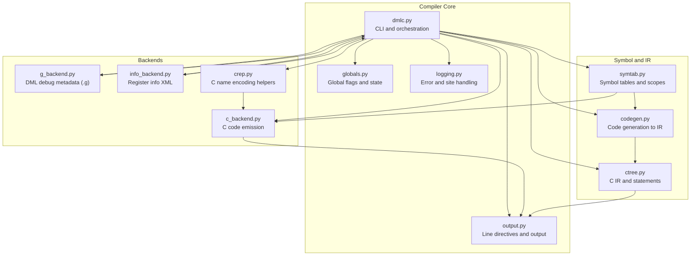
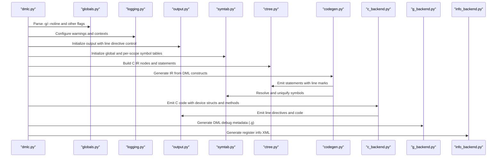
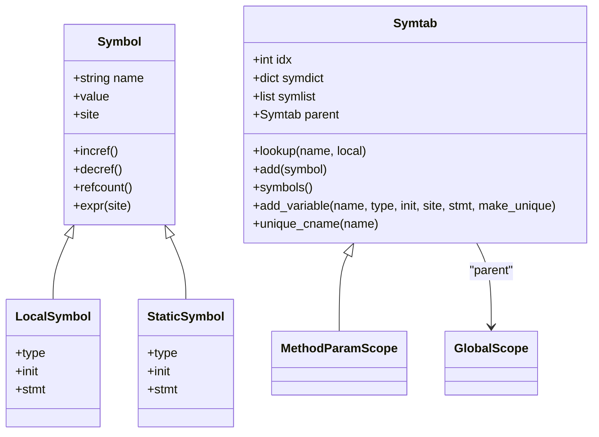
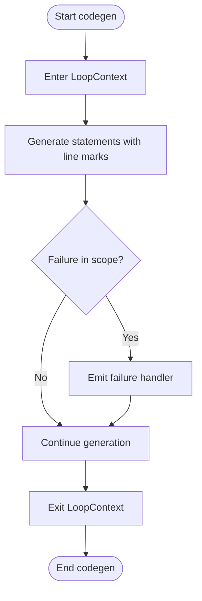
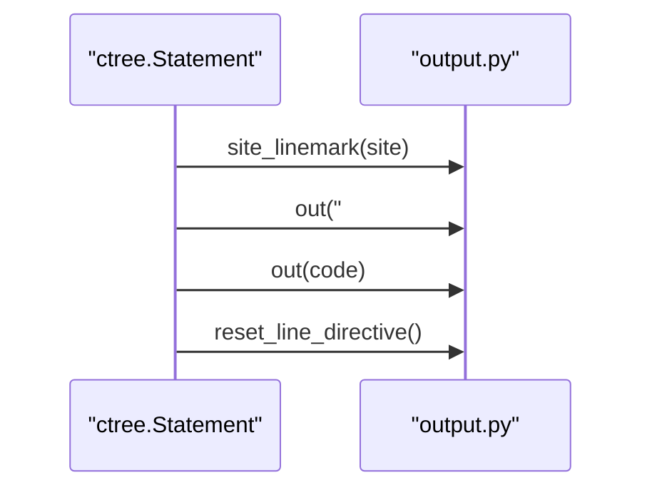
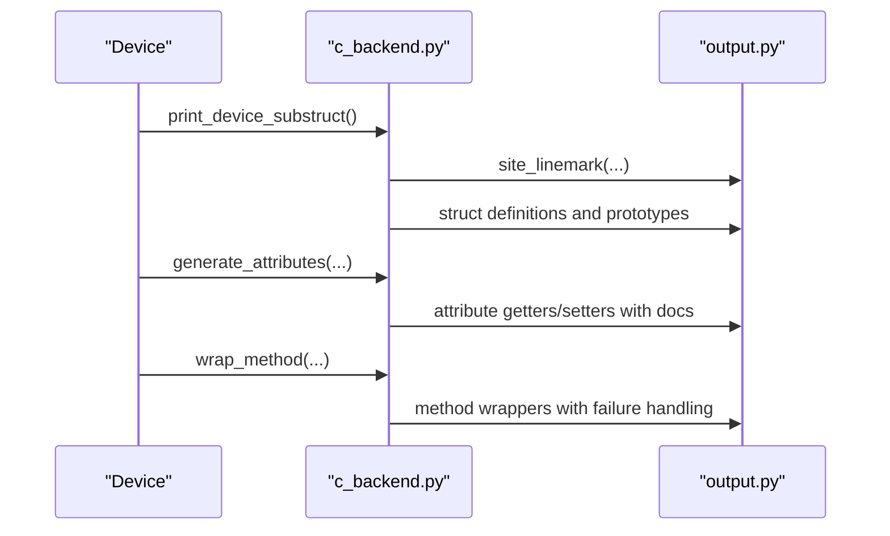
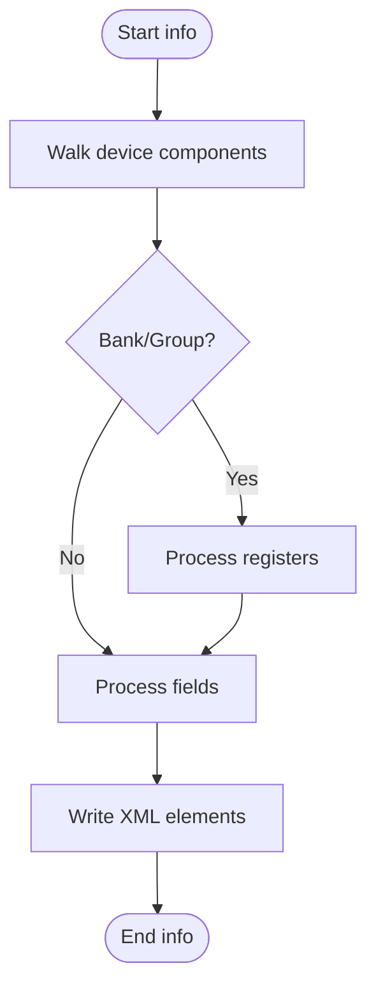
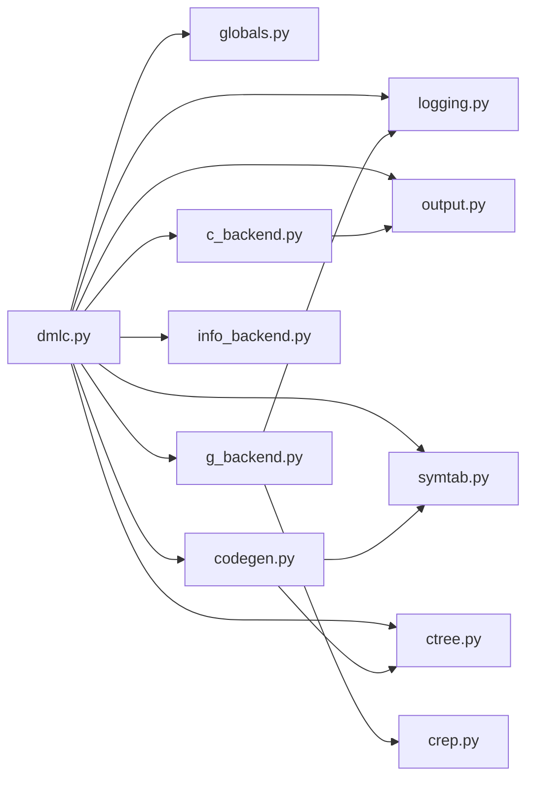

# Debug Information and Symbol Generation

<cite>
**Referenced Files in This Document**
- [symtab.py](file://py/dml/symtab.py)
- [codegen.py](file://py/dml/codegen.py)
- [ctree.py](file://py/dml/ctree.py)
- [c_backend.py](file://py/dml/c_backend.py)
- [g_backend.py](file://py/dml/g_backend.py)
- [info_backend.py](file://py/dml/info_backend.py)
- [globals.py](file://py/dml/globals.py)
- [crep.py](file://py/dml/crep.py)
- [logging.py](file://py/dml/logging.py)
- [output.py](file://py/dml/output.py)
- [dmlc.py](file://py/dml/dmlc.py)
</cite>

## Table of Contents
1. [Introduction](#introduction)
2. [Project Structure](#project-structure)
3. [Core Components](#core-components)
4. [Architecture Overview](#architecture-overview)
5. [Detailed Component Analysis](#detailed-component-analysis)
6. [Dependency Analysis](#dependency-analysis)
7. [Performance Considerations](#performance-considerations)
8. [Troubleshooting Guide](#troubleshooting-guide)
9. [Conclusion](#conclusion)

## Introduction
This document explains how the DML compiler generates debug information and manages symbol tables during compilation. It covers:
- How debug symbols and metadata are produced for both device structures and generated C code
- How symbol tables are organized and maintained across scopes
- How source-level debugging is supported via line directives and debug metadata
- Identifier naming conventions, symbol uniqueness, and cross-references between DML source and generated code
- Integration points with development tools and performance considerations for debug builds

## Project Structure
The debug and symbol generation pipeline spans several modules:
- Symbol table management and scoping
- Code generation to C intermediate representation and emission
- Backend generation of debug metadata and register information
- Global state controlling debuggable builds and line directives
- Output subsystem emitting line directives and managing file emission



**Diagram sources**
- [dmlc.py](file://py/dml/dmlc.py#L524-L748)
- [globals.py](file://py/dml/globals.py#L66-L107)
- [logging.py](file://py/dml/logging.py#L270-L468)
- [output.py](file://py/dml/output.py#L28-L263)
- [symtab.py](file://py/dml/symtab.py#L73-L128)
- [ctree.py](file://py/dml/ctree.py#L29-L800)
- [codegen.py](file://py/dml/codegen.py#L80-L800)
- [c_backend.py](file://py/dml/c_backend.py#L1-L800)
- [g_backend.py](file://py/dml/g_backend.py#L1-L188)
- [info_backend.py](file://py/dml/info_backend.py#L1-L185)
- [crep.py](file://py/dml/crep.py#L1-L244)

**Section sources**
- [dmlc.py](file://py/dml/dmlc.py#L524-L748)
- [globals.py](file://py/dml/globals.py#L66-L107)
- [output.py](file://py/dml/output.py#L28-L263)

## Core Components
- Symbol tables and scopes: Manage symbol identity, uniqueness, and scoping for locals and static device fields.
- C IR and statements: Provide constructs for emitting C code with precise control over line directives and control flow.
- Code generation: Translates DML constructs into C IR, handling loops, failures, and memoization with appropriate debug hooks.
- C backend: Emits C code, defines device structures, attributes, and method wrappers with line directives.
- Debug metadata backend: Produces a pickled DML debug file (.g) with object and method information.
- Info backend: Produces an XML file describing register layouts for introspection and tooling.
- Global flags and output: Control debuggable builds, line directives, and Coverity annotations.

**Section sources**
- [symtab.py](file://py/dml/symtab.py#L73-L128)
- [ctree.py](file://py/dml/ctree.py#L29-L800)
- [codegen.py](file://py/dml/codegen.py#L80-L800)
- [c_backend.py](file://py/dml/c_backend.py#L1-L800)
- [g_backend.py](file://py/dml/g_backend.py#L1-L188)
- [info_backend.py](file://py/dml/info_backend.py#L1-L185)
- [globals.py](file://py/dml/globals.py#L66-L107)
- [output.py](file://py/dml/output.py#L28-L263)

## Architecture Overview
The debug and symbol pipeline integrates CLI flags, global state, symbol tables, IR emission, and backend generation.



**Diagram sources**
- [dmlc.py](file://py/dml/dmlc.py#L524-L748)
- [globals.py](file://py/dml/globals.py#L66-L107)
- [logging.py](file://py/dml/logging.py#L433-L468)
- [output.py](file://py/dml/output.py#L139-L263)
- [symtab.py](file://py/dml/symtab.py#L73-L128)
- [ctree.py](file://py/dml/ctree.py#L389-L418)
- [codegen.py](file://py/dml/codegen.py#L1994-L2046)
- [c_backend.py](file://py/dml/c_backend.py#L1-L800)
- [g_backend.py](file://py/dml/g_backend.py#L182-L188)
- [info_backend.py](file://py/dml/info_backend.py#L181-L185)

## Detailed Component Analysis

### Symbol Tables and Scopes
- Symbol types:
  - Base Symbol: generic symbol with name, value, and site.
  - LocalSymbol: local variables with type, initializer, and statement flag.
  - StaticSymbol: static fields in device structures.
- Scope management:
  - Symtab maintains a dictionary and ordered list of symbols, supports lookup and duplicate detection.
  - MethodParamScope is a specialized scope to detect parameter shadowing.
  - Unique symbol names are generated per scope to avoid collisions in debug builds.
- Reference counting:
  - Symbols maintain a reference count to assist type inference for unused variables.



**Diagram sources**
- [symtab.py](file://py/dml/symtab.py#L18-L128)

**Section sources**
- [symtab.py](file://py/dml/symtab.py#L18-L128)

### Code Generation and Debug Hooks
- Loop and failure handling:
  - LoopContext and subclasses encapsulate loop semantics and break/continue handling.
  - Failure handlers translate DML exceptions into C constructs (returns, throws, logging).
- Variable generation:
  - Variables are added to the current scope with optional uniquification controlled by debuggable mode.
- Memoization:
  - Memoized methods and shared memoization structures are generated with preludes and exit handlers that preserve control flow and failure semantics.



**Diagram sources**
- [codegen.py](file://py/dml/codegen.py#L95-L148)
- [codegen.py](file://py/dml/codegen.py#L166-L214)
- [codegen.py](file://py/dml/codegen.py#L1994-L2046)

**Section sources**
- [codegen.py](file://py/dml/codegen.py#L95-L148)
- [codegen.py](file://py/dml/codegen.py#L166-L214)
- [codegen.py](file://py/dml/codegen.py#L1994-L2046)

### C IR and Line Directives
- Statement emission:
  - Compound statements emit braces with line marks around blocks.
  - Try/catch and inlined method wrappers ensure proper line directives for nested scopes.
- Line directive control:
  - Output subsystem emits #line directives and resets them appropriately.
  - allow_linemarks and disallow_linemarks manage when line directives are emitted.
- Assertions and indices:
  - Assertions and index checks emit line directives and runtime checks.



**Diagram sources**
- [ctree.py](file://py/dml/ctree.py#L389-L418)
- [ctree.py](file://py/dml/ctree.py#L512-L550)
- [ctree.py](file://py/dml/ctree.py#L560-L598)
- [output.py](file://py/dml/output.py#L165-L249)

**Section sources**
- [ctree.py](file://py/dml/ctree.py#L389-L418)
- [ctree.py](file://py/dml/ctree.py#L512-L550)
- [ctree.py](file://py/dml/ctree.py#L560-L598)
- [output.py](file://py/dml/output.py#L165-L249)

### C Backend: Device Structures, Attributes, and Methods
- Device structure emission:
  - Composite device substructures are built from DML objects and printed as C structs.
  - Naming and mangling ensure unique identifiers for device members.
- Attribute registration:
  - Getter/setter generation emits line directives and registers attributes with flags and documentation.
- Method wrapping:
  - Methods are wrapped with device instance access checks and failure handling, emitting line directives around bodies.
- Header and prototype emission:
  - Guard macros, forward declarations, and prototypes are emitted with line directives.



**Diagram sources**
- [c_backend.py](file://py/dml/c_backend.py#L115-L223)
- [c_backend.py](file://py/dml/c_backend.py#L387-L504)
- [c_backend.py](file://py/dml/c_backend.py#L712-L763)
- [output.py](file://py/dml/output.py#L228-L249)

**Section sources**
- [c_backend.py](file://py/dml/c_backend.py#L115-L223)
- [c_backend.py](file://py/dml/c_backend.py#L387-L504)
- [c_backend.py](file://py/dml/c_backend.py#L712-L763)
- [output.py](file://py/dml/output.py#L228-L249)

### Debug Metadata Backend (.g)
- Purpose:
  - Encodes a snapshot of the DML object model and method signatures into a binary file for debugging and tooling.
- Encoding:
  - Recursively encodes objects, parameters, methods, data, registers, fields, banks, ports, attributes, events, interfaces, groups, devices, subdevices, and hooks.
  - Skips auto/non-interesting parameters and implicit fields.
- Pickling:
  - Uses a simple header and dumps device object graph with version and class name.

```mermaid
flowchart TD
Start([Start encode]) --> ObjType{"Object type"}
ObjType --> |parameter| EncodeParam["Encode parameter expr"]
ObjType --> |method| EncodeMethod["Encode method signatures"]
ObjType --> |data/register/field/bank/port/attribute/event/implement/interface/group/device/subdevice/hook|
EncodeChild["Encode children recursively"]
EncodeParam --> Next([Next])
EncodeMethod --> Next
EncodeChild --> Next
Next --> End([Write pickle to .g])
```

**Diagram sources**
- [g_backend.py](file://py/dml/g_backend.py#L37-L117)
- [g_backend.py](file://py/dml/g_backend.py#L138-L188)

**Section sources**
- [g_backend.py](file://py/dml/g_backend.py#L37-L117)
- [g_backend.py](file://py/dml/g_backend.py#L138-L188)

### Register Info Backend (XML)
- Purpose:
  - Produces an XML file describing register layouts for introspection and tooling.
- Generation:
  - Walks device banks/groups/registers/fields, computes offsets and sizes, and writes XML with attributes for names, sizes, offsets, and field MSB/LSB.



**Diagram sources**
- [info_backend.py](file://py/dml/info_backend.py#L106-L133)
- [info_backend.py](file://py/dml/info_backend.py#L144-L169)
- [info_backend.py](file://py/dml/info_backend.py#L170-L185)

**Section sources**
- [info_backend.py](file://py/dml/info_backend.py#L106-L133)
- [info_backend.py](file://py/dml/info_backend.py#L144-L169)
- [info_backend.py](file://py/dml/info_backend.py#L170-L185)

### Global Flags and Line Directive Control
- Global flags:
  - debuggable toggles debug metadata and symbol uniqueness behavior.
  - linemarks_enabled controls whether line directives are emitted.
  - coverity toggles Coverity annotations.
- Output control:
  - allow_linemarks/disallow_linemarks temporarily override line directive emission.
  - site_linemark emits #line directives for a given site.

**Section sources**
- [globals.py](file://py/dml/globals.py#L66-L107)
- [output.py](file://py/dml/output.py#L235-L263)
- [dmlc.py](file://py/dml/dmlc.py#L524-L569)

## Dependency Analysis
- Coupling:
  - c_backend.py depends on symtab.py for symbol scopes and on output.py for line directives.
  - codegen.py depends on symtab.py for variable generation and on ctree.py for IR emission.
  - g_backend.py depends on crep.py for C name encoding and on logging.py for error handling.
  - dmlc.py orchestrates all modules and sets global flags.
- Cohesion:
  - Each backend module focuses on a single responsibility: C emission, debug metadata, or info XML.
- External dependencies:
  - Pickle for debug metadata serialization.
  - File I/O and OS for committing temporary files.



**Diagram sources**
- [dmlc.py](file://py/dml/dmlc.py#L524-L748)
- [globals.py](file://py/dml/globals.py#L66-L107)
- [logging.py](file://py/dml/logging.py#L433-L468)
- [output.py](file://py/dml/output.py#L28-L263)
- [symtab.py](file://py/dml/symtab.py#L73-L128)
- [ctree.py](file://py/dml/ctree.py#L29-L800)
- [codegen.py](file://py/dml/codegen.py#L80-L800)
- [c_backend.py](file://py/dml/c_backend.py#L1-L800)
- [g_backend.py](file://py/dml/g_backend.py#L1-L188)
- [info_backend.py](file://py/dml/info_backend.py#L1-L185)
- [crep.py](file://py/dml/crep.py#L1-L244)

**Section sources**
- [dmlc.py](file://py/dml/dmlc.py#L524-L748)
- [globals.py](file://py/dml/globals.py#L66-L107)
- [output.py](file://py/dml/output.py#L28-L263)
- [symtab.py](file://py/dml/symtab.py#L73-L128)
- [ctree.py](file://py/dml/ctree.py#L29-L800)
- [codegen.py](file://py/dml/codegen.py#L80-L800)
- [c_backend.py](file://py/dml/c_backend.py#L1-L800)
- [g_backend.py](file://py/dml/g_backend.py#L1-L188)
- [info_backend.py](file://py/dml/info_backend.py#L1-L185)
- [crep.py](file://py/dml/crep.py#L1-L244)

## Performance Considerations
- Debug builds:
  - Enabling -g increases symbol uniqueness and preserves more precise line directives, which can increase code size and compilation time.
  - Disabling --noline reduces line directive overhead but makes debugging harder.
- Symbol table management:
  - Using unique_cname per scope prevents collisions but adds prefix overhead; consider disabling uniqueness in non-debug builds.
- IR emission:
  - Emitting line directives per statement improves debug fidelity but adds preprocessor noise; batching and careful scoping minimize overhead.
- Backend generation:
  - Attribute and method wrappers add boilerplate; keep them only when debuggable is enabled.
- Serialization:
  - Debug metadata (.g) is generated once per build; ensure incremental builds avoid unnecessary regeneration.

[No sources needed since this section provides general guidance]

## Troubleshooting Guide
- Missing line directives:
  - Ensure --noline is not set unintentionally; verify allow_linemarks context is active around IR emission.
- Incorrect source-level debugging:
  - Confirm -g is enabled and debug metadata (.g) is generated alongside C output.
- Attribute registration issues:
  - Check attribute flags and documentation generation; verify getter/setter wrappers are emitted with correct line marks.
- Parameter encoding errors:
  - Encoding parameters may fail for complex expressions; review error logs and ensure expressions are evaluatable at compile time.

**Section sources**
- [dmlc.py](file://py/dml/dmlc.py#L744-L748)
- [output.py](file://py/dml/output.py#L235-L263)
- [c_backend.py](file://py/dml/c_backend.py#L387-L504)
- [g_backend.py](file://py/dml/g_backend.py#L56-L62)

## Conclusion
The DML compiler’s debug and symbol system integrates symbol tables, precise C IR emission, and backend metadata generation to support robust source-level debugging. Global flags control debuggable behavior, while output subsystems ensure accurate line directives. The debug metadata (.g) and register info XML provide complementary tooling support. For optimal performance, tune debug flags and symbol uniqueness according to build goals.