# Simics Integration Backend

<cite>
**Referenced Files in This Document**
- [README.md](file://README.md)
- [py/dml/c_backend.py](file://py/dml/c_backend.py)
- [py/dml/g_backend.py](file://py/dml/g_backend.py)
- [py/dml/codegen.py](file://py/dml/codegen.py)
- [py/dml/dmlc.py](file://py/dml/dmlc.py)
- [py/dml/ctree.py](file://py/dml/ctree.py)
- [py/dml/structure.py](file://py/dml/structure.py)
- [py/dml/objects.py](file://py/dml/objects.py)
- [lib/1.2/simics-api.dml](file://lib/1.2/simics-api.dml)
- [lib/1.2/simics-device.dml](file://lib/1.2/simics-device.dml)
- [lib/1.4/internal.dml](file://lib/1.4/internal.dml)
- [lib/1.4/utility.dml](file://lib/1.4/utility.dml)
</cite>

## Table of Contents
1. [Introduction](#introduction)
2. [Project Structure](#project-structure)
3. [Core Components](#core-components)
4. [Architecture Overview](#architecture-overview)
5. [Detailed Component Analysis](#detailed-component-analysis)
6. [Dependency Analysis](#dependency-analysis)
7. [Performance Considerations](#performance-considerations)
8. [Troubleshooting Guide](#troubleshooting-guide)
9. [Conclusion](#conclusion)
10. [Appendices](#appendices)

## Introduction
This document explains the Simics integration backend that generates API bindings and runtime integration code for the Device Modeling Language (DML). The backend transforms DML device models into C code tailored for the Intel® Simics® simulator. It handles:
- Device registration functions and configuration class definitions
- Attribute registration and method binding
- Event system integration and hook-based callbacks
- Runtime behavior handlers and debugging support
- Compatibility across Simics API versions and DML language versions

The backend is centered around a C code generator that emits Simics-compatible C APIs, integrates with Simics memory, logging, breakpoints, and event systems, and supports both DML 1.2 and 1.4 semantics.

## Project Structure
The repository organizes DML-related logic into a Python-based compiler backend and a library of DML standard templates and API definitions. The backend is primarily implemented in the py/dml directory, with supporting libraries under lib and lib-old-4.8.

Key areas:
- Compiler entry point and CLI orchestration
- Code generation pipeline (DML AST → IR → C)
- Simics API wrappers and runtime integration
- Debugging metadata generation
- Standard templates and API definitions for Simics

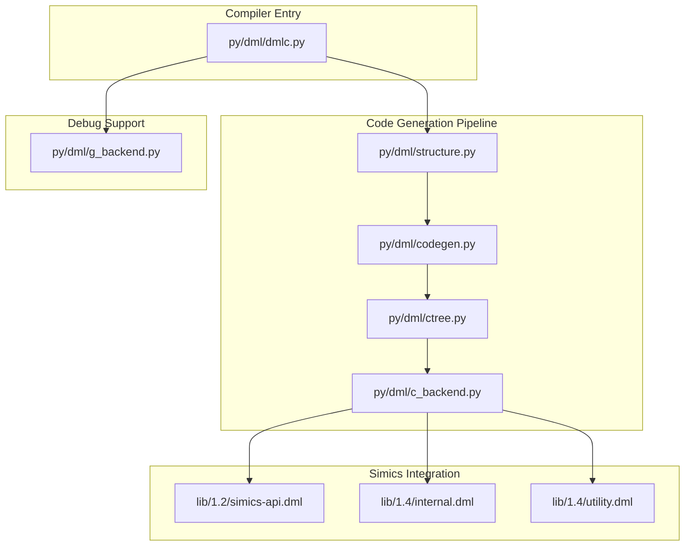

**Diagram sources**
- [py/dml/dmlc.py](file://py/dml/dmlc.py#L309-L760)
- [py/dml/structure.py](file://py/dml/structure.py#L74-L130)
- [py/dml/codegen.py](file://py/dml/codegen.py#L1-L120)
- [py/dml/ctree.py](file://py/dml/ctree.py#L1-L120)
- [py/dml/c_backend.py](file://py/dml/c_backend.py#L1-L120)
- [lib/1.2/simics-api.dml](file://lib/1.2/simics-api.dml#L1-L131)
- [lib/1.4/internal.dml](file://lib/1.4/internal.dml#L1-L94)
- [lib/1.4/utility.dml](file://lib/1.4/utility.dml#L1-L120)
- [py/dml/g_backend.py](file://py/dml/g_backend.py#L1-L60)

**Section sources**
- [README.md](file://README.md#L1-L117)
- [py/dml/dmlc.py](file://py/dml/dmlc.py#L309-L760)

## Core Components
- Compiler orchestrator: parses DML, sets API version, and invokes code generation and optional debug metadata generation.
- Structure builder: builds the DML object model and validates templates and traits.
- Code generator: converts DML constructs into an intermediate representation and then into C statements.
- C backend: emits Simics-compatible C, including device registration, attributes, methods, events, and hooks.
- Simics API libraries: provide extern declarations and templates for memory, logging, breakpoints, events, and device interfaces.
- Debug backend: serializes DML object model and method signatures for source-level debugging.

**Section sources**
- [py/dml/dmlc.py](file://py/dml/dmlc.py#L676-L760)
- [py/dml/structure.py](file://py/dml/structure.py#L74-L130)
- [py/dml/codegen.py](file://py/dml/codegen.py#L1-L120)
- [py/dml/c_backend.py](file://py/dml/c_backend.py#L1-L120)
- [py/dml/g_backend.py](file://py/dml/g_backend.py#L1-L60)
- [lib/1.2/simics-api.dml](file://lib/1.2/simics-api.dml#L1-L131)
- [lib/1.4/internal.dml](file://lib/1.4/internal.dml#L1-L94)
- [lib/1.4/utility.dml](file://lib/1.4/utility.dml#L1-L120)

## Architecture Overview
The backend follows a staged pipeline:
1. Parse DML input and resolve imports and templates.
2. Build the DML object model and compute dependencies.
3. Generate an intermediate representation of statements and expressions.
4. Emit C code integrating with Simics APIs for memory, logging, breakpoints, and events.
5. Optionally produce debug metadata for source-level debugging.

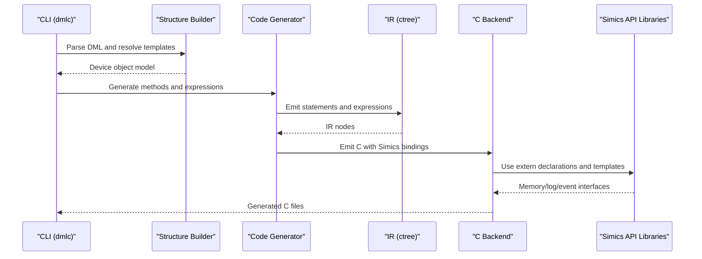

**Diagram sources**
- [py/dml/dmlc.py](file://py/dml/dmlc.py#L676-L760)
- [py/dml/structure.py](file://py/dml/structure.py#L74-L130)
- [py/dml/codegen.py](file://py/dml/codegen.py#L1-L120)
- [py/dml/ctree.py](file://py/dml/ctree.py#L1-L120)
- [py/dml/c_backend.py](file://py/dml/c_backend.py#L1-L120)
- [lib/1.2/simics-api.dml](file://lib/1.2/simics-api.dml#L1-L131)
- [lib/1.4/internal.dml](file://lib/1.4/internal.dml#L1-L94)

## Detailed Component Analysis

### Device Registration and Configuration Classes
The C backend generates:
- A device configuration class initializer that registers ports, attributes, methods, and subdevices.
- A device structure definition with embedded Simics objects and per-component storage.
- Prototypes and header emission for exported methods and traits.

Key responsibilities:
- Compute device struct offsets and enforce size constraints.
- Emit attribute registration calls with flags (required, optional, persistent, internal).
- Emit method wrappers that capture DML context and handle failures.

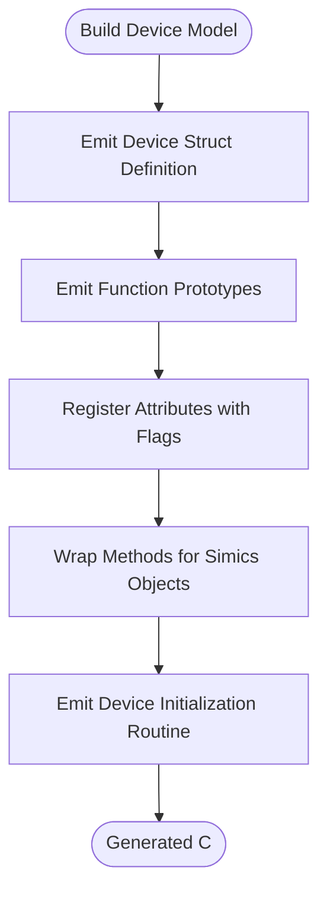

**Diagram sources**
- [py/dml/c_backend.py](file://py/dml/c_backend.py#L239-L372)
- [py/dml/c_backend.py](file://py/dml/c_backend.py#L387-L504)
- [py/dml/c_backend.py](file://py/dml/c_backend.py#L712-L763)

**Section sources**
- [py/dml/c_backend.py](file://py/dml/c_backend.py#L239-L372)
- [py/dml/c_backend.py](file://py/dml/c_backend.py#L387-L504)
- [py/dml/c_backend.py](file://py/dml/c_backend.py#L712-L763)

### Attribute Registration and Method Binding
The backend:
- Computes attribute flags from DML parameters (configuration, persistence, confidentiality).
- Registers getters/setters for readable/writable attributes, including arrays and ports.
- Emits calls to Simics attribute registration helpers and port attribute registration.

Processing logic:
- Validates documentation and required interfaces for connect attributes.
- Supports cutoff behavior for optional connect attributes.
- Handles port proxy attributes for legacy compatibility.

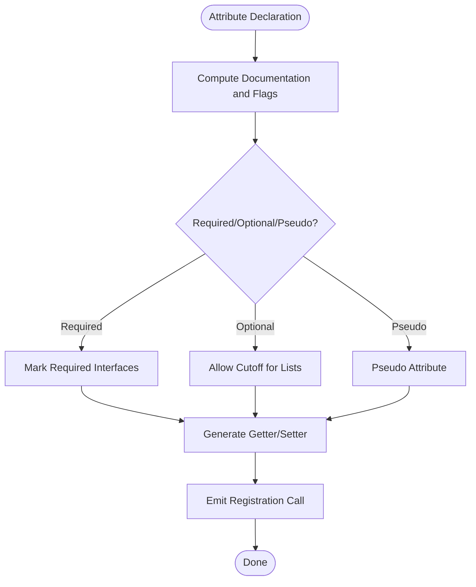

**Diagram sources**
- [py/dml/c_backend.py](file://py/dml/c_backend.py#L39-L59)
- [py/dml/c_backend.py](file://py/dml/c_backend.py#L507-L632)

**Section sources**
- [py/dml/c_backend.py](file://py/dml/c_backend.py#L39-L59)
- [py/dml/c_backend.py](file://py/dml/c_backend.py#L507-L632)

### Event System Integration and Hook-Based Callbacks
The backend supports:
- After-delay callbacks and immediate after callbacks.
- Hook-based after callbacks with serialization/deserialization of arguments.
- Unique identification of callback artifacts and memoization of results.

Generation flow:
- Build type sequences for hook messages and after callbacks.
- Emit callback wrappers that invoke DML methods with indices and serialized arguments.
- Serialize/deserialize arguments for cross-domain hook sends.

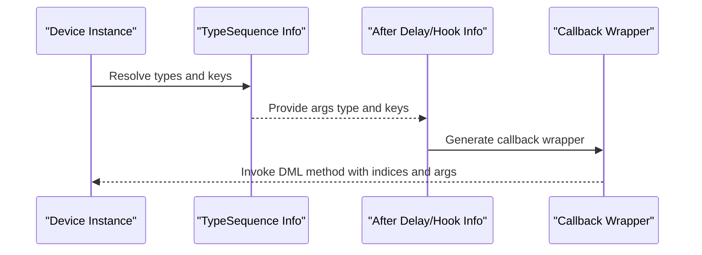

**Diagram sources**
- [py/dml/codegen.py](file://py/dml/codegen.py#L420-L594)
- [py/dml/codegen.py](file://py/dml/codegen.py#L658-L666)
- [py/dml/codegen.py](file://py/dml/codegen.py#L668-L737)
- [py/dml/codegen.py](file://py/dml/codegen.py#L739-L800)

**Section sources**
- [py/dml/codegen.py](file://py/dml/codegen.py#L420-L594)
- [py/dml/codegen.py](file://py/dml/codegen.py#L658-L666)
- [py/dml/codegen.py](file://py/dml/codegen.py#L668-L737)
- [py/dml/codegen.py](file://py/dml/codegen.py#L739-L800)

### Device Initialization Routines and Runtime Behavior Handlers
Initialization:
- Emits device hard and soft reset handlers.
- Registers subobject connections for DML 1.4 traits.
- Ensures state change notifications after DML-controlled transitions.

Runtime behavior:
- Wraps DML methods to inject context checks and failure handling.
- Emits wrappers that extract port indices and pass them to DML methods.
- Integrates with Simics logging and error reporting.

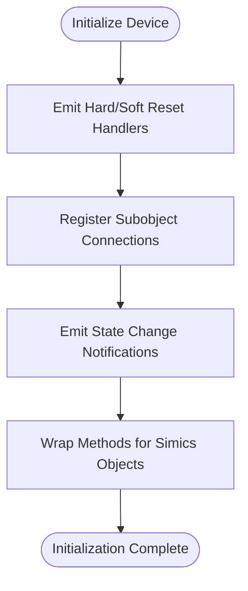

**Diagram sources**
- [py/dml/c_backend.py](file://py/dml/c_backend.py#L368-L371)
- [py/dml/c_backend.py](file://py/dml/c_backend.py#L686-L704)
- [py/dml/c_backend.py](file://py/dml/c_backend.py#L86-L96)
- [py/dml/c_backend.py](file://py/dml/c_backend.py#L712-L763)

**Section sources**
- [py/dml/c_backend.py](file://py/dml/c_backend.py#L368-L371)
- [py/dml/c_backend.py](file://py/dml/c_backend.py#L686-L704)
- [py/dml/c_backend.py](file://py/dml/c_backend.py#L86-L96)
- [py/dml/c_backend.py](file://py/dml/c_backend.py#L712-L763)

### API Wrapper Generation and Memory Management Integration
The backend integrates with Simics APIs for:
- Memory operations (aligned/unaligned load/store, endianness conversion).
- Logging and specification violation reporting.
- Vector operations and bit-count utilities.

Memory management:
- Uses Simics-provided allocation helpers for strings and vectors.
- Applies endian conversion helpers for multi-byte data.

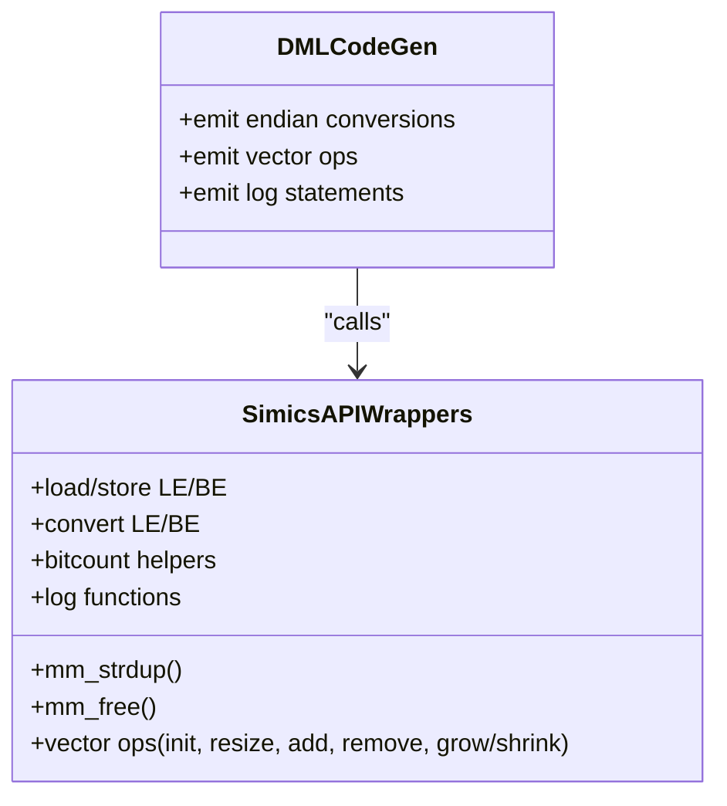

**Diagram sources**
- [lib/1.2/simics-api.dml](file://lib/1.2/simics-api.dml#L8-L131)
- [lib/1.4/internal.dml](file://lib/1.4/internal.dml#L11-L94)
- [py/dml/codegen.py](file://py/dml/codegen.py#L1-L120)

**Section sources**
- [lib/1.2/simics-api.dml](file://lib/1.2/simics-api.dml#L8-L131)
- [lib/1.4/internal.dml](file://lib/1.4/internal.dml#L11-L94)
- [py/dml/codegen.py](file://py/dml/codegen.py#L1-L120)

### Callback Registration and Interface Implementation
The backend:
- Validates interface method signatures against DML method definitions.
- Generates wrappers that translate Simics object pointers and indices into DML method calls.
- Emits interface implementation stubs and trait-based memoization for shared methods.

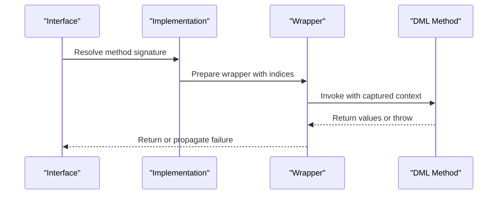

**Diagram sources**
- [py/dml/c_backend.py](file://py/dml/c_backend.py#L765-L800)
- [py/dml/codegen.py](file://py/dml/codegen.py#L316-L385)

**Section sources**
- [py/dml/c_backend.py](file://py/dml/c_backend.py#L765-L800)
- [py/dml/codegen.py](file://py/dml/codegen.py#L316-L385)

### Device Classes, Configuration Objects, and Runtime Behavior
- Device classes are represented by generated C structs embedding Simics configuration objects.
- Configuration objects are initialized with attribute registrations, method bindings, and reset handlers.
- Runtime behavior is governed by DML methods wrapped for Simics, with failure handling and state change notifications.

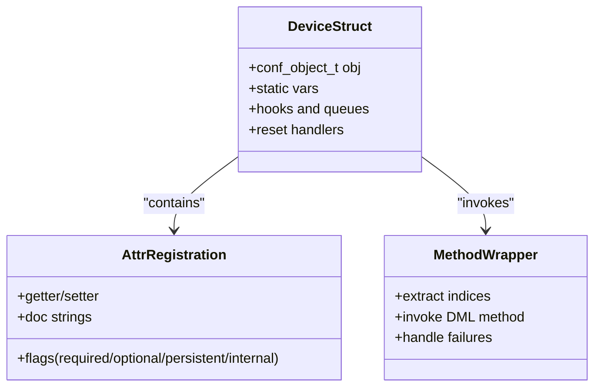

**Diagram sources**
- [py/dml/c_backend.py](file://py/dml/c_backend.py#L115-L223)
- [py/dml/c_backend.py](file://py/dml/c_backend.py#L387-L504)
- [py/dml/c_backend.py](file://py/dml/c_backend.py#L712-L763)

**Section sources**
- [py/dml/c_backend.py](file://py/dml/c_backend.py#L115-L223)
- [py/dml/c_backend.py](file://py/dml/c_backend.py#L387-L504)
- [py/dml/c_backend.py](file://py/dml/c_backend.py#L712-L763)

### Compatibility with Different Simics Versions and API Evolution
- CLI supports selecting Simics API version and toggling compatibility features.
- Backward compatibility flags disable deprecated features for newer API versions.
- DML 1.2 and 1.4 differ in attribute registration, method signatures, and event semantics; the backend adapts accordingly.

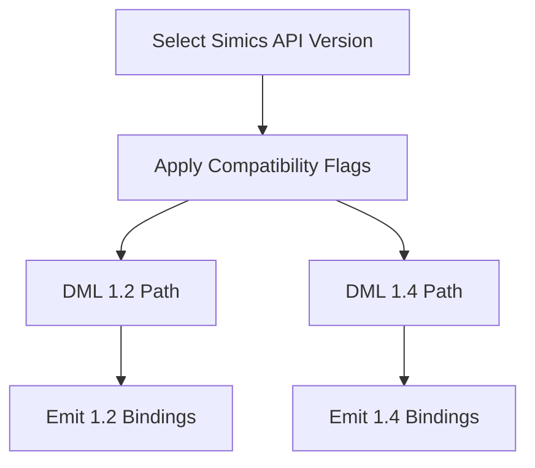

**Diagram sources**
- [py/dml/dmlc.py](file://py/dml/dmlc.py#L537-L610)
- [py/dml/c_backend.py](file://py/dml/c_backend.py#L517-L518)
- [py/dml/c_backend.py](file://py/dml/c_backend.py#L686-L704)

**Section sources**
- [py/dml/dmlc.py](file://py/dml/dmlc.py#L537-L610)
- [py/dml/c_backend.py](file://py/dml/c_backend.py#L517-L518)
- [py/dml/c_backend.py](file://py/dml/c_backend.py#L686-L704)

## Dependency Analysis
The backend components are tightly coupled to ensure correct code generation and Simics integration. The dependency graph shows how the compiler orchestrator coordinates the structure builder, code generator, IR, and C backend, while leveraging Simics API libraries and emitting debug metadata.

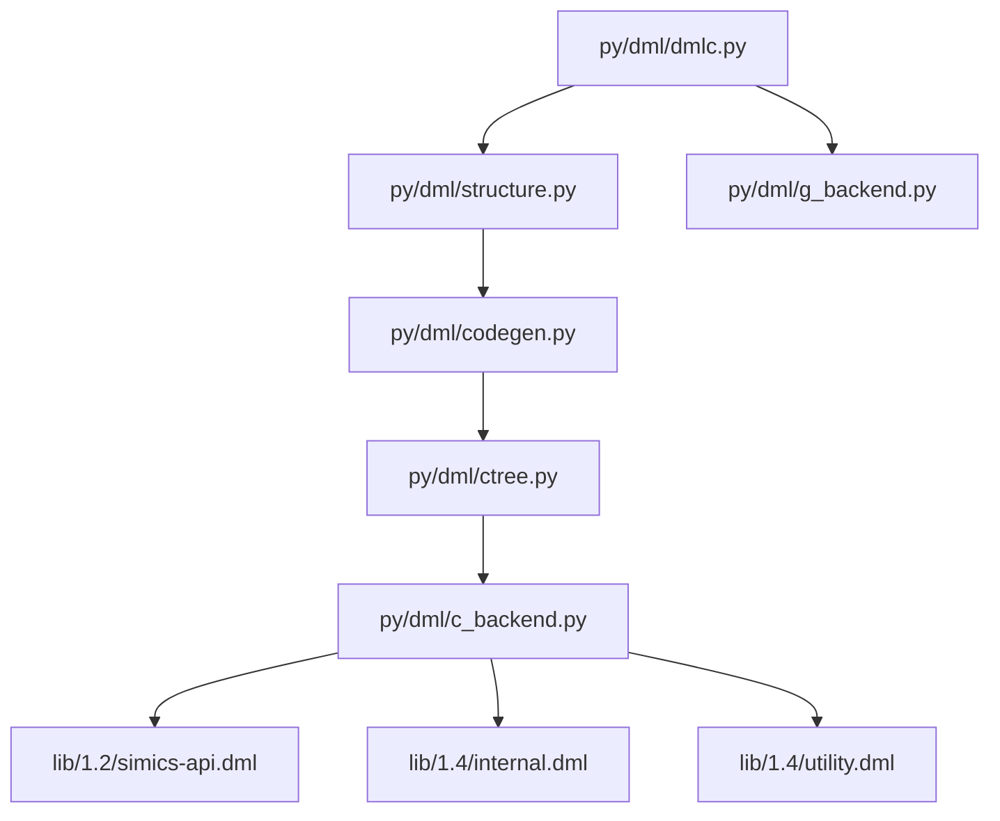

**Diagram sources**
- [py/dml/dmlc.py](file://py/dml/dmlc.py#L676-L760)
- [py/dml/structure.py](file://py/dml/structure.py#L74-L130)
- [py/dml/codegen.py](file://py/dml/codegen.py#L1-L120)
- [py/dml/ctree.py](file://py/dml/ctree.py#L1-L120)
- [py/dml/c_backend.py](file://py/dml/c_backend.py#L1-L120)
- [lib/1.2/simics-api.dml](file://lib/1.2/simics-api.dml#L1-L131)
- [lib/1.4/internal.dml](file://lib/1.4/internal.dml#L1-L94)
- [lib/1.4/utility.dml](file://lib/1.4/utility.dml#L1-L120)
- [py/dml/g_backend.py](file://py/dml/g_backend.py#L1-L60)

**Section sources**
- [py/dml/dmlc.py](file://py/dml/dmlc.py#L676-L760)
- [py/dml/structure.py](file://py/dml/structure.py#L74-L130)
- [py/dml/codegen.py](file://py/dml/codegen.py#L1-L120)
- [py/dml/ctree.py](file://py/dml/ctree.py#L1-L120)
- [py/dml/c_backend.py](file://py/dml/c_backend.py#L1-L120)
- [py/dml/g_backend.py](file://py/dml/g_backend.py#L1-L60)

## Performance Considerations
- Code splitting: the backend can split large generated C files to improve compilation speed and manageability.
- Memoization: shared and independent memoized methods cache results and reduce repeated computation.
- Size constraints: generated device struct sizes are asserted to fit within 32-bit offsets to optimize memory usage.
- Coverage annotations: optional annotations can reduce false positives in static analysis of generated code.

[No sources needed since this section provides general guidance]

## Troubleshooting Guide
Common issues and remedies:
- Unexpected exceptions: enable debug mode to print tracebacks; otherwise, errors are logged to a dedicated file.
- Excessive warnings: use CLI flags to enable/disable specific warnings or treat warnings as errors.
- Compatibility errors: select appropriate Simics API version and disable incompatible features using no-compat flags.
- Porting logs: collect porting messages to a file for migration to DML 1.4.

**Section sources**
- [py/dml/dmlc.py](file://py/dml/dmlc.py#L227-L237)
- [py/dml/dmlc.py](file://py/dml/dmlc.py#L546-L555)
- [py/dml/dmlc.py](file://py/dml/dmlc.py#L608-L622)
- [py/dml/dmlc.py](file://py/dml/dmlc.py#L642-L656)

## Conclusion
The Simics integration backend provides a robust pipeline to transform DML device models into efficient, Simics-compatible C code. It handles device registration, attribute/method binding, event and hook integration, and debugging support, while maintaining compatibility across DML and Simics API versions. The modular design enables extensibility and maintainability for evolving simulator interfaces.

[No sources needed since this section summarizes without analyzing specific files]

## Appendices

### Appendix A: CLI Options and Environment Variables
- Command-line options include dependency generation, warning controls, API selection, and debuggable output.
- Environment variables influence error reporting, profiling, and input file dumping for isolated reproduction.

**Section sources**
- [py/dml/dmlc.py](file://py/dml/dmlc.py#L309-L800)
- [README.md](file://README.md#L46-L117)

### Appendix B: Standard Templates and Interfaces
- Utility templates in DML 1.4 provide standardized reset behavior, read/write semantics, and logging.
- Device interfaces (e.g., interrupt, pin, signal) are defined for interoperability.

**Section sources**
- [lib/1.4/utility.dml](file://lib/1.4/utility.dml#L170-L333)
- [lib/1.2/simics-device.dml](file://lib/1.2/simics-device.dml#L8-L18)