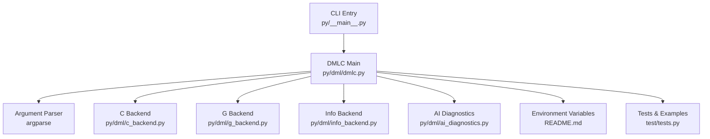
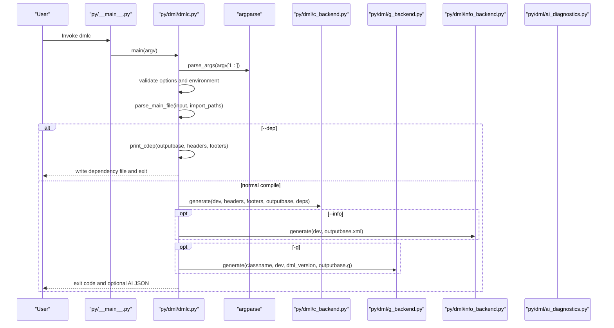
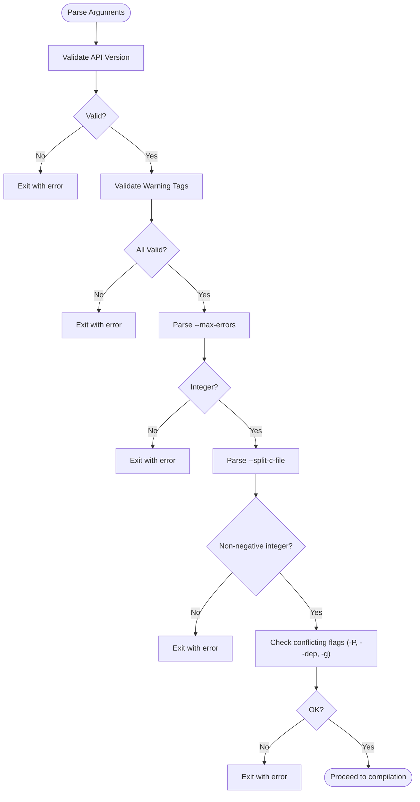
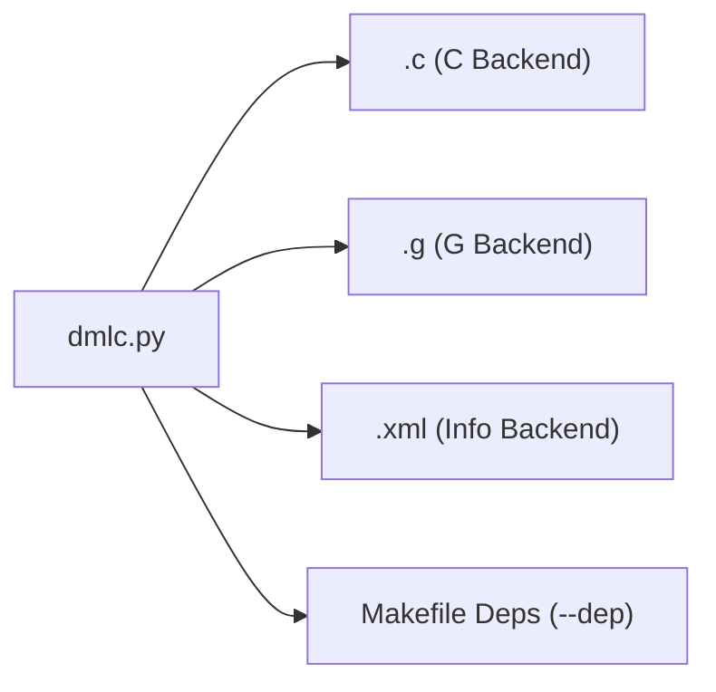
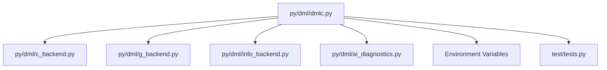

# DMLC Compiler Interface

<cite>
**Referenced Files in This Document**
- [dmlc.py](file://py/dml/dmlc.py)
- [__main__.py](file://py/__main__.py)
- [ai_diagnostics.py](file://py/dml/ai_diagnostics.py)
- [c_backend.py](file://py/dml/c_backend.py)
- [g_backend.py](file://py/dml/g_backend.py)
- [info_backend.py](file://py/dml/info_backend.py)
- [run_dmlc.sh](file://run_dmlc.sh)
- [README.md](file://README.md)
- [tests.py](file://test/tests.py)
</cite>

## Table of Contents
1. [Introduction](#introduction)
2. [Project Structure](#project-structure)
3. [Core Components](#core-components)
4. [Architecture Overview](#architecture-overview)
5. [Detailed Component Analysis](#detailed-component-analysis)
6. [Dependency Analysis](#dependency-analysis)
7. [Performance Considerations](#performance-considerations)
8. [Troubleshooting Guide](#troubleshooting-guide)
9. [Conclusion](#conclusion)
10. [Appendices](#appendices)

## Introduction
This document describes the DMLC command-line compiler interface, focusing on command-line options, argument parsing, validation, error handling, and the relationship between options and generated outputs (.c, .g, .xml). It also covers environment variables (DMLC_DEBUG, DMLC_PROFILE, DMLC_DUMP_INPUT_FILES), performance profiling, debugging workflows, and integration with build systems.

## Project Structure
The DMLC CLI is implemented in Python and organized around a main entry point and several backend modules:
- Command-line parsing and orchestration: [dmlc.py](file://py/dml/dmlc.py)
- Entry point wrapper: [__main__.py](file://py/__main__.py)
- Output backends:
  - C code generation: [c_backend.py](file://py/dml/c_backend.py)
  - Debugging info (.g): [g_backend.py](file://py/dml/g_backend.py)
  - Device info XML: [info_backend.py](file://py/dml/info_backend.py)
- AI diagnostics export: [ai_diagnostics.py](file://py/dml/ai_diagnostics.py)
- Example invocation script: [run_dmlc.sh](file://run_dmlc.sh)
- Environment variable documentation: [README.md](file://README.md)
- Tests demonstrating options and environment variables: [tests.py](file://test/tests.py)

**Diagram sources**
- [__main__.py](file://py/__main__.py#L1-L8)
- [dmlc.py](file://py/dml/dmlc.py#L309-L518)
- [c_backend.py](file://py/dml/c_backend.py#L1-L200)
- [g_backend.py](file://py/dml/g_backend.py#L1-L188)
- [info_backend.py](file://py/dml/info_backend.py#L1-L185)
- [ai_diagnostics.py](file://py/dml/ai_diagnostics.py#L1-L391)
- [README.md](file://README.md#L46-L111)
- [tests.py](file://test/tests.py#L983-L1037)

**Section sources**
- [dmlc.py](file://py/dml/dmlc.py#L309-L518)
- [__main__.py](file://py/__main__.py#L1-L8)

## Core Components
- Argument parsing and validation: Implemented via argparse in [dmlc.py](file://py/dml/dmlc.py#L309-L518).
- Option handling and runtime behavior:
  - -I for import paths
  - -D for compile-time defines
  - --dep for dependency generation
  - -g for debuggable output
  - --warn and --nowarn for warning control
  - --simics-api for API version selection
  - --max-errors for error limits
- Output generation:
  - .c files via C backend
  - .g files via G backend (debug info)
  - .xml files via Info backend
- Environment variables:
  - DMLC_DEBUG, DMLC_PROFILE, DMLC_DUMP_INPUT_FILES
- Error handling and diagnostics:
  - Structured AI-friendly JSON export via AI diagnostics module
  - Profiling via cProfile when DMLC_PROFILE is set

**Section sources**
- [dmlc.py](file://py/dml/dmlc.py#L309-L518)
- [c_backend.py](file://py/dml/c_backend.py#L1-L200)
- [g_backend.py](file://py/dml/g_backend.py#L1-L188)
- [info_backend.py](file://py/dml/info_backend.py#L1-L185)
- [ai_diagnostics.py](file://py/dml/ai_diagnostics.py#L1-L391)
- [README.md](file://README.md#L75-L111)

## Architecture Overview
The CLI orchestrates parsing, validation, and backend generation. The flow is:
- Parse arguments and validate
- Optionally enable AI diagnostics
- Parse DML input and collect imported files
- Generate outputs based on options:
  - --dep: emit makefile dependency rules
  - --info: emit XML device info
  - -g: emit .g debug info alongside .c
  - Otherwise: emit .c and optionally .g and .xml

**Diagram sources**
- [__main__.py](file://py/__main__.py#L1-L8)
- [dmlc.py](file://py/dml/dmlc.py#L309-L518)
- [dmlc.py](file://py/dml/dmlc.py#L690-L750)
- [c_backend.py](file://py/dml/c_backend.py#L1-L200)
- [g_backend.py](file://py/dml/g_backend.py#L1-L188)
- [info_backend.py](file://py/dml/info_backend.py#L1-L185)
- [ai_diagnostics.py](file://py/dml/ai_diagnostics.py#L370-L391)

## Detailed Component Analysis

### Command-Line Options and Parsing
- -I PATH: Append to import search path for modules. Multiple -I flags supported.
- -D NAME=VALUE: Define compile-time constants. Values are parsed as literals (string, bool, int, float).
- --dep TARGET: Emit makefile dependency rules. Supports --dep-target and --no-dep-phony.
- -g: Enable debuggable output; also emits .g file for debugging.
- --warn TAG and --nowarn TAG: Control warnings by tag.
- --simics-api VERSION: Select API version; validated against known versions.
- --max-errors N: Limit number of error messages.
- --info: Generate XML device info file.
- --noline: Suppress line directives in generated C code.
- --coverity: Add Coverity annotations to generated C code.
- --ai-json FILE: Export AI-friendly JSON diagnostics to FILE.
- --no-compat TAG[,TAG,...]: Disable compatibility features for strictness.
- --strict-dml12 and --strict-int: Aliases for specific compatibility flags.

Validation and error handling:
- API version validation and error reporting
- Warning tag validation and error reporting
- Max errors must be a non-negative integer
- Split C file threshold must be a non-negative integer
- Conflicting options are rejected (e.g., -P with --dep, -P with -g)

**Section sources**
- [dmlc.py](file://py/dml/dmlc.py#L309-L518)
- [dmlc.py](file://py/dml/dmlc.py#L520-L622)
- [dmlc.py](file://py/dml/dmlc.py#L637-L644)
- [dmlc.py](file://py/dml/dmlc.py#L646-L730)

### Argument Validation and Error Handling
- API version selection is validated against known versions; invalid versions cause parser error.
- Warning tags are validated; invalid tags cause immediate exit with error message.
- --max-errors must be convertible to int; non-integers cause exit with error.
- --split-c-file must be a non-negative integer; negative values cause exit with error.
- Conflicting flags are checked early and cause exit with error.
- Exceptions are caught and reported; unexpected errors are logged to dmlc-error.log and optionally traced when DMLC_DEBUG is set.

**Diagram sources**
- [dmlc.py](file://py/dml/dmlc.py#L537-L544)
- [dmlc.py](file://py/dml/dmlc.py#L611-L621)
- [dmlc.py](file://py/dml/dmlc.py#L549-L564)
- [dmlc.py](file://py/dml/dmlc.py#L637-L644)

**Section sources**
- [dmlc.py](file://py/dml/dmlc.py#L537-L544)
- [dmlc.py](file://py/dml/dmlc.py#L611-L621)
- [dmlc.py](file://py/dml/dmlc.py#L549-L564)
- [dmlc.py](file://py/dml/dmlc.py#L637-L644)

### Output Generation and Relationship to Options
- .c files: Generated by the C backend when not emitting dependencies.
- .g files: Generated by the G backend when -g is set; contains DML debugging info.
- .xml files: Generated by the Info backend when --info is set; describes register layout.
- Dependency files: Generated when --dep is set; prints makefile rules and exits.

**Diagram sources**
- [dmlc.py](file://py/dml/dmlc.py#L735-L748)
- [dmlc.py](file://py/dml/dmlc.py#L693-L730)
- [c_backend.py](file://py/dml/c_backend.py#L1-L200)
- [g_backend.py](file://py/dml/g_backend.py#L1-L188)
- [info_backend.py](file://py/dml/info_backend.py#L1-L185)

**Section sources**
- [dmlc.py](file://py/dml/dmlc.py#L735-L748)
- [dmlc.py](file://py/dml/dmlc.py#L693-L730)

### Environment Variables
- DMLC_DEBUG: When set, enables debug mode to print tracebacks on unexpected errors instead of writing to dmlc-error.log.
- DMLC_PROFILE: When set, enables cProfile profiling; dumps stats to .prof and prints top stats.
- DMLC_DUMP_INPUT_FILES: When set, emits a .tar.bz2 archive containing all DML source files and symlinks to handle relative imports, aiding reproducibility in complex builds.
- Additional documented variables: DMLC_DIR, T126_JOBS, DMLC_PATHSUBST, PY_SYMLINKS, DMLC_CC, DMLC_GATHER_SIZE_STATISTICS.

**Section sources**
- [dmlc.py](file://py/dml/dmlc.py#L45-L48)
- [dmlc.py](file://py/dml/dmlc.py#L667-L672)
- [dmlc.py](file://py/dml/dmlc.py#L690-L692)
- [README.md](file://README.md#L75-L111)

### AI Diagnostics and JSON Export
- --ai-json FILE enables AI-friendly JSON export of diagnostics.
- The AI diagnostics module captures structured error/warning data and writes it to the specified file.
- Tests demonstrate enabling AI JSON export and verifying output.

**Section sources**
- [dmlc.py](file://py/dml/dmlc.py#L626-L636)
- [dmlc.py](file://py/dml/dmlc.py#L790-L799)
- [ai_diagnostics.py](file://py/dml/ai_diagnostics.py#L286-L391)
- [tests.py](file://test/tests.py#L983-L986)

### Practical Examples and Build System Integration
Common scenarios:
- Basic compilation to .c: dmlc input.dml output_base
- Dependency generation: dmlc --dep output_base.dmldep input.dml output_base
- Debuggable output: dmlc -g input.dml output_base
- Info XML: dmlc --info input.dml output_base
- Warning control: dmlc --warn TAG --nowarn ANOTHER input.dml output_base
- API selection: dmlc --simics-api 7 input.dml output_base
- Error limit: dmlc --max-errors 10 input.dml output_base
- AI diagnostics: dmlc --ai-json diagnostic.json input.dml output_base

Integration with build systems:
- Use --dep to generate dependency files consumed by make.
- Use -I flags to point to API and module directories.
- Use DMLC_PROFILE to profile compilation performance.
- Use DMLC_DUMP_INPUT_FILES to package inputs for isolated reproduction.

**Section sources**
- [run_dmlc.sh](file://run_dmlc.sh#L55-L66)
- [tests.py](file://test/tests.py#L283-L318)
- [tests.py](file://test/tests.py#L1011-L1023)
- [tests.py](file://test/tests.py#L1984-L2018)

## Dependency Analysis
The CLI depends on backend modules and environment configuration. The main coupling is through the DMLC main routine, which sets global flags and invokes backends conditionally.

**Diagram sources**
- [dmlc.py](file://py/dml/dmlc.py#L1-L30)
- [c_backend.py](file://py/dml/c_backend.py#L1-L200)
- [g_backend.py](file://py/dml/g_backend.py#L1-L188)
- [info_backend.py](file://py/dml/info_backend.py#L1-L185)
- [ai_diagnostics.py](file://py/dml/ai_diagnostics.py#L1-L391)

**Section sources**
- [dmlc.py](file://py/dml/dmlc.py#L1-L30)

## Performance Considerations
- Profiling:
  - Enable DMLC_PROFILE to capture cProfile statistics and write a .prof file.
  - Top stats are printed to aid performance analysis.
- Timing:
  - Internal timing markers are available for stages like parsing, processing, info, c, g, and total.
- Split C files:
  - --split-c-file controls splitting generated C files by size threshold.
- AI diagnostics:
  - Enabling AI JSON export adds overhead; use only when needed.

**Section sources**
- [dmlc.py](file://py/dml/dmlc.py#L667-L672)
- [dmlc.py](file://py/dml/dmlc.py#L801-L807)
- [dmlc.py](file://py/dml/dmlc.py#L556-L564)
- [tests.py](file://test/tests.py#L983-L986)

## Troubleshooting Guide
- Unexpected errors:
  - When DMLC_DEBUG is set, tracebacks are printed to stderr; otherwise, they are written to dmlc-error.log.
- Conflicting options:
  - -P cannot be used with --dep or -g; the CLI exits with an error.
- Future timestamps:
  - When dependencies have future timestamps, the CLI warns and excludes them from the dependency file to prevent infinite rebuild loops.
- AI diagnostics:
  - If the AI diagnostics module is not available, a warning is printed; otherwise, structured JSON is written to the specified file.

**Section sources**
- [dmlc.py](file://py/dml/dmlc.py#L227-L237)
- [dmlc.py](file://py/dml/dmlc.py#L642-L644)
- [dmlc.py](file://py/dml/dmlc.py#L701-L712)
- [dmlc.py](file://py/dml/dmlc.py#L634-L636)
- [dmlc.py](file://py/dml/dmlc.py#L790-L799)

## Conclusion
The DMLC CLI provides a robust command-line interface for compiling DML to C, with comprehensive options for dependency generation, debugging, warning control, API selection, and diagnostics export. Its argument parsing, validation, and error handling ensure predictable behavior, while environment variables and profiling capabilities support development and integration workflows.

## Appendices

### Appendix A: Option Reference
- -I PATH: Add to import search path
- -D NAME=VALUE: Define compile-time constant
- --dep TARGET: Emit makefile dependency rules
- --dep-target TARGET: Change dependency target (repeatable)
- --no-dep-phony: Avoid phony targets for dependencies
- -g: Generate debuggable artifacts and .g file
- --warn TAG: Enable specific warnings
- --nowarn TAG: Disable specific warnings
- --simics-api VERSION: Select API version
- --max-errors N: Limit error messages
- --info: Generate XML device info
- --noline: Suppress line directives in C code
- --coverity: Add Coverity annotations
- --ai-json FILE: Export AI-friendly JSON diagnostics
- --no-compat TAG[,TAG,...]: Disable compatibility features
- --strict-dml12 and --strict-int: Aliases for compatibility flags

**Section sources**
- [dmlc.py](file://py/dml/dmlc.py#L309-L518)