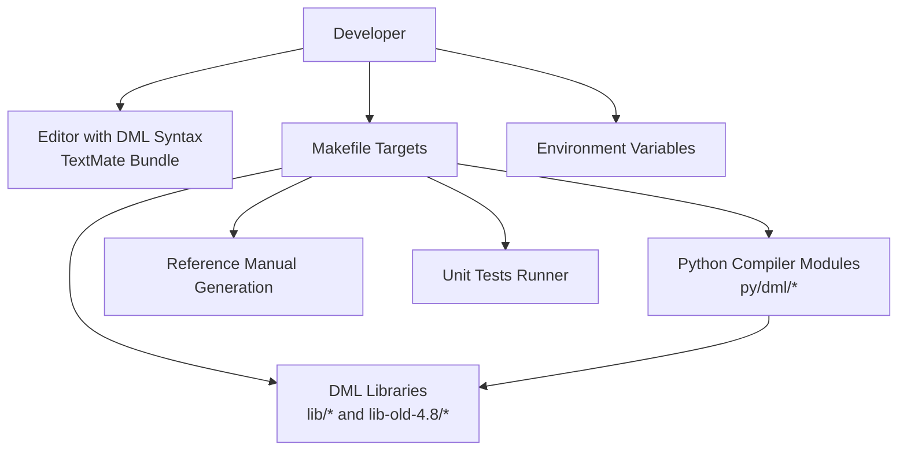
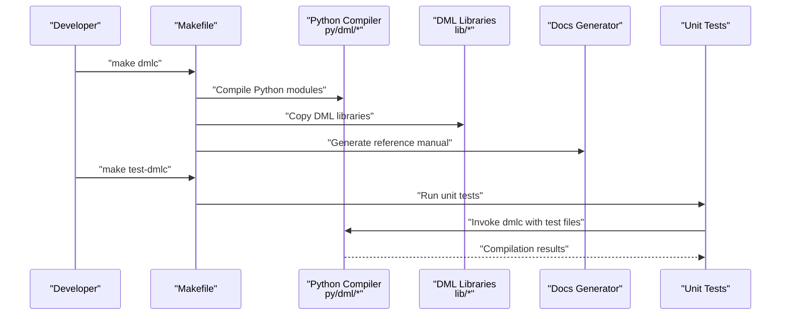
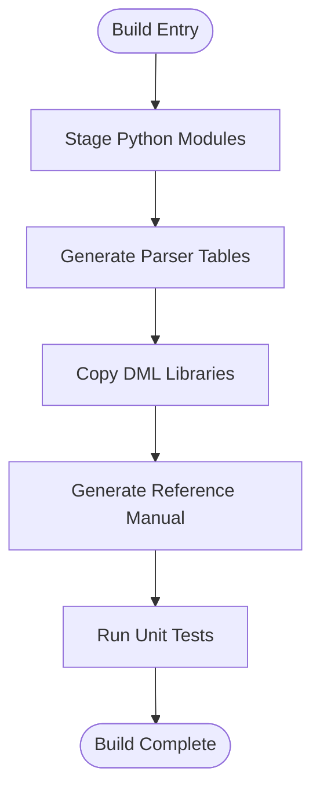
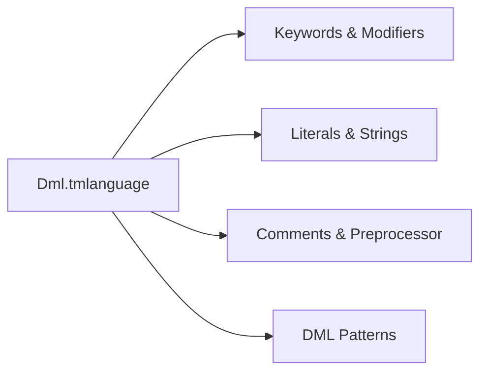
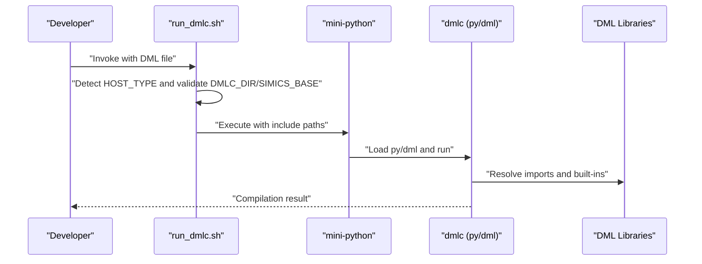
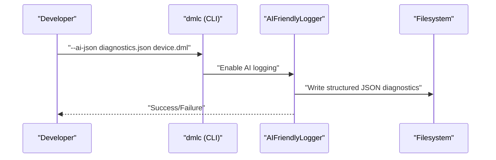
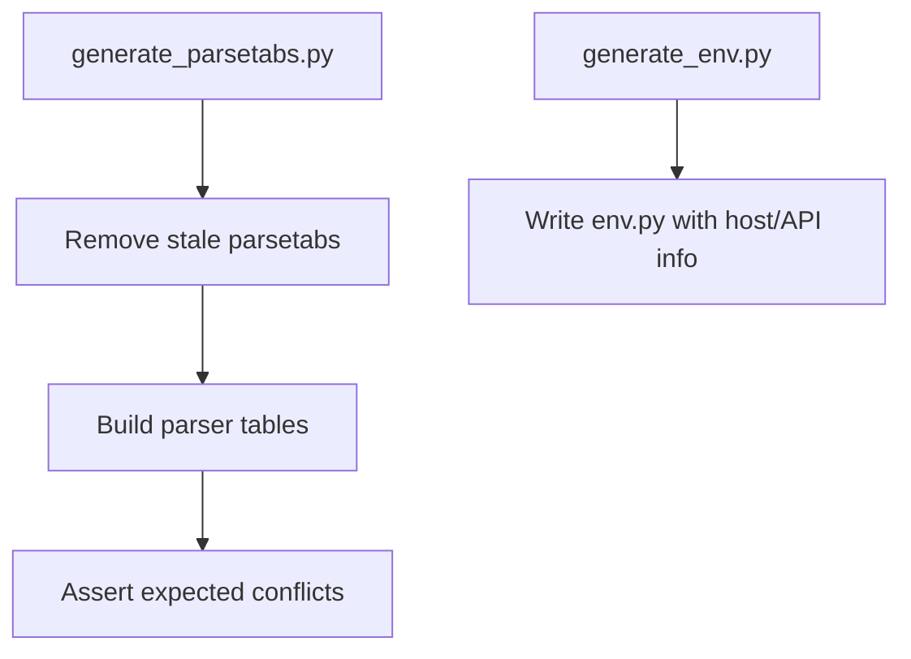
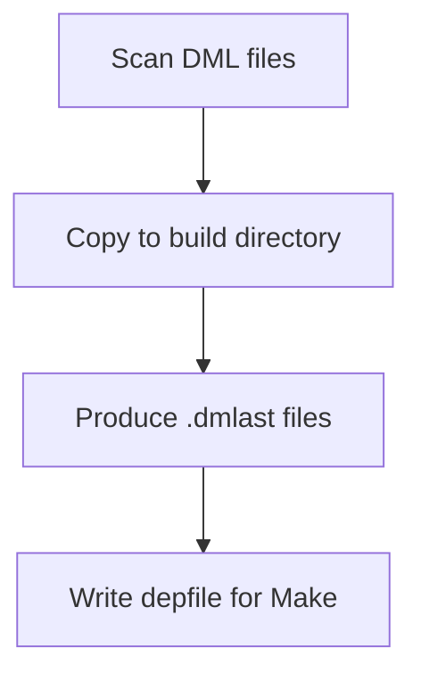
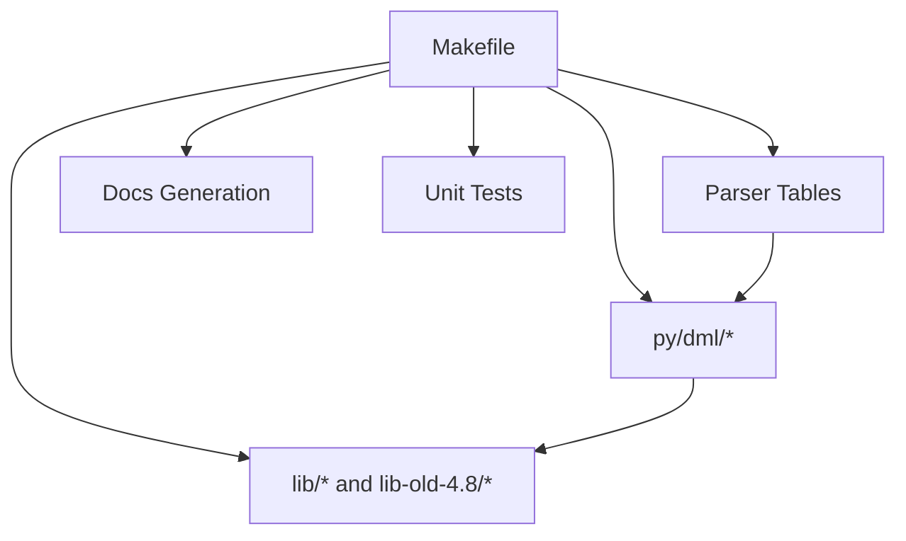

# Development Environment Setup

<cite>
**Referenced Files in This Document**
- [README.md](file://README.md)
- [Makefile](file://Makefile)
- [run_dmlc.sh](file://run_dmlc.sh)
- [run_unit_tests.py](file://run_unit_tests.py)
- [Dml.tmlanguage](file://syntaxes/Dml.tmlanguage)
- [py/README.md](file://py/README.md)
- [generate_env.py](file://generate_env.py)
- [generate_parsetabs.py](file://generate_parsetabs.py)
- [dmlast.py](file://dmlast.py)
- [AI_DIAGNOSTICS_README.md](file://AI_DIAGNOSTICS_README.md)
- [verify_ai_diagnostics.sh](file://verify_ai_diagnostics.sh)
</cite>

## Table of Contents
1. [Introduction](#introduction)
2. [Project Structure](#project-structure)
3. [Core Components](#core-components)
4. [Architecture Overview](#architecture-overview)
5. [Detailed Component Analysis](#detailed-component-analysis)
6. [Dependency Analysis](#dependency-analysis)
7. [Performance Considerations](#performance-considerations)
8. [Troubleshooting Guide](#troubleshooting-guide)
9. [Conclusion](#conclusion)
10. [Appendices](#appendices)

## Introduction
This document describes the complete DML development environment setup and configuration. It explains how to integrate the DML language support into editors, configure syntax highlighting, set up code completion and debugging, integrate with the build system, manage environment variables, and optimize the development workflow. It also covers the AI-friendly diagnostics feature and how to verify its implementation.

## Project Structure
The repository organizes DML development around:
- A Python compiler implementation under py/dml/
- Build automation via Makefile
- Editor syntax support via a TextMate bundle definition
- Scripts for invoking the compiler and running tests
- Documentation generation and validation
- AI-friendly diagnostics integration

**Diagram sources**
- [Makefile](file://Makefile#L1-L252)
- [Dml.tmlanguage](file://syntaxes/Dml.tmlanguage#L1-L1176)
- [py/README.md](file://py/README.md#L1-L134)

**Section sources**
- [README.md](file://README.md#L1-L117)
- [Makefile](file://Makefile#L1-L252)

## Core Components
- Build system: Makefile orchestrates Python packaging, library copying, parser table generation, documentation generation, and test execution.
- Compiler runtime: Python modules under py/dml/ implement parsing, AST construction, code generation, and output emission.
- Editor syntax: A TextMate bundle (Dml.tmlanguage) provides syntax highlighting for DML.
- Test harness: A runner script executes unit tests against the built compiler.
- AI diagnostics: Optional JSON export of structured diagnostics for AI-assisted workflows.
- Environment variables: Controls compiler invocation, parallelism, path substitution, and profiling.

**Section sources**
- [Makefile](file://Makefile#L1-L252)
- [py/README.md](file://py/README.md#L1-L134)
- [Dml.tmlanguage](file://syntaxes/Dml.tmlanguage#L1-L1176)
- [run_unit_tests.py](file://run_unit_tests.py#L1-L20)
- [AI_DIAGNOSTICS_README.md](file://AI_DIAGNOSTICS_README.md#L1-L157)
- [README.md](file://README.md#L46-L117)

## Architecture Overview
The DML development environment ties together editor tooling, build automation, and compiler internals. The Makefile compiles Python modules, generates parser tables, copies DML libraries, builds documentation, and runs tests. The compiler is invoked via shell scripts or Make targets, and environment variables influence behavior such as path substitution, parallel test execution, and profiling.

**Diagram sources**
- [Makefile](file://Makefile#L1-L252)
- [run_unit_tests.py](file://run_unit_tests.py#L1-L20)

## Detailed Component Analysis

### Build System Integration (Makefile)
Key responsibilities:
- Compile and stage Python modules into the Simics project’s Python package path.
- Generate parser tables for DML versions and produce parser debug outputs.
- Copy DML libraries (current and legacy) into the project’s bin directory.
- Generate documentation from Markdown sources and DML comments.
- Run unit tests and mark test coverage.

Important targets and behaviors:
- Staging Python modules and generated files into the project’s dml/python package.
- Parser table generation and debug output creation.
- Library copying for current and legacy DML versions.
- Documentation generation for DML 1.2 and 1.4.
- Unit test execution and dependency tracking via marker files.

**Diagram sources**
- [Makefile](file://Makefile#L1-L252)

**Section sources**
- [Makefile](file://Makefile#L1-L252)

### Environment Variable Configuration
The following environment variables influence development workflows:
- DMLC_DIR: Points to the host-type-specific bin directory containing the locally built compiler.
- T126_JOBS: Enables parallel test execution.
- DMLC_PATHSUBST: Rewrites error paths to point to source files instead of staged copies.
- PY_SYMLINKS: Symlink Python files during build to improve debugging and avoid re-copying.
- DMLC_DEBUG: Prints full tracebacks on exceptions instead of hiding them.
- DMLC_CC: Overrides the default compiler used in unit tests.
- DMLC_PROFILE: Enables self-profiling during compilation.
- DMLC_DUMP_INPUT_FILES: Produces an archive of all DML source files for isolated reproduction.
- DMLC_GATHER_SIZE_STATISTICS: Emits code generation statistics to optimize generated C size.

These variables are documented in the repository’s README and are intended for iterative development and debugging.

**Section sources**
- [README.md](file://README.md#L46-L117)

### IDE Integration and Syntax Highlighting (TextMate/DML)
The repository includes a TextMate bundle definition for DML syntax highlighting. This enables:
- Token classification for keywords, storage modifiers, constants, numeric literals, strings, and preprocessor directives.
- Pattern-based highlighting for DML-specific constructs such as device, register, field, bank, template, and method declarations.
- Support for comments, preprocessor rules, and string placeholders.

To integrate with editors that support TextMate bundles:
- Install the Dml.tmlanguage bundle.
- Associate .dml files with the Dml syntax.
- Enable folding markers for structured regions.

**Diagram sources**
- [Dml.tmlanguage](file://syntaxes/Dml.tmlanguage#L1-L1176)

**Section sources**
- [Dml.tmlanguage](file://syntaxes/Dml.tmlanguage#L1-L1176)

### Code Completion Setup
While the repository does not include a dedicated LSP server, the presence of:
- A comprehensive Python AST and parser implementation under py/dml/
- Generated parser tables and debug outputs
- DML library definitions in lib/*

suggests that a future LSP could leverage:
- The parser tables and AST modules for symbol lookup and hover information.
- The DML library catalogs for auto-completion of built-ins and standard templates.

Until an LSP is provided, developers can rely on:
- Editor-level TextMate syntax highlighting for structural cues.
- Running the compiler via scripts to catch errors early and improve feedback loops.

**Section sources**
- [py/README.md](file://py/README.md#L1-L134)
- [Makefile](file://Makefile#L1-L252)

### Debugging Configuration
Recommended debugging approaches:
- Use DMLC_DEBUG to display full tracebacks during compiler errors.
- Use DMLC_PROFILE to collect profiling data for performance tuning.
- Use DMLC_DUMP_INPUT_FILES to isolate complex build environments.
- Use DMLC_GATHER_SIZE_STATISTICS to identify hotspots in generated C code.
- Use PY_SYMLINKS to symlink Python sources for accurate stack traces.

These controls are documented in the repository’s README and are useful for iterative development and performance optimization.

**Section sources**
- [README.md](file://README.md#L46-L117)

### Compiler Invocation and Test Execution
Two primary mechanisms exist:
- Shell script wrapper: run_dmlc.sh determines host type, validates DMLC_DIR and SIMICS_BASE, and invokes the mini-python runtime with appropriate include paths and flags.
- Unit test runner: run_unit_tests.py appends the built Python package path and executes a named test module.

**Diagram sources**
- [run_dmlc.sh](file://run_dmlc.sh#L1-L67)
- [Makefile](file://Makefile#L100-L101)

**Section sources**
- [run_dmlc.sh](file://run_dmlc.sh#L1-L67)
- [run_unit_tests.py](file://run_unit_tests.py#L1-L20)

### AI-Friendly Diagnostics
The repository introduces AI diagnostics that export structured JSON for compilation errors and warnings. Key aspects:
- CLI flag: --ai-json to emit diagnostics to a JSON file.
- Output format: Includes summary statistics, categorized diagnostics, severity, location, fix suggestions, and documentation URLs.
- Integration: Hooks into the existing logging infrastructure and preserves all existing error types.
- Verification: A script checks for required files, integration points, and basic functionality.

**Diagram sources**
- [AI_DIAGNOSTICS_README.md](file://AI_DIAGNOSTICS_README.md#L1-L157)
- [verify_ai_diagnostics.sh](file://verify_ai_diagnostics.sh#L1-L86)

**Section sources**
- [AI_DIAGNOSTICS_README.md](file://AI_DIAGNOSTICS_README.md#L1-L157)
- [verify_ai_diagnostics.sh](file://verify_ai_diagnostics.sh#L1-L86)

### Parser Table Generation and Environment Discovery
The build pipeline includes:
- Parser table generation via generate_parsetabs.py, which removes stale tables and asserts expected shift/reduce conflicts.
- Environment discovery via generate_env.py, which writes host-specific constants and API versions to env.py.

**Diagram sources**
- [generate_parsetabs.py](file://generate_parsetabs.py#L1-L38)
- [generate_env.py](file://generate_env.py#L1-L23)

**Section sources**
- [generate_parsetabs.py](file://generate_parsetabs.py#L1-L38)
- [generate_env.py](file://generate_env.py#L1-L23)

### DMLAST Generation and Dependency Tracking
The dmlast.py script produces .dmlast files for DML sources, enabling incremental builds and dependency tracking. It copies DML files to the build directory, generates AST markers, and writes depfiles for Make.

**Diagram sources**
- [dmlast.py](file://dmlast.py#L1-L39)

**Section sources**
- [dmlast.py](file://dmlast.py#L1-L39)

## Dependency Analysis
The build system depends on:
- Simics project structure and HOST_TYPE detection.
- Python modules under py/dml/ for compilation and code generation.
- DML libraries under lib/ and lib-old-4.8/ for built-ins and compatibility.
- Parser table generation and debug outputs for grammar validation.
- Documentation generation scripts and validators.

**Diagram sources**
- [Makefile](file://Makefile#L1-L252)

**Section sources**
- [Makefile](file://Makefile#L1-L252)

## Performance Considerations
- Use DMLC_GATHER_SIZE_STATISTICS to identify methods generating large amounts of C code and refactor templates or methods accordingly.
- Enable DMLC_PROFILE to collect profiling data for compiler stages.
- Use DMLC_DUMP_INPUT_FILES to reproduce and isolate performance regressions in complex environments.
- Prefer PY_SYMLINKS to speed up iteration cycles by avoiding repeated file copying.

[No sources needed since this section provides general guidance]

## Troubleshooting Guide
Common issues and remedies:
- Missing DMLC_DIR: Ensure DMLC_DIR points to the correct host-type bin directory and run make dmlc first.
- Incorrect SIMICS_BASE: The run_dmlc.sh script extracts SIMICS_BASE from the project’s simics script; verify environment or adjust accordingly.
- Path substitution for errors: Set DMLC_PATHSUBST to rewrite error paths to source files for clearer debugging.
- Parallel tests: Set T126_JOBS to run multiple tests concurrently.
- Profiling and diagnostics: Use DMLC_PROFILE and DMLC_DEBUG to gather insights and tracebacks.
- AI diagnostics verification: Run verify_ai_diagnostics.sh to confirm that required files and integrations are present.

**Section sources**
- [run_dmlc.sh](file://run_dmlc.sh#L1-L67)
- [README.md](file://README.md#L46-L117)
- [verify_ai_diagnostics.sh](file://verify_ai_diagnostics.sh#L1-L86)

## Conclusion
The DML development environment combines a robust Makefile-driven build system, a Python-based compiler implementation, TextMate syntax support, and optional AI diagnostics. By leveraging environment variables, the build system, and verification scripts, developers can streamline setup, improve debugging, and optimize performance. Integrating AI-friendly diagnostics further enhances the development cycle by providing structured, actionable feedback for automated tools.

[No sources needed since this section summarizes without analyzing specific files]

## Appendices

### Appendix A: Environment Variables Quick Reference
- DMLC_DIR: Host-type bin directory for the locally built compiler.
- T126_JOBS: Number of tests to run in parallel.
- DMLC_PATHSUBST: Rewrite error paths to source files.
- PY_SYMLINKS: Symlink Python files during build.
- DMLC_DEBUG: Print full tracebacks on exceptions.
- DMLC_CC: Override compiler in unit tests.
- DMLC_PROFILE: Enable self-profiling.
- DMLC_DUMP_INPUT_FILES: Emit archive of DML sources for isolation.
- DMLC_GATHER_SIZE_STATISTICS: Output code generation statistics.

**Section sources**
- [README.md](file://README.md#L46-L117)

### Appendix B: Editor Configuration Tips
- Install the Dml.tmlanguage bundle for DML syntax highlighting.
- Configure the editor to fold blocks based on folding markers.
- Associate .dml files with the Dml syntax for keyword and pattern recognition.

**Section sources**
- [Dml.tmlanguage](file://syntaxes/Dml.tmlanguage#L1-L1176)