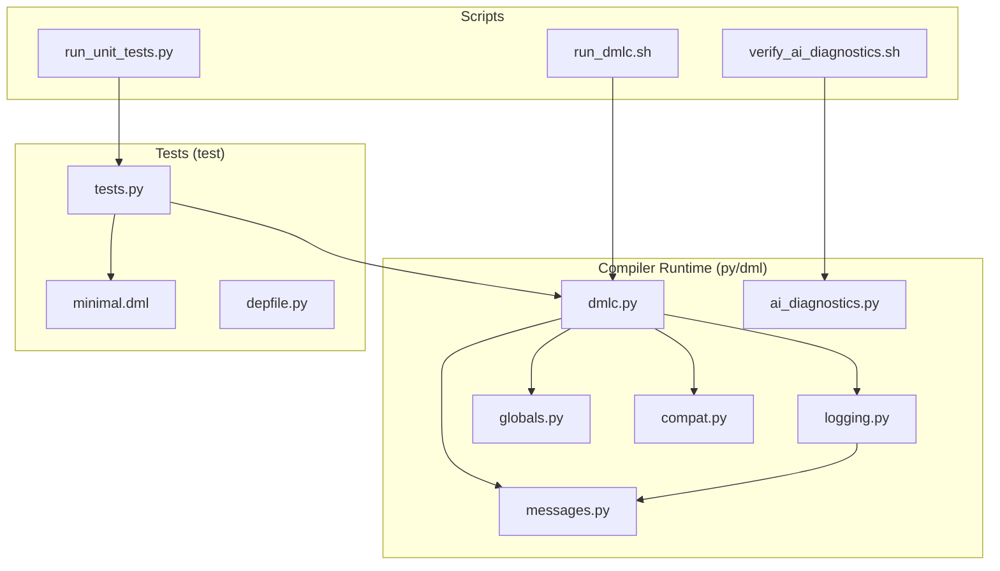
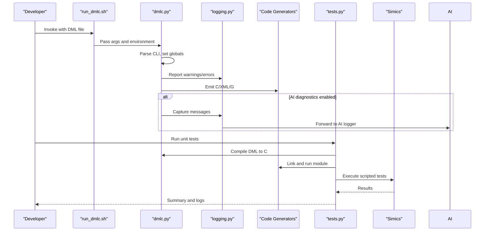
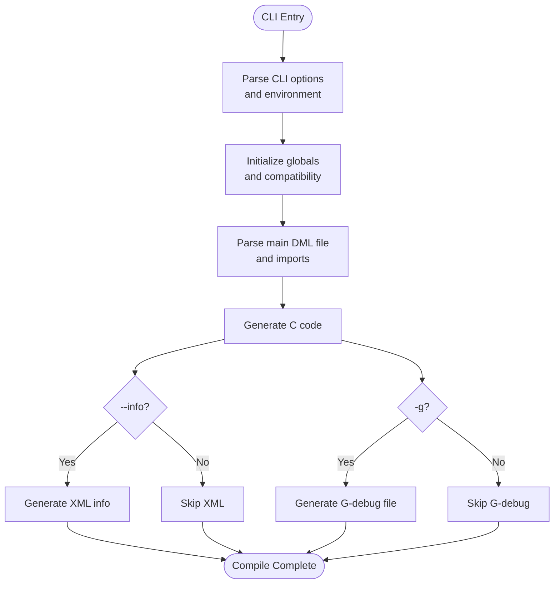
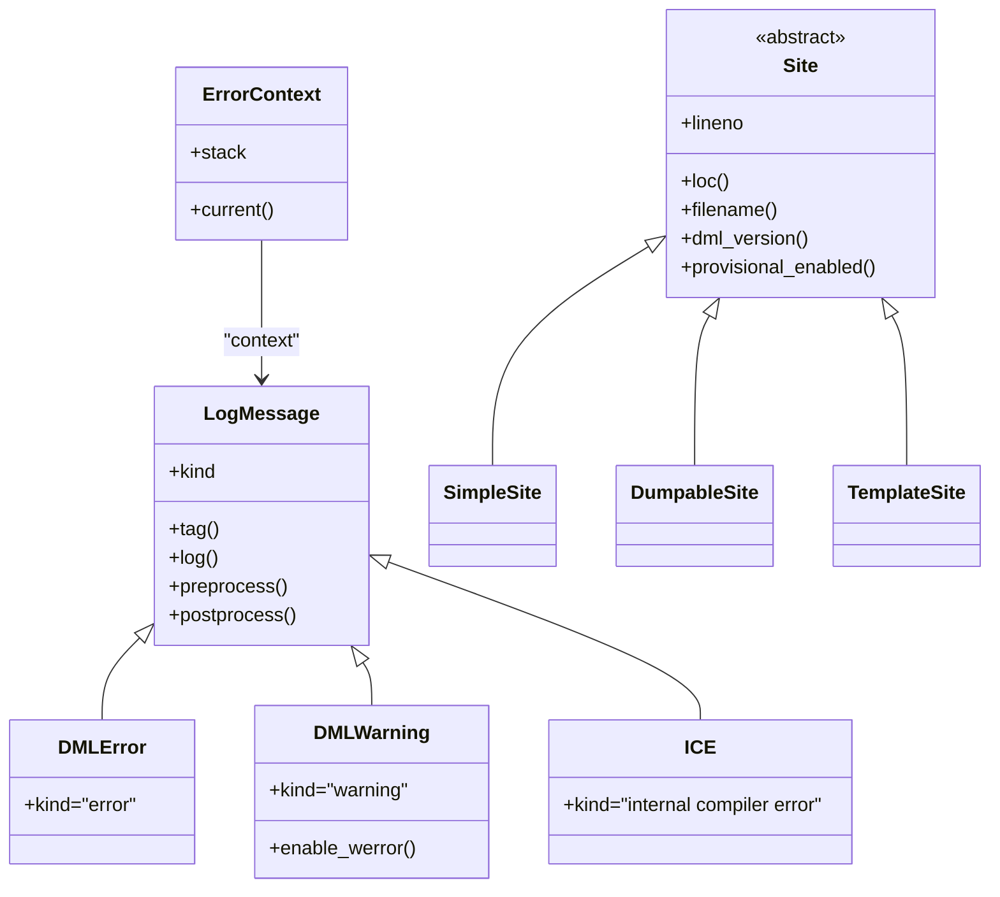
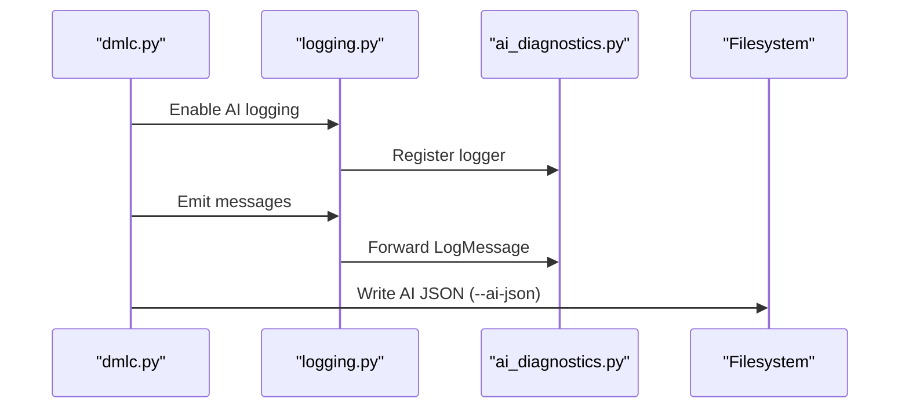
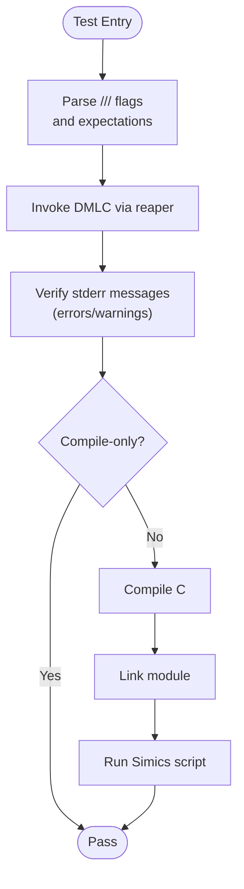
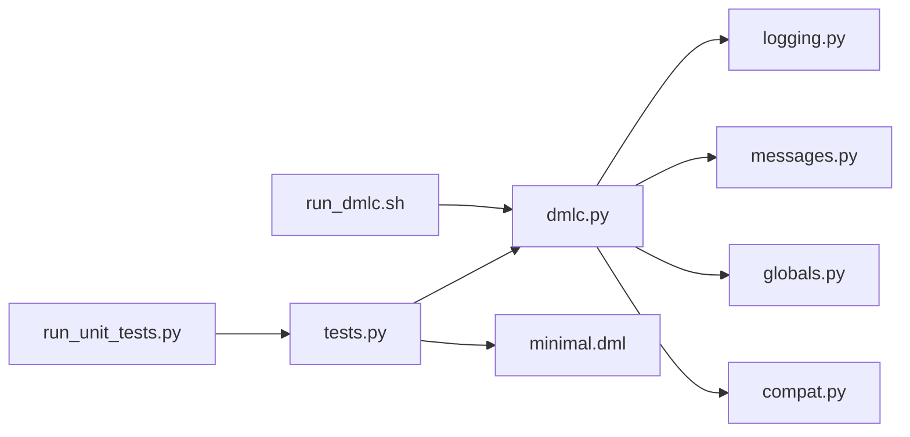

# Development Tools and Testing

<cite>
**Referenced Files in This Document**
- [README.md](file://README.md)
- [run_dmlc.sh](file://run_dmlc.sh)
- [run_unit_tests.py](file://run_unit_tests.py)
- [dmlc.py](file://py/dml/dmlc.py)
- [logging.py](file://py/dml/logging.py)
- [messages.py](file://py/dml/messages.py)
- [ai_diagnostics.py](file://py/dml/ai_diagnostics.py)
- [tests.py](file://test/tests.py)
- [verify_ai_diagnostics.sh](file://verify_ai_diagnostics.sh)
- [minimal.dml](file://test/minimal.dml)
- [depfile.py](file://test/depfile.py)
- [compat.py](file://py/dml/compat.py)
- [globals.py](file://py/dml/globals.py)
</cite>

## Table of Contents
1. [Introduction](#introduction)
2. [Project Structure](#project-structure)
3. [Core Components](#core-components)
4. [Architecture Overview](#architecture-overview)
5. [Detailed Component Analysis](#detailed-component-analysis)
6. [Dependency Analysis](#dependency-analysis)
7. [Performance Considerations](#performance-considerations)
8. [Troubleshooting Guide](#troubleshooting-guide)
9. [Conclusion](#conclusion)
10. [Appendices](#appendices)

## Introduction
This document explains the Device Modeling Language (DML) development tools and testing framework. It covers the DMLC command-line interface, debugging and profiling features, the testing framework architecture, unit testing methodologies, error reporting and diagnostics, environment variable configuration, and troubleshooting strategies. It also outlines how these tools integrate with the broader DML ecosystem.

## Project Structure
The repository organizes DML tooling and tests across several areas:
- Command-line compiler and runtime: py/dml/*
- Test harness and suites: test/*
- Shell helpers and scripts: run_dmlc.sh, run_unit_tests.py, verify_ai_diagnostics.sh
- Documentation and examples: README.md, test/minimal.dml

**Diagram sources**
- [dmlc.py](file://py/dml/dmlc.py#L309-L800)
- [logging.py](file://py/dml/logging.py#L1-L468)
- [messages.py](file://py/dml/messages.py#L1-L800)
- [ai_diagnostics.py](file://py/dml/ai_diagnostics.py#L1-L391)
- [tests.py](file://test/tests.py#L1-L800)
- [minimal.dml](file://test/minimal.dml#L1-L8)
- [depfile.py](file://test/depfile.py#L1-L29)
- [run_dmlc.sh](file://run_dmlc.sh#L1-L67)
- [run_unit_tests.py](file://run_unit_tests.py#L1-L20)
- [verify_ai_diagnostics.sh](file://verify_ai_diagnostics.sh#L1-L86)

**Section sources**
- [README.md](file://README.md#L1-L117)
- [run_dmlc.sh](file://run_dmlc.sh#L1-L67)
- [run_unit_tests.py](file://run_unit_tests.py#L1-L20)

## Core Components
- DMLC command-line interface: parses options, orchestrates compilation, and manages diagnostics and profiling.
- Logging and diagnostics: centralized reporting, warnings, errors, and AI-friendly JSON export.
- Testing framework: robust harness for compiling DML, invoking C toolchains, running Simics, and validating outputs.
- Environment configuration: variables controlling builds, debugging, profiling, and diagnostics.

Key responsibilities:
- DMLC: CLI parsing, compatibility feature selection, dependency generation, code generation, and error handling.
- Logging: structured error/warning reporting, context capture, and optional AI integration.
- Tests: end-to-end compilation and runtime validation, with flexible flags and environment overrides.
- Scripts: portable invocation of DMLC and test runner across platforms.

**Section sources**
- [dmlc.py](file://py/dml/dmlc.py#L309-L800)
- [logging.py](file://py/dml/logging.py#L1-L468)
- [tests.py](file://test/tests.py#L1-L800)
- [README.md](file://README.md#L46-L117)

## Architecture Overview
The DMLC pipeline integrates parsing, semantic analysis, code generation, and optional diagnostics. The testing framework wraps DMLC, compiles generated C, links a Simics module, and executes scripted tests.

**Diagram sources**
- [run_dmlc.sh](file://run_dmlc.sh#L56-L66)
- [dmlc.py](file://py/dml/dmlc.py#L666-L760)
- [logging.py](file://py/dml/logging.py#L433-L452)
- [ai_diagnostics.py](file://py/dml/ai_diagnostics.py#L286-L364)
- [tests.py](file://test/tests.py#L766-L807)

## Detailed Component Analysis

### DMLC Command-Line Interface
DMLC exposes a comprehensive set of options for compilation, diagnostics, compatibility, and debugging:
- Search paths and defines: -I, -D
- Dependency generation: --dep, --dep-target, --no-dep-phony
- Debugging and coverage: -g, --noline, --coverity
- Information output: --info
- API selection: --simics-api
- Error control: --max-errors, --werror
- Compatibility: --no-compat, --strict-dml12, --strict-int
- AI diagnostics: --ai-json
- Porting aid: -P
- Internal testing: --enable-features-for-internal-testing-dont-use-this
- Positional args: input DML file, output base

Debugging and profiling:
- DMLC_DEBUG toggles verbose exception reporting to stderr.
- DMLC_PROFILE triggers cProfile-based self-profiling.
- DMLC_DUMP_INPUT_FILES creates a .tar.bz2 archive of inputs for isolated reproduction.
- DMLC_GATHER_SIZE_STATISTICS outputs per-method C code size statistics.

Environment variables:
- DMLC_DIR: points to local build bin directory.
- DMLC_PATHSUBST: remaps error paths to source files.
- PY_SYMLINKS: symlink Python sources for easier debugging.
- T126_JOBS: parallel test jobs.
- DMLC_CC: override compiler for tests.
- DMLC_DEBUG/DMLC_PROFILE/DMLC_DUMP_INPUT_FILES/DMLC_GATHER_SIZE_STATISTICS: as above.

Processing flow:
- Parse CLI, initialize globals, set compatibility features, configure warnings.
- Parse main DML file, collect imports and dependencies.
- Generate C, optionally XML (--info) and G-debug files (-g).
- Optionally write AI diagnostics JSON (--ai-json).
- Return exit status based on failures.

**Diagram sources**
- [dmlc.py](file://py/dml/dmlc.py#L509-L760)

**Section sources**
- [dmlc.py](file://py/dml/dmlc.py#L309-L800)
- [README.md](file://README.md#L46-L117)

### Logging and Diagnostics
Logging centralizes error and warning reporting with structured context:
- LogMessage base class, DMLError, DMLWarning, ICE.
- ErrorContext tracks call/template expansion context.
- Site and FileInfo provide location information and path substitution.
- Warning control: enable/disable tags, treat warnings as errors (--werror).
- AI-friendly logging: optional capture and export to JSON via ai_diagnostics.

**Diagram sources**
- [logging.py](file://py/dml/logging.py#L106-L468)

**Section sources**
- [logging.py](file://py/dml/logging.py#L1-L468)
- [messages.py](file://py/dml/messages.py#L1-L800)

### AI-Friendly Diagnostics
DMLC can export structured diagnostics optimized for AI assistance:
- --ai-json enables AI logging and writes JSON to a file.
- AIFriendlyLogger captures all messages and produces a summary with categorized counts.
- AIDiagnostic maps tags to categories (syntax, type_mismatch, template_resolution, etc.) and generates fix suggestions.
- Integration with logging module ensures all messages are captured.

Verification script checks implementation presence and usage examples.

**Diagram sources**
- [dmlc.py](file://py/dml/dmlc.py#L625-L798)
- [logging.py](file://py/dml/logging.py#L433-L452)
- [ai_diagnostics.py](file://py/dml/ai_diagnostics.py#L286-L364)
- [verify_ai_diagnostics.sh](file://verify_ai_diagnostics.sh#L1-L86)

**Section sources**
- [dmlc.py](file://py/dml/dmlc.py#L470-L478)
- [ai_diagnostics.py](file://py/dml/ai_diagnostics.py#L1-L391)
- [verify_ai_diagnostics.sh](file://verify_ai_diagnostics.sh#L1-L86)

### Testing Framework
The test harness compiles DML to C, links a Simics module, and runs scripted tests:
- DMLFileTestCase: base for DML compilation tests.
- CTestCase: adds CC, linker, and Simics execution steps.
- Test flags parsed from DML comments (///) for expected errors/warnings, flags, and behaviors.
- Environment overrides: DMLC_CC, DMLC_LINE_DIRECTIVES, DMLC_PYTHON.
- Parallelism: T126_JOBS influences test runner behavior.
- Dependency generation: parse_depfile supports make-style dependency parsing.

**Diagram sources**
- [tests.py](file://test/tests.py#L521-L807)
- [depfile.py](file://test/depfile.py#L1-L29)

**Section sources**
- [tests.py](file://test/tests.py#L1-L800)
- [minimal.dml](file://test/minimal.dml#L1-L8)
- [depfile.py](file://test/depfile.py#L1-L29)

### Compatibility and Feature Flags
DML supports gradual migration via compatibility features:
- --no-compat selects features to disable.
- --strict-dml12 and --strict-int enable stricter modes.
- Compatibility features define last supported API version and provide short descriptions.

**Section sources**
- [dmlc.py](file://py/dml/dmlc.py#L460-L468)
- [compat.py](file://py/dml/compat.py#L1-L432)

## Dependency Analysis
DMLC depends on logging, messages, globals, and compatibility modules. The test harness depends on DMLC and Simics utilities.

**Diagram sources**
- [dmlc.py](file://py/dml/dmlc.py#L11-L25)
- [tests.py](file://test/tests.py#L32-L35)
- [run_dmlc.sh](file://run_dmlc.sh#L56-L66)
- [run_unit_tests.py](file://run_unit_tests.py#L7-L19)

**Section sources**
- [dmlc.py](file://py/dml/dmlc.py#L11-L25)
- [tests.py](file://test/tests.py#L32-L35)

## Performance Considerations
- Profiling: DMLC_PROFILE enables cProfile-based self-profiling; analyze .prof outputs to identify hotspots.
- Code size statistics: DMLC_GATHER_SIZE_STATISTICS helps optimize generated C by highlighting heavy methods.
- Splitting C files: --split-c-file can distribute large outputs across multiple files.
- Dependency generation: --dep reduces rebuild churn by emitting accurate dependency rules.

Recommendations:
- Use --max-errors to cap noise during early iterations.
- Prefer --noline when debugging C code directly to simplify backtraces.
- Leverage AI diagnostics to accelerate fixing repeated patterns.

[No sources needed since this section provides general guidance]

## Troubleshooting Guide
Common issues and remedies:
- Unexpected exceptions: set DMLC_DEBUG=1 to print tracebacks to stderr; otherwise, exceptions are logged to dmlc-error.log.
- Cyclic imports or template inheritance: consult ECYCLICIMP and ECYCLICTEMPLATE messages; refactor imports/templates.
- Missing device declaration: EDEVICE indicates missing top-level device statement; ensure the DML file starts with a device declaration.
- Import errors: EIMPORT suggests incorrect paths or missing -I entries; verify include paths and relative imports.
- Type mismatches: ECAST, EBINOP, and related errors indicate incompatible types; adjust expressions or casts.
- Future timestamps in dependency files: DMLC detects and warns about future timestamps; adjust system clock or rebuild targets.
- Reproducing issues: set DMLC_DUMP_INPUT_FILES to generate a .tar.bz2 archive for isolated testing on Linux.

Debugging strategies:
- Use -g to generate G-debug files and improve source-level debugging.
- Enable --werror to treat warnings as errors and catch issues early.
- Use --ai-json to export structured diagnostics for AI-assisted fixes.
- Inspect dmlc-error.log for hidden exceptions when DMLC_DEBUG is not set.

**Section sources**
- [dmlc.py](file://py/dml/dmlc.py#L227-L237)
- [dmlc.py](file://py/dml/dmlc.py#L666-L730)
- [logging.py](file://py/dml/logging.py#L91-L96)
- [messages.py](file://py/dml/messages.py#L115-L127)
- [README.md](file://README.md#L75-L94)

## Conclusion
The DML development tools provide a robust, configurable, and extensible environment for building and validating device models. DMLC’s CLI offers fine-grained control over compilation, diagnostics, and compatibility, while the testing framework automates end-to-end validation against Simics. AI diagnostics streamline error correction, and environment variables tailor workflows to developer needs. Together, these components integrate tightly with the DML ecosystem to support efficient and reliable development.

[No sources needed since this section summarizes without analyzing specific files]

## Appendices

### Environment Variables Reference
- DMLC_DIR: Points to local build bin directory for DMLC.
- T126_JOBS: Number of parallel tests to run.
- DMLC_PATHSUBST: Remap error paths to source files for clearer diagnostics.
- PY_SYMLINKS: Symlink Python sources during build for easier debugging.
- DMLC_DEBUG: Echo unexpected exceptions to stderr.
- DMLC_CC: Override compiler for tests.
- DMLC_PROFILE: Enable self-profiling and write .prof output.
- DMLC_DUMP_INPUT_FILES: Emit a .tar.bz2 archive of all DML inputs for isolated reproduction.
- DMLC_GATHER_SIZE_STATISTICS: Output per-method C code size statistics to a JSON file.

**Section sources**
- [README.md](file://README.md#L46-L117)

### AI Diagnostics Verification
The verification script confirms:
- Presence of ai_diagnostics.py and integration points.
- CLI flag availability (--ai-json).
- Supporting documentation and test file existence.
- Basic Python module checks.

**Section sources**
- [verify_ai_diagnostics.sh](file://verify_ai_diagnostics.sh#L1-L86)