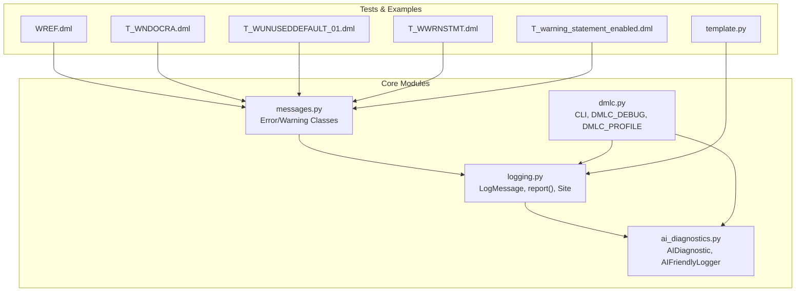
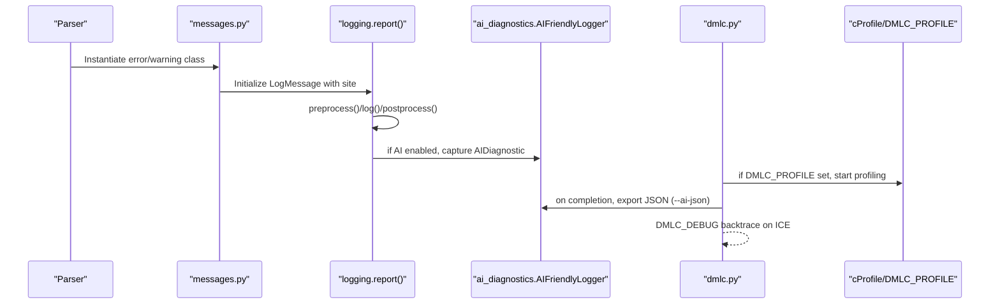
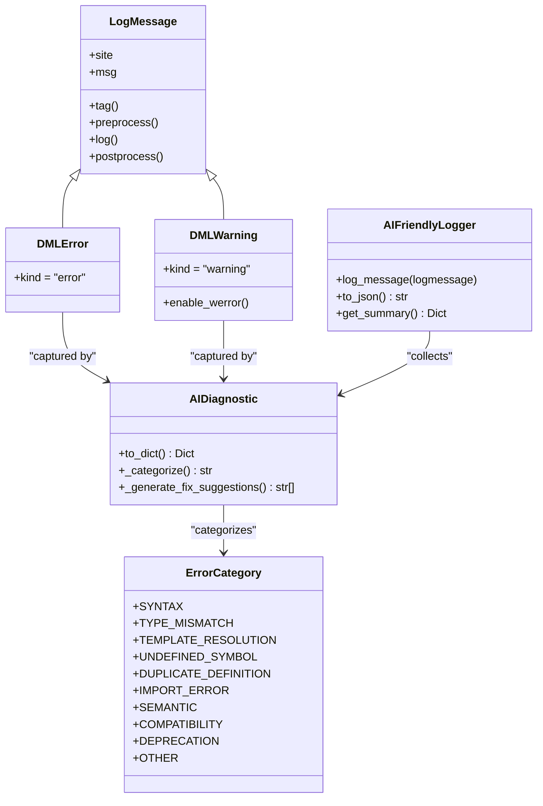
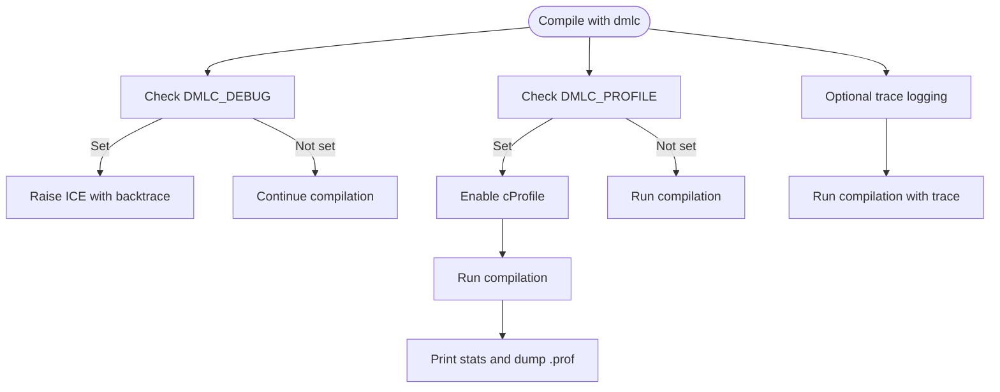
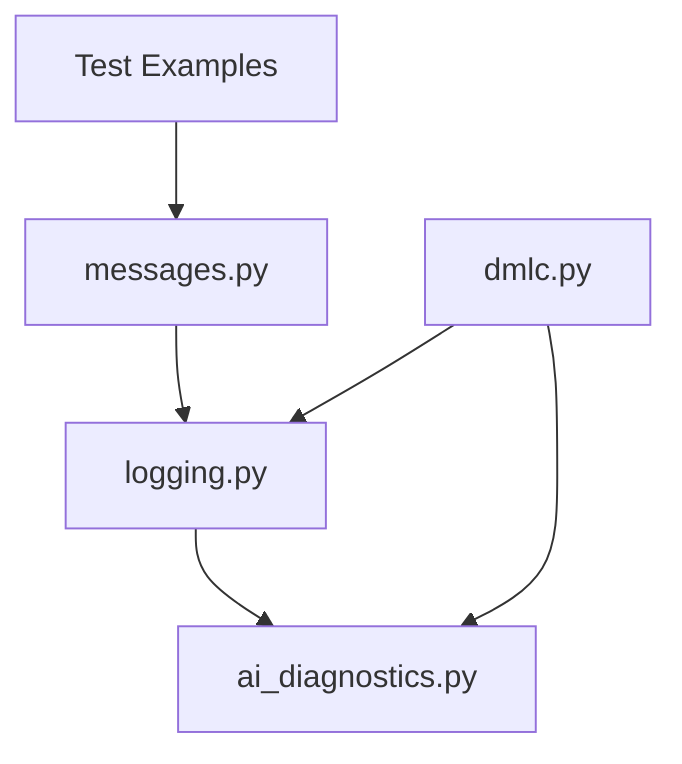

# Error Reporting and Debugging Tools

<cite>
**Referenced Files in This Document**
- [messages.py](file://py/dml/messages.py)
- [logging.py](file://py/dml/logging.py)
- [ai_diagnostics.py](file://py/dml/ai_diagnostics.py)
- [dmlc.py](file://py/dml/dmlc.py)
- [README.md](file://py/README.md)
- [IMPLEMENTATION_SUMMARY.md](file://IMPLEMENTATION_SUMMARY.md)
- [QUICKSTART_AI_DIAGNOSTICS.md](file://QUICKSTART_AI_DIAGNOSTICS.md)
- [verify_ai_diagnostics.sh](file://verify_ai_diagnostics.sh)
- [WREF.dml](file://test/1.2/errors/WREF.dml)
- [T_WNDOCRA.dml](file://test/1.2/errors/T_WNDOCRA.dml)
- [T_WUNUSEDDEFAULT_01.dml](file://test/1.2/errors/T_WUNUSEDDEFAULT_01.dml)
- [T_WWRNSTMT.dml](file://test/1.2/errors/T_WWRNSTMT.dml)
- [T_warning_statement_enabled.dml](file://test/1.4/legacy/T_warning_statement_enabled.dml)
- [template.py](file://py/dml/template.py)
</cite>

## Table of Contents
1. [Introduction](#introduction)
2. [Project Structure](#project-structure)
3. [Core Components](#core-components)
4. [Architecture Overview](#architecture-overview)
5. [Detailed Component Analysis](#detailed-component-analysis)
6. [Dependency Analysis](#dependency-analysis)
7. [Performance Considerations](#performance-considerations)
8. [Troubleshooting Guide](#troubleshooting-guide)
9. [Conclusion](#conclusion)
10. [Appendices](#appendices)

## Introduction
This document provides comprehensive documentation for the DML error reporting and debugging systems. It covers the message formatting system, warning categorization (including WREF, WNDOC, WSUPPRESS, etc.), error code structure, AI diagnostics integration for machine-readable error reporting and automated error correction support, debugging workflows (DMLC_DEBUG mode, profiling with DMLC_PROFILE), error context and position tracking, stack trace generation, and troubleshooting guides for common compilation errors and template resolution issues. It also explains the relationship between development tools and the broader DML ecosystem.

## Project Structure
The error reporting and debugging system spans several core modules:
- Error and warning definitions: [messages.py](file://py/dml/messages.py)
- Logging and reporting infrastructure: [logging.py](file://py/dml/logging.py)
- AI diagnostics integration: [ai_diagnostics.py](file://py/dml/ai_diagnostics.py)
- Command-line interface and debugging/profiling controls: [dmlc.py](file://py/dml/dmlc.py)
- Developer notes and environment variables: [README.md](file://py/README.md)
- AI diagnostics implementation details and schema: [IMPLEMENTATION_SUMMARY.md](file://IMPLEMENTATION_SUMMARY.md), [QUICKSTART_AI_DIAGNOSTICS.md](file://QUICKSTART_AI_DIAGNOSTICS.md)
- Verification script for AI diagnostics: [verify_ai_diagnostics.sh](file://verify_ai_diagnostics.sh)
- Examples of warnings and errors: [WREF.dml](file://test/1.2/errors/WREF.dml), [T_WNDOCRA.dml](file://test/1.2/errors/T_WNDOCRA.dml), [T_WUNUSEDDEFAULT_01.dml](file://test/1.2/errors/T_WUNUSEDDEFAULT_01.dml), [T_WWRNSTMT.dml](file://test/1.2/errors/T_WWRNSTMT.dml), [T_warning_statement_enabled.dml](file://test/1.4/legacy/T_warning_statement_enabled.dml)
- Template resolution and cycle detection: [template.py](file://py/dml/template.py)

**Diagram sources**
- [messages.py](file://py/dml/messages.py#L1-L800)
- [logging.py](file://py/dml/logging.py#L106-L205)
- [ai_diagnostics.py](file://py/dml/ai_diagnostics.py#L1-L120)
- [dmlc.py](file://py/dml/dmlc.py#L45-L80)
- [WREF.dml](file://test/1.2/errors/WREF.dml#L1-L14)
- [T_WNDOCRA.dml](file://test/1.2/errors/T_WNDOCRA.dml#L1-L21)
- [T_WUNUSEDDEFAULT_01.dml](file://test/1.2/errors/T_WUNUSEDDEFAULT_01.dml#L1-L83)
- [T_WWRNSTMT.dml](file://test/1.2/errors/T_WWRNSTMT.dml#L1-L26)
- [T_warning_statement_enabled.dml](file://test/1.4/legacy/T_warning_statement_enabled.dml#L1-L15)
- [template.py](file://py/dml/template.py#L375-L404)

**Section sources**
- [messages.py](file://py/dml/messages.py#L1-L800)
- [logging.py](file://py/dml/logging.py#L106-L205)
- [ai_diagnostics.py](file://py/dml/ai_diagnostics.py#L1-L120)
- [dmlc.py](file://py/dml/dmlc.py#L45-L80)

## Core Components
- Error and warning classes: Centralized in [messages.py](file://py/dml/messages.py) with distinct classes for each error/warning type. Each class defines a format string and optional contextual logging behavior.
- Logging framework: Implemented in [logging.py](file://py/dml/logging.py) with base classes LogMessage, DMLError, DMLWarning, and ICE. Provides site-based location reporting, context tracking, and integration points for AI diagnostics.
- AI diagnostics: Implemented in [ai_diagnostics.py](file://py/dml/ai_diagnostics.py) with AIDiagnostic and AIFriendlyLogger to capture structured diagnostics, categorize errors, and export JSON.
- CLI and debugging: [dmlc.py](file://py/dml/dmlc.py) exposes DMLC_DEBUG and DMLC_PROFILE environment variables, integrates AI diagnostics export, and manages profiling output.
- Position tracking and context: Site classes (SimpleSite, DumpableSite, TemplateSite) in [logging.py](file://py/dml/logging.py) provide precise location information and DML version context.
- Template resolution and cycles: [template.py](file://py/dml/template.py) detects cyclic template and import dependencies and reports ECYCLICTEMPLATE and ECYCLICIMP.

**Section sources**
- [messages.py](file://py/dml/messages.py#L2070-L2200)
- [logging.py](file://py/dml/logging.py#L106-L205)
- [ai_diagnostics.py](file://py/dml/ai_diagnostics.py#L27-L117)
- [dmlc.py](file://py/dml/dmlc.py#L45-L80)
- [template.py](file://py/dml/template.py#L375-L404)

## Architecture Overview
The error reporting pipeline integrates the logging framework with AI diagnostics and CLI controls:

**Diagram sources**
- [messages.py](file://py/dml/messages.py#L27-L80)
- [logging.py](file://py/dml/logging.py#L433-L453)
- [ai_diagnostics.py](file://py/dml/ai_diagnostics.py#L305-L354)
- [dmlc.py](file://py/dml/dmlc.py#L45-L80)
- [README.md](file://py/README.md#L18-L32)

## Detailed Component Analysis

### Message Formatting System
- LogMessage base class constructs human-readable messages using format strings and positional arguments.
- DMLError and DMLWarning derive from LogMessage and integrate with the reporting pipeline.
- Site classes provide precise location information (file, line, column) and DML version context.

Key behaviors:
- Location formatting via site.loc() and site.filename().
- Context-aware logging with template expansion sites.
- Optional tag inclusion for verbose reporting.

**Section sources**
- [logging.py](file://py/dml/logging.py#L106-L205)
- [logging.py](file://py/dml/logging.py#L270-L430)

### Warning Categorization (WREF, WNDOC, WSUPPRESS, etc.)
- WREF: Unused parameter refers to an undeclared object; indicates potential future hard error.
- WNDOCRA: Missing documentation-related attributes in connect/attribute blocks.
- WSUPPRESS: Suppressed warnings via CLI flags or ignore_warning() defaults.
- WWRNSTMT: Explicit warning statement usage.
- WEXPERIMENTAL/WDEPRECATED: Experimental or deprecated features.
- WUNUSEDDEFAULT: Unused default methods in templates.

Examples:
- WREF example: [WREF.dml](file://test/1.2/errors/WREF.dml#L12-L13)
- WNDOCRA example: [T_WNDOCRA.dml](file://test/1.2/errors/T_WNDOCRA.dml#L11-L20)
- WUNUSEDDEFAULT example: [T_WUNUSEDDEFAULT_01.dml](file://test/1.2/errors/T_WUNUSEDDEFAULT_01.dml#L13-L32)
- WWRNSTMT example: [T_WWRNSTMT.dml](file://test/1.2/errors/T_WWRNSTMT.dml#L15-L16)
- WEXPERIMENTAL in 1.4: [T_warning_statement_enabled.dml](file://test/1.4/legacy/T_warning_statement_enabled.dml#L13-L14)

**Section sources**
- [messages.py](file://py/dml/messages.py#L2071-L2101)
- [messages.py](file://py/dml/messages.py#L2140-L2155)
- [messages.py](file://py/dml/messages.py#L2013-L2028)
- [messages.py](file://py/dml/messages.py#L2060-L2066)
- [WREF.dml](file://test/1.2/errors/WREF.dml#L12-L13)
- [T_WNDOCRA.dml](file://test/1.2/errors/T_WNDOCRA.dml#L11-L20)
- [T_WUNUSEDDEFAULT_01.dml](file://test/1.2/errors/T_WUNUSEDDEFAULT_01.dml#L13-L32)
- [T_WWRNSTMT.dml](file://test/1.2/errors/T_WWRNSTMT.dml#L15-L16)
- [T_warning_statement_enabled.dml](file://test/1.4/legacy/T_warning_statement_enabled.dml#L13-L14)

### Error Code Structure
- Error classes are named with prefixes indicating categories (e.g., ESYNTAX, ETYPE, EUNDEF, ECYCLICIMP, ECYCLICTEMPLATE).
- Each class defines a format string and optional contextual logging behavior.
- Template resolution errors (EAMBINH, ETMETH, EABSTEMPLATE) and import errors (ECYCLICIMP) are explicitly handled.

**Section sources**
- [messages.py](file://py/dml/messages.py#L27-L200)
- [messages.py](file://py/dml/messages.py#L141-L250)
- [template.py](file://py/dml/template.py#L375-L404)

### AI Diagnostics Integration
- AIDiagnostic extracts structured data from LogMessage instances, including type, severity, code, message, category, location, fix suggestions, related locations, documentation URL, and context.
- AIFriendlyLogger collects diagnostics, computes compilation summary statistics, and exports JSON.
- Integration occurs in logging.report() when AI logging is enabled via CLI flag.

**Diagram sources**
- [logging.py](file://py/dml/logging.py#L106-L205)
- [ai_diagnostics.py](file://py/dml/ai_diagnostics.py#L27-L117)
- [ai_diagnostics.py](file://py/dml/ai_diagnostics.py#L286-L364)

**Section sources**
- [ai_diagnostics.py](file://py/dml/ai_diagnostics.py#L27-L117)
- [ai_diagnostics.py](file://py/dml/ai_diagnostics.py#L286-L364)
- [IMPLEMENTATION_SUMMARY.md](file://IMPLEMENTATION_SUMMARY.md#L91-L153)
- [QUICKSTART_AI_DIAGNOSTICS.md](file://QUICKSTART_AI_DIAGNOSTICS.md#L119-L142)

### Debugging Workflows (DMLC_DEBUG, DMLC_PROFILE, Trace Logging)
- DMLC_DEBUG: When set, ICE exceptions raise with full backtrace instead of writing to a file, aiding development debugging.
- DMLC_PROFILE: When set, enables cProfile profiling; results are printed and optionally dumped to a .prof file.
- Trace logging: A tracing facility is present to instrument codegen and backend stages with call/return depth logging.

**Diagram sources**
- [README.md](file://py/README.md#L18-L32)
- [dmlc.py](file://py/dml/dmlc.py#L45-L80)
- [dmlc.py](file://py/dml/dmlc.py#L98-L114)

**Section sources**
- [README.md](file://py/README.md#L18-L32)
- [dmlc.py](file://py/dml/dmlc.py#L45-L80)
- [dmlc.py](file://py/dml/dmlc.py#L98-L114)

### Error Context, Position Tracking, and Stack Trace Generation
- Site classes:
  - SimpleSite: Lightweight site without line info.
  - DumpableSite: Tracks file info, offsets, and converts to line/column.
  - TemplateSite: Augments site with template expansion context.
- ErrorContext maintains a stack of contexts for template instantiation chains and logs "In template ..." and "In ..." messages.
- Stack traces are derived from the chain of is statements leading to the error.

**Section sources**
- [logging.py](file://py/dml/logging.py#L270-L430)
- [logging.py](file://py/dml/logging.py#L67-L89)
- [logging.py](file://py/dml/logging.py#L166-L192)

### Template Resolution Issues and Cycle Detection
- Template resolution errors:
  - EAMBINH: Conflicting definitions requiring resolution via 'is' statements.
  - ETMETH: Shared method overriding non-shared method.
  - EABSTEMPLATE: Unimplemented abstract methods/parameters.
- Cycle detection:
  - ECYCLICTEMPLATE: Cyclic template inheritance.
  - ECYCLICIMP: Cyclic imports.

**Section sources**
- [messages.py](file://py/dml/messages.py#L141-L250)
- [template.py](file://py/dml/template.py#L375-L404)

## Dependency Analysis
The AI diagnostics module depends on the logging framework and message classes. The CLI orchestrates environment variables and profiling, while tests validate warning categories and error behaviors.

**Diagram sources**
- [messages.py](file://py/dml/messages.py#L1-L80)
- [logging.py](file://py/dml/logging.py#L106-L205)
- [ai_diagnostics.py](file://py/dml/ai_diagnostics.py#L18-L25)
- [dmlc.py](file://py/dml/dmlc.py#L45-L80)

**Section sources**
- [messages.py](file://py/dml/messages.py#L1-L80)
- [logging.py](file://py/dml/logging.py#L106-L205)
- [ai_diagnostics.py](file://py/dml/ai_diagnostics.py#L18-L25)
- [dmlc.py](file://py/dml/dmlc.py#L45-L80)

## Performance Considerations
- AI diagnostics overhead is minimal: negligible memory (~200 bytes per diagnostic), minimal CPU for data conversion, and a single JSON write at compilation end when enabled.
- When disabled (default), the integration adds only a conditional check in logging.report().
- Profiling with DMLC_PROFILE provides insights into hotspots; DMLC_DEBUG increases verbosity for debugging but does not affect performance in normal operation.

**Section sources**
- [IMPLEMENTATION_SUMMARY.md](file://IMPLEMENTATION_SUMMARY.md#L224-L230)
- [README.md](file://py/README.md#L24-L32)

## Troubleshooting Guide

### Common Compilation Errors
- Syntax errors (ESYNTAX): Check brackets, semicolons, and version-specific syntax. See [ESYNTAX](file://py/dml/messages.py#L775-L791).
- Type mismatches (ETYPE, ECAST, EBITSLICE): Verify operand types and consider explicit casts. See [ETYPE](file://py/dml/messages.py#L269-L273), [ECAST](file://py/dml/messages.py#L311-L316).
- Undefined symbols (EUNDEF, ENOSYM): Confirm imports and spelling. See [EUNDEF](file://py/dml/messages.py#L449-L458).
- Duplicate definitions (ENAMECOLL): Rename or consolidate duplicates. See [ENAMECOLL](file://py/dml/messages.py#L1-L200).
- Import cycles (ECYCLICIMP): Break circular dependencies. See [ECYCLICIMP](file://py/dml/messages.py#L115-L127) and [template.py](file://py/dml/template.py#L399).

**Section sources**
- [messages.py](file://py/dml/messages.py#L269-L273)
- [messages.py](file://py/dml/messages.py#L311-L316)
- [messages.py](file://py/dml/messages.py#L449-L458)
- [messages.py](file://py/dml/messages.py#L115-L127)
- [template.py](file://py/dml/template.py#L399)

### Template Resolution Issues
- Conflicting definitions (EAMBINH): Add 'is <template>' to specify precedence. See [EAMBINH](file://py/dml/messages.py#L141-L182).
- Shared method overrides (ETMETH): Ensure shared/non-shared consistency. See [ETMETH](file://py/dml/messages.py#L214-L226).
- Abstract methods unimplemented (EABSTEMPLATE): Implement all abstract members. See [EABSTEMPLATE](file://py/dml/messages.py#L235-L248).
- Cyclic template/import (ECYCLICTEMPLATE, ECYCLICIMP): Break cycles by restructuring templates or imports. See [ECYCLICTEMPLATE](file://py/dml/messages.py#L128-L139) and [template.py](file://py/dml/template.py#L401).

**Section sources**
- [messages.py](file://py/dml/messages.py#L141-L182)
- [messages.py](file://py/dml/messages.py#L214-L226)
- [messages.py](file://py/dml/messages.py#L235-L248)
- [messages.py](file://py/dml/messages.py#L128-L139)
- [template.py](file://py/dml/template.py#L401)

### Warning Categories and Suppression
- WREF: Unused parameter referring to undeclared object. See [WREF](file://py/dml/messages.py#L2072-L2084) and [WREF.dml](file://test/1.2/errors/WREF.dml#L12-L13).
- WNDOCRA: Missing documentation attributes in connect/attribute. See [T_WNDOCRA.dml](file://test/1.2/errors/T_WNDOCRA.dml#L11-L20).
- WSUPPRESS: Suppressed via CLI flags or ignore_warning() defaults. See [dmlc.py](file://py/dml/dmlc.py#L39-L43).
- WWRNSTMT: Explicit warning statement usage. See [T_WWRNSTMT.dml](file://test/1.2/errors/T_WWRNSTMT.dml#L15-L16).
- WEXPERIMENTAL/WDEPRECATED: Use modern alternatives. See [WEXPERIMENTAL](file://py/dml/messages.py#L2020-L2028) and [T_warning_statement_enabled.dml](file://test/1.4/legacy/T_warning_statement_enabled.dml#L13-L14).

**Section sources**
- [messages.py](file://py/dml/messages.py#L2072-L2084)
- [WREF.dml](file://test/1.2/errors/WREF.dml#L12-L13)
- [T_WNDOCRA.dml](file://test/1.2/errors/T_WNDOCRA.dml#L11-L20)
- [dmlc.py](file://py/dml/dmlc.py#L39-L43)
- [T_WWRNSTMT.dml](file://test/1.2/errors/T_WWRNSTMT.dml#L15-L16)
- [WEXPERIMENTAL](file://py/dml/messages.py#L2020-L2028)
- [T_warning_statement_enabled.dml](file://test/1.4/legacy/T_warning_statement_enabled.dml#L13-L14)

### Debugging Techniques
- Enable DMLC_DEBUG for ICE backtraces during development. See [README.md](file://py/README.md#L18-L22).
- Use DMLC_PROFILE to generate cProfile output for performance analysis. See [README.md](file://py/README.md#L28-L32) and [dmlc.py](file://py/dml/dmlc.py#L801-L807).
- Utilize trace logging to instrument code generation stages. See [dmlc.py](file://py/dml/dmlc.py#L98-L114).

**Section sources**
- [README.md](file://py/README.md#L18-L32)
- [dmlc.py](file://py/dml/dmlc.py#L801-L807)
- [dmlc.py](file://py/dml/dmlc.py#L98-L114)

## Conclusion
The DML error reporting and debugging system provides robust, structured diagnostics with machine-readable AI integration, precise position tracking, and comprehensive context. Developers can leverage DMLC_DEBUG and DMLC_PROFILE for targeted debugging and profiling, while AI diagnostics enable automated error correction workflows. The system preserves rich error context and supports practical troubleshooting for common compilation errors and template resolution issues.

## Appendices

### AI Diagnostics JSON Schema
The AI diagnostics module exports a structured JSON schema capturing compilation summaries and diagnostic entries with categories, locations, and fix suggestions.

**Section sources**
- [IMPLEMENTATION_SUMMARY.md](file://IMPLEMENTATION_SUMMARY.md#L110-L153)

### Verification and Usage
- AI diagnostics verification script checks module structure and usage examples. See [verify_ai_diagnostics.sh](file://verify_ai_diagnostics.sh#L45-L85).
- Quickstart guide for AI diagnostics integration. See [QUICKSTART_AI_DIAGNOSTICS.md](file://QUICKSTART_AI_DIAGNOSTICS.md#L119-L142).

**Section sources**
- [verify_ai_diagnostics.sh](file://verify_ai_diagnostics.sh#L45-L85)
- [QUICKSTART_AI_DIAGNOSTICS.md](file://QUICKSTART_AI_DIAGNOSTICS.md#L119-L142)