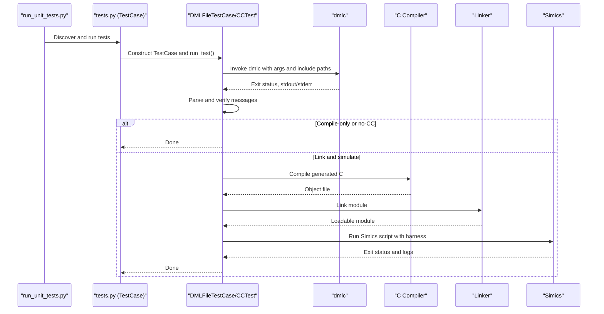
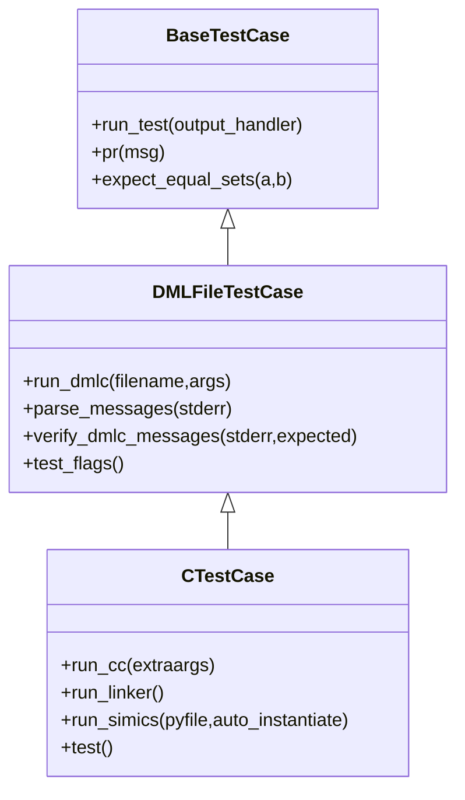
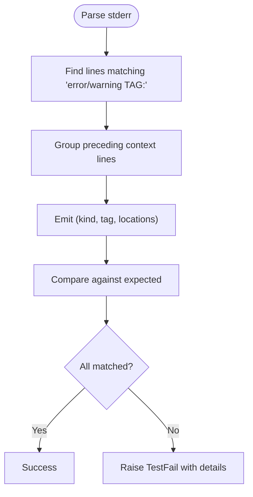
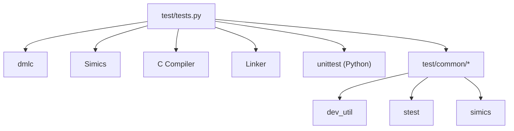

# Testing Framework and Unit Tests

<cite>
**Referenced Files in This Document**
- [tests.py](file://test/tests.py)
- [run_unit_tests.py](file://run_unit_tests.py)
- [SUITEINFO](file://test/SUITEINFO)
- [XFAIL](file://test/XFAIL)
- [instrumentation_common.py](file://test/common/instrumentation_common.py)
- [test_register_view.py](file://test/common/test_register_view.py)
- [test_register_view_descriptions.py](file://test/common/test_register_view_descriptions.py)
- [test_register_view_inquiry.py](file://test/common/test_register_view_inquiry.py)
- [instrumentation_callback_args.py](file://test/common/instrumentation_callback_args.py)
- [instrumentation_callback_inquiry.py](file://test/common/instrumentation_callback_inquiry.py)
- [instrumentation_callback_order.py](file://test/common/instrumentation_callback_order.py)
- [instrumentation_access_inquire.py](file://test/common/instrumentation_access_inquire.py)
- [instrumentation_access_set_offset.py](file://test/common/instrumentation_access_set_offset.py)
- [instrumentation_access_set_value.py](file://test/common/instrumentation_access_set_value.py)
- [instrumentation_access_value_at_miss.py](file://test/common/instrumentation_access_value_at_miss.py)
- [instrumentation_bank_array.py](file://test/common/instrumentation_bank_array.py)
- [T_EBADFAIL.dml](file://test/1.2/errors/T_EBADFAIL.dml)
- [T_bank_1.dml](file://test/1.2/trivial/T_bank_1.dml)
</cite>

## Table of Contents
1. [Introduction](#introduction)
2. [Project Structure](#project-structure)
3. [Core Components](#core-components)
4. [Architecture Overview](#architecture-overview)
5. [Detailed Component Analysis](#detailed-component-analysis)
6. [Dependency Analysis](#dependency-analysis)
7. [Performance Considerations](#performance-considerations)
8. [Troubleshooting Guide](#troubleshooting-guide)
9. [Conclusion](#conclusion)
10. [Appendices](#appendices)

## Introduction
This document describes the DML testing framework and unit testing methodology used to validate the DML compiler and generated device models. It explains how the test suite is organized by feature categories, how tests are executed, and how common utilities support instrumentation, register view verification, and callback behavior checks. It also provides guidelines for writing new test cases, naming conventions, debugging failed tests, and understanding how tests relate to the broader DML compiler validation system.

## Project Structure
The test system is composed of:
- A Python-based test runner and framework that orchestrates compilation, linking, and simulation.
- A large collection of DML test files grouped by feature categories under test/1.2 and test/1.4.
- A shared set of Python utilities under test/common for instrumentation and register view testing.
- Control files for suite-wide timeouts and expected failures.

```mermaid
graph TB
subgraph "Test Runner"
RUT["run_unit_tests.py"]
TPY["test/tests.py"]
end
subgraph "Test Suites"
S12["test/1.2/*"]
S14["test/1.4/*"]
end
subgraph "Common Utilities"
IC["instrumentation_common.py"]
TRV["test_register_view.py"]
TRVD["test_register_view_descriptions.py"]
TRVI["test_register_view_inquiry.py"]
ICA["instrumentation_callback_args.py"]
ICI["instrumentation_callback_inquiry.py"]
ICO["instrumentation_callback_order.py"]
IAI["instrumentation_access_inquire.py"]
IASO["instrumentation_access_set_offset.py"]
IASV["instrumentation_access_set_value.py"]
IAVM["instrumentation_access_value_at_miss.py"]
IBANK["instrumentation_bank_array.py"]
end
RUT --> TPY
TPY --> S12
TPY --> S14
TPY --> IC
TPY --> TRV
TPY --> TRVD
TPY --> TRVI
TPY --> ICA
TPY --> ICI
TPY --> ICO
TPY --> IAI
TPY --> IASO
TPY --> IASV
TPY --> IAVM
TPY --> IBANK
```

**Diagram sources**
- [run_unit_tests.py](file://run_unit_tests.py#L1-L20)
- [tests.py](file://test/tests.py#L1-L200)

**Section sources**
- [run_unit_tests.py](file://run_unit_tests.py#L1-L20)
- [tests.py](file://test/tests.py#L1-L200)

## Core Components
- Test runner entry point: loads the test module and invokes the Python unittest framework.
- Test framework: a Python class hierarchy that compiles DML to C, optionally compiles and links a Simics module, and runs it under Simics with optional Python harness scripts.
- Annotation-driven expectations: DML test files embed annotations to declare expected errors/warnings, flags, and grep patterns.
- Common utilities: reusable helpers for instrumentation and register view verification.

Key responsibilities:
- Compile DML via dmlc with configurable flags and include paths.
- Parse and verify compiler diagnostics (errors/warnings) and message locations.
- Optionally compile C code, link a Simics module, and run a Simics script to exercise runtime behavior.
- Provide assertion helpers and instrumentation primitives for callback verification.

**Section sources**
- [tests.py](file://test/tests.py#L142-L800)
- [run_unit_tests.py](file://run_unit_tests.py#L1-L20)

## Architecture Overview
The test execution pipeline for a typical DML test case:

**Diagram sources**
- [tests.py](file://test/tests.py#L162-L800)

## Detailed Component Analysis

### Test Suite Organization by Feature Categories
The test suites are organized by feature areas under test/1.2 and test/1.4. Representative categories include:
- errors: validation of error conditions and diagnostic reporting.
- events: event scheduling and lifecycle.
- interfaces: interface declarations and implementations.
- layout: memory layout, address calculations, and alignment.
- methods: method calls, inlining, and const propagation.
- operators: arithmetic, bitwise, assignment, slicing, and casting.
- registers: register banks, field definitions, instrumentation, and register view behavior.
- statements: control flow constructs (if/for/switch/etc.).
- structure: device structure, attributes, ports, groups, and connections.
- syntax: lexical and syntactic constructs.
- toplevel: top-level imports and aliases.
- types: type system constructs and endianness.
- werror: warnings treated as errors.

Each category contains many .dml test files. Many tests also include a companion .py harness script to drive Simics and assertions.

**Section sources**
- [tests.py](file://test/tests.py#L1-L200)

### Automated Test Runner Configuration
- Entry point: run_unit_tests.py configures the Python path and launches unittest with a dynamically loaded module.
- Test discovery: unittest discovers subclasses of the base TestCase in the loaded module.
- Environment and paths: the runner ensures the DML Python bindings are available and validates arguments.

**Section sources**
- [run_unit_tests.py](file://run_unit_tests.py#L1-L20)

### Test Case Execution Framework
- BaseTestCase: provides output forwarding and standardized failure reporting.
- DMLFileTestCase: encapsulates DML compilation, message parsing, and diagnostics verification.
- CTestCase: extends DMLFileTestCase to compile/link a Simics module and run a Simics script harness.
- Timeout and environment: per-test timeout multipliers and environment variables are applied during execution.

**Diagram sources**
- [tests.py](file://test/tests.py#L142-L800)

**Section sources**
- [tests.py](file://test/tests.py#L142-L800)

### Test Case Organization Patterns and Annotations
- Annotation-driven expectations embedded in DML files:
  - /// ERROR <TAG> or /// WARNING <TAG>: declares expected diagnostics and their tags.
  - /// DMLC-FLAG <flag>, /// CC-FLAG <flag>: adds compiler or C compiler flags.
  - /// GREP "<pattern>": asserts presence of a pattern in stdout.
  - /// INSTANTIATE-MANUALLY: skips automatic instantiation in Simics harness.
  - /// COMPILE-ONLY: stops after DML compilation.
  - /// NO-CC: compiles DML but does not produce C, skipping C compilation/linking.
  - /// SCAN-FOR-TAGS <file.dml>: recursively scans another file for annotations.
- Test flags are parsed from the DML file and influence compilation and verification steps.

Examples:
- A test expecting a specific error tag in a method body.
- A trivial compile-only test that validates syntax without runtime checks.

**Section sources**
- [tests.py](file://test/tests.py#L521-L581)
- [T_EBADFAIL.dml](file://test/1.2/errors/T_EBADFAIL.dml#L1-L42)
- [T_bank_1.dml](file://test/1.2/trivial/T_bank_1.dml#L1-L10)

### Message Parsing and Verification
- parse_messages: extracts structured error/warning messages from dmlc stderr, grouping context lines and capturing source locations.
- verify_dmlc_messages: compares actual vs. expected messages and raises detailed failures with missing/unexpected items.

**Diagram sources**
- [tests.py](file://test/tests.py#L354-L490)

**Section sources**
- [tests.py](file://test/tests.py#L354-L490)

### Common Test Utilities for Instrumentation
Instrumentation utilities provide helpers to verify callback invocation, ordering, and access manipulation:

- instrumentation_common.py: creates mock connection objects for instrumentation tests.
- instrumentation_callback_args.py: verifies callback receives correct connection and user data.
- instrumentation_callback_inquiry.py: verifies callbacks are not invoked for inquiry transactions.
- instrumentation_callback_order.py: verifies ordering and removal semantics of callbacks.
- instrumentation_access_inquire.py: demonstrates access.inquire usage.
- instrumentation_access_set_offset.py: manipulates access offset during callbacks.
- instrumentation_access_set_value.py: sets access value to override reads.
- instrumentation_access_value_at_miss.py: validates behavior when accessing missed ranges.
- instrumentation_bank_array.py: verifies instrumentation across bank arrays.

These utilities are imported by test harnesses and used to assert precise instrumentation behavior.

**Section sources**
- [instrumentation_common.py](file://test/common/instrumentation_common.py#L1-L13)
- [instrumentation_callback_args.py](file://test/common/instrumentation_callback_args.py#L1-L41)
- [instrumentation_callback_inquiry.py](file://test/common/instrumentation_callback_inquiry.py#L1-L39)
- [instrumentation_callback_order.py](file://test/common/instrumentation_callback_order.py#L1-L48)
- [instrumentation_access_inquire.py](file://test/common/instrumentation_access_inquire.py#L1-L35)
- [instrumentation_access_set_offset.py](file://test/common/instrumentation_access_set_offset.py#L1-L18)
- [instrumentation_access_set_value.py](file://test/common/instrumentation_access_set_value.py#L1-L27)
- [instrumentation_access_value_at_miss.py](file://test/common/instrumentation_access_value_at_miss.py#L1-L23)
- [instrumentation_bank_array.py](file://test/common/instrumentation_bank_array.py#L1-L30)

### Register View Testing Utilities
Utilities to validate register view behavior across banks, arrays, endianness, and descriptions:

- test_register_view.py: validates descriptions, bit order, number of registers, register info tuples, array naming, and read/write round-trips.
- test_register_view_descriptions.py: ensures consistent documentation retrieval regardless of DML version or parameters.
- test_register_view_inquiry.py: verifies register view operations during inquiry mode.

These utilities are used by test harnesses to assert correctness of register view interfaces.

**Section sources**
- [test_register_view.py](file://test/common/test_register_view.py#L1-L108)
- [test_register_view_descriptions.py](file://test/common/test_register_view_descriptions.py#L1-L35)
- [test_register_view_inquiry.py](file://test/common/test_register_view_inquiry.py#L1-L17)

### Writing New Test Cases
Guidelines:
- Place the .dml test file under the appropriate feature category in test/1.2 or test/1.4.
- Add annotations to declare expected diagnostics and flags:
  - Use /// ERROR <TAG> or /// WARNING <TAG> to specify diagnostics.
  - Use /// DMLC-FLAG and /// CC-FLAG to pass extra flags.
  - Use /// GREP to assert stdout patterns.
  - Use /// COMPILE-ONLY or /// NO-CC to control compilation stages.
  - Use /// INSTANTIATE-MANUALLY when a custom Simics script is required.
- If runtime behavior is to be verified, add a companion .py harness that drives Simics and performs assertions.
- Keep test names descriptive and concise; avoid duplication across versions unless necessary.

Naming conventions:
- Prefer short, descriptive names that reflect the feature under test.
- Use lowercase with underscores; avoid spaces or special characters.
- Include version-specific suffixes only when necessary (e.g., dml12/dml14 variants).

**Section sources**
- [tests.py](file://test/tests.py#L521-L581)
- [T_EBADFAIL.dml](file://test/1.2/errors/T_EBADFAIL.dml#L1-L42)
- [T_bank_1.dml](file://test/1.2/trivial/T_bank_1.dml#L1-L10)

### Debugging Failed Tests
Common strategies:
- Inspect dmlc stdout/stderr for compilation details and diagnostics.
- Verify expected vs. actual messages using the parser output and error/warning lists.
- For Simics-linked tests, review the generated C files and module build logs.
- Use harness scripts to reproduce runtime behavior in isolation.
- Temporarily add /// GREP annotations to capture additional diagnostic output.

Control files:
- SUITEINFO defines suite-wide timeouts and limits.
- XFAIL lists known failing tests and their reasons; tests listed there are expected to fail and are skipped by the CI process.

**Section sources**
- [tests.py](file://test/tests.py#L491-L501)
- [SUITEINFO](file://test/SUITEINFO#L1-L2)
- [XFAIL](file://test/XFAIL#L1-L81)

## Dependency Analysis
The test framework depends on:
- DML compiler (dmlc) and Simics runtime for end-to-end validation.
- Python unittest for test discovery and execution.
- Shared Python modules under test/common for instrumentation and register view verification.
- Environment variables controlling compilers, timeouts, and interpreter selection.

**Diagram sources**
- [tests.py](file://test/tests.py#L1-L200)

**Section sources**
- [tests.py](file://test/tests.py#L1-L200)

## Performance Considerations
- Compilation and linking can be expensive; use /// COMPILE-ONLY or /// NO-CC when only syntax/diagnostics are relevant.
- Some tests require larger timeouts; the framework supports per-test timeout multipliers.
- Prefer targeted annotations to reduce unnecessary diagnostics parsing and comparisons.

[No sources needed since this section provides general guidance]

## Troubleshooting Guide
- Unexpected diagnostics: confirm the expected tags and locations match the parsed messages.
- ICE or internal errors: the parser detects internal compiler errors and fails fast.
- Timeout issues: adjust per-test timeout multipliers or simplify the test.
- Missing or extra messages: review annotation placement and file paths; ensure absolute vs. relative paths are handled correctly.
- Harness failures: verify Simics script paths and module loading; ensure Python paths include test/common.

**Section sources**
- [tests.py](file://test/tests.py#L400-L430)
- [tests.py](file://test/tests.py#L88-L90)

## Conclusion
The DML testing framework combines annotation-driven expectations, a robust Python-based runner, and reusable instrumentation and register view utilities to comprehensively validate the DML compiler and generated device models. By organizing tests by feature categories, leveraging harness scripts for runtime verification, and maintaining strict expectations for diagnostics, the system ensures high confidence in language compliance and runtime correctness.

[No sources needed since this section summarizes without analyzing specific files]

## Appendices

### Appendix A: Example Test Case Walkthrough
- A test that expects a specific error tag in a method body.
- A trivial compile-only test that validates syntax without runtime checks.

**Section sources**
- [T_EBADFAIL.dml](file://test/1.2/errors/T_EBADFAIL.dml#L1-L42)
- [T_bank_1.dml](file://test/1.2/trivial/T_bank_1.dml#L1-L10)