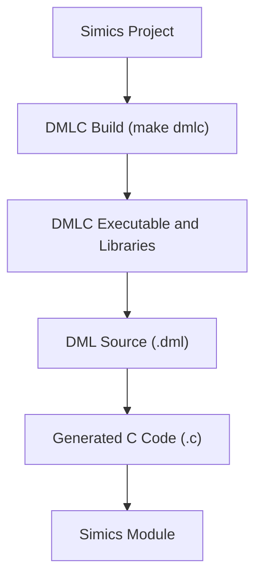
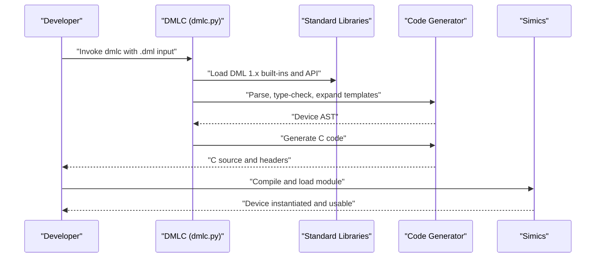
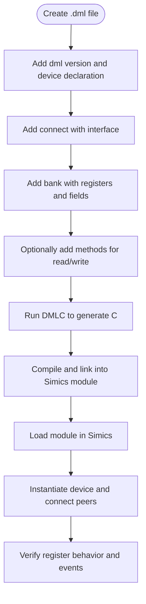
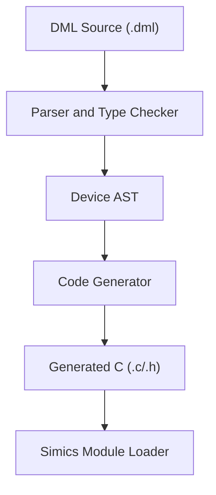

# Getting Started Guide

<cite>
**Referenced Files in This Document**
- [README.md](file://README.md)
- [doc/1.4/introduction.md](file://doc/1.4/introduction.md)
- [doc/1.4/language.md](file://doc/1.4/language.md)
- [doc/1.4/running-dmlc.md](file://doc/1.4/running-dmlc.md)
- [py/dml/dmlc.py](file://py/dml/dmlc.py)
- [run_dmlc.sh](file://run_dmlc.sh)
- [lib/1.2/dml-builtins.dml](file://lib/1.2/dml-builtins.dml)
- [lib/1.2/io-memory.dml](file://lib/1.2/io-memory.dml)
- [lib/1.2/simics-device.dml](file://lib/1.2/simics-device.dml)
- [lib/1.2/simics-event.dml](file://lib/1.2/simics-event.dml)
- [test/minimal.dml](file://test/minimal.dml)
</cite>

## Table of Contents
1. [Introduction](#introduction)
2. [Project Structure](#project-structure)
3. [Core Components](#core-components)
4. [Architecture Overview](#architecture-overview)
5. [Detailed Component Analysis](#detailed-component-analysis)
6. [Dependency Analysis](#dependency-analysis)
7. [Performance Considerations](#performance-considerations)
8. [Troubleshooting Guide](#troubleshooting-guide)
9. [Conclusion](#conclusion)
10. [Appendices](#appendices)

## Introduction
This guide helps you install and use the Device Modeling Language (DML) to write, compile, and integrate device models with the Intel® Simics® simulator. You will learn:
- How to set up the Simics simulator and build the DML compiler (DMLC) from a Simics project
- How to configure environment variables for efficient development
- Step-by-step instructions to write your first DML device model, including register banks, basic event handling, and device instantiation
- Practical examples and troubleshooting tips for common setup issues

## Project Structure
At a high level, the repository provides:
- DML documentation for language features and compiler usage
- The DML compiler implementation (Python-based)
- Standard libraries for DML 1.2 and 1.4, including Simics API bindings and built-in templates
- Test suites and example DML files
- Scripts to invoke DMLC with appropriate environment variables

**Section sources**
- [README.md](file://README.md#L22-L44)
- [doc/1.4/running-dmlc.md](file://doc/1.4/running-dmlc.md#L15-L42)

## Core Components
- DML language and object model: Devices, banks, registers, fields, connects, ports, implements, events, and groups
- DMLC compiler: Parses DML, validates semantics, and generates C code for Simics
- Standard libraries: Built-in templates and Simics API bindings for common device behaviors
- Test suite: Example DML models and tests validating language features

Key capabilities:
- Define memory-mapped register banks and registers with fields
- Connect to other Simics objects via interfaces
- Implement Simics interfaces in ports
- Post and handle events
- Use templates and parameters to reduce duplication

**Section sources**
- [doc/1.4/introduction.md](file://doc/1.4/introduction.md#L13-L48)
- [doc/1.4/language.md](file://doc/1.4/language.md#L255-L329)
- [lib/1.2/dml-builtins.dml](file://lib/1.2/dml-builtins.dml#L1-L60)

## Architecture Overview
The DML workflow transforms a DML source file into a Simics-compatible module via DMLC.

**Diagram sources**
- [py/dml/dmlc.py](file://py/dml/dmlc.py#L309-L760)
- [doc/1.4/running-dmlc.md](file://doc/1.4/running-dmlc.md#L45-L62)
- [lib/1.2/dml-builtins.dml](file://lib/1.2/dml-builtins.dml#L1-L60)

**Section sources**
- [doc/1.4/running-dmlc.md](file://doc/1.4/running-dmlc.md#L45-L62)
- [py/dml/dmlc.py](file://py/dml/dmlc.py#L309-L760)

## Detailed Component Analysis

### Installing Simics and Building DMLC
- Install the Simics simulator (Public Release or via commercial channels)
- Create a Simics project (default installation flow)
- In your Simics project, check out the DML repository into the modules/dmlc directory
- Build DMLC using make dmlc (or bin\make dmlc on Windows)
- Run tests using make test-dmlc or bin/test-runner --suite modules/dmlc/test

Environment variables for development workflow:
- DMLC_DIR: Points to <your-project>/<hosttype>/bin for subsequent make invocations
- T126_JOBS: Number of tests to run in parallel
- DMLC_PATHSUBST: Rewrite error paths to source files for better debugging
- PY_SYMLINKS: Symlink Python files instead of copying to ease development
- DMLC_DEBUG: Echo unexpected exceptions to stderr
- DMLC_CC: Override default compiler in unit tests
- DMLC_PROFILE: Self-profiling output to a .prof file
- DMLC_DUMP_INPUT_FILES: Emit a .tar.bz2 archive of all DML source files for isolated reproduction
- DMLC_GATHER_SIZE_STATISTICS: Output code generation statistics to optimize compile time and size

**Section sources**
- [README.md](file://README.md#L28-L44)
- [README.md](file://README.md#L46-L117)

### Writing Your First DML Device Model
Follow this step-by-step tutorial to create a minimal device model with a register bank and basic behavior.

Step 1: Create a DML source file
- Start with the language version declaration and a device declaration
- Add a connect to expose an interface to other devices
- Add a register bank with registers and fields
- Optionally add methods to customize read/write behavior

Example structure outline:
- Device declaration
- Connect declaration with an interface
- Bank declaration with registers and fields
- Optional methods for read/write customization

For a concrete example of a small device model with a bank, registers, fields, and a signal-based event trigger, refer to the example in the documentation.

Step 2: Compile with DMLC
- Use the DMLC executable built from your Simics project
- Provide the DML source file as input
- DMLC generates a C file and supporting headers
- Compile and link the generated C code into a Simics module

Step 3: Integrate with Simics
- Load the generated module into Simics
- Instantiate the device in a Simics configuration
- Connect other devices to the declared interfaces
- Verify register behavior and event handling

**Section sources**
- [doc/1.4/introduction.md](file://doc/1.4/introduction.md#L50-L132)
- [doc/1.4/running-dmlc.md](file://doc/1.4/running-dmlc.md#L45-L62)

### Practical Examples

#### Simple Register Bank
- Define a bank with registers and fields
- Use templates to provide read/write behavior
- Optionally mark registers as unmapped for internal state

Reference example structure and explanation in the documentation.

**Section sources**
- [doc/1.4/introduction.md](file://doc/1.4/introduction.md#L50-L132)

#### Basic Event Handling
- Declare an event object
- Post events in response to register accesses or other conditions
- Use event templates and methods to manage timing and callbacks

Reference the object model and event definitions in the language documentation.

**Section sources**
- [doc/1.4/language.md](file://doc/1.4/language.md#L204-L206)
- [lib/1.2/simics-event.dml](file://lib/1.2/simics-event.dml#L1-L10)

#### Device Instantiation
- After compiling, load the module into Simics
- Instantiate the device and connect peers via declared interfaces
- Use attributes and register views to inspect and control the device

Reference the Simics integration patterns and built-in templates.

**Section sources**
- [lib/1.2/io-memory.dml](file://lib/1.2/io-memory.dml#L15-L50)
- [lib/1.2/simics-device.dml](file://lib/1.2/simics-device.dml#L1-L18)

### DMLC Command-Line Usage
Common invocation patterns:
- Basic compilation: dmlc <input.dml> [output-base]
- Include paths for imports: -I <path>
- Define compile-time parameters: -D <name>=<value>
- Generate dependencies: --dep
- Enable debug artifacts: -g
- Control warnings and strictness: --warn, --nowarn, --werror, --strict
- Select Simics API version: --simics-api=<version>
- Limit error count: --max-errors=<N>

The DMLC script supports additional flags for profiling, AI diagnostics, and internal testing.

**Section sources**
- [doc/1.4/running-dmlc.md](file://doc/1.4/running-dmlc.md#L45-L183)
- [py/dml/dmlc.py](file://py/dml/dmlc.py#L313-L518)

## Dependency Analysis
DMLC depends on:
- Standard libraries for DML 1.x (built-ins, API bindings)
- Simics API bindings and interfaces
- Generated C code that integrates with Simics’ configuration model

**Diagram sources**
- [py/dml/dmlc.py](file://py/dml/dmlc.py#L676-L760)
- [lib/1.2/dml-builtins.dml](file://lib/1.2/dml-builtins.dml#L1-L60)

**Section sources**
- [py/dml/dmlc.py](file://py/dml/dmlc.py#L676-L760)
- [lib/1.2/dml-builtins.dml](file://lib/1.2/dml-builtins.dml#L1-L60)

## Performance Considerations
- Use shared methods and templates to reduce code duplication and generated size
- Prefer saved variables for checkpointable state when possible
- Minimize complex loops in templates; break them into smaller methods
- Monitor code generation statistics with DMLC_GATHER_SIZE_STATISTICS to identify hotspots

[No sources needed since this section provides general guidance]

## Troubleshooting Guide
Common setup issues and resolutions:
- DMLC_DIR not set: Ensure DMLC_DIR points to <your-project>/<hosttype>/bin after building DMLC
- Missing Simics installation: Install the Public Release or access via commercial channels
- Import path issues: Use -I flags to include directories with DML modules
- Error path confusion: Set DMLC_PATHSUBST to rewrite error paths to source files
- Debugging failures: Enable DMLC_DEBUG to show tracebacks; use DMLC_DUMP_INPUT_FILES to isolate problems
- Parallel test runs: Configure T126_JOBS to speed up test execution

Environment variables to aid development:
- DMLC_DIR, T126_JOBS, DMLC_PATHSUBST, PY_SYMLINKS, DMLC_DEBUG, DMLC_CC, DMLC_PROFILE, DMLC_DUMP_INPUT_FILES, DMLC_GATHER_SIZE_STATISTICS

**Section sources**
- [README.md](file://README.md#L46-L117)
- [run_dmlc.sh](file://run_dmlc.sh#L18-L34)

## Conclusion
You now have the essentials to install Simics, build DMLC, configure your development environment, and write, compile, and integrate your first DML device model. Use the standard libraries and templates to accelerate development, and leverage the environment variables and DMLC options to streamline debugging and performance tuning.

[No sources needed since this section summarizes without analyzing specific files]

## Appendices

### Appendix A: Minimal DML Example
A minimal DML file with a device declaration and compile-only marker is available for testing and verification.

**Section sources**
- [test/minimal.dml](file://test/minimal.dml#L1-L8)

### Appendix B: Running DMLC with Environment Variables
Use the provided script to invoke DMLC with DMLC_DIR and SIMICS_BASE, ensuring correct library and API paths.

**Section sources**
- [run_dmlc.sh](file://run_dmlc.sh#L1-L67)