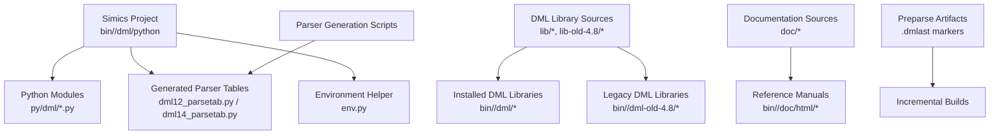
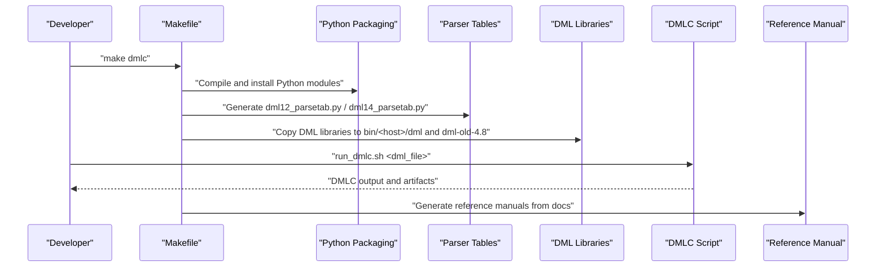
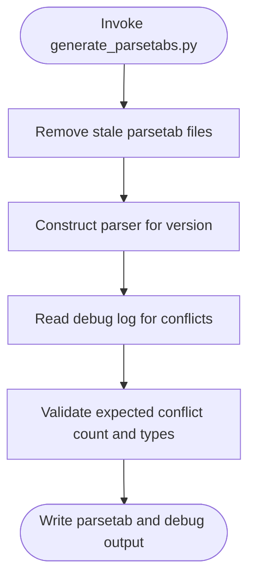
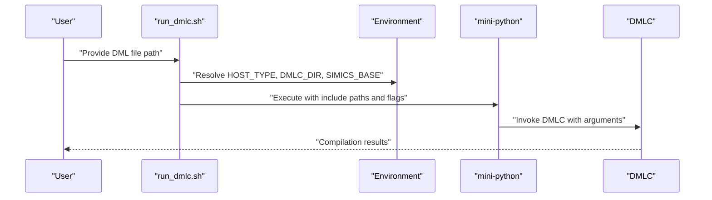
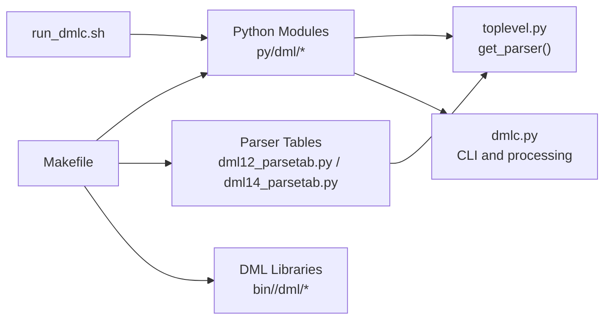

# Build System Integration

<cite>
**Referenced Files in This Document**
- [Makefile](file://Makefile)
- [README.md](file://README.md)
- [run_dmlc.sh](file://run_dmlc.sh)
- [generate_parsetabs.py](file://generate_parsetabs.py)
- [generate_env.py](file://generate_env.py)
- [copy_h.py](file://copy_h.py)
- [run_unit_tests.py](file://run_unit_tests.py)
- [py/dml/dmlc.py](file://py/dml/dmlc.py)
- [py/dml/toplevel.py](file://py/dml/toplevel.py)
</cite>

## Table of Contents
1. [Introduction](#introduction)
2. [Project Structure](#project-structure)
3. [Core Components](#core-components)
4. [Architecture Overview](#architecture-overview)
5. [Detailed Component Analysis](#detailed-component-analysis)
6. [Dependency Analysis](#dependency-analysis)
7. [Performance Considerations](#performance-considerations)
8. [Troubleshooting Guide](#troubleshooting-guide)
9. [Conclusion](#conclusion)
10. [Appendices](#appendices)

## Introduction
This guide explains how to integrate the DML (Device Modeling Language) build system into Intel Simics-based projects. It covers Makefile usage patterns, project organization, dependency management, environment configuration, parser table generation, and automated build processes. It also documents the end-to-end pipeline from DML source files to executable device models, and provides guidance for continuous integration and deployment within the Simics SDK.

## Project Structure
The DML project is organized around a central Makefile that orchestrates:
- Python packaging and installation into the Simics project’s bin directory
- DML library file distribution across versions and compatibility directories
- Parser table generation for DML 1.2 and 1.4
- Precompilation artifacts (.dmlast) for incremental builds
- Reference manual generation from DML documentation sources
- Unit testing and CI-friendly targets

Key build directories and roles:
- Source Python modules under py/dml/
- Generated parser tables and environment helpers placed under bin/<host>/dml/python/dml/
- DML standard library files distributed to bin/<host>/dml and bin/<host>/dml-old-4.8
- Documentation generation into bin/<host>/doc/html

**Diagram sources**
- [Makefile](file://Makefile#L1-L252)

**Section sources**
- [Makefile](file://Makefile#L1-L252)

## Core Components
- Makefile build targets and rules for Python packaging, DML library installation, parser table generation, preparse artifact creation, and documentation generation
- Environment configuration scripts for generating runtime environment metadata
- Parser table generator ensuring deterministic parsing behavior
- DMLC invocation script enabling flexible compiler selection and API integration
- Unit testing harness for validating DMLC behavior within a Simics project

**Section sources**
- [Makefile](file://Makefile#L1-L252)
- [generate_env.py](file://generate_env.py#L1-L23)
- [generate_parsetabs.py](file://generate_parsetabs.py#L1-L38)
- [run_dmlc.sh](file://run_dmlc.sh#L1-L67)
- [run_unit_tests.py](file://run_unit_tests.py#L1-L20)

## Architecture Overview
The DML build pipeline integrates tightly with the Simics SDK. The Makefile compiles Python modules, generates parser tables, installs DML libraries, and prepares preparse artifacts. DMLC is invoked via a shell script that resolves paths from environment variables and passes appropriate include paths and API versions. Documentation is generated from DML sources and reference materials.

**Diagram sources**
- [Makefile](file://Makefile#L1-L252)
- [run_dmlc.sh](file://run_dmlc.sh#L1-L67)

## Detailed Component Analysis

### Makefile Build Targets and Rules
- Python packaging: Copies and compiles Python modules into bin/<host>/dml/python, supporting optional symlinks via PY_SYMLINKS
- Parser table generation: Runs generate_parsetabs.py to produce deterministic parser tables and debug outputs
- DML library installation: Distributes DML standard libraries to both current and legacy locations
- Preparse artifacts: Generates .dmlast markers per DML version and API version to accelerate incremental builds
- Documentation: Converts DML documentation sources into HTML reference manuals

Key patterns:
- Host-type-aware paths using HOST_TYPE and SIMICS_PROJECT
- Conditional generation of parser tables and environment helpers
- Marker-based dependency tracking for preparse artifacts

**Section sources**
- [Makefile](file://Makefile#L1-L252)

### Environment Variable Configuration
The build system relies on environment variables to locate Simics components and customize behavior:
- DMLC_DIR: Points to the local DMLC installation under bin/<host>/dml/python
- SIMICS_BASE: Root of the Simics SDK installation
- DMLC_PATHSUBST: Rewrites error paths to point to source files during diagnostics
- PY_SYMLINKS: Enables symlinking Python files for faster iteration
- DMLC_DEBUG: Controls exception visibility during compilation
- DMLC_CC: Overrides the default compiler in unit tests
- DMLC_PROFILE: Enables profiling output
- DMLC_DUMP_INPUT_FILES: Emits a reproducible archive of DML sources
- DMLC_GATHER_SIZE_STATISTICS: Produces code-size statistics for optimization

These variables are documented and intended for development and CI scenarios.

**Section sources**
- [README.md](file://README.md#L46-L117)

### Parser Table Generation
The parser table generator ensures deterministic parsing behavior and validates expected conflicts. It removes stale parser table files, invokes the DML parser construction, and captures conflict logs for verification.

**Diagram sources**
- [generate_parsetabs.py](file://generate_parsetabs.py#L1-L38)

**Section sources**
- [generate_parsetabs.py](file://generate_parsetabs.py#L1-L38)

### Environment Helper Generation
The environment helper script generates a Python module that exposes host detection and API version information. This enables DMLC to adapt to the current platform and available API versions.

**Section sources**
- [generate_env.py](file://generate_env.py#L1-L23)

### DMLC Invocation Script
The DMLC script resolves host type, locates DMLC_DIR and SIMICS_BASE, and executes the mini-python interpreter with appropriate include paths and API flags. It supports AI diagnostics JSON output and flexible module directory resolution.

**Diagram sources**
- [run_dmlc.sh](file://run_dmlc.sh#L1-L67)

**Section sources**
- [run_dmlc.sh](file://run_dmlc.sh#L1-L67)

### Unit Testing Harness
The unit testing runner configures Python paths and executes a named test module against the installed DMLC Python package. This supports CI-style test execution from a Simics project.

**Section sources**
- [run_unit_tests.py](file://run_unit_tests.py#L1-L20)

### Header Copy Behavior and Path Substitution
The header copy utility optionally injects a preprocessor line directive to rewrite diagnostic paths to source locations. This improves developer experience by pointing errors to original files rather than installed copies.

**Section sources**
- [copy_h.py](file://copy_h.py#L1-L14)

## Dependency Analysis
The build system exhibits clear separation of concerns:
- Makefile orchestrates packaging, generation, and distribution
- Python modules implement parsing, code generation, and runtime integration
- Parser table generation depends on lexer/parser modules and version-specific grammars
- DMLC script depends on environment variables and the installed Python package

**Diagram sources**
- [Makefile](file://Makefile#L1-L252)
- [py/dml/toplevel.py](file://py/dml/toplevel.py#L1-L200)
- [py/dml/dmlc.py](file://py/dml/dmlc.py#L1-L200)

**Section sources**
- [Makefile](file://Makefile#L1-L252)
- [py/dml/toplevel.py](file://py/dml/toplevel.py#L1-L200)
- [py/dml/dmlc.py](file://py/dml/dmlc.py#L1-L200)

## Performance Considerations
- Parser table generation is expensive; the Makefile rebuilds only when relevant inputs change
- Preparse artifacts (.dmlast) enable incremental builds by tracking DML file updates
- Parallelism can be controlled via T126_JOBS for unit tests
- Code-size statistics can be gathered to identify hotspots and optimize method generation
- Symlinking Python files (PY_SYMLINKS) avoids repeated packaging during development

[No sources needed since this section provides general guidance]

## Troubleshooting Guide
Common issues and remedies:
- Missing DMLC_DIR: Ensure the Makefile target has been executed to populate bin/<host>/dml/python
- Incorrect SIMICS_BASE: Verify the environment variable points to a valid Simics SDK installation
- Parser table mismatch: Re-run parser table generation; confirm dml12_parsetab.py and dml14_parsetab.py are present
- Diagnostic path confusion: Set DMLC_PATHSUBST to rewrite error paths to source files
- Unhandled exceptions: Enable DMLC_DEBUG to display tracebacks instead of writing to dmlc-error.log
- Reproducing issues: Use DMLC_DUMP_INPUT_FILES to create a portable archive of DML sources
- Profiling regressions: Enable DMLC_PROFILE to collect performance profiles

**Section sources**
- [README.md](file://README.md#L46-L117)
- [Makefile](file://Makefile#L1-L252)

## Conclusion
The DML build system integrates seamlessly with the Simics SDK through a Makefile-driven workflow that packages Python modules, generates deterministic parser tables, installs DML libraries, and produces preparse artifacts for efficient incremental builds. Environment variables provide flexibility for development and CI. The DMLC invocation script and unit testing harness support reproducible builds and validation within larger simulation projects.

[No sources needed since this section summarizes without analyzing specific files]

## Appendices

### A. Makefile Usage Patterns
- Build DMLC: Execute the dmlc target in the Simics project
- Test DMLC: Run the test-dmlc target or invoke the unit test runner
- Install DML libraries: Ensure DML library files are copied to bin/<host>/dml and bin/<host>/dml-old-4.8
- Generate parser tables: Trigger generation via the Makefile rules that depend on the parser generator script
- Generate documentation: Use the documentation targets to produce HTML reference manuals

**Section sources**
- [Makefile](file://Makefile#L1-L252)
- [README.md](file://README.md#L22-L44)

### B. Continuous Integration Setup
- Configure CI to set SIMICS_BASE and DMLC_DIR to match the project’s host type
- Use T126_JOBS to parallelize unit tests
- Enable DMLC_PROFILE and DMLC_GATHER_SIZE_STATISTICS for performance monitoring
- Archive artifacts using DMLC_DUMP_INPUT_FILES for failed builds
- Validate documentation generation targets as part of the CI job

**Section sources**
- [README.md](file://README.md#L46-L117)
- [Makefile](file://Makefile#L201-L252)

### C. Deployment Strategies
- Local development: Use PY_SYMLINKS to speed up iteration and avoid frequent re-packaging
- Production builds: Prefer copied Python files for stability
- Path substitution: Use DMLC_PATHSUBST to improve error diagnostics in production environments
- API versioning: Rely on env.py to select the correct API version at runtime

**Section sources**
- [README.md](file://README.md#L46-L117)
- [generate_env.py](file://generate_env.py#L1-L23)