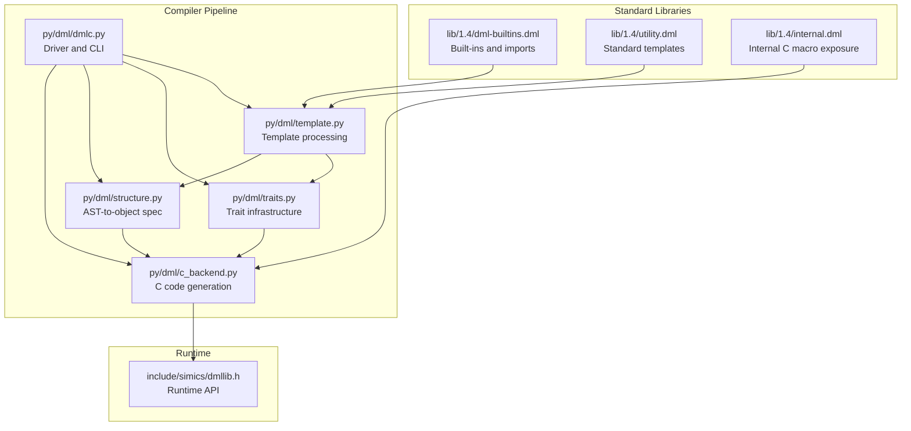
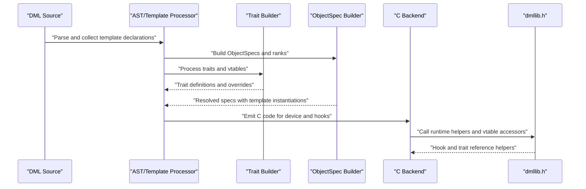
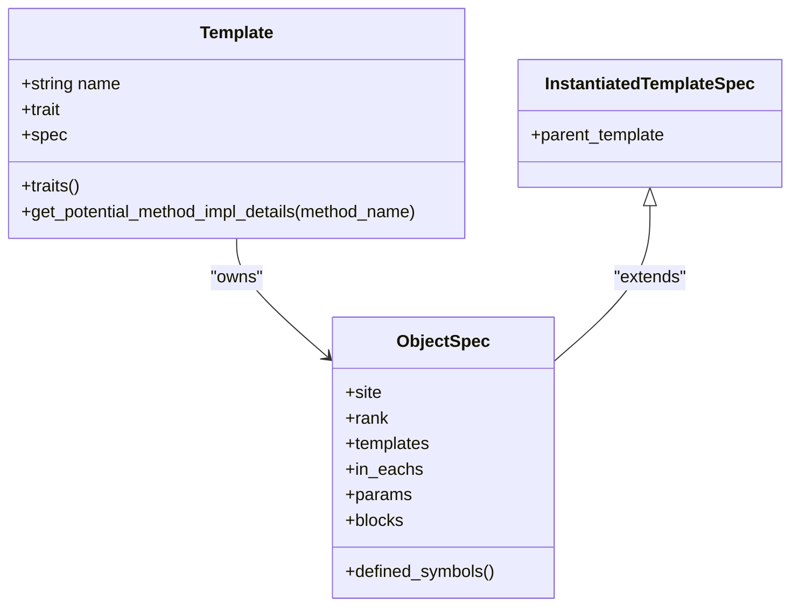
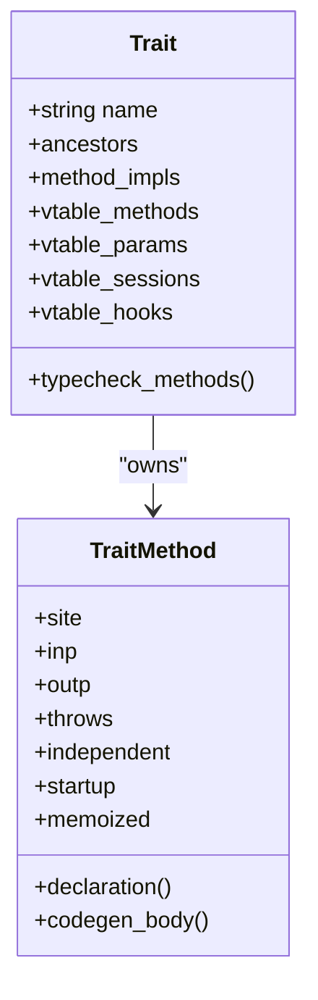
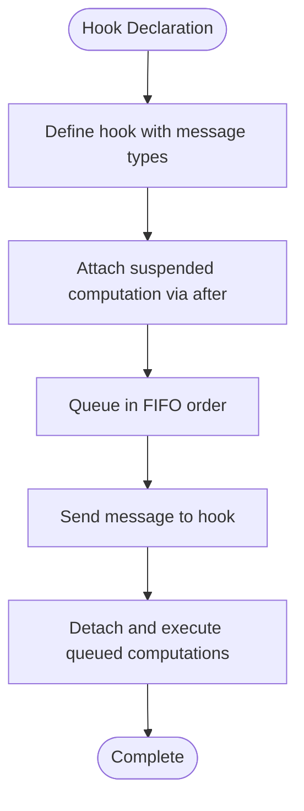
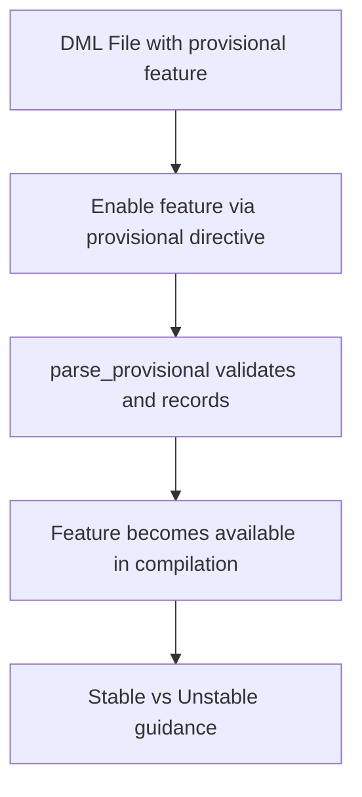
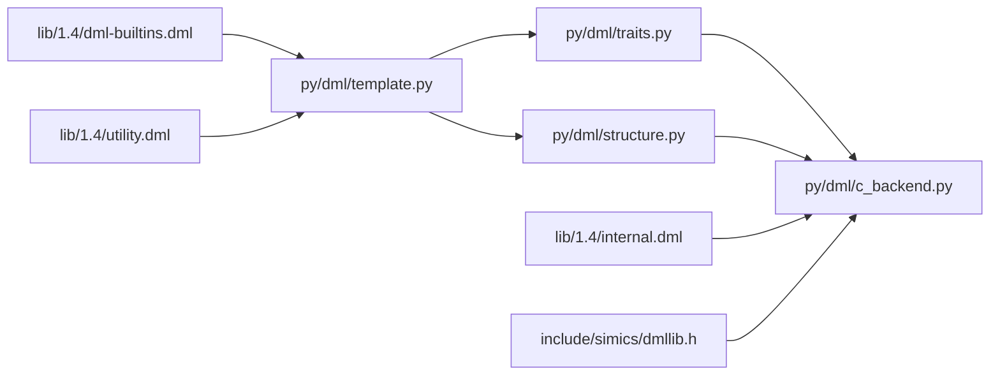

# Custom Extensions and Plugins

<cite>
**Referenced Files in This Document**
- [template.py](file://py/dml/template.py)
- [traits.py](file://py/dml/traits.py)
- [structure.py](file://py/dml/structure.py)
- [provisional.py](file://py/dml/provisional.py)
- [c_backend.py](file://py/dml/c_backend.py)
- [dml-builtins.dml](file://lib/1.4/dml-builtins.dml)
- [utility.dml](file://lib/1.4/utility.dml)
- [internal.dml](file://lib/1.4/internal.dml)
- [dmllib.h](file://include/simics/dmllib.h)
- [language.md](file://doc/1.4/language.md)
- [provisional-header.md](file://doc/1.4/provisional-header.md)
- [common.dml](file://test/1.4/hooks/common.dml)
- [dmlc.py](file://py/dml/dmlc.py)
</cite>

## Table of Contents
1. [Introduction](#introduction)
2. [Project Structure](#project-structure)
3. [Core Components](#core-components)
4. [Architecture Overview](#architecture-overview)
5. [Detailed Component Analysis](#detailed-component-analysis)
6. [Dependency Analysis](#dependency-analysis)
7. [Performance Considerations](#performance-considerations)
8. [Troubleshooting Guide](#troubleshooting-guide)
9. [Conclusion](#conclusion)
10. [Appendices](#appendices)

## Introduction
This document explains how to develop custom extensions and plugins for the Device Modeling Language (DML). It focuses on the template system architecture, trait-based programming patterns, hook integration, and API customization. It also covers the provisional feature system, extension points in the DML compiler, and best practices for maintaining backward compatibility when extending DML functionality.

## Project Structure
DML’s extensibility is implemented across Python compiler modules and standard library templates:
- Compiler pipeline: template parsing, trait processing, and code generation.
- Standard libraries: built-in templates and interfaces for registers, fields, reset behavior, and hooks.
- Provisional features: experimental capabilities gated behind per-file flags.
- Backend integration: C backend generation and runtime API bindings.

**Diagram sources**
- [template.py](file://py/dml/template.py#L1-L433)
- [traits.py](file://py/dml/traits.py#L1-L800)
- [structure.py](file://py/dml/structure.py#L460-L524)
- [c_backend.py](file://py/dml/c_backend.py#L1-L200)
- [dmlc.py](file://py/dml/dmlc.py#L1-L200)
- [dml-builtins.dml](file://lib/1.4/dml-builtins.dml#L1-L200)
- [utility.dml](file://lib/1.4/utility.dml#L1-L800)
- [internal.dml](file://lib/1.4/internal.dml#L1-L94)
- [dmllib.h](file://include/simics/dmllib.h#L339-L366)

**Section sources**
- [template.py](file://py/dml/template.py#L1-L433)
- [traits.py](file://py/dml/traits.py#L1-L800)
- [structure.py](file://py/dml/structure.py#L460-L524)
- [c_backend.py](file://py/dml/c_backend.py#L1-L200)
- [dmlc.py](file://py/dml/dmlc.py#L1-L200)
- [dml-builtins.dml](file://lib/1.4/dml-builtins.dml#L1-L200)
- [utility.dml](file://lib/1.4/utility.dml#L1-L800)
- [internal.dml](file://lib/1.4/internal.dml#L1-L94)
- [dmllib.h](file://include/simics/dmllib.h#L339-L366)

## Core Components
- Template system: Templates are parsed into ObjectSpecs, instantiated via the is statement, and wrapped with site-aware AST nodes. Template inheritance and rank determine precedence for parameters and methods.
- Trait system: Traits define shared methods, parameters, sessions, and hooks. They manage vtables, ancestor resolution, and method override typing.
- Hook system: Hooks are declared with message types and suspended computations are attached via after statements; runtime references are generated by the C backend.
- Provisional features: Features are enabled per file and documented in the DML docs; they allow incremental adoption of new capabilities while preserving backward compatibility.
- Backend integration: The C backend generates device structs, vtables, hook artifacts, and runtime APIs, linking to dmllib.h.

**Section sources**
- [template.py](file://py/dml/template.py#L139-L218)
- [structure.py](file://py/dml/structure.py#L460-L524)
- [traits.py](file://py/dml/traits.py#L35-L114)
- [language.md](file://doc/1.4/language.md#L2034-L2062)
- [provisional-header.md](file://doc/1.4/provisional-header.md#L1-L30)
- [c_backend.py](file://py/dml/c_backend.py#L3417-L3452)
- [dmllib.h](file://include/simics/dmllib.h#L339-L366)

## Architecture Overview
The DML compiler transforms DML source into a device model with the following stages:
1. Parse DML into AST and process templates into ObjectSpecs.
2. Resolve template inheritance and ranks to determine precedence.
3. Build traits and vtables; validate method overrides.
4. Generate C code for device structures, vtables, hooks, and runtime API calls.
5. Link with dmllib.h for runtime behavior.

**Diagram sources**
- [template.py](file://py/dml/template.py#L362-L433)
- [structure.py](file://py/dml/structure.py#L460-L524)
- [traits.py](file://py/dml/traits.py#L290-L386)
- [c_backend.py](file://py/dml/c_backend.py#L3417-L3452)
- [dmllib.h](file://include/simics/dmllib.h#L339-L366)

## Detailed Component Analysis

### Template System and Inheritance
Templates are the primary unit of reusable behavior. The template processor:
- Builds ObjectSpecs from AST fragments.
- Resolves template inheritance and ranks to compute precedence.
- Wraps AST nodes with TemplateSite to preserve instantiation context.
- Supports conditional instantiation via in each and #if blocks.

Key behaviors:
- Template instantiation via is statements injects template bodies into objects.
- Ranks encode precedence; higher-rank implementations override lower ranks.
- TemplateSite ensures correct source locations and context for diagnostics.

**Diagram sources**
- [template.py](file://py/dml/template.py#L139-L189)
- [template.py](file://py/dml/template.py#L64-L138)

**Section sources**
- [template.py](file://py/dml/template.py#L250-L361)
- [structure.py](file://py/dml/structure.py#L460-L524)

### Trait-Based Programming Patterns
Traits define shared behavior and interfaces:
- Define shared methods, parameters, sessions, and hooks.
- Merge ancestor vtables and detect ambiguous or invalid overrides.
- Generate vtable entries and method signatures for code generation.
- Enforce type compatibility and qualifier checks for overrides.

Runtime integration:
- Trait vtables are referenced by objects and downcast paths are computed for multi-inheritance scenarios.
- Memoized methods and independent/startup qualifiers are supported.

**Diagram sources**
- [traits.py](file://py/dml/traits.py#L689-L800)
- [traits.py](file://py/dml/traits.py#L146-L272)

**Section sources**
- [traits.py](file://py/dml/traits.py#L290-L386)
- [traits.py](file://py/dml/traits.py#L387-L494)

### Hook System Integration
Hooks enable deferred computation and event-driven behavior:
- Hook declarations specify message component types.
- Suspended computations are attached via after statements and executed in FIFO order.
- The C backend generates hook-related artifacts and runtime attribute functors.

**Diagram sources**
- [language.md](file://doc/1.4/language.md#L2034-L2062)
- [c_backend.py](file://py/dml/c_backend.py#L3434-L3452)
- [common.dml](file://test/1.4/hooks/common.dml#L59-L117)

**Section sources**
- [language.md](file://doc/1.4/language.md#L2034-L2062)
- [c_backend.py](file://py/dml/c_backend.py#L3417-L3452)
- [common.dml](file://test/1.4/hooks/common.dml#L59-L117)

### Provisional Feature System
Provisional features are enabled per file and documented separately:
- Features are declared as classes and registered globally.
- parse_provisional resolves feature names and reports unknown features.
- Stable features can be used in production; unstable features are for evaluation.

**Diagram sources**
- [provisional-header.md](file://doc/1.4/provisional-header.md#L1-L30)
- [provisional.py](file://py/dml/provisional.py#L138-L148)

**Section sources**
- [provisional-header.md](file://doc/1.4/provisional-header.md#L1-L30)
- [provisional.py](file://py/dml/provisional.py#L1-L148)

### API Customization Techniques
DML’s built-in library and internal macros expose C-level APIs:
- dml-builtins.dml imports device and model interfaces and declares externs.
- internal.dml exposes utility macros for vectors and byte-swapping to DML.
- Runtime helpers in dmllib.h provide vtable and hook reference utilities.

Practical customization:
- Extend built-in templates in utility.dml to add new behaviors.
- Use internal.dml to bridge C macros into DML when appropriate.
- Integrate with dmllib.h for advanced runtime behaviors.

**Section sources**
- [dml-builtins.dml](file://lib/1.4/dml-builtins.dml#L1-L200)
- [internal.dml](file://lib/1.4/internal.dml#L1-L94)
- [utility.dml](file://lib/1.4/utility.dml#L1-L800)
- [dmllib.h](file://include/simics/dmllib.h#L339-L366)

### Practical Examples

#### Creating a Custom Template Library
- Define reusable templates in a DML file and import them into device models.
- Use is statements to instantiate templates and leverage parameters and methods.
- Apply standard templates from utility.dml for common behaviors (e.g., reset, read/write policies).

**Section sources**
- [utility.dml](file://lib/1.4/utility.dml#L1-L800)

#### Extending Existing Templates
- Override parameters and methods in templates to specialize behavior.
- Use rank and inheritance to ensure correct precedence.
- Validate with template processing and trait merging logic.

**Section sources**
- [template.py](file://py/dml/template.py#L362-L433)
- [traits.py](file://py/dml/traits.py#L290-L386)

#### Developing New Template Behaviors
- Add shared methods and parameters to templates to define new interfaces.
- Use hooks to integrate asynchronous or deferred behaviors.
- Generate C code via the backend to wire runtime callbacks.

**Section sources**
- [traits.py](file://py/dml/traits.py#L35-L114)
- [c_backend.py](file://py/dml/c_backend.py#L3417-L3452)

#### Custom Backend Creation
- The C backend emits device structures, vtables, and hook artifacts.
- Runtime API calls are generated to interact with Simics APIs.

**Section sources**
- [c_backend.py](file://py/dml/c_backend.py#L1-L200)
- [dmllib.h](file://include/simics/dmllib.h#L339-L366)

#### Template Inheritance Patterns
- Use is statements to compose templates and control precedence via ranks.
- Combine built-in templates with custom ones to achieve layered behavior.

**Section sources**
- [template.py](file://py/dml/template.py#L250-L361)

#### Hook Reference and Initialization
- Initialize hook arrays and enforce references in groups and banks.
- Use template instantiation to populate hook parameters and sessions.

**Section sources**
- [common.dml](file://test/1.4/hooks/common.dml#L59-L117)

## Dependency Analysis
The DML compiler components depend on each other in a tight pipeline:
- template.py depends on ast, logging, and traits to construct Template and ObjectSpec.
- structure.py wraps AST nodes with TemplateSite and flattens conditional blocks.
- traits.py depends on types and codegen to validate and emit trait vtables.
- c_backend.py depends on structure, traits, and dmllib.h to generate C code.

**Diagram sources**
- [template.py](file://py/dml/template.py#L1-L433)
- [traits.py](file://py/dml/traits.py#L1-L800)
- [structure.py](file://py/dml/structure.py#L460-L524)
- [c_backend.py](file://py/dml/c_backend.py#L1-L200)
- [dml-builtins.dml](file://lib/1.4/dml-builtins.dml#L1-L200)
- [utility.dml](file://lib/1.4/utility.dml#L1-L800)
- [internal.dml](file://lib/1.4/internal.dml#L1-L94)
- [dmllib.h](file://include/simics/dmllib.h#L339-L366)

**Section sources**
- [template.py](file://py/dml/template.py#L1-L433)
- [traits.py](file://py/dml/traits.py#L1-L800)
- [structure.py](file://py/dml/structure.py#L460-L524)
- [c_backend.py](file://py/dml/c_backend.py#L1-L200)

## Performance Considerations
- Template instantiation and trait resolution involve topological sorting and ancestor merges; keep template hierarchies reasonable to avoid excessive complexity.
- Hook and vtable generation adds overhead; minimize unnecessary hook arrays and ensure only required hooks are instantiated.
- Use the split-C-file capability to manage large generated outputs.

[No sources needed since this section provides general guidance]

## Troubleshooting Guide
Common issues and resolutions:
- Template cycles: Detected during template processing; prune cyclic templates and rerun.
- Ambiguous method implementations: Conflicts arise when multiple traits provide implementations; resolve by ensuring unique ancestry or explicit overrides.
- Unknown or unsupported provisional features: Verify feature names and enable directives.
- Hook initialization errors: Ensure hook arrays are initialized and references enforced in groups and banks.

**Section sources**
- [template.py](file://py/dml/template.py#L390-L406)
- [traits.py](file://py/dml/traits.py#L444-L494)
- [provisional.py](file://py/dml/provisional.py#L138-L148)
- [common.dml](file://test/1.4/hooks/common.dml#L59-L117)

## Conclusion
DML’s extension model centers on templates, traits, and hooks, with a robust compiler pipeline and a clear provisional feature system. By composing templates, defining traits, and integrating with the C backend and dmllib.h, developers can safely extend DML functionality while preserving backward compatibility. Use the standard libraries as blueprints and follow the documented patterns for inheritance, overrides, and runtime integration.

[No sources needed since this section summarizes without analyzing specific files]

## Appendices

### Extension Points in the DML Compiler
- Template declarations and instantiations.
- Trait definitions and method overrides.
- Hook declarations and after statements.
- Provisional feature activation.
- Built-in template libraries and internal macro exposure.

**Section sources**
- [dmlc.py](file://py/dml/dmlc.py#L1-L200)
- [dml-builtins.dml](file://lib/1.4/dml-builtins.dml#L1-L200)
- [utility.dml](file://lib/1.4/utility.dml#L1-L800)
- [internal.dml](file://lib/1.4/internal.dml#L1-L94)
- [provisional-header.md](file://doc/1.4/provisional-header.md#L1-L30)