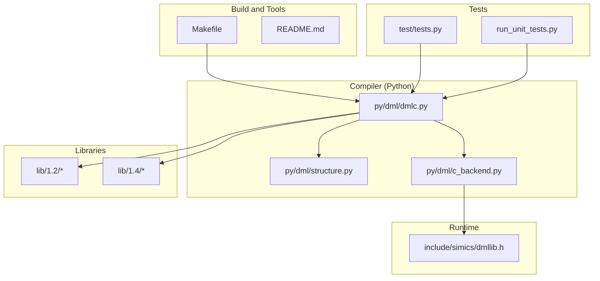
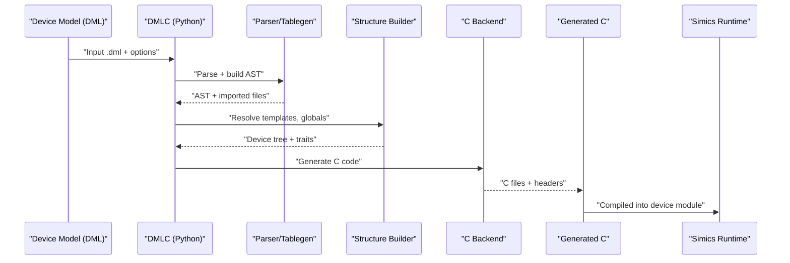
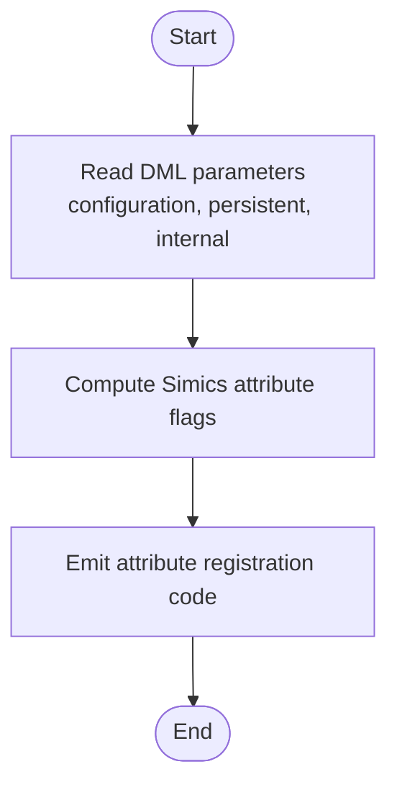
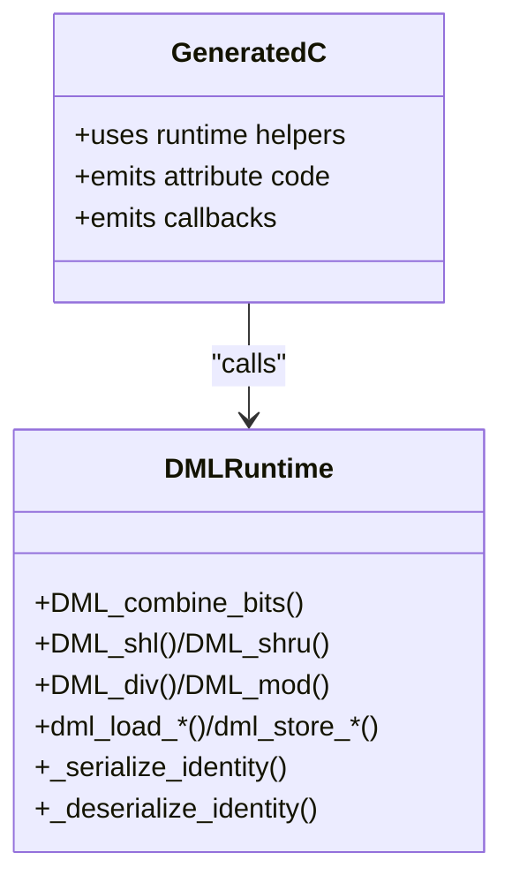
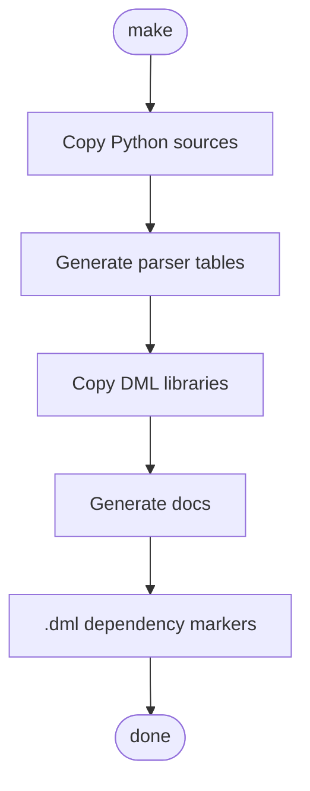
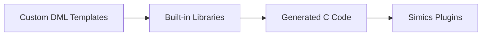
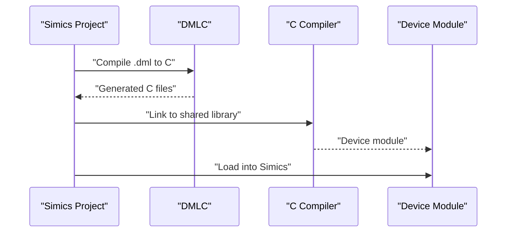
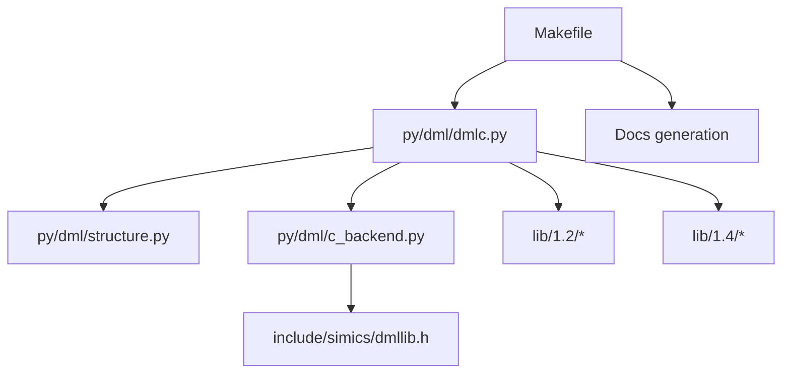
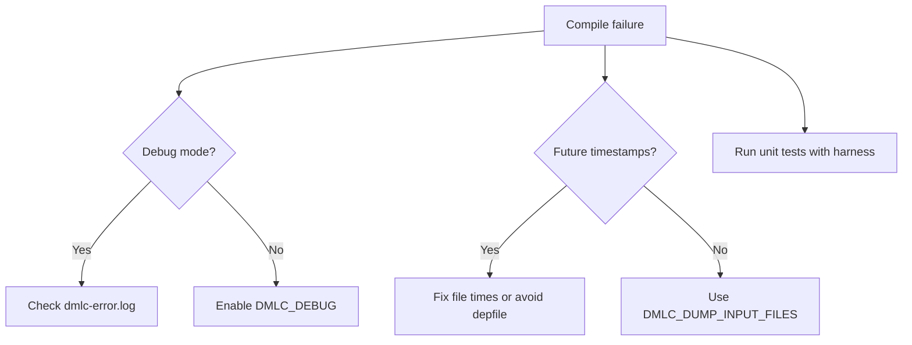

# Integration Guide

<cite>
**Referenced Files in This Document**
- [README.md](file://README.md)
- [Makefile](file://Makefile)
- [include/simics/dmllib.h](file://include/simics/dmllib.h)
- [py/dml/dmlc.py](file://py/dml/dmlc.py)
- [py/dml/structure.py](file://py/dml/structure.py)
- [py/dml/c_backend.py](file://py/dml/c_backend.py)
- [lib/1.4/dml-builtins.dml](file://lib/1.4/dml-builtins.dml)
- [lib/1.2/simics-device.dml](file://lib/1.2/simics-device.dml)
- [lib/1.2/simics-api.dml](file://lib/1.2/simics-api.dml)
- [test/tests.py](file://test/tests.py)
- [run_unit_tests.py](file://run_unit_tests.py)
</cite>

## Table of Contents
1. [Introduction](#introduction)
2. [Project Structure](#project-structure)
3. [Core Components](#core-components)
4. [Architecture Overview](#architecture-overview)
5. [Detailed Component Analysis](#detailed-component-analysis)
6. [Dependency Analysis](#dependency-analysis)
7. [Performance Considerations](#performance-considerations)
8. [Troubleshooting Guide](#troubleshooting-guide)
9. [Conclusion](#conclusion)
10. [Appendices](#appendices)

## Introduction
This guide explains how to integrate the Device Modeling Language (DML) into the Intel Simics™ simulator ecosystem. It covers device registration, configuration management, runtime behavior integration, build system integration with Make, project organization, dependency management, custom extension development, and practical examples for larger simulation environments. It also includes performance tuning, troubleshooting, and CI/deployment strategies.

## Project Structure
The repository organizes DML sources, Python compiler components, built-in libraries, and tests. Key areas:
- Documentation sources and generated docs
- Public C header for runtime utilities
- Python compiler front-end and backends
- DML standard libraries for API versions 1.2 and 1.4
- Tests and test harness for DMLC

**Diagram sources**
- [Makefile](file://Makefile#L1-L252)
- [py/dml/dmlc.py](file://py/dml/dmlc.py#L1-L811)
- [py/dml/structure.py](file://py/dml/structure.py#L1-L3154)
- [py/dml/c_backend.py](file://py/dml/c_backend.py#L1-L3552)
- [include/simics/dmllib.h](file://include/simics/dmllib.h#L1-L3561)
- [lib/1.2/simics-device.dml](file://lib/1.2/simics-device.dml#L1-L18)
- [lib/1.4/dml-builtins.dml](file://lib/1.4/dml-builtins.dml#L1-L4128)
- [test/tests.py](file://test/tests.py#L1-L2186)
- [run_unit_tests.py](file://run_unit_tests.py#L1-L20)

**Section sources**
- [README.md](file://README.md#L1-L117)
- [Makefile](file://Makefile#L1-L252)

## Core Components
- DML Compiler (DMLC): Python-based compiler that parses DML, builds an AST, performs semantic checks, and generates C code for Simics.
- Standard Libraries: Built-in templates and APIs for Simics integration (1.2 and 1.4).
- Runtime Utilities: Public header with helpers and macros used by generated C code.
- Build System: Makefile orchestrates copying libraries, generating parser tables, and producing documentation and artifacts.

Key responsibilities:
- Parse DML and resolve imports
- Type-check and template instantiation
- Generate C code with Simics API bindings
- Emit register views and debug artifacts
- Manage library distribution and documentation

**Section sources**
- [py/dml/dmlc.py](file://py/dml/dmlc.py#L309-L800)
- [py/dml/structure.py](file://py/dml/structure.py#L74-L130)
- [py/dml/c_backend.py](file://py/dml/c_backend.py#L39-L96)
- [lib/1.4/dml-builtins.dml](file://lib/1.4/dml-builtins.dml#L1-L200)
- [include/simics/dmllib.h](file://include/simics/dmllib.h#L1-L3561)
- [Makefile](file://Makefile#L67-L98)

## Architecture Overview
The DML compiler transforms DML source files into C code tailored for Simics. The generated C code relies on runtime utilities and integrates with Simics attributes, memory, events, and interfaces.

**Diagram sources**
- [py/dml/dmlc.py](file://py/dml/dmlc.py#L676-L760)
- [py/dml/structure.py](file://py/dml/structure.py#L74-L130)
- [py/dml/c_backend.py](file://py/dml/c_backend.py#L1-L200)

## Detailed Component Analysis

### Device Registration and Configuration Management
- Device registration is performed by the generated C code, which defines Simics attributes, state, and callbacks. The backend computes attribute flags and documentation from DML parameters.
- Configuration parameters (e.g., persistence, visibility) are mapped to Simics attribute flags during code generation.

**Diagram sources**
- [py/dml/c_backend.py](file://py/dml/c_backend.py#L39-L59)

**Section sources**
- [py/dml/c_backend.py](file://py/dml/c_backend.py#L39-L59)

### Runtime Behavior Integration
- Generated C code uses runtime utilities for logging, assertions, endianness conversions, and identity serialization/deserialization.
- The public header exposes macros and helpers for safe arithmetic, load/store wrappers, and identity handling.

**Diagram sources**
- [include/simics/dmllib.h](file://include/simics/dmllib.h#L31-L174)

**Section sources**
- [include/simics/dmllib.h](file://include/simics/dmllib.h#L31-L174)

### Build System Integration (Makefile)
- The Makefile installs DMLC into the Simics project’s bin directory, copies Python sources and generated parser tables, and distributes DML libraries to both current and legacy locations.
- It generates documentation and parser debug outputs, and sets up dependency tracking for .dml files.

**Diagram sources**
- [Makefile](file://Makefile#L67-L98)
- [Makefile](file://Makefile#L119-L131)
- [Makefile](file://Makefile#L148-L175)
- [Makefile](file://Makefile#L201-L252)

**Section sources**
- [Makefile](file://Makefile#L67-L98)
- [Makefile](file://Makefile#L119-L131)
- [Makefile](file://Makefile#L148-L175)
- [Makefile](file://Makefile#L201-L252)

### Custom Extension Development
- Template Extensions: Extend built-in templates or define new ones in DML to add behavior or interfaces.
- API Customization: Use DML imports and extern declarations to bind to Simics APIs and utilities.
- Plugin Systems: Generated C code integrates with Simics plugins via attributes and callbacks.

**Diagram sources**
- [lib/1.4/dml-builtins.dml](file://lib/1.4/dml-builtins.dml#L17-L29)
- [py/dml/c_backend.py](file://py/dml/c_backend.py#L39-L96)

**Section sources**
- [lib/1.4/dml-builtins.dml](file://lib/1.4/dml-builtins.dml#L17-L29)
- [py/dml/c_backend.py](file://py/dml/c_backend.py#L39-L96)

### Practical Examples and Larger Simulation Environments
- Example: Integrating a DML device into a Simics project involves placing the DML model, ensuring DMLC is built, and compiling the model to a device module linked with Simics.
- The test harness demonstrates invoking DMLC, capturing outputs, and linking with a C compiler to produce a shared library.

**Diagram sources**
- [README.md](file://README.md#L22-L44)
- [test/tests.py](file://test/tests.py#L96-L122)

**Section sources**
- [README.md](file://README.md#L22-L44)
- [test/tests.py](file://test/tests.py#L96-L122)

## Dependency Analysis
- DMLC depends on Python modules under py/dml and external Simics APIs exposed via DML imports.
- Generated C code depends on dmllib.h and Simics runtime headers.
- Make targets coordinate dependency generation and documentation builds.

**Diagram sources**
- [py/dml/dmlc.py](file://py/dml/dmlc.py#L11-L25)
- [py/dml/structure.py](file://py/dml/structure.py#L13-L37)
- [py/dml/c_backend.py](file://py/dml/c_backend.py#L15-L28)
- [include/simics/dmllib.h](file://include/simics/dmllib.h#L17-L30)
- [Makefile](file://Makefile#L67-L98)

**Section sources**
- [py/dml/dmlc.py](file://py/dml/dmlc.py#L11-L25)
- [py/dml/structure.py](file://py/dml/structure.py#L13-L37)
- [py/dml/c_backend.py](file://py/dml/c_backend.py#L15-L28)
- [include/simics/dmllib.h](file://include/simics/dmllib.h#L17-L30)
- [Makefile](file://Makefile#L67-L98)

## Performance Considerations
- Code size and compile time: Use environment variables to gather size statistics and optimize repeated method expansions.
- Debugging and profiling: Enable debuggable artifacts and profiling to analyze bottlenecks.
- Splitting generated C: Use split thresholds to manage large generated files.

Recommendations:
- Prefer shared methods to reduce duplication.
- Reuse built-in templates and utilities to minimize custom logic.
- Monitor generated code size and adjust templates accordingly.

**Section sources**
- [README.md](file://README.md#L96-L117)
- [py/dml/dmlc.py](file://py/dml/dmlc.py#L556-L564)
- [py/dml/dmlc.py](file://py/dml/dmlc.py#L666-L673)

## Troubleshooting Guide
Common issues and remedies:
- Unexpected exceptions: Enable debug mode to print tracebacks; errors are logged to a dedicated file.
- Future timestamps in dependencies: The compiler warns and avoids generating dependency files to prevent infinite rebuild loops.
- Dumping input files: Use environment variable to create an archive of all DML sources for isolated reproduction.
- Unit test failures: The test harness captures stdout/stderr and applies timeouts; ensure compilers and environment variables are configured.

**Diagram sources**
- [py/dml/dmlc.py](file://py/dml/dmlc.py#L227-L237)
- [py/dml/dmlc.py](file://py/dml/dmlc.py#L690-L730)
- [test/tests.py](file://test/tests.py#L91-L95)

**Section sources**
- [py/dml/dmlc.py](file://py/dml/dmlc.py#L227-L237)
- [py/dml/dmlc.py](file://py/dml/dmlc.py#L690-L730)
- [test/tests.py](file://test/tests.py#L91-L95)

## Conclusion
DML integrates tightly with Simics through a robust Python-based compiler that generates efficient C code using standardized libraries and runtime utilities. The Makefile streamlines distribution and documentation, while the test harness validates builds across API versions. Following the practices outlined here ensures reliable integration, maintainable models, and smooth operation in complex simulation environments.

## Appendices

### Build and Test Commands
- Build DMLC from a Simics project:
  - Place the repository under modules/dmlc and run make dmlc or bin\make dmlc on Windows.
- Run unit tests:
  - make test-dmlc or bin/test-runner --suite modules/dmlc/test from the project root.

**Section sources**
- [README.md](file://README.md#L35-L44)

### Environment Variables
- DMLC_DIR: Point to <project>/<hosttype>/bin for locally built compiler.
- T126_JOBS: Parallel test jobs.
- DMLC_PATHSUBST: Rewrite error paths to source files.
- PY_SYMLINKS: Symlink Python files for easier debugging.
- DMLC_DEBUG: Print tracebacks to stderr.
- DMLC_CC: Override default compiler in tests.
- DMLC_PROFILE: Self-profiling output.
- DMLC_DUMP_INPUT_FILES: Emit archive of DML sources for isolation.
- DMLC_GATHER_SIZE_STATISTICS: Emit code generation statistics.

**Section sources**
- [README.md](file://README.md#L46-L117)

### API Versioning and Compatibility
- DML 1.2 and 1.4 libraries provide different interfaces and capabilities.
- Compatibility flags allow strict migration and selective feature disabling.

**Section sources**
- [lib/1.2/simics-device.dml](file://lib/1.2/simics-device.dml#L1-L18)
- [lib/1.2/simics-api.dml](file://lib/1.2/simics-api.dml#L1-L131)
- [lib/1.4/dml-builtins.dml](file://lib/1.4/dml-builtins.dml#L1-L200)
- [py/dml/dmlc.py](file://py/dml/dmlc.py#L581-L622)