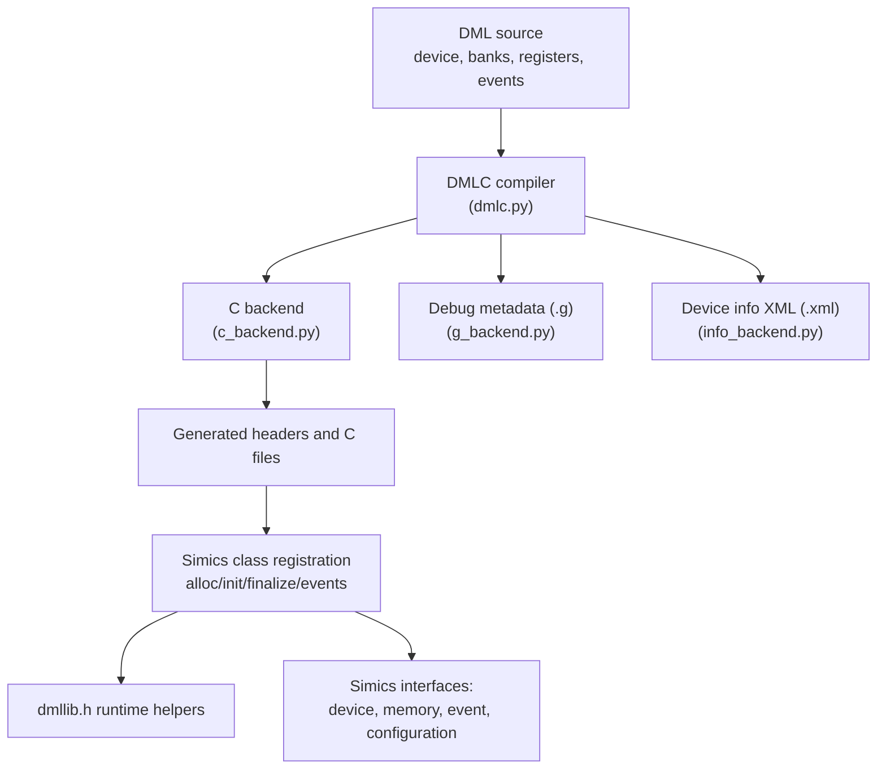
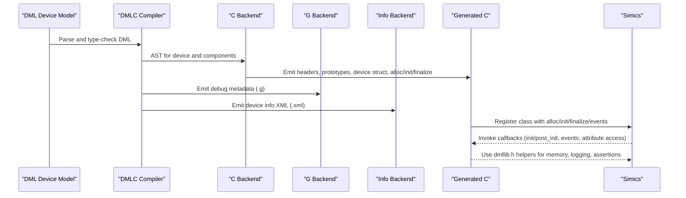
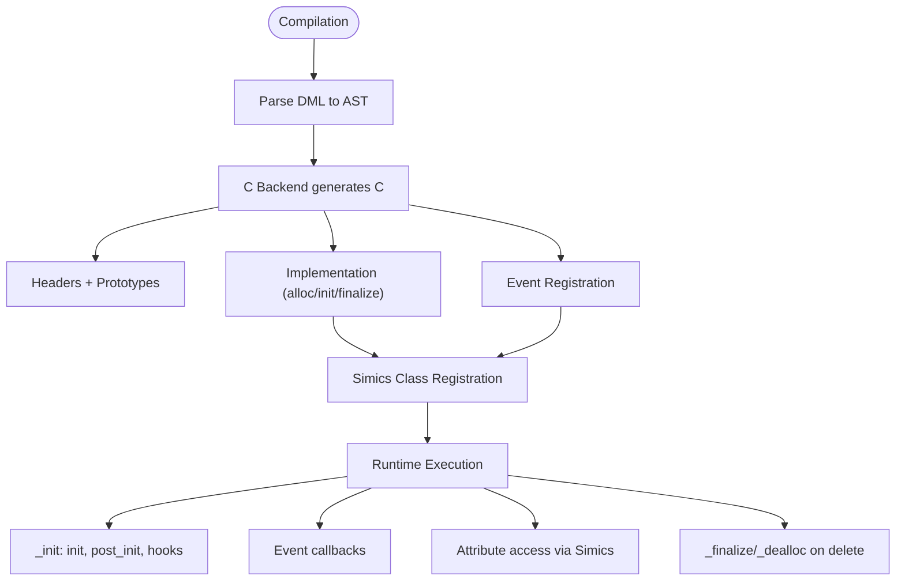
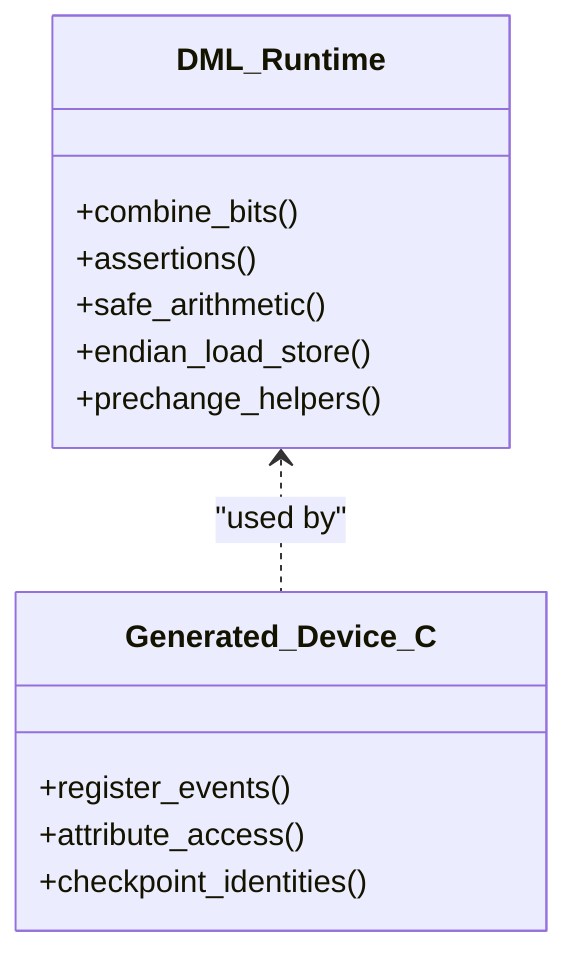
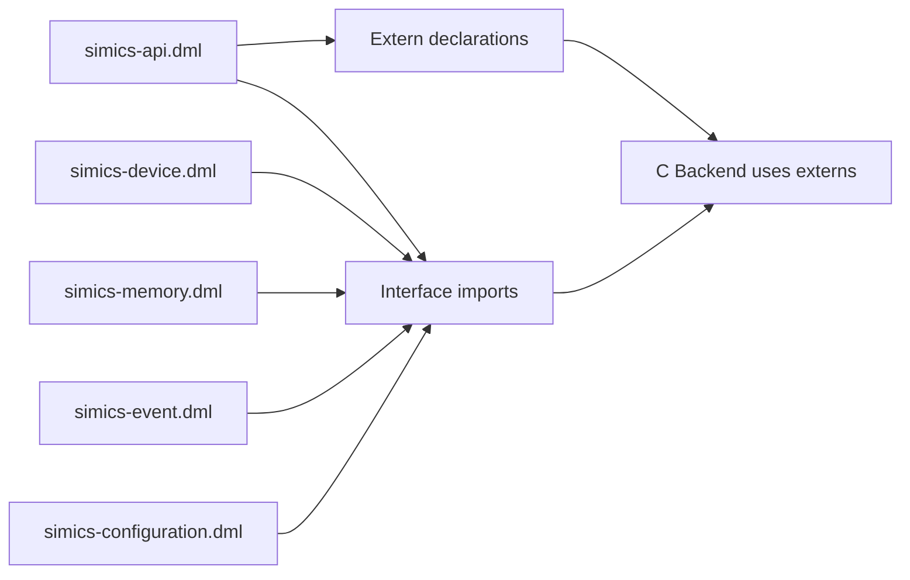
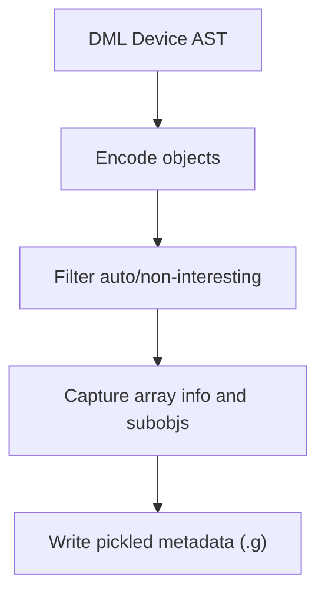
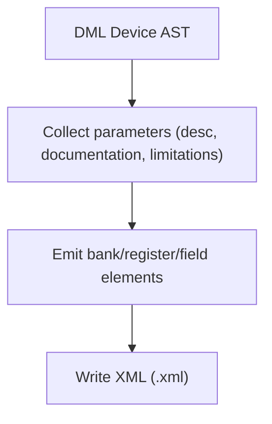
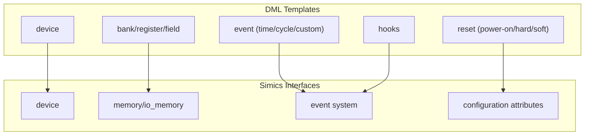
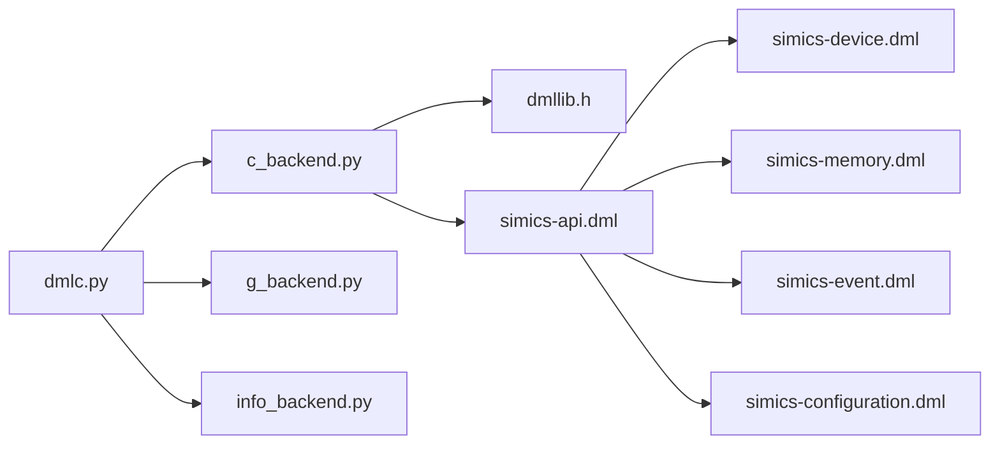

# Simics Integration

<cite>
**Referenced Files in This Document**
- [dmllib.h](file://include/simics/dmllib.h)
- [g_backend.py](file://py/dml/g_backend.py)
- [c_backend.py](file://py/dml/c_backend.py)
- [dmlc.py](file://py/dml/dmlc.py)
- [info_backend.py](file://py/dml/info_backend.py)
- [simics-api.dml](file://lib/1.2/simics-api.dml)
- [simics-device.dml](file://lib/1.2/simics-device.dml)
- [simics-event.dml](file://lib/1.2/simics-event.dml)
- [simics-memory.dml](file://lib/1.2/simics-memory.dml)
- [simics-configuration.dml](file://lib/1.2/simics-configuration.dml)
- [dml-builtins.dml](file://lib/1.4/dml-builtins.dml)
- [utility.dml](file://lib/1.4/utility.dml)
- [RELEASENOTES-1.4.md](file://RELEASENOTES-1.4.md)
</cite>

## Table of Contents
1. [Introduction](#introduction)
2. [Project Structure](#project-structure)
3. [Core Components](#core-components)
4. [Architecture Overview](#architecture-overview)
5. [Detailed Component Analysis](#detailed-component-analysis)
6. [Dependency Analysis](#dependency-analysis)
7. [Performance Considerations](#performance-considerations)
8. [Troubleshooting Guide](#troubleshooting-guide)
9. [Conclusion](#conclusion)
10. [Appendices](#appendices)

## Introduction
This document explains how DML device models integrate with Intel Simics through the DML-generated C runtime and APIs. It covers the device registration process using the dmllib.h API, how DML-generated C code binds to Simics interfaces, and the device lifecycle from compilation to runtime. It also documents the role of g_backend.py in generating debug and metadata, and clarifies how DML templates map to Simics device interfaces.

## Project Structure
At a high level, DML compilation produces:
- C headers and implementation files for device registration and runtime behavior
- Optional debug metadata (.g) and device info XML (.xml)
- Runtime helpers and macros exposed via dmllib.h

Key areas involved in Simics integration:
- DML standard library interfaces for device, memory, event, and configuration
- C backend that generates Simics class registration, allocation, initialization, and event registration
- Debug metadata generator that emits structured object metadata for introspection and debugging
- Info backend that emits device register view XML for GUI and inspection

**Diagram sources**
- [dmlc.py](file://py/dml/dmlc.py#L726-L759)
- [c_backend.py](file://py/dml/c_backend.py#L1321-L1348)
- [c_backend.py](file://py/dml/c_backend.py#L1551-L1618)
- [g_backend.py](file://py/dml/g_backend.py#L182-L188)
- [info_backend.py](file://py/dml/info_backend.py#L181-L185)
- [dmllib.h](file://include/simics/dmllib.h#L1-L120)

**Section sources**
- [dmlc.py](file://py/dml/dmlc.py#L726-L759)
- [c_backend.py](file://py/dml/c_backend.py#L1321-L1348)
- [c_backend.py](file://py/dml/c_backend.py#L1551-L1618)
- [g_backend.py](file://py/dml/g_backend.py#L182-L188)
- [info_backend.py](file://py/dml/info_backend.py#L181-L185)
- [dmllib.h](file://include/simics/dmllib.h#L1-L120)

## Core Components
- dmllib.h: Provides runtime utilities used by generated C code, including endian load/store helpers, assertion helpers, identity serialization for checkpointing, and macros for Simics API access.
- C backend: Generates Simics device class registration, allocation, initialization, finalize, and event registration. It also prints device substructures and handles attribute registration flags.
- g_backend.py: Encodes device object graph and metadata into a pickled binary format consumed by Simics for debugging and introspection.
- info_backend.py: Emits device info XML describing banks, registers, and fields for GUI and inspection.
- Simics interface libraries (DML): Provide constants and extern declarations for Simics interfaces (device, memory, event, configuration) used by DML templates and generated code.

**Section sources**
- [dmllib.h](file://include/simics/dmllib.h#L1-L120)
- [c_backend.py](file://py/dml/c_backend.py#L39-L96)
- [c_backend.py](file://py/dml/c_backend.py#L115-L200)
- [g_backend.py](file://py/dml/g_backend.py#L182-L188)
- [info_backend.py](file://py/dml/info_backend.py#L181-L185)
- [simics-api.dml](file://lib/1.2/simics-api.dml#L1-L131)

## Architecture Overview
The DML-to-Simics integration pipeline:

**Diagram sources**
- [dmlc.py](file://py/dml/dmlc.py#L726-L759)
- [c_backend.py](file://py/dml/c_backend.py#L1321-L1348)
- [c_backend.py](file://py/dml/c_backend.py#L1551-L1618)
- [g_backend.py](file://py/dml/g_backend.py#L182-L188)
- [info_backend.py](file://py/dml/info_backend.py#L181-L185)
- [dmllib.h](file://include/simics/dmllib.h#L1-L120)

## Detailed Component Analysis

### Device Registration and Lifecycle
- Allocation: Generated _alloc function uses zero-allocation for device struct and immediate-after state queue.
- Initialization: _init initializes port objects, static vars, data objects, log-once hash table, and immediate-after queue; invokes device init and optional hard_reset.
- Finalization: _finalize runs device destroy and cleanup routines.
- Event Registration: Events are registered with Simics, including delayed “after” events and simple time/cycle events.
- Class Registration: The top-level init function returns a class pointer with alloc/init/finalize callbacks wired to generated functions.

**Diagram sources**
- [c_backend.py](file://py/dml/c_backend.py#L1551-L1618)
- [c_backend.py](file://py/dml/c_backend.py#L1321-L1348)
- [dmlc.py](file://py/dml/dmlc.py#L726-L759)

**Section sources**
- [c_backend.py](file://py/dml/c_backend.py#L1551-L1618)
- [c_backend.py](file://py/dml/c_backend.py#L1321-L1348)
- [dmlc.py](file://py/dml/dmlc.py#L726-L759)

### Memory Management and Endianness Helpers
- dmllib.h provides endian load/store helpers for arbitrary bit sizes and endianness, plus pre-change helpers and safe arithmetic wrappers with fault signaling.
- These helpers are used by generated code to access registers and fields consistently across architectures.

**Diagram sources**
- [dmllib.h](file://include/simics/dmllib.h#L31-L120)

**Section sources**
- [dmllib.h](file://include/simics/dmllib.h#L31-L120)

### API Binding Generation and Interfaces
- simics-api.dml declares externs for Simics utilities (alloc/free, vectors, bitcount, logging) and imports Simics interface constants and templates.
- simics-device.dml, simics-memory.dml, simics-event.dml, and simics-configuration.dml define constants for Simics interfaces used by DML templates and generated code.

**Diagram sources**
- [simics-api.dml](file://lib/1.2/simics-api.dml#L1-L131)
- [simics-device.dml](file://lib/1.2/simics-device.dml#L1-L18)
- [simics-memory.dml](file://lib/1.2/simics-memory.dml#L1-L29)
- [simics-event.dml](file://lib/1.2/simics-event.dml#L1-L10)
- [simics-configuration.dml](file://lib/1.2/simics-configuration.dml#L1-L15)

**Section sources**
- [simics-api.dml](file://lib/1.2/simics-api.dml#L1-L131)
- [simics-device.dml](file://lib/1.2/simics-device.dml#L1-L18)
- [simics-memory.dml](file://lib/1.2/simics-memory.dml#L1-L29)
- [simics-event.dml](file://lib/1.2/simics-event.dml#L1-L10)
- [simics-configuration.dml](file://lib/1.2/simics-configuration.dml#L1-L15)

### Debug Metadata and Object Graph (g_backend.py)
- g_backend.py encodes the DML object graph (devices, banks, registers, fields, ports, attributes, events, hooks, etc.) into a pickled binary file.
- It skips auto/non-interesting parameters and implicit fields, and captures array dimensions and subobject relationships.
- The generated .g file is consumed by Simics to provide debugging and introspection.

**Diagram sources**
- [g_backend.py](file://py/dml/g_backend.py#L138-L188)

**Section sources**
- [g_backend.py](file://py/dml/g_backend.py#L138-L188)

### Device Info XML Generation (info_backend.py)
- info_backend.py emits an XML describing banks, registers, and fields, including offsets, sizes, and field bit positions.
- This enables GUI tools and inspection commands to visualize device register layouts.

**Diagram sources**
- [info_backend.py](file://py/dml/info_backend.py#L181-L185)

**Section sources**
- [info_backend.py](file://py/dml/info_backend.py#L181-L185)

### Relationship Between DML Templates and Simics Interfaces
- DML 1.4 introduces templates that map to Simics interfaces and behaviors (e.g., register banks, memory transactions, events, and configuration attributes).
- Utility templates in 1.4 provide standardized behaviors for registers, fields, resets, and hooks.
- Release notes highlight improvements in reset support, templates-as-types, and event handling that affect Simics integration.

**Diagram sources**
- [dml-builtins.dml](file://lib/1.4/dml-builtins.dml#L567-L596)
- [utility.dml](file://lib/1.4/utility.dml#L39-L83)
- [RELEASENOTES-1.4.md](file://RELEASENOTES-1.4.md#L6-L362)

**Section sources**
- [dml-builtins.dml](file://lib/1.4/dml-builtins.dml#L567-L596)
- [utility.dml](file://lib/1.4/utility.dml#L39-L83)
- [RELEASENOTES-1.4.md](file://RELEASENOTES-1.4.md#L6-L362)

## Dependency Analysis
- The DMLC driver orchestrates parsing, code generation, and metadata emission.
- The C backend depends on DML AST nodes and Simics interface constants to generate correct bindings.
- dmllib.h is a shared runtime dependency for generated C code.

**Diagram sources**
- [dmlc.py](file://py/dml/dmlc.py#L726-L759)
- [c_backend.py](file://py/dml/c_backend.py#L1321-L1348)
- [g_backend.py](file://py/dml/g_backend.py#L182-L188)
- [info_backend.py](file://py/dml/info_backend.py#L181-L185)
- [dmllib.h](file://include/simics/dmllib.h#L1-L120)
- [simics-api.dml](file://lib/1.2/simics-api.dml#L1-L131)
- [simics-device.dml](file://lib/1.2/simics-device.dml#L1-L18)
- [simics-memory.dml](file://lib/1.2/simics-memory.dml#L1-L29)
- [simics-event.dml](file://lib/1.2/simics-event.dml#L1-L10)
- [simics-configuration.dml](file://lib/1.2/simics-configuration.dml#L1-L15)

**Section sources**
- [dmlc.py](file://py/dml/dmlc.py#L726-L759)
- [c_backend.py](file://py/dml/c_backend.py#L1321-L1348)
- [g_backend.py](file://py/dml/g_backend.py#L182-L188)
- [info_backend.py](file://py/dml/info_backend.py#L181-L185)
- [dmllib.h](file://include/simics/dmllib.h#L1-L120)
- [simics-api.dml](file://lib/1.2/simics-api.dml#L1-L131)
- [simics-device.dml](file://lib/1.2/simics-device.dml#L1-L18)
- [simics-memory.dml](file://lib/1.2/simics-memory.dml#L1-L29)
- [simics-event.dml](file://lib/1.2/simics-event.dml#L1-L10)
- [simics-configuration.dml](file://lib/1.2/simics-configuration.dml#L1-L15)

## Performance Considerations
- DML 1.4 improves compilation performance for devices with large register banks and optimizes attribute registration for connect/attribute/register objects.
- Event handling and immediate after callbacks are optimized; state change notifications are emitted only when applicable.
- Use of dmllib.h helpers ensures efficient and safe memory access patterns.

[No sources needed since this section provides general guidance]

## Troubleshooting Guide
Common issues and remedies:
- Illegal arithmetic operations (division by zero, negative shifts) produce critical errors instead of crashing; review generated code for unsafe operations.
- Attribute collisions: The C backend tracks registered attribute names and reports collisions; ensure unique names per port/device.
- Event arrays: Stacked event arrays are not supported; adjust template usage accordingly.
- Checkpoint identity serialization: Zero-initialized identities are handled specially; ensure correct serialization of object identities.

**Section sources**
- [dmllib.h](file://include/simics/dmllib.h#L98-L122)
- [c_backend.py](file://py/dml/c_backend.py#L97-L110)
- [c_backend.py](file://py/dml/c_backend.py#L1321-L1324)

## Conclusion
DML’s integration with Intel Simics is achieved through a robust compilation pipeline that generates Simics-compatible device classes, event registrations, and runtime helpers. The dmllib.h API provides essential memory and logging utilities, while g_backend.py and info_backend.py deliver debug metadata and device register views. DML templates map cleanly to Simics interfaces, enabling consistent device behavior across platforms.

[No sources needed since this section summarizes without analyzing specific files]

## Appendices

### Practical Examples Index
- Device registration: See class registration and alloc/init/finalize generation.
- Configuration management: See attribute registration flags and documentation handling.
- Runtime behavior: See event registration and immediate after handling.

**Section sources**
- [c_backend.py](file://py/dml/c_backend.py#L1321-L1348)
- [c_backend.py](file://py/dml/c_backend.py#L1551-L1618)
- [c_backend.py](file://py/dml/c_backend.py#L39-L96)