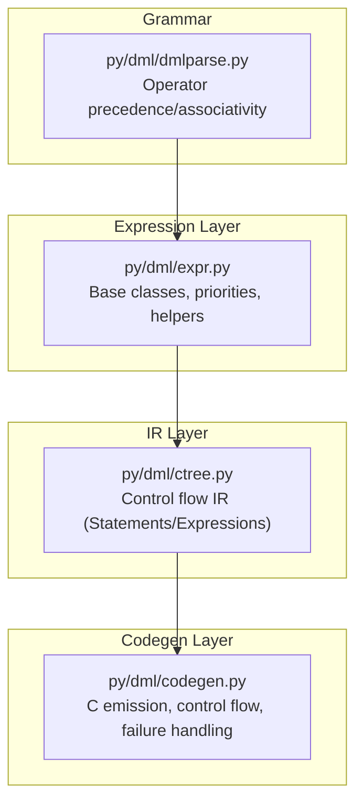
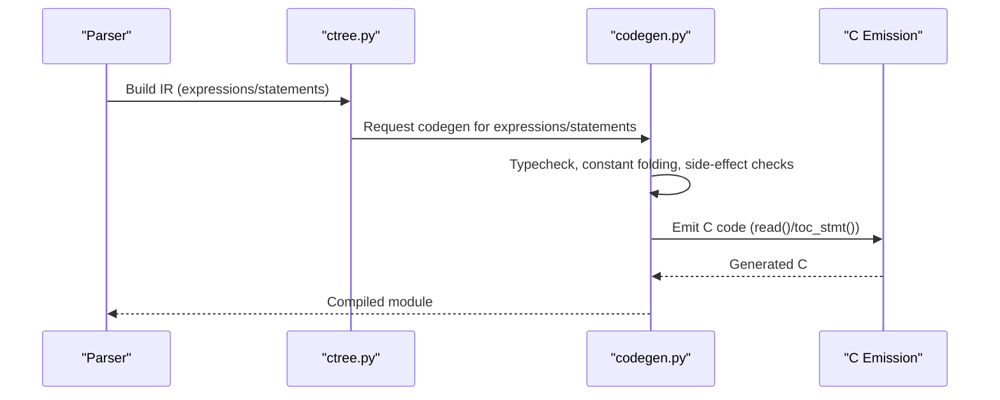
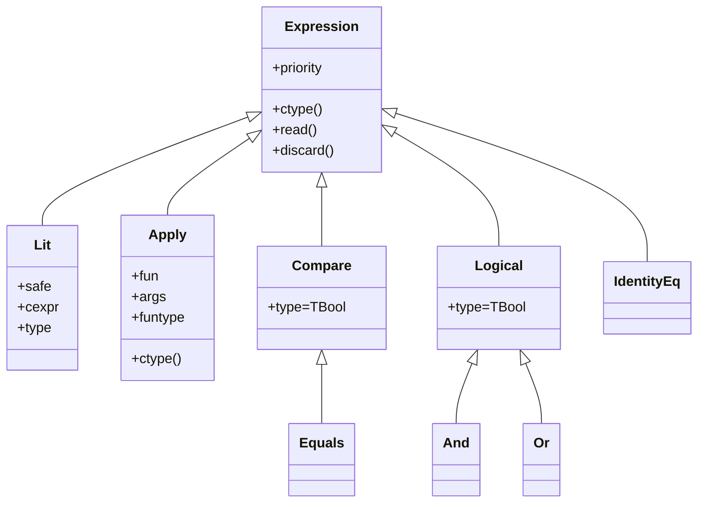
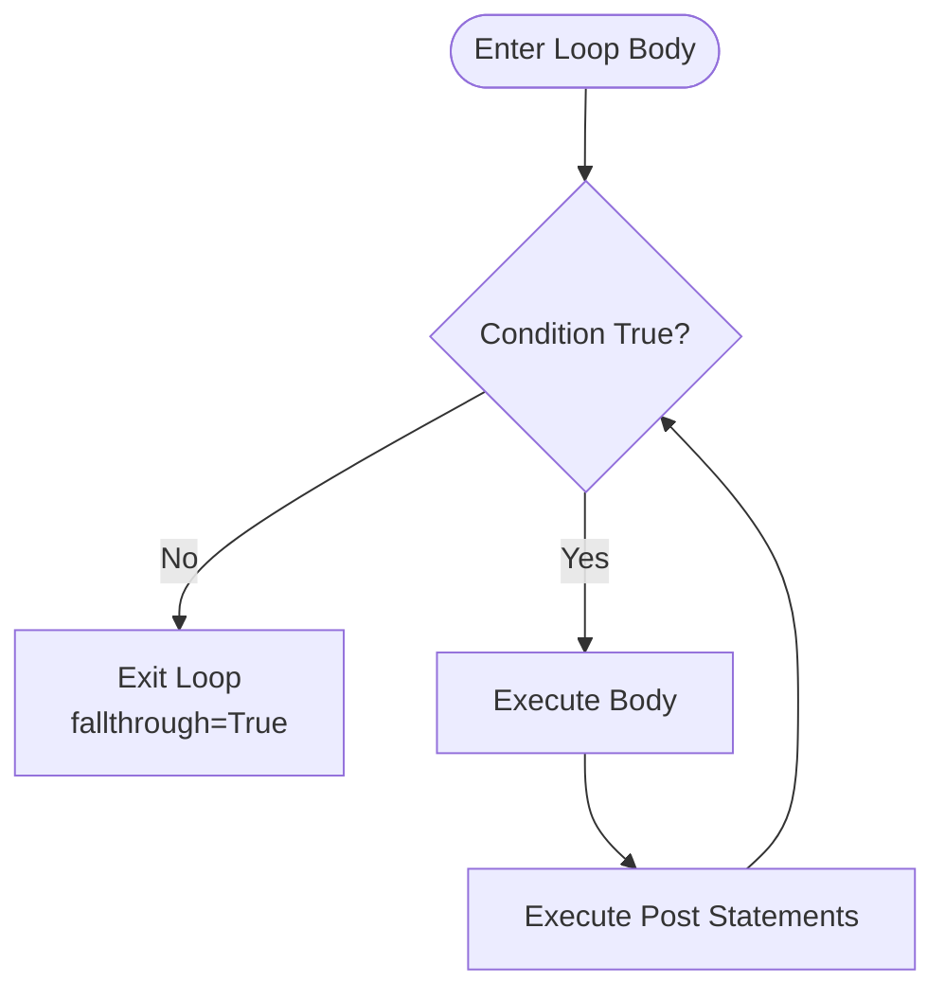
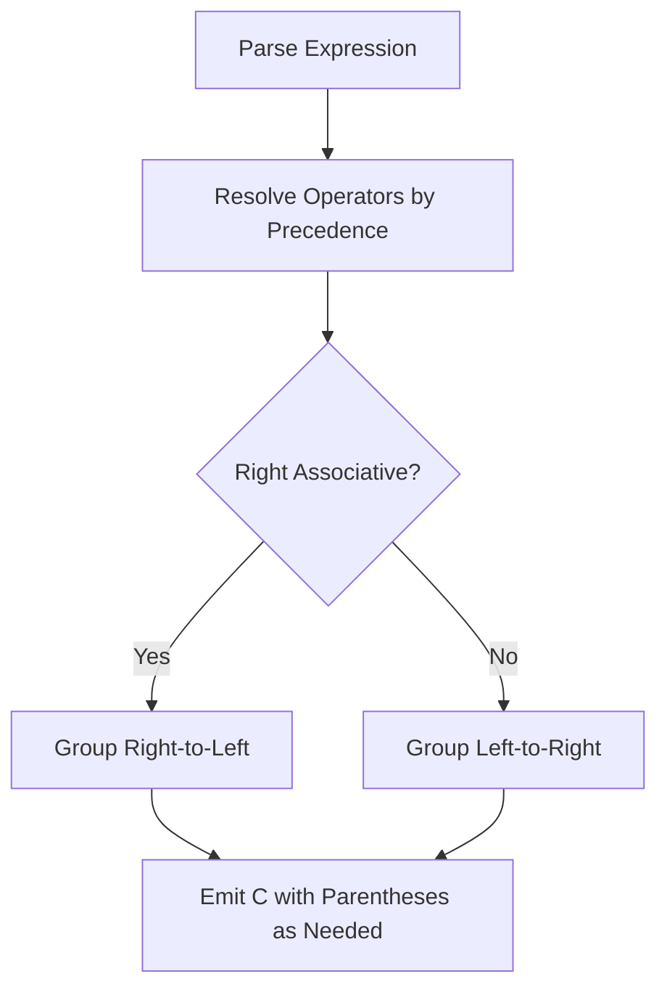
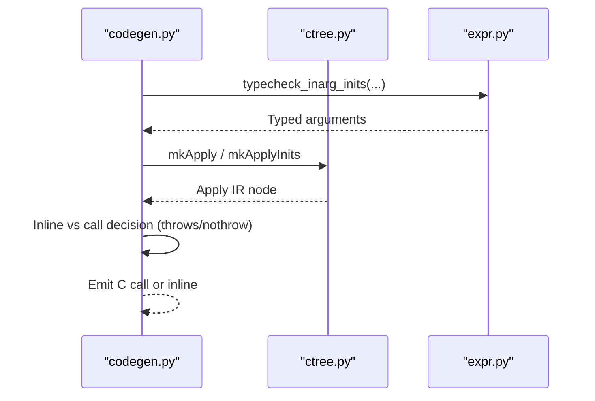
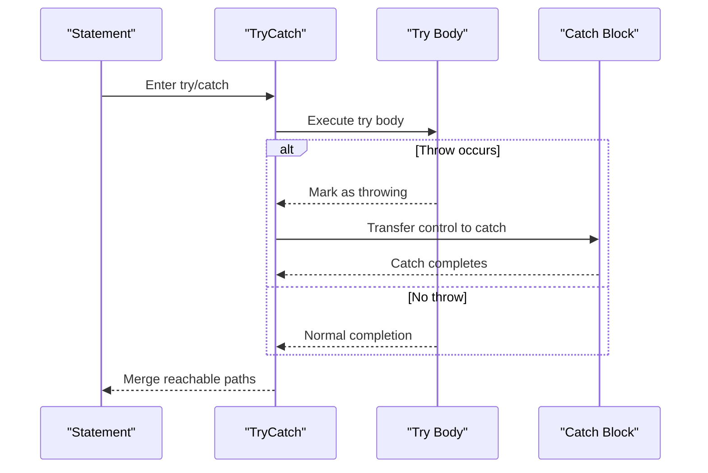
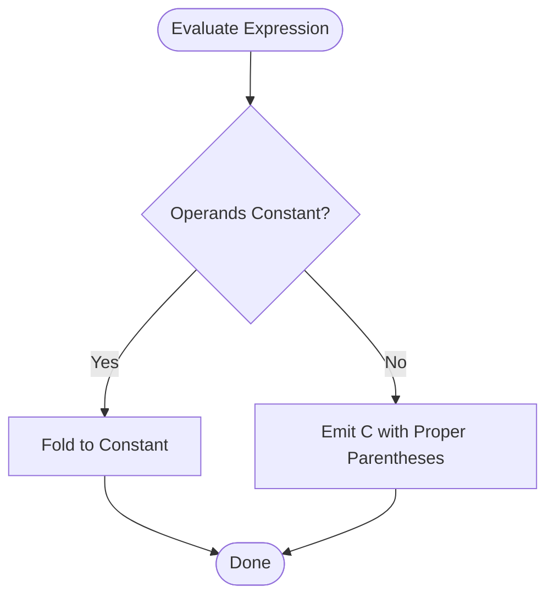
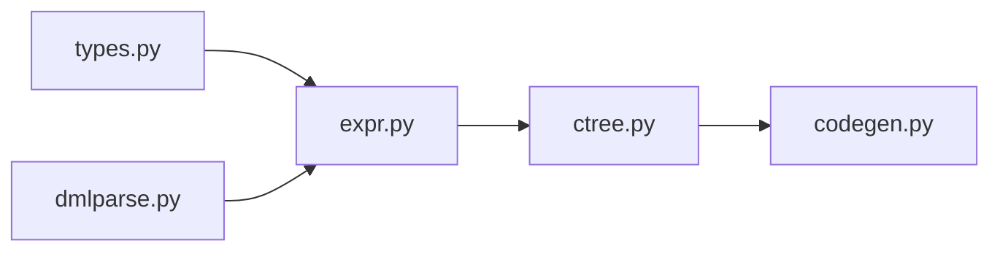

# Control Flow and Expressions

<cite>
**Referenced Files in This Document**
- [expr.py](file://py/dml/expr.py)
- [ctree.py](file://py/dml/ctree.py)
- [codegen.py](file://py/dml/codegen.py)
- [dmlparse.py](file://py/dml/dmlparse.py)
- [ctree_test.py](file://py/dml/ctree_test.py)
- [T_precedence.dml](file://test/1.2/syntax/T_precedence.dml)
- [T_throw.dml](file://test/1.2/statements/T_throw.dml)
- [T_ENORET.dml](file://test/1.4/errors/T_ENORET.dml)
</cite>

## Table of Contents
1. [Introduction](#introduction)
2. [Project Structure](#project-structure)
3. [Core Components](#core-components)
4. [Architecture Overview](#architecture-overview)
5. [Detailed Component Analysis](#detailed-component-analysis)
6. [Dependency Analysis](#dependency-analysis)
7. [Performance Considerations](#performance-considerations)
8. [Troubleshooting Guide](#troubleshooting-guide)
9. [Conclusion](#conclusion)
10. [Appendices](#appendices)

## Introduction
This document explains DML’s control flow constructs and expression evaluation model. It covers:
- Expression types: arithmetic, logical, comparison, bitwise, casts, method/function application, and constants
- Control flow statements: if/else, while/do-while, for, foreach/vector foreach, switch, break/continue/goto, try/catch/throw
- Evaluation order, operator precedence, and associativity
- Method calls, function expressions, and lambda-like constructs
- Exception handling semantics and control flow effects
- Type checking, validation, and runtime evaluation
- Relationship between DML expressions and generated C code

## Project Structure
The relevant implementation resides primarily in:
- py/dml/expr.py: Expression base classes, operator priorities, and helpers
- py/dml/ctree.py: Intermediate control flow IR nodes (statements and expressions) and their C emission
- py/dml/codegen.py: Code generation for expressions and statements, including control flow and failure handling
- py/dml/dmlparse.py: Operator precedence and associativity grammar
- test/1.2/statements/T_throw.dml and test/1.4/errors/T_ENORET.dml: Behavioral tests for exception handling
- test/1.2/syntax/T_precedence.dml: Operator precedence validation

**Diagram sources**
- [expr.py](file://py/dml/expr.py#L41-L158)
- [ctree.py](file://py/dml/ctree.py#L315-L338)
- [codegen.py](file://py/dml/codegen.py#L1156-L1188)
- [dmlparse.py](file://py/dml/dmlparse.py#L22-L79)

**Section sources**
- [expr.py](file://py/dml/expr.py#L41-L158)
- [ctree.py](file://py/dml/ctree.py#L315-L338)
- [codegen.py](file://py/dml/codegen.py#L1156-L1188)
- [dmlparse.py](file://py/dml/dmlparse.py#L22-L79)

## Core Components
- Expression hierarchy and priorities:
  - Base Expression with priority and type metadata
  - Literal and constant expressions
  - Function application (Apply) and method invocation helpers
- Control flow IR:
  - Statements: If, While, DoWhile, For, ForeachSequence, VectorForeach, Switch, Case/Default/SubsequentCases, Break, Continue, Throw, TryCatch, Goto
  - ControlFlow analysis helper for reachability
- Code generation:
  - Expression emission via read()/discard()
  - Statement emission via toc_stmt()/toc()
  - Failure handling modes and exception propagation

Key implementation anchors:
- Expression base and priorities: [expr.py](file://py/dml/expr.py#L41-L158)
- Control flow IR and C emission: [ctree.py](file://py/dml/ctree.py#L846-L1095)
- Control flow analysis and failure modes: [ctree.py](file://py/dml/ctree.py#L315-L338), [codegen.py](file://py/dml/codegen.py#L166-L200)
- Precedence/associativity grammar: [dmlparse.py](file://py/dml/dmlparse.py#L50-L79)

**Section sources**
- [expr.py](file://py/dml/expr.py#L41-L158)
- [ctree.py](file://py/dml/ctree.py#L315-L338)
- [ctree.py](file://py/dml/ctree.py#L846-L1095)
- [codegen.py](file://py/dml/codegen.py#L166-L200)
- [dmlparse.py](file://py/dml/dmlparse.py#L50-L79)

## Architecture Overview
DML expressions are represented as typed C expressions internally and emitted to C. Control flow is modeled as IR statements with precise control-flow analysis. Code generation converts IR to C statements and manages exception handling.

**Diagram sources**
- [ctree.py](file://py/dml/ctree.py#L846-L1095)
- [codegen.py](file://py/dml/codegen.py#L1156-L1188)
- [expr.py](file://py/dml/expr.py#L126-L132)

## Detailed Component Analysis

### Expression Types and Evaluation
- Arithmetic and bitwise:
  - Binary arithmetic and shift operators are represented as BinOp subclasses with priorities and type-checked operands
  - Comparison operators (less-than, greater-than, etc.) normalize types and may emit library function calls for cross-signed comparisons
  - Equality/inequality supports numeric, boolean, pointer, and identity comparisons
- Logical:
  - Boolean And/Or short-circuit behavior is encoded in constructors and constant-folding helpers
- Casts and literals:
  - Casts and literals are represented as typed expressions with safe/unsafe flags
- Function/method application:
  - Apply wraps function calls with argument type-checking and coercion
  - Method invocation detection and special-casing for throws/nothrow and inline contexts

**Diagram sources**
- [expr.py](file://py/dml/expr.py#L41-L158)
- [expr.py](file://py/dml/expr.py#L343-L424)
- [ctree.py](file://py/dml/ctree.py#L1329-L1371)
- [ctree.py](file://py/dml/ctree.py#L1559-L1647)
- [ctree.py](file://py/dml/ctree.py#L1655-L1678)

**Section sources**
- [expr.py](file://py/dml/expr.py#L41-L158)
- [expr.py](file://py/dml/expr.py#L343-L424)
- [ctree.py](file://py/dml/ctree.py#L1329-L1371)
- [ctree.py](file://py/dml/ctree.py#L1477-L1546)
- [ctree.py](file://py/dml/ctree.py#L1559-L1647)
- [ctree.py](file://py/dml/ctree.py#L1655-L1678)

### Control Flow Statements
- Selection: If/Else
  - Constant-folded conditions eliminate dead branches
  - Reachability tracked via ControlFlow analysis
- Loops: While/DoWhile/For
  - Constant conditions lead to infinite-loop or dead-body analysis
  - Post-statement expressions are emitted as comma-separated expressions or statement expressions
- Foreach and vector foreach:
  - ForeachSequence expands to nested loops over sequences
  - VectorForeach emits a macro wrapper around a body
- Switch:
  - Case/default handling with fallthrough semantics and default presence detection
- Jump: Break/Continue/Goto
  - Break/Continue update ControlFlow; Goto is 1.2-only in IR
- Exception handling: Try/Catch/Throw
  - Throw transitions to “throw” state; TryCatch merges reachable paths and handles exceptions

**Diagram sources**
- [ctree.py](file://py/dml/ctree.py#L846-L893)
- [ctree.py](file://py/dml/ctree.py#L895-L935)
- [ctree.py](file://py/dml/ctree.py#L937-L988)
- [ctree.py](file://py/dml/ctree.py#L1061-L1075)
- [ctree.py](file://py/dml/ctree.py#L1000-L1021)
- [ctree.py](file://py/dml/ctree.py#L1077-L1093)
- [ctree.py](file://py/dml/ctree.py#L482-L492)

**Section sources**
- [ctree.py](file://py/dml/ctree.py#L846-L893)
- [ctree.py](file://py/dml/ctree.py#L895-L935)
- [ctree.py](file://py/dml/ctree.py#L937-L988)
- [ctree.py](file://py/dml/ctree.py#L1061-L1075)
- [ctree.py](file://py/dml/ctree.py#L1000-L1021)
- [ctree.py](file://py/dml/ctree.py#L1077-L1093)
- [ctree.py](file://py/dml/ctree.py#L482-L492)

### Operator Precedence and Associativity
- Precedence and associativity are defined in the grammar and reflected in operator priorities in expressions
- Adjustments are made to force parentheses in generated C to avoid compiler warnings

**Diagram sources**
- [dmlparse.py](file://py/dml/dmlparse.py#L50-L79)
- [expr.py](file://py/dml/expr.py#L83-L105)

**Section sources**
- [dmlparse.py](file://py/dml/dmlparse.py#L50-L79)
- [expr.py](file://py/dml/expr.py#L83-L105)
- [T_precedence.dml](file://test/1.2/syntax/T_precedence.dml#L1-L21)

### Method Calls, Function Expressions, and Lambda-like Constructs
- Function application:
  - mkApply/mkApplyInits validate argument counts/types and perform coercions
  - Variadic arguments are handled with special rules
- Method invocation:
  - Code generation detects method calls and may inline or generate calls depending on throws and typing
  - Throws in 1.2 may require exception handling even in nothrow methods if not caught
- Lambda-like constructs:
  - DML supports anonymous function-like constructs via apply expressions and function pointers

**Diagram sources**
- [expr.py](file://py/dml/expr.py#L254-L341)
- [expr.py](file://py/dml/expr.py#L358-L424)
- [codegen.py](file://py/dml/codegen.py#L2248-L2331)

**Section sources**
- [expr.py](file://py/dml/expr.py#L254-L341)
- [expr.py](file://py/dml/expr.py#L358-L424)
- [codegen.py](file://py/dml/codegen.py#L2248-L2331)

### Exception Handling: try/catch/throw
- Throw transitions a statement to “throw” state; subsequent code is unreachable until a catch
- TryCatch merges reachable paths from try and catch blocks
- Tests demonstrate:
  - Throw inside try/catch propagates to the catch block
  - Nested foreach with throw leads to unreachable code after the loop
  - 1.2 allows throw in nothrow methods if caught

**Diagram sources**
- [ctree.py](file://py/dml/ctree.py#L500-L501)
- [ctree.py](file://py/dml/ctree.py#L136-L147)
- [T_ENORET.dml](file://test/1.4/errors/T_ENORET.dml#L91-L131)
- [T_throw.dml](file://test/1.2/statements/T_throw.dml#L16-L22)

**Section sources**
- [ctree.py](file://py/dml/ctree.py#L500-L501)
- [ctree.py](file://py/dml/ctree.py#L136-L147)
- [T_ENORET.dml](file://test/1.4/errors/T_ENORET.dml#L91-L131)
- [T_throw.dml](file://test/1.2/statements/T_throw.dml#L16-L22)

### Expression Evaluation Order and Constant Folding
- Constant folding:
  - Arithmetic and logical operators fold constants when possible
  - Comparison and equality operators fold constants when both operands are constant
- Short-circuit evaluation:
  - And/Or optimize based on left-hand side constants
- Parentheses and priorities:
  - Generated C respects operator priorities; extra parentheses are inserted to avoid warnings

**Diagram sources**
- [expr.py](file://py/dml/expr.py#L1342-L1370)
- [ctree.py](file://py/dml/ctree.py#L1386-L1428)
- [ctree.py](file://py/dml/ctree.py#L1564-L1647)

**Section sources**
- [expr.py](file://py/dml/expr.py#L1342-L1370)
- [ctree.py](file://py/dml/ctree.py#L1386-L1428)
- [ctree.py](file://py/dml/ctree.py#L1564-L1647)

### Relationship Between DML Expressions and Generated C
- Expressions expose read() to produce a C expression string with attached DML type
- Statements expose toc_stmt() to emit C statements
- ControlFlow analysis ensures unreachable code detection and proper fallthrough/throw/break tracking
- Failure modes (InitFailure, ReturnFailure, CatchFailure, LogFailure) influence how exceptions are handled in generated code

**Section sources**
- [expr.py](file://py/dml/expr.py#L126-L132)
- [ctree.py](file://py/dml/ctree.py#L315-L338)
- [codegen.py](file://py/dml/codegen.py#L166-L200)

## Dependency Analysis
- Expression layer depends on types and utilities to enforce type safety and coerce values
- IR layer depends on expression layer for typed subexpressions and on grammar for precedence
- Code generation depends on IR for control flow and on expression layer for typed values

**Diagram sources**
- [expr.py](file://py/dml/expr.py#L10-L11)
- [ctree.py](file://py/dml/ctree.py#L18-L25)
- [codegen.py](file://py/dml/codegen.py#L14-L26)
- [dmlparse.py](file://py/dml/dmlparse.py#L6-L16)

**Section sources**
- [expr.py](file://py/dml/expr.py#L10-L11)
- [ctree.py](file://py/dml/ctree.py#L18-L25)
- [codegen.py](file://py/dml/codegen.py#L14-L26)
- [dmlparse.py](file://py/dml/dmlparse.py#L6-L16)

## Performance Considerations
- Prefer constant-folding for arithmetic/logical expressions to reduce runtime overhead
- Minimize unnecessary parentheses in generated C; rely on priorities to avoid redundant grouping
- Use short-circuit evaluation to prune expensive computations
- Avoid repeated conversions between signed/unsigned integer types; leverage library functions only when necessary

## Troubleshooting Guide
Common issues and diagnostics:
- Type mismatches in function/method calls:
  - EARG: wrong number of arguments
  - EPTYPE: incompatible argument types
  - ECONSTP: const parameter violation
- Invalid expression contexts:
  - ENVAL: non-value used where a value is required
  - ERVAL: invalid operand for sizeof
- Control flow errors:
  - EBREAK/ECONT/ECONTU: break/continue outside loops
- Exceptions:
  - Uncaught throw leads to unreachable code detection and potential ENORET in 1.4
  - 1.2 allows throw in nothrow methods if caught

**Section sources**
- [expr.py](file://py/dml/expr.py#L231-L248)
- [expr.py](file://py/dml/expr.py#L285-L341)
- [ctree.py](file://py/dml/ctree.py#L136-L147)
- [T_ENORET.dml](file://test/1.4/errors/T_ENORET.dml#L91-L131)
- [T_throw.dml](file://test/1.2/statements/T_throw.dml#L16-L22)

## Conclusion
DML’s expression and control flow system combines a typed expression layer with a precise control flow IR and robust code generation. Operator precedence and associativity are enforced by grammar and expression priorities. Exception handling integrates tightly with control flow analysis to detect unreachable code and manage failure modes. Method and function calls are validated and optimized, with careful attention to side effects and type safety.

## Appendices

### Appendix A: Operator Precedence Summary
- Highest precedence: postfix, prefix unary, cast, sizeof
- Multiplicative: *, /, %
- Additive: +, -
- Shift: <<, >>
- Comparison: <, <=, >, >=
- Equality: ==, !=
- Bitwise AND/OR/XOR: &, ^, |
- Logical AND/OR: &&, ||
- Conditional: ?:
- Assignment: =, +=, etc.
- Lowest: comma

**Section sources**
- [dmlparse.py](file://py/dml/dmlparse.py#L50-L79)
- [expr.py](file://py/dml/expr.py#L83-L105)