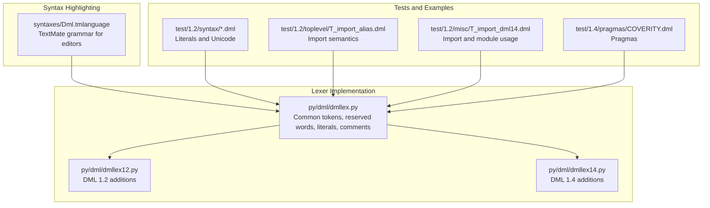
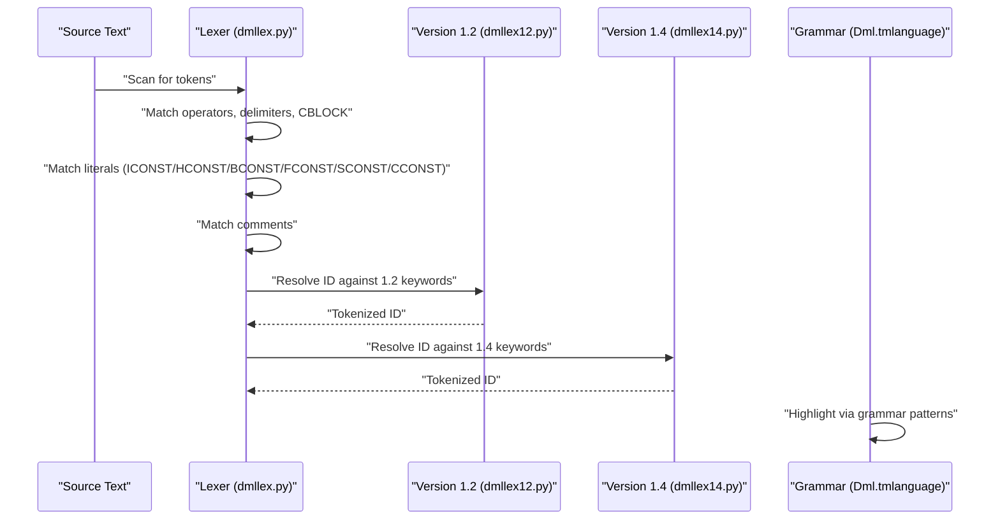
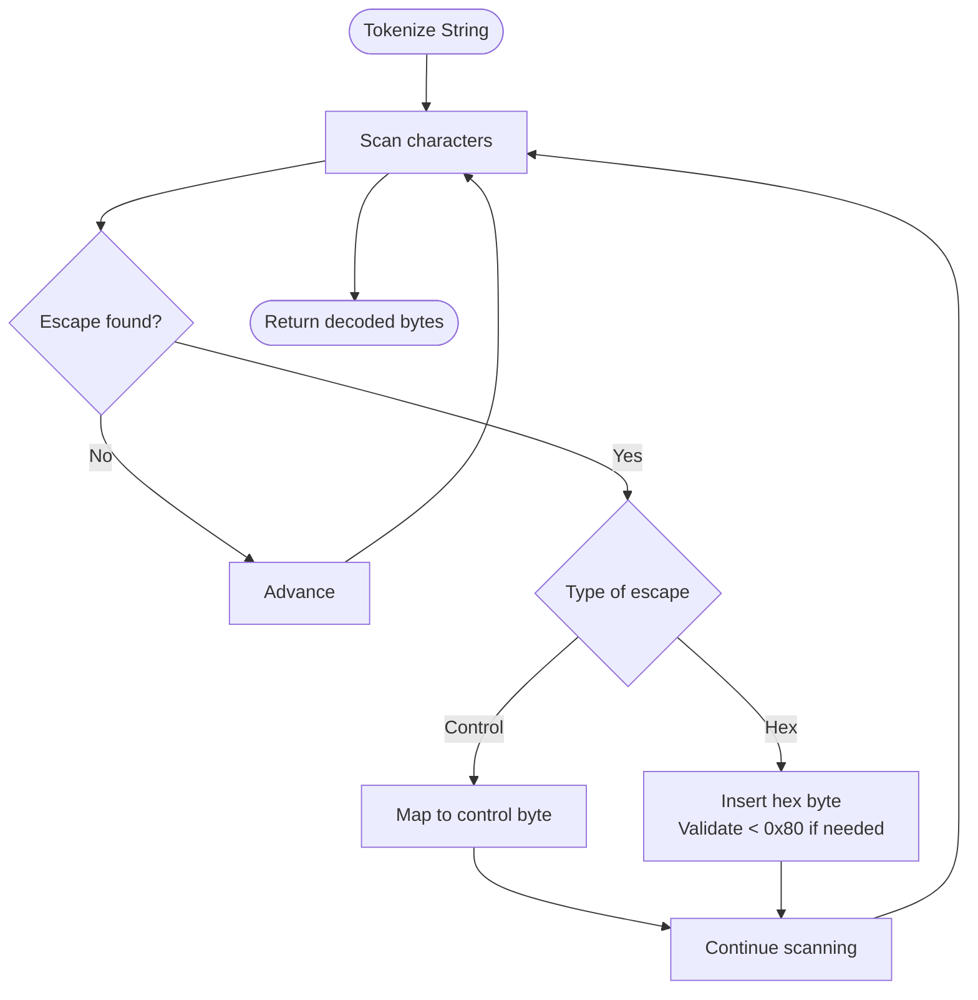
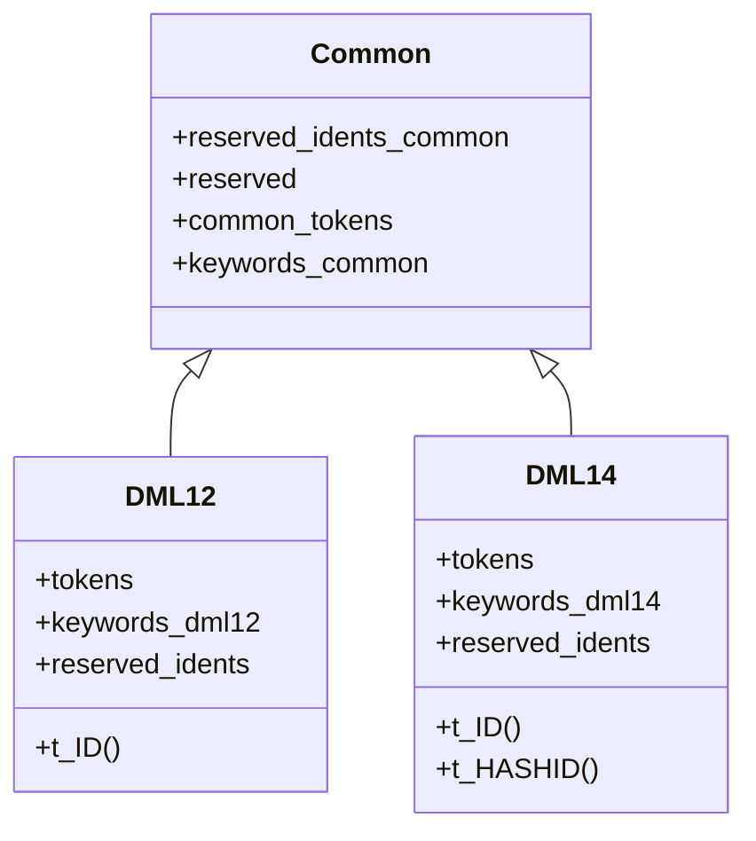
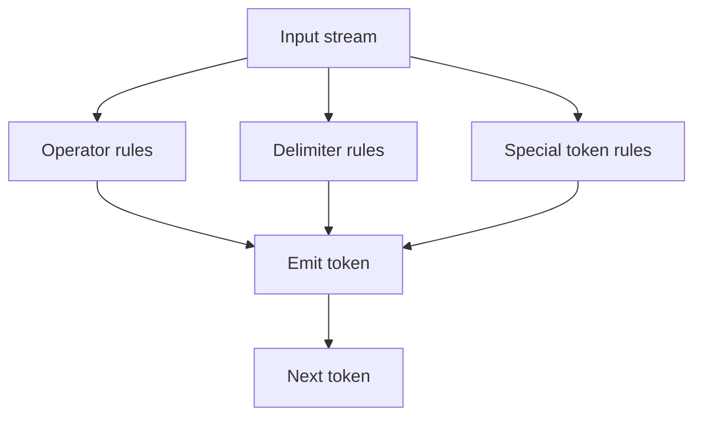
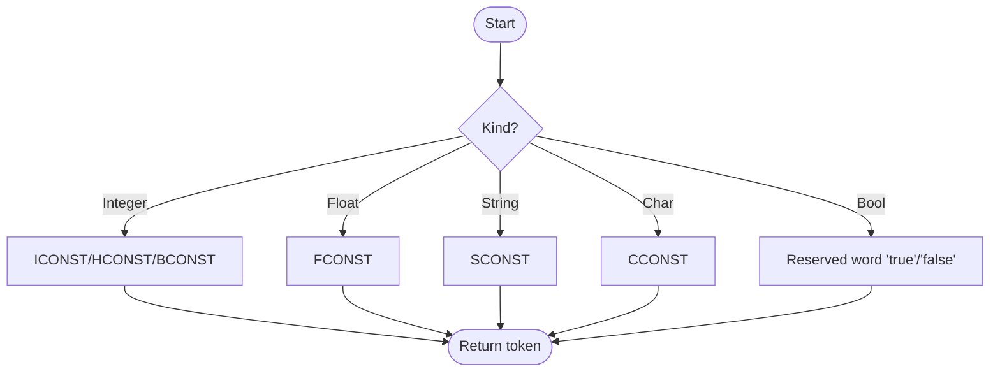
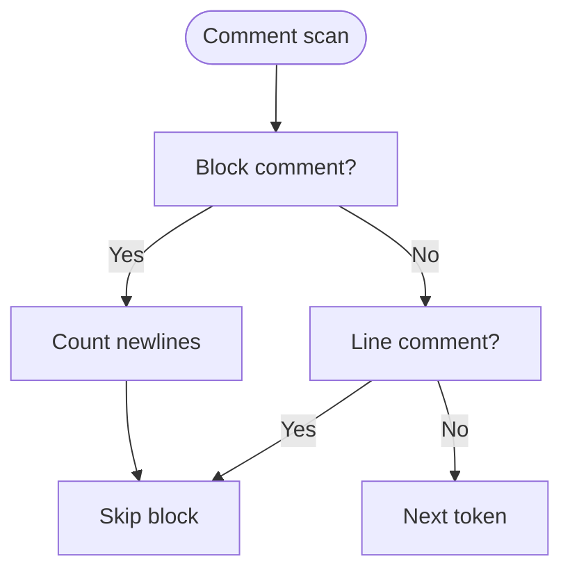
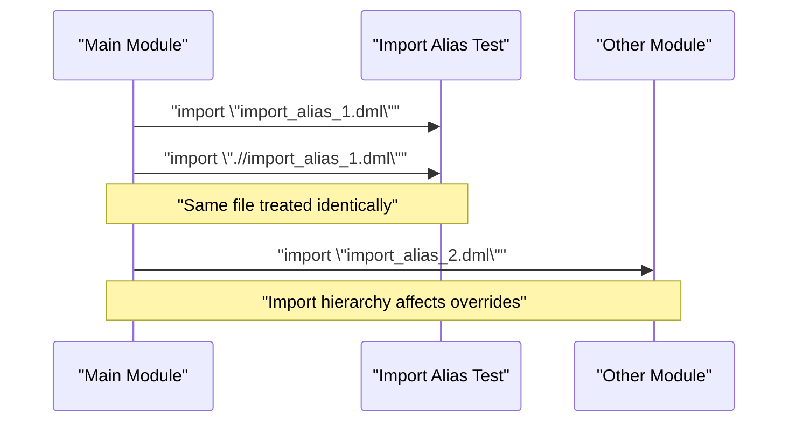
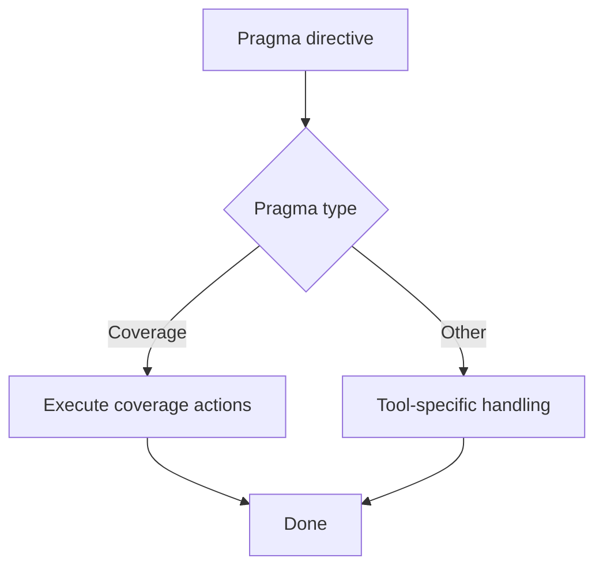
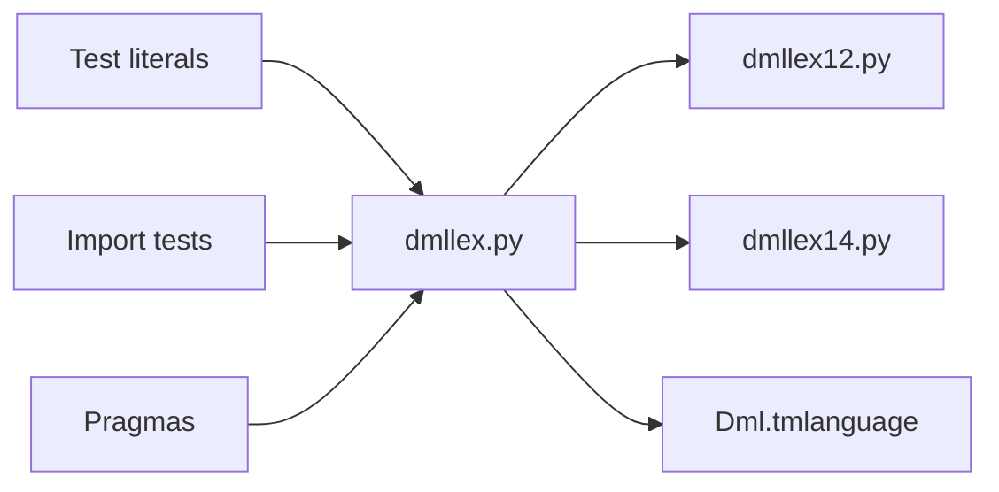

# Core Syntax and Lexical Structure

<cite>
**Referenced Files in This Document**
- [dmllex.py](file://py/dml/dmllex.py)
- [dmllex12.py](file://py/dml/dmllex12.py)
- [dmllex14.py](file://py/dml/dmllex14.py)
- [Dml.tmlanguage](file://syntaxes/Dml.tmlanguage)
- [T_charlit.dml](file://test/1.2/syntax/T_charlit.dml)
- [T_float.dml](file://test/1.2/syntax/T_float.dml)
- [T_int.dml](file://test/1.2/syntax/T_int.dml)
- [T_stringlit.dml](file://test/1.2/syntax/T_stringlit.dml)
- [T_unicode.dml](file://test/1.2/syntax/T_unicode.dml)
- [T_import_alias.dml](file://test/1.2/toplevel/T_import_alias.dml)
- [T_import_dml14.dml](file://test/1.2/misc/T_import_dml14.dml)
- [COVERITY.dml](file://test/1.4/pragmas/COVERITY.dml)
</cite>

## Table of Contents
1. [Introduction](#introduction)
2. [Project Structure](#project-structure)
3. [Core Components](#core-components)
4. [Architecture Overview](#architecture-overview)
5. [Detailed Component Analysis](#detailed-component-analysis)
6. [Dependency Analysis](#dependency-analysis)
7. [Performance Considerations](#performance-considerations)
8. [Troubleshooting Guide](#troubleshooting-guide)
9. [Conclusion](#conclusion)
10. [Appendices](#appendices)

## Introduction
This document describes DML’s core syntax and lexical structure. It covers:
- Character encoding and Unicode handling
- Reserved words and identifiers
- Token recognition for operators, delimiters, and literals
- String and character literals, including escape sequences
- Integer, floating-point, and boolean literals
- Comment syntax (C-style block and line comments)
- Module system: import directives, file structure, and import hierarchy semantics
- Pragmas, including the COVERITY pragma
- Practical examples and common pitfalls

## Project Structure
DML’s lexer and syntax highlighting are implemented in Python and TextMate grammar files:
- Lexical analysis: Python modules define tokens, reserved words, and regular expressions for identifiers and literals
- Syntax highlighting: TextMate grammar defines tokenization patterns for editors and build systems

**Diagram sources**
- [dmllex.py](file://py/dml/dmllex.py#L1-L280)
- [dmllex12.py](file://py/dml/dmllex12.py#L1-L21)
- [dmllex14.py](file://py/dml/dmllex14.py#L1-L44)
- [Dml.tmlanguage](file://syntaxes/Dml.tmlanguage#L1-L800)
- [T_charlit.dml](file://test/1.2/syntax/T_charlit.dml#L1-L24)
- [T_float.dml](file://test/1.2/syntax/T_float.dml#L1-L52)
- [T_int.dml](file://test/1.2/syntax/T_int.dml#L1-L19)
- [T_stringlit.dml](file://test/1.2/syntax/T_stringlit.dml#L1-L23)
- [T_unicode.dml](file://test/1.2/syntax/T_unicode.dml#L1-L22)
- [T_import_alias.dml](file://test/1.2/toplevel/T_import_alias.dml#L1-L34)
- [T_import_dml14.dml](file://test/1.2/misc/T_import_dml14.dml#L1-L175)
- [COVERITY.dml](file://test/1.4/pragmas/COVERITY.dml)

**Section sources**
- [dmllex.py](file://py/dml/dmllex.py#L1-L280)
- [dmllex12.py](file://py/dml/dmllex12.py#L1-L21)
- [dmllex14.py](file://py/dml/dmllex14.py#L1-L44)
- [Dml.tmlanguage](file://syntaxes/Dml.tmlanguage#L1-L800)

## Core Components
- Reserved words and identifiers
  - Common reserved words and identifiers are defined centrally and extended per version
  - Identifiers match a standard pattern and are resolved against reserved word maps
- Tokens
  - Includes operators, assignment operators, increment/decrement, structure dereference, conditional operator, delimiters, ellipsis, and DML-specific tokens
- Literals
  - Integer (decimal, hexadecimal, binary), floating-point, string, character, and boolean
- Comments
  - C-style block comments and line comments
- Unicode and escape sequences
  - Strings and characters support escape sequences and UTF-8 encoding

**Section sources**
- [dmllex.py](file://py/dml/dmllex.py#L11-L86)
- [dmllex12.py](file://py/dml/dmllex12.py#L6-L20)
- [dmllex14.py](file://py/dml/dmllex14.py#L14-L33)

## Architecture Overview
The lexer composes tokens from regular expressions and keyword maps. Version-specific lexers extend the common token set and keyword maps. Editor syntax highlighting mirrors the lexer’s tokenization.

**Diagram sources**
- [dmllex.py](file://py/dml/dmllex.py#L169-L279)
- [dmllex12.py](file://py/dml/dmllex12.py#L17-L20)
- [dmllex14.py](file://py/dml/dmllex14.py#L30-L33)
- [Dml.tmlanguage](file://syntaxes/Dml.tmlanguage#L42-L117)

## Detailed Component Analysis

### Character Encoding and Unicode
- UTF-8 handling
  - String literals are encoded as UTF-8 and processed with escape sequences
  - Character constants accept single-byte ASCII characters and escape sequences
- Unicode examples
  - Tests demonstrate UTF-8 byte sequences for non-ASCII characters in strings
- Escape sequences
  - Supported in strings and characters, including hex escapes and common control characters

**Diagram sources**
- [dmllex.py](file://py/dml/dmllex.py#L209-L243)
- [dmllex.py](file://py/dml/dmllex.py#L245-L267)
- [T_stringlit.dml](file://test/1.2/syntax/T_stringlit.dml#L10-L21)
- [T_unicode.dml](file://test/1.2/syntax/T_unicode.dml#L15-L20)

**Section sources**
- [dmllex.py](file://py/dml/dmllex.py#L209-L267)
- [T_stringlit.dml](file://test/1.2/syntax/T_stringlit.dml#L10-L21)
- [T_unicode.dml](file://test/1.2/syntax/T_unicode.dml#L15-L20)

### Reserved Words and Identifiers
- Reserved words
  - Common reserved words plus ANSI C and selected C++ reserved words
  - Version-specific additions (DML 1.2 and 1.4)
- Identifiers
  - Match a standard identifier pattern and are resolved against keyword maps

**Diagram sources**
- [dmllex.py](file://py/dml/dmllex.py#L11-L47)
- [dmllex12.py](file://py/dml/dmllex12.py#L6-L20)
- [dmllex14.py](file://py/dml/dmllex14.py#L14-L33)

**Section sources**
- [dmllex.py](file://py/dml/dmllex.py#L11-L47)
- [dmllex12.py](file://py/dml/dmllex12.py#L11-L20)
- [dmllex14.py](file://py/dml/dmllex14.py#L21-L33)

### Token Recognition: Operators, Delimiters, and Special Tokens
- Operators and assignment operators
- Increment/decrement, structure dereference, conditional operator
- Delimiters and ellipsis
- DML-specific tokens (e.g., CBLOCK)

**Diagram sources**
- [dmllex.py](file://py/dml/dmllex.py#L96-L153)
- [dmllex.py](file://py/dml/dmllex.py#L156-L163)

**Section sources**
- [dmllex.py](file://py/dml/dmllex.py#L96-L163)

### Constants: Integers, Floats, Strings, Characters, Booleans
- Integer literals
  - Decimal, hexadecimal, binary forms with underscore separators
- Floating-point literals
  - Support for various exponent forms and signs
- String literals
  - Double-quoted with escape sequences and UTF-8 content
- Character literals
  - Single-quoted with escape sequences and ASCII constraints
- Boolean literals
  - Recognized by grammar and reserved words

**Diagram sources**
- [dmllex.py](file://py/dml/dmllex.py#L171-L206)
- [dmllex.py](file://py/dml/dmllex.py#L221-L243)
- [dmllex.py](file://py/dml/dmllex.py#L254-L267)
- [Dml.tmlanguage](file://syntaxes/Dml.tmlanguage#L92-L95)

**Section sources**
- [dmllex.py](file://py/dml/dmllex.py#L171-L267)
- [Dml.tmlanguage](file://syntaxes/Dml.tmlanguage#L92-L95)
- [T_int.dml](file://test/1.2/syntax/T_int.dml#L10-L17)
- [T_float.dml](file://test/1.2/syntax/T_float.dml#L15-L42)
- [T_charlit.dml](file://test/1.2/syntax/T_charlit.dml#L10-L18)
- [T_stringlit.dml](file://test/1.2/syntax/T_stringlit.dml#L10-L11)

### Comments: C-style Inline and Line Comments
- Block comments and line comments are recognized and handled by the lexer
- Editor grammar highlights both styles consistently

**Diagram sources**
- [dmllex.py](file://py/dml/dmllex.py#L269-L276)
- [Dml.tmlanguage](file://syntaxes/Dml.tmlanguage#L630-L709)

**Section sources**
- [dmllex.py](file://py/dml/dmllex.py#L269-L276)
- [Dml.tmlanguage](file://syntaxes/Dml.tmlanguage#L630-L709)

### Module System: Imports, File Structure, and Import Hierarchies
- Import directives
  - Import statements bring in external DML files
  - Relative and absolute paths are supported
- Import hierarchy semantics
  - Different spellings of the same import are treated as identical
  - Import hierarchy influences parameter and method override resolution
- File structure requirements
  - Modules typically define device, bank, register, method, and parameter constructs
- Version-aware imports
  - Tests show importing version-specific modules and using versioned features

**Diagram sources**
- [T_import_alias.dml](file://test/1.2/toplevel/T_import_alias.dml#L13-L22)
- [T_import_dml14.dml](file://test/1.2/misc/T_import_dml14.dml#L9-L17)

**Section sources**
- [T_import_alias.dml](file://test/1.2/toplevel/T_import_alias.dml#L11-L22)
- [T_import_dml14.dml](file://test/1.2/misc/T_import_dml14.dml#L9-L17)

### Pragmas: Syntax and Supported Pragmas (e.g., COVERITY)
- Pragmas are directives for tools and analyzers
- Example coverage pragma is present in the test suite
- Lexical layer recognizes pragma constructs; semantic handling depends on downstream tools

**Diagram sources**
- [COVERITY.dml](file://test/1.4/pragmas/COVERITY.dml)

**Section sources**
- [COVERITY.dml](file://test/1.4/pragmas/COVERITY.dml)

### Practical Examples and Common Pitfalls
- Valid syntax examples
  - Integer literals in decimal, hexadecimal, and binary forms
  - Floating-point literals with exponents and signs
  - String literals with escapes and Unicode content
  - Character literals with escapes
- Common pitfalls
  - Illegal escape sequences in strings and characters
  - Hex escapes above 0x7f in Unicode strings
  - Unrecognized character escapes
  - Illegal characters in input stream
  - Import aliasing affecting override resolution

**Section sources**
- [T_int.dml](file://test/1.2/syntax/T_int.dml#L10-L17)
- [T_float.dml](file://test/1.2/syntax/T_float.dml#L15-L42)
- [T_stringlit.dml](file://test/1.2/syntax/T_stringlit.dml#L10-L21)
- [T_charlit.dml](file://test/1.2/syntax/T_charlit.dml#L10-L18)
- [dmllex.py](file://py/dml/dmllex.py#L233-L242)
- [dmllex.py](file://py/dml/dmllex.py#L261-L266)
- [dmllex.py](file://py/dml/dmllex.py#L277-L279)

## Dependency Analysis
The lexer depends on:
- Regular expression patterns and keyword maps
- Version-specific extensions
- Editor grammar for syntax highlighting

**Diagram sources**
- [dmllex.py](file://py/dml/dmllex.py#L1-L280)
- [dmllex12.py](file://py/dml/dmllex12.py#L1-L21)
- [dmllex14.py](file://py/dml/dmllex14.py#L1-L44)
- [Dml.tmlanguage](file://syntaxes/Dml.tmlanguage#L1-L800)

**Section sources**
- [dmllex.py](file://py/dml/dmllex.py#L1-L280)
- [dmllex12.py](file://py/dml/dmllex12.py#L1-L21)
- [dmllex14.py](file://py/dml/dmllex14.py#L1-L44)
- [Dml.tmlanguage](file://syntaxes/Dml.tmlanguage#L1-L800)

## Performance Considerations
- Tokenization performance relies on efficient regular expressions and keyword lookup
- Large input streams benefit from minimal backtracking in regex patterns
- Avoid excessive nested groups in regexps to prevent performance degradation

## Troubleshooting Guide
- Illegal character errors
  - Occur when the input stream contains unsupported characters
- Unrecognized escape sequences
  - Detected during string and character literal processing
- Hex escape validation
  - Hex escapes above 0x7f in Unicode strings are flagged
- Import resolution issues
  - Ensure consistent import paths; aliasing must not change semantic import hierarchy

**Section sources**
- [dmllex.py](file://py/dml/dmllex.py#L218-L219)
- [dmllex.py](file://py/dml/dmllex.py#L233-L242)
- [dmllex.py](file://py/dml/dmllex.py#L261-L266)
- [dmllex.py](file://py/dml/dmllex.py#L277-L279)

## Conclusion
DML’s lexical layer provides robust support for modern C-like syntax with DML-specific extensions. The lexer defines a comprehensive set of tokens, handles Unicode and escape sequences carefully, and integrates with editor grammars. The module system and pragmas enable structured composition and tool integration. Following the examples and pitfalls outlined here ensures reliable parsing and compilation.

## Appendices
- Editor syntax highlighting mirrors lexer tokenization for consistent authoring and validation.

**Section sources**
- [Dml.tmlanguage](file://syntaxes/Dml.tmlanguage#L42-L117)