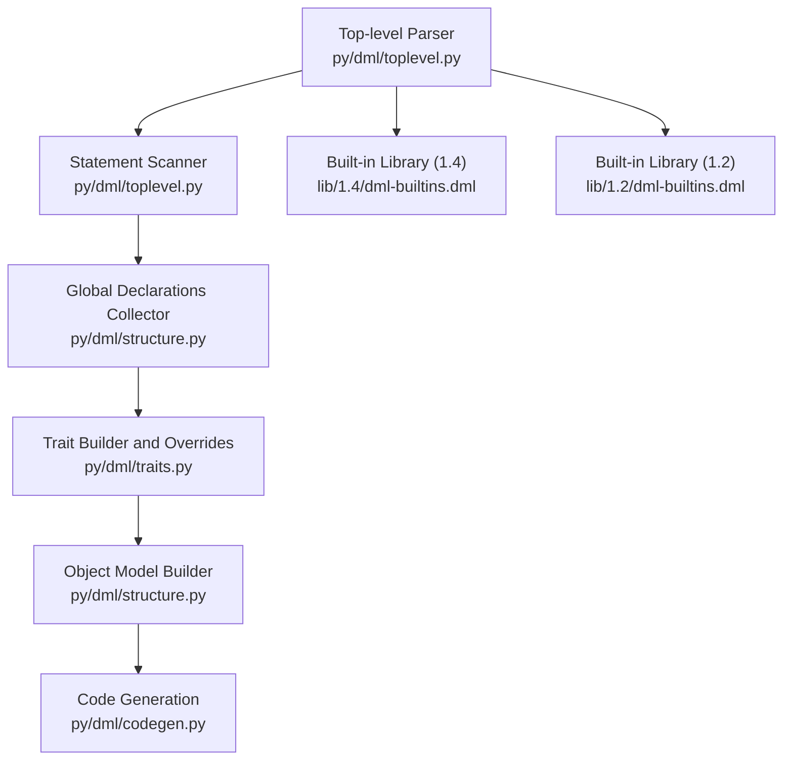
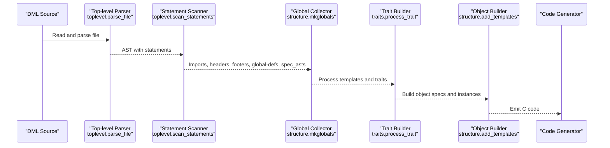
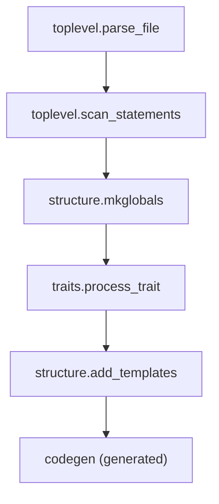

# Declarations and Program Structure

<cite>
**Referenced Files in This Document**
- [README.md](file://README.md)
- [toplevel.py](file://py/dml/toplevel.py)
- [structure.py](file://py/dml/structure.py)
- [traits.py](file://py/dml/traits.py)
- [symtab.py](file://py/dml/symtab.py)
- [dml-builtins.dml (1.4)](file://lib/1.4/dml-builtins.dml)
- [dml-builtins.dml (1.2)](file://lib/1.2/dml-builtins.dml)
- [T_device.dml](file://test/1.2/structure/T_device.dml)
- [T_parameters.dml](file://test/1.2/structure/T_parameters.dml)
- [T_connect.dml](file://test/1.2/structure/T_connect.dml)
- [T_methods_1.dml](file://test/1.2/trivial/T_methods_1.dml)
</cite>

## Table of Contents
1. [Introduction](#introduction)
2. [Project Structure](#project-structure)
3. [Core Components](#core-components)
4. [Architecture Overview](#architecture-overview)
5. [Detailed Component Analysis](#detailed-component-analysis)
6. [Dependency Analysis](#dependency-analysis)
7. [Performance Considerations](#performance-considerations)
8. [Troubleshooting Guide](#troubleshooting-guide)
9. [Conclusion](#conclusion)
10. [Appendices](#appendices)

## Introduction
This document explains the DML (Device Modeling Language) declaration system and program structure. It covers how DML organizes its top-level and object-level declarations, how language version and device declarations are processed, how parameters, methods, attributes, connects, interfaces, implements, groups, and saved/session variables are declared and resolved, and how scoping and inheritance/overriding work. It also documents ordering requirements, visibility rules, and validation constraints enforced by the compiler.

## Project Structure
At a high level, DML compilation is implemented in Python modules that parse DML source files, categorize top-level statements, import and merge templates, and build a typed object model. The built-in library provides foundational templates and declarations for device, bank, register, attribute, connect, and other object types.

**Diagram sources**
- [toplevel.py](file://py/dml/toplevel.py#L114-L186)
- [structure.py](file://py/dml/structure.py#L74-L287)
- [traits.py](file://py/dml/traits.py#L35-L114)

**Section sources**
- [README.md](file://README.md#L1-L117)
- [toplevel.py](file://py/dml/toplevel.py#L114-L186)
- [structure.py](file://py/dml/structure.py#L74-L287)
- [traits.py](file://py/dml/traits.py#L35-L114)

## Core Components
- Top-level parsing and version detection: The parser reads the DML version statement, validates it against supported versions, and prepares the AST for further processing.
- Statement scanning: Top-level statements are separated into imports, headers, footers, global definitions (constants, typedefs, externs, templates), and the device-level object specification.
- Global declaration collection: Constants, externs, typedefs, and loggroups are collected into a global scope, with duplicate and type-checking rules applied.
- Trait system: Traits encapsulate shared methods, parameters, sessions, and hooks. They enforce uniqueness, override rules, and method signature compatibility.
- Object model construction: Templates are instantiated, parameters are merged across inheritance, and object hierarchies are built with proper scoping and visibility.

**Section sources**
- [toplevel.py](file://py/dml/toplevel.py#L66-L128)
- [toplevel.py](file://py/dml/toplevel.py#L129-L186)
- [structure.py](file://py/dml/structure.py#L74-L287)
- [traits.py](file://py/dml/traits.py#L35-L114)

## Architecture Overview
The DML compiler’s declaration pipeline proceeds as follows:

**Diagram sources**
- [toplevel.py](file://py/dml/toplevel.py#L245-L276)
- [toplevel.py](file://py/dml/toplevel.py#L129-L186)
- [structure.py](file://py/dml/structure.py#L74-L287)
- [traits.py](file://py/dml/traits.py#L35-L114)

## Detailed Component Analysis

### Language Version Declaration
- The DML version is detected from a version tag at the top of the file. If absent and allowed by compatibility flags, a default version is assumed; otherwise, a syntax error is raised. Supported versions are checked against a whitelist.
- After determining the version, the parser builds an AST and records the DML version for downstream processing.

Key behaviors:
- Version tag removal preserves source positions for diagnostics.
- Optional version statements are deprecated in favor of explicit version tags.
- Porting warnings are emitted when parsing legacy constructs.

**Section sources**
- [toplevel.py](file://py/dml/toplevel.py#L66-L128)
- [toplevel.py](file://py/dml/toplevel.py#L188-L276)

### Device Declaration
- The top-level device declaration is represented as a special object specification. The scanner recognizes device-level statements and augments the AST accordingly.
- The device object inherits core templates (e.g., init/post_init/destroy) and exposes structural parameters such as class name, register size, byte order, and API version.

Examples of device-level declarations:
- Device-level parameters and methods.
- Built-in templates for device-level behavior.

**Section sources**
- [toplevel.py](file://py/dml/toplevel.py#L129-L186)
- [dml-builtins.dml (1.4)](file://lib/1.4/dml-builtins.dml#L565-L670)
- [dml-builtins.dml (1.2)](file://lib/1.2/dml-builtins.dml#L199-L270)

### Parameter Declarations
- Parameters are declared at the top-level or within templates. They can be typed or untyped, default or non-default, and can reference other objects or arrays.
- Parameter merging across templates enforces uniqueness and override rules. In DML 1.2, non-default definitions take precedence over defaults; in DML 1.4+, explicit override rules apply with validation for ambiguous or invalid overrides.

Validation rules:
- Duplicate parameter names within the same rank are rejected.
- Overriding non-default parameters is flagged as invalid.
- Conflicting defaults across unrelated ancestors trigger ambiguity errors.

Scoping:
- Parameters are resolved within the template scope and can reference parent objects or arrays.

**Section sources**
- [structure.py](file://py/dml/structure.py#L604-L709)
- [structure.py](file://py/dml/structure.py#L578-L602)
- [T_parameters.dml](file://test/1.2/structure/T_parameters.dml#L10-L112)

### Methods
- Methods can be declared as shared (available to traits) or regular. They carry input/output signatures, optional throws annotations, and qualifiers such as independent/startup/memoized.
- Override validation checks argument counts, output counts, inline argument presence, and type compatibility (with lenient mode available).

Override mechanics:
- Method signatures must match across the inheritance chain.
- Qualifiers must be compatible (e.g., memoized implies startup; independent implies startup).
- Ambiguous overrides across unrelated ancestors are reported.

**Section sources**
- [traits.py](file://py/dml/traits.py#L387-L427)
- [structure.py](file://py/dml/structure.py#L711-L800)

### Attributes
- Attributes are objects that expose configuration parameters to the simulator. They are defined via templates that provide get/set logic and metadata such as documentation, persistence, and visibility.
- In DML 1.4, attributes are grouped under a common attribute interface template; in DML 1.2, attribute behavior is provided by templates with explicit methods.

Visibility and configuration:
- Parameters control whether attributes are required, optional, pseudo, or none.
- Flags and documentation strings are derived from parameters.

**Section sources**
- [dml-builtins.dml (1.4)](file://lib/1.4/dml-builtins.dml#L713-L792)
- [dml-builtins.dml (1.2)](file://lib/1.2/dml-builtins.dml#L322-L389)

### Connects and Interfaces
- Connects are objects representing external connections. They can be declared without interfaces and optionally bound to interface templates.
- Interfaces define abstract methods or parameters that must be implemented by the connected object.

Declaration patterns:
- Declaring a connect without an interface yields a basic connection object.
- Declaring a connect with an interface adds the interface’s methods and parameters.

**Section sources**
- [T_connect.dml](file://test/1.2/structure/T_connect.dml#L10-L21)
- [dml-builtins.dml (1.4)](file://lib/1.4/dml-builtins.dml#L793-L800)

### Groups
- Groups are container objects used to organize other objects. They can appear anywhere in the hierarchy and are excluded from certain namespaces (e.g., “bank” or “port” named groups).

Declaration and constraints:
- Group templates define structural parameters and namespace clash checks.

**Section sources**
- [dml-builtins.dml (1.4)](file://lib/1.4/dml-builtins.dml#L686-L694)
- [dml-builtins.dml (1.2)](file://lib/1.2/dml-builtins.dml#L190-L197)

### Saved and Session Variables
- Saved and session variables are template-level variables that persist across method invocations or are scoped to the template instantiation. They are declared within templates and participate in type checking and code generation.

**Section sources**
- [traits.py](file://py/dml/traits.py#L75-L84)
- [dml-builtins.dml (1.4)](file://lib/1.4/dml-builtins.dml#L696-L707)

### Declaration Ordering and Visibility Rules
- Top-level statements are scanned and categorized. Imports are resolved and merged into the global scope. Templates are transformed into automatically instantiated templates to handle overrides.
- Visibility is governed by scopes: global scope for top-level declarations, per-template scopes for parameters and methods, and per-method scopes for local variables.
- Unused declarations can trigger warnings, with special handling for methods that are unused in certain contexts.

**Section sources**
- [toplevel.py](file://py/dml/toplevel.py#L129-L186)
- [symtab.py](file://py/dml/symtab.py#L73-L127)
- [structure.py](file://py/dml/structure.py#L449-L462)

### Declaration Inheritance and Overriding
- Traits define ancestor relationships and vtables. Method and parameter overrides must be unambiguous and type-compatible.
- Parameter overrides are disallowed for parameters; attempting to override a parameter triggers a name collision error.
- Ambiguous overrides across unrelated ancestors are reported as errors.

**Section sources**
- [traits.py](file://py/dml/traits.py#L273-L386)
- [traits.py](file://py/dml/traits.py#L429-L493)

### Declaration Validation Rules
- Duplicate declarations of the same name within the same scope are rejected.
- Type mismatches in method overrides and incompatible qualifiers are flagged.
- Uninitialized or unused declarations may produce warnings.
- Version-specific compatibility rules apply (e.g., optional version statements, deprecated aliases).

**Section sources**
- [structure.py](file://py/dml/structure.py#L106-L128)
- [toplevel.py](file://py/dml/toplevel.py#L86-L112)

### Example: Complete Device Model Organization
A minimal device model demonstrates the typical structure:
- Language version declaration.
- Device-level object with parameters and methods.
- Nested objects such as banks, registers, and attributes.
- Optional imports of built-in libraries and interfaces.

Example references:
- Device-level parameter access and bank parameter usage.
- Parameter merging and template inheritance.
- Connect declaration with optional interface.

**Section sources**
- [T_device.dml](file://test/1.2/structure/T_device.dml#L5-L21)
- [T_parameters.dml](file://test/1.2/structure/T_parameters.dml#L5-L112)
- [T_connect.dml](file://test/1.2/structure/T_connect.dml#L5-L21)

## Dependency Analysis
The declaration system exhibits layered dependencies:
- Parsing depends on the lexer/parser for the selected DML version.
- Statement scanning depends on the global scope and import resolution.
- Trait processing depends on type checking and method signature compatibility.
- Object instantiation depends on template expansion and parameter merging.

**Diagram sources**
- [toplevel.py](file://py/dml/toplevel.py#L245-L276)
- [toplevel.py](file://py/dml/toplevel.py#L129-L186)
- [structure.py](file://py/dml/structure.py#L74-L287)
- [traits.py](file://py/dml/traits.py#L35-L114)

**Section sources**
- [toplevel.py](file://py/dml/toplevel.py#L245-L276)
- [structure.py](file://py/dml/structure.py#L74-L287)
- [traits.py](file://py/dml/traits.py#L35-L114)

## Performance Considerations
- Template expansion and trait resolution can be expensive; minimizing deep template hierarchies helps reduce code generation overhead.
- Prefer explicit parameter declarations and avoid excessive conditional blocks in templates to keep generated code size manageable.
- Use shared methods judiciously; memoized methods incur additional overhead.

## Troubleshooting Guide
Common issues and resolutions:
- Missing language version statement: Ensure a valid version tag is present at the top of the file.
- Unsupported version: Verify the version matches supported versions and adjust accordingly.
- Duplicate declarations: Rename or remove conflicting declarations; ensure unique names within the same scope.
- Method override errors: Align signatures, qualifiers, and types across the inheritance chain.
- Unused declarations: Remove or annotate as intentionally unused to suppress warnings.

**Section sources**
- [toplevel.py](file://py/dml/toplevel.py#L86-L112)
- [structure.py](file://py/dml/structure.py#L106-L128)
- [traits.py](file://py/dml/traits.py#L387-L427)

## Conclusion
DML’s declaration system provides a robust framework for modeling device behavior through templates, traits, and object hierarchies. The compiler enforces strict rules for scoping, inheritance, and overriding while offering flexibility through version-specific features and compatibility modes. Understanding the declaration pipeline and validation rules is essential for writing maintainable and correct DML models.

## Appendices

### Appendix A: Declaration Types and Where They Appear
- Language version: Top of file; determines parser and compatibility rules.
- Device: Top-level object specification; inherits core templates and exposes structural parameters.
- Parameters: Top-level or within templates; support default/non-default and typed/untyped forms.
- Methods: Within templates or objects; support shared and regular forms with qualifiers.
- Attributes: Objects exposing configuration parameters; defined via attribute templates.
- Connects: Objects representing connections; optionally bound to interface templates.
- Groups: Container objects; used to organize other objects.
- Saved/Session variables: Template-level variables for stateful behavior.

**Section sources**
- [toplevel.py](file://py/dml/toplevel.py#L129-L186)
- [dml-builtins.dml (1.4)](file://lib/1.4/dml-builtins.dml#L565-L670)
- [dml-builtins.dml (1.2)](file://lib/1.2/dml-builtins.dml#L199-L270)
- [traits.py](file://py/dml/traits.py#L75-L84)