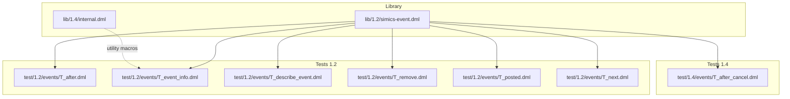
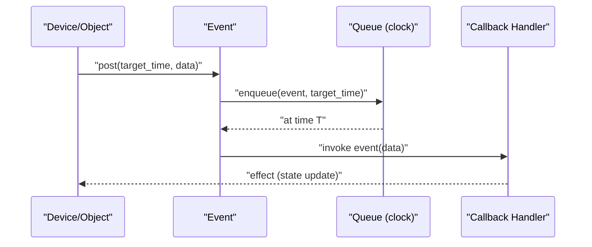
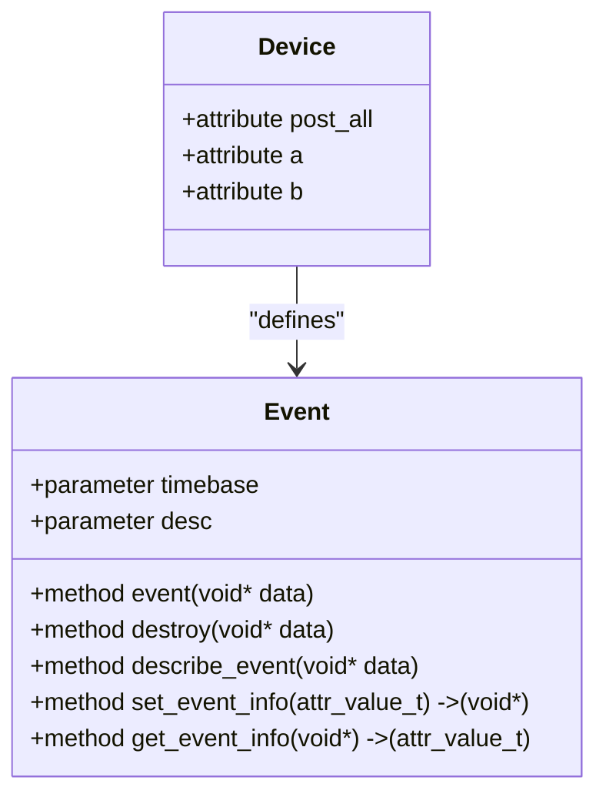
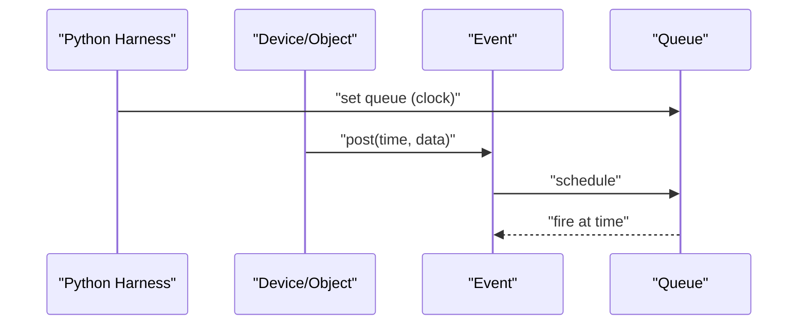
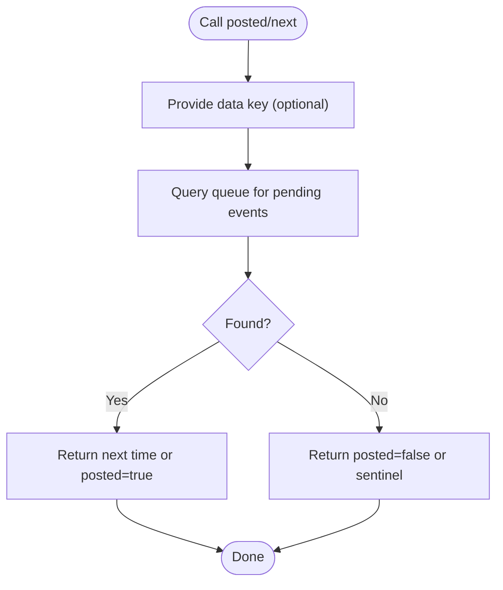
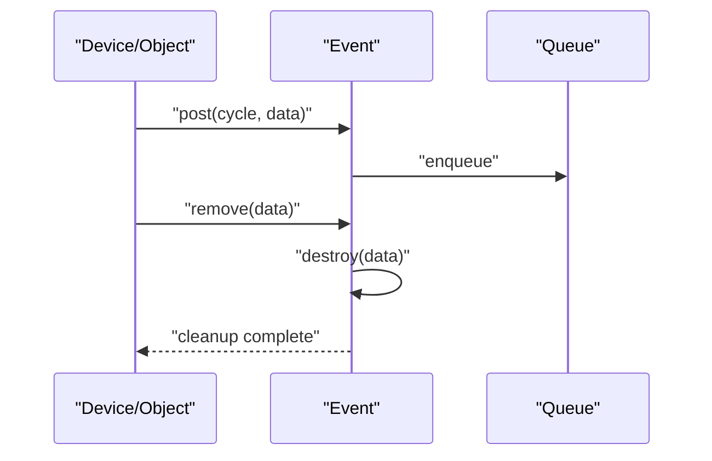
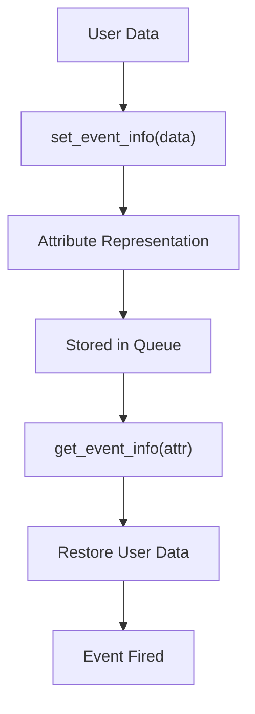
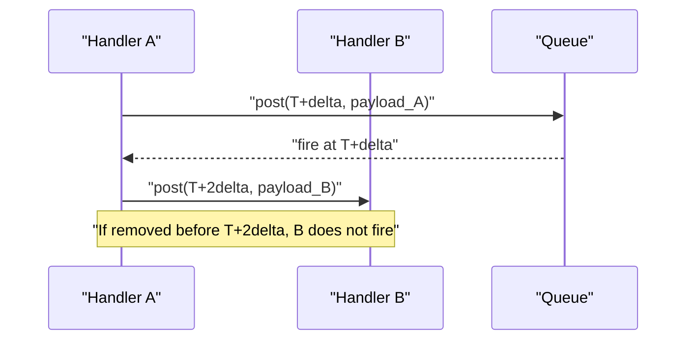
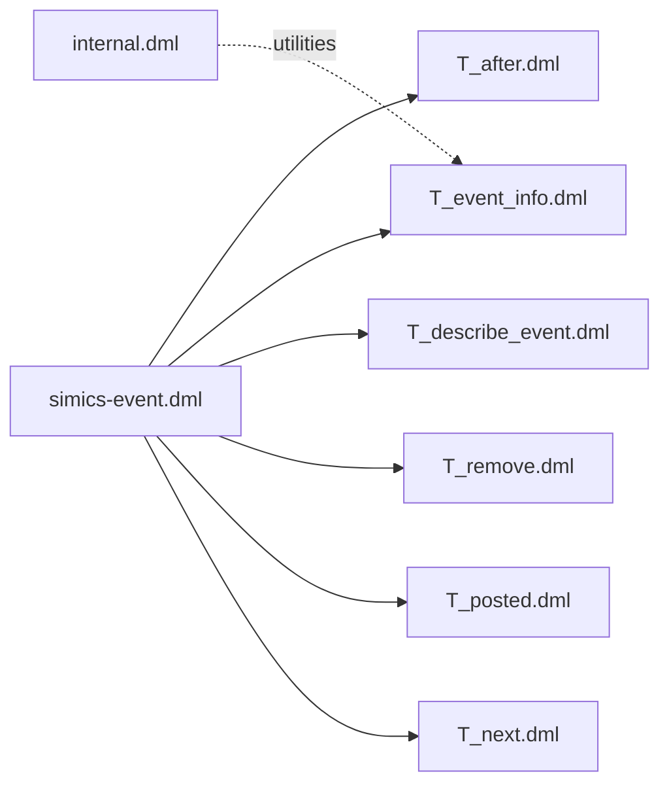

# Event System and Callbacks

<cite>
**Referenced Files in This Document**
- [simics-event.dml](file://lib/1.2/simics-event.dml)
- [T_after.dml](file://test/1.2/events/T_after.dml)
- [T_after.py](file://test/1.2/events/T_after.py)
- [T_event_info.dml](file://test/1.2/events/T_event_info.dml)
- [T_event_info.py](file://test/1.2/events/T_event_info.py)
- [T_describe_event.dml](file://test/1.2/events/T_describe_event.dml)
- [T_describe_event.py](file://test/1.2/events/T_describe_event.py)
- [T_remove.dml](file://test/1.2/events/T_remove.dml)
- [T_remove.py](file://test/1.2/events/T_remove.py)
- [T_posted.dml](file://test/1.2/events/T_posted.dml)
- [T_posted.py](file://test/1.2/events/T_posted.py)
- [T_next.dml](file://test/1.2/events/T_next.dml)
- [T_next.py](file://test/1.2/events/T_next.py)
- [T_after_cancel.dml](file://test/1.4/events/T_after_cancel.dml)
- [T_after_cancel.py](file://test/1.4/events/T_after_cancel.py)
- [internal.dml](file://lib/1.4/internal.dml)
</cite>

## Table of Contents
1. [Introduction](#introduction)
2. [Project Structure](#project-structure)
3. [Core Components](#core-components)
4. [Architecture Overview](#architecture-overview)
5. [Detailed Component Analysis](#detailed-component-analysis)
6. [Dependency Analysis](#dependency-analysis)
7. [Performance Considerations](#performance-considerations)
8. [Troubleshooting Guide](#troubleshooting-guide)
9. [Conclusion](#conclusion)
10. [Appendices](#appendices)

## Introduction
This document explains DML’s event system and callback mechanisms. It covers event definitions, posting, callback registration, timing and scheduling, event queues, ordering, synchronous/asynchronous handling, cancellation, chaining, hooks, filtering, transformation, event-driven programming patterns, state machines, reactive device behavior, debugging, performance, memory management, and integration with the Simics event system and timing mechanisms. The goal is to help both new and experienced users understand how to build reliable, efficient, and maintainable event-driven models in DML.

## Project Structure
The event system is primarily defined in library files and exercised through unit tests. The most relevant parts are:
- Library definitions for event interfaces and constants
- Test suites demonstrating event posting, inspection, removal, and lifecycle
- Additional tests showcasing cancellation and advanced workflows

**Diagram sources**
- [simics-event.dml](file://lib/1.2/simics-event.dml#L1-L10)
- [T_after.dml](file://test/1.2/events/T_after.dml#L1-L29)
- [T_event_info.dml](file://test/1.2/events/T_event_info.dml#L1-L59)
- [T_describe_event.dml](file://test/1.2/events/T_describe_event.dml#L1-L59)
- [T_remove.dml](file://test/1.2/events/T_remove.dml#L1-L54)
- [T_posted.dml](file://test/1.2/events/T_posted.dml#L1-L107)
- [T_next.dml](file://test/1.2/events/T_next.dml#L1-L53)
- [T_after_cancel.dml](file://test/1.4/events/T_after_cancel.dml)

**Section sources**
- [simics-event.dml](file://lib/1.2/simics-event.dml#L1-L10)

## Core Components
- Event definition and time base: Events are declared within device or template constructs and specify a time base (for example, cycles). They can carry user data pointers and expose lifecycle methods.
- Event posting: Events are posted to a queue associated with a timing source (for example, a clock object). Posting supports immediate or delayed execution depending on the time base and target time.
- Event lifecycle methods:
  - event: invoked when the scheduled time arrives
  - destroy: invoked when an event is removed or when posting fails
  - describe_event: optional description hook for diagnostics
  - set_event_info/get_event_info: optional hooks to transform user data into attributes and back
- Inspection APIs:
  - posted: checks whether a future event exists for a given data key
  - next: retrieves the next scheduled time for a given data key
  - remove: cancels a pending event matching a specific data payload

These capabilities enable robust event-driven modeling, including chaining, filtering, and transformation of event payloads.

**Section sources**
- [T_after.dml](file://test/1.2/events/T_after.dml#L10-L28)
- [T_event_info.dml](file://test/1.2/events/T_event_info.dml#L11-L39)
- [T_describe_event.dml](file://test/1.2/events/T_describe_event.dml#L8-L39)
- [T_remove.dml](file://test/1.2/events/T_remove.dml#L8-L20)
- [T_posted.dml](file://test/1.2/events/T_posted.dml#L25-L57)
- [T_next.dml](file://test/1.2/events/T_next.dml#L17-L49)

## Architecture Overview
The DML event system integrates with Simics timing and queues. Devices declare events and associate them with a queue (for example, a clock object). Events are scheduled with a target time according to the chosen time base. At the scheduled time, the event handler executes, optionally transforming or inspecting user data.

**Diagram sources**
- [T_after.dml](file://test/1.2/events/T_after.dml#L20-L28)
- [T_after.py](file://test/1.2/events/T_after.py#L4-L6)

## Detailed Component Analysis

### Event Definition and Lifecycle
- Events are declared inside device or template constructs and can be parameterized with a time base and optional description.
- Lifecycle methods:
  - event: executed when the event fires
  - destroy: cleanup hook for removed or failed-to-post events
  - describe_event: optional diagnostic description
  - set_event_info/get_event_info: optional hooks to convert user data to/from attributes

**Diagram sources**
- [T_event_info.dml](file://test/1.2/events/T_event_info.dml#L11-L39)
- [T_describe_event.dml](file://test/1.2/events/T_describe_event.dml#L8-L39)

**Section sources**
- [T_event_info.dml](file://test/1.2/events/T_event_info.dml#L11-L39)
- [T_describe_event.dml](file://test/1.2/events/T_describe_event.dml#L8-L39)

### Event Posting and Timing
- Events are posted to a queue associated with a timing source (for example, a clock object).
- Tests demonstrate posting with integer and floating-point times, and with and without user data.
- The queue is configured in the Python harness.

**Diagram sources**
- [T_after.dml](file://test/1.2/events/T_after.dml#L20-L28)
- [T_after.py](file://test/1.2/events/T_after.py#L4-L6)

**Section sources**
- [T_after.dml](file://test/1.2/events/T_after.dml#L20-L28)
- [T_after.py](file://test/1.2/events/T_after.py#L4-L6)

### Event Inspection: posted and next
- posted: checks if a future event exists for a given data key.
- next: returns the next scheduled time for a given data key; returns a sentinel value when none exists.

**Diagram sources**
- [T_posted.dml](file://test/1.2/events/T_posted.dml#L33-L57)
- [T_next.dml](file://test/1.2/events/T_next.dml#L26-L49)

**Section sources**
- [T_posted.dml](file://test/1.2/events/T_posted.dml#L25-L106)
- [T_posted.py](file://test/1.2/events/T_posted.py#L5-L7)
- [T_next.dml](file://test/1.2/events/T_next.dml#L17-L52)
- [T_next.py](file://test/1.2/events/T_next.py#L5-L7)

### Event Removal and Destruction
- remove cancels a pending event whose data matches the provided pointer.
- destroy is invoked when an event is removed or when posting fails.

**Diagram sources**
- [T_remove.dml](file://test/1.2/events/T_remove.dml#L30-L49)
- [T_remove.py](file://test/1.2/events/T_remove.py#L10-L25)

**Section sources**
- [T_remove.dml](file://test/1.2/events/T_remove.dml#L8-L49)
- [T_remove.py](file://test/1.2/events/T_remove.py#L9-L25)

### Event Description and Data Transformation
- describe_event allows customizing diagnostic descriptions for events.
- set_event_info/get_event_info allow transforming user data into attributes and back, enabling persistence and introspection across simulation steps.

**Diagram sources**
- [T_event_info.dml](file://test/1.2/events/T_event_info.dml#L17-L33)
- [T_describe_event.dml](file://test/1.2/events/T_describe_event.dml#L20-L38)

**Section sources**
- [T_event_info.dml](file://test/1.2/events/T_event_info.dml#L11-L59)
- [T_event_info.py](file://test/1.2/events/T_event_info.py#L10-L23)
- [T_describe_event.dml](file://test/1.2/events/T_describe_event.dml#L8-L59)
- [T_describe_event.py](file://test/1.2/events/T_describe_event.py#L9-L30)

### Synchronous vs Asynchronous Handling
- Synchronous: inline posting and immediate inspection occur within the same control flow.
- Asynchronous: posting occurs at a future time; handlers execute later when the queue reaches the target time.
- Tests demonstrate both patterns and confirm ordering and timing behavior.

**Section sources**
- [T_after.dml](file://test/1.2/events/T_after.dml#L20-L28)
- [T_after.py](file://test/1.2/events/T_after.py#L4-L6)
- [T_posted.dml](file://test/1.2/events/T_posted.dml#L33-L57)

### Event Chaining and Cancellation
- Chaining: an event handler can post subsequent events, creating sequences of actions.
- Cancellation: remove can cancel a pending event by matching its data payload.
- Tests show that removing a matching payload prevents the event from firing and trigger destroy.

**Diagram sources**
- [T_after.dml](file://test/1.2/events/T_after.dml#L20-L28)
- [T_remove.dml](file://test/1.2/events/T_remove.dml#L30-L49)

**Section sources**
- [T_after.dml](file://test/1.2/events/T_after.dml#L20-L28)
- [T_after_cancel.dml](file://test/1.4/events/T_after_cancel.dml)
- [T_after_cancel.py](file://test/1.4/events/T_after_cancel.py)

### Hook Systems, Filtering, and Transformation
- Hooks: describe_event, set_event_info/get_event_info provide extension points for diagnostics and serialization.
- Filtering: posted and next enable selective inspection and control of event flow.
- Transformation: set_event_info/get_event_info allow converting arbitrary user data into attributes and back, enabling persistence across simulation steps.

**Section sources**
- [T_describe_event.dml](file://test/1.2/events/T_describe_event.dml#L20-L38)
- [T_event_info.dml](file://test/1.2/events/T_event_info.dml#L17-L33)
- [T_posted.dml](file://test/1.2/events/T_posted.dml#L33-L57)
- [T_next.dml](file://test/1.2/events/T_next.dml#L26-L49)

### Event-Driven Programming Patterns and Reactive Behavior
- State machines: events drive transitions; handlers update state and schedule new events.
- Reactive behavior: devices react to posted events, adjusting internal state and generating further events.
- Tests demonstrate posting from attributes and chaining via handlers.

**Section sources**
- [T_after.dml](file://test/1.2/events/T_after.dml#L12-L28)
- [T_remove.dml](file://test/1.2/events/T_remove.dml#L13-L19)

## Dependency Analysis
- Event declarations depend on the Simics event interface constants (for example, cycle and step).
- Tests depend on the Python harness to configure queues and assert outcomes.
- Internal utilities (for example, vector macros) support low-level operations but are not core to the event API.

**Diagram sources**
- [simics-event.dml](file://lib/1.2/simics-event.dml#L8-L10)
- [T_after.dml](file://test/1.2/events/T_after.dml#L1-L29)
- [T_event_info.dml](file://test/1.2/events/T_event_info.dml#L1-L59)
- [T_describe_event.dml](file://test/1.2/events/T_describe_event.dml#L1-L59)
- [T_remove.dml](file://test/1.2/events/T_remove.dml#L1-L54)
- [T_posted.dml](file://test/1.2/events/T_posted.dml#L1-L107)
- [T_next.dml](file://test/1.2/events/T_next.dml#L1-L53)
- [internal.dml](file://lib/1.4/internal.dml#L11-L29)

**Section sources**
- [simics-event.dml](file://lib/1.2/simics-event.dml#L8-L10)
- [internal.dml](file://lib/1.4/internal.dml#L11-L29)

## Performance Considerations
- Minimize per-event overhead by batching or coalescing events when possible.
- Use posted and next to avoid redundant scheduling and to short-circuit unnecessary work.
- Prefer integer time bases for predictable ordering and lower conversion costs.
- Keep user data small and avoid expensive transformations in set_event_info/get_event_info.
- Avoid excessive nesting of chained events; prefer explicit state transitions to reduce complexity.

## Troubleshooting Guide
- Event not firing:
  - Verify the queue is set and the target time is reachable.
  - Use posted and next to confirm scheduling and timing.
- Event firing too early or late:
  - Confirm the time base and units match the queue configuration.
  - Check for unintended chaining or repeated posting.
- Event removal ineffective:
  - Ensure the data pointer passed to remove matches the posted data exactly.
  - Confirm the event has not yet fired.
- Diagnostics:
  - Implement describe_event to improve visibility into queued events.
  - Use set_event_info/get_event_info to persist and inspect event payloads across steps.

**Section sources**
- [T_posted.dml](file://test/1.2/events/T_posted.dml#L33-L57)
- [T_next.dml](file://test/1.2/events/T_next.dml#L26-L49)
- [T_describe_event.dml](file://test/1.2/events/T_describe_event.dml#L20-L38)
- [T_remove.dml](file://test/1.2/events/T_remove.dml#L42-L49)

## Conclusion
DML’s event system provides a powerful, flexible foundation for building reactive, state-machine-driven device models. By combining event definitions, precise timing, inspection APIs, and lifecycle hooks, developers can implement complex workflows with clear ordering guarantees and strong debugging support. Proper use of posted/next, remove, describe_event, and set_event_info/get_event_info enables efficient, maintainable, and observable event-driven designs integrated seamlessly with Simics timing mechanisms.

## Appendices

### Integration with Simics Event System and Timing Mechanisms
- Events are associated with a queue (for example, a clock object) and scheduled according to a time base.
- The Python harness configures the queue and drives simulation steps for verification.

**Section sources**
- [T_after.py](file://test/1.2/events/T_after.py#L4-L6)
- [T_event_info.py](file://test/1.2/events/T_event_info.py#L6-L18)
- [T_describe_event.py](file://test/1.2/events/T_describe_event.py#L6-L18)