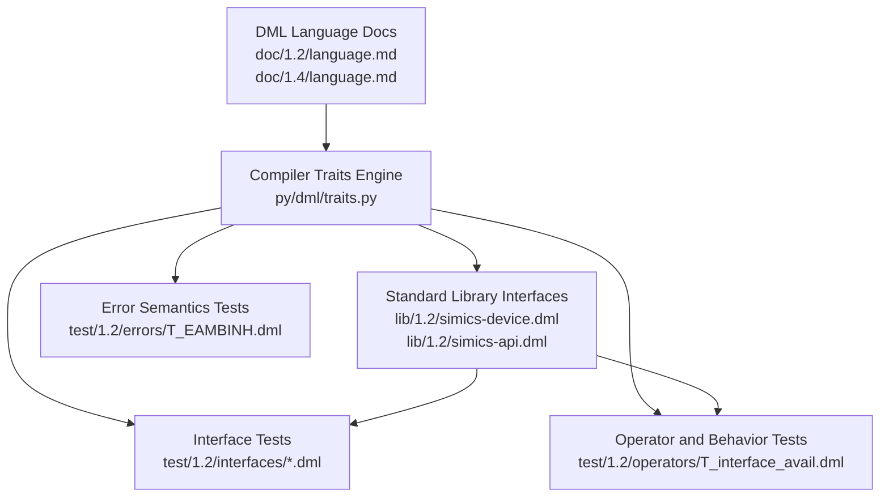
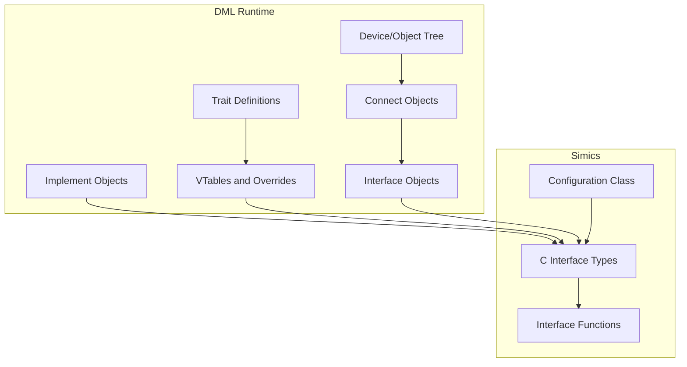
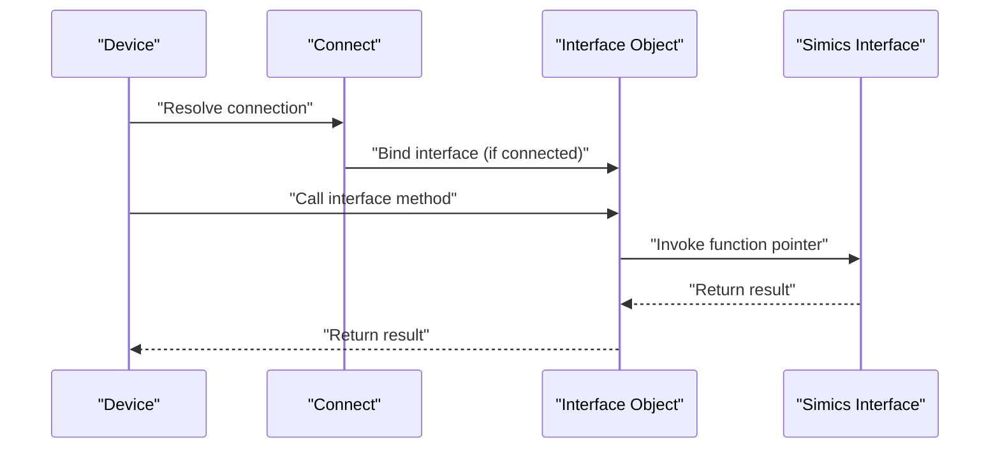
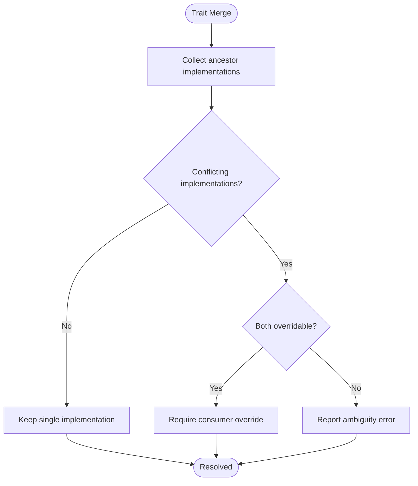
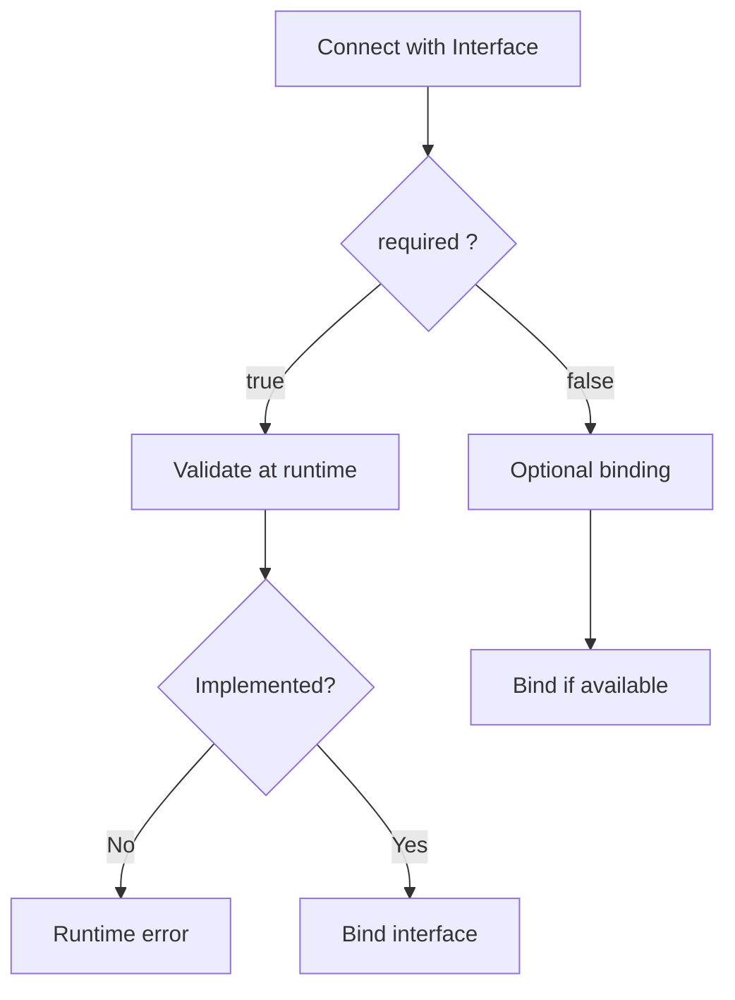
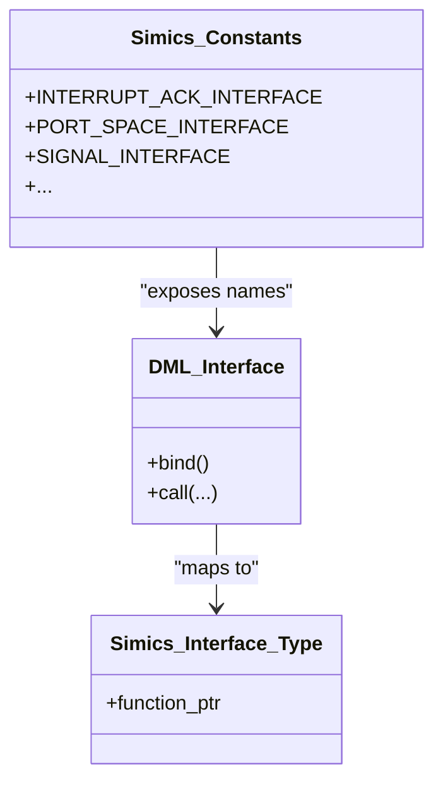
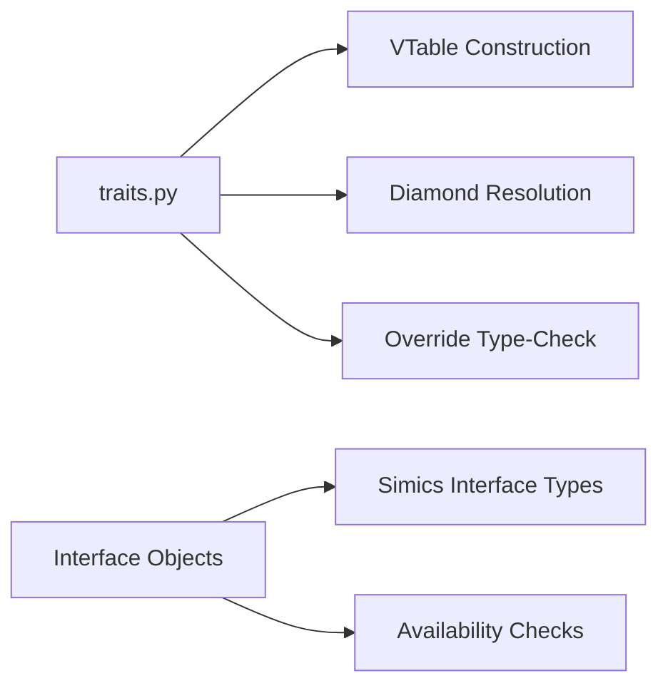

# Interface and Trait System

<cite>
**Referenced Files in This Document**
- [README.md](file://README.md)
- [language.md (DML 1.4)](file://doc/1.4/language.md)
- [language.md (DML 1.2)](file://doc/1.2/language.md)
- [traits.py](file://py/dml/traits.py)
- [provisional.py](file://py/dml/provisional.py)
- [simics-device.dml](file://lib/1.2/simics-device.dml)
- [simics-api.dml](file://lib/1.2/simics-api.dml)
- [T_implement.dml](file://test/1.2/interfaces/T_implement.dml)
- [T_iface_decl_1.dml](file://test/1.2/interfaces/T_iface_decl_1.dml)
- [T_call.dml](file://test/1.2/interfaces/T_call.dml)
- [T_interface_avail.dml](file://test/1.2/operators/T_interface_avail.dml)
- [T_EAMBINH.dml](file://test/1.2/errors/T_EAMBINH.dml)
</cite>

## Table of Contents
1. [Introduction](#introduction)
2. [Project Structure](#project-structure)
3. [Core Components](#core-components)
4. [Architecture Overview](#architecture-overview)
5. [Detailed Component Analysis](#detailed-component-analysis)
6. [Dependency Analysis](#dependency-analysis)
7. [Performance Considerations](#performance-considerations)
8. [Troubleshooting Guide](#troubleshooting-guide)
9. [Conclusion](#conclusion)
10. [Appendices](#appendices)

## Introduction
This document explains DML’s interface and trait system: how interfaces are defined and bound to Simics interfaces, how traits compose capabilities and resolve method overrides, and how runtime interface availability and configuration are handled. It covers:
- Interface definitions and connection semantics
- Trait-based composition and inheritance
- Diamond inheritance resolution and ambiguity detection
- Interface validation, implementation checking, and runtime binding
- Relationship to Simics interfaces and configuration parameters
- Debugging and error handling
- Provisional/experimental features

## Project Structure
The DML compiler and standard libraries are organized to support:
- Language documentation for DML 1.2 and 1.4
- Compiler infrastructure for traits and method resolution
- Standard library modules exposing Simics interfaces
- Tests validating interface declarations, availability, and implementation

**Diagram sources**
- [language.md (DML 1.4)](file://doc/1.4/language.md#L737-L788)
- [language.md (DML 1.2)](file://doc/1.2/language.md#L209-L211)
- [traits.py](file://py/dml/traits.py#L273-L386)
- [simics-device.dml](file://lib/1.2/simics-device.dml#L8-L17)
- [simics-api.dml](file://lib/1.2/simics-api.dml#L108-L116)
- [T_implement.dml](file://test/1.2/interfaces/T_implement.dml#L31-L34)
- [T_iface_decl_1.dml](file://test/1.2/interfaces/T_iface_decl_1.dml#L32-L38)
- [T_call.dml](file://test/1.2/interfaces/T_call.dml#L25-L33)
- [T_interface_avail.dml](file://test/1.2/operators/T_interface_avail.dml#L14-L27)
- [T_EAMBINH.dml](file://test/1.2/errors/T_EAMBINH.dml#L12-L23)

**Section sources**
- [README.md](file://README.md#L1-L117)
- [language.md (DML 1.4)](file://doc/1.4/language.md#L737-L788)
- [language.md (DML 1.2)](file://doc/1.2/language.md#L209-L211)

## Core Components
- Interfaces in DML:
  - Declared inside connect objects to bind to Simics interfaces.
  - Controlled by parameters such as required and configuration.
  - Accessed like C function calls on a typed interface object.
- Implements:
  - Export Simics interfaces from a device by defining methods matching the interface signature.
- Traits:
  - Composable units of capability with methods, parameters, sessions, and hooks.
  - Support inheritance, vtables, and method override/type-checking.
  - Resolve ambiguous overrides via a deterministic method resolution order.

Key implementation references:
- Interface declaration and usage in DML 1.4 docs
- Trait construction, vtables, and method override resolution in traits.py
- Simics interface constants and API exposure in simics-device.dml and simics-api.dml
- Interface availability checks and implementation tests

**Section sources**
- [language.md (DML 1.4)](file://doc/1.4/language.md#L737-L788)
- [traits.py](file://py/dml/traits.py#L273-L386)
- [simics-device.dml](file://lib/1.2/simics-device.dml#L8-L17)
- [simics-api.dml](file://lib/1.2/simics-api.dml#L108-L116)
- [T_implement.dml](file://test/1.2/interfaces/T_implement.dml#L31-L34)
- [T_iface_decl_1.dml](file://test/1.2/interfaces/T_iface_decl_1.dml#L32-L38)
- [T_call.dml](file://test/1.2/interfaces/T_call.dml#L25-L33)
- [T_interface_avail.dml](file://test/1.2/operators/T_interface_avail.dml#L14-L27)

## Architecture Overview
The DML interface/trait architecture connects:
- DML object model (device, ports, banks, registers) with Simics configuration objects
- Interface declarations inside connect objects to Simics interface function pointers
- Trait inheritance and method resolution to ensure unambiguous overrides

**Diagram sources**
- [language.md (DML 1.4)](file://doc/1.4/language.md#L737-L788)
- [language.md (DML 1.2)](file://doc/1.2/language.md#L209-L211)
- [traits.py](file://py/dml/traits.py#L689-L746)
- [simics-device.dml](file://lib/1.2/simics-device.dml#L8-L17)
- [simics-api.dml](file://lib/1.2/simics-api.dml#L108-L116)

## Detailed Component Analysis

### Interfaces in DML
- Declaring interfaces:
  - Inside connect objects to bind to Simics interfaces.
  - Parameters like required control whether a connection must implement the interface.
- Accessing interfaces:
  - Interface objects are typed and callable like C functions.
  - Interface availability can be checked using boolean context.
- Implementing interfaces:
  - implement blocks export methods that match the Simics interface signature.

**Diagram sources**
- [language.md (DML 1.4)](file://doc/1.4/language.md#L737-L788)
- [T_call.dml](file://test/1.2/interfaces/T_call.dml#L25-L33)
- [T_interface_avail.dml](file://test/1.2/operators/T_interface_avail.dml#L32-L45)

**Section sources**
- [language.md (DML 1.4)](file://doc/1.4/language.md#L737-L788)
- [T_implement.dml](file://test/1.2/interfaces/T_implement.dml#L31-L34)
- [T_iface_decl_1.dml](file://test/1.2/interfaces/T_iface_decl_1.dml#L32-L38)
- [T_call.dml](file://test/1.2/interfaces/T_call.dml#L25-L33)
- [T_interface_avail.dml](file://test/1.2/operators/T_interface_avail.dml#L14-L27)

### Trait System and Diamond Inheritance Resolution
- Traits define methods, parameters, sessions, and hooks.
- Vtables are constructed per trait, with ancestor vtables tracked.
- Method override type-checking enforces signature compatibility.
- Diamond inheritance resolution:
  - Merges implementations across ancestors.
  - Reports ambiguity when two unrelated traits provide implementations for the same method.
  - Requires explicit overrides in the consumer to disambiguate.

**Diagram sources**
- [traits.py](file://py/dml/traits.py#L429-L493)
- [traits.py](file://py/dml/traits.py#L535-L581)
- [T_EAMBINH.dml](file://test/1.2/errors/T_EAMBINH.dml#L12-L23)

**Section sources**
- [traits.py](file://py/dml/traits.py#L273-L386)
- [traits.py](file://py/dml/traits.py#L429-L493)
- [traits.py](file://py/dml/traits.py#L535-L581)
- [T_EAMBINH.dml](file://test/1.2/errors/T_EAMBINH.dml#L12-L23)

### Interface Parameters, Required vs Optional, and Configuration
- required parameter:
  - Controls whether a connection must implement the interface.
  - Runtime error if required interface is missing.
- configuration parameter:
  - Controls initialization and checkpointing behavior for connect and attributes.
- Interface availability:
  - Boolean context on interface objects to detect presence of an implementation.

**Diagram sources**
- [language.md (DML 1.4)](file://doc/1.4/language.md#L744-L751)
- [T_interface_avail.dml](file://test/1.2/operators/T_interface_avail.dml#L32-L45)

**Section sources**
- [language.md (DML 1.4)](file://doc/1.4/language.md#L744-L751)
- [T_interface_avail.dml](file://test/1.2/operators/T_interface_avail.dml#L14-L27)

### Relationship Between DML Interfaces and Simics Interfaces
- DML interface objects map to Simics interface types and function pointers.
- Constants for common Simics interfaces are exposed in simics-device.dml.
- simics-api.dml imports and re-exports Simics interface-related C APIs.

**Diagram sources**
- [simics-device.dml](file://lib/1.2/simics-device.dml#L8-L17)
- [simics-api.dml](file://lib/1.2/simics-api.dml#L108-L116)
- [language.md (DML 1.4)](file://doc/1.4/language.md#L737-L788)

**Section sources**
- [simics-device.dml](file://lib/1.2/simics-device.dml#L8-L17)
- [simics-api.dml](file://lib/1.2/simics-api.dml#L108-L116)

### Examples of Interface Hierarchies, Trait Combinations, and Device Modeling
- Interface-based device modeling:
  - Connects to external devices via interface objects.
  - Uses required vs optional interfaces to model robustness.
- Trait combinations:
  - Compose multiple traits to build capabilities.
  - Disambiguate conflicts by overriding methods in the consumer.

References:
- Interface declaration and usage in connect
- Implementing interfaces from external objects
- Trait inheritance and ambiguity tests

**Section sources**
- [T_iface_decl_1.dml](file://test/1.2/interfaces/T_iface_decl_1.dml#L32-L38)
- [T_implement.dml](file://test/1.2/interfaces/T_implement.dml#L31-L34)
- [T_EAMBINH.dml](file://test/1.2/errors/T_EAMBINH.dml#L12-L23)

## Dependency Analysis
- Traits depend on:
  - Method signatures and qualifiers (independent, startup, memoized)
  - Ancestor vtables and method implementation maps
  - Type-checking and override validation
- Interfaces depend on:
  - Simics interface constants and function pointer types
  - Runtime binding and availability checks

**Diagram sources**
- [traits.py](file://py/dml/traits.py#L273-L386)
- [traits.py](file://py/dml/traits.py#L387-L428)
- [language.md (DML 1.4)](file://doc/1.4/language.md#L737-L788)

**Section sources**
- [traits.py](file://py/dml/traits.py#L273-L386)
- [traits.py](file://py/dml/traits.py#L387-L428)
- [language.md (DML 1.4)](file://doc/1.4/language.md#L737-L788)

## Performance Considerations
- Trait vtables and method dispatch:
  - Deterministic method resolution avoids expensive dynamic dispatch.
  - Memoized independent methods reduce repeated computation.
- Interface binding:
  - Interface availability checks are lightweight boolean tests.
  - Function pointer indirection is minimal compared to interpreter overhead.

[No sources needed since this section provides general guidance]

## Troubleshooting Guide
Common issues and resolutions:
- Ambiguous trait overrides:
  - Symptom: EAMBINH errors when unrelated traits both provide implementations.
  - Resolution: Add an explicit override in the consuming trait/object.
- Required interface missing:
  - Symptom: Runtime error when connecting an object that does not implement a required interface.
  - Resolution: Ensure the connected object exports the required interface or mark the interface as optional.
- Interface availability checks:
  - Use boolean context on interface objects to guard calls safely.

**Section sources**
- [T_EAMBINH.dml](file://test/1.2/errors/T_EAMBINH.dml#L12-L23)
- [T_interface_avail.dml](file://test/1.2/operators/T_interface_avail.dml#L32-L45)
- [language.md (DML 1.4)](file://doc/1.4/language.md#L744-L751)

## Conclusion
DML’s interface and trait systems provide a robust, composable framework for device modeling:
- Interfaces bind cleanly to Simics interfaces with required/optional configuration.
- Traits enable modular composition with deterministic diamond inheritance resolution.
- Runtime safety is ensured via availability checks and explicit overrides.

[No sources needed since this section summarizes without analyzing specific files]

## Appendices

### Provisional and Experimental Features
- Provisional features are documented centrally and gated by feature tags.
- Examples include explicit parameter declarations and vector types based on Simics utilities.

**Section sources**
- [provisional.py](file://py/dml/provisional.py#L1-L148)