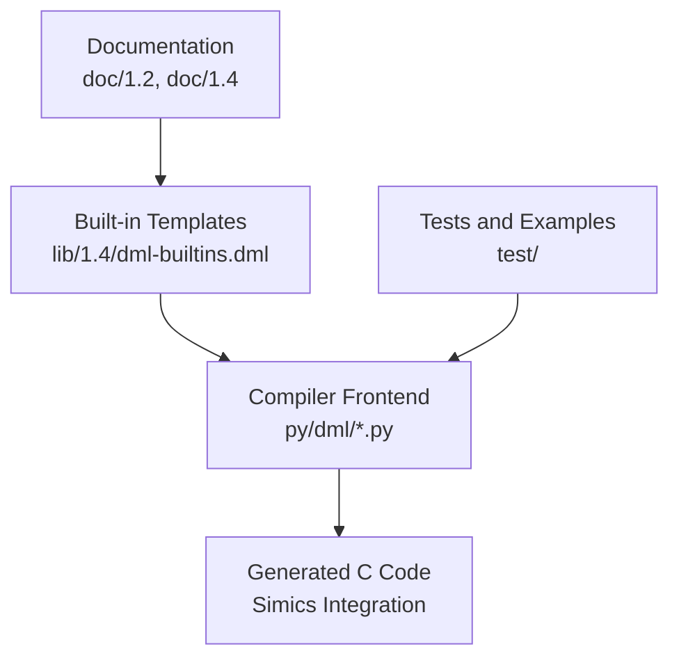
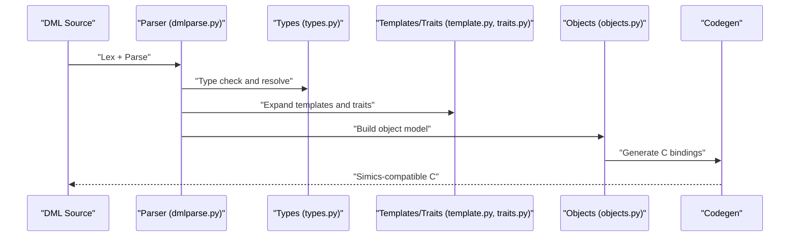
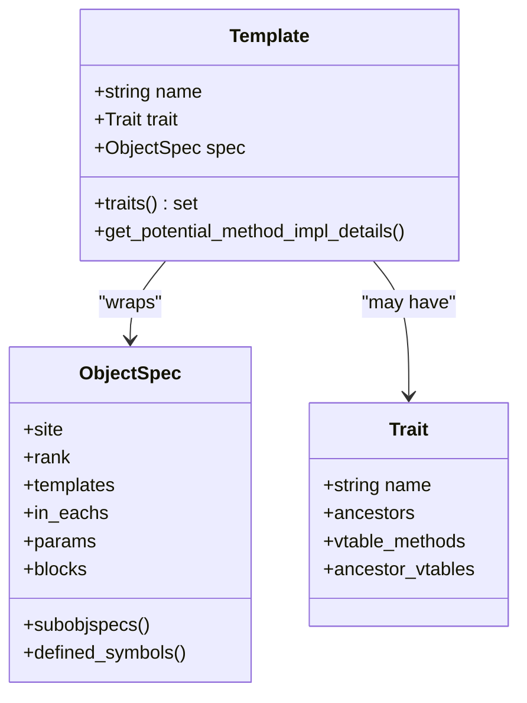
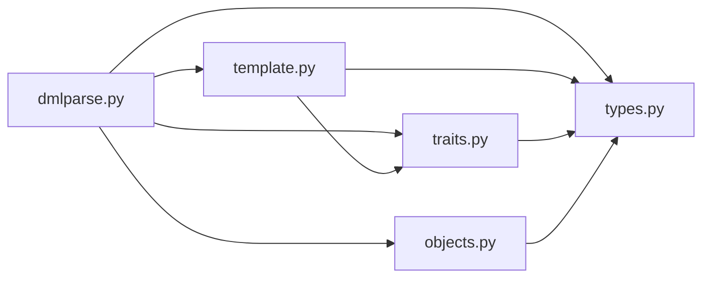

# Language Reference

<cite>
**Referenced Files in This Document**
- [README.md](file://README.md)
- [language.md (DML 1.4)](file://doc/1.4/language.md)
- [language.md (DML 1.2)](file://doc/1.2/language.md)
- [object-model.md (DML 1.2)](file://doc/1.2/object-model.md)
- [dml-builtins.dml (DML 1.4)](file://lib/1.4/dml-builtins.dml)
- [dml-builtins.dml (DML 1.2)](file://lib/1.2/dml-builtins.dml)
- [dmlparse.py](file://py/dml/dmlparse.py)
- [template.py](file://py/dml/template.py)
- [traits.py](file://py/dml/traits.py)
- [types.py](file://py/dml/types.py)
- [objects.py](file://py/dml/objects.py)
</cite>

## Table of Contents
1. [Introduction](#introduction)
2. [Project Structure](#project-structure)
3. [Core Components](#core-components)
4. [Architecture Overview](#architecture-overview)
5. [Detailed Component Analysis](#detailed-component-analysis)
6. [Dependency Analysis](#dependency-analysis)
7. [Performance Considerations](#performance-considerations)
8. [Troubleshooting Guide](#troubleshooting-guide)
9. [Conclusion](#conclusion)
10. [Appendices](#appendices)

## Introduction
This document is the comprehensive language reference for the Device Modeling Language (DML). It explains syntax structure, data types, control flow, expressions, declarations, object-oriented features, templates and traits, interfaces, events, register modeling, and integration with the underlying C code generation pipeline. It targets both newcomers and advanced users who need precise semantics and practical guidance for writing robust device models.

## Project Structure
The DML repository is organized into:
- Documentation: language and object model guides for DML 1.2 and 1.4
- Standard library: built-in templates and interfaces for device modeling
- Compiler implementation: Python-based frontend parsing, typing, templates, traits, and code generation
- Tests and examples: extensive regression suites and examples

**Section sources**
- [README.md](file://README.md#L1-L117)

## Core Components
This section summarizes the core language constructs and their roles in DML.

- Lexical structure and reserved words
- Module system and import semantics
- Source file structure: version, device declaration, and top-level statements
- Pragmas for compiler hints
- Object model: device, banks, registers, fields, attributes, connects, interfaces, implements, ports, events, groups
- Parameters: compile-time constants and overridable defaults
- Methods: input/output parameters, default methods, external methods, exception handling
- Data fields: local storage with initialization
- Templates and traits: reusable behavior, parameterization, inheritance, and method dispatch
- Interfaces and event definitions: typed callbacks and scheduling
- Register modeling: addressing, endianness, fields, and behavior templates
- C code generation integration: automatic bindings to Simics APIs

**Section sources**
- [language.md (DML 1.4)](file://doc/1.4/language.md#L35-L124)
- [language.md (DML 1.4)](file://doc/1.4/language.md#L126-L169)
- [language.md (DML 1.4)](file://doc/1.4/language.md#L198-L254)
- [language.md (DML 1.4)](file://doc/1.4/language.md#L255-L330)
- [language.md (DML 1.4)](file://doc/1.4/language.md#L331-L368)
- [language.md (DML 1.4)](file://doc/1.4/language.md#L369-L460)
- [language.md (DML 1.4)](file://doc/1.4/language.md#L460-L620)
- [language.md (DML 1.4)](file://doc/1.4/language.md#L628-L790)
- [language.md (DML 1.4)](file://doc/1.4/language.md#L790-L900)
- [object-model.md (DML 1.2)](file://doc/1.2/object-model.md#L31-L173)

## Architecture Overview
The DML compiler transforms DML source files into C code bound to Simics APIs. The process involves:
- Parsing with version-aware grammars
- Type checking and symbol resolution
- Template expansion and trait-based method dispatch
- Object model construction and validation
- Code generation targeting Simics interfaces

**Diagram sources**
- [dmlparse.py](file://py/dml/dmlparse.py#L50-L79)
- [types.py](file://py/dml/types.py#L120-L178)
- [template.py](file://py/dml/template.py#L139-L200)
- [traits.py](file://py/dml/traits.py#L35-L114)
- [objects.py](file://py/dml/objects.py#L31-L94)

**Section sources**
- [dmlparse.py](file://py/dml/dmlparse.py#L50-L79)
- [types.py](file://py/dml/types.py#L120-L178)
- [template.py](file://py/dml/template.py#L139-L200)
- [traits.py](file://py/dml/traits.py#L35-L114)
- [objects.py](file://py/dml/objects.py#L31-L94)

## Detailed Component Analysis

### Lexical Structure and Reserved Words
- Character encoding: UTF-8; non-ASCII only in comments and string literals
- Reserved words include C/C++ keywords plus DML-specific tokens
- Identifiers: C-like, with underscores; identifiers starting with underscore are reserved
- Constants: strings, characters, integers (decimal, hex, binary), floats, booleans
- Comments: C-style line and block comments

**Section sources**
- [language.md (DML 1.4)](file://doc/1.4/language.md#L35-L124)

### Module System and Imports
- Modules are DML files imported into a device model
- Import hierarchy affects override visibility
- Automatic idempotence; imported files must parse in isolation

**Section sources**
- [language.md (DML 1.4)](file://doc/1.4/language.md#L126-L169)

### Source File Structure
- Every model begins with a language version declaration
- Device declaration introduces the top-level device object
- Following statements include parameters, methods, data fields, and global declarations

**Section sources**
- [language.md (DML 1.4)](file://doc/1.4/language.md#L161-L196)

### Pragmas
- Compiler hints with pragma syntax
- Example: COVERITY pragma for analysis annotations

**Section sources**
- [language.md (DML 1.4)](file://doc/1.4/language.md#L198-L254)

### Object Model and Declarations
- Device structure and containment rules
- Object types: device, bank, register, field, attribute, connect, interface, implement, port, event, group
- Parameters: compile-time constants; can be overridden
- Methods: input/output parameters, default methods, external methods, exception handling
- Data fields: local storage with optional initialization
- Object declarations: type, name, extras, templates, description, and body

**Section sources**
- [object-model.md (DML 1.2)](file://doc/1.2/object-model.md#L31-L173)
- [language.md (DML 1.4)](file://doc/1.4/language.md#L331-L368)
- [language.md (DML 1.4)](file://doc/1.4/language.md#L369-L460)
- [language.md (DML 1.4)](file://doc/1.4/language.md#L460-L620)
- [language.md (DML 1.4)](file://doc/1.4/language.md#L628-L790)
- [language.md (DML 1.4)](file://doc/1.4/language.md#L790-L900)

### Data Types
- Integers: signed/unsigned bit-width types up to 64 bits
- Endian integers: fixed-size, aligned, and ordered variants
- Floating-point: double
- Booleans: true/false
- Arrays and pointers
- Structures and layouts: memory-mapped representations
- Bitfields: named bit ranges with configurable bit ordering

**Section sources**
- [language.md (DML 1.2)](file://doc/1.2/language.md#L306-L484)

### Control Flow and Expressions
- Operators and precedence derived from C with DML extensions
- Conditional, loops, and selection constructs
- Expression evaluation with strict typing and conversions

**Section sources**
- [dmlparse.py](file://py/dml/dmlparse.py#L22-L79)

### Templates and Traits
- Templates: reusable code blocks instantiated via is
- Parameterization: typed parameters and defaults
- Inheritance: template inheritance and rank-based precedence
- Traits: compile-time interfaces with virtual tables and method qualification
- Method dispatch: default vs. overridden implementations, memoization, and startup semantics

**Diagram sources**
- [template.py](file://py/dml/template.py#L139-L200)
- [template.py](file://py/dml/template.py#L64-L95)
- [traits.py](file://py/dml/traits.py#L138-L200)

**Section sources**
- [template.py](file://py/dml/template.py#L139-L200)
- [traits.py](file://py/dml/traits.py#L35-L114)

### Interfaces and Event Definitions
- Interfaces: typed contracts for connected objects
- Events: scheduled callbacks with time or step queues
- Typed hooks and message types for event-driven behavior

**Section sources**
- [language.md (DML 1.4)](file://doc/1.4/language.md#L737-L790)
- [traits.py](file://py/dml/traits.py#L95-L109)

### Register Modeling Constructs
- Banks, registers, fields, addressing, and endianness
- Behavior templates: read, write, read_only, unimplemented, and custom behavior
- Attributes and pseudo-attributes for checkpointing and inspection

**Section sources**
- [language.md (DML 1.4)](file://doc/1.4/language.md#L392-L620)
- [language.md (DML 1.4)](file://doc/1.4/language.md#L628-L790)

### Built-in Templates and Integration
- Universal templates: name, desc, documentation, limitations, init, post_init, destroy
- Object template: base parameters and methods
- Device template: class name, defaults, and lifecycle methods
- Standard library imports and Simics API bindings

**Section sources**
- [dml-builtins.dml (DML 1.4)](file://lib/1.4/dml-builtins.dml#L267-L600)
- [dml-builtins.dml (DML 1.4)](file://lib/1.4/dml-builtins.dml#L565-L900)
- [dml-builtins.dml (DML 1.2)](file://lib/1.2/dml-builtins.dml#L160-L200)

### C Code Generation and Simics Integration
- Automatic generation of Simics-compatible C code
- Generated bindings for device classes, attributes, interfaces, and callbacks
- Integration with io_memory, register_view, and instrumentation interfaces

**Section sources**
- [dml-builtins.dml (DML 1.4)](file://lib/1.4/dml-builtins.dml#L13-L28)
- [dml-builtins.dml (DML 1.4)](file://lib/1.4/dml-builtins.dml#L86-L171)

## Dependency Analysis
The DML compiler’s core modules depend on each other as follows:

**Diagram sources**
- [dmlparse.py](file://py/dml/dmlparse.py#L1-L20)
- [types.py](file://py/dml/types.py#L1-L51)
- [template.py](file://py/dml/template.py#L1-L22)
- [traits.py](file://py/dml/traits.py#L1-L23)
- [objects.py](file://py/dml/objects.py#L1-L11)

**Section sources**
- [dmlparse.py](file://py/dml/dmlparse.py#L1-L20)
- [types.py](file://py/dml/types.py#L1-L51)
- [template.py](file://py/dml/template.py#L1-L22)
- [traits.py](file://py/dml/traits.py#L1-L23)
- [objects.py](file://py/dml/objects.py#L1-L11)

## Performance Considerations
- Prefer shared methods and memoized traits to reduce code duplication
- Use templates judiciously; excessive template expansion increases generated code size
- Minimize complex in-each constructs and foreach loops in hot paths
- Favor read-only and simple templates for registers to simplify generated logic
- Keep parameter defaults localized to templates to avoid global overhead

[No sources needed since this section provides general guidance]

## Troubleshooting Guide
Common issues and diagnostics:
- Unknown or ambiguous identifiers: check symbol resolution and template scopes
- Type errors: verify operand compatibility and pointer constraints
- Template override conflicts: ensure rank precedence and avoid diamond inheritance without traits
- Event and connection validation: confirm interface availability and required connections
- Generated code size: leverage shared methods and review template usage patterns

**Section sources**
- [types.py](file://py/dml/types.py#L67-L118)
- [traits.py](file://py/dml/traits.py#L35-L114)
- [template.py](file://py/dml/template.py#L139-L200)

## Conclusion
DML provides a concise, expressive language for device modeling with strong object-oriented foundations, powerful templating, and seamless integration to Simics. Understanding the object model, templates, traits, and register constructs enables robust, maintainable device models. The compiler’s type system and template expansion ensure predictable code generation and efficient runtime behavior.

[No sources needed since this section summarizes without analyzing specific files]

## Appendices

### Appendix A: Operator Precedence and Associativity
Operator precedence and associativity are defined to mirror C with DML-specific additions.

**Section sources**
- [dmlparse.py](file://py/dml/dmlparse.py#L22-L79)

### Appendix B: Built-in Templates Index
Key built-in templates include universal templates (name, desc, documentation, limitations), lifecycle templates (init, post_init, destroy), and object templates (object, device). Refer to the built-in library for detailed signatures and usage.

**Section sources**
- [dml-builtins.dml (DML 1.4)](file://lib/1.4/dml-builtins.dml#L267-L600)
- [dml-builtins.dml (DML 1.4)](file://lib/1.4/dml-builtins.dml#L565-L900)