# Object-Oriented Programming Features

<cite>
**Referenced Files in This Document**
- [language.md](file://doc/1.2/language.md)
- [language.md](file://doc/1.4/language.md)
- [dml-builtins.dml](file://lib/1.2/dml-builtins.dml)
- [dml-builtins.dml](file://lib/1.4/dml-builtins.dml)
- [utility.dml](file://lib/1.2/utility.dml)
- [utility.dml](file://lib/1.4/utility.dml)
- [objects.py](file://py/dml/objects.py)
- [structure.py](file://py/dml/structure.py)
- [traits.py](file://py/dml/traits.py)
- [types.py](file://py/dml/types.py)
- [ctree.py](file://py/dml/ctree.py)
- [simics-types.dml](file://lib/1.2/simics-types.dml)
- [simics-configuration.dml](file://lib/1.2/simics-configuration.dml)
</cite>

## Table of Contents
1. [Introduction](#introduction)
2. [Project Structure](#project-structure)
3. [Core Components](#core-components)
4. [Architecture Overview](#architecture-overview)
5. [Detailed Component Analysis](#detailed-component-analysis)
6. [Dependency Analysis](#dependency-analysis)
7. [Performance Considerations](#performance-considerations)
8. [Troubleshooting Guide](#troubleshooting-guide)
9. [Conclusion](#conclusion)

## Introduction
This document explains DML’s object-oriented programming features with a focus on how objects are defined, composed, and orchestrated. It covers object definitions, hierarchies, composition patterns, inheritance and method override semantics, the object type system, polymorphism, method signatures and calling conventions, exception handling, attributes and state management, validation and type checking, and the relationship between DML objects and Simics configuration objects. The content is grounded in the DML language documentation and the Python compiler implementation that models DML’s object model.

## Project Structure
DML organizes device models as hierarchical object structures. The language documentation describes object types and rules; the built-in libraries define templates and default behaviors; the compiler’s Python implementation models the AST and object graph.

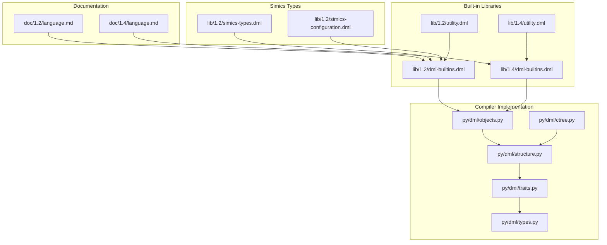

**Diagram sources**
- [language.md](file://doc/1.2/language.md#L1-L200)
- [language.md](file://doc/1.4/language.md#L1-L200)
- [dml-builtins.dml](file://lib/1.2/dml-builtins.dml#L1-L200)
- [dml-builtins.dml](file://lib/1.4/dml-builtins.dml#L1-L200)
- [utility.dml](file://lib/1.2/utility.dml#L1-L200)
- [utility.dml](file://lib/1.4/utility.dml#L1-L200)
- [objects.py](file://py/dml/objects.py#L1-L200)
- [structure.py](file://py/dml/structure.py#L1-L200)
- [traits.py](file://py/dml/traits.py#L1-L200)
- [types.py](file://py/dml/types.py#L1-L200)
- [ctree.py](file://py/dml/ctree.py#L1-L200)
- [simics-types.dml](file://lib/1.2/simics-types.dml#L1-L16)
- [simics-configuration.dml](file://lib/1.2/simics-configuration.dml#L1-L15)

**Section sources**
- [language.md](file://doc/1.2/language.md#L1-L200)
- [language.md](file://doc/1.4/language.md#L1-L200)

## Core Components
- Object model: DML models a device as a tree of objects (device, bank, register, field, attribute, connect, interface, port, subdevice, implement, event, group, session, saved, hook). Each object has a type and may contain child objects.
- Templates: Built-in templates provide default behaviors and can be instantiated to compose functionality. Examples include device, bank, register, attribute, and utility templates for read/write behaviors.
- Methods: Methods are object members with input/output parameters, optional exception handling, and optional qualifiers (e.g., nothrow, independent, startup, memoized).
- Parameters: Parameters are compile-time expressions that can be overridden; they describe static properties and can be typed or untyped.
- Attributes: Attributes expose device state to Simics, with get/set methods and configuration flags (required, optional, pseudo, none), persistence, and internal visibility.
- Composition: Objects are composed by instantiating templates and adding methods/parameters/data fields. Arrays of objects are supported with index variables.

**Section sources**
- [language.md](file://doc/1.2/language.md#L714-L800)
- [language.md](file://doc/1.4/language.md#L255-L330)
- [dml-builtins.dml](file://lib/1.2/dml-builtins.dml#L160-L390)
- [dml-builtins.dml](file://lib/1.4/dml-builtins.dml#L477-L563)
- [objects.py](file://py/dml/objects.py#L31-L120)

## Architecture Overview
DML’s object model is mapped to Simics configuration objects. The device object corresponds to a Simics configuration class; banks, registers, fields, attributes, connects, ports, subdevices, and implements map to Simics constructs. The compiler transforms DML declarations into code that binds these objects to Simics APIs.

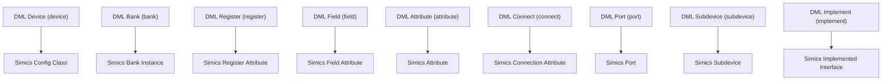

**Diagram sources**
- [language.md](file://doc/1.4/language.md#L285-L293)
- [dml-builtins.dml](file://lib/1.2/dml-builtins.dml#L322-L389)
- [dml-builtins.dml](file://lib/1.4/dml-builtins.dml#L796-L807)

## Detailed Component Analysis

### Object Definitions and Hierarchies
- Object types and containment rules are defined in the language docs. For example, device, bank, register, field, attribute, connect, interface, port, subdevice, implement, event, group are recognized object types with specific allowed parents and children.
- The compiler models these as classes and enforces allowed component types per parent.

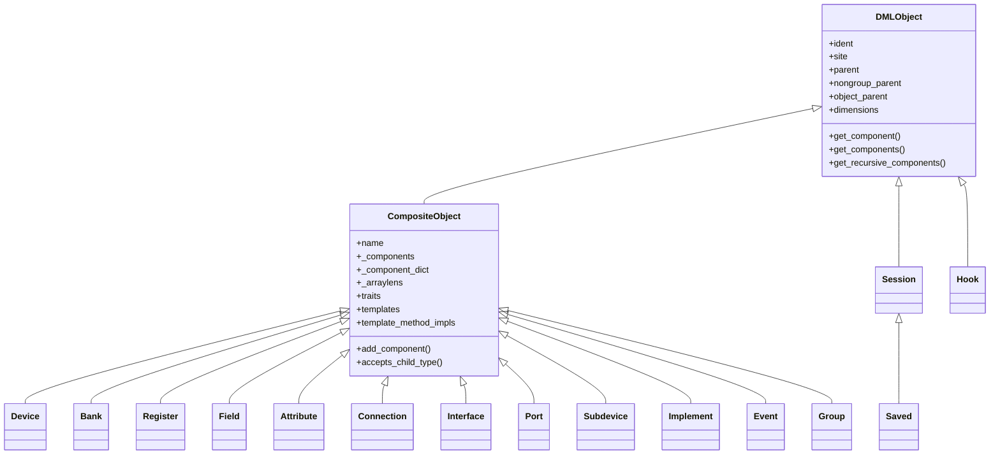

**Diagram sources**
- [objects.py](file://py/dml/objects.py#L31-L120)
- [objects.py](file://py/dml/objects.py#L194-L380)
- [objects.py](file://py/dml/objects.py#L317-L563)

**Section sources**
- [language.md](file://doc/1.2/language.md#L314-L330)
- [language.md](file://doc/1.4/language.md#L314-L330)
- [objects.py](file://py/dml/objects.py#L31-L120)

### Composition Patterns and Templates
- Templates provide reusable blocks of methods, parameters, and defaults. Built-in templates include device, bank, register, attribute, and many utility templates for read/write behaviors.
- Utility templates encapsulate common register/field behaviors (e.g., read_only, write_only, constant, reserved, ignore, unmapped, sticky, soft_reset_val).

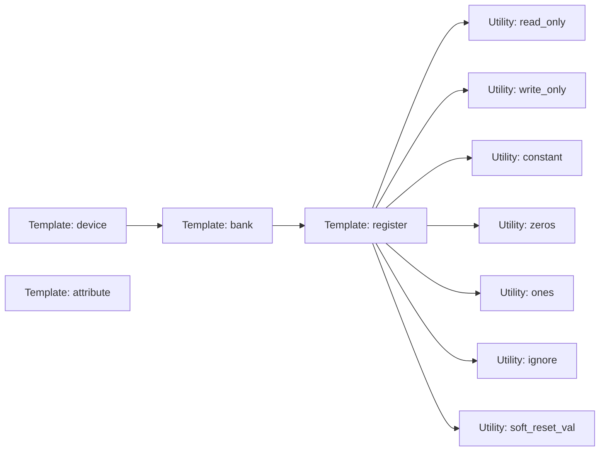

**Diagram sources**
- [dml-builtins.dml](file://lib/1.2/dml-builtins.dml#L199-L270)
- [dml-builtins.dml](file://lib/1.4/dml-builtins.dml#L611-L670)
- [utility.dml](file://lib/1.2/utility.dml#L114-L149)
- [utility.dml](file://lib/1.4/utility.dml#L434-L445)
- [utility.dml](file://lib/1.2/utility.dml#L165-L191)
- [utility.dml](file://lib/1.4/utility.dml#L467-L473)
- [utility.dml](file://lib/1.2/utility.dml#L365-L378)
- [utility.dml](file://lib/1.4/utility.dml#L638-L653)
- [utility.dml](file://lib/1.2/utility.dml#L425-L428)
- [utility.dml](file://lib/1.4/utility.dml#L700-L702)
- [utility.dml](file://lib/1.2/utility.dml#L447-L449)
- [utility.dml](file://lib/1.4/utility.dml#L723-L725)
- [utility.dml](file://lib/1.2/utility.dml#L465-L476)
- [utility.dml](file://lib/1.4/utility.dml#L740-L740)
- [utility.dml](file://lib/1.4/utility.dml#L363-L369)

**Section sources**
- [dml-builtins.dml](file://lib/1.2/dml-builtins.dml#L160-L390)
- [dml-builtins.dml](file://lib/1.4/dml-builtins.dml#L477-L563)
- [utility.dml](file://lib/1.2/utility.dml#L1-L200)
- [utility.dml](file://lib/1.4/utility.dml#L1-L200)

### Inheritance and Method Override Semantics
- Overridable built-in methods are defined by templates. A method can be overridden once by declaring a non-default method with the same signature in the same object.
- Resolution of overrides considers template instantiation and import hierarchy. Conflicting overrides produce errors if ambiguity cannot be resolved.
- Template-qualified method implementation calls allow invoking a specific template’s implementation even when unrelated templates provide competing implementations.

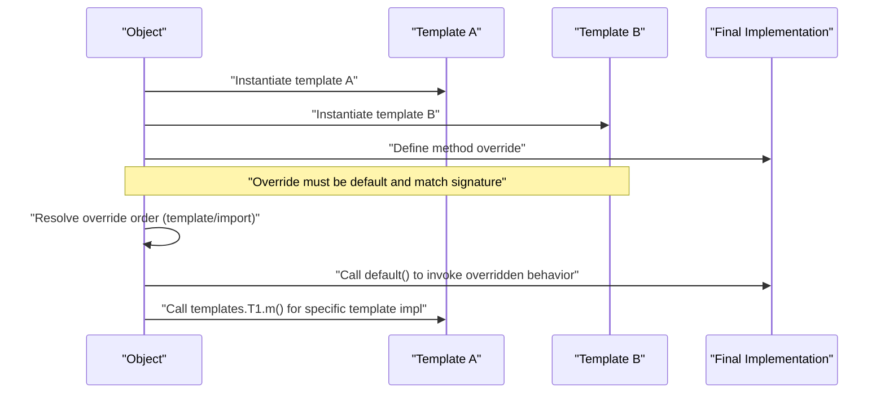

**Diagram sources**
- [language.md](file://doc/1.4/language.md#L1754-L1797)
- [language.md](file://doc/1.4/language.md#L3356-L3408)
- [structure.py](file://py/dml/structure.py#L1876-L1928)
- [ctree.py](file://py/dml/ctree.py#L4370-L4401)

**Section sources**
- [language.md](file://doc/1.4/language.md#L1754-L1797)
- [language.md](file://doc/1.4/language.md#L3356-L3408)
- [structure.py](file://py/dml/structure.py#L1876-L1928)
- [ctree.py](file://py/dml/ctree.py#L4370-L4401)

### Object Type System and Polymorphism
- DML supports typed parameters and methods with input/output parameters. Methods can be declared nothrow to allow expression-like invocation.
- Polymorphic behavior is achieved via macro-like methods (parameter types omitted) and template-based composition. Type checking compares signatures and qualifiers rigorously.

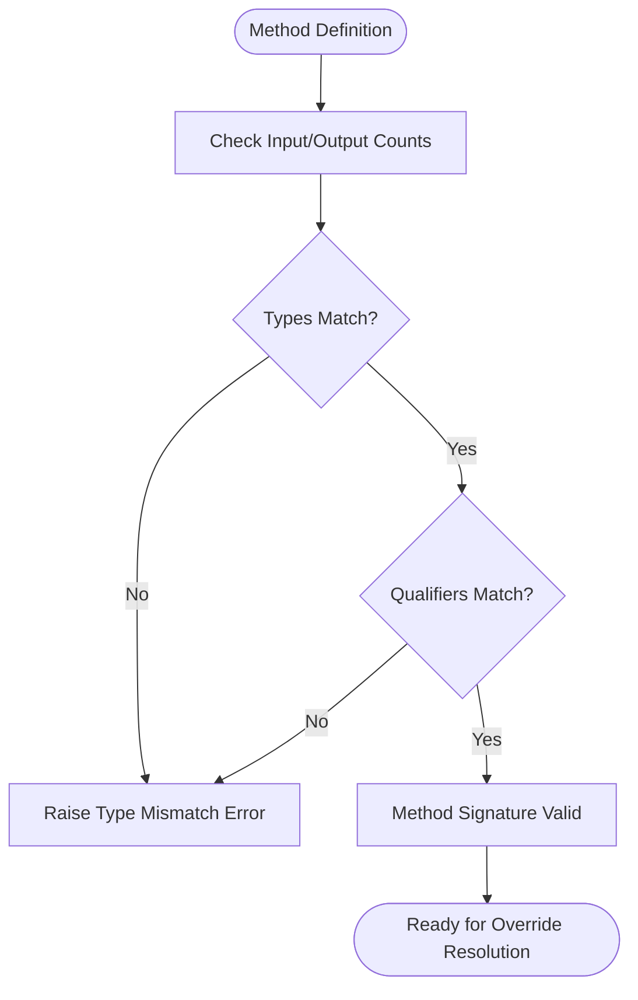

**Diagram sources**
- [traits.py](file://py/dml/traits.py#L387-L419)
- [types.py](file://py/dml/types.py#L977-L1010)

**Section sources**
- [language.md](file://doc/1.2/language.md#L551-L576)
- [traits.py](file://py/dml/traits.py#L387-L419)
- [types.py](file://py/dml/types.py#L977-L1010)

### Object Lifecycle, Instantiation, and Memory Management
- Device lifecycle includes init, post_init, and destroy. These are automatically invoked on objects implementing the respective templates. Destruction order is defined relative to parent-child relationships.
- Memory management: DML supports dynamic allocation/deallocation via new/delete operators. The destroy template provides a place to release resources not managed by the compiler.

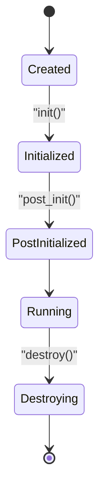

**Diagram sources**
- [dml-builtins.dml](file://lib/1.2/dml-builtins.dml#L247-L270)
- [dml-builtins.dml](file://lib/1.4/dml-builtins.dml#L664-L670)
- [language.md](file://doc/1.4/language.md#L420-L475)

**Section sources**
- [dml-builtins.dml](file://lib/1.2/dml-builtins.dml#L247-L270)
- [dml-builtins.dml](file://lib/1.4/dml-builtins.dml#L664-L670)
- [language.md](file://doc/1.4/language.md#L420-L475)

### Methods: Signatures, Parameters, Return Values, Exceptions
- Methods accept typed input parameters and return values via output parameters. They support exception handling with try/throw.
- Methods can be declared nothrow to allow expression-like calls. Qualifiers (independent, startup, memoized) influence execution semantics.

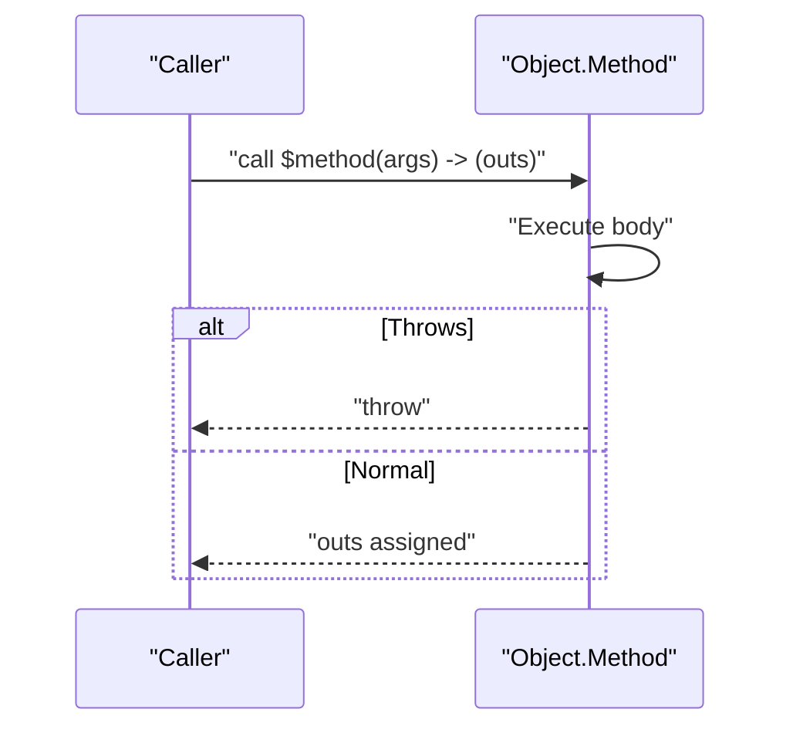

**Diagram sources**
- [language.md](file://doc/1.2/language.md#L486-L576)
- [language.md](file://doc/1.4/language.md#L1780-L1797)

**Section sources**
- [language.md](file://doc/1.2/language.md#L486-L576)
- [language.md](file://doc/1.4/language.md#L1780-L1797)

### Attributes, Properties, and State Management
- Attributes expose state to Simics with get/set methods. Parameters control configuration (required/optional/pseudo/none), persistence, and internal visibility.
- Built-in attribute templates provide default get/set implementations and integrate with Simics attribute registration.

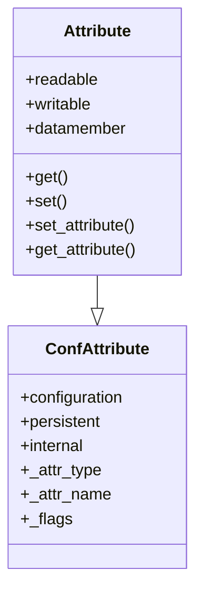

**Diagram sources**
- [dml-builtins.dml](file://lib/1.2/dml-builtins.dml#L286-L389)
- [dml-builtins.dml](file://lib/1.4/dml-builtins.dml#L713-L792)

**Section sources**
- [dml-builtins.dml](file://lib/1.2/dml-builtins.dml#L286-L389)
- [dml-builtins.dml](file://lib/1.4/dml-builtins.dml#L713-L792)

### Object Validation, Type Checking, and Runtime Behavior
- The compiler validates method signatures and qualifiers, ensuring input/output counts and types match. It also checks that overriding methods preserve qualifiers and types.
- Runtime behavior is enforced by templates and default methods. For example, bank read/write callbacks and register access methods are provided by built-in templates.

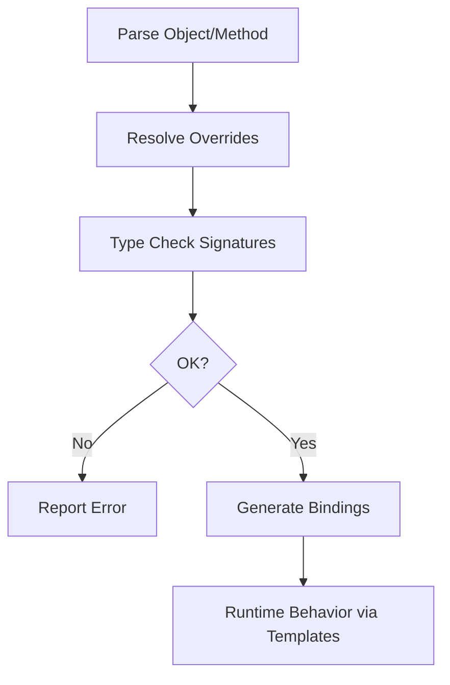

**Diagram sources**
- [traits.py](file://py/dml/traits.py#L387-L419)
- [structure.py](file://py/dml/structure.py#L1876-L1928)
- [dml-builtins.dml](file://lib/1.2/dml-builtins.dml#L448-L520)

**Section sources**
- [traits.py](file://py/dml/traits.py#L387-L419)
- [structure.py](file://py/dml/structure.py#L1876-L1928)
- [dml-builtins.dml](file://lib/1.2/dml-builtins.dml#L448-L520)

### Relationship Between DML Objects and Simics Configuration Objects
- The device object maps to a Simics configuration class. Banks, registers, fields, attributes, connects, ports, subdevices, and implements map to Simics constructs.
- Simics types and constants are declared in DML libraries to bridge types and interfaces.

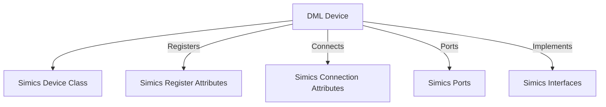

**Diagram sources**
- [language.md](file://doc/1.4/language.md#L285-L293)
- [simics-types.dml](file://lib/1.2/simics-types.dml#L13-L16)
- [simics-configuration.dml](file://lib/1.2/simics-configuration.dml#L8-L15)

**Section sources**
- [language.md](file://doc/1.4/language.md#L285-L293)
- [simics-types.dml](file://lib/1.2/simics-types.dml#L13-L16)
- [simics-configuration.dml](file://lib/1.2/simics-configuration.dml#L8-L15)

## Dependency Analysis
DML’s object model is implemented by a layered design: documentation defines semantics, built-in libraries provide templates, and the compiler enforces structure and type safety.

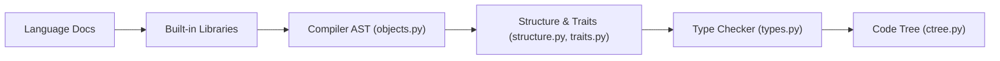

**Diagram sources**
- [language.md](file://doc/1.2/language.md#L1-L200)
- [dml-builtins.dml](file://lib/1.2/dml-builtins.dml#L1-L200)
- [objects.py](file://py/dml/objects.py#L1-L200)
- [structure.py](file://py/dml/structure.py#L1-L200)
- [traits.py](file://py/dml/traits.py#L1-L200)
- [types.py](file://py/dml/types.py#L1-L200)
- [ctree.py](file://py/dml/ctree.py#L1-L200)

**Section sources**
- [objects.py](file://py/dml/objects.py#L1-L200)
- [structure.py](file://py/dml/structure.py#L1-L200)
- [traits.py](file://py/dml/traits.py#L1-L200)
- [types.py](file://py/dml/types.py#L1-L200)
- [ctree.py](file://py/dml/ctree.py#L1-L200)

## Performance Considerations
- Template instantiation and method override resolution add compile-time overhead; minimize deep template hierarchies when performance is critical.
- Using nothrow methods enables expression-like calls and reduces overhead in hot paths.
- Avoid excessive dynamic allocations; prefer built-in attributes and registers for frequently accessed state.

## Troubleshooting Guide
Common issues and resolutions:
- Ambiguous method overrides: Ensure only one declaration overrides others; use template-qualified calls to disambiguate.
- Type mismatches: Verify input/output counts and types match; lenient typechecking can relax strictness in specific compat modes.
- Destruction timing: Avoid Simics interactions in destroy; rely on automatic cancellation of events before destroy is invoked.

**Section sources**
- [language.md](file://doc/1.4/language.md#L1754-L1797)
- [traits.py](file://py/dml/traits.py#L387-L419)
- [language.md](file://doc/1.4/language.md#L420-L475)

## Conclusion
DML’s object-oriented model provides a robust, template-driven framework for device modeling. The combination of typed methods, parameterized templates, and strict override/type checking yields predictable behavior and strong composability. The mapping to Simics configuration objects ensures seamless integration with the simulation environment, while lifecycle hooks and attributes enable precise state management and runtime behavior.