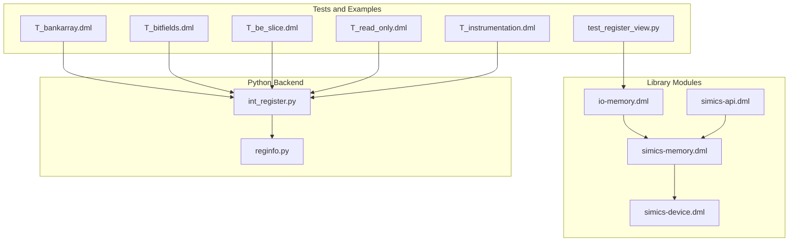
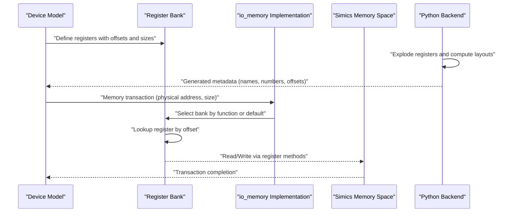
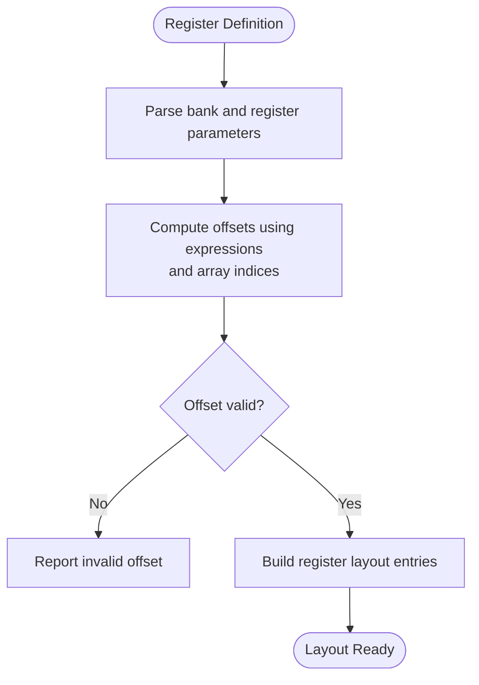
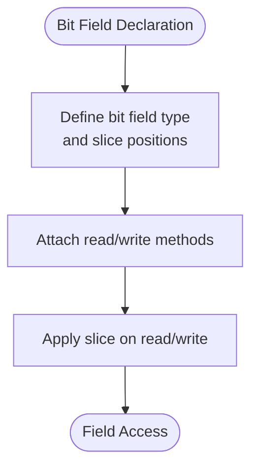
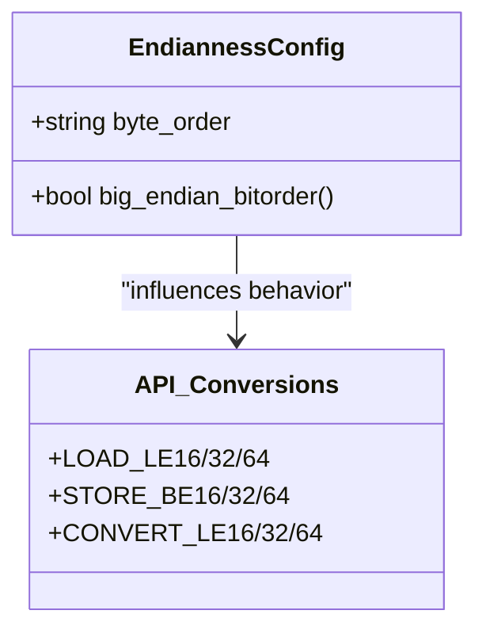
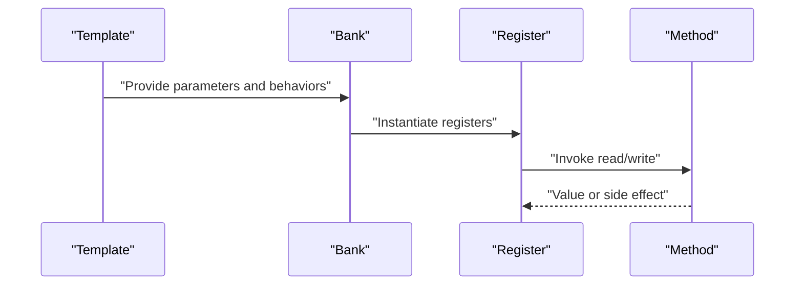
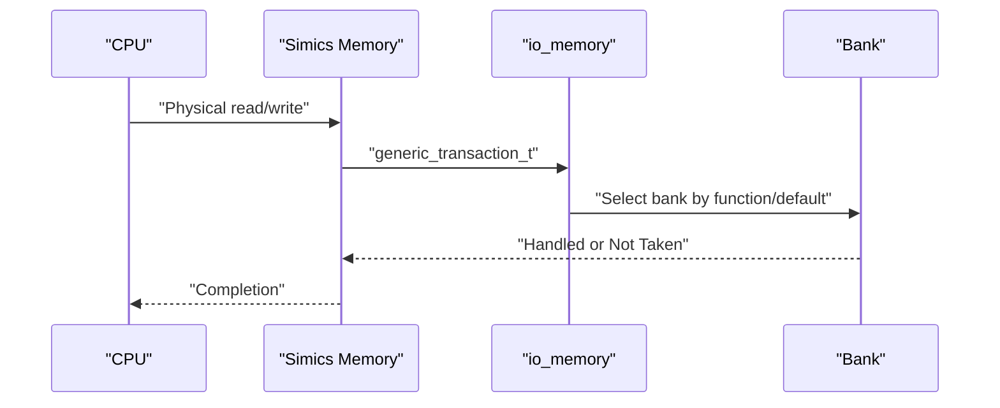
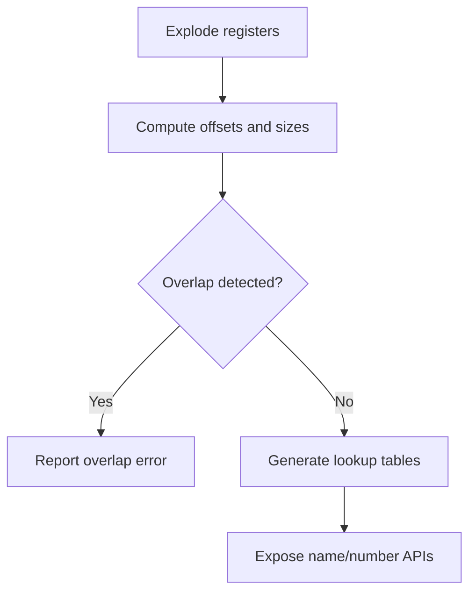
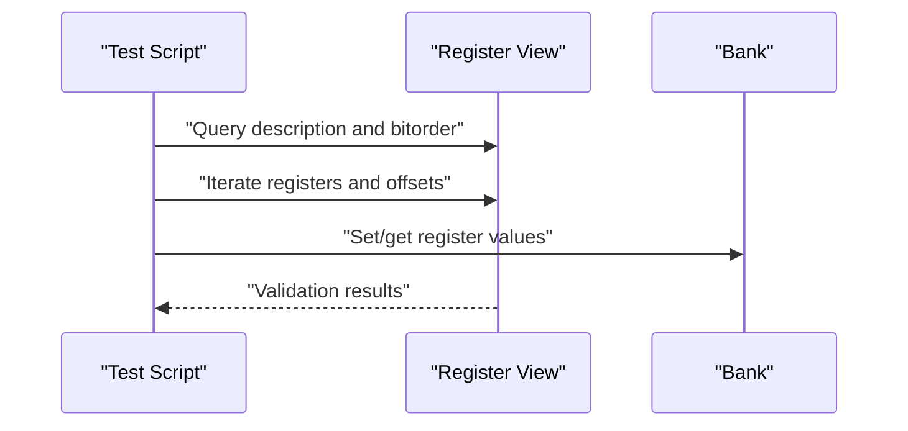
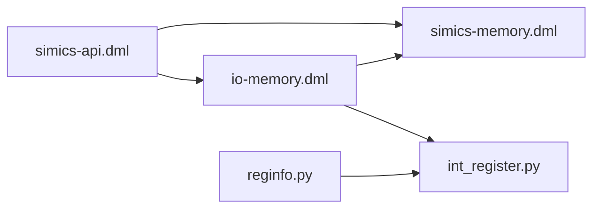

# Register Modeling and Memory Mapping

<cite>
**Referenced Files in This Document**
- [README.md](file://README.md)
- [io-memory.dml](file://lib/1.2/io-memory.dml)
- [simics-memory.dml](file://lib/1.2/simics-memory.dml)
- [simics-device.dml](file://lib/1.2/simics-device.dml)
- [simics-api.dml](file://lib/1.2/simics-api.dml)
- [int_register.py](file://py/dml/int_register.py)
- [reginfo.py](file://py/dml/reginfo.py)
- [T_bankarray.dml](file://test/1.2/registers/T_bankarray.dml)
- [T_register_desc.dml](file://test/1.2/registers/T_register_desc.dml)
- [T_read_only.dml](file://test/1.2/registers/T_read_only.dml)
- [T_instrumentation.dml](file://test/1.2/registers/T_instrumentation.dml)
- [T_bitfields.dml](file://test/1.2/layout/T_bitfields.dml)
- [T_be_slice.dml](file://test/1.2/registers/T_be_slice.dml)
- [T_byteorder.dml](file://test/1.2/registers/T_byteorder.dml)
- [test_register_view.py](file://test/common/test_register_view.py)
</cite>

## Table of Contents
1. [Introduction](#introduction)
2. [Project Structure](#project-structure)
3. [Core Components](#core-components)
4. [Architecture Overview](#architecture-overview)
5. [Detailed Component Analysis](#detailed-component-analysis)
6. [Dependency Analysis](#dependency-analysis)
7. [Performance Considerations](#performance-considerations)
8. [Troubleshooting Guide](#troubleshooting-guide)
9. [Conclusion](#conclusion)
10. [Appendices](#appendices)

## Introduction
This document explains DML’s register modeling and memory mapping capabilities as implemented in the repository. It covers register bank definitions, memory organization, address allocation, register declarations, size specifications, and offset assignments. It also documents bit field operations, endianness handling, field manipulation, register templates, read/write behaviors, and custom register implementations. The document further describes memory-mapped register simulation, access patterns, and instrumentation, and shows how the system integrates with the Simics memory system and register view interfaces.

## Project Structure
The repository organizes register and memory mapping support across:
- Library modules that define interfaces and constants for memory and device interactions
- Python backend code that generates register metadata and accessors
- Test suites that demonstrate register layouts, bit fields, endianness, and register views

**Diagram sources**
- [io-memory.dml](file://lib/1.2/io-memory.dml#L1-L50)
- [simics-memory.dml](file://lib/1.2/simics-memory.dml#L1-L29)
- [simics-device.dml](file://lib/1.2/simics-device.dml#L1-L18)
- [simics-api.dml](file://lib/1.2/simics-api.dml#L1-L131)
- [int_register.py](file://py/dml/int_register.py#L1-L208)
- [reginfo.py](file://py/dml/reginfo.py#L1-L217)
- [T_bankarray.dml](file://test/1.2/registers/T_bankarray.dml#L1-L35)
- [T_bitfields.dml](file://test/1.2/layout/T_bitfields.dml#L1-L42)
- [T_be_slice.dml](file://test/1.2/registers/T_be_slice.dml#L1-L67)
- [T_read_only.dml](file://test/1.2/registers/T_read_only.dml#L1-L53)
- [T_instrumentation.dml](file://test/1.2/registers/T_instrumentation.dml#L1-L81)
- [test_register_view.py](file://test/common/test_register_view.py#L1-L108)

**Section sources**
- [README.md](file://README.md#L1-L117)
- [io-memory.dml](file://lib/1.2/io-memory.dml#L1-L50)
- [simics-memory.dml](file://lib/1.2/simics-memory.dml#L1-L29)
- [simics-device.dml](file://lib/1.2/simics-device.dml#L1-L18)
- [simics-api.dml](file://lib/1.2/simics-api.dml#L1-L131)
- [int_register.py](file://py/dml/int_register.py#L1-L208)
- [reginfo.py](file://py/dml/reginfo.py#L1-L217)
- [T_bankarray.dml](file://test/1.2/registers/T_bankarray.dml#L1-L35)
- [T_bitfields.dml](file://test/1.2/layout/T_bitfields.dml#L1-L42)
- [T_be_slice.dml](file://test/1.2/registers/T_be_slice.dml#L1-L67)
- [T_read_only.dml](file://test/1.2/registers/T_read_only.dml#L1-L53)
- [T_instrumentation.dml](file://test/1.2/registers/T_instrumentation.dml#L1-L81)
- [test_register_view.py](file://test/common/test_register_view.py#L1-L108)

## Core Components
- Register bank definition and addressing: Banks declare registers with explicit offsets and sizes, supporting arrays and grouped registers.
- Bit field modeling: Typed bit field constructs enable precise field extraction and assignment with slice semantics.
- Endianness handling: Byte order is controlled per bank and influences register view and memory access conversions.
- Memory interface: The io_memory interface routes physical address transactions to the appropriate bank based on function or default bank selection.
- Register metadata generation: Python backend computes register layouts, detects overlaps, and produces lookup tables for register numbering and names.
- Instrumentation and validation: Tests exercise register mapping, overlapping detection, and register view queries.

**Section sources**
- [T_bankarray.dml](file://test/1.2/registers/T_bankarray.dml#L10-L35)
- [T_bitfields.dml](file://test/1.2/layout/T_bitfields.dml#L11-L28)
- [T_be_slice.dml](file://test/1.2/registers/T_be_slice.dml#L6-L48)
- [io-memory.dml](file://lib/1.2/io-memory.dml#L15-L49)
- [reginfo.py](file://py/dml/reginfo.py#L95-L154)
- [int_register.py](file://py/dml/int_register.py#L35-L208)
- [T_instrumentation.dml](file://test/1.2/registers/T_instrumentation.dml#L11-L81)

## Architecture Overview
The register modeling pipeline connects DML register definitions to runtime accessors and Simics interfaces.

**Diagram sources**
- [io-memory.dml](file://lib/1.2/io-memory.dml#L15-L49)
- [reginfo.py](file://py/dml/reginfo.py#L195-L217)
- [int_register.py](file://py/dml/int_register.py#L113-L208)

## Detailed Component Analysis

### Register Bank Definitions and Address Allocation
- Banks group registers and optionally parameterize function numbers for io_memory routing.
- Registers specify size and offset; arrays and nested groups expand into multiple instances with computed offsets.
- Offset computation supports dynamic expressions using bank and register indices.

**Diagram sources**
- [T_bankarray.dml](file://test/1.2/registers/T_bankarray.dml#L12-L30)
- [reginfo.py](file://py/dml/reginfo.py#L156-L184)

**Section sources**
- [T_bankarray.dml](file://test/1.2/registers/T_bankarray.dml#L10-L35)
- [reginfo.py](file://py/dml/reginfo.py#L95-L154)

### Bit Field Operations and Field Manipulation
- Bit fields are declared inside registers or typed bit field constructs, enabling slice-based read/write.
- Endianness affects how slices map to underlying bytes; big-endian vs little-endian banks alter expected bit ordering.
- Slice semantics allow extracting or assigning subranges during read/write methods.

**Diagram sources**
- [T_bitfields.dml](file://test/1.2/layout/T_bitfields.dml#L11-L28)
- [T_be_slice.dml](file://test/1.2/registers/T_be_slice.dml#L12-L48)

**Section sources**
- [T_bitfields.dml](file://test/1.2/layout/T_bitfields.dml#L11-L28)
- [T_be_slice.dml](file://test/1.2/registers/T_be_slice.dml#L6-L48)

### Endianness Handling and Field Ordering
- Endianness is configured per bank via a parameter; register view tests confirm big-endian vs little-endian behavior.
- API helpers provide load/store and conversion routines for aligned and unaligned data across endianness.

**Diagram sources**
- [T_instrumentation.dml](file://test/1.2/registers/T_instrumentation.dml#L58-L78)
- [simics-api.dml](file://lib/1.2/simics-api.dml#L40-L89)

**Section sources**
- [T_instrumentation.dml](file://test/1.2/registers/T_instrumentation.dml#L58-L78)
- [simics-api.dml](file://lib/1.2/simics-api.dml#L40-L89)

### Register Templates, Read/Write Behaviors, and Custom Implementations
- Templates encapsulate common register patterns; banks can inherit template parameters and override specifics.
- Read/write behaviors are implemented via methods attached to registers or fields; templates can predefine these behaviors.
- Custom register implementations can leverage numbered registers and lookup tables for dynamic access.

**Diagram sources**
- [T_bankarray.dml](file://test/1.2/registers/T_bankarray.dml#L12-L30)
- [T_read_only.dml](file://test/1.2/registers/T_read_only.dml#L10-L36)

**Section sources**
- [T_bankarray.dml](file://test/1.2/registers/T_bankarray.dml#L10-L35)
- [T_read_only.dml](file://test/1.2/registers/T_read_only.dml#L10-L53)

### Memory-Mapped Register Simulation and Access Patterns
- The io_memory interface routes generic transactions to the selected bank based on function or default bank.
- Access patterns include read/write of aligned or unaligned sizes; exceptions propagate when no handler takes the transaction.

**Diagram sources**
- [io-memory.dml](file://lib/1.2/io-memory.dml#L15-L49)
- [simics-memory.dml](file://lib/1.2/simics-memory.dml#L19-L29)

**Section sources**
- [io-memory.dml](file://lib/1.2/io-memory.dml#L15-L49)
- [simics-memory.dml](file://lib/1.2/simics-memory.dml#L19-L29)

### Register Metadata Generation and Lookup
- The Python backend explodes register arrays, computes offsets, and checks for overlaps.
- Generated tables support name-to-number and number-to-name lookups, enabling dynamic register access.

**Diagram sources**
- [reginfo.py](file://py/dml/reginfo.py#L195-L217)
- [int_register.py](file://py/dml/int_register.py#L35-L112)

**Section sources**
- [reginfo.py](file://py/dml/reginfo.py#L74-L154)
- [int_register.py](file://py/dml/int_register.py#L35-L112)

### Register View Interfaces and Validation
- Register view tests validate descriptions, bit order, number of registers, register info, and register values across banks.
- These tests confirm that register view APIs reflect the modeled layout and endianness.

**Diagram sources**
- [test_register_view.py](file://test/common/test_register_view.py#L8-L108)

**Section sources**
- [test_register_view.py](file://test/common/test_register_view.py#L8-L108)

## Dependency Analysis
- io_memory depends on bank selection and function parameters; it routes transactions to the correct bank.
- simics-memory defines interface constants used by io_memory and other memory-related modules.
- simics-api provides endianness conversion and load/store helpers used by register implementations.
- Python backend modules depend on DML object model to extract register metadata and generate C-side accessors.

**Diagram sources**
- [io-memory.dml](file://lib/1.2/io-memory.dml#L15-L49)
- [simics-memory.dml](file://lib/1.2/simics-memory.dml#L19-L29)
- [simics-api.dml](file://lib/1.2/simics-api.dml#L40-L89)
- [reginfo.py](file://py/dml/reginfo.py#L195-L217)
- [int_register.py](file://py/dml/int_register.py#L113-L208)

**Section sources**
- [io-memory.dml](file://lib/1.2/io-memory.dml#L15-L49)
- [simics-memory.dml](file://lib/1.2/simics-memory.dml#L19-L29)
- [simics-api.dml](file://lib/1.2/simics-api.dml#L40-L89)
- [reginfo.py](file://py/dml/reginfo.py#L195-L217)
- [int_register.py](file://py/dml/int_register.py#L113-L208)

## Performance Considerations
- Prefer compact register layouts with minimal gaps to reduce memory footprint and improve cache locality.
- Use templates to avoid duplicating read/write logic and to centralize endianness handling.
- Minimize dynamic lookups by leveraging generated tables and fixed offsets where possible.
- Keep field definitions aligned to natural boundaries to avoid extra masking/unmasking overhead.

## Troubleshooting Guide
Common issues and resolutions:
- Overlapping registers: The backend detects overlapping mapped or numbered registers and reports errors; adjust offsets or remove overlaps.
- Undefined offsets: Registers with undefined offsets are treated as unmapped; ensure offset expressions evaluate to constants or valid expressions.
- Invalid endianness parameter: Setting undefined byte order leads to errors; configure a valid endianness value.
- Register not found: Number/name lookup failures indicate missing registration or incorrect indices; verify register tables and indices.

**Section sources**
- [reginfo.py](file://py/dml/reginfo.py#L185-L194)
- [reginfo.py](file://py/dml/reginfo.py#L156-L184)
- [T_byteorder.dml](file://test/1.2/registers/T_byteorder.dml#L8-L12)
- [int_register.py](file://py/dml/int_register.py#L35-L112)

## Conclusion
DML provides a robust framework for modeling registers and memory-mapped I/O. Through explicit bank definitions, precise bit field constructs, and configurable endianness, models can accurately simulate hardware behavior. The Python backend ensures correct layout computation and dynamic access, while the io_memory interface integrates seamlessly with Simics. Together, these components enable efficient, validated, and instrumentable register simulations.

## Appendices

### Example Patterns and References
- Complex register layouts with arrays and groups: [T_bankarray.dml](file://test/1.2/registers/T_bankarray.dml#L12-L30)
- Bit field definitions and slicing: [T_bitfields.dml](file://test/1.2/layout/T_bitfields.dml#L11-L28), [T_be_slice.dml](file://test/1.2/registers/T_be_slice.dml#L12-L48)
- Read-only and pseudo registers: [T_read_only.dml](file://test/1.2/registers/T_read_only.dml#L10-L53)
- Instrumentation and endianness tests: [T_instrumentation.dml](file://test/1.2/registers/T_instrumentation.dml#L58-L78)
- Register view validation: [test_register_view.py](file://test/common/test_register_view.py#L8-L108)