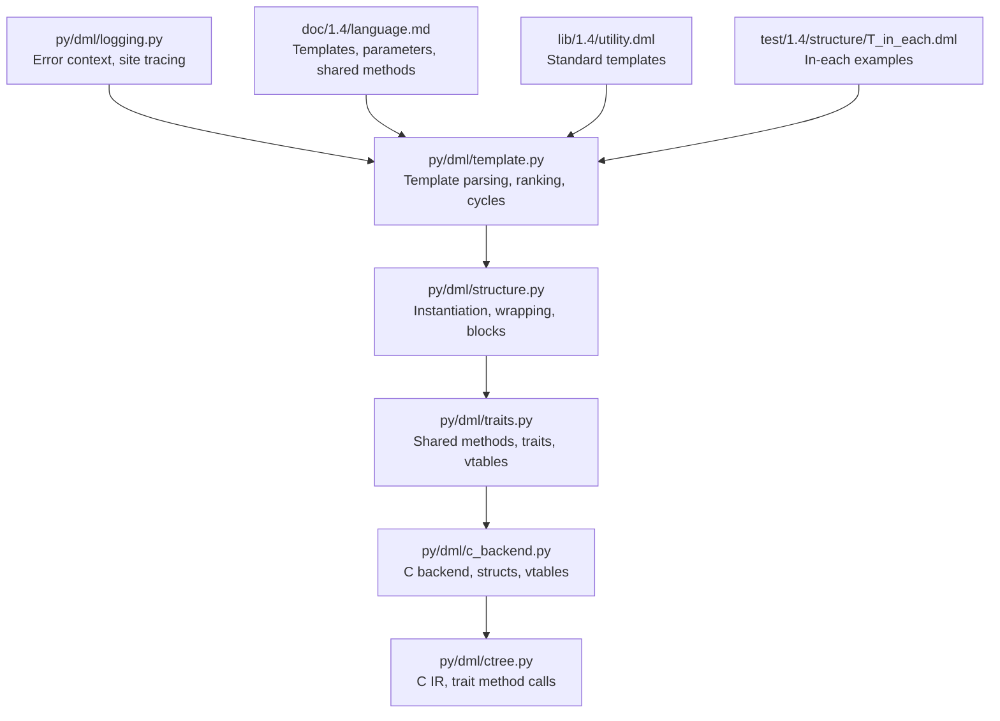
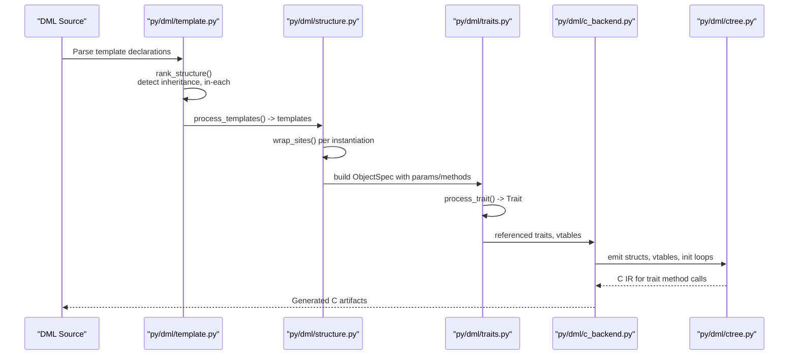
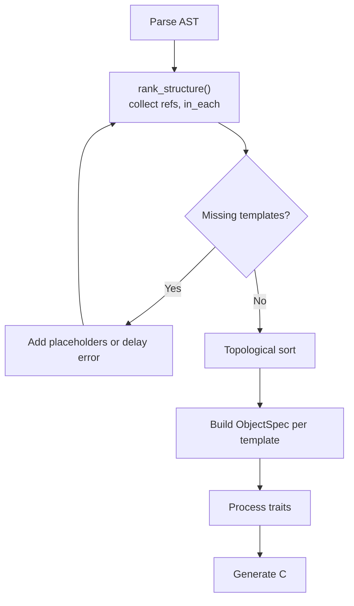
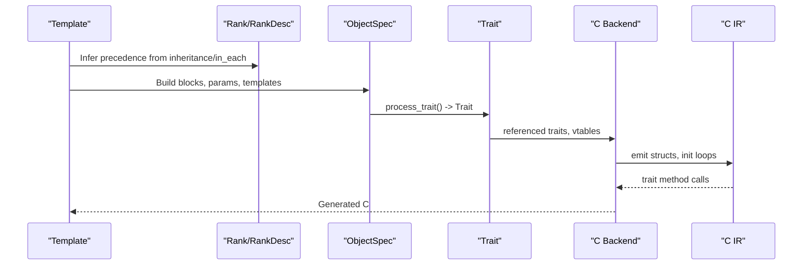
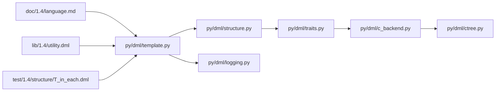
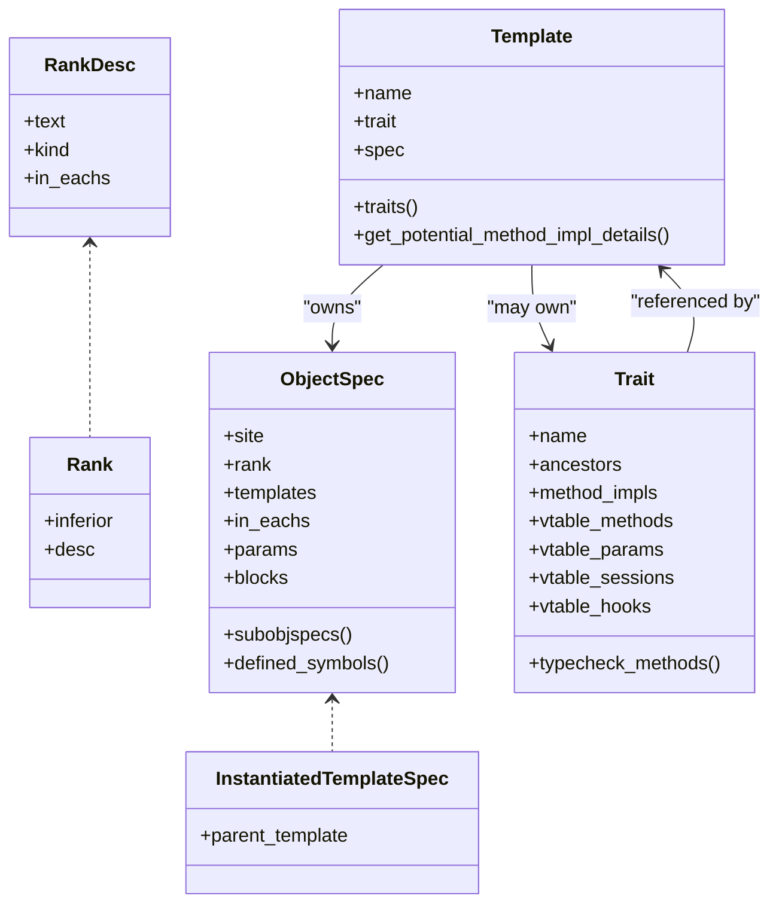

# Template System and Metaprogramming

<cite>
**Referenced Files in This Document**
- [template.py](file://py/dml/template.py)
- [structure.py](file://py/dml/structure.py)
- [traits.py](file://py/dml/traits.py)
- [slotsmeta.py](file://py/dml/slotsmeta.py)
- [c_backend.py](file://py/dml/c_backend.py)
- [ctree.py](file://py/dml/ctree.py)
- [logging.py](file://py/dml/logging.py)
- [language.md](file://doc/1.4/language.md)
- [utility.dml](file://lib/1.4/utility.dml)
- [T_in_each.dml](file://test/1.4/structure/T_in_each.dml)
</cite>

## Table of Contents
1. [Introduction](#introduction)
2. [Project Structure](#project-structure)
3. [Core Components](#core-components)
4. [Architecture Overview](#architecture-overview)
5. [Detailed Component Analysis](#detailed-component-analysis)
6. [Dependency Analysis](#dependency-analysis)
7. [Performance Considerations](#performance-considerations)
8. [Troubleshooting Guide](#troubleshooting-guide)
9. [Conclusion](#conclusion)
10. [Appendices](#appendices)

## Introduction
This document explains DML’s template system and metaprogramming capabilities. It covers template syntax, parameterization, instantiation, inheritance, specialization, composition, and the in-each iteration mechanism. It also documents template validation, dependency resolution, and the compilation pipeline that generates C code. Practical examples are drawn from the standard library and tests to illustrate complex template hierarchies, parameterized templates, and template-based device modeling. Guidance is provided for debugging, error reporting, and performance considerations.

## Project Structure
The template system spans several Python modules and documentation/test resources:
- Template parsing and ranking: py/dml/template.py
- Template instantiation and wrapping: py/dml/structure.py
- Traits and shared method semantics: py/dml/traits.py
- Code generation to C: py/dml/c_backend.py and py/dml/ctree.py
- Logging and error contexts: py/dml/logging.py
- Language documentation: doc/1.4/language.md
- Examples and standard templates: lib/1.4/utility.dml
- Tests for in-each behavior: test/1.4/structure/T_in_each.dml

**Diagram sources**
- [template.py](file://py/dml/template.py#L362-L433)
- [structure.py](file://py/dml/structure.py#L464-L524)
- [traits.py](file://py/dml/traits.py#L35-L114)
- [c_backend.py](file://py/dml/c_backend.py#L115-L200)
- [ctree.py](file://py/dml/ctree.py#L3079-L3098)
- [logging.py](file://py/dml/logging.py#L178-L218)
- [language.md](file://doc/1.4/language.md#L1100-L1280)
- [utility.dml](file://lib/1.4/utility.dml#L14-L200)
- [T_in_each.dml](file://test/1.4/structure/T_in_each.dml#L1-L168)

**Section sources**
- [template.py](file://py/dml/template.py#L1-L433)
- [structure.py](file://py/dml/structure.py#L460-L524)
- [traits.py](file://py/dml/traits.py#L1-L120)
- [c_backend.py](file://py/dml/c_backend.py#L115-L200)
- [ctree.py](file://py/dml/ctree.py#L3065-L3098)
- [logging.py](file://py/dml/logging.py#L178-L218)
- [language.md](file://doc/1.4/language.md#L1100-L1280)
- [utility.dml](file://lib/1.4/utility.dml#L14-L200)
- [T_in_each.dml](file://test/1.4/structure/T_in_each.dml#L1-L168)

## Core Components
- Template and ObjectSpec: Templates encapsulate a ranked specification of object statements, parameters, and nested template instantiations. ObjectSpec organizes shallow and composite declarations, preconditions, and in-each blocks.
- Ranking and Overrides: Rank and RankDesc encode precedence among template members and in-each scopes. This determines which method or parameter implementation wins during instantiation.
- Instantiation: wrap_sites clones template bodies, replacing sites with TemplateSite to preserve provenance and enable precise diagnostics.
- Traits and Shared Methods: Shared methods are compiled once per trait and bound via vtables. Traits unify method signatures and resolve ambiguous overrides.
- C Backend: Generates C structs, vtables, and initialization loops from DML templates and traits.

**Section sources**
- [template.py](file://py/dml/template.py#L64-L138)
- [structure.py](file://py/dml/structure.py#L464-L524)
- [traits.py](file://py/dml/traits.py#L35-L114)
- [c_backend.py](file://py/dml/c_backend.py#L115-L200)

## Architecture Overview
The template system transforms DML source into a ranked, instantiated object model, then compiles it to C with traits and vtables.

**Diagram sources**
- [template.py](file://py/dml/template.py#L362-L433)
- [structure.py](file://py/dml/structure.py#L464-L524)
- [traits.py](file://py/dml/traits.py#L35-L114)
- [c_backend.py](file://py/dml/c_backend.py#L2661-L2668)
- [ctree.py](file://py/dml/ctree.py#L3079-L3098)

## Detailed Component Analysis

### Template Syntax, Parameterization, and Instantiation
- Templates define a type with members: session/saved variables, typed parameters, shared methods, hooks, and inherited members.
- Parameters are typed or untyped, declared in templates and assigned or defaulted. They can be overridden at instantiation sites.
- Instantiation uses the is statement to inject template bodies into objects or other templates. The wrapper replaces original AST sites with TemplateSite to track provenance.

Key behaviors:
- Parameters declared without defaults must be assigned at instantiation or compilation fails.
- Shared methods are compiled once and accessed via the template type; they restrict accessible symbols to template members.

Examples and references:
- Template types and shared methods: [language.md](file://doc/1.4/language.md#L1111-L1223)
- Parameters: [language.md](file://doc/1.4/language.md#L1225-L1295)
- Instantiation with is: [language.md](file://doc/1.4/language.md#L288-L325)

**Section sources**
- [language.md](file://doc/1.4/language.md#L1111-L1295)
- [structure.py](file://py/dml/structure.py#L464-L524)

### Template Inheritance, Specialization, and Composition
- Inheritance is detected from is references and nested subobjects. The system builds a dependency graph and topologically sorts templates to ensure consistent processing order.
- Specialization occurs when a template overrides or specializes inherited members; ranking resolves conflicts.
- Composition combines multiple templates via is (A, B, ...), merging their specifications with precedence governed by Rank.

Processing highlights:
- rank_structure identifies references and unconditional references to allow dead-code instantiation under #if.
- process_templates validates missing templates, detects cycles, and constructs templates and traits.

**Diagram sources**
- [template.py](file://py/dml/template.py#L311-L360)
- [template.py](file://py/dml/template.py#L362-L433)

**Section sources**
- [template.py](file://py/dml/template.py#L311-L433)

### In-Each Iteration Mechanism
The in each statement iterates over template names and applies declarations within a scope. Declarations inside an in each block are overridden by declarations in the block that contains the in each statement. Nested in each statements are supported, with precedence determined by nesting order.

Highlights:
- in each bank/group/register/field applies scoped declarations.
- Conditions (#if/#else) inside in each can depend on parameters from outer scopes.
- Multiple in each targets can be combined: in each (group, foo, bar).

References:
- Behavior and precedence: [T_in_each.dml](file://test/1.4/structure/T_in_each.dml#L15-L168)
- Language reference: [language.md](file://doc/1.4/language.md#L1100-L1146)

**Section sources**
- [T_in_each.dml](file://test/1.4/structure/T_in_each.dml#L15-L168)
- [language.md](file://doc/1.4/language.md#L1100-L1146)

### Template Validation, Dependency Resolution, and Compilation Pipeline
Validation and resolution:
- Missing template references are reported or deferred depending on context.
- Cycles in template inheritance are detected and pruned to avoid infinite loops.
- Ranking ensures deterministic override behavior across templates and in-each scopes.

Compilation pipeline:
- ObjectSpec is constructed per template, including shallow and composite declarations.
- Traits unify method signatures and resolve ambiguous overrides.
- C backend emits C structs, vtables, and initialization routines. Trait method calls are generated via C IR.

**Diagram sources**
- [template.py](file://py/dml/template.py#L47-L63)
- [template.py](file://py/dml/template.py#L250-L309)
- [traits.py](file://py/dml/traits.py#L35-L114)
- [c_backend.py](file://py/dml/c_backend.py#L2661-L2668)
- [ctree.py](file://py/dml/ctree.py#L3079-L3098)

**Section sources**
- [template.py](file://py/dml/template.py#L362-L433)
- [traits.py](file://py/dml/traits.py#L273-L386)
- [c_backend.py](file://py/dml/c_backend.py#L2661-L2668)

### Template Metaprogramming Techniques, Compile-Time Computation, and Code Generation Patterns
- Shared methods enable compile-time shared code generation bound to template types.
- Parameters act as expression macros, enabling compile-time specialization and conditional logic via #if.
- in each enables declarative iteration and composition across object hierarchies.
- Traits unify method signatures and enforce type compatibility across template hierarchies.

Patterns:
- Parameter-driven specialization: use param with defaults and overrides to tailor behavior.
- Conditional composition: combine templates with is and guard with #if.
- Trait-based polymorphism: shared methods and vtables enable runtime-like dispatch with compile-time binding.

References:
- Shared methods and template types: [language.md](file://doc/1.4/language.md#L1170-L1223)
- Parameters and defaults: [language.md](file://doc/1.4/language.md#L1225-L1295)
- Standard templates: [utility.dml](file://lib/1.4/utility.dml#L14-L200)

**Section sources**
- [language.md](file://doc/1.4/language.md#L1170-L1295)
- [utility.dml](file://lib/1.4/utility.dml#L14-L200)

### Examples of Complex Template Hierarchies and Parameterized Templates
- Standard templates demonstrate composition and specialization patterns (e.g., reset behavior templates).
- in each tests show nested and combined targeting with precedence rules.

References:
- Reset templates and composition: [utility.dml](file://lib/1.4/utility.dml#L176-L197)
- in each precedence and nested scopes: [T_in_each.dml](file://test/1.4/structure/T_in_each.dml#L95-L168)

**Section sources**
- [utility.dml](file://lib/1.4/utility.dml#L176-L197)
- [T_in_each.dml](file://test/1.4/structure/T_in_each.dml#L95-L168)

### Relationship Between Templates and C Code Generation
- ObjectSpec drives struct and member emission; composite declarations are flattened into subobject specs.
- Traits generate vtables and method stubs; C IR emits trait method calls and downcasts.
- Initialization loops traverse nodes and call trait initialization routines.

References:
- Struct emission and compositing: [c_backend.py](file://py/dml/c_backend.py#L115-L200)
- Trait vtables and method calls: [traits.py](file://py/dml/traits.py#L138-L271), [ctree.py](file://py/dml/ctree.py#L3079-L3098)
- Initialization traversal: [c_backend.py](file://py/dml/c_backend.py#L2661-L2668)

**Section sources**
- [c_backend.py](file://py/dml/c_backend.py#L115-L200)
- [traits.py](file://py/dml/traits.py#L138-L271)
- [ctree.py](file://py/dml/ctree.py#L3079-L3098)
- [c_backend.py](file://py/dml/c_backend.py#L2661-L2668)

## Dependency Analysis
The template system exhibits tight coupling between parsing, ranking, instantiation, traits, and code generation. The following diagram shows key dependencies:

**Diagram sources**
- [template.py](file://py/dml/template.py#L362-L433)
- [structure.py](file://py/dml/structure.py#L464-L524)
- [traits.py](file://py/dml/traits.py#L35-L114)
- [c_backend.py](file://py/dml/c_backend.py#L2661-L2668)
- [ctree.py](file://py/dml/ctree.py#L3079-L3098)
- [logging.py](file://py/dml/logging.py#L178-L218)
- [language.md](file://doc/1.4/language.md#L1100-L1280)
- [utility.dml](file://lib/1.4/utility.dml#L14-L200)
- [T_in_each.dml](file://test/1.4/structure/T_in_each.dml#L1-L168)

**Section sources**
- [template.py](file://py/dml/template.py#L362-L433)
- [structure.py](file://py/dml/structure.py#L464-L524)
- [traits.py](file://py/dml/traits.py#L35-L114)
- [c_backend.py](file://py/dml/c_backend.py#L2661-L2668)
- [ctree.py](file://py/dml/ctree.py#L3079-L3098)
- [logging.py](file://py/dml/logging.py#L178-L218)
- [language.md](file://doc/1.4/language.md#L1100-L1280)
- [utility.dml](file://lib/1.4/utility.dml#L14-L200)
- [T_in_each.dml](file://test/1.4/structure/T_in_each.dml#L1-L168)

## Performance Considerations
- Shared methods reduce code duplication by compiling once per trait and sharing across instances.
- Topological sorting of templates ensures efficient processing order and avoids repeated passes.
- Ranking minimizes ambiguity and reduces backtracking in override resolution.
- in each scoping and precedence rules keep conditional logic localized, reducing unnecessary code generation.

[No sources needed since this section provides general guidance]

## Troubleshooting Guide
Common issues and diagnostics:
- Cycle detection in template inheritance: cycles are reported and offending templates are pruned.
- Missing template references: errors are reported or deferred depending on context.
- Parameter override conflicts: explicit_param_decls helps distinguish declarations vs. overrides.
- Site tracing: TemplateSite preserves instantiation provenance for precise error messages.

References:
- Cycle and missing template handling: [template.py](file://py/dml/template.py#L389-L406), [template.py](file://py/dml/template.py#L376-L388)
- Error context and site printing: [logging.py](file://py/dml/logging.py#L178-L218)
- Explicit parameter declarations: [language.md](file://doc/1.4/language.md#L1282-L1297)

**Section sources**
- [template.py](file://py/dml/template.py#L376-L406)
- [logging.py](file://py/dml/logging.py#L178-L218)
- [language.md](file://doc/1.4/language.md#L1282-L1297)

## Conclusion
DML’s template system provides a powerful metaprogramming foundation: templates define reusable types and behaviors, parameters enable compile-time specialization, and in each supports declarative iteration and composition. The system enforces robust validation and dependency resolution, and the compilation pipeline produces efficient C code with traits and vtables. Together, these features enable expressive, maintainable device modeling through templates.

[No sources needed since this section summarizes without analyzing specific files]

## Appendices

### Appendix A: Class Model for Templates and Traits

**Diagram sources**
- [template.py](file://py/dml/template.py#L24-L95)
- [template.py](file://py/dml/template.py#L139-L218)
- [traits.py](file://py/dml/traits.py#L689-L751)