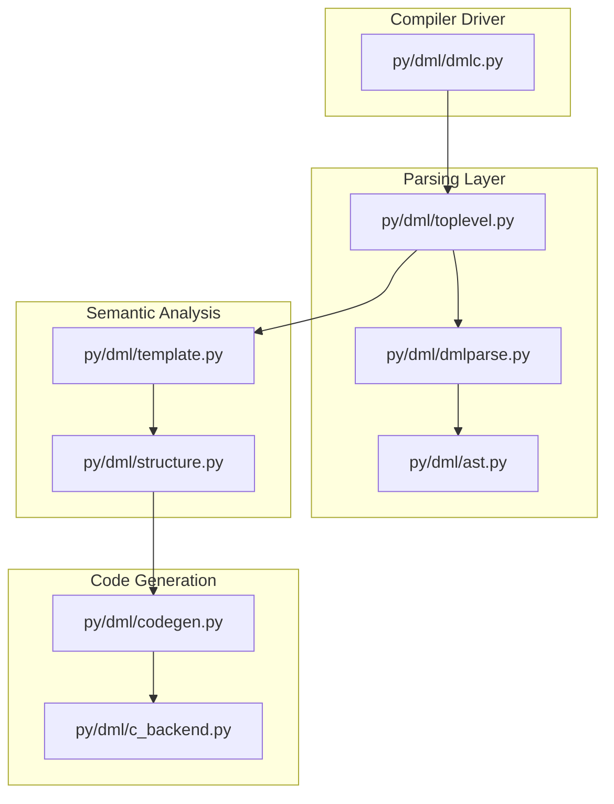
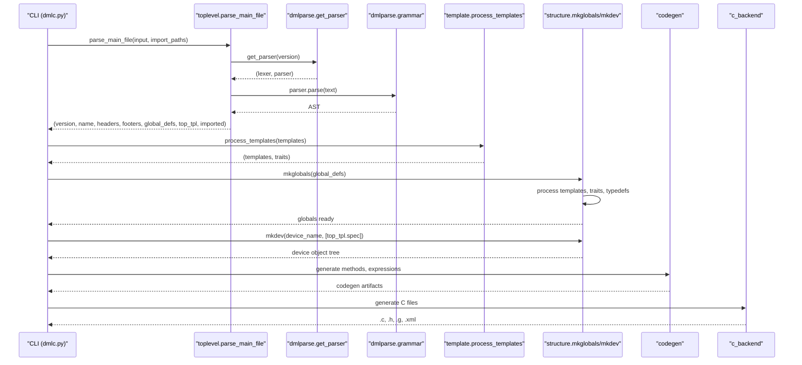
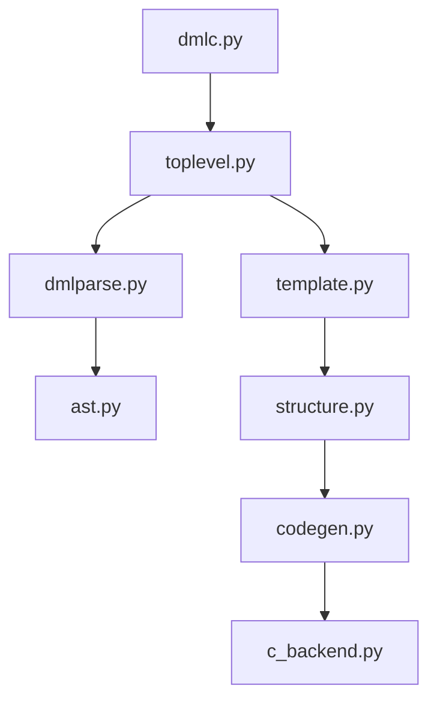

# Architecture Overview

<cite>
**Referenced Files in This Document**
- [dmlc.py](file://py/dml/dmlc.py)
- [toplevel.py](file://py/dml/toplevel.py)
- [dmlparse.py](file://py/dml/dmlparse.py)
- [ast.py](file://py/dml/ast.py)
- [template.py](file://py/dml/template.py)
- [structure.py](file://py/dml/structure.py)
- [codegen.py](file://py/dml/codegen.py)
- [c_backend.py](file://py/dml/c_backend.py)
</cite>

## Table of Contents
1. [Introduction](#introduction)
2. [Project Structure](#project-structure)
3. [Core Components](#core-components)
4. [Architecture Overview](#architecture-overview)
5. [Detailed Component Analysis](#detailed-component-analysis)
6. [Dependency Analysis](#dependency-analysis)
7. [Performance Considerations](#performance-considerations)
8. [Troubleshooting Guide](#troubleshooting-guide)
9. [Conclusion](#conclusion)

## Introduction
This document describes the architecture of the DML compiler system that transforms Device Modeling Language (DML) source code into optimized C code. The compiler is implemented in Python and follows a multi-stage pipeline:
- Parsing stage using PLY lex/yacc to convert DML text into an Abstract Syntax Tree (AST)
- Semantic analysis and template processing to resolve templates, traits, and object specifications
- Backend code generation targeting C, with extensibility for alternative backends
- Orchestration of stages through a central driver that coordinates parsing, semantic processing, and code emission

The document explains how the visitor pattern is used for AST traversal, how the strategy pattern enables multiple backends, and how template resolution integrates into the overall architecture.

## Project Structure
The compiler’s Python implementation is organized into cohesive modules:
- dmlc.py: Command-line driver and orchestrator for the entire pipeline
- toplevel.py: Top-level parsing, import resolution, and AST categorization
- dmlparse.py: Grammar definitions and PLY-based parser for DML 1.2 and 1.4
- ast.py: AST node representation and dispatcher for visitor-style traversal
- template.py: Template processing, ranking, and instantiation
- structure.py: Semantic analysis, type checking, and object tree construction
- codegen.py: Expression and statement code generation, failure handling, and method scheduling
- c_backend.py: C backend implementation for code emission

**Diagram sources**
- [dmlc.py](file://py/dml/dmlc.py#L309-L760)
- [toplevel.py](file://py/dml/toplevel.py#L48-L127)
- [dmlparse.py](file://py/dml/dmlparse.py#L50-L175)
- [ast.py](file://py/dml/ast.py#L7-L31)
- [template.py](file://py/dml/template.py#L362-L432)
- [structure.py](file://py/dml/structure.py#L74-L233)
- [codegen.py](file://py/dml/codegen.py#L28-L70)
- [c_backend.py](file://py/dml/c_backend.py#L1-L120)

**Section sources**
- [dmlc.py](file://py/dml/dmlc.py#L309-L760)
- [toplevel.py](file://py/dml/toplevel.py#L48-L127)
- [dmlparse.py](file://py/dml/dmlparse.py#L50-L175)
- [ast.py](file://py/dml/ast.py#L7-L31)
- [template.py](file://py/dml/template.py#L362-L432)
- [structure.py](file://py/dml/structure.py#L74-L233)
- [codegen.py](file://py/dml/codegen.py#L28-L70)
- [c_backend.py](file://py/dml/c_backend.py#L1-L120)

## Core Components
- AST and Visitor Pattern
  - AST nodes are lightweight containers with a kind, site, and arguments
  - A dispatcher maps node kinds to handler functions, enabling visitor-style traversal
- Parser and Grammar
  - PLY lex/yacc generates lexer/parser per DML version
  - Grammar productions construct AST nodes
- Template System
  - Templates are processed into ObjectSpecs with ranked precedence
  - Template instantiation and “in each” expansion drive object composition
- Semantic Analyzer
  - Global symbol collection, type declarations, and trait/type checking
  - Object tree construction and parameter/method merging
- Code Generator
  - Expression and statement generation, failure handling, and method scheduling
- C Backend
  - Emits C code, header files, and auxiliary artifacts
  - Supports split output and debuggable modes

**Section sources**
- [ast.py](file://py/dml/ast.py#L7-L31)
- [ast.py](file://py/dml/ast.py#L156-L172)
- [dmlparse.py](file://py/dml/dmlparse.py#L50-L175)
- [template.py](file://py/dml/template.py#L362-L432)
- [structure.py](file://py/dml/structure.py#L74-L233)
- [codegen.py](file://py/dml/codegen.py#L28-L70)
- [c_backend.py](file://py/dml/c_backend.py#L1-L120)

## Architecture Overview
The compiler orchestrates a linear pipeline:
1. Parse DML source into an AST
2. Expand imports and categorize top-level constructs
3. Process templates and build object specifications
4. Perform semantic analysis and type checking
5. Generate code via the selected backend(s)
6. Emit C artifacts and optional debug/info outputs

**Diagram sources**
- [dmlc.py](file://py/dml/dmlc.py#L676-L760)
- [toplevel.py](file://py/dml/toplevel.py#L359-L458)
- [dmlparse.py](file://py/dml/dmlparse.py#L48-L64)
- [template.py](file://py/dml/template.py#L362-L432)
- [structure.py](file://py/dml/structure.py#L74-L233)
- [codegen.py](file://py/dml/codegen.py#L28-L70)
- [c_backend.py](file://py/dml/c_backend.py#L1-L120)

## Detailed Component Analysis

### Parsing Layer (PLY Lex/Yacc)
- Version detection and grammar selection
- Lexer/parser creation per DML version
- Grammar productions construct AST nodes
- Extended site tracking for porting diagnostics

Key behaviors:
- Parser caching and tabmodule naming
- Deterministic version parsing with compatibility handling
- Site tracking for precise diagnostics

**Section sources**
- [toplevel.py](file://py/dml/toplevel.py#L48-L127)
- [toplevel.py](file://py/dml/toplevel.py#L114-L127)
- [dmlparse.py](file://py/dml/dmlparse.py#L50-L175)
- [dmlparse.py](file://py/dml/dmlparse.py#L92-L138)

### AST Construction and Visitor Pattern
- AST nodes encapsulate kind, site, and args
- Dispatcher maps node kinds to handlers for visitor traversal
- Enables modular extension of node processing

Implementation highlights:
- Node indexing and serialization support
- Dispatcher enforces correct handler naming and kind coverage

**Section sources**
- [ast.py](file://py/dml/ast.py#L7-L31)
- [ast.py](file://py/dml/ast.py#L156-L172)

### Template Processing and Object Specification
- Templates are transformed into ObjectSpecs with:
  - Ranked precedence via Rank/RankDesc
  - Conditional blocks flattened into preconditions
  - “in each” expansions and template instantiations
- process_templates builds template graph, resolves cycles, and attaches traits

Template instantiation:
- wrap_sites replaces sites to preserve provenance
- add_templates expands templates and “in each” constructs
- merge_parameters and merge_methods resolve precedence and overrides

**Section sources**
- [template.py](file://py/dml/template.py#L24-L95)
- [template.py](file://py/dml/template.py#L250-L310)
- [template.py](file://py/dml/template.py#L362-L432)
- [structure.py](file://py/dml/structure.py#L464-L576)
- [structure.py](file://py/dml/structure.py#L604-L709)

### Semantic Analysis and Object Tree Construction
- mkglobals collects constants, typedefs, externs, and templates
- process_templates and trait/type checking establish type ordering
- mkdev composes the device object tree from top-level template spec
- Unused symbol detection and warnings

Notable mechanisms:
- Type dependency sorting to satisfy C declaration order
- Method override type-checking and qualifier validation
- Compatibility flags controlling strictness and feature availability

**Section sources**
- [structure.py](file://py/dml/structure.py#L74-L233)
- [structure.py](file://py/dml/structure.py#L288-L390)
- [structure.py](file://py/dml/structure.py#L711-L799)
- [structure.py](file://py/dml/structure.py#L449-L463)

### Code Generation and Method Scheduling
- Code generator manages:
  - Failure handling contexts (NoFailure, LogFailure, CatchFailure, etc.)
  - Exit handlers and memoization strategies
  - Expression and statement generation
- Methods are queued and exported according to backend requirements

Key abstractions:
- Failure subclasses encapsulate different error-handling semantics
- Memoization helpers support independent and shared memoized methods
- Type sequence infos and after/on-hook artifacts

**Section sources**
- [codegen.py](file://py/dml/codegen.py#L149-L214)
- [codegen.py](file://py/dml/codegen.py#L215-L328)
- [codegen.py](file://py/dml/codegen.py#L316-L420)
- [codegen.py](file://py/dml/codegen.py#L420-L595)
- [codegen.py](file://py/dml/codegen.py#L595-L800)

### C Backend and Artifact Generation
- Generates C headers, prototypes, and device struct definitions
- Attribute registration, getters/setters, and connect registration
- Method wrappers, trait trampolines, and hook callbacks
- Optional split output and debuggable mode

Highlights:
- Struct definition emission with topological type ordering
- Guard macros and include guards
- Attribute documentation and flags
- State change notifications and checkpointed artifacts

**Section sources**
- [c_backend.py](file://py/dml/c_backend.py#L115-L223)
- [c_backend.py](file://py/dml/c_backend.py#L239-L373)
- [c_backend.py](file://py/dml/c_backend.py#L374-L504)
- [c_backend.py](file://py/dml/c_backend.py#L506-L676)
- [c_backend.py](file://py/dml/c_backend.py#L677-L800)

### Compiler Orchestration in dmlc.py
- Parses CLI options, sets global flags, and initializes compatibility
- Invokes toplevel.parse_main_file to obtain AST and metadata
- Processes templates and constructs device object tree
- Generates C output and optional info/debug artifacts
- Supports dependency file generation and input bundling

**Section sources**
- [dmlc.py](file://py/dml/dmlc.py#L309-L760)

## Dependency Analysis
The modules exhibit clear layering:
- dmlc.py depends on toplevel, template, structure, and backends
- toplevel depends on dmlparse and ast
- template and structure depend on ast and codegen
- c_backend depends on codegen, structure, and ctree

**Diagram sources**
- [dmlc.py](file://py/dml/dmlc.py#L11-L25)
- [toplevel.py](file://py/dml/toplevel.py#L17-L26)
- [dmlparse.py](file://py/dml/dmlparse.py#L11-L16)
- [ast.py](file://py/dml/ast.py#L4-L6)
- [template.py](file://py/dml/template.py#L8-L14)
- [structure.py](file://py/dml/structure.py#L13-L37)
- [codegen.py](file://py/dml/codegen.py#L14-L26)
- [c_backend.py](file://py/dml/c_backend.py#L15-L28)

**Section sources**
- [dmlc.py](file://py/dml/dmlc.py#L11-L25)
- [toplevel.py](file://py/dml/toplevel.py#L17-L26)
- [dmlparse.py](file://py/dml/dmlparse.py#L11-L16)
- [ast.py](file://py/dml/ast.py#L4-L6)
- [template.py](file://py/dml/template.py#L8-L14)
- [structure.py](file://py/dml/structure.py#L13-L37)
- [codegen.py](file://py/dml/codegen.py#L14-L26)
- [c_backend.py](file://py/dml/c_backend.py#L15-L28)

## Performance Considerations
- Parser caching and tabmodules reduce repeated parsing overhead
- AST pickling and reuse avoids re-parsing unchanged files
- Type dependency sorting minimizes forward references and improves emission order
- Splitting large C outputs reduces compilation time and memory pressure
- Optional profiling and timing hooks aid performance analysis

[No sources needed since this section provides general guidance]

## Troubleshooting Guide
Common issues and diagnostics:
- Parsing errors: Unexpected EOF or malformed version tags
- Import errors: Missing or incompatible imported files
- Template cycles: Detected and pruned; review ‘is’ references
- Parameter/method conflicts: Overriding rules and precedence enforced
- Unused symbols: Warnings for unreachable or default-only methods
- ICE/exceptions: Unexpected internal errors captured and logged

Operational tips:
- Use porting mode (-P) to capture detailed diagnostics for migration
- Limit warnings with --nowarn and --warn
- Enable debuggable mode (-g) for enhanced source-level debugging
- Export AI-friendly JSON diagnostics with --ai-json

**Section sources**
- [toplevel.py](file://py/dml/toplevel.py#L123-L127)
- [toplevel.py](file://py/dml/toplevel.py#L334-L350)
- [template.py](file://py/dml/template.py#L390-L406)
- [structure.py](file://py/dml/structure.py#L449-L463)
- [dmlc.py](file://py/dml/dmlc.py#L227-L237)
- [dmlc.py](file://py/dml/dmlc.py#L760-L788)

## Conclusion
The DML compiler employs a layered architecture leveraging PLY for parsing, a robust template system for composition, and a visitor-driven code generator feeding a C backend. The orchestration in dmlc.py coordinates parsing, semantic processing, and code emission, while the strategy pattern (via backend modules) enables extensibility. Template resolution is central to object modeling and integrates tightly with semantic analysis and code generation, ensuring correctness and maintainability across DML versions.