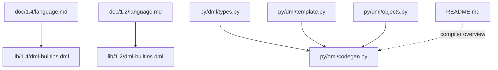
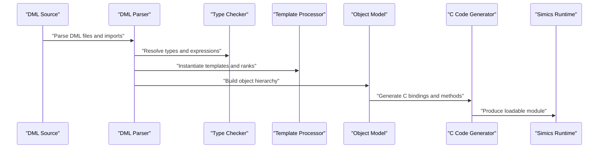
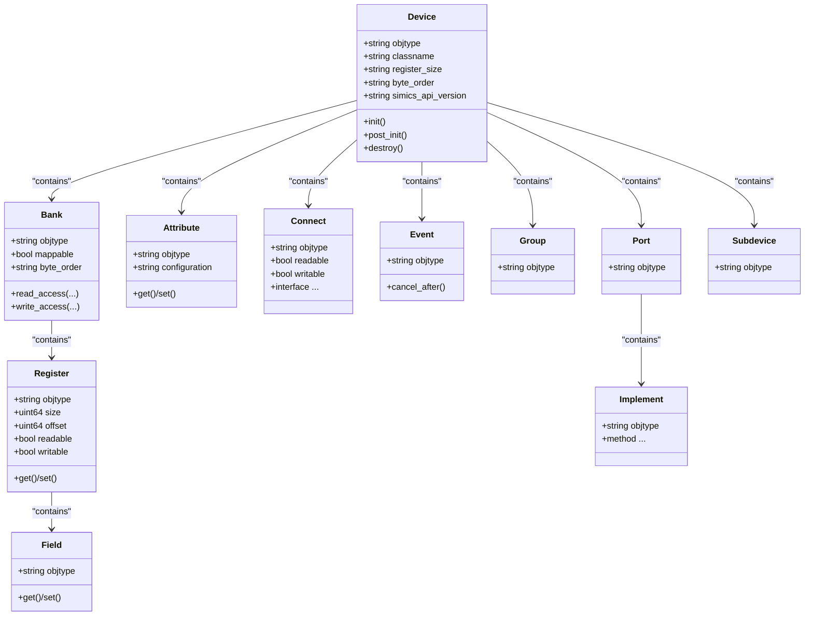
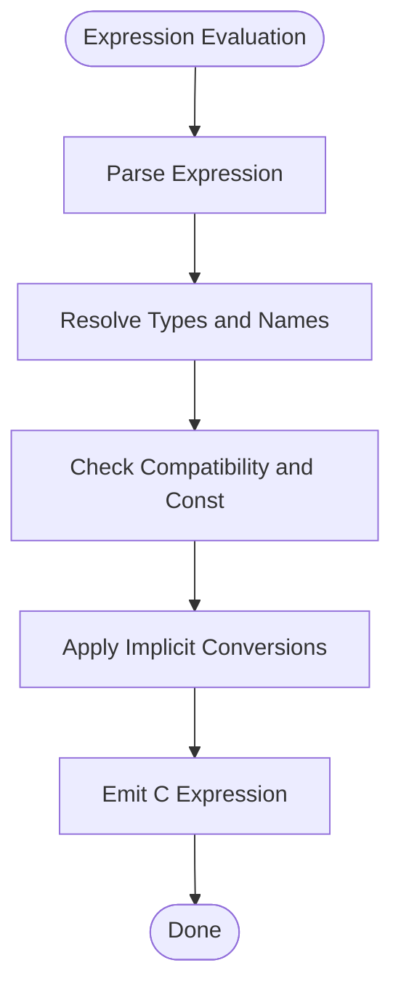
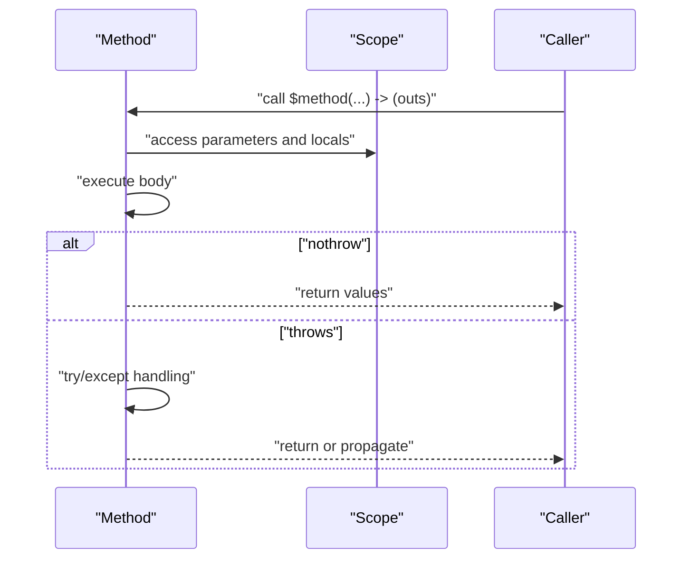
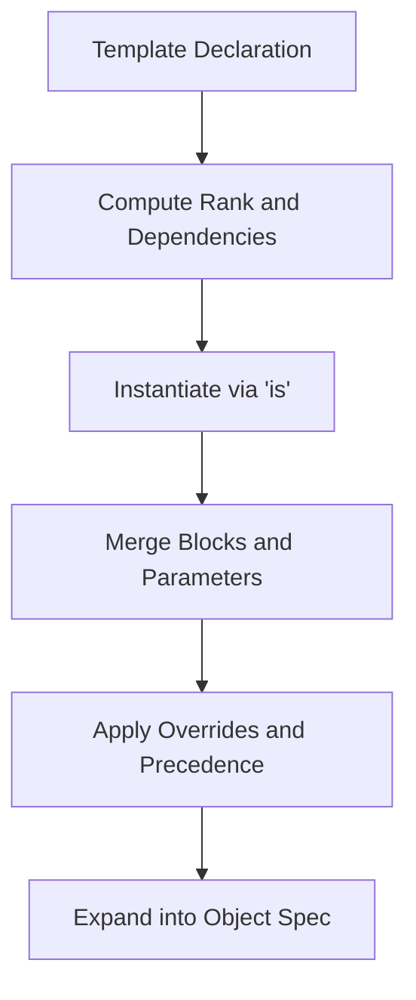
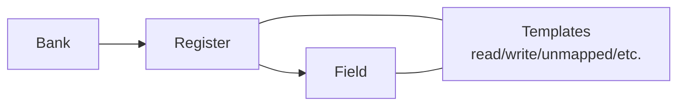
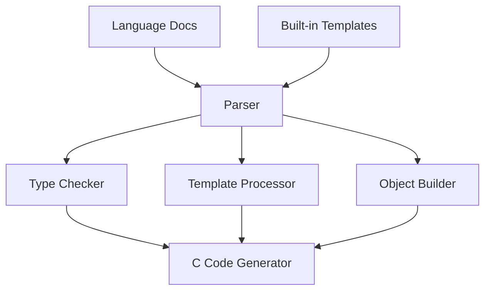

# Core Language Concepts

<cite>
**Referenced Files in This Document**
- [README.md](file://README.md)
- [language.md (DML 1.4)](file://doc/1.4/language.md)
- [introduction.md (DML 1.4)](file://doc/1.4/introduction.md)
- [language.md (DML 1.2)](file://doc/1.2/language.md)
- [introduction.md (DML 1.2)](file://doc/1.2/introduction.md)
- [dml-builtins.dml (DML 1.4)](file://lib/1.4/dml-builtins.dml)
- [dml-builtins.dml (DML 1.2)](file://lib/1.2/dml-builtins.dml)
- [types.py](file://py/dml/types.py)
- [template.py](file://py/dml/template.py)
- [objects.py](file://py/dml/objects.py)
</cite>

## Table of Contents
1. [Introduction](#introduction)
2. [Project Structure](#project-structure)
3. [Core Components](#core-components)
4. [Architecture Overview](#architecture-overview)
5. [Detailed Component Analysis](#detailed-component-analysis)
6. [Dependency Analysis](#dependency-analysis)
7. [Performance Considerations](#performance-considerations)
8. [Troubleshooting Guide](#troubleshooting-guide)
9. [Conclusion](#conclusion)
10. [Appendices](#appendices)

## Introduction
This document explains the core language concepts of the Device Modeling Language (DML). It covers the object model, device models, objects, attributes, and methods; the hierarchical structure of DML models and how components relate to each other; basic syntax elements, data types, variable declarations, and expression evaluation; and the relationship between DML high-level abstractions and the underlying C code generation. It also includes practical patterns for register definitions, event handling, and method implementation, introduces the template system and its role in code reuse, and provides guidance for reading and understanding DML error messages.

## Project Structure
The repository provides:
- Language documentation for DML 1.2 and 1.4, including syntax, object model, and built-in templates
- Standard library modules that define built-in templates and object types
- A Python-based compiler implementation that parses DML, resolves types, and generates C code

**Diagram sources**
- [language.md (DML 1.4)](file://doc/1.4/language.md#L1-L120)
- [dml-builtins.dml (DML 1.4)](file://lib/1.4/dml-builtins.dml#L1-L120)
- [language.md (DML 1.2)](file://doc/1.2/language.md#L1-L120)
- [dml-builtins.dml (DML 1.2)](file://lib/1.2/dml-builtins.dml#L1-L120)
- [types.py](file://py/dml/types.py#L1-L120)
- [template.py](file://py/dml/template.py#L1-L120)
- [objects.py](file://py/dml/objects.py#L1-L120)
- [README.md](file://README.md#L1-L117)

**Section sources**
- [README.md](file://README.md#L1-L117)
- [language.md (DML 1.4)](file://doc/1.4/language.md#L1-L120)
- [language.md (DML 1.2)](file://doc/1.2/language.md#L1-L120)

## Core Components
- Device model: A DML model defines a single device object and its members (banks, registers, fields, attributes, connects, ports, implements, events, groups, subdevices).
- Objects and hierarchy: The device object is the root; children can be banks, ports, subdevices, and so forth. Each object has a type and can contain parameters, methods, and other objects.
- Parameters: Static expressions that can be overridden; they are expanded at compile time.
- Methods: Subroutines with flexible input/output parameters; support exception handling and can be declared nothrow or throws.
- Attributes: Expose configuration values and state to Simics; can be required, optional, pseudo, or none.
- Connects: Hold references to other Simics objects and declare interfaces they expect to use or require.
- Implements: Export Simics interfaces from the device.
- Events: Encapsulate time-based activity posted on Simics queues.
- Groups: Generic containers for organizing objects.
- Subdevices: Hierarchical subdivisions of a device.
- Templates: Reusable code blocks instantiated into objects; drive default behaviors and interface contracts.

**Section sources**
- [introduction.md (DML 1.4)](file://doc/1.4/introduction.md#L133-L210)
- [language.md (DML 1.4)](file://doc/1.4/language.md#L255-L325)
- [dml-builtins.dml (DML 1.4)](file://lib/1.4/dml-builtins.dml#L565-L670)

## Architecture Overview
DML models are compiled into C code that integrates with Simics. The compiler:
- Parses DML source files and standard libraries
- Resolves types, templates, and object hierarchies
- Generates C code implementing device behavior, callbacks, attributes, and Simics interface bindings

**Diagram sources**
- [README.md](file://README.md#L8-L19)
- [types.py](file://py/dml/types.py#L1-L120)
- [template.py](file://py/dml/template.py#L1-L120)
- [objects.py](file://py/dml/objects.py#L1-L120)

## Detailed Component Analysis

### Object Model and Hierarchy
- Device: Top-level scope; registers to Simics configuration class mapping; parameters for class name, register size, byte order, and API version.
- Banks: Contain registers; expose IO memory mapping; support callbacks and instrumentation.
- Registers: Integer-valued storage; sized 1–8 bytes; support mapping and unmapped modes; fields for bit-level access.
- Fields: Bit ranges within registers; accessed via get/set methods; can instantiate read/write templates.
- Attributes: Expose values to Simics; support configuration modes (required, optional, pseudo, none) and persistence.
- Connects: Hold references to other Simics objects; declare required or optional interfaces; support runtime checks.
- Ports: Points where external devices connect; often host implements and connects.
- Implements: Define exported Simics interfaces; methods map to C function signatures.
- Events: Time-based activities; can be canceled and managed per object.
- Groups: Containers; restrict certain object types in specific contexts.
- Subdevices: Hierarchical subdivisions with their own ports, banks, and attributes.

**Diagram sources**
- [dml-builtins.dml (DML 1.4)](file://lib/1.4/dml-builtins.dml#L565-L670)
- [dml-builtins.dml (DML 1.4)](file://lib/1.4/dml-builtins.dml#L795-L900)
- [dml-builtins.dml (DML 1.4)](file://lib/1.4/dml-builtins.dml#L1000-L1100)
- [dml-builtins.dml (DML 1.4)](file://lib/1.4/dml-builtins.dml#L1100-L1200)
- [dml-builtins.dml (DML 1.4)](file://lib/1.4/dml-builtins.dml#L1200-L1300)
- [dml-builtins.dml (DML 1.4)](file://lib/1.4/dml-builtins.dml#L1300-L1400)
- [dml-builtins.dml (DML 1.4)](file://lib/1.4/dml-builtins.dml#L1400-L1500)
- [dml-builtins.dml (DML 1.4)](file://lib/1.4/dml-builtins.dml#L1500-L1600)
- [dml-builtins.dml (DML 1.4)](file://lib/1.4/dml-builtins.dml#L1600-L1700)
- [dml-builtins.dml (DML 1.4)](file://lib/1.4/dml-builtins.dml#L1700-L1800)
- [dml-builtins.dml (DML 1.4)](file://lib/1.4/dml-builtins.dml#L1800-L1900)
- [dml-builtins.dml (DML 1.4)](file://lib/1.4/dml-builtins.dml#L1900-L2000)

**Section sources**
- [introduction.md (DML 1.4)](file://doc/1.4/introduction.md#L133-L210)
- [language.md (DML 1.4)](file://doc/1.4/language.md#L255-L325)
- [dml-builtins.dml (DML 1.4)](file://lib/1.4/dml-builtins.dml#L565-L670)

### Data Types and Expressions
- Basic types: Integers (signed/unsigned), endian integers, floats, booleans, arrays, pointers, structs, layouts, bitfields.
- Type checking and conversion: Types are resolved, checked for compatibility, and mapped to C equivalents; const qualifiers propagate; bitfields and endian integers have special handling.
- Constants and expressions: Parameters are expanded at compile time; expressions evaluate in the scope where they are defined.

**Diagram sources**
- [types.py](file://py/dml/types.py#L120-L220)
- [types.py](file://py/dml/types.py#L257-L392)
- [types.py](file://py/dml/types.py#L522-L783)

**Section sources**
- [language.md (DML 1.4)](file://doc/1.4/language.md#L306-L484)
- [types.py](file://py/dml/types.py#L120-L220)
- [types.py](file://py/dml/types.py#L257-L392)

### Methods and Variable Declarations
- Methods: Flexible input/output parameters; can be nothrow or throws; support default and overridden implementations; callable via call or inline.
- Variables: local (stack), session (static), and saved (checkpointed) variables; scoped to object or method; initialization rules apply.
- Exceptions: try/except and throw statements for error handling.

**Diagram sources**
- [language.md (DML 1.4)](file://doc/1.4/language.md#L486-L576)
- [introduction.md (DML 1.4)](file://doc/1.4/introduction.md#L210-L280)

**Section sources**
- [language.md (DML 1.4)](file://doc/1.4/language.md#L486-L576)
- [introduction.md (DML 1.4)](file://doc/1.4/introduction.md#L210-L280)

### Template System Basics
- Templates are reusable code blocks instantiated into objects or other templates.
- Ranking and precedence: Templates are ranked; higher-ranked implementations override lower-ranked ones; in each constructs and conditional instantiation influence ranking.
- Template instantiation: Using is statements in object or template declarations; templates can inherit from others to specialize behavior.
- Interface templates: Provide abstract or overrideable methods; ensure methods are invoked when appropriate.

**Diagram sources**
- [template.py](file://py/dml/template.py#L1-L120)
- [template.py](file://py/dml/template.py#L250-L310)
- [template.py](file://py/dml/template.py#L362-L433)

**Section sources**
- [introduction.md (DML 1.4)](file://doc/1.4/introduction.md#L280-L348)
- [language.md (DML 1.4)](file://doc/1.4/language.md#L126-L148)
- [template.py](file://py/dml/template.py#L1-L120)
- [template.py](file://py/dml/template.py#L250-L310)
- [template.py](file://py/dml/template.py#L362-L433)

### Register Definitions and Patterns
- Register banks: Group registers and expose IO memory mapping; support big/little-endian byte order; can be mapped or unmapped.
- Registers: Sized 1–8 bytes; mapped via offset; support val member and get/set methods; can be read-only or custom behavior via templates.
- Fields: Bit ranges within registers; accessed via get/set; can combine read/write templates with register-level templates.
- Patterns: Use templates like read, write, read_only, unmapped; compose behaviors and centralize side effects.

**Diagram sources**
- [language.md (DML 1.4)](file://doc/1.4/language.md#L392-L620)
- [dml-builtins.dml (DML 1.4)](file://lib/1.4/dml-builtins.dml#L1100-L1200)

**Section sources**
- [language.md (DML 1.4)](file://doc/1.4/language.md#L392-L620)
- [dml-builtins.dml (DML 1.4)](file://lib/1.4/dml-builtins.dml#L1100-L1200)

### Event Handling
- Events are encapsulated objects that can be posted on Simics time or cycle queues.
- Methods can cancel pending events associated with an object.
- Event objects integrate with the object hierarchy and participate in initialization/post-init/destroy lifecycle.

**Section sources**
- [introduction.md (DML 1.4)](file://doc/1.4/introduction.md#L204-L210)
- [dml-builtins.dml (DML 1.4)](file://lib/1.4/dml-builtins.dml#L515-L563)

### Method Implementation Patterns
- Default vs overridden: Use default keyword to provide baseline behavior; override in instances to customize.
- External methods: Prefix with extern to guarantee generated C function linkage.
- Inline vs call: inline expands methods at call sites; call may be inlined depending on downstream compiler.
- Polymorphic macros via methods: Omit types on parameters to enable generic invocation.

**Section sources**
- [language.md (DML 1.4)](file://doc/1.4/language.md#L486-L576)
- [language.md (DML 1.2)](file://doc/1.2/language.md#L664-L683)

### Relationship to Generated C
- DML constructs map to C structures, functions, and Simics API calls.
- Attributes, registers, and connects are registered with Simics; methods become C functions with static linkage.
- Templates drive code generation and can introduce shared or specialized implementations.

**Section sources**
- [README.md](file://README.md#L8-L19)
- [dml-builtins.dml (DML 1.4)](file://lib/1.4/dml-builtins.dml#L175-L266)

## Dependency Analysis
The compiler pipeline depends on:
- Language docs for syntax and semantics
- Built-in templates for object types and behaviors
- Type checker for correctness
- Template processor for instantiation and precedence
- Object builder for hierarchy assembly
- Code generator for C emission

**Diagram sources**
- [language.md (DML 1.4)](file://doc/1.4/language.md#L1-L120)
- [dml-builtins.dml (DML 1.4)](file://lib/1.4/dml-builtins.dml#L1-L120)
- [types.py](file://py/dml/types.py#L1-L120)
- [template.py](file://py/dml/template.py#L1-L120)
- [objects.py](file://py/dml/objects.py#L1-L120)

**Section sources**
- [types.py](file://py/dml/types.py#L1-L120)
- [template.py](file://py/dml/template.py#L1-L120)
- [objects.py](file://py/dml/objects.py#L1-L120)

## Performance Considerations
- Template expansion: Prefer shared methods and templates to reduce code duplication.
- Method inlining: Use inline for hot paths; call may be inlined by downstream compilers.
- Register sizing: Keep registers within 1–8 bytes; align with bank byte order to avoid conversions.
- Attributes and checkpointing: Use saved variables for checkpointable state; minimize complex serialization overhead.

[No sources needed since this section provides general guidance]

## Troubleshooting Guide
Common issues and guidance:
- Unknown or unresolved identifiers: Verify names are defined before use and scopes are correct.
- Type mismatches: Ensure operand types are compatible; const qualifiers propagate.
- Template cycles: Resolve cyclic template dependencies; compiler reports cycle sites.
- Missing templates: Add missing template definitions or adjust conditional instantiation.
- Attribute configuration: Check configuration modes (required/optional/pseudo/none) and flags.
- Byte order and endianness: Confirm bank byte order and register endianness match expectations.

**Section sources**
- [template.py](file://py/dml/template.py#L390-L407)
- [types.py](file://py/dml/types.py#L92-L119)

## Conclusion
DML provides a concise, high-level model for Simics device development. Its object model, parameters, methods, and templates enable clear composition and reuse. Understanding the hierarchy, types, and template precedence is essential to writing robust models. The compiler maps DML constructs to efficient C code, integrating tightly with Simics.

[No sources needed since this section summarizes without analyzing specific files]

## Appendices

### Appendix A: Quick Reference to Object Types
- device: Top-level device object
- bank: Register container with IO memory mapping
- register: Integer-valued storage with size and offset
- field: Bit ranges within registers
- attribute: Exposes values to Simics
- connect: Holds references to other Simics objects
- interface: Declares expected interfaces on connects
- port: Connection points for external devices
- implement: Exports Simics interfaces
- event: Time-based activity
- group: Container for organizing objects
- subdevice: Hierarchical subdivision

**Section sources**
- [introduction.md (DML 1.4)](file://doc/1.4/introduction.md#L133-L210)