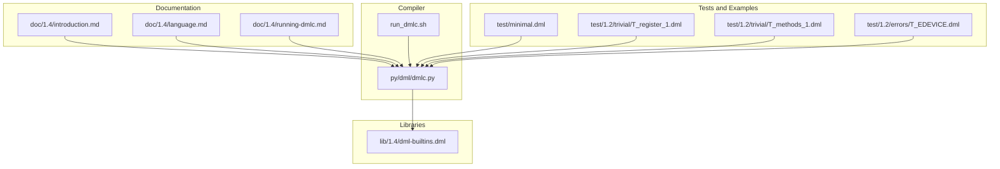
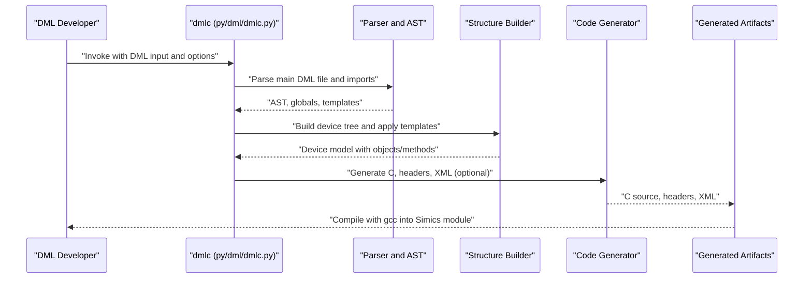
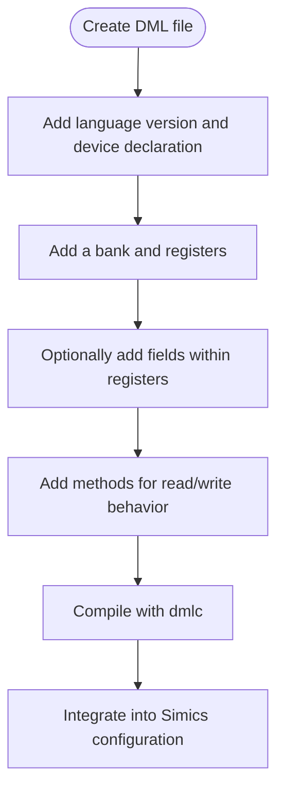
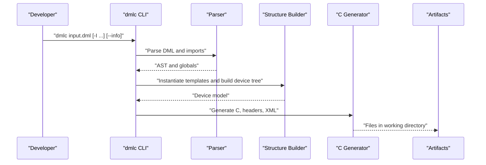
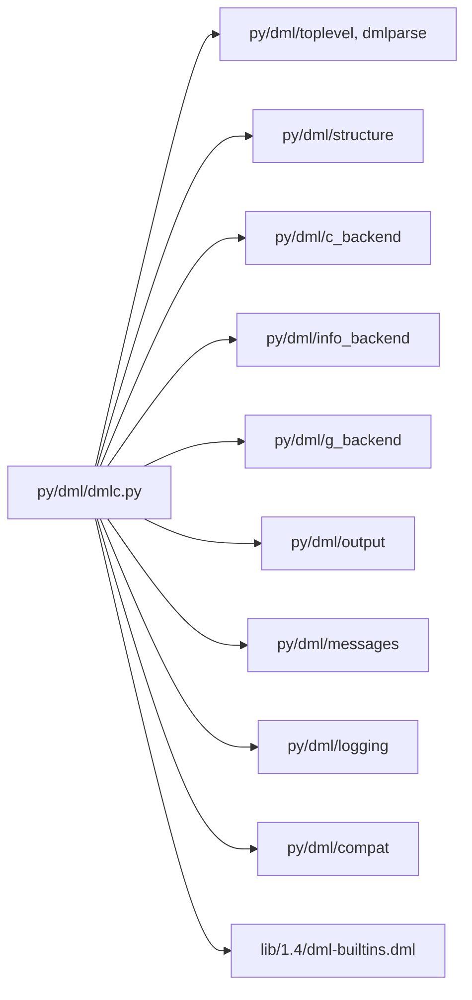

# Getting Started

<cite>
**Referenced Files in This Document**
- [README.md](file://README.md)
- [doc/1.4/introduction.md](file://doc/1.4/introduction.md)
- [doc/1.4/language.md](file://doc/1.4/language.md)
- [doc/1.4/running-dmlc.md](file://doc/1.4/running-dmlc.md)
- [py/dml/dmlc.py](file://py/dml/dmlc.py)
- [run_dmlc.sh](file://run_dmlc.sh)
- [lib/1.4/dml-builtins.dml](file://lib/1.4/dml-builtins.dml)
- [test/minimal.dml](file://test/minimal.dml)
- [test/1.2/trivial/T_register_1.dml](file://test/1.2/trivial/T_register_1.dml)
- [test/1.2/trivial/T_methods_1.dml](file://test/1.2/trivial/T_methods_1.dml)
- [test/1.2/errors/T_EDEVICE.dml](file://test/1.2/errors/T_EDEVICE.dml)
</cite>

## Table of Contents
1. [Introduction](#introduction)
2. [Project Structure](#project-structure)
3. [Core Components](#core-components)
4. [Architecture Overview](#architecture-overview)
5. [Detailed Component Analysis](#detailed-component-analysis)
6. [Dependency Analysis](#dependency-analysis)
7. [Performance Considerations](#performance-considerations)
8. [Troubleshooting Guide](#troubleshooting-guide)
9. [Conclusion](#conclusion)
10. [Appendices](#appendices)

## Introduction
Device Modeling Language (DML) is a domain-specific language for writing fast functional or transaction-level device models for virtual platforms. DML compiles DML source files into C code that integrates with the Simics simulator. This guide helps you install and set up the environment, build and test the DML compiler (dmlc), and write your first device model with basic concepts such as objects, registers, and events.

## Project Structure
At a high level, the repository provides:
- Language documentation and examples
- The DML compiler implementation (Python-based)
- Standard libraries and built-in templates for Simics integration
- Test suites and minimal examples

**Diagram sources**
- [doc/1.4/introduction.md](file://doc/1.4/introduction.md#L1-L348)
- [doc/1.4/language.md](file://doc/1.4/language.md#L1-L800)
- [doc/1.4/running-dmlc.md](file://doc/1.4/running-dmlc.md#L1-L186)
- [py/dml/dmlc.py](file://py/dml/dmlc.py#L1-L811)
- [run_dmlc.sh](file://run_dmlc.sh#L1-L67)
- [lib/1.4/dml-builtins.dml](file://lib/1.4/dml-builtins.dml#L1-L200)
- [test/minimal.dml](file://test/minimal.dml#L1-L8)
- [test/1.2/trivial/T_register_1.dml](file://test/1.2/trivial/T_register_1.dml#L1-L16)
- [test/1.2/trivial/T_methods_1.dml](file://test/1.2/trivial/T_methods_1.dml#L1-L41)
- [test/1.2/errors/T_EDEVICE.dml](file://test/1.2/errors/T_EDEVICE.dml#L1-L8)

**Section sources**
- [README.md](file://README.md#L1-L117)
- [doc/1.4/introduction.md](file://doc/1.4/introduction.md#L1-L348)
- [doc/1.4/language.md](file://doc/1.4/language.md#L1-L800)
- [doc/1.4/running-dmlc.md](file://doc/1.4/running-dmlc.md#L1-L186)
- [py/dml/dmlc.py](file://py/dml/dmlc.py#L1-L811)
- [run_dmlc.sh](file://run_dmlc.sh#L1-L67)
- [lib/1.4/dml-builtins.dml](file://lib/1.4/dml-builtins.dml#L1-L200)
- [test/minimal.dml](file://test/minimal.dml#L1-L8)
- [test/1.2/trivial/T_register_1.dml](file://test/1.2/trivial/T_register_1.dml#L1-L16)
- [test/1.2/trivial/T_methods_1.dml](file://test/1.2/trivial/T_methods_1.dml#L1-L41)
- [test/1.2/errors/T_EDEVICE.dml](file://test/1.2/errors/T_EDEVICE.dml#L1-L8)

## Core Components
- DML compiler (dmlc): Parses DML source, validates semantics, and generates C code plus auxiliary headers and XML metadata.
- Standard libraries: Provide built-in templates and Simics integration (e.g., register banks, attributes, connects, interfaces).
- Documentation: Describes language constructs, object model, and compiler usage.
- Tests and examples: Demonstrate minimal models, register and method constructs, and error conditions.

Key responsibilities:
- Parsing and AST construction
- Template instantiation and parameter expansion
- Code generation to C with Simics bindings
- Optional XML register layout and debug artifacts

**Section sources**
- [doc/1.4/running-dmlc.md](file://doc/1.4/running-dmlc.md#L1-L186)
- [py/dml/dmlc.py](file://py/dml/dmlc.py#L1-L811)
- [lib/1.4/dml-builtins.dml](file://lib/1.4/dml-builtins.dml#L1-L200)

## Architecture Overview
The DML compiler pipeline transforms a DML device model into a Simics-compatible module.

**Diagram sources**
- [py/dml/dmlc.py](file://py/dml/dmlc.py#L676-L760)
- [doc/1.4/running-dmlc.md](file://doc/1.4/running-dmlc.md#L43-L62)

## Detailed Component Analysis

### Installing and Setting Up the Environment
- Obtain Simics Base (required for building dmlc).
- Build dmlc from a Simics project:
  - Check out the DML repository into the project’s modules/dmlc directory.
  - Run make dmlc (or bin\make dmlc on Windows).
- Configure environment variables for development convenience:
  - DMLC_DIR: points to <project>/<hosttype>/bin for local builds.
  - T126_JOBS: parallel test jobs.
  - DMLC_PATHSUBST: rewrite error paths to source files.
  - PY_SYMLINKS: symlink Python sources for easier debugging.
  - DMLC_DEBUG: show tracebacks on unexpected exceptions.
  - DMLC_CC: override compiler in unit tests.
  - DMLC_PROFILE: self-profiling output.
  - DMLC_DUMP_INPUT_FILES: emit a tarball of all DML sources for isolated reproduction.
  - DMLC_GATHER_SIZE_STATISTICS: code-size statistics for optimization.

Practical tips:
- Use run_dmlc.sh to invoke dmlc with environment-driven paths and import paths.
- Ensure SIMICS_BASE is available in your environment or project script.

**Section sources**
- [README.md](file://README.md#L22-L117)
- [doc/1.4/running-dmlc.md](file://doc/1.4/running-dmlc.md#L15-L42)
- [run_dmlc.sh](file://run_dmlc.sh#L1-L67)

### Building and Testing DMLC
- Build:
  - From your Simics project, run make dmlc to produce dmlc binaries and libraries under host/bin.
- Test:
  - Run make test-dmlc or use the test runner against modules/dmlc/test.
- Local invocation:
  - Use run_dmlc.sh to call mini-python with dmlc and appropriate include paths.

What to expect:
- The build produces Python modules, standard libraries, and API headers under host/bin/dml.
- Tests exercise language features and error conditions.

**Section sources**
- [README.md](file://README.md#L22-L44)
- [doc/1.4/running-dmlc.md](file://doc/1.4/running-dmlc.md#L15-L42)
- [run_dmlc.sh](file://run_dmlc.sh#L55-L66)

### Writing Your First DML Device Model
Start with a minimal device declaration and add simple constructs:
- A device declaration defines the Simics configuration class.
- Add a bank and registers to expose memory-mapped state.
- Optionally add fields within registers for bit-level access.
- Add methods to implement behavior on reads/writes or events.

Example patterns:
- Minimal device: see test/minimal.dml.
- Register bank and register: see test/1.2/trivial/T_register_1.dml.
- Method constructs: see test/1.2/trivial/T_methods_1.dml.

[No sources needed since this diagram shows conceptual workflow, not actual code structure]

**Section sources**
- [test/minimal.dml](file://test/minimal.dml#L1-L8)
- [test/1.2/trivial/T_register_1.dml](file://test/1.2/trivial/T_register_1.dml#L1-L16)
- [test/1.2/trivial/T_methods_1.dml](file://test/1.2/trivial/T_methods_1.dml#L1-L41)
- [doc/1.4/introduction.md](file://doc/1.4/introduction.md#L50-L132)

### Understanding Basic Concepts
- Objects: hierarchical members such as device, bank, register, field, group, connect, port, implement, event, subdevice.
- Methods: subroutines with multiple return values, local/session/saved variables, and exception handling.
- Templates: reusable blocks injected into objects; parameters can be overridden to specialize behavior.
- Attributes and connects: expose configuration attributes and references to other Simics objects/interfaces.

Reference:
- Object types and relationships are documented in the language guide.

**Section sources**
- [doc/1.4/introduction.md](file://doc/1.4/introduction.md#L133-L210)
- [doc/1.4/language.md](file://doc/1.4/language.md#L255-L357)

### Compiling DML to C
- Invocation:
  - dmlc <input.dml> [output-base]
  - Supports include paths (-I), compile-time defines (-D), dependency generation (--dep), debug artifacts (-g), register layout XML (--info), and more.
- Generated artifacts:
  - Main C file, headers, and optionally XML describing register layout.
- Standard libraries:
  - The compiler links against built-in templates and Simics interfaces from lib/1.4/dml-builtins.dml.

**Diagram sources**
- [doc/1.4/running-dmlc.md](file://doc/1.4/running-dmlc.md#L43-L62)
- [py/dml/dmlc.py](file://py/dml/dmlc.py#L676-L760)

**Section sources**
- [doc/1.4/running-dmlc.md](file://doc/1.4/running-dmlc.md#L43-L186)
- [py/dml/dmlc.py](file://py/dml/dmlc.py#L309-L800)
- [lib/1.4/dml-builtins.dml](file://lib/1.4/dml-builtins.dml#L1-L200)

## Dependency Analysis
The compiler depends on:
- Python modules for parsing, AST, code generation, and backend selection.
- Standard library modules for Simics integration.
- Optional profiling and AI diagnostics modules.

**Diagram sources**
- [py/dml/dmlc.py](file://py/dml/dmlc.py#L11-L25)
- [lib/1.4/dml-builtins.dml](file://lib/1.4/dml-builtins.dml#L1-L200)

**Section sources**
- [py/dml/dmlc.py](file://py/dml/dmlc.py#L11-L25)

## Performance Considerations
- Use shared methods and templates judiciously to reduce code duplication.
- Prefer smaller, focused templates and avoid excessive foreach/select expansions in hot paths.
- Monitor generated code size and compilation time using DMLC_GATHER_SIZE_STATISTICS.
- Enable --info to generate register layout XML for verification and optimization.

[No sources needed since this section provides general guidance]

## Troubleshooting Guide
Common issues and remedies:
- Missing Simics Base or incorrect DMLC_DIR:
  - Ensure SIMICS_BASE is set and DMLC_DIR points to host/bin of your project.
- Unexpected exceptions:
  - Set DMLC_DEBUG=1 to print tracebacks; otherwise, dmlc logs to dmlc-error.log.
- Error path confusion:
  - Set DMLC_PATHSUBST to map copied library paths back to source paths.
- Reproducing complex build problems:
  - Set DMLC_DUMP_INPUT_FILES to emit a tarball of all DML sources and relative imports.
- Strictness and compatibility:
  - Use --strict or --no-compat flags to enforce stricter checks or disable legacy features.
- Porting diagnostics:
  - Use -P to collect porting messages for migration to newer DML versions.

Examples of diagnostics and error patterns:
- Minimal device example: test/minimal.dml
- Register and method constructs: test/1.2/trivial/T_register_1.dml, test/1.2/trivial/T_methods_1.dml
- Error-triggering example: test/1.2/errors/T_EDEVICE.dml

**Section sources**
- [README.md](file://README.md#L46-L117)
- [py/dml/dmlc.py](file://py/dml/dmlc.py#L227-L237)
- [test/minimal.dml](file://test/minimal.dml#L1-L8)
- [test/1.2/trivial/T_register_1.dml](file://test/1.2/trivial/T_register_1.dml#L1-L16)
- [test/1.2/trivial/T_methods_1.dml](file://test/1.2/trivial/T_methods_1.dml#L1-L41)
- [test/1.2/errors/T_EDEVICE.dml](file://test/1.2/errors/T_EDEVICE.dml#L1-L8)

## Conclusion
You now have the essentials to install Simics, build and test dmlc, configure environment variables for productivity, and write your first DML device model. Use the provided documentation and examples to explore objects, registers, fields, methods, and templates, and leverage the compiler options to optimize and debug your models.

[No sources needed since this section summarizes without analyzing specific files]

## Appendices

### Appendix A: Quick Reference to Key Concepts
- Device: Top-level configuration class.
- Bank: Container of registers mapped into memory.
- Register: Integer value with size and offset; supports fields.
- Field: Bit-range within a register.
- Method: Subroutine with parameters and multiple return values.
- Attribute: Exposes configuration or checkpoint data.
- Connect: Reference to another Simics object with declared interfaces.
- Implement: Registers Simics interfaces implemented by the device.
- Event: Encapsulation of a Simics event posted on a time queue.
- Subdevice: Hierarchical subsystem with its own ports and banks.

**Section sources**
- [doc/1.4/introduction.md](file://doc/1.4/introduction.md#L133-L210)