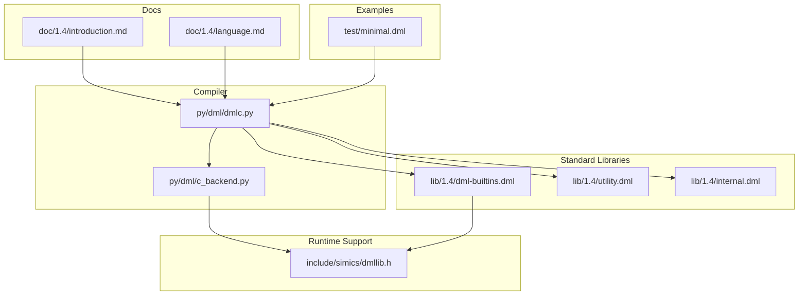
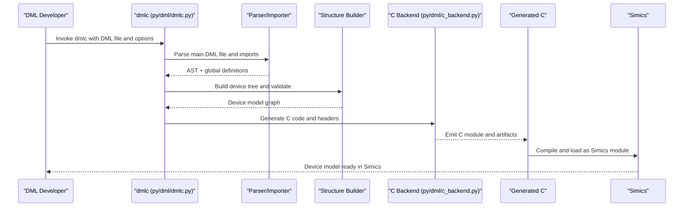
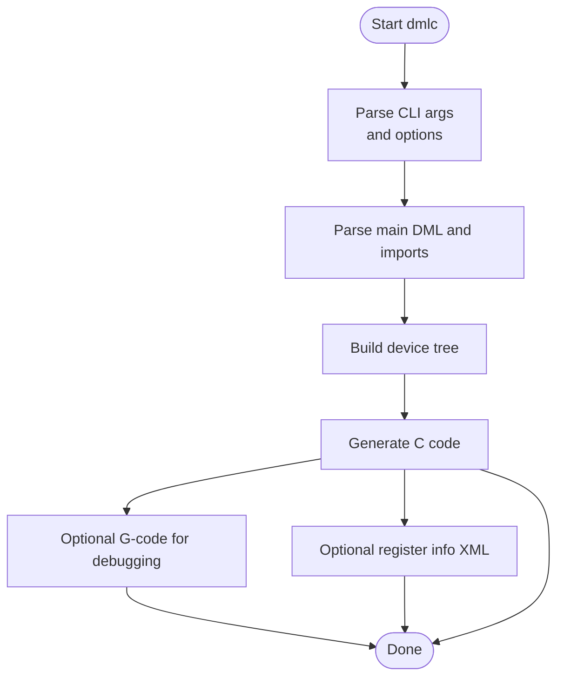
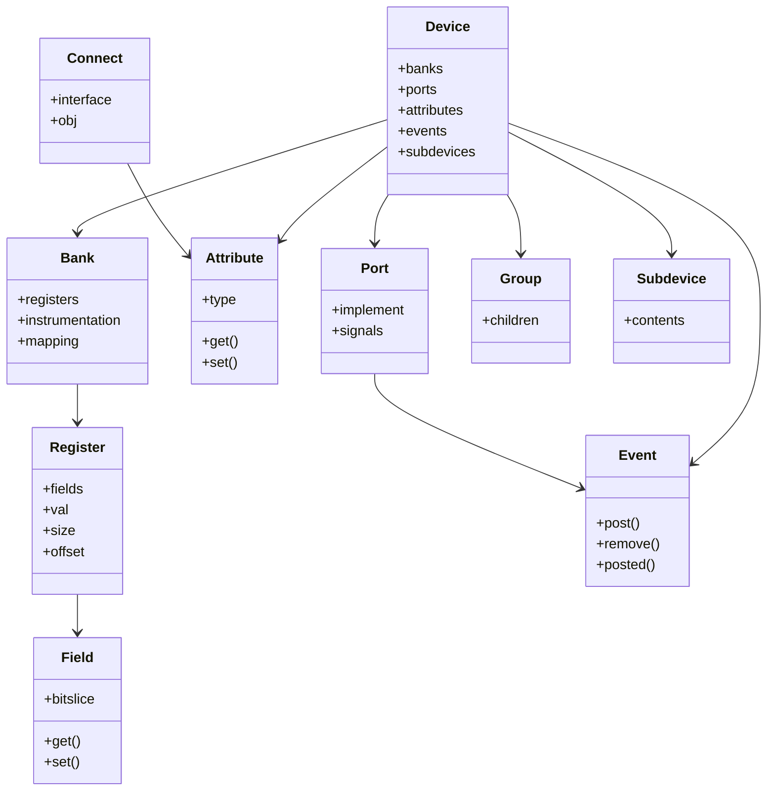
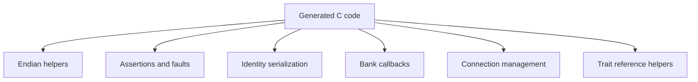
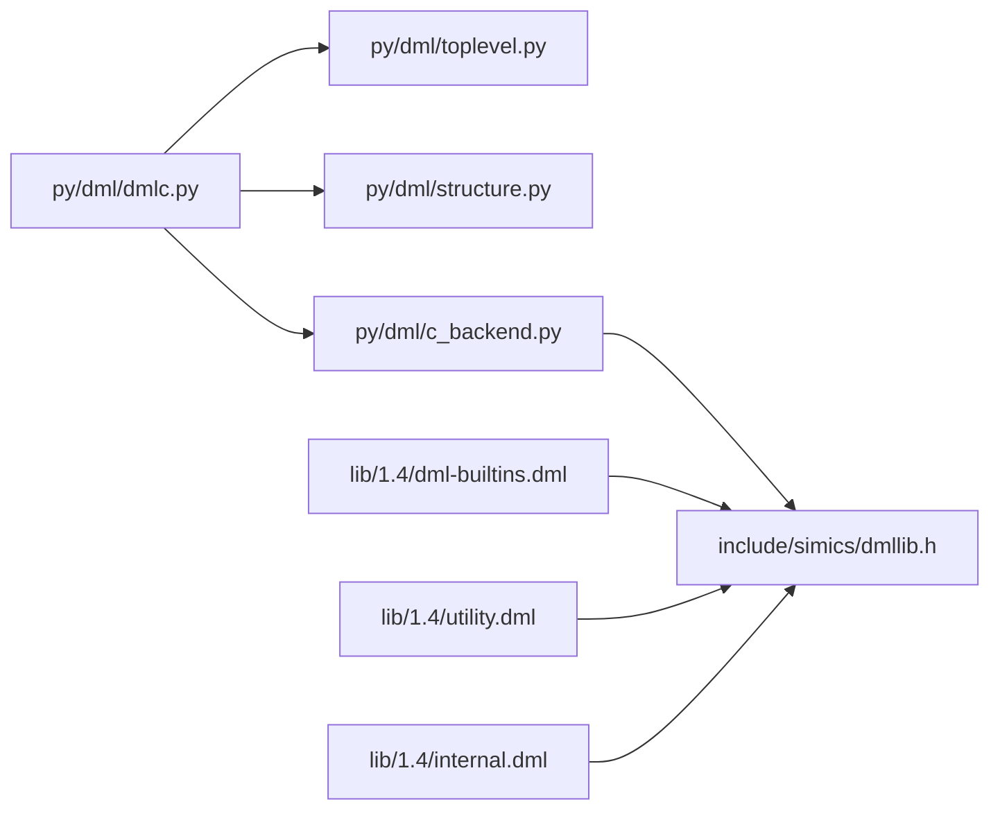

# Project Overview

<cite>
**Referenced Files in This Document**
- [README.md](file://README.md)
- [dmlc.py](file://py/dml/dmlc.py)
- [c_backend.py](file://py/dml/c_backend.py)
- [dmllib.h](file://include/simics/dmllib.h)
- [dml-builtins.dml](file://lib/1.4/dml-builtins.dml)
- [utility.dml](file://lib/1.4/utility.dml)
- [internal.dml](file://lib/1.4/internal.dml)
- [introduction.md](file://doc/1.4/introduction.md)
- [language.md](file://doc/1.4/language.md)
- [minimal.dml](file://test/minimal.dml)
</cite>

## Table of Contents
1. [Introduction](#introduction)
2. [Project Structure](#project-structure)
3. [Core Components](#core-components)
4. [Architecture Overview](#architecture-overview)
5. [Detailed Component Analysis](#detailed-component-analysis)
6. [Dependency Analysis](#dependency-analysis)
7. [Performance Considerations](#performance-considerations)
8. [Troubleshooting Guide](#troubleshooting-guide)
9. [Conclusion](#conclusion)
10. [Appendices](#appendices)

## Introduction
Device Modeling Language (DML) is a domain-specific language for creating fast functional or transaction-level device models for virtual platforms. It focuses on high-level constructs that map naturally to device modeling needs: register banks, registers, bit fields, event posting, interfaces between device models, and logging. DML code is compiled by the DML Compiler (dmlc) into optimized C code with API calls tailored for a particular simulator. Currently, the compiler targets the Intel® Simics® simulator ecosystem, enabling device models to integrate seamlessly with Simics configuration objects, memory spaces, and interfaces.

This overview explains both the conceptual foundations for beginners and the technical internals for experienced developers. It covers the compilation pipeline, the DML object model, and practical examples of common device modeling tasks such as memory-mapped register banks, event-driven behavior, and interface-based connectivity.

## Project Structure
At a high level, the repository contains:
- A Python-based compiler (dmlc) that parses DML, validates the model, and generates C code.
- Standard libraries and built-in templates that define device model primitives (banks, registers, fields, attributes, connects, interfaces, events).
- Runtime support headers that provide C utilities used by generated device models.
- Documentation describing the language and usage.
- Test suites and minimal examples demonstrating compilation and usage.

**Diagram sources**
- [dmlc.py](file://py/dml/dmlc.py#L309-L760)
- [c_backend.py](file://py/dml/c_backend.py#L1-L200)
- [dml-builtins.dml](file://lib/1.4/dml-builtins.dml#L1-L200)
- [utility.dml](file://lib/1.4/utility.dml#L1-L200)
- [internal.dml](file://lib/1.4/internal.dml#L1-L94)
- [dmllib.h](file://include/simics/dmllib.h#L1-L120)
- [introduction.md](file://doc/1.4/introduction.md#L1-L120)
- [language.md](file://doc/1.4/language.md#L1-L120)
- [minimal.dml](file://test/minimal.dml#L1-L8)

**Section sources**
- [README.md](file://README.md#L1-L117)
- [dmlc.py](file://py/dml/dmlc.py#L309-L760)
- [c_backend.py](file://py/dml/c_backend.py#L1-L200)
- [dml-builtins.dml](file://lib/1.4/dml-builtins.dml#L1-L200)
- [utility.dml](file://lib/1.4/utility.dml#L1-L200)
- [internal.dml](file://lib/1.4/internal.dml#L1-L94)
- [dmllib.h](file://include/simics/dmllib.h#L1-L120)
- [introduction.md](file://doc/1.4/introduction.md#L1-L120)
- [language.md](file://doc/1.4/language.md#L1-L120)
- [minimal.dml](file://test/minimal.dml#L1-L8)

## Core Components
- DML Compiler (dmlc): Parses DML source files, resolves imports, validates the model, and generates C code. It supports command-line options for debugging, dependency generation, API version selection, and AI-friendly diagnostics.
- Standard Libraries: Provide built-in templates and primitives for device modeling, including register banks, registers, fields, attributes, connects, interfaces, events, and reset templates.
- Runtime Utilities (dmllib.h): Defines macros and helpers used by generated C code, including endian conversions, assertion helpers, identity serialization, and callback registration for bank instrumentation and connection management.
- Documentation: Guides explain the object model, language constructs, and practical usage patterns.

Key responsibilities:
- Compiler: Parsing, validation, AST-to-C code generation, and backend selection.
- Libraries: Define the semantics and default behaviors for device modeling primitives.
- Runtime: Provide efficient, safe helpers for generated device code.

**Section sources**
- [README.md](file://README.md#L8-L19)
- [dmlc.py](file://py/dml/dmlc.py#L309-L760)
- [dml-builtins.dml](file://lib/1.4/dml-builtins.dml#L1-L200)
- [dmllib.h](file://include/simics/dmllib.h#L1-L120)

## Architecture Overview
The DML compilation pipeline transforms a DML device model into a Simics-compatible C module. The compiler orchestrates parsing, semantic analysis, and code generation, while the standard libraries and runtime headers provide the primitives and utilities used by the generated code.

**Diagram sources**
- [dmlc.py](file://py/dml/dmlc.py#L676-L760)
- [c_backend.py](file://py/dml/c_backend.py#L1-L200)

## Detailed Component Analysis

### Compiler (dmlc)
The compiler entry point parses command-line arguments, resolves imports, builds the device tree, and invokes the C backend. It supports:
- Dependency generation for build systems
- Debuggable artifacts and G-code generation
- API version selection and compatibility toggles
- AI diagnostics output
- Info XML generation for register layouts

**Diagram sources**
- [dmlc.py](file://py/dml/dmlc.py#L309-L760)

**Section sources**
- [dmlc.py](file://py/dml/dmlc.py#L309-L760)

### Standard Libraries and Built-ins
The standard libraries define the core object model and templates used in device models:
- Built-ins: Provide templates for object types (device, bank, register, field, attribute, connect, interface, port, implement, event, group, subdevice), plus utilities for reset, instrumentation, and register views.
- Utility templates: Offer common patterns for reset behavior, sticky states, and soft/hard/power-on resets.
- Internal utilities: Expose C macros and helpers for vector operations, endian conversions, and bit counting.

**Diagram sources**
- [dml-builtins.dml](file://lib/1.4/dml-builtins.dml#L175-L200)
- [utility.dml](file://lib/1.4/utility.dml#L1-L200)
- [language.md](file://doc/1.4/language.md#L255-L330)

**Section sources**
- [dml-builtins.dml](file://lib/1.4/dml-builtins.dml#L175-L200)
- [utility.dml](file://lib/1.4/utility.dml#L1-L200)
- [language.md](file://doc/1.4/language.md#L255-L330)

### Runtime Utilities (dmllib.h)
The runtime header provides:
- Endian conversion helpers for raw loads/stores
- Assertion and fault handling macros
- Identity serialization/deserialization for checkpointing
- Callback registration and manipulation for bank instrumentation and connections
- Trait reference helpers and sequence parameter handling

**Diagram sources**
- [dmllib.h](file://include/simics/dmllib.h#L31-L120)
- [dmllib.h](file://include/simics/dmllib.h#L691-L777)

**Section sources**
- [dmllib.h](file://include/simics/dmllib.h#L31-L120)
- [dmllib.h](file://include/simics/dmllib.h#L691-L777)

### Practical Examples and Use Cases
Common device modeling scenarios:
- Memory-mapped register banks: Define a bank, registers, and fields; expose read/write behavior via templates; map registers to offsets and sizes.
- Event posting: Declare an event object and post it on a time/cycle queue; manage lifecycle with posted/remove methods.
- Interfaces and connectivity: Use connect objects with interface declarations to link to other Simics objects implementing specific interfaces.
- Reset behavior: Apply reset templates to registers and fields; customize reset values or suppress resets as needed.

Example references:
- Source file example and explanation of device, connect, bank, register, field, and method usage.
- Templates for reset behavior and common register patterns.

**Section sources**
- [introduction.md](file://doc/1.4/introduction.md#L50-L133)
- [language.md](file://doc/1.4/language.md#L392-L532)
- [language.md](file://doc/1.4/language.md#L789-L800)
- [utility.dml](file://lib/1.4/utility.dml#L50-L170)

## Dependency Analysis
The compiler depends on Python modules for parsing, AST construction, code generation, and output management. The generated C code depends on the runtime utilities and Simics APIs.

**Diagram sources**
- [dmlc.py](file://py/dml/dmlc.py#L11-L25)
- [c_backend.py](file://py/dml/c_backend.py#L15-L28)
- [dml-builtins.dml](file://lib/1.4/dml-builtins.dml#L1-L30)
- [utility.dml](file://lib/1.4/utility.dml#L1-L15)
- [internal.dml](file://lib/1.4/internal.dml#L1-L15)

**Section sources**
- [dmlc.py](file://py/dml/dmlc.py#L11-L25)
- [c_backend.py](file://py/dml/c_backend.py#L15-L28)
- [dml-builtins.dml](file://lib/1.4/dml-builtins.dml#L1-L30)
- [utility.dml](file://lib/1.4/utility.dml#L1-L15)
- [internal.dml](file://lib/1.4/internal.dml#L1-L15)

## Performance Considerations
- Generated code size and compile time: The compiler can emit size statistics to identify hotspots in method generation, guiding decisions like marking methods as shared to reduce duplication.
- Splitting generated C files: Threshold-based splitting can help manage large outputs.
- Debugging artifacts: Enabling debuggable mode aligns generated C with DML for easier source-level debugging.

Recommendations:
- Prefer shared methods for repeated constructs.
- Use templates judiciously; avoid excessive foreach/select loops in hot paths.
- Leverage bank instrumentation and register views to minimize custom logic where standard templates suffice.

**Section sources**
- [README.md](file://README.md#L96-L116)
- [dmlc.py](file://py/dml/dmlc.py#L504-L507)
- [dmlc.py](file://py/dml/dmlc.py#L556-L564)

## Troubleshooting Guide
Common issues and remedies:
- Unexpected exceptions: Enable debug mode to print tracebacks to stderr; otherwise, they are logged to a dedicated file.
- Dependency generation pitfalls: Avoid generating dependency files when timestamps are in the future; the compiler warns and may skip generation to prevent infinite rebuild loops.
- AI diagnostics: Export structured diagnostics to JSON for AI-assisted error correction and code generation assistance.
- Unused parameters: Warnings are reported after successful compilation to highlight unused compile-time parameters.

**Section sources**
- [README.md](file://README.md#L75-L94)
- [dmlc.py](file://py/dml/dmlc.py#L227-L237)
- [dmlc.py](file://py/dml/dmlc.py#L690-L713)
- [dmlc.py](file://py/dml/dmlc.py#L750-L757)

## Conclusion
DML provides a concise, high-productivity language for building fast device models tailored to Simics. Its compiler transforms DML specifications into optimized C code, leveraging standard libraries and runtime utilities to integrate seamlessly with Simics’ configuration objects, memory spaces, and interfaces. Beginners can start with simple register banks and event-driven behavior, while advanced users benefit from templates, instrumentation, and AI diagnostics to refine performance and correctness.

## Appendices
- Minimal example: A minimal DML file for compilation-only testing.
- Documentation: Comprehensive language guide and introduction to the object model and device structure.

**Section sources**
- [minimal.dml](file://test/minimal.dml#L1-L8)
- [introduction.md](file://doc/1.4/introduction.md#L1-L48)
- [language.md](file://doc/1.4/language.md#L12-L34)