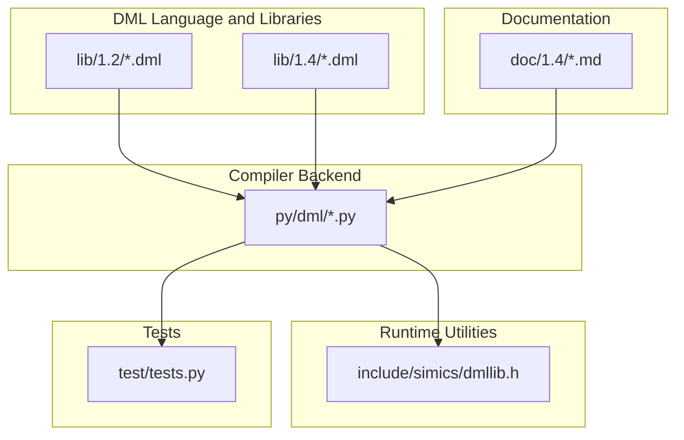
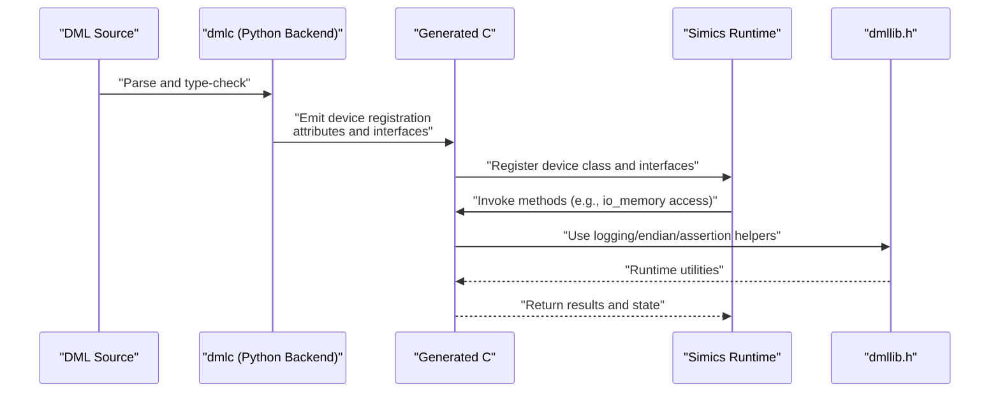
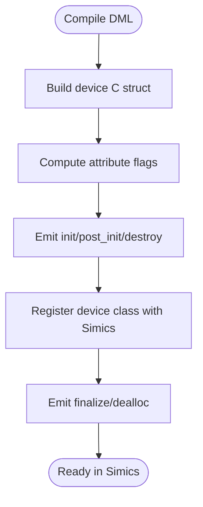
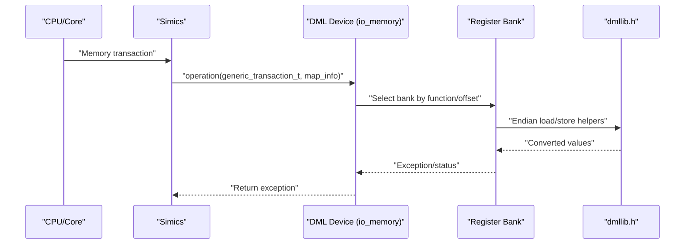
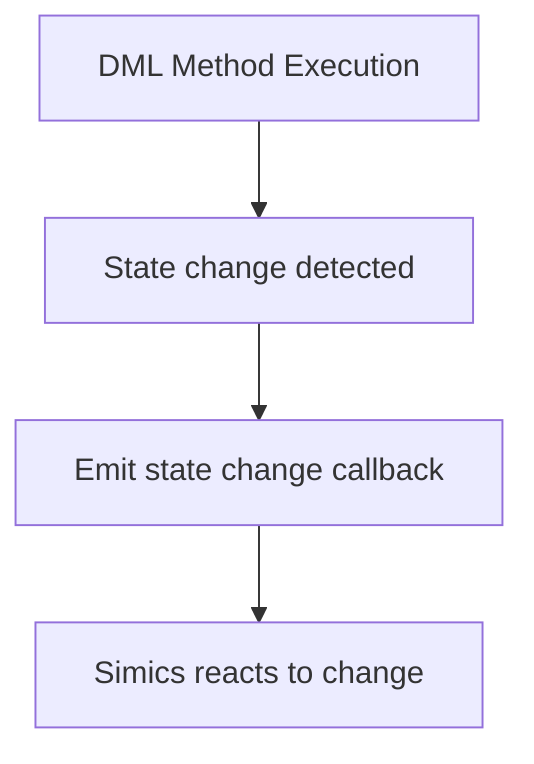
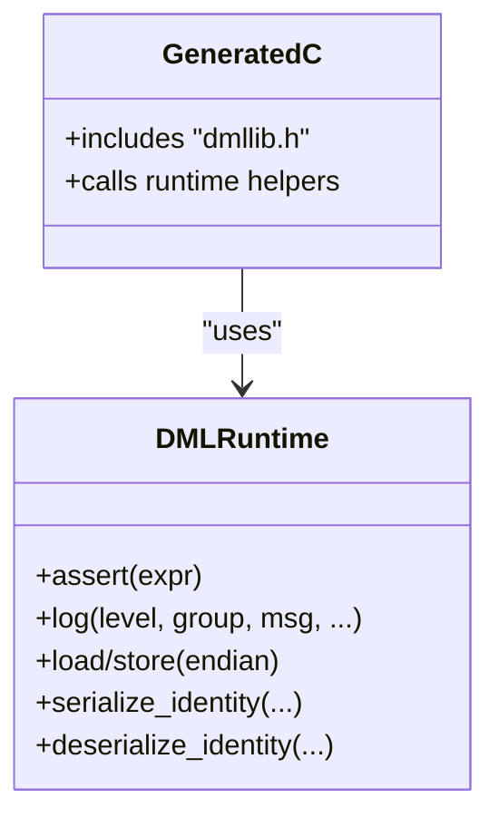
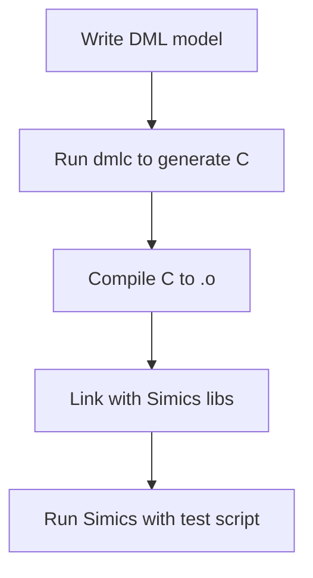
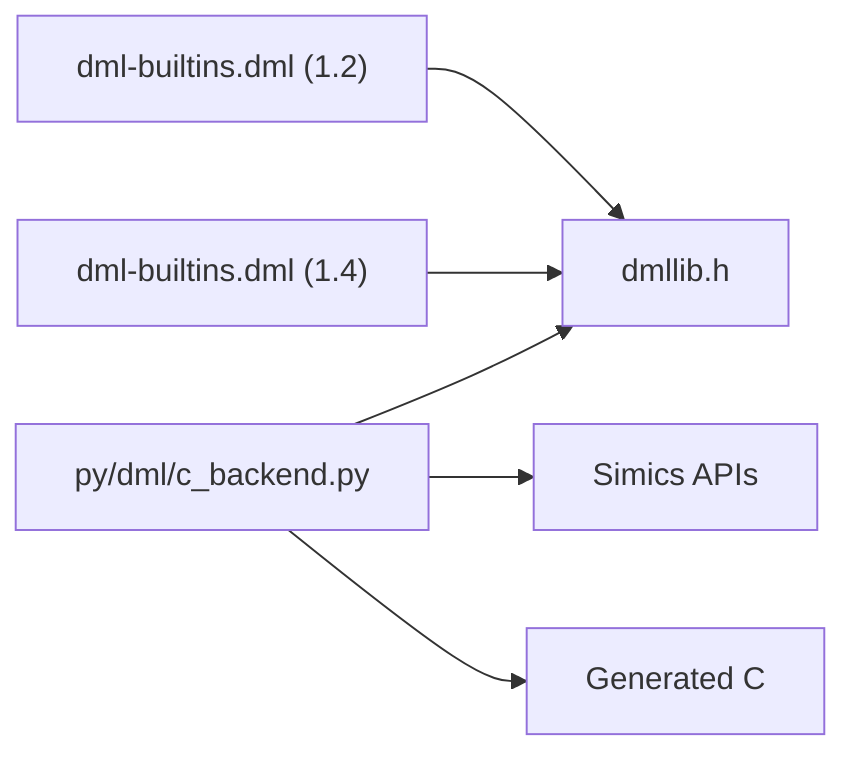

# Simics Integration

<cite>
**Referenced Files in This Document**
- [dmllib.h](file://include/simics/dmllib.h)
- [simics-api.dml](file://lib/1.2/simics-api.dml)
- [simics-device.dml](file://lib/1.2/simics-device.dml)
- [simics-memory.dml](file://lib/1.2/simics-memory.dml)
- [simics-event.dml](file://lib/1.2/simics-event.dml)
- [simics-configuration.dml](file://lib/1.2/simics-configuration.dml)
- [io-memory.dml](file://lib/1.2/io-memory.dml)
- [dml-builtins.dml (1.2)](file://lib/1.2/dml-builtins.dml)
- [dml-builtins.dml (1.4)](file://lib/1.4/dml-builtins.dml)
- [utility.dml](file://lib/1.2/utility.dml)
- [c_backend.py](file://py/dml/c_backend.py)
- [codegen.py](file://py/dml/codegen.py)
- [introduction.md (1.4)](file://doc/1.4/introduction.md)
- [language.md (1.4)](file://doc/1.4/language.md)
- [tests.py](file://test/tests.py)
</cite>

## Table of Contents
1. [Introduction](#introduction)
2. [Project Structure](#project-structure)
3. [Core Components](#core-components)
4. [Architecture Overview](#architecture-overview)
5. [Detailed Component Analysis](#detailed-component-analysis)
6. [Dependency Analysis](#dependency-analysis)
7. [Performance Considerations](#performance-considerations)
8. [Troubleshooting Guide](#troubleshooting-guide)
9. [Conclusion](#conclusion)
10. [Appendices](#appendices)

## Introduction
This document explains how the Device Modeling Language (DML) integrates with the Intel Simics simulator ecosystem. It covers how DML-generated C code binds to Simics APIs, how device registration and memory mapping are performed, how the DML runtime interacts with Simics’ event system, and how the dmllib.h header enables device model integration. It also documents configuration management, runtime behavior, performance characteristics, debugging/logging, and practical examples for integrating compiled DML devices into Simics projects.

## Project Structure
The repository organizes DML language features, standard libraries, and Python code generation into distinct areas:
- Language and standard libraries: DML modules under lib/1.x that define Simics interfaces and device abstractions.
- Runtime utilities: dmllib.h under include/simics that provides helpers for bounds checking, logging, endian conversions, and serialization.
- Python backend: The dmlc compiler backend under py/dml generates C code from DML models and emits Simics-compatible device registration and interfaces.
- Documentation: User-facing docs under doc/1.4 describing the language and usage.
- Tests: Test harness under test/ that compiles and links DML devices against Simics and runs them.

**Diagram sources**
- [dml-builtins.dml (1.2)](file://lib/1.2/dml-builtins.dml#L14-L16)
- [dml-builtins.dml (1.4)](file://lib/1.4/dml-builtins.dml#L13-L15)
- [dmllib.h](file://include/simics/dmllib.h#L1-L30)
- [c_backend.py](file://py/dml/c_backend.py#L1-L30)
- [tests.py](file://test/tests.py#L685-L718)

**Section sources**
- [dml-builtins.dml (1.2)](file://lib/1.2/dml-builtins.dml#L14-L16)
- [dml-builtins.dml (1.4)](file://lib/1.4/dml-builtins.dml#L13-L15)
- [dmllib.h](file://include/simics/dmllib.h#L1-L30)
- [c_backend.py](file://py/dml/c_backend.py#L1-L30)
- [tests.py](file://test/tests.py#L685-L718)

## Core Components
- dmllib.h: Provides runtime utilities for DML devices, including assertions, logging, endian conversions, and identity/serialization helpers used by generated C code.
- Standard DML libraries: Define Simics interfaces (device, memory, event, configuration) and device implementations (e.g., io_memory).
- Python backend: Generates C code from DML models, emitting device registration, attribute registration, and interface implementations compatible with Simics.
- Built-in templates and utilities: Provide standardized behaviors for registers, fields, and logging.

Key integration points:
- Generated C code includes dmllib.h and uses Simics APIs for logging, attributes, and configuration.
- DML banks and registers map to Simics interfaces such as io_memory and register_view.
- Events and steps integrate with Simics’ time queue and processor interfaces.

**Section sources**
- [dmllib.h](file://include/simics/dmllib.h#L38-L122)
- [simics-api.dml](file://lib/1.2/simics-api.dml#L102-L107)
- [io-memory.dml](file://lib/1.2/io-memory.dml#L15-L49)
- [dml-builtins.dml (1.2)](file://lib/1.2/dml-builtins.dml#L14-L16)
- [dml-builtins.dml (1.4)](file://lib/1.4/dml-builtins.dml#L13-L15)

## Architecture Overview
The DML-to-Simics pipeline:
- DML source defines device, banks, registers, fields, connects, and implements.
- dmlc compiles DML to C using the Python backend; generated C includes dmllib.h.
- The generated C registers the device class with Simics, exposes attributes and interfaces, and implements io_memory/register_view/etc.
- At runtime, Simics invokes generated methods; dmllib.h provides logging, endian conversion, and safety checks.

**Diagram sources**
- [c_backend.py](file://py/dml/c_backend.py#L1583-L1618)
- [dmllib.h](file://include/simics/dmllib.h#L88-L107)
- [io-memory.dml](file://lib/1.2/io-memory.dml#L15-L49)

**Section sources**
- [c_backend.py](file://py/dml/c_backend.py#L1583-L1618)
- [dmllib.h](file://include/simics/dmllib.h#L88-L107)
- [io-memory.dml](file://lib/1.2/io-memory.dml#L15-L49)

## Detailed Component Analysis

### Device Registration and Attribute Management
- The Python backend builds the device C struct and prints device substructures, registering attributes and flags according to DML parameters.
- Attribute flags encode whether attributes are required, optional, pseudo, persistent, or internal.
- The backend emits device initialization and finalization routines and attaches notifier callbacks.

**Diagram sources**
- [c_backend.py](file://py/dml/c_backend.py#L39-L59)
- [c_backend.py](file://py/dml/c_backend.py#L1583-L1618)

**Section sources**
- [c_backend.py](file://py/dml/c_backend.py#L39-L59)
- [c_backend.py](file://py/dml/c_backend.py#L1583-L1618)

### Memory Management Integration and io_memory Implementation
- DML banks implement the io_memory interface to handle memory transactions.
- The io-memory.dml implementation routes transactions to appropriate banks based on function numbers and maps addresses to register offsets.
- Generated C code relies on dmllib.h for endian conversions and raw loads/stores.

**Diagram sources**
- [io-memory.dml](file://lib/1.2/io-memory.dml#L15-L49)
- [dmllib.h](file://include/simics/dmllib.h#L644-L666)

**Section sources**
- [io-memory.dml](file://lib/1.2/io-memory.dml#L15-L49)
- [dmllib.h](file://include/simics/dmllib.h#L644-L666)

### Event System Coordination
- DML events integrate with Simics cycle and step interfaces.
- The Python backend emits state-change notifications after DML-controlled transitions, ensuring Simics reacts to model-driven state changes.

**Diagram sources**
- [c_backend.py](file://py/dml/c_backend.py#L83-L96)
- [simics-event.dml](file://lib/1.2/simics-event.dml#L8-L9)

**Section sources**
- [c_backend.py](file://py/dml/c_backend.py#L83-L96)
- [simics-event.dml](file://lib/1.2/simics-event.dml#L8-L9)

### API Binding Generation and dmllib.h Role
- dmllib.h centralizes runtime utilities used by generated C:
  - Assertions and fatal error signaling.
  - Logging wrappers that adapt to older Simics base versions.
  - Endian conversion helpers for raw loads/stores and typed conversions.
  - Identity serialization/deserialization for checkpointing.
- DML built-ins import dmllib.h and use its helpers for consistent behavior across devices.

**Diagram sources**
- [dmllib.h](file://include/simics/dmllib.h#L38-L122)
- [dmllib.h](file://include/simics/dmllib.h#L644-L666)
- [dmllib.h](file://include/simics/dmllib.h#L691-L777)
- [dml-builtins.dml (1.2)](file://lib/1.2/dml-builtins.dml#L14-L16)
- [dml-builtins.dml (1.4)](file://lib/1.4/dml-builtins.dml#L13-L15)

**Section sources**
- [dmllib.h](file://include/simics/dmllib.h#L38-L122)
- [dmllib.h](file://include/simics/dmllib.h#L644-L666)
- [dmllib.h](file://include/simics/dmllib.h#L691-L777)
- [dml-builtins.dml (1.2)](file://lib/1.2/dml-builtins.dml#L14-L16)
- [dml-builtins.dml (1.4)](file://lib/1.4/dml-builtins.dml#L13-L15)

### Configuration Management and Runtime Behavior
- DML attributes map to Simics configuration attributes with flags controlling persistence, internal visibility, and requirement.
- The Python backend computes attribute flags and ensures uniqueness across ports and device scope.
- Logging levels and groups are defined in standard libraries and used by built-in templates and dmllib.h.

**Section sources**
- [c_backend.py](file://py/dml/c_backend.py#L39-L59)
- [c_backend.py](file://py/dml/c_backend.py#L97-L110)
- [simics-configuration.dml](file://lib/1.2/simics-configuration.dml#L8-L15)
- [utility.dml](file://lib/1.2/utility.dml#L114-L149)

### Practical Examples: Integrating Compiled DML Devices into Simics
- The test harness compiles DML to C, links against Simics libraries, and runs Simics with a generated script.
- Typical steps include compiling the generated .o, linking with Simics shared libraries, and invoking Simics with a test script.

**Diagram sources**
- [tests.py](file://test/tests.py#L685-L718)

**Section sources**
- [tests.py](file://test/tests.py#L685-L718)

## Dependency Analysis
- DML built-ins import dmllib.h and Simics interfaces.
- Python backend depends on AST, code generation, and output modules to emit C.
- Generated C depends on dmllib.h and Simics headers for logging, attributes, and configuration.

**Diagram sources**
- [dml-builtins.dml (1.2)](file://lib/1.2/dml-builtins.dml#L14-L16)
- [dml-builtins.dml (1.4)](file://lib/1.4/dml-builtins.dml#L13-L15)
- [dmllib.h](file://include/simics/dmllib.h#L1-L30)
- [c_backend.py](file://py/dml/c_backend.py#L1-L30)

**Section sources**
- [dml-builtins.dml (1.2)](file://lib/1.2/dml-builtins.dml#L14-L16)
- [dml-builtins.dml (1.4)](file://lib/1.4/dml-builtins.dml#L13-L15)
- [dmllib.h](file://include/simics/dmllib.h#L1-L30)
- [c_backend.py](file://py/dml/c_backend.py#L1-L30)

## Performance Considerations
- Endian conversion helpers minimize overhead for raw loads/stores in generated code.
- Template-based register behaviors reduce branching and logging overhead when using read_only, ignore_write, and similar patterns.
- Using unmapped registers sparingly avoids unnecessary checkpointing overhead; prefer saved/session variables for internal state.
- Minimizing deep object hierarchies and excessive logging reduces runtime overhead.

[No sources needed since this section provides general guidance]

## Troubleshooting Guide
- Logging integration: Use dmllib.h logging wrappers and DML log groups to capture warnings and spec violations.
- Assertion failures: DML runtime assertions trigger fatal errors with filename and line number.
- Serialization issues: Identity serialization/deserialization helpers ensure checkpoint correctness; mismatches in dimensions or indices produce explicit errors.
- Compatibility: dmllib.h adapts logging to older Simics base versions using API function indirection.

**Section sources**
- [dmllib.h](file://include/simics/dmllib.h#L88-L107)
- [dmllib.h](file://include/simics/dmllib.h#L109-L113)
- [dmllib.h](file://include/simics/dmllib.h#L691-L777)
- [utility.dml](file://lib/1.2/utility.dml#L114-L149)

## Conclusion
DML integrates tightly with Simics through a robust code generation pipeline and a shared runtime library. dmllib.h provides essential utilities for logging, assertions, and serialization, while standard DML libraries define Simics interfaces for devices, memory, events, and configuration. The Python backend emits Simics-compatible C that registers devices, manages attributes, and implements io_memory and register views. Following the guidance herein enables reliable integration, efficient performance, and effective debugging of DML models in Simics.

[No sources needed since this section summarizes without analyzing specific files]

## Appendices

### Appendix A: Key Interfaces and Their Roles
- io_memory: Handles memory-mapped register access and routing to banks.
- register_view/register_view_read_only: Exposes registers to Simics UI and scripting.
- cycle/step: Enables DML events integrated with Simics’ time queue.
- checkpoint/log_object: Manages serialization and logging groups.

**Section sources**
- [io-memory.dml](file://lib/1.2/io-memory.dml#L15-L49)
- [simics-event.dml](file://lib/1.2/simics-event.dml#L8-L9)
- [simics-configuration.dml](file://lib/1.2/simics-configuration.dml#L8-L15)
- [dml-builtins.dml (1.4)](file://lib/1.4/dml-builtins.dml#L17-L25)

### Appendix B: Practical Integration Steps
- Compile DML to C using dmlc.
- Compile the generated C to an object file.
- Link with Simics shared libraries.
- Run Simics with a test script that instantiates the device and exercises its interfaces.

**Section sources**
- [tests.py](file://test/tests.py#L685-L718)