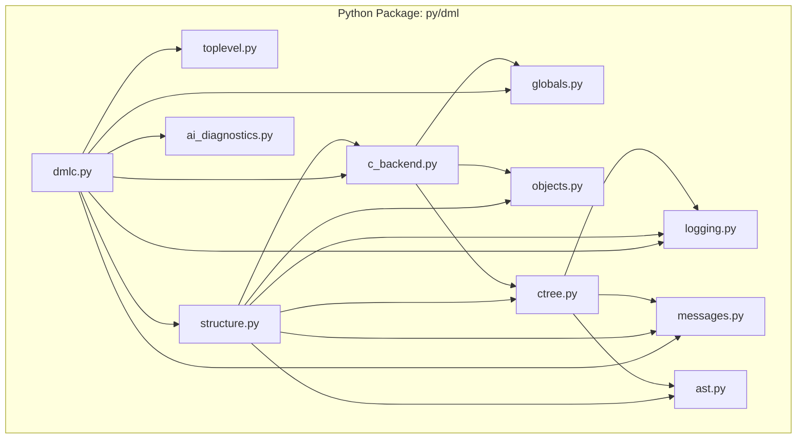
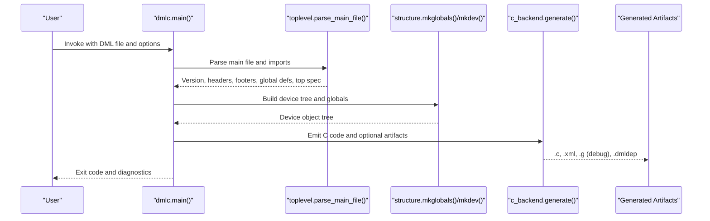
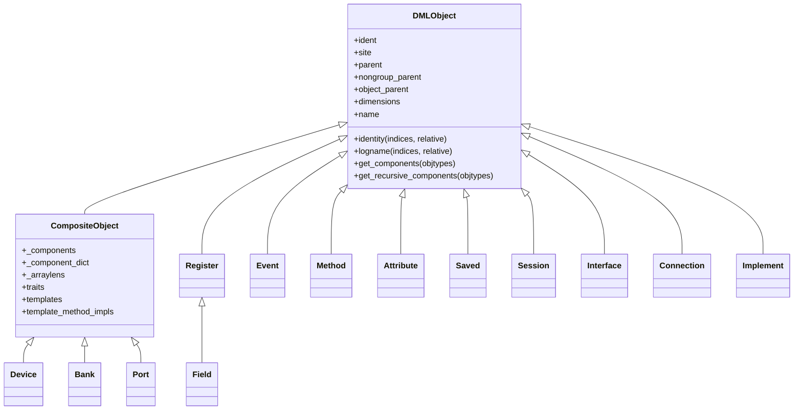
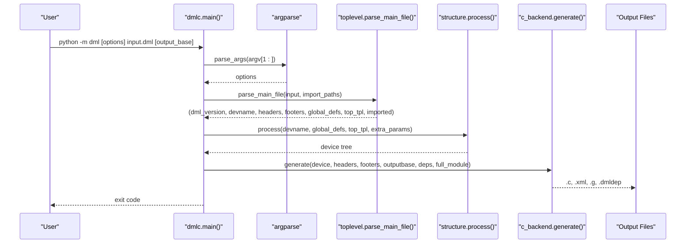
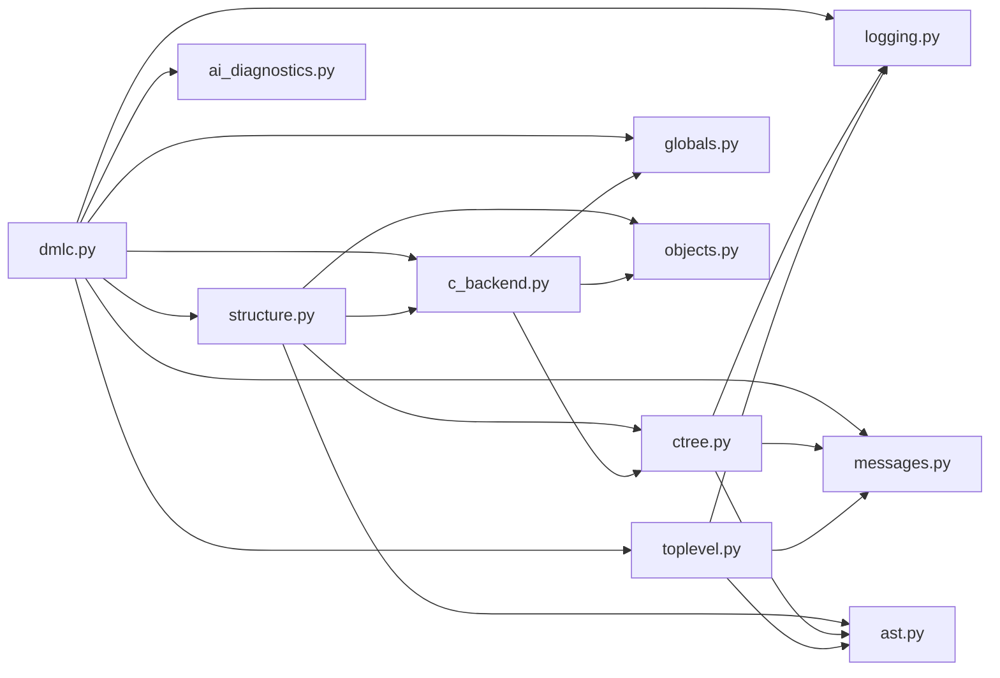

# API Documentation

<cite>
**Referenced Files in This Document**
- [README.md](file://README.md)
- [py/README.md](file://py/README.md)
- [py/__main__.py](file://py/__main__.py)
- [py/dml/__init__.py](file://py/dml/__init__.py)
- [py/dml/dmlc.py](file://py/dml/dmlc.py)
- [py/dml/toplevel.py](file://py/dml/toplevel.py)
- [py/dml/structure.py](file://py/dml/structure.py)
- [py/dml/logging.py](file://py/dml/logging.py)
- [py/dml/messages.py](file://py/dml/messages.py)
- [py/dml/objects.py](file://py/dml/objects.py)
- [py/dml/ast.py](file://py/dml/ast.py)
- [py/dml/ctree.py](file://py/dml/ctree.py)
- [py/dml/c_backend.py](file://py/dml/c_backend.py)
- [py/dml/globals.py](file://py/dml/globals.py)
- [py/dml/ai_diagnostics.py](file://py/dml/ai_diagnostics.py)
</cite>

## Table of Contents
1. [Introduction](#introduction)
2. [Project Structure](#project-structure)
3. [Core Components](#core-components)
4. [Architecture Overview](#architecture-overview)
5. [Detailed Component Analysis](#detailed-component-analysis)
6. [Dependency Analysis](#dependency-analysis)
7. [Performance Considerations](#performance-considerations)
8. [Troubleshooting Guide](#troubleshooting-guide)
9. [Conclusion](#conclusion)
10. [Appendices](#appendices)

## Introduction
This document provides comprehensive API documentation for the Device Modeling Language (DML) compiler. It covers:
- The Python API surface exposed by the compiler’s modules
- The command-line interface (CLI) with all options, usage examples, and configuration parameters
- Environment variables, configuration files, and build system integration
- Practical examples for common API usage patterns, error handling, and integration approaches
- Migration guidance for API changes and version compatibility
- Performance considerations, debugging capabilities, and troubleshooting

The DML compiler transforms DML device models into C code for a target simulator. The Python modules implement parsing, semantic analysis, code generation, and CLI orchestration.

## Project Structure
The repository organizes the DML compiler primarily under the py/dml/ directory. Key modules include:
- dmlc.py: CLI entry point and driver
- toplevel.py: Top-level parsing and import expansion
- structure.py: Global collection, template instantiation, and object tree construction
- logging.py and messages.py: Error/warning reporting and message taxonomy
- objects.py: DML object model (Device, Register, Field, etc.)
- ast.py: Abstract syntax tree representation
- ctree.py: Intermediate representation of generated code
- c_backend.py: Backend that emits C code from the object tree
- globals.py: Global state and flags used across compilation
- ai_diagnostics.py: Structured AI-friendly diagnostics

**Diagram sources**
- [py/dml/dmlc.py](file://py/dml/dmlc.py#L1-L811)
- [py/dml/toplevel.py](file://py/dml/toplevel.py#L1-L459)
- [py/dml/structure.py](file://py/dml/structure.py#L1-L3154)
- [py/dml/logging.py](file://py/dml/logging.py#L1-L468)
- [py/dml/messages.py](file://py/dml/messages.py#L1-L2779)
- [py/dml/objects.py](file://py/dml/objects.py#L1-L642)
- [py/dml/ast.py](file://py/dml/ast.py#L1-L172)
- [py/dml/ctree.py](file://py/dml/ctree.py#L1-L5512)
- [py/dml/c_backend.py](file://py/dml/c_backend.py#L1-L3552)
- [py/dml/globals.py](file://py/dml/globals.py#L1-L107)
- [py/dml/ai_diagnostics.py](file://py/dml/ai_diagnostics.py#L1-L391)

**Section sources**
- [py/README.md](file://py/README.md#L1-L134)

## Core Components
This section documents the primary Python APIs and CLI entry points.

- CLI entry point
  - Module: py/dml/dmlc.py
  - Function: main(argv)
  - Purpose: Parse CLI arguments, configure compilation flags, orchestrate parsing and code generation, and return appropriate exit codes.
  - Typical usage: python -m dml dml_file output_base

- Top-level parsing and import handling
  - Module: py/dml/toplevel.py
  - Functions: get_parser(version, tabmodule, debugfile), parse_main_file(filename, import_paths), produce_dmlast(...)
  - Purpose: Determine DML version, load lexer/parser, parse the main file, expand imports, and categorize top-level statements.

- Structure and object tree construction
  - Module: py/dml/structure.py
  - Functions: mkglobals(stmts), mkdev(devname, specs), mkobj(...), check_types(...)
  - Purpose: Collect global constants/types, instantiate templates, build the DML object tree, and manage register maps and methods.

- Logging and diagnostics
  - Module: py/dml/logging.py
  - Classes: LogMessage, DMLError, DMLWarning, ICE, ErrorContext
  - Functions: report(msg), set_include_tag(flag), ignore_warning(tag), enable_warning(tag), is_warning_tag(tag)
  - Purpose: Centralized reporting of errors and warnings, with context propagation and tagging.

- Messages taxonomy
  - Module: py/dml/messages.py
  - Classes: Specific error/warning classes (e.g., EAFTER, ECYCLICIMP, EAMBINH, EUNDEF, etc.)
  - Purpose: Define structured diagnostics for common DML errors and warnings.

- DML object model
  - Module: py/dml/objects.py
  - Classes: DMLObject, Device, Register, Field, Bank, Port, Event, Method, Attribute, Saved, Session, Interface, Connection, Implement
  - Purpose: Represent the DML device model as a typed object hierarchy.

- AST representation
  - Module: py/dml/ast.py
  - Classes: AST, dispatcher helpers
  - Purpose: Provide a uniform representation of parsed DML constructs.

- Intermediate code representation
  - Module: py/dml/ctree.py
  - Factories and classes for statements and expressions used in code generation
  - Purpose: Build a typed IR for C emission.

- C backend
  - Module: py/dml/c_backend.py
  - Functions: generate(device, headers, footers, outputbase, deps, full_module_flag)
  - Purpose: Emit C code from the DML object tree, including device struct layouts, method implementations, and Simics API bindings.

- Global state
  - Module: py/dml/globals.py
  - Variables: dml_version, api_version, debuggable, coverity, linemarks_enabled, enable_testing_features, etc.
  - Purpose: Store cross-module configuration and runtime flags.

- AI diagnostics
  - Module: py/dml/ai_diagnostics.py
  - Classes: AIDiagnostic, ErrorCategory
  - Functions: enable_ai_logging(), write_json_file(path)
  - Purpose: Export structured diagnostics in JSON for AI-assisted code generation and error correction.

**Section sources**
- [py/dml/dmlc.py](file://py/dml/dmlc.py#L309-L800)
- [py/dml/toplevel.py](file://py/dml/toplevel.py#L48-L200)
- [py/dml/structure.py](file://py/dml/structure.py#L74-L200)
- [py/dml/logging.py](file://py/dml/logging.py#L67-L200)
- [py/dml/messages.py](file://py/dml/messages.py#L27-L200)
- [py/dml/objects.py](file://py/dml/objects.py#L31-L200)
- [py/dml/ast.py](file://py/dml/ast.py#L7-L172)
- [py/dml/ctree.py](file://py/dml/ctree.py#L29-L200)
- [py/dml/c_backend.py](file://py/dml/c_backend.py#L1-L200)
- [py/dml/globals.py](file://py/dml/globals.py#L1-L107)
- [py/dml/ai_diagnostics.py](file://py/dml/ai_diagnostics.py#L1-L200)

## Architecture Overview
The DML compiler follows a staged pipeline:
- CLI parsing and configuration
- Top-level parsing and import resolution
- AST construction and semantic analysis
- Object tree construction and validation
- Code generation to C
- Optional auxiliary outputs (info XML, debug artifacts)

**Diagram sources**
- [py/dml/dmlc.py](file://py/dml/dmlc.py#L676-L788)
- [py/dml/toplevel.py](file://py/dml/toplevel.py#L114-L186)
- [py/dml/structure.py](file://py/dml/structure.py#L74-L100)
- [py/dml/c_backend.py](file://py/dml/c_backend.py#L1-L200)

## Detailed Component Analysis

### Command-Line Interface (CLI)
The CLI is implemented in py/dml/dmlc.py and exposes numerous options for controlling parsing, warnings, compatibility, and output.

Key options:
- -I PATH: Add to import search path
- -D NAME=VALUE: Define compile-time constants
- --dep TARGET: Emit makefile dependencies
- --no-dep-phony: Suppress phony dependency targets
- --dep-target TARGET: Change dependency rule target(s)
- -T: Show warning tags
- -g: Generate debuggable artifacts and C code aligned with DML
- --warn TAG and --nowarn TAG: Control warnings
- --werror: Turn warnings into errors
- --strict-dml12 and --strict-int: Aliases for strict compatibility modes
- --coverity: Add Coverity annotations to suppress false positives
- --noline: Suppress line directives in generated C
- --info: Generate XML register layout
- --simics-api VERSION: Select Simics API version
- --max-errors N: Limit error count
- --no-compat TAG: Disable compatibility features
- --help-no-compat: List compatibility tags
- --ai-json FILE: Export AI-friendly JSON diagnostics
- -P FILE: Append porting messages for DML 1.4 migration
- --state-change-dml12: Enable state-change notifications for DML 1.2
- --split-c-file N: Split generated C files by size threshold
- --enable-features-for-internal-testing-dont-use-this: Internal-only features
- positional: input_filename, output_base

Behavior highlights:
- Parses -D definitions into template parameters
- Supports dependency generation and phony targets
- Configures warning filters and error thresholds
- Applies compatibility flags and strictness modes
- Emits C code, optional debug .g file, and info XML
- Writes AI diagnostics JSON when requested

Usage examples:
- Basic compilation: python -m dml device.dml device
- With dependencies: python -m dml --dep device.dmldep device.dml device
- Strict DML 1.2 mode: python -m dml --strict-dml12 device.dml device
- AI diagnostics: python -m dml --ai-json diagnostics.json device.dml device

Environment variables:
- DMLC_DIR: Point to locally built compiler binaries
- DMLC_DEBUG: Echo unexpected exceptions instead of writing dmlc-error.log
- DMLC_PROFILE: Enable profiling and write .prof
- DMLC_CC: Override default compiler in tests
- DMLC_DUMP_INPUT_FILES: Produce a tar.bz2 with all DML sources for reproducibility
- DMLC_GATHER_SIZE_STATISTICS: Output size statistics for code generation

Build system integration:
- Use --dep to generate dependency files consumed by make
- Use --dep-target to customize targets
- Use --no-dep-phony to avoid phony targets if desired

**Section sources**
- [py/dml/dmlc.py](file://py/dml/dmlc.py#L309-L800)
- [README.md](file://README.md#L46-L117)

### Python API Reference

#### dmlc module
- main(argv)
  - Purpose: Parse CLI, configure globals, orchestrate parsing and code generation, and return exit code
  - Parameters: argv (list[str]) — command-line arguments
  - Returns: int — exit code (0 on success, 2 on fatal error, 3 on unexpected error)
  - Side effects: Sets global flags, writes artifacts, logs diagnostics

- process(devname, global_defs, top_tpl, extra_params)
  - Purpose: Instantiate templates and build the device tree
  - Parameters:
    - devname (str)
    - global_defs (list)
    - top_tpl (str)
    - extra_params (dict[str, AST node] or None)
  - Returns: Device object tree

- parse_define(arg)
  - Purpose: Parse -D NAME=VALUE into AST nodes
  - Parameters: arg (str)
  - Returns: (name, value_node)

- print_cdep(outputbase, headers, footers)
  - Purpose: Emit a minimal C file mirroring imports for dependency generation

- dump_input_files(outputbase, imported)
  - Purpose: Archive all DML sources and relative imports into a tarball for reproducibility

- flush_porting_log(tmpfile, porting_filename)
  - Purpose: Append accumulated porting messages to a file using a directory-based lock

- Unexpected error handler: unexpected_error(exc_type, exc_value, exc_traceback)
  - Purpose: Dump stack trace to dmlc-error.log and print a user-facing message in debug mode

- Timing utilities: logtime(label)
  - Purpose: Measure stage durations when enabled

- Tracing: mytrace(frame, event, arg)
  - Purpose: Trace selected codegen/c_backend frames for debugging

- Classes:
  - HelpAction, WarnHelpAction, CompatHelpAction
    - Custom argparse actions to print help for warning tags and compatibility features

**Section sources**
- [py/dml/dmlc.py](file://py/dml/dmlc.py#L27-L800)

#### toplevel module
- get_parser(version, tabmodule, debugfile)
  - Purpose: Obtain lexer/parser for a given DML version
  - Returns: (lexer, parser)

- determine_version(filestr, filename)
  - Purpose: Detect DML version from file content or emit warnings
  - Returns: (version, filestr)

- parse(s, file_info, filename, version)
  - Purpose: Parse string content into AST

- scan_statements(filename, site, stmts)
  - Purpose: Categorize top-level statements into imports, headers, footers, global-defs, and device spec ASTs

- produce_dmlast(...)
  - Purpose: Serialize AST for reuse

- parse_main_file(filename, import_paths)
  - Purpose: Load main file, determine version, expand imports, and return structured components

**Section sources**
- [py/dml/toplevel.py](file://py/dml/toplevel.py#L48-L200)

#### structure module
- mkglobals(stmts)
  - Purpose: Collect global constants and typedefs, resolve duplicates, and populate global scope
  - Returns: None

- mkdev(devname, specs)
  - Purpose: Instantiate top-level device specification and return Device object

- mkobj(...)
  - Purpose: Traverse AST and construct DML object tree, merge definitions, and compute parameter values

- check_types(...)
  - Purpose: Validate typedefs and related type constructs

- check_unused_and_warn(device)
  - Purpose: Report unused parameters and related diagnostics

**Section sources**
- [py/dml/structure.py](file://py/dml/structure.py#L74-L200)

#### logging and messages modules
- LogMessage, DMLError, DMLWarning, ICE
  - Purpose: Base classes for diagnostics with site-aware reporting and context propagation

- ErrorContext
  - Purpose: Track current node and site during compilation for richer error messages

- report(msg)
  - Purpose: Emit formatted diagnostics and update failure counters

- Warning controls
  - is_warning_tag(tag)
  - ignore_warning(tag)
  - enable_warning(tag)
  - warning_is_ignored(tag)
  - set_include_tag(val)

- Messages taxonomy
  - Extensive set of specialized error/warning classes for DML constructs and compatibility issues

**Section sources**
- [py/dml/logging.py](file://py/dml/logging.py#L67-L200)
- [py/dml/messages.py](file://py/dml/messages.py#L27-L200)

#### objects module
- DMLObject and subclasses
  - Device, Register, Field, Bank, Port, Event, Method, Attribute, Saved, Session, Interface, Connection, Implement
  - Purpose: Represent the DML device model with hierarchical composition and metadata

- Properties and methods
  - Identity computation, qualified names, indexing, recursion, and component traversal

**Section sources**
- [py/dml/objects.py](file://py/dml/objects.py#L31-L200)

#### ast module
- AST class and helpers
  - Purpose: Provide a uniform representation of DML constructs with site and args accessors

**Section sources**
- [py/dml/ast.py](file://py/dml/ast.py#L7-L172)

#### ctree module
- IR for statements and expressions
  - Purpose: Build typed IR used by the C backend for code emission

- Factories and classes
  - mkCompound, mkIf, mkReturn, mkAssignStatement, mkAdd, mkCast, mkNodeRef, etc.

**Section sources**
- [py/dml/ctree.py](file://py/dml/ctree.py#L29-L200)

#### c_backend module
- generate(device, headers, footers, outputbase, deps, full_module_flag)
  - Purpose: Emit C code for the device model, including device struct layouts, method implementations, and API bindings

- Helpers
  - get_attr_flags, get_short_doc, get_long_doc, output_dml_state_change, register_attribute
  - Struct emission and type handling

**Section sources**
- [py/dml/c_backend.py](file://py/dml/c_backend.py#L1-L200)

#### globals module
- Global flags and state
  - dml_version, api_version, debuggable, coverity, linemarks_enabled, enable_testing_features
  - Static variables, compatibility sets, and type sequence infos

**Section sources**
- [py/dml/globals.py](file://py/dml/globals.py#L1-L107)

#### ai_diagnostics module
- AIDiagnostic
  - Purpose: Convert LogMessage instances into structured diagnostics with categories and severity

- ErrorCategory
  - Purpose: Standardized categories for AI consumption

- enable_ai_logging()
  - Purpose: Initialize AI logging context

- write_json_file(path)
  - Purpose: Persist AI diagnostics to JSON

**Section sources**
- [py/dml/ai_diagnostics.py](file://py/dml/ai_diagnostics.py#L1-L200)

### Object Model Overview
The DML object model forms a typed hierarchy representing the device structure.

**Diagram sources**
- [py/dml/objects.py](file://py/dml/objects.py#L31-L200)

**Section sources**
- [py/dml/objects.py](file://py/dml/objects.py#L31-L200)

### CLI Workflow Sequence
This sequence illustrates the end-to-end CLI flow.

**Diagram sources**
- [py/dml/dmlc.py](file://py/dml/dmlc.py#L676-L788)
- [py/dml/toplevel.py](file://py/dml/toplevel.py#L114-L186)
- [py/dml/structure.py](file://py/dml/structure.py#L72-L100)
- [py/dml/c_backend.py](file://py/dml/c_backend.py#L1-L200)

## Dependency Analysis
The following diagram shows key module dependencies:

**Diagram sources**
- [py/dml/dmlc.py](file://py/dml/dmlc.py#L11-L25)
- [py/dml/structure.py](file://py/dml/structure.py#L13-L37)
- [py/dml/c_backend.py](file://py/dml/c_backend.py#L15-L29)
- [py/dml/ctree.py](file://py/dml/ctree.py#L14-L26)
- [py/dml/toplevel.py](file://py/dml/toplevel.py#L17-L25)

**Section sources**
- [py/dml/dmlc.py](file://py/dml/dmlc.py#L11-L25)
- [py/dml/structure.py](file://py/dml/structure.py#L13-L37)
- [py/dml/c_backend.py](file://py/dml/c_backend.py#L15-L29)
- [py/dml/ctree.py](file://py/dml/ctree.py#L14-L26)
- [py/dml/toplevel.py](file://py/dml/toplevel.py#L17-L25)

## Performance Considerations
- Profiling
  - DMLC_PROFILE: Enables cProfile and writes a .prof file
  - DMLC_DEBUG: Prints stack traces on unexpected errors instead of hiding them
  - DMLC_DUMP_INPUT_FILES: Produces a tar.bz2 archive for isolated reproduction
  - DMLC_GATHER_SIZE_STATISTICS: Emits size statistics for code generation to guide optimization

- Compilation stages
  - Parsing, processing, info XML generation, and C emission are timed via logtime when enabled

- Code splitting
  - --split-c-file N: Split generated C files by a size threshold to improve incremental builds

- Compatibility and strictness
  - --strict-dml12 and --strict-int reduce permissive compatibility features, potentially simplifying code generation

- Dependency generation
  - --dep and --dep-target minimize rebuild churn; --no-dep-phony adds phony targets for better make integration

**Section sources**
- [README.md](file://README.md#L75-L117)
- [py/dml/dmlc.py](file://py/dml/dmlc.py#L56-L71)
- [py/dml/dmlc.py](file://py/dml/dmlc.py#L498-L501)

## Troubleshooting Guide
Common issues and resolutions:
- Missing DML version statement
  - Symptom: ESYNTAX indicating missing version
  - Resolution: Add a DML version tag at the top of the file or enable optional version compatibility

- Cyclic imports
  - Symptom: ECYCLICIMP
  - Resolution: Break the import cycle by refactoring shared code into a separate file

- Template resolution conflicts
  - Symptom: EAMBINH or ECYCLICTEMPLATE
  - Resolution: Add explicit is statements to disambiguate template precedence

- Undefined symbols
  - Symptom: EUNDEF or ENOSYM
  - Resolution: Ensure symbols are defined in imported files or add necessary imports

- Excessive warnings
  - Resolution: Use --nowarn TAG to disable specific warnings, or --warn TAG to enable targeted ones

- AI diagnostics
  - Resolution: Use --ai-json FILE to capture structured diagnostics for automated fixes

- Unexpected errors
  - Resolution: Enable DMLC_DEBUG to print stack traces; DMLC_DUMP_INPUT_FILES to gather reproducible sources

**Section sources**
- [py/dml/messages.py](file://py/dml/messages.py#L115-L140)
- [py/dml/messages.py](file://py/dml/messages.py#L141-L200)
- [py/dml/logging.py](file://py/dml/logging.py#L51-L66)
- [README.md](file://README.md#L75-L117)
- [py/dml/ai_diagnostics.py](file://py/dml/ai_diagnostics.py#L1-L200)

## Conclusion
The DML compiler provides a robust Python API and CLI for transforming DML device models into C code. The modular design separates parsing, semantic analysis, and code generation, enabling extensibility and maintainability. The CLI offers comprehensive control over warnings, compatibility, and output, while the Python modules expose powerful primitives for integration and automation. AI diagnostics and performance tools further enhance developer productivity and code quality.

## Appendices

### Appendix A: CLI Option Reference
- -I PATH: Add import search path
- -D NAME=VALUE: Define compile-time constants
- --dep TARGET: Emit makefile dependencies
- --no-dep-phony: Avoid phony dependency targets
- --dep-target TARGET: Customize dependency rule targets
- -T: Show warning tags
- -g: Generate debuggable artifacts
- --warn TAG, --nowarn TAG: Control warnings
- --werror: Treat warnings as errors
- --strict-dml12, --strict-int: Strict compatibility modes
- --coverity: Add Coverity annotations
- --noline: Suppress line directives
- --info: Generate XML register layout
- --simics-api VERSION: Select Simics API version
- --max-errors N: Limit error count
- --no-compat TAG: Disable compatibility features
- --help-no-compat: List compatibility tags
- --ai-json FILE: Export AI diagnostics JSON
- -P FILE: Append porting messages
- --state-change-dml12: Enable state-change notifications
- --split-c-file N: Split C files by size
- --enable-features-for-internal-testing-dont-use-this: Internal-only features
- positional: input.dml [output_base]

**Section sources**
- [py/dml/dmlc.py](file://py/dml/dmlc.py#L309-L800)

### Appendix B: Environment Variables
- DMLC_DIR: Path to locally built compiler binaries
- DMLC_DEBUG: Enable debug traces
- DMLC_PROFILE: Enable profiling
- DMLC_CC: Override compiler in tests
- DMLC_DUMP_INPUT_FILES: Produce reproducibility archive
- DMLC_GATHER_SIZE_STATISTICS: Emit code size statistics

**Section sources**
- [README.md](file://README.md#L46-L117)

### Appendix C: Entry Point
- Module: py/__main__.py
- Purpose: Invoke dmlc.main(argv) when running python -m dml

**Section sources**
- [py/__main__.py](file://py/__main__.py#L1-L8)