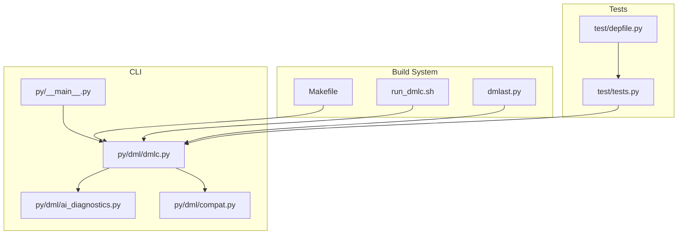
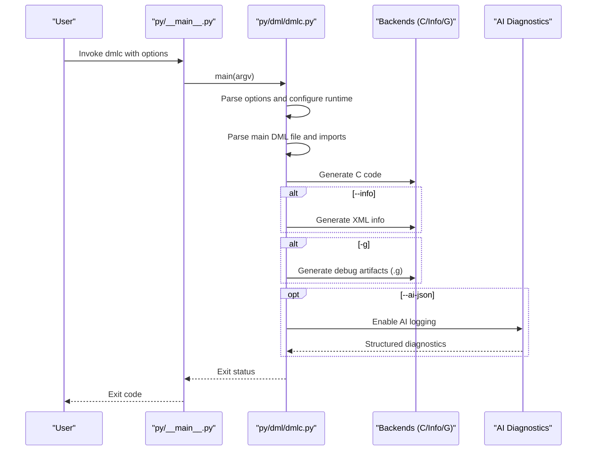
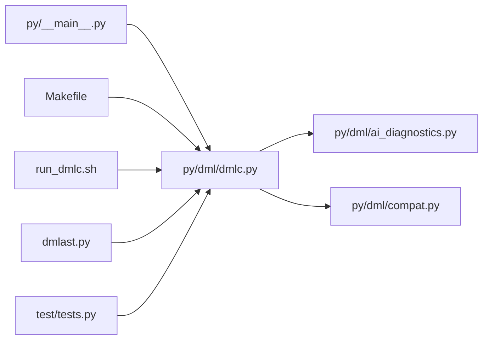

# Command-Line Interface

<cite>
**Referenced Files in This Document**
- [README.md](file://README.md)
- [run_dmlc.sh](file://run_dmlc.sh)
- [py/dml/dmlc.py](file://py/dml/dmlc.py)
- [py/dml/ai_diagnostics.py](file://py/dml/ai_diagnostics.py)
- [py/dml/compat.py](file://py/dml/compat.py)
- [py/__main__.py](file://py/__main__.py)
- [Makefile](file://Makefile)
- [test/tests.py](file://test/tests.py)
- [test/depfile.py](file://test/depfile.py)
- [dmlast.py](file://dmlast.py)
</cite>

## Table of Contents
1. [Introduction](#introduction)
2. [Project Structure](#project-structure)
3. [Core Components](#core-components)
4. [Architecture Overview](#architecture-overview)
5. [Detailed Component Analysis](#detailed-component-analysis)
6. [Dependency Analysis](#dependency-analysis)
7. [Performance Considerations](#performance-considerations)
8. [Troubleshooting Guide](#troubleshooting-guide)
9. [Conclusion](#conclusion)
10. [Appendices](#appendices)

## Introduction
This document describes the command-line interface of the DMLC compiler. It covers all command-line options, input/output handling, dependency generation, warning management, compatibility options, environment variables, configuration and debugging aids, and integration patterns with build systems such as Make, Ninja, and CMake. Practical examples and troubleshooting guidance are included to support common compilation scenarios and automated workflows.

## Project Structure
The DMLC compiler is implemented as a Python package with a single entry point. The CLI is defined in the main module and delegates to backend components for parsing, analysis, and code generation. Build system integration is provided via a Makefile and helper scripts.

**Diagram sources**
- [py/__main__.py](file://py/__main__.py#L1-L8)
- [py/dml/dmlc.py](file://py/dml/dmlc.py#L309-L800)
- [py/dml/ai_diagnostics.py](file://py/dml/ai_diagnostics.py#L1-L391)
- [py/dml/compat.py](file://py/dml/compat.py#L1-L200)
- [Makefile](file://Makefile#L1-L252)
- [run_dmlc.sh](file://run_dmlc.sh#L1-L67)
- [dmlast.py](file://dmlast.py#L1-L38)
- [test/tests.py](file://test/tests.py#L283-L319)
- [test/depfile.py](file://test/depfile.py#L1-L28)

**Section sources**
- [py/__main__.py](file://py/__main__.py#L1-L8)
- [py/dml/dmlc.py](file://py/dml/dmlc.py#L309-L800)
- [Makefile](file://Makefile#L1-L252)

## Core Components
- CLI entry point: Invokes the main function in the DMLC module.
- Argument parser: Defines all supported options and positional arguments.
- Backends: Parsing, AST processing, C code generation, info XML generation, and optional G backend for debug artifacts.
- AI diagnostics: Optional JSON export of structured diagnostics.
- Compatibility system: Feature flags controlling deprecated or version-specific behaviors.
- Build integration: Makefile targets and helper scripts for invoking DMLC.

Key responsibilities:
- Parse CLI options and configure runtime behavior (API version, warnings, compatibility, profiling).
- Resolve input DML file and compute output base name.
- Generate C code, optional info XML, and optional debug artifacts.
- Emit dependency files for build systems.
- Export AI-friendly diagnostics when requested.

**Section sources**
- [py/dml/dmlc.py](file://py/dml/dmlc.py#L309-L800)
- [py/dml/ai_diagnostics.py](file://py/dml/ai_diagnostics.py#L286-L391)
- [py/dml/compat.py](file://py/dml/compat.py#L1-L200)
- [py/__main__.py](file://py/__main__.py#L1-L8)

## Architecture Overview
The CLI orchestrates a pipeline: argument parsing → configuration → parsing → processing → code generation → optional diagnostics and artifacts.

**Diagram sources**
- [py/__main__.py](file://py/__main__.py#L1-L8)
- [py/dml/dmlc.py](file://py/dml/dmlc.py#L676-L760)
- [py/dml/ai_diagnostics.py](file://py/dml/ai_diagnostics.py#L286-L391)

## Detailed Component Analysis

### Command-Line Options
Below are all supported options with descriptions, typical usage, and parameter specifications. Options are parsed by the argument parser and applied to runtime globals and backends.

- Positional arguments
  - input_filename: Path to the main DML file. Must declare a top-level device.
  - output_base: Optional prefix for generated files. Defaults to input filename with .dml stripped. The main C file is named <output_base>.c.

- General options
  - -I PATH: Add a directory to the import search path for DML modules.
  - -D NAME=VALUE: Define a compile-time parameter. VALUE must be a literal (string, boolean, integer, float). Defined in the top-level scope.
  - --max-errors N: Limit the number of error messages to N. Must be a non-negative integer.
  - --noline: Suppress line directives in generated C code to improve C debugger usability.
  - --coverity: Add annotations to suppress common Coverity false positives in generated C code.
  - --state-change-dml12: Internal/testing flag for DML 1.2 state change behavior.
  - --enable-features-for-internal-testing-dont-use-this: Enable internal testing features (unsupported).
  - --split-c-file N: Split generated C output into multiple files when a file exceeds N bytes (internal/testing).

- Warning and diagnostics
  - -T: Include warning tags in diagnostic messages.
  - --warn TAG: Enable a specific warning by tag.
  - --nowarn TAG: Disable a specific warning by tag.
  - --werror: Turn all warnings into errors.
  - --help-warn: List available warning tags.
  - --ai-json FILE: Export structured diagnostics in JSON to FILE for AI assistance.

- Compatibility and API
  - --simics-api VERSION: Select Simics API version. Defaults to the default API version. Valid values are known to the compatibility system.
  - --no-compat TAG[,TAG,...]: Disable a compatibility feature. Use --help-no-compat to list tags.
  - --help-no-compat: List compatibility feature tags grouped by the API version they are available with.
  - --strict-dml12: Alias for disabling several DML 1.2 compatibility features.
  - --strict-int: Alias for disabling DML 1.2 integer compatibility.

- Debugging and artifacts
  - -g: Generate debuggable artifacts and C code that follows DML more closely for easier source-level debugging.
  - --info: Generate an XML file describing register layout.
  - -P FILE: Append porting messages to FILE for automatic migration to DML 1.4. Cannot be combined with --dep or -g.
  - --dep TARGET: Emit makefile-style dependency rules to TARGET. If absent, a default target is derived from output_base. Cannot be combined with -P.
  - --dep-target TARGET: Change the target of the emitted dependency rule. Can be specified multiple times.
  - --no-dep-phony: With --dep, avoid adding phony targets for dependencies.

- Legacy options
  - -M: Legacy dependency emission to stdout (redirected to <file>.dmldep). Suppressed in newer versions.
  - -m: Deprecated flag for full module mode with --simics-api=4.8 or older.

Usage examples
- Basic compilation:
  - dmlc device.dml
- With include paths and defines:
  - dmlc -I ./include -I ../lib -D MY_FLAG=1 -D STR=\"value\" device.dml output
- Generate dependencies:
  - dmlc --dep device.dml.d -I include device.dml
- Enable specific warnings and treat warnings as errors:
  - dmlc --warn WUNUSED --warn WDEPRECATED --werror device.dml
- Export AI diagnostics:
  - dmlc --ai-json diagnostics.json device.dml
- Generate info XML and debug artifacts:
  - dmlc --info -g device.dml
- Configure API and disable compatibility features:
  - dmlc --simics-api 7 --no-compat=function_in_extern_struct device.dml

Notes
- The -m option is only valid with --simics-api=4.8 or older.
- The -P option cannot be combined with --dep or -g.
- When --dep is used, parser warnings are suppressed to avoid duplication.

**Section sources**
- [py/dml/dmlc.py](file://py/dml/dmlc.py#L313-L518)
- [py/dml/dmlc.py](file://py/dml/dmlc.py#L528-L621)
- [py/dml/dmlc.py](file://py/dml/dmlc.py#L637-L730)

### Input/Output File Handling
- Input: The main DML file is parsed along with all imported modules. The import search path is extended with -I entries.
- Output base: If not provided, it is derived from the input filename by stripping .dml.
- Generated files:
  - C code: <output_base>.c
  - Info XML: <output_base>.xml (when --info)
  - Debug artifacts: <output_base>.g (when -g)
  - Dependency file: As specified by --dep (or default target derived from output_base)
  - AI diagnostics JSON: As specified by --ai-json

Behavior specifics
- Dependency generation writes a makefile rule with targets and prerequisites. Phony targets are added by default for dependencies other than the main target unless --no-dep-phony is used.
- When DMLC_DUMP_INPUT_FILES is set, a tarball containing all DML source files and necessary symlinks is produced for isolated reproduction.

**Section sources**
- [py/dml/dmlc.py](file://py/dml/dmlc.py#L660-L665)
- [py/dml/dmlc.py](file://py/dml/dmlc.py#L693-L730)
- [README.md](file://README.md#L85-L94)

### Dependency Generation
- Option: --dep TARGET
- Behavior: Emits a makefile dependency rule with the specified TARGET(s) and all imported DML files as prerequisites. If TARGET is not provided, a default target is derived from output_base.
- Interaction: When --dep is used, parser warnings are suppressed to avoid duplication. The dependency file is written to the specified path; if -M is used, output goes to stdout (legacy behavior).
- Phony targets: By default, phony targets are added for each dependency to improve GNU Make behavior when dependencies are removed.

Integration tips
- Use --dep-target to specify multiple targets if needed.
- Combine with -I flags to ensure accurate dependency discovery.

**Section sources**
- [py/dml/dmlc.py](file://py/dml/dmlc.py#L693-L730)
- [test/depfile.py](file://test/depfile.py#L1-L28)

### Warning Management
- Tags: Use -T to show warning tags, then selectively enable/disable with --warn and --nowarn.
- Treat warnings as errors: --werror converts all warnings into errors.
- Built-in ignores: Some warnings are disabled by default (e.g., WASSERT, WNDOC, WSHALL, WUNUSED, WNSHORTDESC).
- Compatibility: Certain compatibility features influence warning behavior (e.g., suppressing WLOGMIXUP when enabled).

Common scenarios
- Enable experimental warnings: --warn WEXPERIMENTAL
- Disable unused parameter warnings: --nowarn WUNUSED
- Fail builds on warnings: --werror

**Section sources**
- [py/dml/dmlc.py](file://py/dml/dmlc.py#L38-L43)
- [py/dml/dmlc.py](file://py/dml/dmlc.py#L611-L621)

### Compatibility Options
- --simics-api VERSION: Select the API version. Valid values are known to the compatibility system.
- --no-compat TAG[,TAG,...]: Disable a compatibility feature. Use --help-no-compat to list tags and the API version they are available with.
- Aliases:
  - --strict-dml12: Disables multiple DML 1.2 compatibility features.
  - --strict-int: Disables DML 1.2 integer compatibility.

Compatibility features include legacy behaviors such as function pointer syntax in extern structs, optional version statements, and default interface selection in banks.

**Section sources**
- [py/dml/dmlc.py](file://py/dml/dmlc.py#L460-L468)
- [py/dml/compat.py](file://py/dml/compat.py#L1-L200)

### AI Diagnostics
- Option: --ai-json FILE
- Behavior: Enables AI-friendly logging and exports structured diagnostics to FILE in JSON format. Captures error/warning kinds, severity, category, location, related locations, and fix suggestions.
- Context: Includes compilation summary (input file, DML version, counts) and per-diagnostic metadata.

Use cases
- Integrate with IDEs or CI pipelines to surface actionable insights.
- Feed into AI-assisted code generation or error correction tools.

**Section sources**
- [py/dml/dmlc.py](file://py/dml/dmlc.py#L625-L636)
- [py/dml/ai_diagnostics.py](file://py/dml/ai_diagnostics.py#L286-L391)

### Environment Variables
- DMLC_DIR: Directory containing the DMLC binaries and Python package. Used by build scripts to locate the compiler.
- DMLC_PATHSUBST: Rewrite error paths to point to source files instead of installed copies (e.g., linux64/bin/dml=modules/dmlc/lib).
- PY_SYMLINKS: When set to 1, make dmlc symlinks Python files instead of copying them during build.
- DMLC_DEBUG: When set to 1, unexpected exceptions are printed to stderr instead of being hidden in dmlc-error.log.
- DMLC_CC: Override the default C compiler used in tests.
- DMLC_PROFILE: When set, DMLC self-profiles and writes a .prof file.
- DMLC_DUMP_INPUT_FILES: When set, emit a .tar.bz2 archive of all DML source files for isolated reproduction.
- DMLC_GATHER_SIZE_STATISTICS: When set, output -size-stats.json with code generation statistics to guide optimization.

**Section sources**
- [README.md](file://README.md#L46-L117)

### Configuration File Formats
- DML files: Top-level device declaration required. Version statements are optional in modern API versions but encouraged.
- Dependency files: Standard makefile dependency format with targets and prerequisites. Phony targets are added by default for dependencies other than the main target.
- AI diagnostics JSON: Structured JSON with compilation summary and diagnostic entries, including categories, locations, and suggested fixes.

**Section sources**
- [py/dml/dmlc.py](file://py/dml/dmlc.py#L693-L730)
- [py/dml/ai_diagnostics.py](file://py/dml/ai_diagnostics.py#L345-L354)

### Debugging Options
- -g: Generate debuggable artifacts and C code that follows DML more closely.
- --noline: Suppress line directives in generated C code to improve C debugger usability.
- DMLC_DEBUG: Echo unexpected exceptions to stderr.
- DMLC_PROFILE: Enable self-profiling and write a .prof file.
- --max-errors N: Limit the number of error messages to N.

**Section sources**
- [py/dml/dmlc.py](file://py/dml/dmlc.py#L427-L432)
- [README.md](file://README.md#L75-L83)

### Build System Integration

#### Make
- Targets:
  - dmlc: Builds the DMLC Python package and supporting files into the project’s bin directory.
  - test-dmlc: Runs unit tests for DMLC.
  - Preparse markers: Generate .dmlast files for incremental parsing.
- Invocation:
  - The Makefile invokes the Python entry point to run DMLC with appropriate flags and include paths.

Practical usage
- Build DMLC: make dmlc
- Run tests: make test-dmlc
- Generate preparse markers: ensure PREPARSE_MARKERS are built

**Section sources**
- [Makefile](file://Makefile#L1-L252)
- [py/__main__.py](file://py/__main__.py#L1-L8)

#### Ninja
- Recommended approach:
  - Use a custom build rule to invoke the Python entry point with the same arguments as the CLI.
  - Add a dependency generator rule that runs dmlc with --dep to produce a .d file consumed by Ninja.
  - Optionally add a rule to generate .dmlast files for precompilation.

Integration hints
- Map DMLC’s positional arguments to Ninja variables.
- Use -I flags consistently across rules.
- Use --ai-json for CI pipelines to capture diagnostics.

[No sources needed since this subsection provides general guidance]

#### CMake
- Recommended approach:
  - Add a custom command to run DMLC with the desired options and generate C code.
  - Add a custom command to generate dependency files with --dep and feed them into CMake’s set_property or add_custom_target.
  - Optionally integrate --ai-json into a custom target for diagnostics collection.

Integration hints
- Use generator expressions for include paths (-I) and output base.
- Use add_custom_command and add_custom_target to wire DMLC into the build graph.

[No sources needed since this subsection provides general guidance]

### Automated Workflow Setup
- CI pipelines:
  - Capture AI diagnostics JSON with --ai-json for post-processing and reporting.
  - Use DMLC_GATHER_SIZE_STATISTICS to collect code generation statistics for optimization.
- Reproducible builds:
  - Use DMLC_DUMP_INPUT_FILES to package all sources and reproduce issues outside complex environments.
- Parallelization:
  - Use T126_JOBS to run tests in parallel when available.

**Section sources**
- [README.md](file://README.md#L85-L117)

## Dependency Analysis
The CLI depends on the DMLC module, which in turn depends on backends and compatibility modules. The Makefile integrates DMLC into the project build.

**Diagram sources**
- [py/__main__.py](file://py/__main__.py#L1-L8)
- [py/dml/dmlc.py](file://py/dml/dmlc.py#L1-L25)
- [py/dml/ai_diagnostics.py](file://py/dml/ai_diagnostics.py#L1-L25)
- [py/dml/compat.py](file://py/dml/compat.py#L1-L25)
- [Makefile](file://Makefile#L1-L252)
- [run_dmlc.sh](file://run_dmlc.sh#L1-L67)
- [dmlast.py](file://dmlast.py#L1-L38)
- [test/tests.py](file://test/tests.py#L283-L319)

**Section sources**
- [py/dml/dmlc.py](file://py/dml/dmlc.py#L1-L25)
- [Makefile](file://Makefile#L1-L252)

## Performance Considerations
- Use --max-errors to limit noise and speed up iteration.
- Prefer incremental builds with preparse markers (.dmlast) to avoid full re-parsing.
- Use DMLC_GATHER_SIZE_STATISTICS to identify hotspots in method generation and refactor templates/methods accordingly.
- Avoid excessive -I flags to reduce dependency scanning overhead.
- Use --noline to improve C debugger performance when stepping through generated code.

[No sources needed since this section provides general guidance]

## Troubleshooting Guide
Common issues and resolutions
- Unexpected exceptions:
  - Enable DMLC_DEBUG to print stack traces to stderr instead of hiding them in dmlc-error.log.
- Future timestamps in dependencies:
  - When files have future timestamps, DMLC avoids generating dependency files to prevent infinite rebuild loops. Adjust system time or touch affected files.
- Invalid API version:
  - Ensure --simics-api specifies a valid API version known to the compatibility system.
- Conflicting flags:
  - -P cannot be combined with --dep or -g. Remove one of these flags.
- Dependency generation failures:
  - Verify -I flags and that all imported files are reachable. Use --dep-target to specify multiple targets if needed.
- AI diagnostics not available:
  - If the AI diagnostics module is not available, DMLC prints a warning. Ensure the module is present in the Python path.

Error interpretation
- Tagged warnings: Use -T to include tags and --help-warn to list available tags.
- Compatibility errors: Use --help-no-compat to list compatibility features and their availability with the selected API version.

**Section sources**
- [py/dml/dmlc.py](file://py/dml/dmlc.py#L227-L237)
- [py/dml/dmlc.py](file://py/dml/dmlc.py#L706-L712)
- [py/dml/dmlc.py](file://py/dml/dmlc.py#L537-L544)
- [py/dml/dmlc.py](file://py/dml/dmlc.py#L639-L644)
- [py/dml/dmlc.py](file://py/dml/dmlc.py#L405-L407)
- [py/dml/dmlc.py](file://py/dml/dmlc.py#L467-L468)

## Conclusion
The DMLC command-line interface provides a comprehensive set of options for compiling DML to C, managing warnings, configuring compatibility, and integrating with build systems. By leveraging dependency generation, AI diagnostics, and environment variables, teams can streamline development, automate workflows, and troubleshoot issues effectively.

[No sources needed since this section summarizes without analyzing specific files]

## Appendices

### Practical Examples
- Minimal compilation:
  - dmlc device.dml
- With includes and defines:
  - dmlc -I include -I lib -D FLAG=true -D NUM=42 device.dml output
- Dependency generation:
  - dmlc --dep device.dml.d -I include device.dml
- Info XML and debug:
  - dmlc --info -g device.dml
- AI diagnostics:
  - dmlc --ai-json diagnostics.json device.dml
- Strict API and compatibility:
  - dmlc --simics-api 7 --no-compat=function_in_extern_struct device.dml

[No sources needed since this subsection provides general guidance]