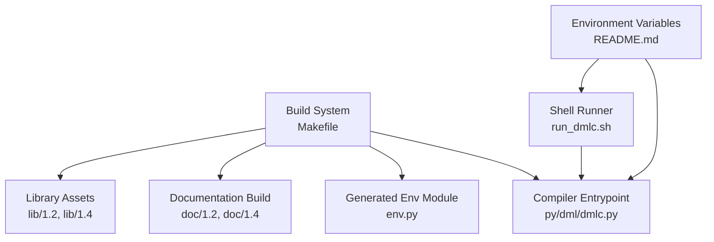
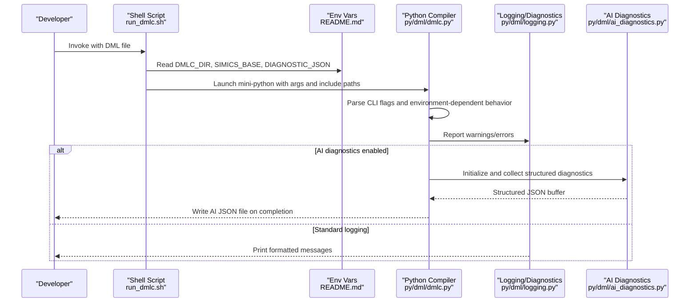
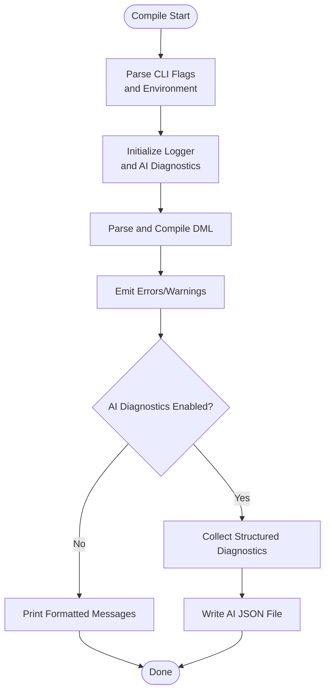
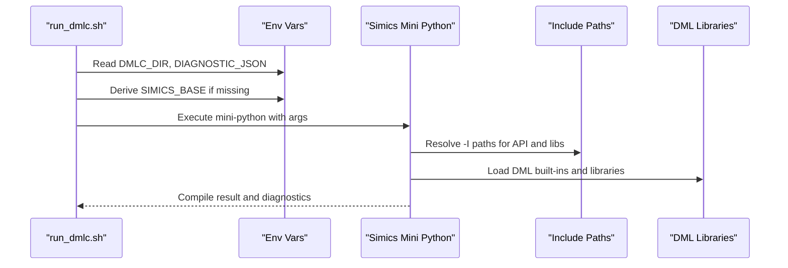
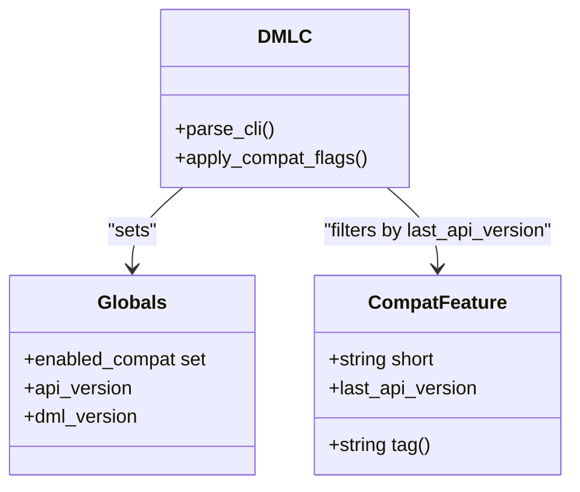
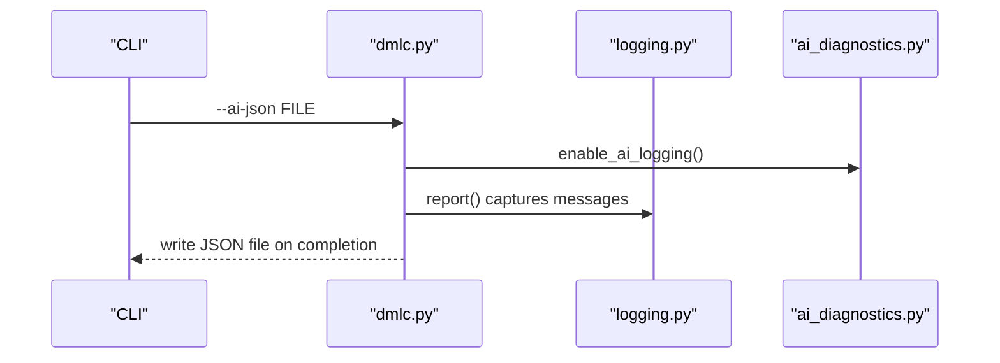
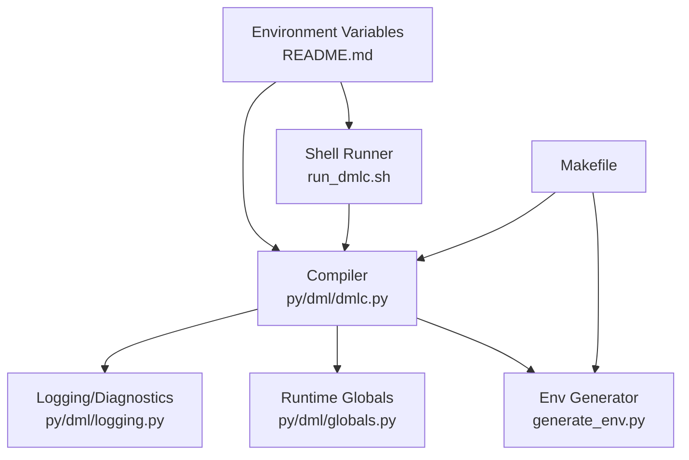

# Environment and Configuration

<cite>
**Referenced Files in This Document**
- [README.md](file://README.md)
- [run_dmlc.sh](file://run_dmlc.sh)
- [Makefile](file://Makefile)
- [generate_env.py](file://generate_env.py)
- [py/dml/dmlc.py](file://py/dml/dmlc.py)
- [py/dml/globals.py](file://py/dml/globals.py)
- [py/dml/logging.py](file://py/dml/logging.py)
- [copy_h.py](file://copy_h.py)
- [test/tests.py](file://test/tests.py)
- [AI_DIAGNOSTICS_README.md](file://AI_DIAGNOSTICS_README.md)
- [IMPLEMENTATION_SUMMARY.md](file://IMPLEMENTATION_SUMMARY.md)
</cite>

## Table of Contents
1. [Introduction](#introduction)
2. [Project Structure](#project-structure)
3. [Core Components](#core-components)
4. [Architecture Overview](#architecture-overview)
5. [Detailed Component Analysis](#detailed-component-analysis)
6. [Dependency Analysis](#dependency-analysis)
7. [Performance Considerations](#performance-considerations)
8. [Troubleshooting Guide](#troubleshooting-guide)
9. [Conclusion](#conclusion)
10. [Appendices](#appendices)

## Introduction
This document describes the environment and configuration system for the DML compiler (DMLC). It covers environment variables, configuration options, runtime settings, API version management, compatibility feature toggles, debugging configurations, integration with the Simics environment, path resolution, cross-platform considerations, performance tuning, memory management, and diagnostic configuration for development and production.

## Project Structure
The DML compiler is primarily implemented in Python and orchestrated by a Makefile. The build system integrates with Simics to produce a runnable compiler and supporting assets. Scripts and environment variables control invocation and diagnostics.

**Diagram sources**
- [Makefile](file://Makefile#L1-L252)
- [generate_env.py](file://generate_env.py#L1-L23)
- [py/dml/dmlc.py](file://py/dml/dmlc.py#L1-L811)
- [run_dmlc.sh](file://run_dmlc.sh#L1-L67)
- [README.md](file://README.md#L46-L117)

**Section sources**
- [Makefile](file://Makefile#L1-L252)
- [README.md](file://README.md#L22-L117)

## Core Components
- Environment variables and shell integration: DMLC_DIR, SIMICS_BASE, DMLC_DEBUG, DMLC_PROFILE, DMLC_DUMP_INPUT_FILES, DMLC_GATHER_SIZE_STATISTICS, DMLC_PATHSUBST, PY_SYMLINKS, T126_JOBS, DMLC_CC.
- Compiler runtime flags and settings: API version selection, compatibility toggles, warning/error controls, AI diagnostics export, dependency generation, and split-C-file thresholds.
- Logging and diagnostics: structured error/warning reporting, AI-friendly JSON diagnostics, and debug mode behavior.
- Simics integration: discovery of SIMICS_BASE, invoking the mini Python interpreter, and include paths for DML libraries.

**Section sources**
- [README.md](file://README.md#L46-L117)
- [run_dmlc.sh](file://run_dmlc.sh#L1-L67)
- [py/dml/dmlc.py](file://py/dml/dmlc.py#L309-L800)
- [py/dml/logging.py](file://py/dml/logging.py#L1-L468)
- [py/dml/globals.py](file://py/dml/globals.py#L1-L107)

## Architecture Overview
The DMLC environment and configuration pipeline integrates shell scripts, environment variables, and the Python compiler to orchestrate builds and diagnostics within a Simics project.

**Diagram sources**
- [run_dmlc.sh](file://run_dmlc.sh#L1-L67)
- [README.md](file://README.md#L46-L117)
- [py/dml/dmlc.py](file://py/dml/dmlc.py#L309-L800)
- [py/dml/logging.py](file://py/dml/logging.py#L433-L468)

## Detailed Component Analysis

### Environment Variables and Shell Integration
- DMLC_DIR: Points to the host-type bin directory containing the built compiler. Used by the shell runner to locate the Python entrypoint and DML include paths.
- SIMICS_BASE: Determined by the shell runner; if unset, it is parsed from the project’s simics configuration. Required to launch the mini Python interpreter.
- DIAGNOSTIC_JSON: Default filename for AI diagnostics JSON output when not specified.
- DMLC_DEBUG: When set, compiler exceptions are printed to stderr instead of being hidden in a log file.
- DMLC_PROFILE: Enables self-profiling and writes a .prof file.
- DMLC_DUMP_INPUT_FILES: Emits a .tar.bz2 archive of all DML sources and relative imports for isolated reproduction.
- DMLC_GATHER_SIZE_STATISTICS: Produces a -size-stats.json file with code generation statistics for optimization.
- DMLC_PATHSUBST: Rewrites error paths to point to source files instead of copied build artifacts; used by header copying logic.
- PY_SYMLINKS: When set, Python files are symlinked instead of copied during build, aiding development.
- T126_JOBS: Controls parallelism for tests.
- DMLC_CC: Overrides the default compiler in unit tests.

Usage examples:
- Set DMLC_DIR to the appropriate host-type bin directory after building.
- Set DMLC_PATHSUBST to map build copies back to source paths for clearer error messages.
- Enable DMLC_DEBUG for development to see full tracebacks.
- Enable DMLC_PROFILE to analyze performance hotspots.
- Enable DMLC_DUMP_INPUT_FILES to package a reproducible archive when debugging complex builds.
- Enable DMLC_GATHER_SIZE_STATISTICS to optimize generated code size and compile time.

Cross-platform considerations:
- Host type detection in the shell script distinguishes win64 vs linux64.
- DMLC_DUMP_INPUT_FILES recommends extracting and compiling on Linux due to symlink handling differences on Windows.

**Section sources**
- [README.md](file://README.md#L46-L117)
- [run_dmlc.sh](file://run_dmlc.sh#L1-L67)
- [copy_h.py](file://copy_h.py#L1-L13)

### Compiler Runtime Flags and Settings
Key CLI flags and environment-driven behaviors:
- API version selection: --simics-api selects the target Simics API version. Defaults to the configured default API version.
- Compatibility toggles: --no-compat and aliases like --strict-dml12 and --strict-int disable deprecated features for safer migration.
- Warning controls: --warn, --nowarn, -T, and --werror manage diagnostic verbosity and severity.
- Debugging: -g enables debuggable artifacts and closely follows DML in generated C code.
- Dependency generation: --dep and related options emit makefile dependencies and phony targets.
- AI diagnostics: --ai-json exports structured diagnostics in JSON for AI consumption.
- Performance tuning: --max-errors limits error output; --split-c-file splits generated C files by size; --noline suppresses line directives for easier C debugging.
- Internal testing: --enable-features-for-internal-testing-dont-use-this activates unstable features for testing.

Behavior influenced by environment:
- DMLC_PROFILE: Enables profiling and writes a .prof file.
- DMLC_DEBUG: Switches exception reporting to stderr.
- DMLC_DUMP_INPUT_FILES: Emits a .tar.bz2 archive of inputs.
- DMLC_GATHER_SIZE_STATISTICS: Writes -size-stats.json with code generation statistics.

**Section sources**
- [py/dml/dmlc.py](file://py/dml/dmlc.py#L309-L800)
- [py/dml/globals.py](file://py/dml/globals.py#L1-L107)

### Logging and Diagnostics
- Warning and error reporting: Centralized via logging.LogMessage subclasses, with filtering controlled by ignore_warning and enable_warning.
- Tag inclusion: -T adds warning tags to messages for targeted control.
- Max errors: --max-errors caps the number of reported errors.
- AI diagnostics: When enabled via --ai-json, diagnostics are captured and exported to JSON at the end of compilation.
- Debug mode: DMLC_DEBUG toggles verbose exception reporting.

**Diagram sources**
- [py/dml/dmlc.py](file://py/dml/dmlc.py#L625-L800)
- [py/dml/logging.py](file://py/dml/logging.py#L433-L468)

**Section sources**
- [py/dml/logging.py](file://py/dml/logging.py#L1-L468)
- [py/dml/dmlc.py](file://py/dml/dmlc.py#L625-L800)

### Simics Integration and Path Resolution
- SIMICS_BASE discovery: The shell script attempts to derive SIMICS_BASE from the project’s simics configuration if not provided.
- Mini Python invocation: The compiler is launched via the mini Python interpreter bundled with Simics.
- Include paths: The shell runner sets include paths for DML API and library directories, enabling import resolution.
- Path substitution: DMLC_PATHSUBST is honored by header copying logic to rewrite error locations to source paths.

**Diagram sources**
- [run_dmlc.sh](file://run_dmlc.sh#L36-L66)
- [copy_h.py](file://copy_h.py#L9-L10)

**Section sources**
- [run_dmlc.sh](file://run_dmlc.sh#L1-L67)
- [copy_h.py](file://copy_h.py#L1-L13)

### API Version Management and Compatibility Feature Toggles
- API versions: Determined by the environment generator and exposed to the compiler runtime.
- Compatibility features: Controlled via --no-compat and strict aliases. Features are mapped to specific API versions and can be disabled selectively to migrate incrementally.
- Strict modes: --strict-dml12 and --strict-int disable legacy constructs for safer modernization.

**Diagram sources**
- [py/dml/dmlc.py](file://py/dml/dmlc.py#L581-L622)
- [py/dml/globals.py](file://py/dml/globals.py#L58-L64)
- [generate_env.py](file://generate_env.py#L10-L18)

**Section sources**
- [py/dml/dmlc.py](file://py/dml/dmlc.py#L581-L622)
- [py/dml/globals.py](file://py/dml/globals.py#L58-L64)
- [generate_env.py](file://generate_env.py#L1-L23)

### AI Diagnostics Configuration
- CLI flag: --ai-json enables AI-friendly JSON diagnostics export.
- Implementation: Integrates with logging.report() to capture structured diagnostics and writes a JSON file upon completion.
- Schema: Includes compilation summary, categorized diagnostics, related locations, and fix suggestions.

**Diagram sources**
- [py/dml/dmlc.py](file://py/dml/dmlc.py#L625-L800)
- [py/dml/logging.py](file://py/dml/logging.py#L433-L443)
- [AI_DIAGNOSTICS_README.md](file://AI_DIAGNOSTICS_README.md#L1-L200)
- [IMPLEMENTATION_SUMMARY.md](file://IMPLEMENTATION_SUMMARY.md#L100-L179)

**Section sources**
- [py/dml/dmlc.py](file://py/dml/dmlc.py#L625-L800)
- [py/dml/logging.py](file://py/dml/logging.py#L433-L443)
- [AI_DIAGNOSTICS_README.md](file://AI_DIAGNOSTICS_README.md#L1-L200)
- [IMPLEMENTATION_SUMMARY.md](file://IMPLEMENTATION_SUMMARY.md#L100-L179)

### Build-Time Configuration and Generated Environment
- env.py generation: Built from generate_env.py, exposing is_windows, api_versions, and default_api_version to the compiler runtime.
- Makefile integration: Copies Python modules, DML libraries, and headers into the bin directory, and sets up include paths for the compiler.

**Section sources**
- [generate_env.py](file://generate_env.py#L1-L23)
- [Makefile](file://Makefile#L132-L134)
- [Makefile](file://Makefile#L148-L174)

## Dependency Analysis
The DMLC configuration system depends on:
- Shell script for environment discovery and invocation.
- Environment variables for paths and behavior toggles.
- Python modules for logging, CLI parsing, and runtime globals.
- Simics integration for the Python interpreter and include paths.

**Diagram sources**
- [README.md](file://README.md#L46-L117)
- [run_dmlc.sh](file://run_dmlc.sh#L1-L67)
- [py/dml/dmlc.py](file://py/dml/dmlc.py#L1-L811)
- [py/dml/logging.py](file://py/dml/logging.py#L1-L468)
- [py/dml/globals.py](file://py/dml/globals.py#L1-L107)
- [generate_env.py](file://generate_env.py#L1-L23)
- [Makefile](file://Makefile#L1-L252)

**Section sources**
- [README.md](file://README.md#L46-L117)
- [run_dmlc.sh](file://run_dmlc.sh#L1-L67)
- [py/dml/dmlc.py](file://py/dml/dmlc.py#L1-L811)
- [py/dml/logging.py](file://py/dml/logging.py#L1-L468)
- [py/dml/globals.py](file://py/dml/globals.py#L1-L107)
- [generate_env.py](file://generate_env.py#L1-L23)
- [Makefile](file://Makefile#L1-L252)

## Performance Considerations
- Profiling: Enable DMLC_PROFILE to generate a .prof file for performance analysis.
- Size statistics: Enable DMLC_GATHER_SIZE_STATISTICS to identify heavy methods and optimize code generation.
- Split C files: Use --split-c-file to control generated file size for scalability.
- Warning suppression: Use --nowarn and -T to reduce noise and improve build throughput.
- Dependency generation: Use --dep to speed up incremental builds by avoiding redundant work.
- Line directives: Use --noline to simplify C debugging when needed.

[No sources needed since this section provides general guidance]

## Troubleshooting Guide
Common issues and remedies:
- Unexpected exceptions: Set DMLC_DEBUG=1 to print full tracebacks to stderr instead of hiding them in dmlc-error.log.
- Error path confusion: Set DMLC_PATHSUBST to map build copies back to source paths for clearer error locations.
- Reproducing complex builds: Set DMLC_DUMP_INPUT_FILES to create a .tar.bz2 archive of all DML sources and relative imports for isolated reproduction.
- Profiling failures: Ensure DMLC_PROFILE is set and verify the presence of the .prof file; invalid profiles will cause test failures.
- Size statistics anomalies: Review -size-stats.json to identify oversized methods and refactor loops or use shared methods.

**Section sources**
- [README.md](file://README.md#L75-L117)
- [py/dml/dmlc.py](file://py/dml/dmlc.py#L667-L730)
- [test/tests.py](file://test/tests.py#L855-L876)

## Conclusion
The DML compiler’s environment and configuration system provides robust control over API versions, compatibility, diagnostics, and performance. Environment variables and shell scripts integrate tightly with the Python compiler to support both development and production workflows, while AI diagnostics offer structured insights for automated tooling.

## Appendices

### Environment Variables Reference
- DMLC_DIR: Directory containing the built compiler binaries.
- SIMICS_BASE: Root of the Simics installation used to locate the mini Python interpreter.
- DIAGNOSTIC_JSON: Filename for AI diagnostics JSON output.
- DMLC_DEBUG: Enable verbose exception reporting to stderr.
- DMLC_PROFILE: Enable self-profiling and write .prof file.
- DMLC_DUMP_INPUT_FILES: Emit .tar.bz2 archive of DML sources for reproduction.
- DMLC_GATHER_SIZE_STATISTICS: Produce -size-stats.json with code generation statistics.
- DMLC_PATHSUBST: Rewrite error paths to source files.
- PY_SYMLINKS: Symlink Python files during build for faster iteration.
- T126_JOBS: Parallel test jobs.
- DMLC_CC: Override compiler in unit tests.

**Section sources**
- [README.md](file://README.md#L46-L117)
- [run_dmlc.sh](file://run_dmlc.sh#L1-L67)

### Compiler CLI Flags Reference
- --simics-api: Select Simics API version.
- --no-compat: Disable compatibility features.
- --warn/--nowarn/-T/--werror: Control warnings and treat them as errors.
- -g: Generate debuggable artifacts.
- --dep/--dep-target/--no-dep-phony: Emit makefile dependencies.
- --ai-json: Export AI-friendly JSON diagnostics.
- --max-errors: Limit error output.
- --split-c-file: Split generated C files by size.
- --noline: Suppress line directives in generated C.
- --enable-features-for-internal-testing-dont-use-this: Activate unstable testing features.

**Section sources**
- [py/dml/dmlc.py](file://py/dml/dmlc.py#L309-L622)

### AI Diagnostics JSON Schema Highlights
- compilation_summary: Includes input file, DML version, totals, and success flag.
- diagnostics: List of structured entries with type, severity, code, message, category, location, fix suggestions, related locations, and documentation URL.

**Section sources**
- [IMPLEMENTATION_SUMMARY.md](file://IMPLEMENTATION_SUMMARY.md#L110-L153)