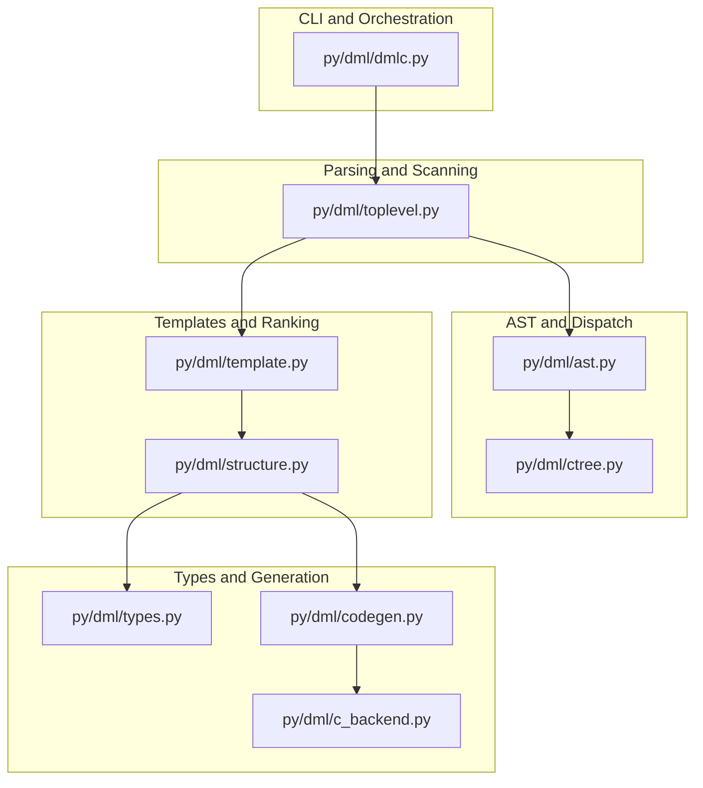
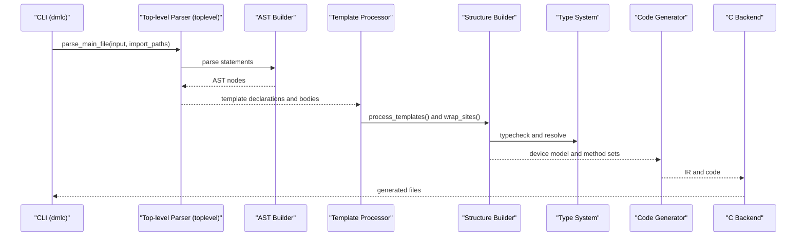
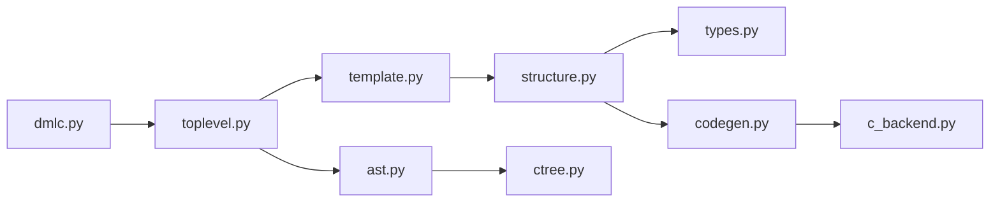

# Python API Reference

<cite>
**Referenced Files in This Document**
- [dmlc.py](file://py/dml/dmlc.py)
- [template.py](file://py/dml/template.py)
- [ast.py](file://py/dml/ast.py)
- [codegen.py](file://py/dml/codegen.py)
- [c_backend.py](file://py/dml/c_backend.py)
- [toplevel.py](file://py/dml/toplevel.py)
- [structure.py](file://py/dml/structure.py)
- [ctree.py](file://py/dml/ctree.py)
- [types.py](file://py/dml/types.py)
</cite>

## Table of Contents
1. [Introduction](#introduction)
2. [Project Structure](#project-structure)
3. [Core Components](#core-components)
4. [Architecture Overview](#architecture-overview)
5. [Detailed Component Analysis](#detailed-component-analysis)
6. [Dependency Analysis](#dependency-analysis)
7. [Performance Considerations](#performance-considerations)
8. [Troubleshooting Guide](#troubleshooting-guide)
9. [Conclusion](#conclusion)

## Introduction
This document provides a comprehensive Python API reference for the Device Modeling Language (DML) compiler. It covers the public entry points, AST manipulation utilities, template system interfaces, and backend generation APIs. It also documents internal extension points, hook registration mechanisms, and integration patterns for external build systems. Guidance on threading, memory management, and performance optimization is included to help users integrate the compiler effectively in automated environments.

## Project Structure
The DML compiler is organized into modules that handle parsing, AST construction, template processing, type checking, code generation, and backend emission. The primary modules are:
- Command-line entry and orchestration
- Parser and top-level scanning
- AST representation and dispatch
- Template processing and ranking
- Type system and type checking
- Code generation and intermediate representation
- Backend emission (C, info, debug)
- Utilities for structure building and object model

**Diagram sources**
- [dmlc.py](file://py/dml/dmlc.py#L309-L800)
- [toplevel.py](file://py/dml/toplevel.py#L1-L459)
- [ast.py](file://py/dml/ast.py#L1-L172)
- [ctree.py](file://py/dml/ctree.py#L1-L800)
- [template.py](file://py/dml/template.py#L1-L433)
- [structure.py](file://py/dml/structure.py#L1-L800)
- [types.py](file://py/dml/types.py#L1-L800)
- [codegen.py](file://py/dml/codegen.py#L1-L800)
- [c_backend.py](file://py/dml/c_backend.py#L1-L800)

**Section sources**
- [dmlc.py](file://py/dml/dmlc.py#L309-L800)
- [toplevel.py](file://py/dml/toplevel.py#L1-L459)

## Core Components
This section summarizes the main public APIs and their responsibilities.

- Command-line entry point and CLI options
  - Function: main(argv)
  - Purpose: Parse CLI arguments, configure compiler behavior, orchestrate parsing, template processing, and backend generation.
  - Parameters:
    - argv: list[str] — command-line arguments.
  - Returns: int — exit code (0 on success, non-zero on failure).
  - Exceptions: Raises SystemExit on normal termination; raises logging.DMLError on fatal compile errors; raises ICE on internal compiler errors; catches and reports unexpected exceptions.
  - Notes: Supports options for defines (-D), import paths (-I), warnings (--warn/--nowarn), API version (--simics-api), dependency generation (--dep), and more.

- Top-level parsing and import resolution
  - Function: parse_main_file(inputfilename, explicit_import_path)
  - Purpose: Load and parse the main DML file, scan top-level statements, resolve imports, and return parsed metadata.
  - Returns: tuple — (dml_version, devname, headers, footers, global_defs, top_tpl, imported).
  - Exceptions: Reports errors via logging and messages.

- AST representation and dispatch
  - Module: ast
  - Classes: AST, astdispatcher
  - Utilities: astclass, get
  - Purpose: Provide a uniform AST node representation and a dispatcher for visitor-style transformations.

- Template processing and ranking
  - Module: template
  - Classes: Rank, RankDesc, ObjectSpec, InstantiatedTemplateSpec, Template
  - Functions: process_templates, object_spec_from_asts, rank_structure
  - Purpose: Convert template ASTs into executable specifications, compute ranks, and manage template inheritance and instantiation.

- Structure building and object model
  - Module: structure
  - Functions: mkglobals, mkdev, wrap_sites, merge_parameters
  - Purpose: Build the device object model from templates and global definitions, enforce parameter and method rules, and prepare for code generation.

- Type system
  - Module: types
  - Classes: DMLType, TVoid, TNamed, TBool, TInt, TLong, TSize, TFloat, TArray, TPtr, TVector, TTrait, TTraitList, TStruct, TFunction, THook
  - Functions: realtype, safe_realtype, check_named_types
  - Purpose: Define DML types, type equivalence, and utilities for type checking and code generation.

- Code generation and IR
  - Module: codegen
  - Classes: Failure variants, ExitHandler variants, Memoization variants, AfterInfo subclasses
  - Functions: mark_method_exported, exported_methods, statically_exported_methods, method_queue, codegen_* helpers
  - Purpose: Generate C-compatible code from DML constructs, manage failure handling, memoization, and after/on-hook artifacts.

- Backend emission
  - Module: c_backend
  - Functions: generate (driver), attribute registration, method wrappers, state change notifications
  - Purpose: Emit C headers and implementation, register attributes, and generate device initialization and cleanup routines.

- Intermediate representation
  - Module: ctree
  - Classes: Statement subclasses (Compound, Return, Assert, After, AfterOnHook, ImmediateAfter), Expression subclasses
  - Functions: mk* helpers for statements and expressions
  - Purpose: Provide a high-level IR for code generation with precise control over C emission.

**Section sources**
- [dmlc.py](file://py/dml/dmlc.py#L309-L800)
- [toplevel.py](file://py/dml/toplevel.py#L359-L459)
- [ast.py](file://py/dml/ast.py#L1-L172)
- [template.py](file://py/dml/template.py#L1-L433)
- [structure.py](file://py/dml/structure.py#L74-L800)
- [types.py](file://py/dml/types.py#L1-L800)
- [codegen.py](file://py/dml/codegen.py#L1-L800)
- [c_backend.py](file://py/dml/c_backend.py#L1-L800)
- [ctree.py](file://py/dml/ctree.py#L1-L800)

## Architecture Overview
The compiler follows a staged pipeline: CLI parsing → top-level scanning → AST construction → template processing → type checking → code generation → backend emission.

**Diagram sources**
- [dmlc.py](file://py/dml/dmlc.py#L676-L760)
- [toplevel.py](file://py/dml/toplevel.py#L359-L459)
- [template.py](file://py/dml/template.py#L362-L433)
- [structure.py](file://py/dml/structure.py#L74-L235)
- [types.py](file://py/dml/types.py#L92-L178)
- [codegen.py](file://py/dml/codegen.py#L1-L800)
- [c_backend.py](file://py/dml/c_backend.py#L1-L800)

## Detailed Component Analysis

### CLI and Orchestration (dmlc)
- Entry point
  - main(argv)
    - Parses CLI options, configures warnings, API version, compatibility flags, and output settings.
    - Invokes toplevel.parse_main_file to obtain parsed metadata.
    - Calls process to build the device model and then triggers backend generation (C, info, debug).
    - Handles errors and writes diagnostic logs.
- Internal helpers
  - process(devname, global_defs, top_tpl, extra_params): Builds globals, resolves templates, and creates the device tree.
  - parse_define(arg): Parses -D definitions into AST values.
  - print_cdep(outputbase, headers, footers): Emits a minimal C file for dependency generation.
  - dump_input_files(outputbase, imported): Archives imported files for reproducibility.
  - flush_porting_log(tmpfile, porting_filename): Thread-safe flushing of porting logs.
  - Help actions: WarnHelpAction, CompatHelpAction for listing available warning and compatibility tags.

Parameters and return values:
- main(argv): returns int exit code.
- process(...): returns device object.
- parse_define(arg): returns (name, value AST).
- print_cdep(...): writes a file and returns None.
- dump_input_files(...): writes a tarball and returns None.
- flush_porting_log(...): returns None.

Exceptions:
- Logging-related: logging.DMLError (fatal compile errors), logging.ICE (internal compiler errors).
- Unexpected exceptions: caught and logged to dmlc-error.log.

Threading and concurrency:
- flush_porting_log uses a directory-based lock to coordinate parallel builds safely.

Memory and performance:
- Optional profiling via DMLC_PROFILE environment variable.
- Timing logs enabled via logtime and time_dmlc toggle.

**Section sources**
- [dmlc.py](file://py/dml/dmlc.py#L309-L800)

### Top-level Parsing and Import Resolution (toplevel)
- parse_main_file(inputfilename, explicit_import_path)
  - Loads the main DML file, determines version, scans top-level statements, implicitly imports built-ins, and resolves all imports.
  - Returns parsed metadata including headers, footers, global definitions, and the top-level template.
- get_parser(version, tabmodule=None, debugfile=None)
  - Creates lexer/parser instances for a given DML version using PLY.
- parse_dmlast_or_dml(path)
  - Loads cached .dmlast if available and fresh; otherwise parses the .dml file.
- determine_version(filestr, filename)
  - Extracts and validates the DML version tag.

Key behaviors:
- Version detection and compatibility checks.
- Pragmas processing (e.g., Coverity).
- Import path resolution and duplicate import handling.

**Section sources**
- [toplevel.py](file://py/dml/toplevel.py#L1-L459)

### AST Representation and Dispatch (ast)
- AST class
  - Encapsulates node kind, site, and arguments with efficient indexing and serialization support.
- astdispatcher
  - Provides a decorator-driven mechanism to dispatch on node kinds for transformations or analyses.
- Utility functions
  - astclass(name): factory for AST constructors.
  - get(name): retrieves an AST constructor by name.

Typical usage:
- Construct AST nodes via generated constructors (e.g., ast.method, ast.param).
- Traverse and transform ASTs using astdispatcher.

**Section sources**
- [ast.py](file://py/dml/ast.py#L1-L172)

### Template Processing and Ranking (template)
- Rank and RankDesc
  - Represent precedence and origin of declarations for override resolution.
- ObjectSpec
  - Holds a partial specification of a DML object with templates, parameters, blocks, and in-each structures.
- InstantiatedTemplateSpec
  - Specialization of ObjectSpec for a particular template instantiation.
- Template
  - Associates a template name with a trait and an ObjectSpec.
- process_templates(template_decls)
  - Validates template references, computes inheritance order, and constructs templates and traits.
- object_spec_from_asts and rank_structure
  - Convert AST fragments into ObjectSpecs and compute rank structures including in-each expansions.

Usage patterns:
- Extend templates by adding new template declarations and invoking process_templates.
- Instantiate templates using wrap_sites to adapt ObjectSpecs to specific contexts.

**Section sources**
- [template.py](file://py/dml/template.py#L1-L433)

### Structure Building and Object Model (structure)
- mkglobals(stmts)
  - Processes global constants, typedefs, externs, and templates; populates global scopes and type definitions.
- mkdev(devname, specs)
  - Builds the device object model from top-level specs and templates.
- wrap_sites(spec, issite, tname)
  - Adapts an ObjectSpec to a specific instantiation by replacing sites.
- merge_parameters and merge_parameters_dml12
  - Resolves parameter precedence and inheritance according to ranks and compatibility modes.

Integration points:
- Called after template processing to finalize the object model prior to code generation.

**Section sources**
- [structure.py](file://py/dml/structure.py#L74-L800)

### Type System (types)
- Core types
  - DMLType base with concrete implementations for primitives, arrays, pointers, vectors, structs, functions, traits, and hooks.
- Utilities
  - realtype, safe_realtype, check_named_types for robust type resolution and validation.
- Key properties
  - eq, eq_fuzzy, canstore, hashed, key for type equivalence and hashing.

Usage:
- Used extensively during code generation to ensure type safety and correct C emission.

**Section sources**
- [types.py](file://py/dml/types.py#L1-L800)

### Code Generation and IR (codegen, ctree)
- Code generation
  - Failure handlers: NoFailure, InitFailure, LogFailure, ReturnFailure, CatchFailure, IgnoreFailure.
  - Exit handlers: GotoExit, ReturnExit, Memoized variants.
  - Memoization: IndependentMemoized, SharedIndependentMemoized.
  - After and hook artifacts: AfterInfo subclasses for delayed callbacks and on-hook invocations.
- Intermediate representation
  - Statement subclasses: Compound, Return, Assert, After, AfterOnHook, ImmediateAfter, etc.
  - Expression helpers: mk* functions for constructing IR nodes.
  - Helpers: declarations, codegen_call, codegen_expression, and related utilities.

Integration:
- Code generator emits IR nodes that backends translate into C code.

**Section sources**
- [codegen.py](file://py/dml/codegen.py#L1-L800)
- [ctree.py](file://py/dml/ctree.py#L1-L800)

### Backend Emission (c_backend)
- Driver
  - generate(device, headers, footers, outputbase, deps, full_module): Orchestrates header, prototype, and implementation generation.
- Attribute registration
  - get_attr_flags, get_short_doc, get_long_doc, register_attribute, generate_attributes.
- Method wrappers
  - wrap_method, generate_implement_method: Wrap DML methods for C consumption.
- State change notifications
  - output_dml_state_change: Emit state change notifications when applicable.
- Guard macros and header emission
  - emit_guard_start, emit_guard_end, generate_hfile, generate_structfile.

**Section sources**
- [c_backend.py](file://py/dml/c_backend.py#L1-L800)

## Dependency Analysis
The modules exhibit clear layering:
- CLI depends on top-level parsing and orchestration.
- Top-level parsing depends on AST and template modules.
- Template processing feeds into structure building and type checking.
- Code generation consumes structure and types, emitting IR.
- Backend emission consumes IR to produce C artifacts.

**Diagram sources**
- [dmlc.py](file://py/dml/dmlc.py#L309-L800)
- [toplevel.py](file://py/dml/toplevel.py#L1-L459)
- [ast.py](file://py/dml/ast.py#L1-L172)
- [template.py](file://py/dml/template.py#L1-L433)
- [structure.py](file://py/dml/structure.py#L1-L800)
- [types.py](file://py/dml/types.py#L1-L800)
- [codegen.py](file://py/dml/codegen.py#L1-L800)
- [c_backend.py](file://py/dml/c_backend.py#L1-L800)
- [ctree.py](file://py/dml/ctree.py#L1-L800)

**Section sources**
- [dmlc.py](file://py/dml/dmlc.py#L309-L800)
- [toplevel.py](file://py/dml/toplevel.py#L1-L459)
- [template.py](file://py/dml/template.py#L1-L433)
- [structure.py](file://py/dml/structure.py#L1-L800)
- [types.py](file://py/dml/types.py#L1-L800)
- [codegen.py](file://py/dml/codegen.py#L1-L800)
- [c_backend.py](file://py/dml/c_backend.py#L1-L800)
- [ctree.py](file://py/dml/ctree.py#L1-L800)

## Performance Considerations
- Use dependency generation (--dep) to minimize rebuilds in large projects.
- Enable split C file generation (--split-c-file) to improve incremental builds.
- Disable unnecessary warnings and features to reduce overhead.
- Prefer cached .dmlast files to skip repeated parsing when appropriate.
- Avoid excessive template instantiation depth to keep rank computations manageable.
- Use memoization for expensive method computations where applicable.

## Troubleshooting Guide
Common issues and resolutions:
- Fatal compile errors: Inspect reported messages and fix syntax/type errors; the compiler exits with non-zero status.
- ICE (Internal Compiler Error): A dmlc-error.log is generated; collect it and report upstream.
- Unexpected exceptions: Caught and logged; check dmlc-error.log for stack traces.
- Porting logs: Use -P to append messages to a file; flush_porting_log coordinates concurrent writes.
- Future timestamps in dependencies: The compiler warns and may skip dependency file generation to prevent infinite loops.

Operational tips:
- Use --max-errors to cap error reporting.
- Enable --noline to suppress line directives for cleaner C code.
- Export AI-friendly diagnostics via --ai-json for automated analysis.

**Section sources**
- [dmlc.py](file://py/dml/dmlc.py#L227-L263)
- [dmlc.py](file://py/dml/dmlc.py#L766-L787)

## Conclusion
The DML compiler exposes a layered Python API suitable for programmatic compilation, template customization, and backend integration. The CLI orchestrates parsing and generation, while modules for AST, templates, types, code generation, and backends provide extension points for advanced scenarios. Following the guidelines in this document ensures reliable integration, predictable performance, and effective troubleshooting.