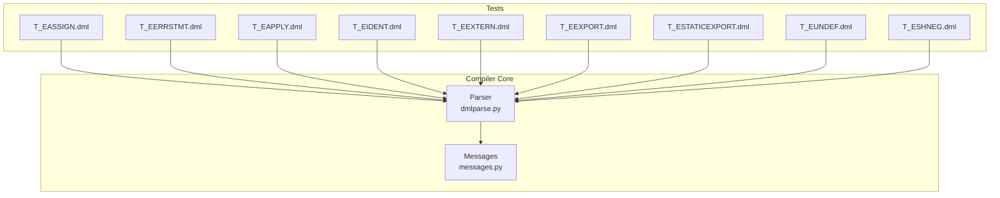
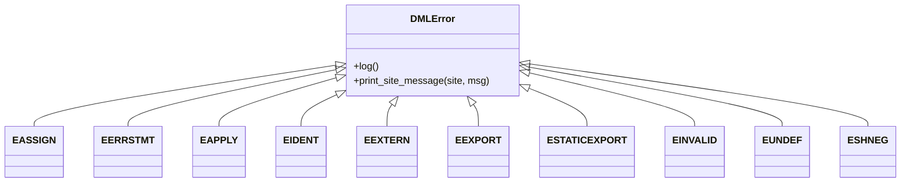

# Compilation Errors

<cite>
**Referenced Files in This Document**
- [messages.py](file://py/dml/messages.py)
- [dmlparse.py](file://py/dml/dmlparse.py)
- [T_EASSIGN.dml](file://test/1.2/errors/T_EASSIGN.dml)
- [T_EERRSTMT.dml](file://test/1.2/errors/T_EERRSTMT.dml)
- [T_EAPPLY.dml](file://test/1.2/errors/T_EAPPLY.dml)
- [T_EIDENT.dml](file://test/1.2/errors/T_EIDENT.dml)
- [T_EEXTERN.dml](file://test/1.2/errors/T_EEXTERN.dml)
- [T_EEXPORT.dml](file://test/1.4/errors/T_EEXPORT.dml)
- [T_ESTATICEXPORT.dml](file://test/1.4/errors/T_ESTATICEXPORT.dml)
- [T_EUNDEF.dml](file://test/1.2/errors/T_EUNDEF.dml)
- [T_ESHNEG.dml](file://test/1.2/errors/T_ESHNEG.dml)
</cite>

## Table of Contents
1. [Introduction](#introduction)
2. [Project Structure](#project-structure)
3. [Core Components](#core-components)
4. [Architecture Overview](#architecture-overview)
5. [Detailed Component Analysis](#detailed-component-analysis)
6. [Dependency Analysis](#dependency-analysis)
7. [Performance Considerations](#performance-considerations)
8. [Troubleshooting Guide](#troubleshooting-guide)
9. [Conclusion](#conclusion)

## Introduction
This document explains DML compilation errors with a focus on the error classes EASSIGN, EERRSTMT, EAPPLY, EIDENT, EEXTERN, EEXPORT, ESTATICEXPORT, EINVALID, EUNDEF, and ESHNEG. It describes validation rules enforced during compilation, how errors are detected and reported, and how to interpret and resolve them. Practical examples from the test suite illustrate typical failure scenarios and their root causes. Guidance is included for navigating the DML compilation pipeline and debugging compilation failures.

## Project Structure
The DML compiler organizes error reporting in a dedicated module that defines error classes and their formatting. The parser integrates with this module to emit structured diagnostics. Test files under the error suites demonstrate real-world compilation failures for each error category.



**Diagram sources**
- [dmlparse.py](file://py/dml/dmlparse.py#L1-L200)
- [messages.py](file://py/dml/messages.py#L333-L465)

**Section sources**
- [dmlparse.py](file://py/dml/dmlparse.py#L1-L200)
- [messages.py](file://py/dml/messages.py#L333-L465)

## Core Components
- Error classes define the semantic meaning and formatting of each diagnostic. They inherit from a base error reporting class and carry contextual information such as site locations and type details.
- The parser consumes DML source, constructs AST nodes, and triggers error reports when validation rules are violated.
- Tests provide deterministic examples of invalid constructs mapped to specific error classes.

Key error classes documented here:
- EASSIGN: Assignment to non-lvalue targets
- EERRSTMT: Forced error statements
- EAPPLY: Illegal function application
- EIDENT: Unknown identifiers
- EEXTERN: Illegal extern method declarations
- EEXPORT: Illegal export of methods
- ESTATICEXPORT: Illegal conversion of method references to function pointers
- EINVALID: Invalid expressions
- EUNDEF: Use of undefined values
- ESHNEG: Shift with negative shift count

**Section sources**
- [messages.py](file://py/dml/messages.py#L333-L465)
- [dmlparse.py](file://py/dml/dmlparse.py#L1-L200)

## Architecture Overview
The DML compilation pipeline integrates lexical analysis, parsing, AST construction, semantic validation, and code generation. Errors are raised as instances of specialized classes in the messages module and reported with precise source locations.

```mermaid
sequenceDiagram
participant Src as "Source File"
participant Lex as "Lexer"
participant Par as "Parser"
participant Sem as "Semantic Validator"
participant Msg as "Messages Module"
Src->>Lex : Token stream
Lex->>Par : Tokens
Par->>Sem : AST
Sem->>Msg : Instantiate error class with site/context
Msg-->>Par : Formatted diagnostic
Par-->>Src : Error report with location and message
```

**Diagram sources**
- [dmlparse.py](file://py/dml/dmlparse.py#L1-L200)
- [messages.py](file://py/dml/messages.py#L333-L465)

## Detailed Component Analysis

### EASSIGN: Assignment Errors
- Purpose: Reports attempts to assign to non-lvalue expressions.
- Validation rules:
  - The left-hand side of an assignment must be an l-value (e.g., variables, dereferenced pointers, array elements, selected members).
  - Constants, literals, function calls, and certain expressions that do not designate storage are not l-values.
- Typical causes:
  - Swapping operands: constant = variable
  - Applying operators that do not yield l-values: increment on non-lvalues, logical operations yielding booleans
  - Using address-of or negation on the left-hand side
  - Applying array slicing to non-integers or non-indexables
- Example reference:
  - [T_EASSIGN.dml](file://test/1.2/errors/T_EASSIGN.dml#L15-L75)
- Resolution:
  - Replace the left-hand side with a valid l-value.
  - Ensure the expression designates writable memory or a mutable location.

**Section sources**
- [messages.py](file://py/dml/messages.py#L333-L342)
- [T_EASSIGN.dml](file://test/1.2/errors/T_EASSIGN.dml#L15-L75)

### EERRSTMT: Forced Error Statements
- Purpose: Forces a compilation error at a specific point in the source.
- Validation rules:
  - The error statement is a compile-time directive that halts compilation immediately upon encountering it.
  - It may optionally carry a message string.
- Typical causes:
  - Intentionally aborting compilation for diagnostics or controlled testing.
- Example reference:
  - [T_EERRSTMT.dml](file://test/1.2/errors/T_EERRSTMT.dml#L11-L64)
- Resolution:
  - Remove or fix the construct causing the forced error.
  - Adjust logic to avoid triggering the error statement.

**Section sources**
- [messages.py](file://py/dml/messages.py#L395-L404)
- [T_EERRSTMT.dml](file://test/1.2/errors/T_EERRSTMT.dml#L11-L64)

### EAPPLY: Function Application Errors
- Purpose: Reports illegal function application when the callable is not a function type.
- Validation rules:
  - The expression being invoked must have a function-like type.
  - Calling non-functions (e.g., identifiers bound to non-function values, operators treated as functions) is invalid.
- Typical causes:
  - Invoking constants, identifiers not bound to functions, operators, or non-callable expressions as functions
  - Applying parentheses to non-callable expressions
- Example reference:
  - [T_EAPPLY.dml](file://test/1.2/errors/T_EAPPLY.dml#L13-L28)
- Resolution:
  - Ensure the left-hand side of the call is a function or method reference.
  - Resolve ambiguous identifiers to the intended function.

**Section sources**
- [messages.py](file://py/dml/messages.py#L699-L709)
- [T_EAPPLY.dml](file://test/1.2/errors/T_EAPPLY.dml#L13-L28)

### EIDENT: Identifier Errors
- Purpose: Reports unknown identifiers encountered during parsing and semantic checks.
- Validation rules:
  - All identifiers must be declared in the current scope or imported namespaces.
  - Types and values live in separate namespaces; using a type name as a value (or vice versa) can trigger this error.
- Typical causes:
  - Misspelled or undeclared identifiers
  - Using a typedef name as a value
  - Select/forsort loop variables not in scope
- Example reference:
  - [T_EIDENT.dml](file://test/1.2/errors/T_EIDENT.dml#L10-L43)
- Resolution:
  - Declare the identifier or import it from the appropriate namespace.
  - Verify the identifier’s role (type vs. value) and use it accordingly.

**Section sources**
- [messages.py](file://py/dml/messages.py#L730-L739)
- [T_EIDENT.dml](file://test/1.2/errors/T_EIDENT.dml#L10-L43)

### EEXTERN: Extern Method Errors
- Purpose: Validates extern method declarations to ensure they meet strict typing and capability constraints.
- Validation rules (DML 1.2):
  - Extern methods must be fully typed and must not declare throwing behavior.
- Typical causes:
  - Declaring extern methods with default bodies or non-compliant signatures
- Example reference:
  - [T_EEXTERN.dml](file://test/1.2/errors/T_EEXTERN.dml#L9-L14)
- Resolution:
  - Remove default bodies from extern methods and ensure fully specified signatures.
  - Avoid declaring throwing behavior for extern methods.

**Section sources**
- [messages.py](file://py/dml/messages.py#L405-L410)
- [T_EEXTERN.dml](file://test/1.2/errors/T_EEXTERN.dml#L9-L14)

### EEXPORT: Export Errors
- Purpose: Validates export eligibility for methods in DML 1.4.
- Validation rules:
  - Methods exported must be non-inline, non-shared, non-throwing, and declared outside object arrays.
- Typical causes:
  - Attempting to export methods violating the above constraints
- Example reference:
  - [T_EEXPORT.dml](file://test/1.4/errors/T_EEXPORT.dml)
- Resolution:
  - Remove inline/shared/throwing modifiers from the method.
  - Move the method outside object arrays if applicable.

**Section sources**
- [messages.py](file://py/dml/messages.py#L411-L424)
- [T_EEXPORT.dml](file://test/1.4/errors/T_EEXPORT.dml)

### ESTATICEXPORT: Static Export Errors
- Purpose: Validates conversions of method references to function pointers.
- Validation rules:
  - Conversion to function pointers requires the method to be non-inline, non-shared, non-throwing, and declared outside object arrays.
- Typical causes:
  - Taking the address of a method that does not satisfy the constraints
- Example reference:
  - [T_ESTATICEXPORT.dml](file://test/1.4/errors/T_ESTATICEXPORT.dml)
- Resolution:
  - Adjust the method signature and placement to satisfy the constraints before taking its address.

**Section sources**
- [messages.py](file://py/dml/messages.py#L425-L440)
- [T_ESTATICEXPORT.dml](file://test/1.4/errors/T_ESTATICEXPORT.dml)

### EINVALID: Invalid Expressions
- Purpose: Flags expressions that do not form a proper value.
- Validation rules:
  - Certain expressions are not valid as values (e.g., statements or constructs that do not evaluate to a value).
- Typical causes:
  - Using control-flow constructs or statements as values
- Resolution:
  - Restructure the code to compute a value where required.

**Section sources**
- [messages.py](file://py/dml/messages.py#L441-L448)

### EUNDEF: Undefined Values
- Purpose: Detects use of the undefined sentinel in contexts where a defined value is required.
- Validation rules:
  - Using undefined in most expression contexts is disallowed.
  - Parameters and certain initializers may accept undefined depending on context.
- Typical causes:
  - Passing undefined to functions, indexing arrays with undefined indices, using undefined in conditions
- Example reference:
  - [T_EUNDEF.dml](file://test/1.2/errors/T_EUNDEF.dml#L8-L97)
- Resolution:
  - Initialize variables and arrays with defined values.
  - Guard undefined uses with definedness checks when appropriate.

**Section sources**
- [messages.py](file://py/dml/messages.py#L449-L459)
- [T_EUNDEF.dml](file://test/1.2/errors/T_EUNDEF.dml#L8-L97)

### ESHNEG: Shift Negative Errors
- Purpose: Prevents shifts with negative shift counts.
- Validation rules:
  - The right-hand side of shift operators must be non-negative.
- Typical causes:
  - Using negative constants or expressions as shift counts
- Example reference:
  - [T_ESHNEG.dml](file://test/1.2/errors/T_ESHNEG.dml#L8-L13)
- Resolution:
  - Replace negative shift counts with positive values or compute the shift amount safely.

**Section sources**
- [messages.py](file://py/dml/messages.py#L460-L465)
- [T_ESHNEG.dml](file://test/1.2/errors/T_ESHNEG.dml#L8-L13)

## Dependency Analysis
The error classes depend on the logging/reporting infrastructure and are instantiated by the parser and semantic validator. The tests depend on the parser to trigger the relevant errors.



**Diagram sources**
- [messages.py](file://py/dml/messages.py#L333-L465)

**Section sources**
- [messages.py](file://py/dml/messages.py#L333-L465)

## Performance Considerations
- Error reporting is integrated early in parsing and semantic validation to fail fast and reduce unnecessary downstream work.
- Message formatting is lightweight and avoids heavy computations during error emission.

## Troubleshooting Guide
- Interpretation tips:
  - Error messages include the error class name and a concise description. Additional context may include type mismatches, expected vs. actual types, or site-specific hints.
  - Many errors print extra lines pointing to related declarations or definitions to help locate the root cause.
- Debugging techniques:
  - Narrow the failing construct to the smallest reproducible example.
  - Temporarily comment out surrounding code to isolate the issue.
  - Use the provided test files as templates for reproducing and verifying fixes.
- Common resolutions:
  - Fix l-value assignments by ensuring the target is a writable location.
  - Correct function calls by ensuring the callee is a function or method reference.
  - Declare identifiers before use or import them from the correct namespace.
  - Adjust extern method signatures and export/static export constraints per the rules above.
  - Replace undefined values with defined alternatives or guard their use.
  - Ensure shift counts are non-negative.

## Conclusion
This guide summarized the DML compilation errors EASSIGN, EERRSTMT, EAPPLY, EIDENT, EEXTERN, EEXPORT, ESTATICEXPORT, EINVALID, EUNDEF, and ESHNEG. It explained validation rules, detection mechanisms, and practical resolution steps, with references to concrete test cases. Understanding these errors and their relationship to the DML compilation pipeline helps diagnose and fix issues efficiently.