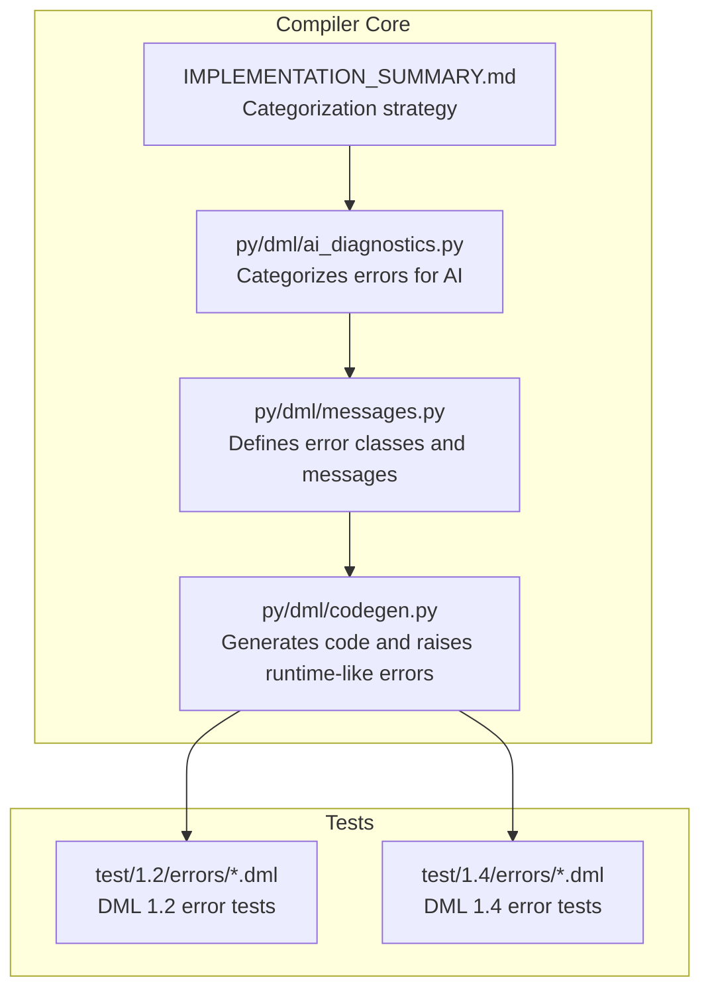
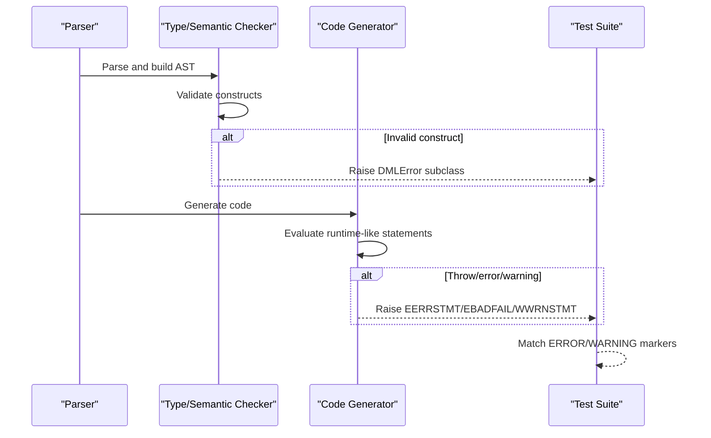
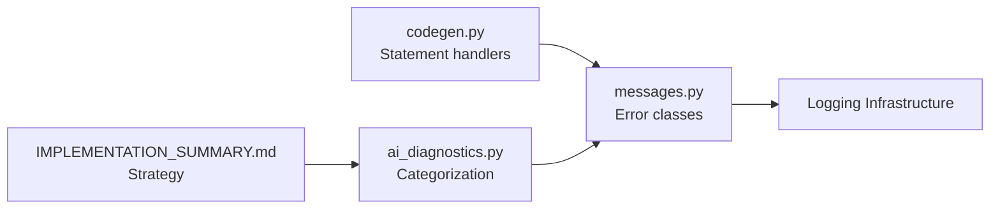

# Error Messages and Codes

<cite>
**Referenced Files in This Document**
- [messages.py](file://py/dml/messages.py)
- [codegen.py](file://py/dml/codegen.py)
- [ai_diagnostics.py](file://py/dml/ai_diagnostics.py)
- [IMPLEMENTATION_SUMMARY.md](file://IMPLEMENTATION_SUMMARY.md)
- [T_ESYNTAX_01.dml](file://test/1.2/errors/T_ESYNTAX_01.dml)
- [T_EASSIGN.dml](file://test/1.2/errors/T_EASSIGN.dml)
- [T_EARGT.dml](file://test/1.2/errors/T_EARGT.dml)
- [T_EBADFAIL.dml](file://test/1.2/errors/T_EBADFAIL.dml)
- [T_EBINOP.dml](file://test/1.2/errors/T_EBINOP.dml)
- [T_EARRAY.dml (1.2)](file://test/1.2/errors/T_EARRAY.dml)
- [T_ESYNTAX.dml (1.4)](file://test/1.4/errors/T_ESYNTAX.dml)
- [T_EARGT.dml (1.4)](file://test/1.4/errors/T_EARGT.dml)
- [T_EARRAY.dml (1.4)](file://test/1.4/errors/T_EARRAY.dml)
- [T_EBADFAIL_dml12.dml](file://test/1.2/errors/T_EBADFAIL_dml12.dml)
</cite>

## Table of Contents
1. [Introduction](#introduction)
2. [Project Structure](#project-structure)
3. [Core Components](#core-components)
4. [Architecture Overview](#architecture-overview)
5. [Detailed Component Analysis](#detailed-component-analysis)
6. [Dependency Analysis](#dependency-analysis)
7. [Performance Considerations](#performance-considerations)
8. [Troubleshooting Guide](#troubleshooting-guide)
9. [Conclusion](#conclusion)
10. [Appendices](#appendices)

## Introduction
This document provides a comprehensive error reference for the Device Modeling Language (DML). It catalogs error messages and codes, categorizes them by type (syntax, semantic, type, compilation), explains typical patterns and resolutions, and highlights version-specific differences between DML 1.2 and 1.4. Practical examples from the test suite illustrate each error class, and cross-references help developers quickly locate related conditions.

## Project Structure
The DML compiler’s error reporting is implemented in Python modules and validated by extensive test suites:
- Error classes and messages are defined centrally.
- Code generation and statement handling trigger specific errors.
- Test files annotate expected errors with markers to validate diagnostics.

**Diagram sources**
- [messages.py](file://py/dml/messages.py#L27-L2779)
- [codegen.py](file://py/dml/codegen.py#L2453-L2472)
- [ai_diagnostics.py](file://py/dml/ai_diagnostics.py#L76-L112)
- [IMPLEMENTATION_SUMMARY.md](file://IMPLEMENTATION_SUMMARY.md#L91-L108)

**Section sources**
- [messages.py](file://py/dml/messages.py#L1-L2779)
- [codegen.py](file://py/dml/codegen.py#L2453-L2472)
- [ai_diagnostics.py](file://py/dml/ai_diagnostics.py#L76-L112)
- [IMPLEMENTATION_SUMMARY.md](file://IMPLEMENTATION_SUMMARY.md#L91-L108)

## Core Components
- Error classes: Centralized in messages.py, each class defines a format string and constructor parameters to describe the error and guide resolution.
- Statement handling: Code generation raises specific errors for constructs like throw, error, and warning statements.
- Test-driven validation: Tests annotate expected errors with markers to ensure accurate diagnostics.

Key responsibilities:
- Define precise error semantics and user-facing messages.
- Provide structured diagnostic information (including parameter types, expected vs. actual values).
- Support version-aware error reporting (DML 1.4 introduces new checks and deprecations).

**Section sources**
- [messages.py](file://py/dml/messages.py#L27-L2779)
- [codegen.py](file://py/dml/codegen.py#L2453-L2472)

## Architecture Overview
The error reporting pipeline:
- Parser lexes and parses source code.
- Semantic/type checking triggers DMLError subclasses.
- Code generation emits additional errors for runtime-like constructs.
- Tests validate that the correct error is raised with the expected parameters.

**Diagram sources**
- [messages.py](file://py/dml/messages.py#L395-L403)
- [codegen.py](file://py/dml/codegen.py#L2453-L2472)

## Detailed Component Analysis

### Syntax Errors (ESYNTAX)
Syntax errors indicate malformed DML constructs. Examples include invalid tokens, missing punctuation, incorrect conditional syntax, and disallowed constructs in specific contexts.

Common patterns:
- Missing semicolons or commas.
- Incorrect conditional syntax (e.g., missing # for top-level conditionals).
- Disallowed constructs like goto in DML 1.4.
- Unrecognized pragmas or flags.

Resolution steps:
- Review syntax against the language specification for the target version.
- Ensure top-level conditionals use the #if/#else prefix.
- Remove constructs disallowed in the target version (e.g., goto in 1.4).
- Validate pragma syntax and flags.

Examples:
- DML 1.2: Invalid parameter declaration and malformed token.
- DML 1.4: Untyped parameters in output args, inline annotation misuse, top-level conditional without #, goto usage, malformed pragma.

**Section sources**
- [T_ESYNTAX_01.dml](file://test/1.2/errors/T_ESYNTAX_01.dml#L7-L8)
- [T_ESYNTAX.dml (1.4)](file://test/1.4/errors/T_ESYNTAX.dml#L21-L29)
- [T_ESYNTAX.dml (1.4)](file://test/1.4/errors/T_ESYNTAX.dml#L80-L87)
- [T_ESYNTAX.dml (1.4)](file://test/1.4/errors/T_ESYNTAX.dml#L106-L107)
- [T_ESYNTAX.dml (1.4)](file://test/1.4/errors/T_ESYNTAX.dml#L111-L113)

### Type Errors (ETYPE, EBTYPE, EBINOP, EPTYPE, EARGT)
Type errors occur when expressions, assignments, or method calls involve incompatible types.

Common patterns:
- Binary operations with mismatched operand types.
- Assignment to non-lvalues or const targets.
- Method call argument type mismatches.
- Pointer/integer type incompatibilities.

Resolution steps:
- Align operand types (e.g., casts).
- Ensure lvalue targets for assignments.
- Verify method signatures and argument types.
- Correct pointer/integer widths and qualifiers.

Examples:
- DML 1.2: Bitwise/arithmetic operations with boolean operands.
- DML 1.2: Parameter type mismatch in inline calls.
- DML 1.4: Return type mismatch for interface methods; multiple output parameter issues.

**Section sources**
- [T_EBINOP.dml](file://test/1.2/errors/T_EBINOP.dml#L9-L28)
- [T_EARGT.dml (1.2)](file://test/1.2/errors/T_EARGT.dml#L22-L25)
- [T_EARGT.dml (1.4)](file://test/1.4/errors/T_EARGT.dml#L16-L22)

### Assignment and Expression Errors (EASSIGN, EARRAY, ENLST, ENVAL)
Assignment and expression errors arise from invalid lvalues, unsupported value usage, or misuse of arrays/lists.

Common patterns:
- Assigning to constants, expressions, or non-addressable targets.
- Using arrays or lists as values.
- Accessing attributes or objects as values without proper allocation.

Resolution steps:
- Ensure the left-hand side of assignments is a valid lvalue.
- Avoid treating arrays or lists as scalar values.
- Use appropriate accessor patterns for attributes and registers.

**Section sources**
- [T_EASSIGN.dml](file://test/1.2/errors/T_EASSIGN.dml#L16-L75)
- [T_EARRAY.dml (1.2)](file://test/1.2/errors/T_EARRAY.dml#L19-L35)
- [T_EARRAY.dml (1.4)](file://test/1.4/errors/T_EARRAY.dml#L15-L21)

### Exception and Control Flow Errors (EBADFAIL, EERRSTMT, WWRNSTMT)
Exception-related errors indicate uncaught exceptions or forced errors.

Common patterns:
- Throwing or propagating exceptions in contexts that cannot handle them.
- Using error statements to force compilation errors.
- Emitting warnings via warning statements.

Resolution steps:
- Wrap calls that may throw in try/catch blocks.
- Ensure exception handling in DML 1.2 to 1.4 migrations.
- Remove or fix forced error statements.
- Address warnings to improve code quality.

**Section sources**
- [T_EBADFAIL.dml](file://test/1.2/errors/T_EBADFAIL.dml#L9-L34)
- [T_EBADFAIL_dml12.dml](file://test/1.2/errors/T_EBADFAIL_dml12.dml#L35-L58)
- [codegen.py](file://py/dml/codegen.py#L2453-L2472)

### Version-Specific Differences (DML 1.2 vs 1.4)
- Output parameters: DML 1.4 enforces named output parameters and stricter return handling.
- Inline methods: DML 1.4 requires explicit typing for untyped parameters and restricts usage contexts.
- Conditional constructs: DML 1.4 requires #if/#else for top-level conditionals.
- Deprecated features: DML 1.4 removes goto and restricts certain constructs.
- Interface methods: DML 1.4 imposes stricter return type and parameter rules.

Resolution steps:
- Update method signatures and invocation syntax to match DML 1.4.
- Replace deprecated constructs with supported alternatives.
- Reconcile conditional syntax and control flow.

**Section sources**
- [T_ESYNTAX.dml (1.4)](file://test/1.4/errors/T_ESYNTAX.dml#L19-L34)
- [T_ESYNTAX.dml (1.4)](file://test/1.4/errors/T_ESYNTAX.dml#L40-L46)
- [T_ESYNTAX.dml (1.4)](file://test/1.4/errors/T_ESYNTAX.dml#L80-L87)
- [T_ESYNTAX.dml (1.4)](file://test/1.4/errors/T_ESYNTAX.dml#L106-L107)
- [T_EARGT.dml (1.4)](file://test/1.4/errors/T_EARGT.dml#L16-L22)

### Error Categories and Resolution Strategies
The repository defines a categorization strategy for errors and diagnostics:

- Syntax: ESYNTAX, PARSE — fix syntax, punctuation, and structural issues.
- Type mismatch: TYPE, ECAST, EBITSLICE, EINT — align types and add conversions.
- Template resolution: TEMPLATE, EAMBINH, ECYCLICTEMPLATE, EABSTEMPLATE, ETMETH — adjust template inheritance and qualification.
- Undefined symbol: EUNDEF, EREF, ENVAR, ENOSYM — verify imports and names.
- Duplicate definition: EDUP, EREDEF, EAMBIG, ENAMECOLL — remove or rename duplicates.
- Import error: IMPORT, ECYCLICIMP — fix import paths and break cycles.
- Semantic: general semantic violations — context-specific fixes.
- Compatibility: ECOMPAT, EDML12 — update DML version syntax and features.
- Deprecation: WDEPRECATED, WEXPERIMENTAL — use modern alternatives.

**Section sources**
- [IMPLEMENTATION_SUMMARY.md](file://IMPLEMENTATION_SUMMARY.md#L91-L108)
- [ai_diagnostics.py](file://py/dml/ai_diagnostics.py#L76-L112)

## Dependency Analysis
Error classes depend on the logging infrastructure and are triggered by code generation and semantic checks. The AI diagnostics module consumes these classes to categorize errors for automated assistance.

**Diagram sources**
- [messages.py](file://py/dml/messages.py#L1-L2779)
- [codegen.py](file://py/dml/codegen.py#L2453-L2472)
- [ai_diagnostics.py](file://py/dml/ai_diagnostics.py#L76-L112)
- [IMPLEMENTATION_SUMMARY.md](file://IMPLEMENTATION_SUMMARY.md#L91-L108)

**Section sources**
- [messages.py](file://py/dml/messages.py#L1-L2779)
- [codegen.py](file://py/dml/codegen.py#L2453-L2472)
- [ai_diagnostics.py](file://py/dml/ai_diagnostics.py#L76-L112)
- [IMPLEMENTATION_SUMMARY.md](file://IMPLEMENTATION_SUMMARY.md#L91-L108)

## Performance Considerations
- Prefer targeted fixes over broad refactors to minimize recompilation time.
- Use the test suite to validate fixes quickly and avoid regressions.
- When porting from 1.2 to 1.4, focus on output parameter and conditional syntax updates to reduce downstream errors.

## Troubleshooting Guide
Common issues and resolutions:
- Syntax errors: Validate against the language specification and ensure correct punctuation and structure.
- Type mismatches: Add explicit casts or adjust operand types to match expected signatures.
- Assignment errors: Confirm the target is a valid lvalue and not const.
- Exception handling: Wrap calls that may throw in try/catch; ensure migration compatibility.
- Version differences: Update method signatures, conditional syntax, and remove deprecated constructs.

Cross-references:
- Syntax errors: ESYNTAX
- Type errors: ETYPE, EBTYPE, EBINOP, EPTYPE, EARGT
- Assignment errors: EASSIGN, EARRAY, ENLST, ENVAL
- Exception errors: EBADFAIL, EERRSTMT, WWRNSTMT

**Section sources**
- [messages.py](file://py/dml/messages.py#L27-L2779)
- [codegen.py](file://py/dml/codegen.py#L2453-L2472)

## Conclusion
This reference consolidates DML error messages and codes, explains their causes, and provides actionable resolution steps. By leveraging the categorized structure and version-specific guidance, developers can efficiently diagnose and fix issues across DML 1.2 and 1.4 projects.

## Appendices

### Error Message Formats and Parameters
Each error class defines a format string and constructor parameters. Typical parameters include:
- Site information for location.
- Operand or type descriptors for type mismatches.
- Names or identifiers for symbol resolution errors.
- Version-specific metadata for compatibility checks.

Examples of format usage:
- ESYNTAX: “syntax error%s%s” with token and reason.
- EASSIGN: “cannot assign to this expression: '%s'" with target expression.
- EARGT: “wrong type in %s parameter '%s' when %s '%s'\ngot: '%s'\nexpected: '%s'" with direction, parameter name, invocation type, method name, and types.

**Section sources**
- [messages.py](file://py/dml/messages.py#L775-L790)
- [messages.py](file://py/dml/messages.py#L334-L341)
- [messages.py](file://py/dml/messages.py#L1011-L1030)

### Practical Examples from the Test Suite
- DML 1.2 syntax and assignment errors: T_ESYNTAX_01.dml, T_EASSIGN.dml, T_EBINOP.dml.
- DML 1.2 parameter type mismatch: T_EARGT.dml.
- DML 1.2 exception propagation: T_EBADFAIL.dml.
- DML 1.4 syntax and output parameter errors: T_ESYNTAX.dml.
- DML 1.4 interface method errors: T_EARGT.dml.
- DML 1.4 array usage errors: T_EARRAY.dml.

**Section sources**
- [T_ESYNTAX_01.dml](file://test/1.2/errors/T_ESYNTAX_01.dml#L7-L8)
- [T_EASSIGN.dml](file://test/1.2/errors/T_EASSIGN.dml#L16-L75)
- [T_EBINOP.dml](file://test/1.2/errors/T_EBINOP.dml#L9-L28)
- [T_EARGT.dml (1.2)](file://test/1.2/errors/T_EARGT.dml#L22-L25)
- [T_EBADFAIL.dml](file://test/1.2/errors/T_EBADFAIL.dml#L9-L34)
- [T_ESYNTAX.dml (1.4)](file://test/1.4/errors/T_ESYNTAX.dml#L21-L29)
- [T_EARGT.dml (1.4)](file://test/1.4/errors/T_EARGT.dml#L16-L22)
- [T_EARRAY.dml (1.4)](file://test/1.4/errors/T_EARRAY.dml#L15-L21)