# Semantic Errors

<cite>
**Referenced Files in This Document**
- [messages.py](file://py/dml/messages.py)
- [logging.py](file://py/dml/logging.py)
- [language.md](file://doc/1.4/language.md)
- [dml-builtins.dml](file://lib/1.2/dml-builtins.dml)
- [T_EDEVICE.dml](file://test/1.2/errors/T_EDEVICE.dml)
- [T_EIMPORT.dml](file://test/1.2/errors/T_EIMPORT.dml)
- [T_EATYPE.dml](file://test/1.2/errors/T_EATYPE.dml)
- [T_EACHK.dml](file://test/1.2/errors/T_EACHK.dml)
- [T_EANULL.dml](file://test/1.2/errors/T_EANULL.dml)
- [T_EFORMAT.dml](file://test/1.2/errors/T_EFORMAT.dml)
- [T_EANAME.dml](file://test/1.4/errors/T_EANAME.dml)
</cite>

## Table of Contents
1. [Introduction](#introduction)
2. [Project Structure](#project-structure)
3. [Core Components](#core-components)
4. [Architecture Overview](#architecture-overview)
5. [Detailed Component Analysis](#detailed-component-analysis)
6. [Dependency Analysis](#dependency-analysis)
7. [Performance Considerations](#performance-considerations)
8. [Troubleshooting Guide](#troubleshooting-guide)
9. [Conclusion](#conclusion)

## Introduction
This document explains DML semantic errors as implemented in the compiler. It focuses on the error classes EDEVICE, EIMPORT, EATTRTYPE, EANAME, EATYPE, EACHK, EANULL, and EFORMAT. For each error, it documents the validation rule, constraints enforced by the compiler, concrete triggering patterns from the test suite, and recommended resolutions. Cross-references to language specifications and standard templates are included to help align code with DML rules.

## Project Structure
The semantic error reporting is implemented in the Python compiler backend:
- Error classes are defined in the messages module.
- Base error/warning/reporting infrastructure resides in the logging module.
- Language rules and constraints are described in the DML reference manual.
- Test files provide concrete examples of each error.

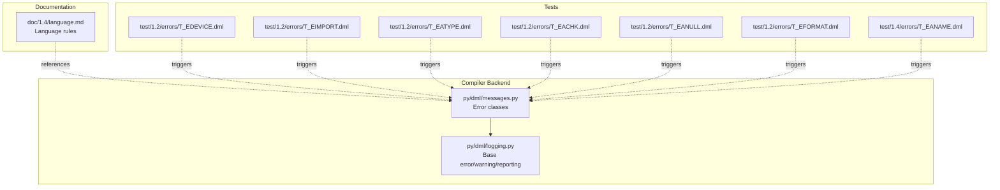

**Diagram sources**
- [messages.py](file://py/dml/messages.py#L249-L751)
- [logging.py](file://py/dml/logging.py#L106-L252)
- [language.md](file://doc/1.4/language.md#L149-L196)
- [T_EDEVICE.dml](file://test/1.2/errors/T_EDEVICE.dml#L1-L8)
- [T_EIMPORT.dml](file://test/1.2/errors/T_EIMPORT.dml#L1-L15)
- [T_EATYPE.dml](file://test/1.2/errors/T_EATYPE.dml#L1-L9)
- [T_EACHK.dml](file://test/1.2/errors/T_EACHK.dml#L1-L24)
- [T_EANULL.dml](file://test/1.2/errors/T_EANULL.dml#L1-L13)
- [T_EFORMAT.dml](file://test/1.2/errors/T_EFORMAT.dml#L1-L13)
- [T_EANAME.dml](file://test/1.4/errors/T_EANAME.dml#L1-L62)

**Section sources**
- [messages.py](file://py/dml/messages.py#L249-L751)
- [logging.py](file://py/dml/logging.py#L106-L252)
- [language.md](file://doc/1.4/language.md#L149-L196)

## Core Components
- EDEVICE: Enforces presence of a device declaration in the top-level DML file.
- EIMPORT: Reports unresolved import targets and invalid import paths.
- EATYPE: Requires an attribute to declare its type via attr_type or type.
- EANAME: Prohibits using reserved or auto-generated names as attribute/register/saved identifiers.
- EACHK: Ensures checkpointable attributes expose get/set methods when required by configuration.
- EANULL: Flags attributes that lack both get and set methods.
- EFORMAT: Validates log format strings and reports malformed format specifiers.

These classes inherit from the base error reporting infrastructure and provide formatted messages with contextual site information.

**Section sources**
- [messages.py](file://py/dml/messages.py#L561-L751)
- [logging.py](file://py/dml/logging.py#L242-L252)

## Architecture Overview
The DML compiler raises semantic errors during parsing and semantic analysis. Error classes encapsulate the validation rule and message formatting. The logging module provides the base classes and reporting pipeline.

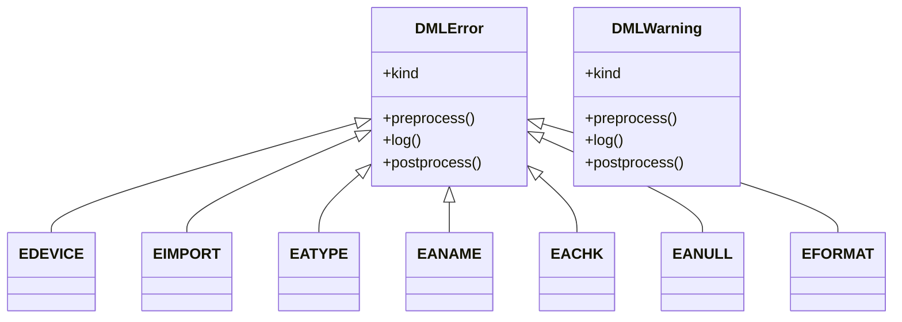

**Diagram sources**
- [messages.py](file://py/dml/messages.py#L249-L751)
- [logging.py](file://py/dml/logging.py#L242-L252)

## Detailed Component Analysis

### EDEVICE: Missing device declaration
- Validation rule: Top-level DML file must contain a device declaration.
- Constraint: The device declaration must be present and placed appropriately per language rules.
- Triggering pattern: A file with a version declaration and unrelated declarations but no device declaration.
- Resolution:
  - Add a device declaration at the top of the file.
  - Ensure the file is intended as a device model and not an import-only module.
- Cross-reference:
  - Language structure and device declaration placement are defined in the language manual.

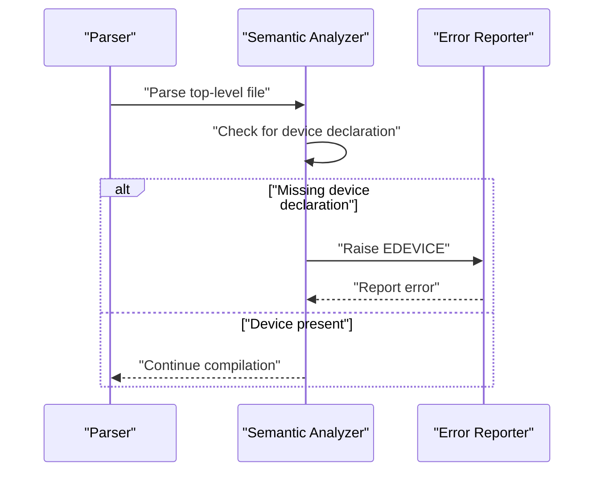

**Diagram sources**
- [messages.py](file://py/dml/messages.py#L752-L758)
- [language.md](file://doc/1.4/language.md#L179-L196)

**Section sources**
- [messages.py](file://py/dml/messages.py#L752-L758)
- [language.md](file://doc/1.4/language.md#L179-L196)
- [T_EDEVICE.dml](file://test/1.2/errors/T_EDEVICE.dml#L1-L8)

### EIMPORT: File import failures
- Validation rule: Import paths must resolve to readable files; directories cannot be imported directly.
- Constraint: Import targets must be valid files according to the module system rules.
- Triggering patterns:
  - Importing a non-existing file.
  - Importing a path that resolves to a directory.
- Resolution:
  - Verify the import path and file name.
  - Ensure the imported file exists and is not a directory.
  - Use the documented include search mechanism if applicable.

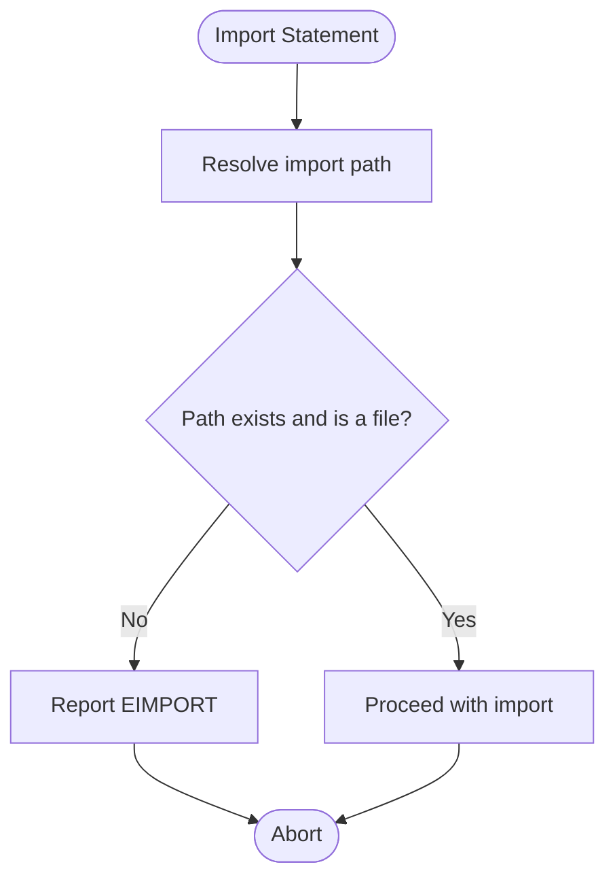

**Diagram sources**
- [messages.py](file://py/dml/messages.py#L250-L259)

**Section sources**
- [messages.py](file://py/dml/messages.py#L250-L259)
- [T_EIMPORT.dml](file://test/1.2/errors/T_EIMPORT.dml#L1-L15)

### EATTRTYPE: Attribute type issues
- Validation rule: Attributes must declare their type via attr_type or type.
- Constraint: The attribute must specify a type parameter; missing type leads to ambiguity.
- Triggering pattern: Declaring an attribute without specifying attr_type/type.
- Resolution:
  - Add parameter attr_type or type to the attribute.
  - Ensure the chosen type matches the attribute’s intended semantics.

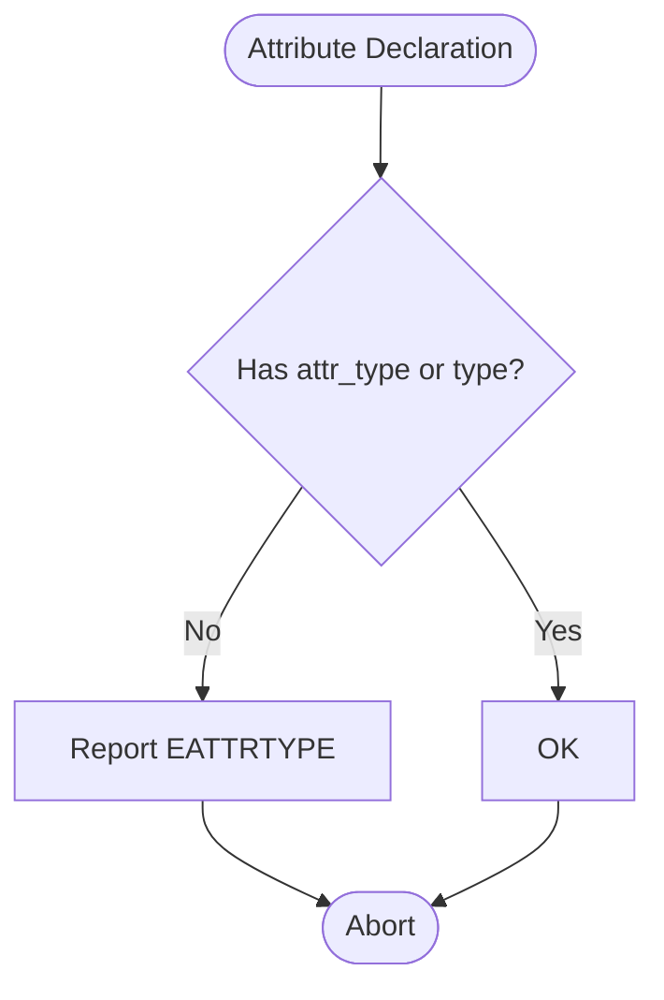

**Diagram sources**
- [messages.py](file://py/dml/messages.py#L561-L569)

**Section sources**
- [messages.py](file://py/dml/messages.py#L561-L569)
- [T_EATYPE.dml](file://test/1.2/errors/T_EATYPE.dml#L1-L9)

### EANAME: Illegal attribute names
- Validation rule: Certain names are reserved or auto-generated and cannot be used as attribute, register, or saved identifiers.
- Constraint: Names colliding with predefined attributes or proxies are disallowed.
- Triggering patterns:
  - Using reserved names like access_count, attributes, build_id, etc., as attribute/register/saved identifiers.
  - Assigning a name parameter that conflicts with reserved identifiers.
- Resolution:
  - Choose alternative names that do not collide with reserved identifiers.
  - Avoid shadowing auto-generated proxy attributes.

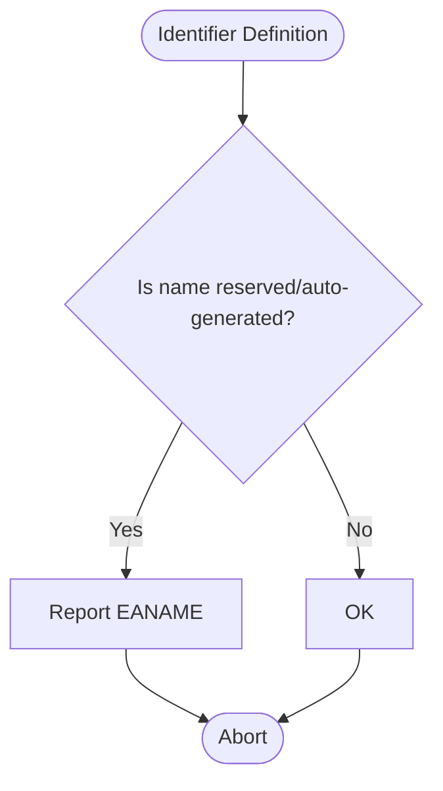

**Diagram sources**
- [messages.py](file://py/dml/messages.py#L570-L576)
- [T_EANAME.dml](file://test/1.4/errors/T_EANAME.dml#L10-L62)

**Section sources**
- [messages.py](file://py/dml/messages.py#L570-L576)
- [T_EANAME.dml](file://test/1.4/errors/T_EANAME.dml#L10-L62)

### EATYPE: Attribute type undefined
- Validation rule: The attribute type must be defined; either attr_type or type must be provided.
- Constraint: Undefined attribute type is not allowed.
- Triggering pattern: Declaring an attribute without attr_type/type.
- Resolution:
  - Provide a valid type via attr_type or type.
  - Align the type with the attribute’s intended value representation.

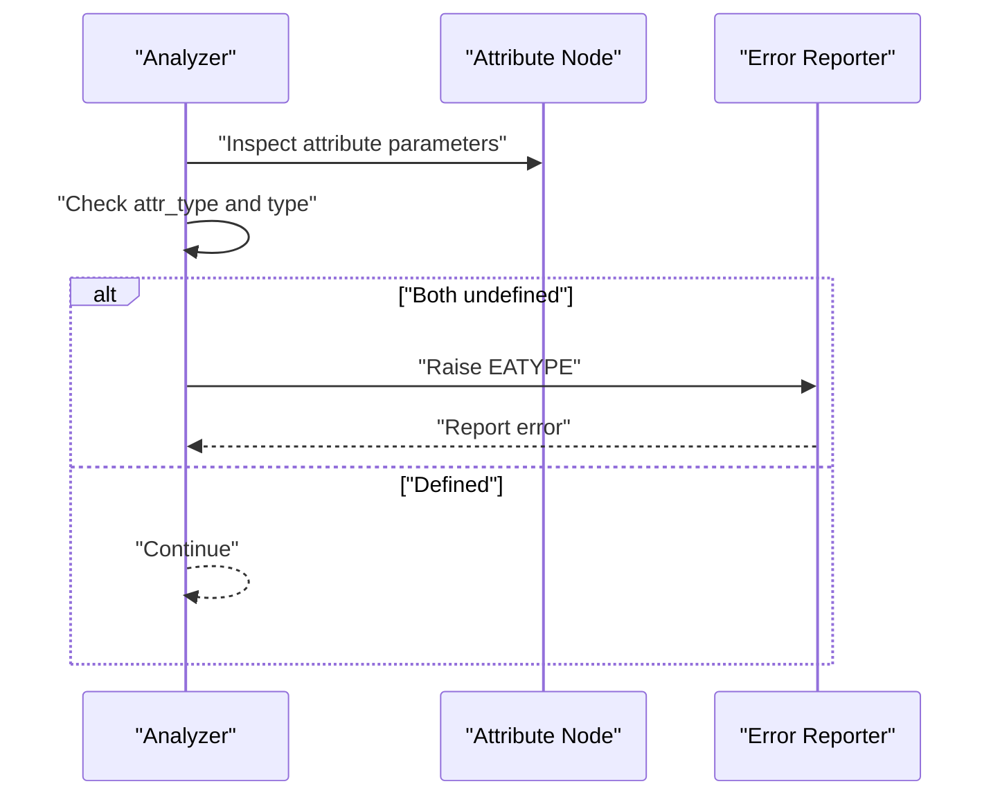

**Diagram sources**
- [messages.py](file://py/dml/messages.py#L561-L569)

**Section sources**
- [messages.py](file://py/dml/messages.py#L561-L569)
- [T_EATYPE.dml](file://test/1.2/errors/T_EATYPE.dml#L7-L9)

### EACHK: Checkpointable attribute issues
- Validation rule: For checkpointable attributes with configuration required or optional, both get and set must be provided.
- Constraint: Missing get or set prevents checkpointing when configuration requires it.
- Triggering patterns:
  - Attribute with configuration required/optional and only set/get method.
- Resolution:
  - Provide both get and set methods for checkpointable attributes when configuration is required or optional.
  - Adjust configuration if the attribute is intentionally non-checkpointable.

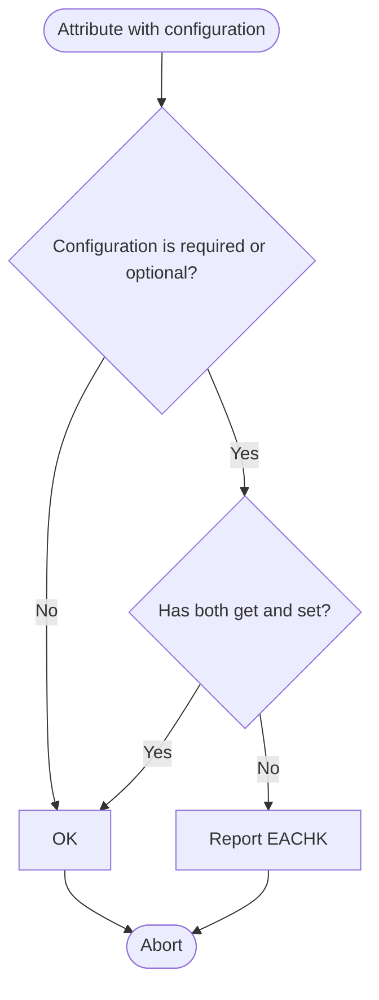

**Diagram sources**
- [messages.py](file://py/dml/messages.py#L577-L584)
- [T_EACHK.dml](file://test/1.2/errors/T_EACHK.dml#L8-L24)

**Section sources**
- [messages.py](file://py/dml/messages.py#L577-L584)
- [T_EACHK.dml](file://test/1.2/errors/T_EACHK.dml#L8-L24)

### EANULL: Useless attributes
- Validation rule: Attributes must have at least one of get or set to be useful.
- Constraint: Attributes without any accessor are flagged as useless.
- Triggering pattern: Attribute declared without get/set methods.
- Resolution:
  - Add a get method, a set method, or both.
  - Remove the attribute if it is not needed.

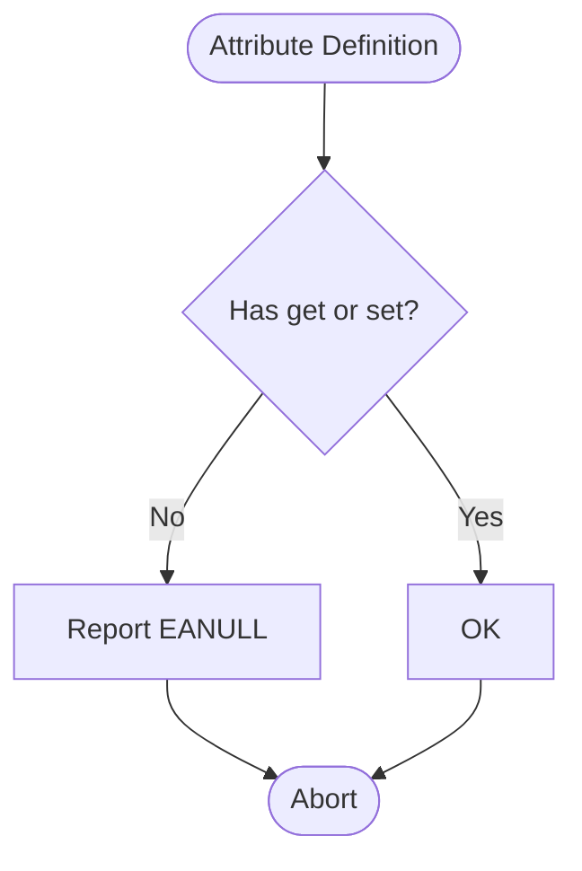

**Diagram sources**
- [messages.py](file://py/dml/messages.py#L585-L590)
- [T_EANULL.dml](file://test/1.2/errors/T_EANULL.dml#L9-L13)

**Section sources**
- [messages.py](file://py/dml/messages.py#L585-L590)
- [T_EANULL.dml](file://test/1.2/errors/T_EANULL.dml#L9-L13)

### EFORMAT: Malformed format strings
- Validation rule: Log format strings must be syntactically valid.
- Constraint: Unknown or malformed format specifiers are rejected.
- Triggering patterns:
  - Using invalid format specifiers in log statements.
- Resolution:
  - Fix the format string to use valid specifiers.
  - Ensure the number and types of placeholders match the provided arguments.

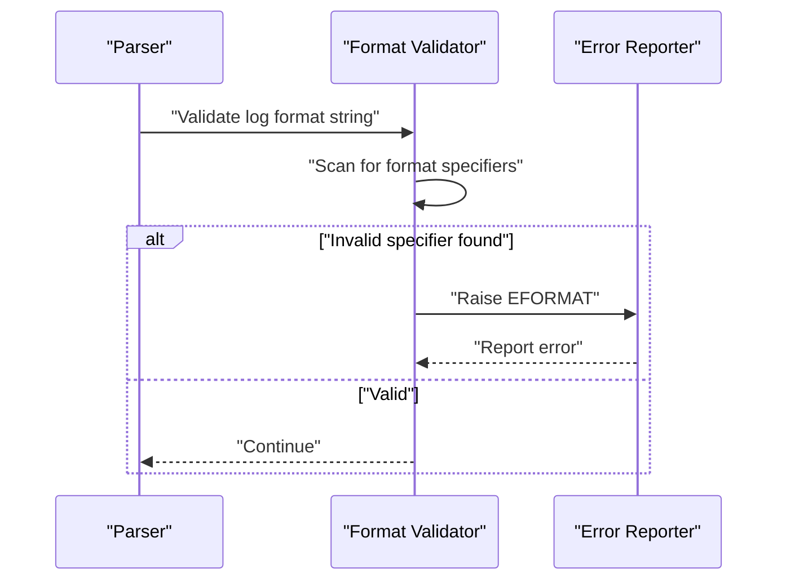

**Diagram sources**
- [messages.py](file://py/dml/messages.py#L746-L751)
- [T_EFORMAT.dml](file://test/1.2/errors/T_EFORMAT.dml#L8-L12)

**Section sources**
- [messages.py](file://py/dml/messages.py#L746-L751)
- [T_EFORMAT.dml](file://test/1.2/errors/T_EFORMAT.dml#L8-L12)

## Dependency Analysis
- Error classes depend on the base error reporting infrastructure for formatting and site location.
- Language rules from the reference manual define the constraints enforced by the compiler.
- Tests serve as concrete examples of violations and expected error IDs.

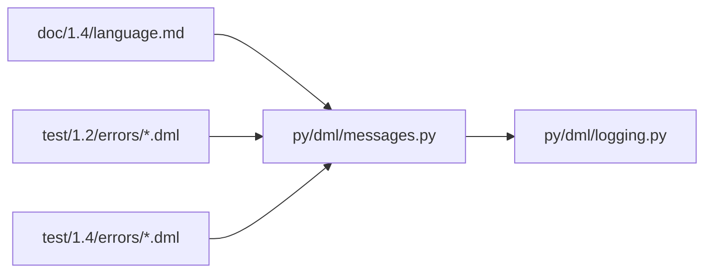

**Diagram sources**
- [messages.py](file://py/dml/messages.py#L249-L751)
- [logging.py](file://py/dml/logging.py#L106-L252)
- [language.md](file://doc/1.4/language.md#L149-L196)
- [T_EDEVICE.dml](file://test/1.2/errors/T_EDEVICE.dml#L1-L8)
- [T_EIMPORT.dml](file://test/1.2/errors/T_EIMPORT.dml#L1-L15)
- [T_EATYPE.dml](file://test/1.2/errors/T_EATYPE.dml#L1-L9)
- [T_EACHK.dml](file://test/1.2/errors/T_EACHK.dml#L1-L24)
- [T_EANULL.dml](file://test/1.2/errors/T_EANULL.dml#L1-L13)
- [T_EFORMAT.dml](file://test/1.2/errors/T_EFORMAT.dml#L1-L13)
- [T_EANAME.dml](file://test/1.4/errors/T_EANAME.dml#L1-L62)

**Section sources**
- [messages.py](file://py/dml/messages.py#L249-L751)
- [logging.py](file://py/dml/logging.py#L106-L252)
- [language.md](file://doc/1.4/language.md#L149-L196)

## Performance Considerations
- Semantic checks are performed during parsing and early semantic analysis. Keeping attribute definitions concise and avoiding unnecessary attributes reduces overhead.
- Prefer explicit type declarations to minimize ambiguity and re-analysis.

## Troubleshooting Guide
- EDEVICE: Ensure the top-level file contains a device declaration and is not misused as an import-only module.
- EIMPORT: Verify the import path resolves to an existing file; avoid importing directories.
- EATYPE/EATTRTYPE: Always specify attr_type or type for attributes.
- EANAME: Avoid reserved names; choose unique identifiers for attributes, registers, and saved fields.
- EACHK: Provide both get and set for checkpointable attributes when configuration requires it.
- EANULL: Add at least one accessor (get or set) to make attributes meaningful.
- EFORMAT: Correct invalid format specifiers in log statements.

Best practices:
- Review language rules for device and attribute declarations.
- Use the standard templates as references for correct attribute typing and structure.
- Keep format strings simple and validated before compilation.

**Section sources**
- [messages.py](file://py/dml/messages.py#L250-L751)
- [dml-builtins.dml](file://lib/1.2/dml-builtins.dml#L288-L333)

## Conclusion
The DML compiler enforces a set of semantic rules to ensure device models are well-formed and maintainable. The error classes documented here capture the most common pitfalls in device declarations, imports, attribute typing, naming, checkpointability, usefulness, and log formatting. By aligning code with the language rules and following the resolution strategies outlined above, developers can avoid these semantic errors and write robust DML models.