# Syntax Errors

<cite>
**Referenced Files in This Document**
- [messages.py](file://py/dml/messages.py)
- [T_ESYNTAX_01.dml](file://test/1.2/errors/T_ESYNTAX_01.dml)
- [T_ESYNTAX_02.dml](file://test/1.2/errors/T_ESYNTAX_02.dml)
- [T_ESYNTAX_03.dml](file://test/1.2/errors/T_ESYNTAX_03.dml)
- [T_ESYNTAX_04.dml](file://test/1.2/errors/T_ESYNTAX_04.dml)
- [T_ESYNTAX_05.dml](file://test/1.2/errors/T_ESYNTAX_05.dml)
- [T_ESYNTAX_06.dml](file://test/1.2/errors/T_ESYNTAX_06.dml)
- [T_ESYNTAX_07.dml](file://test/1.2/errors/T_ESYNTAX_07.dml)
- [T_ESYNTAX_08.dml](file://test/1.2/errors/T_ESYNTAX_08.dml)
- [T_ESYNTAX_10.dml](file://test/1.2/errors/T_ESYNTAX_10.dml)
- [T_ESYNTAX_12.dml](file://test/1.2/errors/T_ESYNTAX_12.dml)
- [T_ESYNTAX_13.dml](file://test/1.2/errors/T_ESYNTAX_13.dml)
- [T_ESYNTAX_14.dml](file://test/1.2/errors/T_ESYNTAX_14.dml)
- [T_ESYNTAX_15.dml](file://test/1.2/errors/T_ESYNTAX_15.dml)
- [T_ESYNTAX_16.dml](file://test/1.2/errors/T_ESYNTAX_16.dml)
- [T_ESYNTAX_17.dml](file://test/1.2/errors/T_ESYNTAX_17.dml)
- [T_ESYNTAX_18.dml](file://test/1.2/errors/T_ESYNTAX_18.dml)
- [T_ESYNTAX_broken_utf8.dml](file://test/1.2/errors/T_ESYNTAX_broken_utf8.dml)
- [T_ESYNTAX_local_untyped.dml](file://test/1.2/errors/T_ESYNTAX_local_untyped.dml)
- [T_ESYNTAX_subdevice.dml](file://test/1.2/errors/T_ESYNTAX_subdevice.dml)
- [T_ESYNTAX_unnamed_cdecl.dml](file://test/1.2/errors/T_ESYNTAX_unnamed_cdecl.dml)
- [T_ESYNTAX_version_broken.dml](file://test/1.2/errors/T_ESYNTAX_version_broken.dml)
- [T_ESYNTAX_version_nosemi.dml](file://test/1.2/errors/T_ESYNTAX_version_nosemi.dml)
- [T_ESYNTAX_version_wrong.dml](file://test/1.2/errors/T_ESYNTAX_version_wrong.dml)
- [T_charlit.dml](file://test/1.2/errors/T_charlit.dml)
- [T_float.dml](file://test/1.2/errors/T_float.dml)
- [T_ident.dml](file://test/1.2/errors/T_ident.dml)
- [T_int.dml](file://test/1.2/errors/T_int.dml)
- [T_stringlit.dml](file://test/1.2/errors/T_stringlit.dml)
- [T_local_struct.dml](file://test/1.2/errors/T_local_struct.dml)
- [T_locals.dml](file://test/1.2/errors/T_locals.dml)
- [T_newfield.dml](file://test/1.2/errors/T_newfield.dml)
- [T_precedence.dml](file://test/1.2/errors/T_precedence.dml)
- [T_select.dml](file://test/1.2/errors/T_select.dml)
- [T_static.dml](file://test/1.2/errors/T_static.dml)
- [T_unicode.dml](file://test/1.2/errors/T_unicode.dml)
- [T_bitorder_3.dml](file://test/1.2/errors/T_bitorder_3.dml)
- [T_bitorder_3.dml](file://test/1.4/errors/T_bitorder_3.dml)
- [dmllex.py](file://py/dml/dmllex.py)
- [dmllex12.py](file://py/dml/dmllex12.py)
- [dmllex14.py](file://py/dml/dmllex14.py)
- [dmlparse.py](file://py/dml/dmlparse.py)
- [dml12-compatibility.dml](file://lib/1.2/dml12-compatibility.dml)
- [dml-builtins.dml](file://lib/1.2/dml-builtins.dml)
- [dml12-compatibility.dml](file://lib/1.4/dml12-compatibility.dml)
- [dml-builtins.dml](file://lib/1.4/dml-builtins.dml)
</cite>

## Table of Contents
1. [Introduction](#introduction)
2. [Project Structure](#project-structure)
3. [Core Components](#core-components)
4. [Architecture Overview](#architecture-overview)
5. [Detailed Component Analysis](#detailed-component-analysis)
6. [Dependency Analysis](#dependency-analysis)
7. [Performance Considerations](#performance-considerations)
8. [Troubleshooting Guide](#troubleshooting-guide)
9. [Conclusion](#conclusion)
10. [Appendices](#appendices)

## Introduction
This document provides comprehensive documentation for DML syntax errors. It focuses on syntax-related error classes and explains how the compiler reports malformed constructs, including token location information and step-by-step correction procedures. Practical examples from the test suite illustrate typical mistakes, and version-specific differences between DML 1.2 and 1.4 are highlighted to help developers quickly identify and fix syntax issues.

## Project Structure
The repository organizes syntax error reporting in a central module and validates behavior through targeted test files. The following diagram shows the relationship between the error reporting module and representative syntax error test cases.

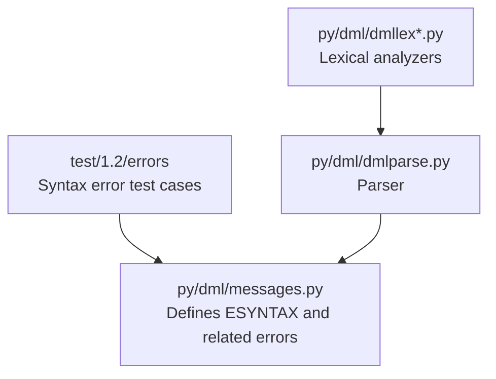

**Diagram sources**
- [messages.py](file://py/dml/messages.py#L775-L791)
- [dmllex.py](file://py/dml/dmllex.py)
- [dmllex12.py](file://py/dml/dmllex12.py)
- [dmllex14.py](file://py/dml/dmllex14.py)
- [dmlparse.py](file://py/dml/dmlparse.py)

**Section sources**
- [messages.py](file://py/dml/messages.py#L775-L791)
- [dmllex.py](file://py/dml/dmllex.py)
- [dmllex12.py](file://py/dml/dmllex12.py)
- [dmllex14.py](file://py/dml/dmllex14.py)
- [dmlparse.py](file://py/dml/dmlparse.py)

## Core Components
This section documents the syntax error classes and their characteristics, focusing on ESYNTAX and related syntax-related errors. Each subsection explains the error’s purpose, message format, and correction procedure.

- ESYNTAX
  - Purpose: General syntax error reporting for malformed constructs.
  - Message format: Includes optional token context and a reason string.
  - Token location: Reported at the site where the lexical or parsing stage detects a syntax problem.
  - Correction procedure:
    - Inspect the reported token context and surrounding lines.
    - Fix unmatched delimiters, missing punctuation, or invalid keywords.
    - Ensure proper string and character literal syntax.
    - Verify version directives and semicolon placement.
  - Example test cases:
    - [T_ESYNTAX_01.dml](file://test/1.2/errors/T_ESYNTAX_01.dml)
    - [T_ESYNTAX_02.dml](file://test/1.2/errors/T_ESYNTAX_02.dml)
    - [T_ESYNTAX_03.dml](file://test/1.2/errors/T_ESYNTAX_03.dml)
    - [T_ESYNTAX_04.dml](file://test/1.2/errors/T_ESYNTAX_04.dml)
    - [T_ESYNTAX_05.dml](file://test/1.2/errors/T_ESYNTAX_05.dml)
    - [T_ESYNTAX_06.dml](file://test/1.2/errors/T_ESYNTAX_06.dml)
    - [T_ESYNTAX_07.dml](file://test/1.2/errors/T_ESYNTAX_07.dml)
    - [T_ESYNTAX_08.dml](file://test/1.2/errors/T_ESYNTAX_08.dml)
    - [T_ESYNTAX_10.dml](file://test/1.2/errors/T_ESYNTAX_10.dml)
    - [T_ESYNTAX_12.dml](file://test/1.2/errors/T_ESYNTAX_12.dml)
    - [T_ESYNTAX_13.dml](file://test/1.2/errors/T_ESYNTAX_13.dml)
    - [T_ESYNTAX_14.dml](file://test/1.2/errors/T_ESYNTAX_14.dml)
    - [T_ESYNTAX_15.dml](file://test/1.2/errors/T_ESYNTAX_15.dml)
    - [T_ESYNTAX_16.dml](file://test/1.2/errors/T_ESYNTAX_16.dml)
    - [T_ESYNTAX_17.dml](file://test/1.2/errors/T_ESYNTAX_17.dml)
    - [T_ESYNTAX_18.dml](file://test/1.2/errors/T_ESYNTAX_18.dml)
    - [T_ESYNTAX_broken_utf8.dml](file://test/1.2/errors/T_ESYNTAX_broken_utf8.dml)
    - [T_ESYNTAX_local_untyped.dml](file://test/1.2/errors/T_ESYNTAX_local_untyped.dml)
    - [T_ESYNTAX_subdevice.dml](file://test/1.2/errors/T_ESYNTAX_subdevice.dml)
    - [T_ESYNTAX_unnamed_cdecl.dml](file://test/1.2/errors/T_ESYNTAX_unnamed_cdecl.dml)
    - [T_ESYNTAX_version_broken.dml](file://test/1.2/errors/T_ESYNTAX_version_broken.dml)
    - [T_ESYNTAX_version_nosemi.dml](file://test/1.2/errors/T_ESYNTAX_version_nosemi.dml)
    - [T_ESYNTAX_version_wrong.dml](file://test/1.2/errors/T_ESYNTAX_version_wrong.dml)

- ECHARLIT
  - Purpose: Reports invalid character literals.
  - Message format: Indicates malformed character literal syntax.
  - Token location: Reported at the invalid character literal.
  - Correction procedure:
    - Ensure character literals are enclosed in single quotes.
    - Use valid escape sequences or single characters.
    - Avoid multi-character literals.
  - Example test cases:
    - [T_charlit.dml](file://test/1.2/errors/T_charlit.dml)

- ESTRINGLIT
  - Purpose: Reports invalid string literals.
  - Message format: Indicates malformed string literal syntax.
  - Token location: Reported at the invalid string literal.
  - Correction procedure:
    - Ensure string literals are enclosed in double quotes.
    - Use valid escape sequences for special characters.
    - Fix unclosed or broken UTF-8 sequences.
  - Example test cases:
    - [T_stringlit.dml](file://test/1.2/errors/T_stringlit.dml)
    - [T_ESYNTAX_03.dml](file://test/1.2/errors/T_ESYNTAX_03.dml)
    - [T_ESYNTAX_10.dml](file://test/1.2/errors/T_ESYNTAX_10.dml)
    - [T_ESYNTAX_14.dml](file://test/1.2/errors/T_ESYNTAX_14.dml)
    - [T_ESYNTAX_15.dml](file://test/1.2/errors/T_ESYNTAX_15.dml)
    - [T_ESYNTAX_16.dml](file://test/1.2/errors/T_ESYNTAX_16.dml)
    - [T_ESYNTAX_broken_utf8.dml](file://test/1.2/errors/T_ESYNTAX_broken_utf8.dml)

- EINT
  - Purpose: Reports invalid integer literals.
  - Message format: Indicates malformed integer literal syntax.
  - Token location: Reported at the invalid integer literal.
  - Correction procedure:
    - Ensure correct base prefixes and digit sets.
    - Avoid invalid suffixes or malformed numeric forms.
  - Example test cases:
    - [T_int.dml](file://test/1.2/errors/T_int.dml)

- EFLOAT
  - Purpose: Reports invalid floating-point literals.
  - Message format: Indicates malformed float literal syntax.
  - Token location: Reported at the invalid float literal.
  - Correction procedure:
    - Ensure correct decimal and exponent forms.
    - Use valid separators and exponents.
  - Example test cases:
    - [T_float.dml](file://test/1.2/errors/T_float.dml)

- EIDENT
  - Purpose: Reports unknown identifiers.
  - Message format: Indicates an undeclared identifier.
  - Token location: Reported at the unknown identifier.
  - Correction procedure:
    - Declare the identifier before use.
    - Check for typos or missing imports.
  - Example test cases:
    - [T_ident.dml](file://test/1.2/errors/T_ident.dml)

- ELOCALSTRUCT
  - Purpose: Reports disallowed local struct declarations.
  - Message format: Indicates struct declarations not allowed in certain contexts.
  - Token location: Reported at the invalid struct declaration.
  - Correction procedure:
    - Move struct declarations to allowed scopes.
    - Use forward declarations or typedefs as appropriate.
  - Example test cases:
    - [T_local_struct.dml](file://test/1.2/errors/T_local_struct.dml)

- ELOCALS
  - Purpose: Reports invalid local variable declarations.
  - Message format: Indicates malformed local variable syntax.
  - Token location: Reported at the invalid local declaration.
  - Correction procedure:
    - Ensure proper type and initialization syntax.
    - Remove or correct missing initializers.
  - Example test cases:
    - [T_locals.dml](file://test/1.2/errors/T_locals.dml)

- ENEWFIELD
  - Purpose: Reports invalid field declarations in new expressions.
  - Message format: Indicates malformed field syntax in new expressions.
  - Token location: Reported at the invalid field.
  - Correction procedure:
    - Ensure field names and values match the target type.
    - Use correct syntax for field initializers.
  - Example test cases:
    - [T_newfield.dml](file://test/1.2/errors/T_newfield.dml)

- EPRECEDENCE
  - Purpose: Reports ambiguous operator precedence or grouping issues.
  - Message format: Indicates precedence or grouping ambiguity.
  - Token location: Reported at the ambiguous expression.
  - Correction procedure:
    - Add parentheses to clarify intended grouping.
    - Reorder operations to avoid ambiguity.
  - Example test cases:
    - [T_precedence.dml](file://test/1.2/errors/T_precedence.dml)

- ESELECT
  - Purpose: Reports invalid select expressions or cases.
  - Message format: Indicates malformed select syntax.
  - Token location: Reported at the invalid select construct.
  - Correction procedure:
    - Ensure proper case syntax and guards.
    - Match select expression types with cases.
  - Example test cases:
    - [T_select.dml](file://test/1.2/errors/T_select.dml)

- ESTATIC
  - Purpose: Reports invalid static declarations or usage.
  - Message format: Indicates malformed static usage.
  - Token location: Reported at the invalid static declaration.
  - Correction procedure:
    - Ensure static is used in allowed contexts.
    - Remove or correct invalid static modifiers.
  - Example test cases:
    - [T_static.dml](file://test/1.2/errors/T_static.dml)

- EUNICODE
  - Purpose: Reports invalid Unicode or encoding in tokens.
  - Message format: Indicates invalid Unicode or encoding in tokens.
  - Token location: Reported at the problematic token.
  - Correction procedure:
    - Ensure valid Unicode and encoding in identifiers and strings.
    - Fix non-ASCII or broken sequences.
  - Example test cases:
    - [T_unicode.dml](file://test/1.2/errors/T_unicode.dml)
    - [T_ESYNTAX_08.dml](file://test/1.2/errors/T_ESYNTAX_08.dml)

- EBITORDER
  - Purpose: Reports invalid bit order or bit-slice syntax.
  - Message format: Indicates malformed bit order or slice syntax.
  - Token location: Reported at the invalid bit order construct.
  - Correction procedure:
    - Ensure correct bit order syntax and width constraints.
    - Use allowed bit-slice forms per DML version.
  - Example test cases:
    - [T_bitorder_3.dml](file://test/1.2/errors/T_bitorder_3.dml)
    - [T_bitorder_3.dml](file://test/1.4/errors/T_bitorder_3.dml)

**Section sources**
- [messages.py](file://py/dml/messages.py#L775-L791)
- [T_ESYNTAX_01.dml](file://test/1.2/errors/T_ESYNTAX_01.dml#L1-L9)
- [T_ESYNTAX_02.dml](file://test/1.2/errors/T_ESYNTAX_02.dml#L1-L9)
- [T_ESYNTAX_03.dml](file://test/1.2/errors/T_ESYNTAX_03.dml#L1-L10)
- [T_ESYNTAX_04.dml](file://test/1.2/errors/T_ESYNTAX_04.dml#L1-L9)
- [T_ESYNTAX_05.dml](file://test/1.2/errors/T_ESYNTAX_05.dml#L1-L15)
- [T_ESYNTAX_06.dml](file://test/1.2/errors/T_ESYNTAX_06.dml#L1-L29)
- [T_ESYNTAX_07.dml](file://test/1.2/errors/T_ESYNTAX_07.dml#L1-L13)
- [T_ESYNTAX_08.dml](file://test/1.2/errors/T_ESYNTAX_08.dml#L1-L10)
- [T_ESYNTAX_10.dml](file://test/1.2/errors/T_ESYNTAX_10.dml#L1-L11)
- [T_ESYNTAX_12.dml](file://test/1.2/errors/T_ESYNTAX_12.dml#L1-L13)
- [T_ESYNTAX_13.dml](file://test/1.2/errors/T_ESYNTAX_13.dml#L1-L12)
- [T_ESYNTAX_14.dml](file://test/1.2/errors/T_ESYNTAX_14.dml#L1-L14)
- [T_ESYNTAX_15.dml](file://test/1.2/errors/T_ESYNTAX_15.dml#L1-L14)
- [T_ESYNTAX_16.dml](file://test/1.2/errors/T_ESYNTAX_16.dml#L1-L14)
- [T_ESYNTAX_17.dml](file://test/1.2/errors/T_ESYNTAX_17.dml#L1-L16)
- [T_ESYNTAX_18.dml](file://test/1.2/errors/T_ESYNTAX_18.dml#L1-L13)
- [T_ESYNTAX_broken_utf8.dml](file://test/1.2/errors/T_ESYNTAX_broken_utf8.dml)
- [T_ESYNTAX_local_untyped.dml](file://test/1.2/errors/T_ESYNTAX_local_untyped.dml)
- [T_ESYNTAX_subdevice.dml](file://test/1.2/errors/T_ESYNTAX_subdevice.dml)
- [T_ESYNTAX_unnamed_cdecl.dml](file://test/1.2/errors/T_ESYNTAX_unnamed_cdecl.dml)
- [T_ESYNTAX_version_broken.dml](file://test/1.2/errors/T_ESYNTAX_version_broken.dml)
- [T_ESYNTAX_version_nosemi.dml](file://test/1.2/errors/T_ESYNTAX_version_nosemi.dml)
- [T_ESYNTAX_version_wrong.dml](file://test/1.2/errors/T_ESYNTAX_version_wrong.dml)
- [T_charlit.dml](file://test/1.2/errors/T_charlit.dml)
- [T_float.dml](file://test/1.2/errors/T_float.dml)
- [T_ident.dml](file://test/1.2/errors/T_ident.dml)
- [T_int.dml](file://test/1.2/errors/T_int.dml)
- [T_stringlit.dml](file://test/1.2/errors/T_stringlit.dml)
- [T_local_struct.dml](file://test/1.2/errors/T_local_struct.dml)
- [T_locals.dml](file://test/1.2/errors/T_locals.dml)
- [T_newfield.dml](file://test/1.2/errors/T_newfield.dml)
- [T_precedence.dml](file://test/1.2/errors/T_precedence.dml)
- [T_select.dml](file://test/1.2/errors/T_select.dml)
- [T_static.dml](file://test/1.2/errors/T_static.dml)
- [T_unicode.dml](file://test/1.2/errors/T_unicode.dml)
- [T_bitorder_3.dml](file://test/1.2/errors/T_bitorder_3.dml)
- [T_bitorder_3.dml](file://test/1.4/errors/T_bitorder_3.dml)

## Architecture Overview
The syntax error reporting pipeline integrates lexical analysis, parsing, and error emission. The following sequence diagram shows how a syntax error is detected and reported.

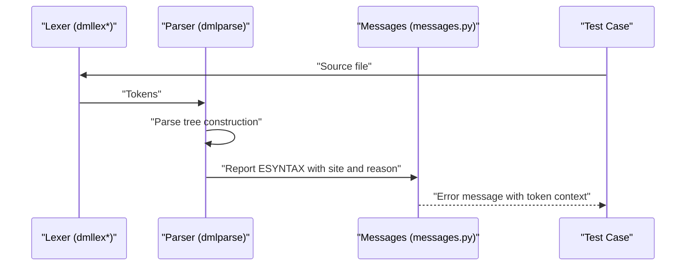

**Diagram sources**
- [messages.py](file://py/dml/messages.py#L775-L791)
- [dmllex.py](file://py/dml/dmllex.py)
- [dmllex12.py](file://py/dml/dmllex12.py)
- [dmllex14.py](file://py/dml/dmllex14.py)
- [dmlparse.py](file://py/dml/dmlparse.py)

## Detailed Component Analysis

### ESYNTAX Analysis
ESYNTAX is the generic syntax error class used when the parser or lexer encounters malformed input. The error includes optional token context and a reason string.

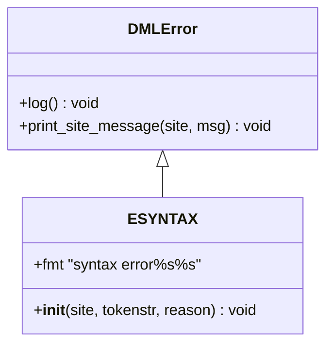

**Diagram sources**
- [messages.py](file://py/dml/messages.py#L775-L791)

Practical examples from the test suite:
- Unclosed string literal: [T_ESYNTAX_03.dml](file://test/1.2/errors/T_ESYNTAX_03.dml#L8-L9)
- Unexpected token in declaration: [T_ESYNTAX_05.dml](file://test/1.2/errors/T_ESYNTAX_05.dml#L12-L13)
- Malformed bank declaration: [T_ESYNTAX_04.dml](file://test/1.2/errors/T_ESYNTAX_04.dml#L8-L8)
- Broken UTF-8 in string: [T_ESYNTAX_broken_utf8.dml](file://test/1.2/errors/T_ESYNTAX_broken_utf8.dml)
- Version directive issues: [T_ESYNTAX_version_broken.dml](file://test/1.2/errors/T_ESYNTAX_version_broken.dml), [T_ESYNTAX_version_nosemi.dml](file://test/1.2/errors/T_ESYNTAX_version_nosemi.dml), [T_ESYNTAX_version_wrong.dml](file://test/1.2/errors/T_ESYNTAX_version_wrong.dml)

Correction procedure:
- Identify the token context indicated in the error message.
- Inspect the nearest punctuation, quotes, or keywords.
- Fix unmatched delimiters, missing semicolons, or invalid tokens.
- Validate version directive syntax and placement.

**Section sources**
- [messages.py](file://py/dml/messages.py#L775-L791)
- [T_ESYNTAX_03.dml](file://test/1.2/errors/T_ESYNTAX_03.dml#L8-L9)
- [T_ESYNTAX_05.dml](file://test/1.2/errors/T_ESYNTAX_05.dml#L12-L13)
- [T_ESYNTAX_04.dml](file://test/1.2/errors/T_ESYNTAX_04.dml#L8-L8)
- [T_ESYNTAX_broken_utf8.dml](file://test/1.2/errors/T_ESYNTAX_broken_utf8.dml)
- [T_ESYNTAX_version_broken.dml](file://test/1.2/errors/T_ESYNTAX_version_broken.dml)
- [T_ESYNTAX_version_nosemi.dml](file://test/1.2/errors/T_ESYNTAX_version_nosemi.dml)
- [T_ESYNTAX_version_wrong.dml](file://test/1.2/errors/T_ESYNTAX_version_wrong.dml)

### ECHARLIT Analysis
Character literals must be enclosed in single quotes and conform to valid escape sequences.

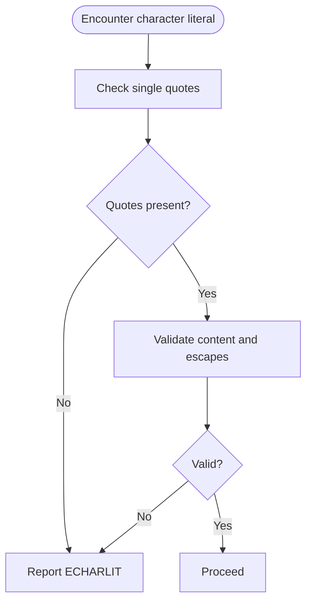

**Diagram sources**
- [T_charlit.dml](file://test/1.2/errors/T_charlit.dml)

Common mistakes:
- Multi-character literals: [T_ESYNTAX_17.dml](file://test/1.2/errors/T_ESYNTAX_17.dml#L12-L13)
- Invalid escape sequences: [T_ESYNTAX_15.dml](file://test/1.2/errors/T_ESYNTAX_15.dml#L11-L11)

Correction procedure:
- Wrap exactly one character in single quotes.
- Use allowed escape sequences.
- Avoid multi-character literals.

**Section sources**
- [T_charlit.dml](file://test/1.2/errors/T_charlit.dml)
- [T_ESYNTAX_15.dml](file://test/1.2/errors/T_ESYNTAX_15.dml#L11-L11)
- [T_ESYNTAX_17.dml](file://test/1.2/errors/T_ESYNTAX_17.dml#L12-L13)

### ESTRINGLIT Analysis
String literals must be enclosed in double quotes and handle escape sequences and encoding correctly.

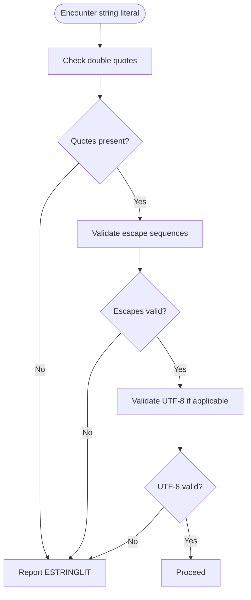

**Diagram sources**
- [T_stringlit.dml](file://test/1.2/errors/T_stringlit.dml)
- [T_ESYNTAX_03.dml](file://test/1.2/errors/T_ESYNTAX_03.dml#L8-L9)
- [T_ESYNTAX_10.dml](file://test/1.2/errors/T_ESYNTAX_10.dml#L9-L10)
- [T_ESYNTAX_14.dml](file://test/1.2/errors/T_ESYNTAX_14.dml#L12-L13)
- [T_ESYNTAX_15.dml](file://test/1.2/errors/T_ESYNTAX_15.dml#L11-L11)
- [T_ESYNTAX_16.dml](file://test/1.2/errors/T_ESYNTAX_16.dml#L11-L11)
- [T_ESYNTAX_broken_utf8.dml](file://test/1.2/errors/T_ESYNTAX_broken_utf8.dml)

Common mistakes:
- Unclosed strings: [T_ESYNTAX_03.dml](file://test/1.2/errors/T_ESYNTAX_03.dml#L8-L8)
- Non-ASCII characters: [T_ESYNTAX_10.dml](file://test/1.2/errors/T_ESYNTAX_10.dml#L9-L10)
- Broken UTF-8 sequences: [T_ESYNTAX_16.dml](file://test/1.2/errors/T_ESYNTAX_16.dml#L11-L11)

Correction procedure:
- Enclose the entire string in double quotes.
- Use valid escape sequences for special characters.
- Ensure UTF-8 compliance for non-ASCII content.

**Section sources**
- [T_stringlit.dml](file://test/1.2/errors/T_stringlit.dml)
- [T_ESYNTAX_03.dml](file://test/1.2/errors/T_ESYNTAX_03.dml#L8-L9)
- [T_ESYNTAX_10.dml](file://test/1.2/errors/T_ESYNTAX_10.dml#L9-L10)
- [T_ESYNTAX_14.dml](file://test/1.2/errors/T_ESYNTAX_14.dml#L12-L13)
- [T_ESYNTAX_15.dml](file://test/1.2/errors/T_ESYNTAX_15.dml#L11-L11)
- [T_ESYNTAX_16.dml](file://test/1.2/errors/T_ESYNTAX_16.dml#L11-L11)
- [T_ESYNTAX_broken_utf8.dml](file://test/1.2/errors/T_ESYNTAX_broken_utf8.dml)

### EINT Analysis
Integer literals must follow the correct base and digit conventions.

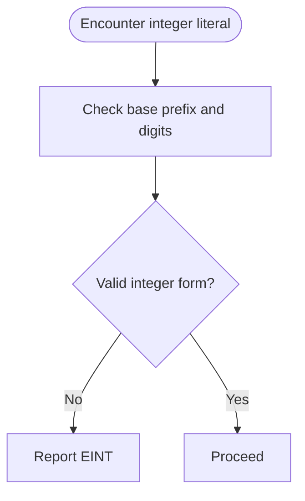

**Diagram sources**
- [T_int.dml](file://test/1.2/errors/T_int.dml)

Common mistakes:
- Invalid suffixes or malformed numeric forms.

Correction procedure:
- Use correct base prefixes (e.g., hexadecimal) and valid digit sets.
- Avoid invalid suffixes or malformed numeric forms.

**Section sources**
- [T_int.dml](file://test/1.2/errors/T_int.dml)

### EFLOAT Analysis
Floating-point literals must follow the correct decimal and exponent forms.

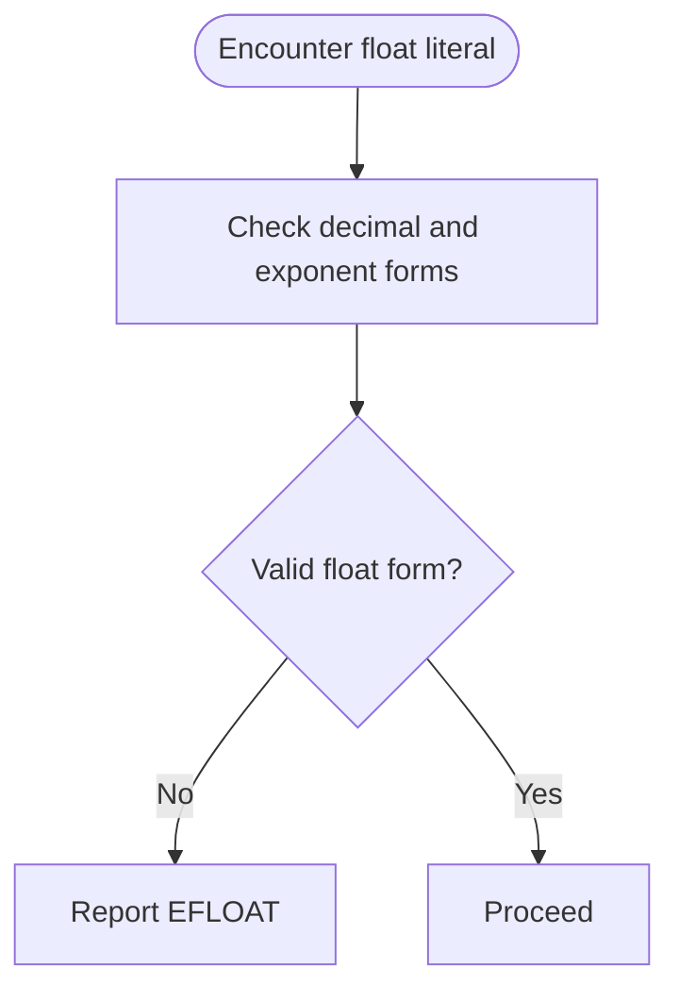

**Diagram sources**
- [T_float.dml](file://test/1.2/errors/T_float.dml)

Common mistakes:
- Incorrect decimal or exponent syntax.

Correction procedure:
- Ensure correct decimal and exponent forms.
- Use valid separators and exponents.

**Section sources**
- [T_float.dml](file://test/1.2/errors/T_float.dml)

### EIDENT Analysis
Unknown identifiers trigger EIDENT.

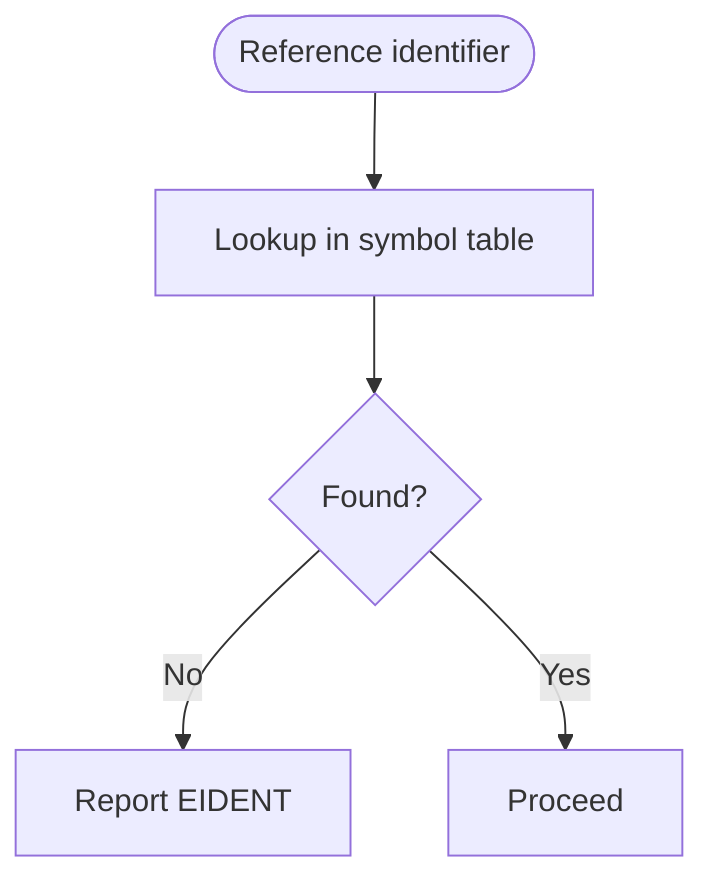

**Diagram sources**
- [T_ident.dml](file://test/1.2/errors/T_ident.dml)

Common mistakes:
- Typos or missing declarations.

Correction procedure:
- Declare the identifier before use.
- Check for typos or missing imports.

**Section sources**
- [T_ident.dml](file://test/1.2/errors/T_ident.dml)

### ELOCALSTRUCT Analysis
Local struct declarations are disallowed in certain contexts.

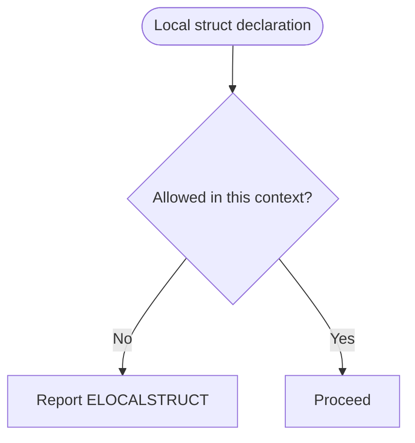

**Diagram sources**
- [T_local_struct.dml](file://test/1.2/errors/T_local_struct.dml)

Common mistakes:
- Declaring structs inside expressions or statements where not allowed.

Correction procedure:
- Move struct declarations to allowed scopes.
- Use forward declarations or typedefs as appropriate.

**Section sources**
- [T_local_struct.dml](file://test/1.2/errors/T_local_struct.dml)

### ELOCALS Analysis
Invalid local variable declarations trigger ELOCALS.

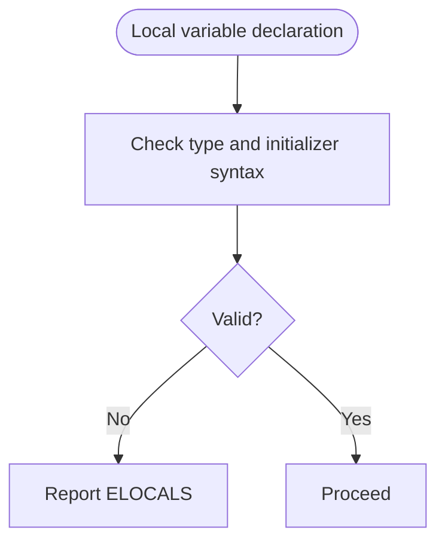

**Diagram sources**
- [T_locals.dml](file://test/1.2/errors/T_locals.dml)

Common mistakes:
- Missing initializers or incorrect syntax.

Correction procedure:
- Ensure proper type and initialization syntax.
- Remove or correct missing initializers.

**Section sources**
- [T_locals.dml](file://test/1.2/errors/T_locals.dml)

### ENEWFIELD Analysis
Invalid field declarations in new expressions trigger ENEWFIELD.

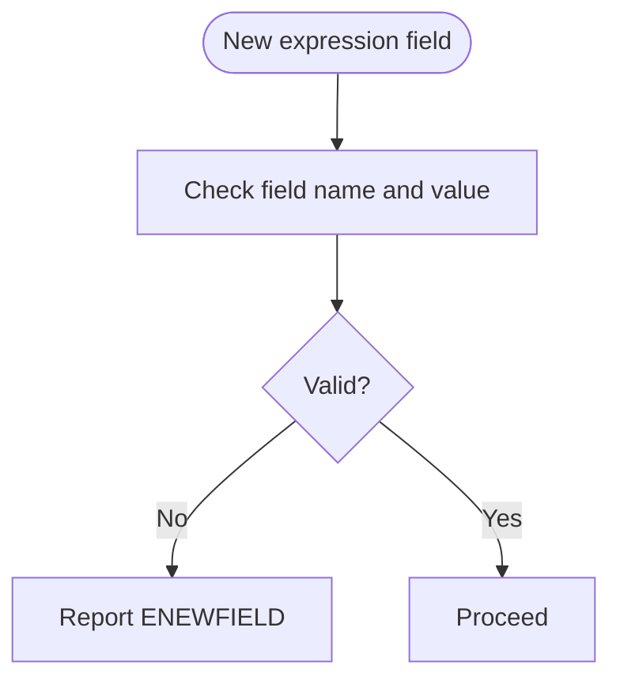

**Diagram sources**
- [T_newfield.dml](file://test/1.2/errors/T_newfield.dml)

Common mistakes:
- Mismatched field names or values.

Correction procedure:
- Ensure field names and values match the target type.
- Use correct syntax for field initializers.

**Section sources**
- [T_newfield.dml](file://test/1.2/errors/T_newfield.dml)

### EPRECEDENCE Analysis
Ambiguous operator precedence triggers EPRECEDENCE.

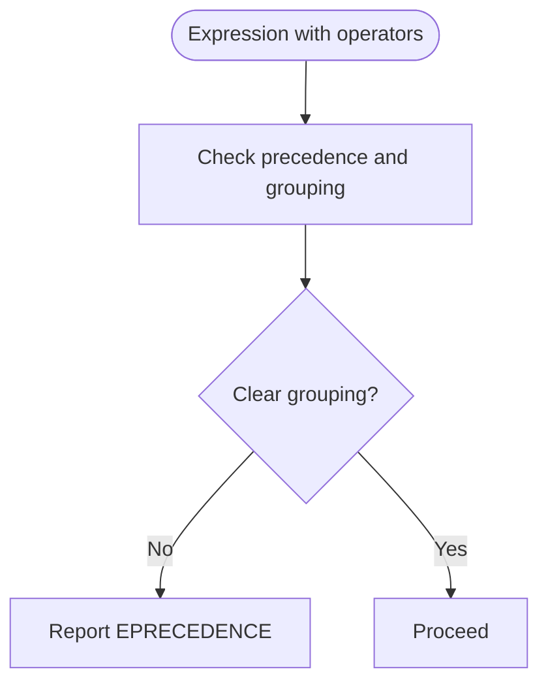

**Diagram sources**
- [T_precedence.dml](file://test/1.2/errors/T_precedence.dml)

Common mistakes:
- Mixed operators without parentheses.

Correction procedure:
- Add parentheses to clarify intended grouping.
- Reorder operations to avoid ambiguity.

**Section sources**
- [T_precedence.dml](file://test/1.2/errors/T_precedence.dml)

### ESELECT Analysis
Invalid select expressions trigger ESELECT.

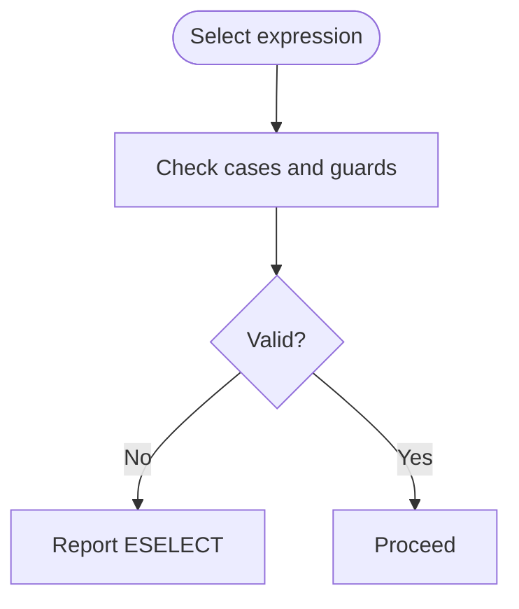

**Diagram sources**
- [T_select.dml](file://test/1.2/errors/T_select.dml)

Common mistakes:
- Improper case syntax or mismatched types.

Correction procedure:
- Ensure proper case syntax and guards.
- Match select expression types with cases.

**Section sources**
- [T_select.dml](file://test/1.2/errors/T_select.dml)

### ESTATIC Analysis
Invalid static usage triggers ESTATIC.

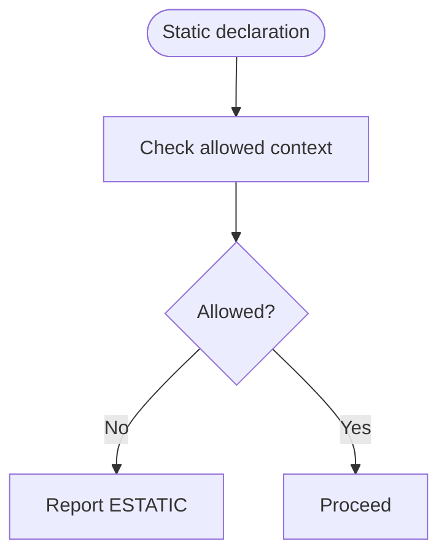

**Diagram sources**
- [T_static.dml](file://test/1.2/errors/T_static.dml)

Common mistakes:
- Using static in invalid contexts.

Correction procedure:
- Ensure static is used in allowed contexts.
- Remove or correct invalid static modifiers.

**Section sources**
- [T_static.dml](file://test/1.2/errors/T_static.dml)

### EUNICODE Analysis
Invalid Unicode or encoding in tokens triggers EUNICODE.

**Diagram sources**
- [T_unicode.dml](file://test/1.2/errors/T_unicode.dml)
- [T_ESYNTAX_08.dml](file://test/1.2/errors/T_ESYNTAX_08.dml#L9-L9)

Common mistakes:
- Non-ASCII characters in identifiers or tokens.

Correction procedure:
- Ensure valid Unicode and encoding in identifiers and strings.
- Fix non-ASCII or broken sequences.

**Section sources**
- [T_unicode.dml](file://test/1.2/errors/T_unicode.dml)
- [T_ESYNTAX_08.dml](file://test/1.2/errors/T_ESYNTAX_08.dml#L9-L9)

### EBITORDER Analysis
Invalid bit order or bit-slice syntax triggers EBITORDER.

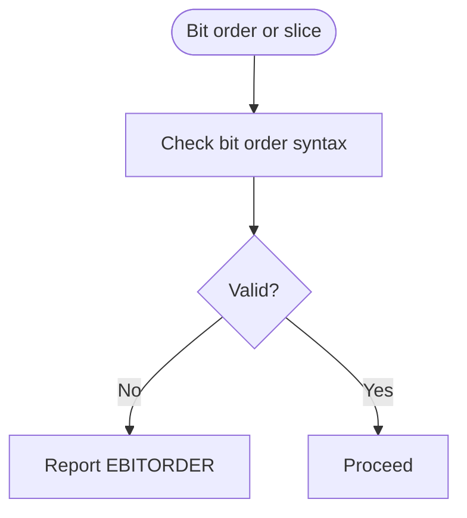

**Diagram sources**
- [T_bitorder_3.dml](file://test/1.2/errors/T_bitorder_3.dml)
- [T_bitorder_3.dml](file://test/1.4/errors/T_bitorder_3.dml)

Common mistakes:
- Invalid bit order or slice syntax.

Correction procedure:
- Ensure correct bit order syntax and width constraints.
- Use allowed bit-slice forms per DML version.

**Section sources**
- [T_bitorder_3.dml](file://test/1.2/errors/T_bitorder_3.dml)
- [T_bitorder_3.dml](file://test/1.4/errors/T_bitorder_3.dml)

## Dependency Analysis
The error reporting module depends on the lexical analyzer and parser to detect and report syntax issues. The following diagram shows the dependency relationships.

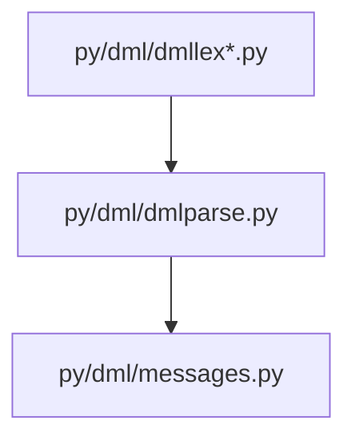

**Diagram sources**
- [dmllex.py](file://py/dml/dmllex.py)
- [dmllex12.py](file://py/dml/dmllex12.py)
- [dmllex14.py](file://py/dml/dmllex14.py)
- [dmlparse.py](file://py/dml/dmlparse.py)
- [messages.py](file://py/dml/messages.py#L775-L791)

**Section sources**
- [dmllex.py](file://py/dml/dmllex.py)
- [dmllex12.py](file://py/dml/dmllex12.py)
- [dmllex14.py](file://py/dml/dmllex14.py)
- [dmlparse.py](file://py/dml/dmlparse.py)
- [messages.py](file://py/dml/messages.py#L775-L791)

## Performance Considerations
- Lexical and parsing errors are detected early, minimizing downstream processing overhead.
- Error messages include token context to reduce developer debugging time.
- Prefer concise test cases to speed up test execution and iteration.

## Troubleshooting Guide
- Review the error message for token context and reason.
- Inspect the nearest punctuation, quotes, or keywords.
- Fix unmatched delimiters, missing semicolons, or invalid tokens.
- Validate version directive syntax and placement.
- Ensure correct syntax for literals, identifiers, and declarations.
- Use parentheses to clarify operator precedence.
- Confirm bit order and bit-slice syntax per DML version.

## Conclusion
This guide documented DML syntax errors, their reporting mechanism, and correction procedures. By consulting the examples and guidelines, developers can quickly identify and fix syntax issues across DML 1.2 and 1.4.

## Appendices
- Version-specific syntax differences:
  - DML 1.2 vs 1.4: Bit order and slice syntax may differ. Refer to the 1.2 and 1.4 test cases for EBITORDER to see version-specific constraints.
  - Static declarations and method call contexts vary between versions. Consult the respective test files for ESTATIC and related constructs.