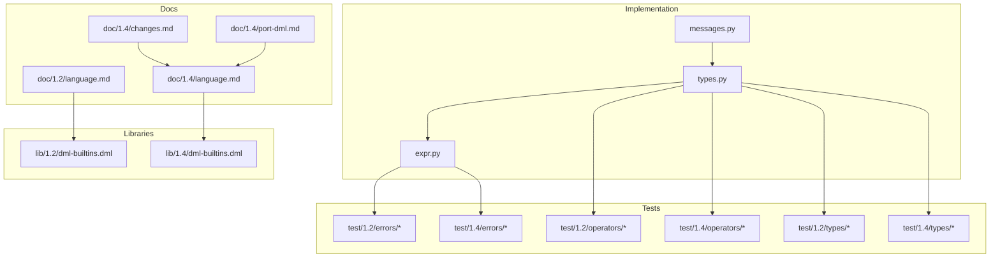
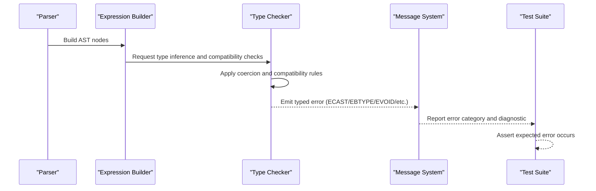
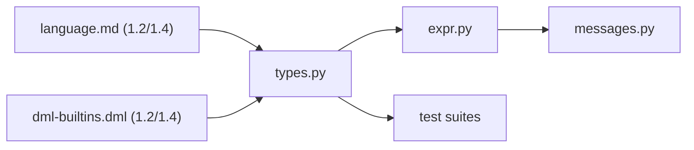

# Type Errors

<cite>
**Referenced Files in This Document**
- [messages.py](file://py/dml/messages.py)
- [types.py](file://py/dml/types.py)
- [expr.py](file://py/dml/expr.py)
- [operators/T_cast.dml](file://test/1.2/operators/T_cast.dml)
- [operators/T_cast.dml](file://test/1.4/operators/T_cast.dml)
- [operators/T_arith.dml](file://test/1.2/operators/T_arith.dml)
- [operators/T_arith.dml](file://test/1.4/operators/T_arith.dml)
- [operators/T_assign_type.dml](file://test/1.2/operators/T_assign_type.dml)
- [operators/T_assign_type.dml](file://test/1.4/operators/T_assign_type.dml)
- [operators/T_arrayref_node_nonint.dml](file://test/1.2/operators/T_arrayref_node_nonint.dml)
- [operators/T_arrayref_node_nonint.dml](file://test/1.4/operators/T_arrayref_node_nonint.dml)
- [operators/T_sizeof.dml](file://test/1.2/operators/T_sizeof.dml)
- [operators/T_sizeof.dml](file://test/1.4/operators/T_sizeof.dml)
- [operators/T_precedence.dml](file://test/1.2/operators/T_precedence.dml)
- [operators/T_precedence.dml](file://test/1.4/operators/T_precedence.dml)
- [types/T_pointers.dml](file://test/1.2/types/T_pointers.dml)
- [types/T_pointers.dml](file://test/1.4/types/T_pointers.dml)
- [types/T_endian_int.dml](file://test/1.2/types/T_endian_int.dml)
- [types/T_endian_int.dml](file://test/1.4/types/T_endian_int.dml)
- [types/T_bitfields.dml](file://test/1.2/types/T_bitfields.dml)
- [types/T_bitfields.dml](file://test/1.4/types/T_bitfields.dml)
- [types/T_typedef.dml](file://test/1.2/types/T_typedef.dml)
- [types/T_typedef.dml](file://test/1.4/types/T_typedef.dml)
- [errors/T_ECAST.dml](file://test/1.2/errors/T_ECAST.dml)
- [errors/T_ECAST.dml](file://test/1.4/errors/T_ECAST.dml)
- [errors/T_EBTYPE.dml](file://test/1.2/errors/T_EBTYPE.dml)
- [errors/T_EBTYPE.dml](file://test/1.4/errors/T_EBTYPE.dml)
- [errors/T_EVOID.dml](file://test/1.4/errors/T_EVOID.dml)
- [errors/T_EVOID_typedefed.dml](file://test/1.4/errors/T_EVOID_typedefed.dml)
- [errors/T_ECONST.dml](file://test/1.2/errors/T_ECONST.dml)
- [errors/T_ECONSTP.dml](file://test/1.2/errors/T_ECONSTP.dml)
- [errors/T_ECONSTFUN.dml](file://test/1.4/errors/T_ECONSTFUN.dml)
- [errors/T_ECONSTP_stringlit.dml](file://test/1.4/errors/T_ECONSTP_stringlit.dml)
- [errors/T_EPTYPE.dml](file://test/1.2/errors/T_EPTYPE.dml)
- [errors/T_EINTPTRTYPE.dml](file://test/1.2/errors/T_EINTPTRTYPE.dml)
- [errors/T_ETYPE.dml](file://test/1.2/errors/T_ETYPE.dml)
- [errors/T_ETYPE.dml](file://test/1.4/errors/T_ETYPE.dml)
- [language.md (1.2)](file://doc/1.2/language.md)
- [language.md (1.4)](file://doc/1.4/language.md)
- [changes.md (1.4)](file://doc/1.4/changes.md)
- [port-dml.md (1.4)](file://doc/1.4/port-dml.md)
- [dml-builtins.dml (1.2)](file://lib/1.2/dml-builtins.dml)
- [dml-builtins.dml (1.4)](file://lib/1.4/dml-builtins.dml)
</cite>

## Table of Contents
1. [Introduction](#introduction)
2. [Project Structure](#project-structure)
3. [Core Components](#core-components)
4. [Architecture Overview](#architecture-overview)
5. [Detailed Component Analysis](#detailed-component-analysis)
6. [Dependency Analysis](#dependency-analysis)
7. [Performance Considerations](#performance-considerations)
8. [Troubleshooting Guide](#troubleshooting-guide)
9. [Conclusion](#conclusion)
10. [Appendices](#appendices)

## Introduction
This document provides comprehensive documentation for DML type errors. It catalogs and explains the DML type-related error classes present in the test suite and implementation, including ECAST (illegal casts), EBTYPE (type mismatches), EVOID (void misuse), EETYPE (expression type errors), EPTYPE (pointer type issues), ECONST (constant type violations), EINTPTRTYPE (integer pointer type errors), and ETYPE (unknown types). It also documents the DML type system and type checking rules, presents examples via test files, and outlines type error resolution strategies and best practices. Finally, it covers type system evolution between DML 1.2 and 1.4 with migration guidance.

## Project Structure
The DML type error system spans:
- Implementation of type checking and messages in Python modules
- Test suites that define expected type errors and behaviors
- Language documentation for DML 1.2 and 1.4
- Built-in library definitions that establish base types and semantics

Key locations:
- Type system and type checking logic: py/dml/types.py, py/dml/expr.py
- Error message definitions and classification: py/dml/messages.py
- Examples and regression tests for type errors: test/1.2/errors and test/1.4/errors
- Operator and expression tests demonstrating type rules: test/1.2/operators and test/1.4/operators
- Type-specific tests: test/1.2/types and test/1.4/types
- Language documentation and change logs: doc/1.2/language.md, doc/1.4/language.md, doc/1.4/changes.md, doc/1.4/port-dml.md
- Built-in libraries: lib/1.2/dml-builtins.dml, lib/1.4/dml-builtins.dml

**Diagram sources**
- [messages.py](file://py/dml/messages.py)
- [types.py](file://py/dml/types.py)
- [expr.py](file://py/dml/expr.py)
- [errors/T_ECAST.dml](file://test/1.2/errors/T_ECAST.dml)
- [errors/T_ECAST.dml](file://test/1.4/errors/T_ECAST.dml)
- [operators/T_cast.dml](file://test/1.2/operators/T_cast.dml)
- [operators/T_cast.dml](file://test/1.4/operators/T_cast.dml)
- [types/T_pointers.dml](file://test/1.2/types/T_pointers.dml)
- [types/T_pointers.dml](file://test/1.4/types/T_pointers.dml)
- [language.md (1.2)](file://doc/1.2/language.md)
- [language.md (1.4)](file://doc/1.4/language.md)
- [changes.md (1.4)](file://doc/1.4/changes.md)
- [port-dml.md (1.4)](file://doc/1.4/port-dml.md)
- [dml-builtins.dml (1.2)](file://lib/1.2/dml-builtins.dml)
- [dml-builtins.dml (1.4)](file://lib/1.4/dml-builtins.dml)

**Section sources**
- [messages.py](file://py/dml/messages.py)
- [types.py](file://py/dml/types.py)
- [expr.py](file://py/dml/expr.py)
- [language.md (1.2)](file://doc/1.2/language.md)
- [language.md (1.4)](file://doc/1.4/language.md)
- [changes.md (1.4)](file://doc/1.4/changes.md)
- [port-dml.md (1.4)](file://doc/1.4/port-dml.md)
- [dml-builtins.dml (1.2)](file://lib/1.2/dml-builtins.dml)
- [dml-builtins.dml (1.4)](file://lib/1.4/dml-builtins.dml)

## Core Components
- Type system and type checking: Centralized in types.py and expr.py, which define type representations, compatibility rules, coercion semantics, and error signaling.
- Error message definitions: messages.py defines the canonical error identifiers and their categories, including the ones covered here.
- Test-driven examples: The test suites under test/1.2/errors, test/1.4/errors, and related operator/type tests demonstrate concrete type error scenarios and expected behaviors.
- Language documentation: The DML 1.2 and 1.4 language docs describe the type system and changes between versions.
- Built-in libraries: dml-builtins.dml establishes base types and built-in operations that influence type checking.

Key responsibilities:
- Detect illegal casts (ECAST), type mismatches (EBTYPE), void misuse (EVOID), expression type errors (EETYPE), pointer type issues (EPTYPE), constant violations (ECONST), integer pointer type errors (EINTPTRTYPE), and unknown types (ETYPE).
- Enforce type compatibility and coercion rules during expression evaluation and assignment.
- Provide precise diagnostics and guidance for resolving type errors.

**Section sources**
- [types.py](file://py/dml/types.py)
- [expr.py](file://py/dml/expr.py)
- [messages.py](file://py/dml/messages.py)

## Architecture Overview
The type error architecture integrates type checking with error reporting and test validation:

**Diagram sources**
- [types.py](file://py/dml/types.py)
- [expr.py](file://py/dml/expr.py)
- [messages.py](file://py/dml/messages.py)
- [errors/T_ECAST.dml](file://test/1.2/errors/T_ECAST.dml)
- [errors/T_ECAST.dml](file://test/1.4/errors/T_ECAST.dml)

## Detailed Component Analysis

### DML Type System and Type Checking Rules
The DML type system encompasses:
- Primitive types (integers, booleans, floating-point, strings, bytes)
- Derived types (pointers, arrays, bitfields, typedefs)
- Built-in operations and their type requirements
- Coercion rules for arithmetic, comparisons, and assignments
- Compatibility rules for expressions and method/application contexts

Type checking enforces:
- Operand type compatibility for operators
- Assignment target type compatibility
- Cast validity and allowed conversions
- Pointer and integer pointer type constraints
- Constant and expression type correctness
- Unknown or void misuse detection

These rules are implemented in the type checker and validated by tests and documentation.

**Section sources**
- [types.py](file://py/dml/types.py)
- [expr.py](file://py/dml/expr.py)
- [language.md (1.2)](file://doc/1.2/language.md)
- [language.md (1.4)](file://doc/1.4/language.md)
- [dml-builtins.dml (1.2)](file://lib/1.2/dml-builtins.dml)
- [dml-builtins.dml (1.4)](file://lib/1.4/dml-builtins.dml)

### ECAST: Illegal Casts
ECAST indicates invalid or disallowed cast operations. Examples include casting across incompatible pointer/integer boundaries or to unsupported types.

Common scenarios:
- Casting a pointer to an integer type without explicit conversion rules
- Casting between unrelated pointer types
- Using casts that violate signedness or width constraints

Resolution strategies:
- Replace illegal casts with supported conversions
- Use explicit helper constructs provided by built-ins
- Ensure intermediate representations match expected types before casting

Evidence and examples:
- ECAST tests in both DML 1.2 and 1.4 demonstrate invalid cast patterns and expected error messages.

**Section sources**
- [errors/T_ECAST.dml](file://test/1.2/errors/T_ECAST.dml)
- [errors/T_ECAST.dml](file://test/1.4/errors/T_ECAST.dml)
- [operators/T_cast.dml](file://test/1.2/operators/T_cast.dml)
- [operators/T_cast.dml](file://test/1.4/operators/T_cast.dml)

### EBTYPE: Type Mismatches
EBTYPE signals operand or expression type mismatches that violate operator or context requirements. This includes mismatched argument types for built-ins and operators.

Common scenarios:
- Passing wrong-typed arguments to arithmetic or bitwise operators
- Mismatched types in comparison or logical operations
- Incompatible types in array indexing or member access

Resolution strategies:
- Align operand types using compatible coercions
- Reorder or parenthesize expressions to enforce expected precedence and types
- Use explicit type wrappers or helpers to bridge mismatches

Evidence and examples:
- EBTYPE tests in DML 1.2 and 1.4 illustrate mismatched operand patterns.

**Section sources**
- [errors/T_EBTYPE.dml](file://test/1.2/errors/T_EBTYPE.dml)
- [errors/T_EBTYPE.dml](file://test/1.4/errors/T_EBTYPE.dml)
- [operators/T_arith.dml](file://test/1.2/operators/T_arith.dml)
- [operators/T_arith.dml](file://test/1.4/operators/T_arith.dml)
- [operators/T_precedence.dml](file://test/1.2/operators/T_precedence.dml)
- [operators/T_precedence.dml](file://test/1.4/operators/T_precedence.dml)

### EVOID: Void Type Misuse
EVOID indicates misuse of void types, such as using void as an expression value or assigning void where a typed value is expected.

Common scenarios:
- Using void expressions in arithmetic or assignments
- Returning or passing void where a typed value is required
- Declaring variables with void type

Resolution strategies:
- Ensure expressions evaluate to meaningful types
- Remove or replace void usage with appropriate typed expressions
- Verify return types and parameter types do not involve void where prohibited

Evidence and examples:
- EVOID tests in DML 1.4 demonstrate void misuse patterns.

**Section sources**
- [errors/T_EVOID.dml](file://test/1.4/errors/T_EVOID.dml)
- [errors/T_EVOID_typedefed.dml](file://test/1.4/errors/T_EVOID_typedefed.dml)

### EETYPE: Expression Type Errors
EETYPE denotes general expression type errors that do not fit other categories, often involving ambiguous or inconsistent type derivations.

Common scenarios:
- Ambiguous overload resolution leading to unresolved expression types
- Complex nested expressions with conflicting type expectations
- Unsupported combinations in expression construction

Resolution strategies:
- Simplify expressions and isolate sub-expressions
- Add explicit type annotations or parentheses to guide type inference
- Break down complex expressions into smaller typed steps

Evidence and examples:
- EETYPE tests in DML 1.2 and 1.4 show expression-level type inconsistencies.

**Section sources**
- [errors/T_ETYPE.dml](file://test/1.2/errors/T_ETYPE.dml)
- [errors/T_ETYPE.dml](file://test/1.4/errors/T_ETYPE.dml)

### EPTYPE: Pointer Type Issues
EPTYPE captures pointer-related type problems, such as invalid pointer arithmetic, incorrect pointer-to-pointer conversions, or misuse of pointer types in contexts requiring scalars.

Common scenarios:
- Pointer arithmetic on non-integer types
- Incorrect pointer-to-pointer conversions
- Using pointers where scalars are expected

Resolution strategies:
- Ensure pointer operations are performed on compatible pointer types
- Use explicit conversions or helper functions for pointer manipulations
- Validate pointer usage against expected scalar or pointer contexts

Evidence and examples:
- EPTYPE tests in DML 1.2 demonstrate pointer type issues.

**Section sources**
- [errors/T_EPTYPE.dml](file://test/1.2/errors/T_EPTYPE.dml)
- [types/T_pointers.dml](file://test/1.2/types/T_pointers.dml)
- [types/T_pointers.dml](file://test/1.4/types/T_pointers.dml)

### ECONST: Constant Type Violations
ECONST indicates violations of constant type constraints, such as attempting to modify constants or using constants in non-constant contexts.

Common scenarios:
- Assigning to constant expressions
- Using constants where mutable values are required
- Misusing constant evaluation in non-constant contexts

Resolution strategies:
- Review constant declarations and usage sites
- Separate compile-time constants from runtime values when necessary
- Use appropriate constructs for mutable state

Evidence and examples:
- ECONST tests in DML 1.2 and ECONST-related tests in DML 1.4 demonstrate constant type violations.

**Section sources**
- [errors/T_ECONST.dml](file://test/1.2/errors/T_ECONST.dml)
- [errors/T_ECONSTP.dml](file://test/1.2/errors/T_ECONSTP.dml)
- [errors/T_ECONSTFUN.dml](file://test/1.4/errors/T_ECONSTFUN.dml)
- [errors/T_ECONSTP_stringlit.dml](file://test/1.4/errors/T_ECONSTP_stringlit.dml)

### EINTPTRTYPE: Integer Pointer Type Errors
EINTPTRTYPE targets errors specific to integer pointer type mismatches, such as treating integers and pointers interchangeably without proper conversions.

Common scenarios:
- Comparing or operating on integers and pointers without explicit conversion
- Passing integers where pointers are expected and vice versa

Resolution strategies:
- Use explicit conversions between integers and pointers
- Prefer typed pointer operations and avoid mixing integer and pointer arithmetic
- Validate type assumptions in low-level constructs

Evidence and examples:
- EINTPTRTYPE tests in DML 1.2 illustrate integer pointer type errors.

**Section sources**
- [errors/T_EINTPTRTYPE.dml](file://test/1.2/errors/T_EINTPTRTYPE.dml)

### ETYPE: Unknown Types
ETYPE indicates unknown or unresolved types, often due to missing declarations, typos, or unresolved forward references.

Common scenarios:
- Using undeclared identifiers as types
- Typo in type names or missing imports
- Unresolved generic or template types

Resolution strategies:
- Verify type names and imports
- Ensure forward references are properly resolved
- Use explicit type declarations where necessary

Evidence and examples:
- ETYPE tests in DML 1.2 and 1.4 demonstrate unknown type scenarios.

**Section sources**
- [errors/T_ETYPE.dml](file://test/1.2/errors/T_ETYPE.dml)
- [errors/T_ETYPE.dml](file://test/1.4/errors/T_ETYPE.dml)

### Type Coercion Rules and Compatibility Requirements
Coercion and compatibility are enforced during expression evaluation and assignments:
- Arithmetic coercion follows numeric promotion rules
- Comparison and equality coerce operands to a common type when safe
- Assignment requires exact or safe widening/coercion
- Array indexing requires integral indices
- sizeof and related operators have strict type requirements

Examples from tests:
- Arithmetic and assignment compatibility tests in DML 1.2 and 1.4
- sizeof and precedence tests demonstrating type-sensitive behavior
- Pointer and endian integer tests showcasing derived type constraints

**Section sources**
- [operators/T_arith.dml](file://test/1.2/operators/T_arith.dml)
- [operators/T_arith.dml](file://test/1.4/operators/T_arith.dml)
- [operators/T_assign_type.dml](file://test/1.2/operators/T_assign_type.dml)
- [operators/T_assign_type.dml](file://test/1.4/operators/T_assign_type.dml)
- [operators/T_sizeof.dml](file://test/1.2/operators/T_sizeof.dml)
- [operators/T_sizeof.dml](file://test/1.4/operators/T_sizeof.dml)
- [operators/T_precedence.dml](file://test/1.2/operators/T_precedence.dml)
- [operators/T_precedence.dml](file://test/1.4/operators/T_precedence.dml)
- [types/T_pointers.dml](file://test/1.2/types/T_pointers.dml)
- [types/T_pointers.dml](file://test/1.4/types/T_pointers.dml)
- [types/T_endian_int.dml](file://test/1.2/types/T_endian_int.dml)
- [types/T_endian_int.dml](file://test/1.4/types/T_endian_int.dml)
- [types/T_bitfields.dml](file://test/1.2/types/T_bitfields.dml)
- [types/T_bitfields.dml](file://test/1.4/types/T_bitfields.dml)
- [types/T_typedef.dml](file://test/1.2/types/T_typedef.dml)
- [types/T_typedef.dml](file://test/1.4/types/T_typedef.dml)

### Common Type Error Scenarios and Examples
- Illegal casts: See ECAST tests for invalid pointer/integer casts.
- Type mismatches: See EBTYPE tests for operator and assignment mismatches.
- Void misuse: See EVOID tests for void expressions and assignments.
- Expression type errors: See EETYPE tests for ambiguous or inconsistent expressions.
- Pointer type issues: See EPTYPE tests and pointer type tests.
- Constant violations: See ECONST and related constant tests.
- Integer pointer errors: See EINTPTRTYPE tests.
- Unknown types: See ETYPE tests.

**Section sources**
- [errors/T_ECAST.dml](file://test/1.2/errors/T_ECAST.dml)
- [errors/T_ECAST.dml](file://test/1.4/errors/T_ECAST.dml)
- [errors/T_EBTYPE.dml](file://test/1.2/errors/T_EBTYPE.dml)
- [errors/T_EBTYPE.dml](file://test/1.4/errors/T_EBTYPE.dml)
- [errors/T_EVOID.dml](file://test/1.4/errors/T_EVOID.dml)
- [errors/T_EVOID_typedefed.dml](file://test/1.4/errors/T_EVOID_typedefed.dml)
- [errors/T_ECONST.dml](file://test/1.2/errors/T_ECONST.dml)
- [errors/T_ECONSTP.dml](file://test/1.2/errors/T_ECONSTP.dml)
- [errors/T_ECONSTFUN.dml](file://test/1.4/errors/T_ECONSTFUN.dml)
- [errors/T_ECONSTP_stringlit.dml](file://test/1.4/errors/T_ECONSTP_stringlit.dml)
- [errors/T_EPTYPE.dml](file://test/1.2/errors/T_EPTYPE.dml)
- [errors/T_EINTPTRTYPE.dml](file://test/1.2/errors/T_EINTPTRTYPE.dml)
- [errors/T_ETYPE.dml](file://test/1.2/errors/T_ETYPE.dml)
- [errors/T_ETYPE.dml](file://test/1.4/errors/T_ETYPE.dml)

### Type Error Resolution Strategies and Best Practices
- Prefer explicit typing and annotations to reduce ambiguity.
- Use parentheses to clarify operator precedence and type derivation.
- Avoid unsafe casts; prefer supported conversions or helper functions.
- Keep expressions pure and predictable to minimize type errors.
- Validate constants and immutables separately from mutable state.
- When working with pointers, ensure consistent pointer and integer types.
- Import and declare types carefully to prevent ETYPE.

**Section sources**
- [types.py](file://py/dml/types.py)
- [expr.py](file://py/dml/expr.py)
- [operators/T_precedence.dml](file://test/1.2/operators/T_precedence.dml)
- [operators/T_precedence.dml](file://test/1.4/operators/T_precedence.dml)

## Dependency Analysis
The type error system depends on:
- Type checker (types.py) for type inference and compatibility
- Expression builder (expr.py) for constructing typed expressions
- Message system (messages.py) for categorizing and emitting errors
- Tests for validating error behaviors across DML versions
- Language docs and built-in libraries for authoritative type semantics

**Diagram sources**
- [types.py](file://py/dml/types.py)
- [expr.py](file://py/dml/expr.py)
- [messages.py](file://py/dml/messages.py)
- [language.md (1.2)](file://doc/1.2/language.md)
- [language.md (1.4)](file://doc/1.4/language.md)
- [dml-builtins.dml (1.2)](file://lib/1.2/dml-builtins.dml)
- [dml-builtins.dml (1.4)](file://lib/1.4/dml-builtins.dml)

**Section sources**
- [types.py](file://py/dml/types.py)
- [expr.py](file://py/dml/expr.py)
- [messages.py](file://py/dml/messages.py)
- [language.md (1.2)](file://doc/1.2/language.md)
- [language.md (1.4)](file://doc/1.4/language.md)
- [dml-builtins.dml (1.2)](file://lib/1.2/dml-builtins.dml)
- [dml-builtins.dml (1.4)](file://lib/1.4/dml-builtins.dml)

## Performance Considerations
- Minimize deep nesting in expressions to reduce type inference complexity.
- Prefer explicit type annotations to avoid expensive disambiguation.
- Avoid excessive casts, which can trigger additional compatibility checks.
- Use built-in helpers for common conversions to reduce repeated checks.

[No sources needed since this section provides general guidance]

## Troubleshooting Guide
- Identify the error category from the test or message system.
- Inspect the nearest operator or assignment context for type mismatches.
- Verify casts and conversions adhere to supported rules.
- Check for void misuse and ensure expressions yield typed values.
- Confirm type declarations and imports are correct to resolve ETYPE.
- Review pointer and integer pointer usage for EPTYPE and EINTPTRTYPE.

**Section sources**
- [messages.py](file://py/dml/messages.py)
- [errors/T_ECAST.dml](file://test/1.2/errors/T_ECAST.dml)
- [errors/T_ECAST.dml](file://test/1.4/errors/T_ECAST.dml)
- [errors/T_EBTYPE.dml](file://test/1.2/errors/T_EBTYPE.dml)
- [errors/T_EBTYPE.dml](file://test/1.4/errors/T_EBTYPE.dml)
- [errors/T_EVOID.dml](file://test/1.4/errors/T_EVOID.dml)
- [errors/T_EVOID_typedefed.dml](file://test/1.4/errors/T_EVOID_typedefed.dml)
- [errors/T_EPTYPE.dml](file://test/1.2/errors/T_EPTYPE.dml)
- [errors/T_EINTPTRTYPE.dml](file://test/1.2/errors/T_EINTPTRTYPE.dml)
- [errors/T_ETYPE.dml](file://test/1.2/errors/T_ETYPE.dml)
- [errors/T_ETYPE.dml](file://test/1.4/errors/T_ETYPE.dml)

## Conclusion
DML’s type error system provides robust diagnostics for illegal casts, type mismatches, void misuse, expression type errors, pointer issues, constant violations, integer pointer errors, and unknown types. By combining precise type checking with comprehensive test coverage and authoritative documentation, developers can write type-safe DML code and resolve errors efficiently. The evolution from DML 1.2 to 1.4 introduces refinements and new capabilities that improve type safety and developer experience.

[No sources needed since this section summarizes without analyzing specific files]

## Appendices

### Migration Guidance: DML 1.2 to 1.4 Type System Evolution
- Enhanced operator and expression type rules improve precision and reduce ambiguous cases.
- New built-in helpers and stricter pointer/integer rules reduce EPTYPE and EINTPTRTYPE occurrences.
- Improved diagnostics and clearer error messages aid resolution of EBTYPE and EETYPE.
- Review and update casts to align with 1.4’s stricter conversion rules.
- Validate constant usage against 1.4’s enhanced constant type checks.
- Ensure typedef and derived type usage conforms to updated semantics.

**Section sources**
- [changes.md (1.4)](file://doc/1.4/changes.md)
- [language.md (1.4)](file://doc/1.4/language.md)
- [port-dml.md (1.4)](file://doc/1.4/port-dml.md)
- [dml-builtins.dml (1.4)](file://lib/1.4/dml-builtins.dml)