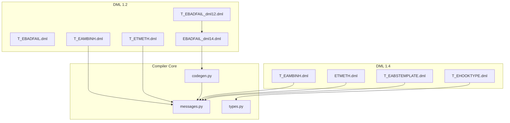
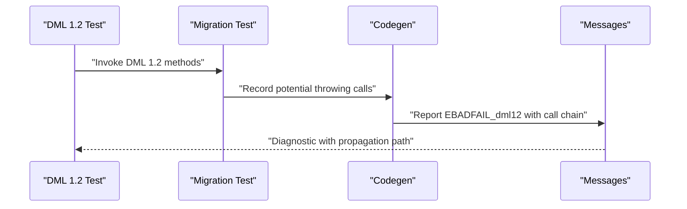
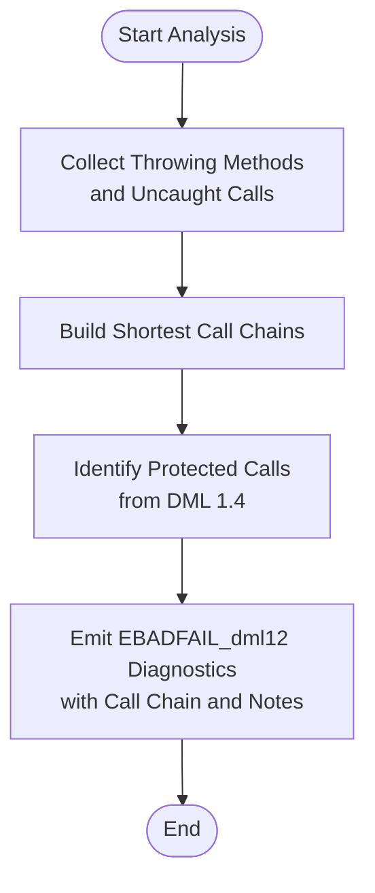
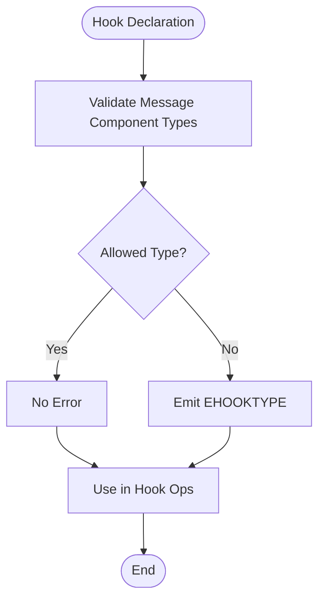
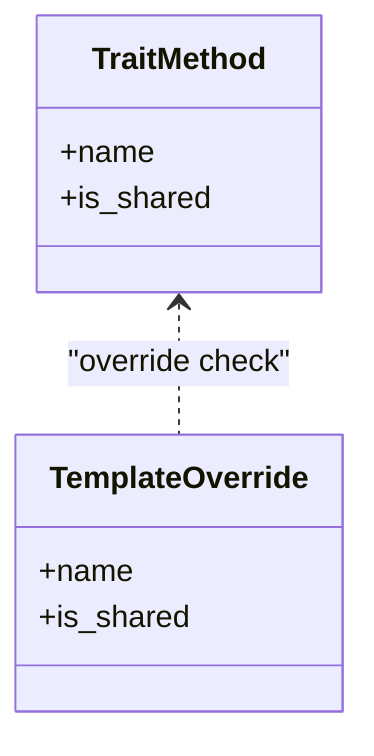
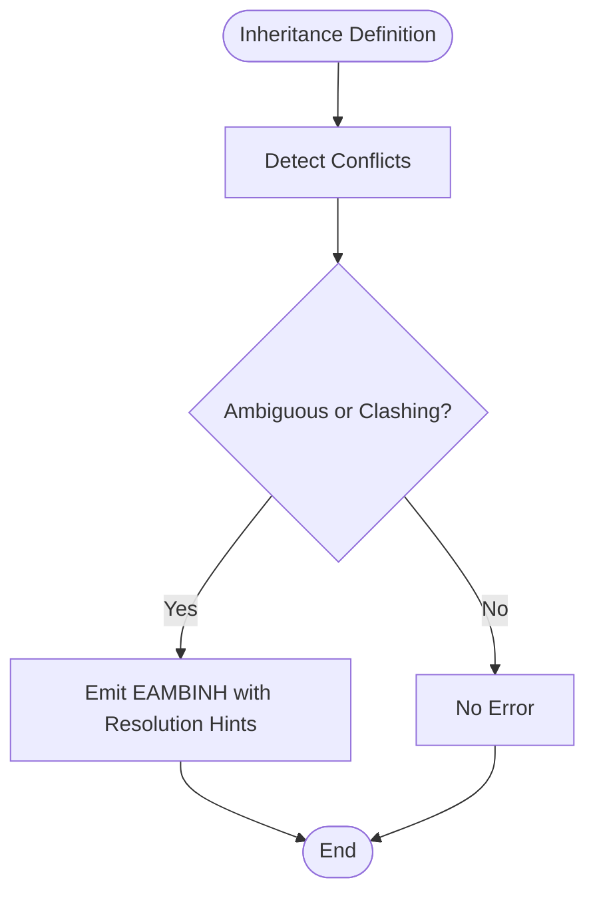
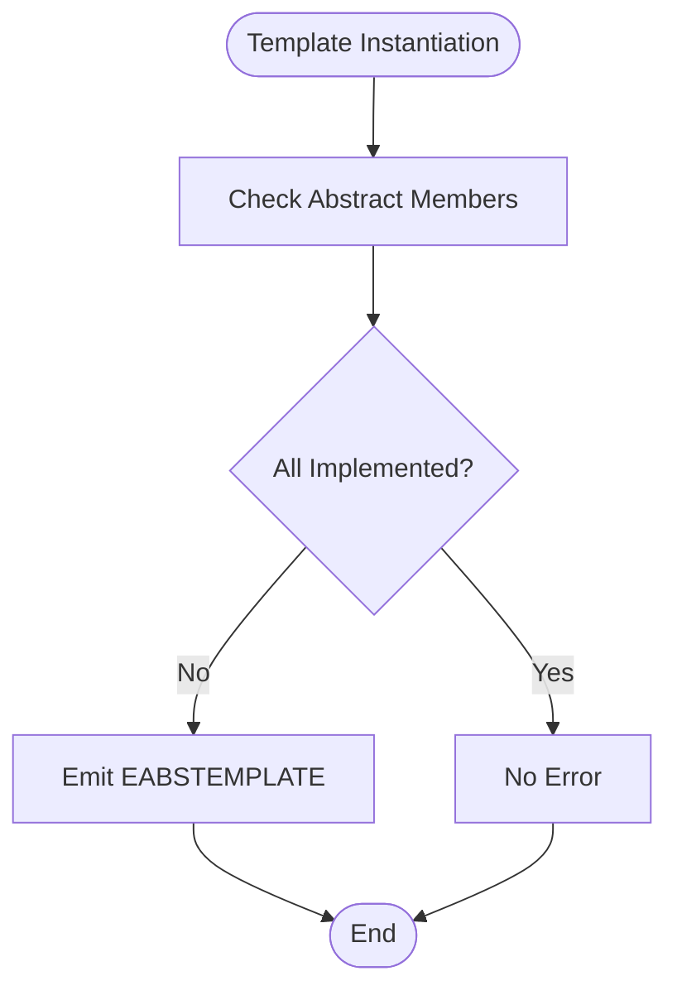
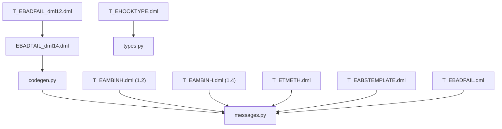

# Version-Specific Errors

<cite>
**Referenced Files in This Document**
- [messages.py](file://py/dml/messages.py)
- [EBADFAIL_dml14.dml](file://test/1.2/errors/EBADFAIL_dml14.dml)
- [T_EBADFAIL_dml12.dml](file://test/1.2/errors/T_EBADFAIL_dml12.dml)
- [T_EBADFAIL.dml](file://test/1.2/errors/T_EBADFAIL.dml)
- [T_EAMBINH.dml (1.2)](file://test/1.2/errors/T_EAMBINH.dml)
- [T_EAMBINH.dml (1.4)](file://test/1.4/errors/T_EAMBINH.dml)
- [T_ETMETH.dml](file://test/1.2/errors/T_ETMETH.dml)
- [T_EABSTEMPLATE.dml](file://test/1.4/errors/T_EABSTEMPLATE.dml)
- [T_EHOOKTYPE.dml](file://test/1.4/errors/T_EHOOKTYPE.dml)
- [codegen.py](file://py/dml/codegen.py)
- [types.py](file://py/dml/types.py)
</cite>

## Table of Contents
1. [Introduction](#introduction)
2. [Project Structure](#project-structure)
3. [Core Components](#core-components)
4. [Architecture Overview](#architecture-overview)
5. [Detailed Component Analysis](#detailed-component-analysis)
6. [Dependency Analysis](#dependency-analysis)
7. [Performance Considerations](#performance-considerations)
8. [Troubleshooting Guide](#troubleshooting-guide)
9. [Conclusion](#conclusion)
10. [Appendices](#appendices)

## Introduction
This document explains version-specific DML error handling differences between DML 1.2 and 1.4, focusing on migration-related error patterns. It documents the evolution of error reporting, highlights version-specific error classes, and provides practical guidance for resolving errors encountered when migrating from DML 1.2 to 1.4. The covered error classes include:
- EBADFAIL_dml12: DML 1.2 exception propagation during migration
- EHOOKTYPE: DML 1.4 hook type restrictions
- ETMETH: DML 1.4 shared method overrides
- EAMBINH: DML 1.4 ambiguous inheritance
- EABSTEMPLATE: DML 1.4 abstract template instantiation

## Project Structure
The repository organizes DML language tests and error demonstrations under version-specific directories. The relevant artifacts for this document are:
- Error demonstrations for DML 1.2 and 1.4 under test/1.2/errors and test/1.4/errors
- Core error class definitions and version metadata in py/dml/messages.py
- Migration-time analysis logic in py/dml/codegen.py
- Hook type validation in py/dml/types.py

**Diagram sources**
- [messages.py](file://py/dml/messages.py#L106-L114)
- [messages.py](file://py/dml/messages.py#L141-L183)
- [messages.py](file://py/dml/messages.py#L214-L227)
- [messages.py](file://py/dml/messages.py#L235-L249)
- [EBADFAIL_dml14.dml](file://test/1.2/errors/EBADFAIL_dml14.dml#L1-L47)
- [T_EBADFAIL_dml12.dml](file://test/1.2/errors/T_EBADFAIL_dml12.dml#L1-L96)
- [T_EBADFAIL.dml](file://test/1.2/errors/T_EBADFAIL.dml#L1-L42)
- [T_EAMBINH.dml (1.2)](file://test/1.2/errors/T_EAMBINH.dml#L1-L120)
- [T_EAMBINH.dml (1.4)](file://test/1.4/errors/T_EAMBINH.dml#L1-L88)
- [T_ETMETH.dml](file://test/1.2/errors/T_ETMETH.dml#L1-L28)
- [T_EABSTEMPLATE.dml](file://test/1.4/errors/T_EABSTEMPLATE.dml#L1-L18)
- [T_EHOOKTYPE.dml](file://test/1.4/errors/T_EHOOKTYPE.dml#L1-L44)
- [codegen.py](file://py/dml/codegen.py#L3418-L3430)
- [types.py](file://py/dml/types.py#L1424-L1463)

**Section sources**
- [messages.py](file://py/dml/messages.py#L106-L114)
- [messages.py](file://py/dml/messages.py#L141-L183)
- [messages.py](file://py/dml/messages.py#L214-L227)
- [messages.py](file://py/dml/messages.py#L235-L249)
- [EBADFAIL_dml14.dml](file://test/1.2/errors/EBADFAIL_dml14.dml#L1-L47)
- [T_EBADFAIL_dml12.dml](file://test/1.2/errors/T_EBADFAIL_dml12.dml#L1-L96)
- [T_EBADFAIL.dml](file://test/1.2/errors/T_EBADFAIL.dml#L1-L42)
- [T_EAMBINH.dml (1.2)](file://test/1.2/errors/T_EAMBINH.dml#L1-L120)
- [T_EAMBINH.dml (1.4)](file://test/1.4/errors/T_EAMBINH.dml#L1-L88)
- [T_ETMETH.dml](file://test/1.2/errors/T_ETMETH.dml#L1-L28)
- [T_EABSTEMPLATE.dml](file://test/1.4/errors/T_EABSTEMPLATE.dml#L1-L18)
- [T_EHOOKTYPE.dml](file://test/1.4/errors/T_EHOOKTYPE.dml#L1-L44)
- [codegen.py](file://py/dml/codegen.py#L3418-L3430)
- [types.py](file://py/dml/types.py#L1424-L1463)

## Core Components
This section summarizes the version-specific error classes and their roles during migration and validation.

- EBADFAIL_dml12 (DML 1.2 exception propagation during migration)
  - Purpose: Reports uncaught exceptions when DML 1.2 methods are invoked from DML 1.4 contexts. It tracks throwing methods, call chains, and protected calls to pinpoint propagation paths.
  - Key behaviors:
    - Tracks explicit throwing methods and recursive call chains.
    - Emits diagnostics for protected calls from DML 1.4 into potentially throwing DML 1.2 methods.
    - Provides call-chain explanations and “also called here” notes for additional callers.
  - Version context: Used during migration scenarios to surface problematic call chains.

- EHOOKTYPE (DML 1.4 hook type restrictions)
  - Purpose: Validates hook message component types to ensure they are serializable and well-formed.
  - Key behaviors:
    - Disallows anonymous structs and arrays of variable/unknown size as message components.
    - Applies to hook declarations, saved hooks, and local hook variables.
    - Types are validated only when used in hook-related operations; otherwise, no error is emitted.

- ETMETH (DML 1.4 shared method overrides)
  - Purpose: Ensures shared methods do not override non-shared methods.
  - Key behaviors:
    - Enforced in DML 1.4; reports conflicts when a shared method attempts to override a non-shared method.

- EAMBINH (DML 1.4 ambiguous inheritance)
  - Purpose: Detects ambiguous or conflicting definitions across template/trait inheritance.
  - Key behaviors:
    - Reports conflicting method or parameter definitions when multiple candidates exist without a clear override relationship.
    - Provides guidance on how to resolve by adding imports or instantiations.

- EABSTEMPLATE (DML 1.4 abstract template instantiation)
  - Purpose: Requires all abstract members to be implemented when instantiating templates.
  - Key behaviors:
    - Reports missing implementations for abstract methods or parameters during instantiation.

**Section sources**
- [messages.py](file://py/dml/messages.py#L106-L114)
- [messages.py](file://py/dml/messages.py#L141-L183)
- [messages.py](file://py/dml/messages.py#L214-L227)
- [messages.py](file://py/dml/messages.py#L235-L249)
- [T_EHOOKTYPE.dml](file://test/1.4/errors/T_EHOOKTYPE.dml#L1-L44)
- [T_EAMBINH.dml (1.4)](file://test/1.4/errors/T_EAMBINH.dml#L1-L88)
- [T_EABSTEMPLATE.dml](file://test/1.4/errors/T_EABSTEMPLATE.dml#L1-L18)
- [T_ETMETH.dml](file://test/1.2/errors/T_ETMETH.dml#L1-L28)

## Architecture Overview
The migration and validation pipeline integrates test-driven error demonstrations with compiler-side error classes and analysis logic.

**Diagram sources**
- [EBADFAIL_dml14.dml](file://test/1.2/errors/EBADFAIL_dml14.dml#L1-L47)
- [T_EBADFAIL_dml12.dml](file://test/1.2/errors/T_EBADFAIL_dml12.dml#L1-L96)
- [codegen.py](file://py/dml/codegen.py#L3418-L3430)
- [messages.py](file://py/dml/messages.py#L624-L698)

## Detailed Component Analysis

### EBADFAIL_dml12: DML 1.2 Exception Propagation During Migration
- Definition and scope
  - Tracks throwing methods and uncaught method calls across DML 1.2/DML 1.4 boundaries.
  - Emits diagnostics when DML 1.4 code calls methods that may throw in DML 1.2.
- Call chain analysis
  - Builds shortest call chains from throwing methods to protected call sites.
  - Emits “also called here” notes for additional callers sharing the same bad method.
- Practical implications
  - Encourages wrapping risky call chains in try/catch blocks near the source of throw.
  - Highlights conversions of certain 1.2 operations into throwing equivalents during migration.

**Diagram sources**
- [messages.py](file://py/dml/messages.py#L624-L698)
- [codegen.py](file://py/dml/codegen.py#L3418-L3430)

**Section sources**
- [messages.py](file://py/dml/messages.py#L624-L698)
- [EBADFAIL_dml14.dml](file://test/1.2/errors/EBADFAIL_dml14.dml#L1-L47)
- [T_EBADFAIL_dml12.dml](file://test/1.2/errors/T_EBADFAIL_dml12.dml#L1-L96)
- [T_EBADFAIL.dml](file://test/1.2/errors/T_EBADFAIL.dml#L1-L42)
- [codegen.py](file://py/dml/codegen.py#L3418-L3430)

### EHOOKTYPE: DML 1.4 Hook Type Restrictions
- Definition and scope
  - Validates hook message component types to ensure they are serializable and well-formed.
  - Disallows anonymous structs and arrays of variable/unknown size as message components.
- Validation timing
  - Types are validated only when used in hook-related operations; otherwise, no error is emitted.
- Practical implications
  - Replace anonymous structs and variable-sized arrays with named, fixed-size types.
  - Ensure all message components are serializable when binding callbacks or sending messages.

**Diagram sources**
- [messages.py](file://py/dml/messages.py#L106-L114)
- [types.py](file://py/dml/types.py#L1424-L1463)
- [T_EHOOKTYPE.dml](file://test/1.4/errors/T_EHOOKTYPE.dml#L1-L44)

**Section sources**
- [messages.py](file://py/dml/messages.py#L106-L114)
- [types.py](file://py/dml/types.py#L1424-L1463)
- [T_EHOOKTYPE.dml](file://test/1.4/errors/T_EHOOKTYPE.dml#L1-L44)

### ETMETH: DML 1.4 Shared Method Overrides
- Definition and scope
  - Prevents shared methods from overriding non-shared methods in DML 1.4.
- Practical implications
  - Align method modifiers consistently across trait/template hierarchies.
  - Ensure shared methods override other shared methods to avoid ETMETH.

**Diagram sources**
- [messages.py](file://py/dml/messages.py#L214-L227)
- [T_ETMETH.dml](file://test/1.2/errors/T_ETMETH.dml#L1-L28)

**Section sources**
- [messages.py](file://py/dml/messages.py#L214-L227)
- [T_ETMETH.dml](file://test/1.2/errors/T_ETMETH.dml#L1-L28)

### EAMBINH: DML 1.4 Ambiguous Inheritance
- Definition and scope
  - Detects ambiguous or conflicting definitions across template/trait inheritance.
- Practical implications
  - Resolve by adding explicit imports or instantiations to clarify the intended override.
  - Avoid direct clashes between unrelated traits or parameters.

**Diagram sources**
- [messages.py](file://py/dml/messages.py#L141-L183)
- [T_EAMBINH.dml (1.2)](file://test/1.2/errors/T_EAMBINH.dml#L1-L120)
- [T_EAMBINH.dml (1.4)](file://test/1.4/errors/T_EAMBINH.dml#L1-L88)

**Section sources**
- [messages.py](file://py/dml/messages.py#L141-L183)
- [T_EAMBINH.dml (1.2)](file://test/1.2/errors/T_EAMBINH.dml#L1-L120)
- [T_EAMBINH.dml (1.4)](file://test/1.4/errors/T_EAMBINH.dml#L1-L88)

### EABSTEMPLATE: DML 1.4 Abstract Template Instantiation
- Definition and scope
  - Requires all abstract methods or parameters to be implemented when instantiating templates.
- Practical implications
  - Implement all abstract members before instantiating templates.
  - Add concrete method bodies or parameter assignments to satisfy abstract declarations.

**Diagram sources**
- [messages.py](file://py/dml/messages.py#L235-L249)
- [T_EABSTEMPLATE.dml](file://test/1.4/errors/T_EABSTEMPLATE.dml#L1-L18)

**Section sources**
- [messages.py](file://py/dml/messages.py#L235-L249)
- [T_EABSTEMPLATE.dml](file://test/1.4/errors/T_EABSTEMPLATE.dml#L1-L18)

## Dependency Analysis
The following diagram shows how test files and the compiler core interact to surface version-specific errors.

**Diagram sources**
- [messages.py](file://py/dml/messages.py#L106-L114)
- [messages.py](file://py/dml/messages.py#L141-L183)
- [messages.py](file://py/dml/messages.py#L214-L227)
- [messages.py](file://py/dml/messages.py#L235-L249)
- [EBADFAIL_dml14.dml](file://test/1.2/errors/EBADFAIL_dml14.dml#L1-L47)
- [T_EBADFAIL_dml12.dml](file://test/1.2/errors/T_EBADFAIL_dml12.dml#L1-L96)
- [T_EBADFAIL.dml](file://test/1.2/errors/T_EBADFAIL.dml#L1-L42)
- [T_EAMBINH.dml (1.2)](file://test/1.2/errors/T_EAMBINH.dml#L1-L120)
- [T_EAMBINH.dml (1.4)](file://test/1.4/errors/T_EAMBINH.dml#L1-L88)
- [T_ETMETH.dml](file://test/1.2/errors/T_ETMETH.dml#L1-L28)
- [T_EABSTEMPLATE.dml](file://test/1.4/errors/T_EABSTEMPLATE.dml#L1-L18)
- [T_EHOOKTYPE.dml](file://test/1.4/errors/T_EHOOKTYPE.dml#L1-L44)
- [codegen.py](file://py/dml/codegen.py#L3418-L3430)
- [types.py](file://py/dml/types.py#L1424-L1463)

**Section sources**
- [messages.py](file://py/dml/messages.py#L106-L114)
- [messages.py](file://py/dml/messages.py#L141-L183)
- [messages.py](file://py/dml/messages.py#L214-L227)
- [messages.py](file://py/dml/messages.py#L235-L249)
- [EBADFAIL_dml14.dml](file://test/1.2/errors/EBADFAIL_dml14.dml#L1-L47)
- [T_EBADFAIL_dml12.dml](file://test/1.2/errors/T_EBADFAIL_dml12.dml#L1-L96)
- [T_EBADFAIL.dml](file://test/1.2/errors/T_EBADFAIL.dml#L1-L42)
- [T_EAMBINH.dml (1.2)](file://test/1.2/errors/T_EAMBINH.dml#L1-L120)
- [T_EAMBINH.dml (1.4)](file://test/1.4/errors/T_EAMBINH.dml#L1-L88)
- [T_ETMETH.dml](file://test/1.2/errors/T_ETMETH.dml#L1-L28)
- [T_EABSTEMPLATE.dml](file://test/1.4/errors/T_EABSTEMPLATE.dml#L1-L18)
- [T_EHOOKTYPE.dml](file://test/1.4/errors/T_EHOOKTYPE.dml#L1-L44)
- [codegen.py](file://py/dml/codegen.py#L3418-L3430)
- [types.py](file://py/dml/types.py#L1424-L1463)

## Performance Considerations
- EBADFAIL_dml12 analysis builds shortest call chains using a breadth-first traversal over method call edges. Keep call chains concise and localized to minimize diagnostic overhead.
- Hook type validation occurs only when hook-related operations are performed, avoiding unnecessary checks for unused references.

[No sources needed since this section provides general guidance]

## Troubleshooting Guide
- EBADFAIL_dml12
  - Symptom: Uncaught exception errors when calling DML 1.2 methods from DML 1.4 contexts.
  - Resolution:
    - Wrap risky call chains in try/catch blocks near the source of throw.
    - Refactor methods to explicitly declare throws or annotate appropriately.
    - Review call chains and “also called here” notes to identify redundant or shared bad call sites.
  - References:
    - [messages.py](file://py/dml/messages.py#L624-L698)
    - [EBADFAIL_dml14.dml](file://test/1.2/errors/EBADFAIL_dml14.dml#L1-L47)
    - [T_EBADFAIL_dml12.dml](file://test/1.2/errors/T_EBADFAIL_dml12.dml#L1-L96)

- EHOOKTYPE
  - Symptom: Hook message component type errors involving anonymous structs or variable-sized arrays.
  - Resolution:
    - Replace anonymous structs with named types.
    - Use fixed-size arrays instead of variable-length ones.
    - Ensure all message components are serializable.
  - References:
    - [messages.py](file://py/dml/messages.py#L106-L114)
    - [types.py](file://py/dml/types.py#L1424-L1463)
    - [T_EHOOKTYPE.dml](file://test/1.4/errors/T_EHOOKTYPE.dml#L1-L44)

- ETMETH
  - Symptom: Attempt to override non-shared method with a shared method.
  - Resolution:
    - Align method modifiers across the hierarchy.
    - Ensure shared methods override other shared methods.
  - References:
    - [messages.py](file://py/dml/messages.py#L214-L227)
    - [T_ETMETH.dml](file://test/1.2/errors/T_ETMETH.dml#L1-L28)

- EAMBINH
  - Symptom: Conflicting definitions across template/trait inheritance.
  - Resolution:
    - Add explicit imports or instantiations to clarify overrides.
    - Avoid direct clashes between unrelated traits or parameters.
  - References:
    - [messages.py](file://py/dml/messages.py#L141-L183)
    - [T_EAMBINH.dml (1.2)](file://test/1.2/errors/T_EAMBINH.dml#L1-L120)
    - [T_EAMBINH.dml (1.4)](file://test/1.4/errors/T_EAMBINH.dml#L1-L88)

- EABSTEMPLATE
  - Symptom: Instantiating template with unimplemented abstract members.
  - Resolution:
    - Implement all abstract methods or parameters before instantiation.
  - References:
    - [messages.py](file://py/dml/messages.py#L235-L249)
    - [T_EABSTEMPLATE.dml](file://test/1.4/errors/T_EABSTEMPLATE.dml#L1-L18)

## Conclusion
DML 1.4 introduces stricter validation and clearer error reporting compared to 1.2, particularly around exception handling, hook types, method overrides, inheritance ambiguity, and abstract template instantiation. The EBADFAIL_dml12 error class plays a central role during migration by surfacing propagation paths from DML 1.2 to 1.4 contexts. By understanding these version-specific errors and applying the targeted resolutions outlined above, teams can successfully migrate DML 1.2 codebases to 1.4 with predictable outcomes.

[No sources needed since this section summarizes without analyzing specific files]

## Appendices

### Migration-Specific Error Patterns and Implications
- EBADFAIL_dml12
  - Evolution: DML 1.2 did not enforce strict exception handling; DML 1.4 enforces it during migration.
  - Implication: Methods that implicitly throw in 1.2 must be explicitly handled or annotated in 1.4.
  - Resolution pattern: Add try/catch near the throw site; refactor call chains to avoid propagation.

- EHOOKTYPE
  - Evolution: DML 1.4 adds explicit restrictions on hook message component types.
  - Implication: Anonymous structs and variable-sized arrays are disallowed.
  - Resolution pattern: Use named, fixed-size types; ensure serializability.

- ETMETH
  - Evolution: DML 1.4 enforces modifier consistency for method overrides.
  - Implication: Shared methods must override shared methods.
  - Resolution pattern: Align modifiers across the hierarchy.

- EAMBINH
  - Evolution: DML 1.4 strengthens inheritance conflict detection.
  - Implication: Ambiguous or clashing definitions require explicit resolution.
  - Resolution pattern: Clarify overrides via imports or instantiations.

- EABSTEMPLATE
  - Evolution: DML 1.4 enforces completeness of template implementations.
  - Implication: Abstract members must be implemented upon instantiation.
  - Resolution pattern: Provide concrete implementations for all abstract members.

**Section sources**
- [messages.py](file://py/dml/messages.py#L106-L114)
- [messages.py](file://py/dml/messages.py#L141-L183)
- [messages.py](file://py/dml/messages.py#L214-L227)
- [messages.py](file://py/dml/messages.py#L235-L249)
- [EBADFAIL_dml14.dml](file://test/1.2/errors/EBADFAIL_dml14.dml#L1-L47)
- [T_EBADFAIL_dml12.dml](file://test/1.2/errors/T_EBADFAIL_dml12.dml#L1-L96)
- [T_EBADFAIL.dml](file://test/1.2/errors/T_EBADFAIL.dml#L1-L42)
- [T_EAMBINH.dml (1.2)](file://test/1.2/errors/T_EAMBINH.dml#L1-L120)
- [T_EAMBINH.dml (1.4)](file://test/1.4/errors/T_EAMBINH.dml#L1-L88)
- [T_ETMETH.dml](file://test/1.2/errors/T_ETMETH.dml#L1-L28)
- [T_EABSTEMPLATE.dml](file://test/1.4/errors/T_EABSTEMPLATE.dml#L1-L18)
- [T_EHOOKTYPE.dml](file://test/1.4/errors/T_EHOOKTYPE.dml#L1-L44)
- [codegen.py](file://py/dml/codegen.py#L3418-L3430)
- [types.py](file://py/dml/types.py#L1424-L1463)