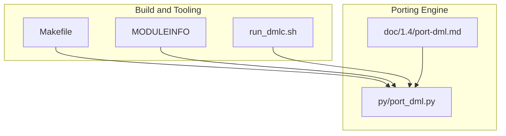
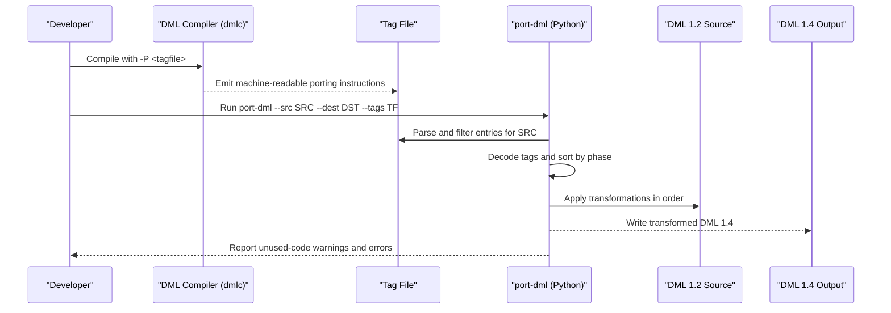
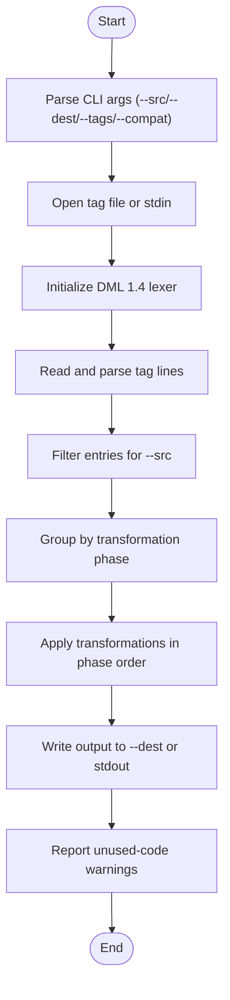
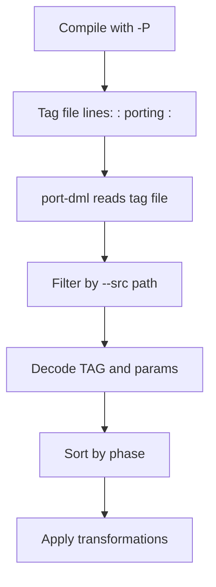
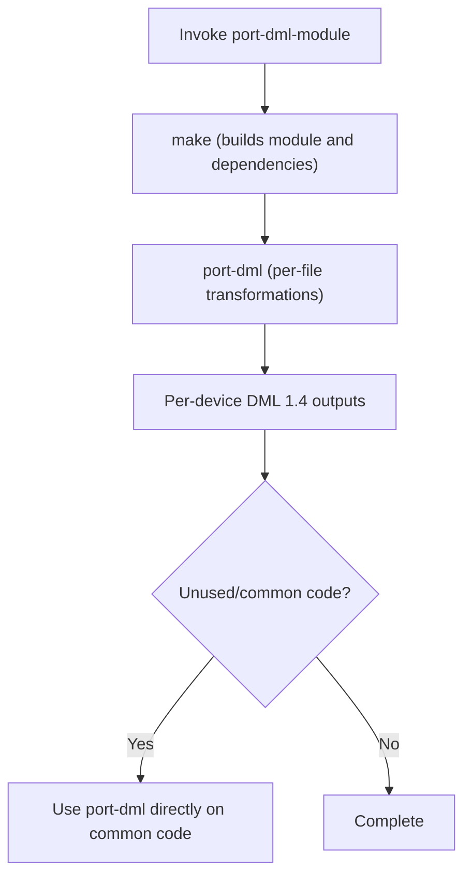
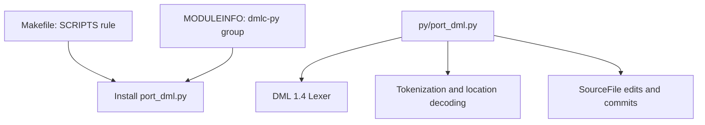

# Automatic Migration Tools

<cite>
**Referenced Files in This Document**
- [port-dml.md](file://doc/1.4/port-dml.md)
- [port_dml.py](file://py/port_dml.py)
- [Makefile](file://Makefile)
- [MODULEINFO](file://MODULEINFO)
- [run_dmlc.sh](file://run_dmlc.sh)
</cite>

## Table of Contents
1. [Introduction](#introduction)
2. [Project Structure](#project-structure)
3. [Core Components](#core-components)
4. [Architecture Overview](#architecture-overview)
5. [Detailed Component Analysis](#detailed-component-analysis)
6. [Dependency Analysis](#dependency-analysis)
7. [Performance Considerations](#performance-considerations)
8. [Troubleshooting Guide](#troubleshooting-guide)
9. [Conclusion](#conclusion)

## Introduction
This document explains the automatic migration tools for porting Device Modeling Language (DML) from version 1.2 to 1.4. It focuses on:
- The port-dml script: standalone usage, command-line arguments, tag file generation, and automated transformations.
- The port-dml-module wrapper concept: batch processing entire Simics modules and how it orchestrates make and port-dml.
- Tag file format and machine-readable change descriptions.
- How the porting script interprets and applies transformations.
- Known limitations, failure scenarios, and manual intervention requirements.
- Troubleshooting guidance for common porting and script execution issues.

## Project Structure
The migration toolchain consists of:
- A Python-based porting engine that reads machine-readable porting tags and applies edits to DML source files.
- Documentation that describes how to generate the tag file via the DML compiler and how to run the porting script.
- Build-time integration via Makefile targets and MODULEINFO entries that install the porting script into the runtime environment.
- A helper script to invoke the DML compiler with appropriate include paths and diagnostics.

**Diagram sources**
- [Makefile](file://Makefile#L82-L114)
- [MODULEINFO](file://MODULEINFO#L71-L72)
- [run_dmlc.sh](file://run_dmlc.sh#L56-L66)
- [port-dml.md](file://doc/1.4/port-dml.md#L1-L77)
- [port_dml.py](file://py/port_dml.py#L1098-L1201)

**Section sources**
- [Makefile](file://Makefile#L82-L114)
- [MODULEINFO](file://MODULEINFO#L71-L72)
- [run_dmlc.sh](file://run_dmlc.sh#L56-L66)
- [port-dml.md](file://doc/1.4/port-dml.md#L1-L77)

## Core Components
- port-dml script (Python): Reads a tag file (or stdin), decodes each line into a transformation, sorts by phase, and applies edits to the source file to produce a DML 1.4 output file.
- Tag file: A machine-readable log produced by the DML compiler (-P flag) describing required changes for porting.
- port-dml-module wrapper concept: A documented workflow to batch-port an entire Simics module by invoking make and port-dml, with guidance on limitations for shared/common code.

Key capabilities:
- Parses and validates tag entries for the target source file.
- Applies transformations in deterministic phases to preserve correctness.
- Emits warnings for unused code and partial porting situations.
- Supports compatibility mode for smoother imports from DML 1.2.

**Section sources**
- [port_dml.py](file://py/port_dml.py#L1036-L1089)
- [port_dml.py](file://py/port_dml.py#L1098-L1201)
- [port-dml.md](file://doc/1.4/port-dml.md#L28-L77)

## Architecture Overview
The porting pipeline integrates the DML compiler, tag file generation, and the porting script.

**Diagram sources**
- [port-dml.md](file://doc/1.4/port-dml.md#L29-L57)
- [port_dml.py](file://py/port_dml.py#L1115-L1197)

## Detailed Component Analysis

### port-dml Script: Command-Line Arguments and Execution
- Purpose: Convert a DML 1.2 source file to DML 1.4 by applying transformations described in a tag file.
- Inputs:
  - --src: Required path to the DML 1.2 source file.
  - --dest: Optional path to the DML 1.4 output file (defaults to stdout).
  - --tags: Optional path to the tag file (defaults to stdin).
  - --compat: Optional flag to emit extra compatibility code for imports from DML 1.2.
- Behavior:
  - Loads the DML 1.4 lexer for tokenization.
  - Reads and parses the tag file, filtering entries for the target source file.
  - Sorts transformations by phase to ensure correct ordering.
  - Applies transformations to the source file and writes the result.
  - Reports unused-code warnings and errors encountered during application.

**Diagram sources**
- [port_dml.py](file://py/port_dml.py#L1098-L1197)

**Section sources**
- [port_dml.py](file://py/port_dml.py#L1098-L1110)
- [port_dml.py](file://py/port_dml.py#L1115-L1197)

### Tag File Generation and Format
- Generation: The DML compiler produces a tag file when invoked with the -P flag. The file contains one machine-readable line per required change.
- Format: Each line begins with a location in the form "/path/file.dml:line:column", followed by "porting <TAG>: <params>". Lines not prefixed with "porting " are ignored.
- Filtering: The porting script only considers entries whose location matches the --src file, deduplicates identical entries, and groups by phase for application.

**Diagram sources**
- [port-dml.md](file://doc/1.4/port-dml.md#L29-L50)
- [port_dml.py](file://py/port_dml.py#L1130-L1153)

**Section sources**
- [port-dml.md](file://doc/1.4/port-dml.md#L29-L50)
- [port_dml.py](file://py/port_dml.py#L1130-L1153)

### Automated Transformation Mechanism
- Transformation registry: A mapping from tag names to transformation classes enables dynamic instantiation of edits.
- Phases: Transformations are grouped by phase to ensure non-commutative edits are applied in the correct order.
- Offsets and edits: The engine tracks file offsets and applies moves and edits to the source buffer, translating subsequent offsets accordingly.
- Examples of transformations include replacing keywords, adjusting method signatures, handling output parameters, event attributes, and compatibility trampolines.

```mermaid
classDiagram
class Transformation {
+phase : int
+loc : str
+params : list
+apply(f : SourceFile)
+offset(f, loc) : int
}
class Replace {
+apply(f : SourceFile)
}
class PSHA1 {
+apply(f : SourceFile)
}
class PNOTHROW {
+apply(f : SourceFile)
}
class PINPARAMLIST {
+apply(f : SourceFile)
}
class PSTRUCTDECL {
+apply(f : SourceFile)
}
class PTYPEDOUTPARAM {
+apply(f : SourceFile)
}
class PINARGTYPE {
+apply(f : SourceFile)
}
class PINVOKE {
+apply(f : SourceFile)
}
class PAFTER {
+apply(f : SourceFile)
}
class PRETVAL {
+apply(f : SourceFile)
}
class PRETVAL_END {
+apply(f : SourceFile)
}
class PRETURNARGS {
+apply(f : SourceFile)
}
class POUTARGRETURN {
+apply(f : SourceFile)
}
class PSOFT_RESET_VALUE {
+apply(f : SourceFile)
}
class PMISS_PATTERN {
+apply(f : SourceFile)
}
class PATTRIBUTE {
+apply(f : SourceFile)
}
class PEVENT_NO_ARG {
+apply(f : SourceFile)
}
class PEVENT_UINT64_ARG {
+apply(f : SourceFile)
}
class RemoveMethod {
+apply(f : SourceFile)
}
class POVERRIDE {
+apply(f : SourceFile)
}
class POVERRIDE_IMPORT {
+apply(f : SourceFile)
}
class PBEFAFT {
+apply(f : SourceFile)
}
class PABSTRACT_TEMPLATE {
+apply(f : SourceFile)
}
class PTRAMPOLINE {
+apply(f : SourceFile)
}
class PIMPORT_DML12COMPAT {
+apply(f : SourceFile)
}
class PCHANGE_INARGS {
+apply(f : SourceFile)
}
class PBITNEQ {
+apply(f : SourceFile)
}
class PVAL {
+apply(f : SourceFile)
}
class PNODOLLAR {
+apply(f : SourceFile)
}
class PDOLLAR_QUALIFY {
+apply(f : SourceFile)
}
class PCONSTANT {
+apply(f : SourceFile)
}
class PPARAMETER {
+apply(f : SourceFile)
}
class PARRAY_I {
+apply(f : SourceFile)
}
class PARRAY {
+apply(f : SourceFile)
}
class PHASH {
+apply(f : SourceFile)
}
class PHASHELSE {
+apply(f : SourceFile)
}
class PANDOR {
+apply(f : SourceFile)
}
class PIFAND {
+apply(f : SourceFile)
}
class PSTRINGIFY {
+apply(f : SourceFile)
}
class PWUNUSED {
+report(f, dest)
+apply(f : SourceFile)
}
class PNO_WUNUSED {
+apply(f : SourceFile)
}
class PRENAME_TEMPLATE {
+apply(f : SourceFile)
}
class PUNDEFOFFS {
+apply(f : SourceFile)
}
class PINT1 {
+apply(f : SourceFile)
}
Transformation <|-- Replace
Transformation <|-- PSHA1
Transformation <|-- PNOTHROW
Transformation <|-- PINPARAMLIST
Transformation <|-- PSTRUCTDECL
Transformation <|-- PTYPEDOUTPARAM
Transformation <|-- PINARGTYPE
Transformation <|-- PINVOKE
Transformation <|-- PAFTER
Transformation <|-- PRETVAL
Transformation <|-- PRETVAL_END
Transformation <|-- PRETURNARGS
Transformation <|-- POUTARGRETURN
Transformation <|-- PSOFT_RESET_VALUE
Transformation <|-- PMISS_PATTERN
Transformation <|-- PATTRIBUTE
Transformation <|-- PEVENT_NO_ARG
Transformation <|-- PEVENT_UINT64_ARG
Transformation <|-- RemoveMethod
Transformation <|-- POVERRIDE
Transformation <|-- POVERRIDE_IMPORT
Transformation <|-- PBEFAFT
Transformation <|-- PABSTRACT_TEMPLATE
Transformation <|-- PTRAMPOLINE
Transformation <|-- PIMPORT_DML12COMPAT
Transformation <|-- PCHANGE_INARGS
Transformation <|-- PBITNEQ
Transformation <|-- PVAL
Transformation <|-- PNODOLLAR
Transformation <|-- PDOLLAR_QUALIFY
Transformation <|-- PCONSTANT
Transformation <|-- PPARAMETER
Transformation <|-- PARRAY_I
Transformation <|-- PARRAY
Transformation <|-- PHASH
Transformation <|-- PHASHELSE
Transformation <|-- PANDOR
Transformation <|-- PIFAND
Transformation <|-- PSTRINGIFY
Transformation <|-- PWUNUSED
Transformation <|-- PNO_WUNUSED
Transformation <|-- PRENAME_TEMPLATE
Transformation <|-- PUNDEFOFFS
Transformation <|-- PINT1
```

**Diagram sources**
- [port_dml.py](file://py/port_dml.py#L308-L1089)

**Section sources**
- [port_dml.py](file://py/port_dml.py#L1036-L1089)
- [port_dml.py](file://py/port_dml.py#L308-L341)

### port-dml-module Wrapper Script (Batch Processing)
- Concept: The documentation describes a wrapper script called port-dml-module that ports all devices in one Simics module and all imported files it depends on. It works by invoking make and port-dml, printing the commands for clarity.
- Limitations: For shared/common code that is unused (e.g., templates never instantiated), the wrapper may skip some conversions. In such cases, it is recommended to use port-dml directly on the common code to ensure full porting.

**Diagram sources**
- [port-dml.md](file://doc/1.4/port-dml.md#L12-L24)

**Section sources**
- [port-dml.md](file://doc/1.4/port-dml.md#L12-L24)

### Compatibility Mode (--compat)
- Purpose: When enabled, emits extra code to improve compatibility when importing DML 1.4 code from DML 1.2. This is useful during transitional periods.
- Restrictions: If the source file contains a device statement, the script ignores --compat and warns the user.

**Section sources**
- [port_dml.py](file://py/port_dml.py#L1165-L1168)
- [port_dml.py](file://py/port_dml.py#L820-L841)

## Dependency Analysis
- Build-time installation:
  - Scripts are installed/copied into the Python package path via Makefile rules.
  - MODULEINFO declares the porting script as part of the dmlc-py group, ensuring it is present in the runtime environment.
- Runtime dependencies:
  - The porting script initializes the DML 1.4 lexer and uses the DML compiler’s Python interface to tokenize and locate tokens accurately.
  - It reads the tag file and applies edits to the source file, reporting unused-code warnings and errors.

**Diagram sources**
- [Makefile](file://Makefile#L82-L114)
- [MODULEINFO](file://MODULEINFO#L71-L72)
- [port_dml.py](file://py/port_dml.py#L22-L42)
- [port_dml.py](file://py/port_dml.py#L1169-L1191)

**Section sources**
- [Makefile](file://Makefile#L82-L114)
- [MODULEINFO](file://MODULEINFO#L71-L72)
- [port_dml.py](file://py/port_dml.py#L22-L42)
- [port_dml.py](file://py/port_dml.py#L1169-L1191)

## Performance Considerations
- The porting script applies edits in phases and translates offsets incrementally, minimizing repeated scans of the file.
- Tokenization is performed per file and per line to resolve locations precisely, which is efficient for typical DML file sizes.
- Recommendations:
  - Keep tag files concise by regenerating them fresh when re-running analysis.
  - Prefer targeted runs on affected files rather than broad rescans when possible.

[No sources needed since this section provides general guidance]

## Troubleshooting Guide
Common issues and resolutions:
- No tags found for the target file:
  - Ensure the tag file was generated for the correct source path and that the -P flag was used during compilation.
  - Verify the tag file contains entries for the specific file being processed.
- SHA1 mismatch:
  - The script validates the SHA1 of the source file against the tag file. If the file was modified between tag generation and porting, the script will fail. Re-run the analysis to regenerate the tag file.
- Unused or partially used code:
  - If parts of the code are never instantiated (e.g., unused templates), only syntactic transformations may be applied. The script reports unused-code warnings and suggests manual porting or analyzing an additional device that uses the code.
- Script failures:
  - If the porting script fails due to a bug or unexpected condition, it prints a traceback and points to the failing tag line. Remove the problematic line from the tag file and rerun the script. After success, consult the list of porting tags to apply the change manually.
- Environment and paths:
  - Ensure DMLC_DIR and SIMICS_BASE are set appropriately when invoking the DML compiler via helper scripts.
  - When using Simics projects, use the DMLC_PORTING_TAG_FILE variable to direct the compiler to write the tag file, and run make clean-module to force re-analysis if needed.

**Section sources**
- [port_dml.py](file://py/port_dml.py#L342-L354)
- [port_dml.py](file://py/port_dml.py#L1160-L1163)
- [port_dml.py](file://py/port_dml.py#L1014-L1034)
- [port-dml.md](file://doc/1.4/port-dml.md#L59-L73)
- [run_dmlc.sh](file://run_dmlc.sh#L36-L44)
- [run_dmlc.sh](file://run_dmlc.sh#L56-L66)

## Conclusion
The automatic migration tools provide a robust pipeline for porting DML 1.2 to 1.4:
- Use the DML compiler with -P to generate a tag file describing required changes.
- Run the port-dml script to interpret and apply transformations to produce DML 1.4 output.
- For modules, the documented port-dml-module workflow automates batch processing, with caveats for unused/common code.
- The porting engine supports compatibility mode and reports unused-code warnings to guide manual fixes when necessary.

[No sources needed since this section summarizes without analyzing specific files]