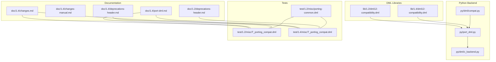
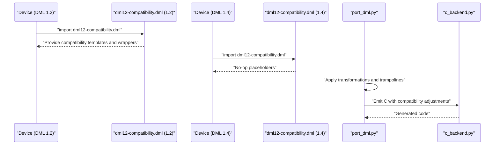
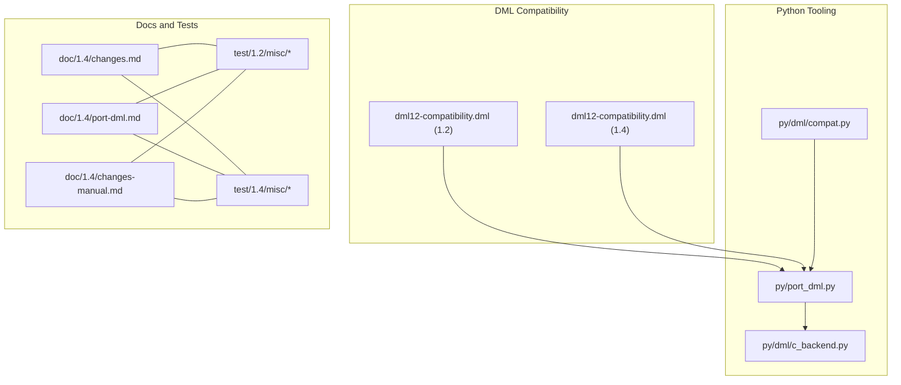
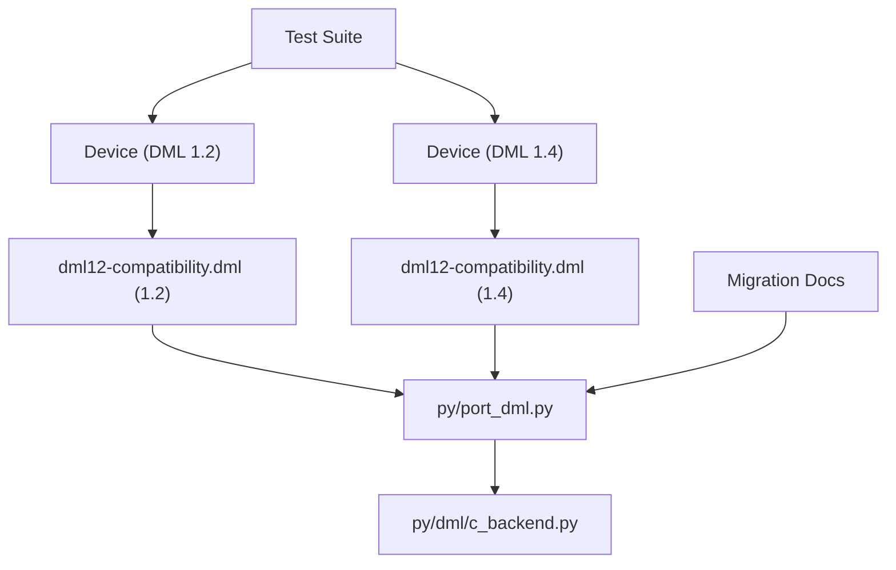

# Compatibility Layers and Transitional Features

<cite>
**Referenced Files in This Document**
- [dml12-compatibility.dml (DML 1.2)](file://lib/1.2/dml12-compatibility.dml)
- [dml12-compatibility.dml (DML 1.4)](file://lib/1.4/dml12-compatibility.dml)
- [compat.py](file://py/dml/compat.py)
- [port-dml.md](file://doc/1.4/port-dml.md)
- [changes.md](file://doc/1.4/changes.md)
- [changes-manual.md](file://doc/1.4/changes-manual.md)
- [deprecations-header.md (DML 1.4)](file://doc/1.4/deprecations-header.md)
- [deprecations-header.md (DML 1.2)](file://doc/1.2/deprecations-header.md)
- [T_porting_compat.dml (DML 1.2)](file://test/1.2/misc/T_porting_compat.dml)
- [T_porting_compat.dml (DML 1.4)](file://test/1.4/misc/T_porting_compat.dml)
- [porting-common.dml (DML 1.2)](file://test/1.2/misc/porting-common.dml)
- [port_dml.py](file://py/port_dml.py)
- [c_backend.py](file://py/dml/c_backend.py)
</cite>

## Table of Contents
1. [Introduction](#introduction)
2. [Project Structure](#project-structure)
3. [Core Components](#core-components)
4. [Architecture Overview](#architecture-overview)
5. [Detailed Component Analysis](#detailed-component-analysis)
6. [Dependency Analysis](#dependency-analysis)
7. [Performance Considerations](#performance-considerations)
8. [Troubleshooting Guide](#troubleshooting-guide)
9. [Conclusion](#conclusion)
10. [Appendices](#appendices)

## Introduction
This document explains the compatibility layers and transitional features that enable coexistence of DML 1.2 and 1.4 code. It focuses on:
- The dml12-compatibility.dml library and its role in bridging version differences
- Compatibility macros, conditional compilation directives, and version-specific code paths
- Deprecated feature wrappers, compatibility shims, and transitional APIs
- Guidance on gradual migration strategies using compatibility layers
- Examples of mixed-version codebases and best practices for maintaining compatibility during transition periods

## Project Structure
The repository organizes compatibility assets across:
- Version-specific compatibility libraries (one for DML 1.2, one for DML 1.4)
- Python-side compatibility features and migration helpers
- Migration documentation and test suites demonstrating mixed-version usage

**Diagram sources**
- [dml12-compatibility.dml (DML 1.2)](file://lib/1.2/dml12-compatibility.dml#L1-L470)
- [dml12-compatibility.dml (DML 1.4)](file://lib/1.4/dml12-compatibility.dml#L1-L15)
- [compat.py](file://py/dml/compat.py#L1-L432)
- [port-dml.md](file://doc/1.4/port-dml.md#L1-L77)
- [changes.md](file://doc/1.4/changes.md#L1-L249)
- [changes-manual.md](file://doc/1.4/changes-manual.md#L96-L411)
- [T_porting_compat.dml (DML 1.2)](file://test/1.2/misc/T_porting_compat.dml#L1-L16)
- [T_porting_compat.dml (DML 1.4)](file://test/1.4/misc/T_porting_compat.dml#L1-L14)
- [porting-common.dml (DML 1.2)](file://test/1.2/misc/porting-common.dml#L1-L137)
- [port_dml.py](file://py/port_dml.py#L812-L851)
- [c_backend.py](file://py/dml/c_backend.py#L1940-L1966)

**Section sources**
- [dml12-compatibility.dml (DML 1.2)](file://lib/1.2/dml12-compatibility.dml#L1-L470)
- [dml12-compatibility.dml (DML 1.4)](file://lib/1.4/dml12-compatibility.dml#L1-L15)
- [compat.py](file://py/dml/compat.py#L1-L432)
- [port-dml.md](file://doc/1.4/port-dml.md#L1-L77)
- [changes.md](file://doc/1.4/changes.md#L1-L249)
- [changes-manual.md](file://doc/1.4/changes-manual.md#L96-L411)
- [T_porting_compat.dml (DML 1.2)](file://test/1.2/misc/T_porting_compat.dml#L1-L16)
- [T_porting_compat.dml (DML 1.4)](file://test/1.4/misc/T_porting_compat.dml#L1-L14)
- [porting-common.dml (DML 1.2)](file://test/1.2/misc/porting-common.dml#L1-L137)
- [port_dml.py](file://py/port_dml.py#L812-L851)
- [c_backend.py](file://py/dml/c_backend.py#L1940-L1966)

## Core Components
- dml12-compatibility.dml (DML 1.2): Provides compatibility templates and shims to emulate DML 1.4 semantics in DML 1.2, including attribute wrappers, register/field access compatibility, reset templates, and event templates. It also includes conditional compilation checks and compatibility wrappers for memory access and transactions.
- dml12-compatibility.dml (DML 1.4): Provides empty templates that act as no-op placeholders when the device is already written in DML 1.4, ensuring imports from DML 1.2 code remain compatible.
- Python compatibility features (compat.py): Defines a catalog of compatibility features with version lifecycles, enabling selective deprecation control and migration aids.
- Migration tooling (port_dml.py): Implements transformations and compatibility trampolines to bridge differences during automated porting.
- Documentation and tests: Provide examples and guidance for mixed-version usage and porting workflows.

**Section sources**
- [dml12-compatibility.dml (DML 1.2)](file://lib/1.2/dml12-compatibility.dml#L1-L470)
- [dml12-compatibility.dml (DML 1.4)](file://lib/1.4/dml12-compatibility.dml#L1-L15)
- [compat.py](file://py/dml/compat.py#L1-L432)
- [port_dml.py](file://py/port_dml.py#L812-L851)

## Architecture Overview
The compatibility architecture centers on:
- Import-time selection: DML 1.2 devices import the 1.2 compatibility library; DML 1.4 devices import the 1.4 compatibility library.
- Conditional compilation: The 1.2 compatibility library uses preprocessor-like constructs to guard version-specific behavior and enforce constraints.
- Shims and wrappers: Templates and methods emulate missing or changed APIs in DML 1.4, particularly around memory access, register/field read/write, and reset/event semantics.
- Python-side orchestration: The porting tool applies targeted transformations and injects compatibility trampolines based on compatibility flags.

**Diagram sources**
- [dml12-compatibility.dml (DML 1.2)](file://lib/1.2/dml12-compatibility.dml#L1-L470)
- [dml12-compatibility.dml (DML 1.4)](file://lib/1.4/dml12-compatibility.dml#L1-L15)
- [port_dml.py](file://py/port_dml.py#L812-L851)
- [c_backend.py](file://py/dml/c_backend.py#L1940-L1966)

## Detailed Component Analysis

### dml12-compatibility.dml (DML 1.2): Compatibility Library
Key responsibilities:
- Attribute compatibility: Wraps attribute types to emulate DML 1.4 semantics in 1.2, including specialized getters and setters for numeric and boolean attributes.
- Register and field compatibility: Provides compatibility wrappers for read/write access and field-level operations, including bitfield masking and slicing.
- Memory access compatibility: Bridges io_memory_access and transaction_access to support DML 1.4-style overrides in DML 1.2.
- Reset and event compatibility: Offers templates for reset signals and event objects with timebase variants.
- Structural compatibility: Provides empty or renamed templates to align with DML 1.4 naming and semantics.

Notable mechanisms:
- Conditional compilation: Uses constructs to guard against unsupported features and to adapt behavior based on object types.
- Compatibility wrappers: Implements wrappers that translate between DML 1.2 and 1.4 APIs for memory operations and register/field access.
- Error enforcement: Explicitly bans unsupported features (e.g., init_val for certain attributes) to prevent silent failures.

Examples of covered areas:
- Attribute wrappers for bool, uint64, int64, and double
- Field-level read/write emulation
- Transaction and memop translation for memory access
- Reset and event templates with timebase variants
- Structural compatibility templates (renamed or empty)

**Section sources**
- [dml12-compatibility.dml (DML 1.2)](file://lib/1.2/dml12-compatibility.dml#L1-L470)

### dml12-compatibility.dml (DML 1.4): No-op Compatibility Layer
Purpose:
- When a DML 1.4 device imports compatibility templates, these serve as no-op placeholders to avoid breaking imports from DML 1.2 code.

Behavior:
- Empty template definitions that do not alter DML 1.4 semantics.

**Section sources**
- [dml12-compatibility.dml (DML 1.4)](file://lib/1.4/dml12-compatibility.dml#L1-L15)

### Compatibility Macros and Conditional Compilation
- Preprocessor-like constructs: The 1.2 compatibility library uses conditional checks to handle version-specific code paths and to enforce constraints (e.g., banning unsupported parameters).
- Object-type guards: Templates and methods include checks to ensure compatibility wrappers are applied only to appropriate object types (e.g., register vs field).
- Transaction and memop handling: The library translates between DML 1.2’s chained memory access and DML 1.4’s transaction-based access, preserving semantics across versions.

**Section sources**
- [dml12-compatibility.dml (DML 1.2)](file://lib/1.2/dml12-compatibility.dml#L70-L189)

### Deprecated Feature Wrappers and Transitional APIs
- Attribute parameter changes: The compatibility library adapts attribute declarations to DML 1.4 equivalents (e.g., replacing allocate_type with explicit attribute templates).
- Method and callback transitions: Provides transitional methods and callbacks to bridge differences in method signatures and semantics between versions.
- Event and reset templates: Offers standardized templates for event handling and reset signaling aligned with DML 1.4 conventions.

**Section sources**
- [dml12-compatibility.dml (DML 1.2)](file://lib/1.2/dml12-compatibility.dml#L21-L64)
- [dml12-compatibility.dml (DML 1.2)](file://lib/1.2/dml12-compatibility.dml#L366-L396)
- [dml12-compatibility.dml (DML 1.2)](file://lib/1.2/dml12-compatibility.dml#L398-L427)

### Python Compatibility Features and Migration Helpers
- Catalog of compatibility features: Defines features with lifecycle markers and descriptions, enabling controlled deprecation and migration.
- Porting tool integration: The porting tool applies transformations and compatibility trampolines based on compatibility flags and feature sets.
- Backend generation adjustments: The backend generator adapts initialization and reset routines according to API version and compatibility settings.

**Section sources**
- [compat.py](file://py/dml/compat.py#L1-L432)
- [port_dml.py](file://py/port_dml.py#L812-L851)
- [c_backend.py](file://py/dml/c_backend.py#L1940-L1966)

### Mixed-Version Codebases and Examples
- Test-driven examples: The test suite demonstrates mixed-version usage by importing the compatibility libraries and common porting modules in both DML 1.2 and DML 1.4 contexts.
- Porting common code: Shared code can be ported independently using the porting tool, with compatibility flags controlling behavior.

**Section sources**
- [T_porting_compat.dml (DML 1.2)](file://test/1.2/misc/T_porting_compat.dml#L1-L16)
- [T_porting_compat.dml (DML 1.4)](file://test/1.4/misc/T_porting_compat.dml#L1-L14)
- [porting-common.dml (DML 1.2)](file://test/1.2/misc/porting-common.dml#L1-L137)
- [port-dml.md](file://doc/1.4/port-dml.md#L1-L77)

## Architecture Overview
The compatibility architecture integrates DML libraries, Python tooling, and documentation to support smooth migration and coexistence.

**Diagram sources**
- [dml12-compatibility.dml (DML 1.2)](file://lib/1.2/dml12-compatibility.dml#L1-L470)
- [dml12-compatibility.dml (DML 1.4)](file://lib/1.4/dml12-compatibility.dml#L1-L15)
- [compat.py](file://py/dml/compat.py#L1-L432)
- [port_dml.py](file://py/port_dml.py#L812-L851)
- [c_backend.py](file://py/dml/c_backend.py#L1940-L1966)
- [changes.md](file://doc/1.4/changes.md#L1-L249)
- [changes-manual.md](file://doc/1.4/changes-manual.md#L96-L411)
- [port-dml.md](file://doc/1.4/port-dml.md#L1-L77)
- [T_porting_compat.dml (DML 1.2)](file://test/1.2/misc/T_porting_compat.dml#L1-L16)
- [T_porting_compat.dml (DML 1.4)](file://test/1.4/misc/T_porting_compat.dml#L1-L14)

## Detailed Component Analysis

### Attribute Compatibility (DML 1.2)
- Purpose: Provide attribute templates that emulate DML 1.4 attribute semantics in DML 1.2.
- Mechanisms: Specialized templates for bool, uint64, int64, and double attributes; custom getters/setters; enforced constraints for init_val.

**Section sources**
- [dml12-compatibility.dml (DML 1.2)](file://lib/1.2/dml12-compatibility.dml#L21-L64)

### Register and Field Compatibility (DML 1.2)
- Purpose: Bridge differences in register and field read/write access between DML 1.2 and 1.4.
- Mechanisms: Compatibility wrappers for read_register/write_register and read_field/write_field; bitfield masking and slicing; transaction/memop translation.

**Section sources**
- [dml12-compatibility.dml (DML 1.2)](file://lib/1.2/dml12-compatibility.dml#L191-L359)

### Memory Access Compatibility (DML 1.2)
- Purpose: Enable DML 1.4-style overrides of io_memory_access and transaction_access in DML 1.2.
- Mechanisms: Wrapper methods that translate between chained memory access and transaction-based access; preservation of memop metadata across indirection.

**Section sources**
- [dml12-compatibility.dml (DML 1.2)](file://lib/1.2/dml12-compatibility.dml#L66-L189)

### Reset and Event Compatibility (DML 1.2)
- Purpose: Provide standardized templates for reset signals and event objects aligned with DML 1.4 conventions.
- Mechanisms: Templates for hard_reset/soft_reset; event templates with timebase variants (cycles/seconds) and data types.

**Section sources**
- [dml12-compatibility.dml (DML 1.2)](file://lib/1.2/dml12-compatibility.dml#L366-L427)

### Python Compatibility Features (compat.py)
- Purpose: Define and manage compatibility features with version lifecycles and descriptions.
- Mechanisms: Feature registry and tagging; lifecycle markers indicating last supported API version.

**Section sources**
- [compat.py](file://py/dml/compat.py#L1-L432)

### Migration Tooling (port_dml.py)
- Purpose: Apply transformations and compatibility trampolines during automated porting.
- Mechanisms: Transformation classes for template overrides, trampolines, and import adjustments; conditional emission based on compatibility flags.

**Section sources**
- [port_dml.py](file://py/port_dml.py#L812-L851)

### Backend Generation Adjustments (c_backend.py)
- Purpose: Adapt initialization and reset routines according to API version and compatibility settings.
- Mechanisms: Version-aware initialization function naming and reset generation.

**Section sources**
- [c_backend.py](file://py/dml/c_backend.py#L1940-L1966)

## Dependency Analysis
The compatibility system exhibits layered dependencies:
- DML 1.2 devices depend on the 1.2 compatibility library for shims and wrappers.
- DML 1.4 devices depend on the 1.4 compatibility library for no-op placeholders.
- Python tooling orchestrates transformations and backend generation.
- Documentation and tests guide migration and validate behavior.

**Diagram sources**
- [dml12-compatibility.dml (DML 1.2)](file://lib/1.2/dml12-compatibility.dml#L1-L470)
- [dml12-compatibility.dml (DML 1.4)](file://lib/1.4/dml12-compatibility.dml#L1-L15)
- [port_dml.py](file://py/port_dml.py#L812-L851)
- [c_backend.py](file://py/dml/c_backend.py#L1940-L1966)
- [port-dml.md](file://doc/1.4/port-dml.md#L1-L77)
- [T_porting_compat.dml (DML 1.2)](file://test/1.2/misc/T_porting_compat.dml#L1-L16)
- [T_porting_compat.dml (DML 1.4)](file://test/1.4/misc/T_porting_compat.dml#L1-L14)

**Section sources**
- [dml12-compatibility.dml (DML 1.2)](file://lib/1.2/dml12-compatibility.dml#L1-L470)
- [dml12-compatibility.dml (DML 1.4)](file://lib/1.4/dml12-compatibility.dml#L1-L15)
- [port_dml.py](file://py/port_dml.py#L812-L851)
- [c_backend.py](file://py/dml/c_backend.py#L1940-L1966)
- [port-dml.md](file://doc/1.4/port-dml.md#L1-L77)
- [T_porting_compat.dml (DML 1.2)](file://test/1.2/misc/T_porting_compat.dml#L1-L16)
- [T_porting_compat.dml (DML 1.4)](file://test/1.4/misc/T_porting_compat.dml#L1-L14)

## Performance Considerations
- Compatibility wrappers introduce minimal overhead by translating between APIs and preserving semantics.
- Conditional compilation and guarded checks ensure unsupported features are caught early, preventing runtime surprises.
- Migration tooling helps reduce manual effort and potential errors during porting.

[No sources needed since this section provides general guidance]

## Troubleshooting Guide
Common issues and remedies:
- Unsupported init_val for attributes: The 1.2 compatibility library explicitly bans init_val for certain attributes to prevent undefined behavior.
- Memory access mismatches: Use compatibility wrappers for io_memory_access and transaction_access to ensure correct translation between DML 1.2 and 1.4 semantics.
- Event and reset template mismatches: Align with DML 1.4 templates for events and resets to maintain compatibility across versions.
- Migration tool failures: Review the porting tool’s tag file and apply manual corrections for problematic transformations.

**Section sources**
- [dml12-compatibility.dml (DML 1.2)](file://lib/1.2/dml12-compatibility.dml#L10-L19)
- [dml12-compatibility.dml (DML 1.2)](file://lib/1.2/dml12-compatibility.dml#L66-L189)
- [port-dml.md](file://doc/1.4/port-dml.md#L1-L77)

## Conclusion
The compatibility layers and transitional features provide a robust framework for coexisting DML 1.2 and 1.4 code. By leveraging version-specific compatibility libraries, conditional compilation, and Python-side migration tools, teams can gradually migrate large codebases while maintaining functionality and minimizing disruption.

[No sources needed since this section summarizes without analyzing specific files]

## Appendices

### Migration Strategy Guidelines
- Use the porting tool to analyze and transform code, guided by migration documentation.
- Gradually disable deprecated features using compatibility flags to ease migration.
- Validate mixed-version usage with test suites and ensure compatibility wrappers are correctly applied.

**Section sources**
- [port-dml.md](file://doc/1.4/port-dml.md#L1-L77)
- [changes.md](file://doc/1.4/changes.md#L1-L249)
- [changes-manual.md](file://doc/1.4/changes-manual.md#L96-L411)
- [deprecations-header.md (DML 1.4)](file://doc/1.4/deprecations-header.md#L34-L58)
- [deprecations-header.md (DML 1.2)](file://doc/1.2/deprecations-header.md#L34-L58)