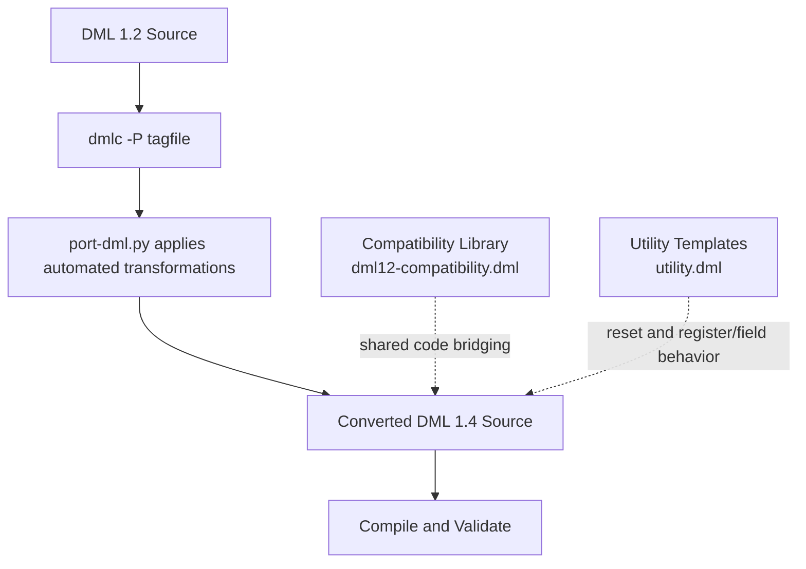
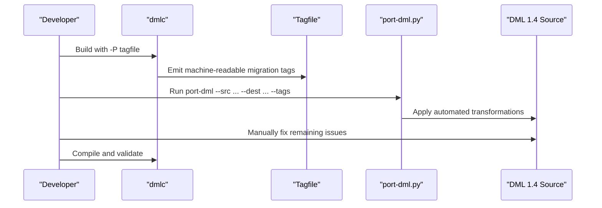
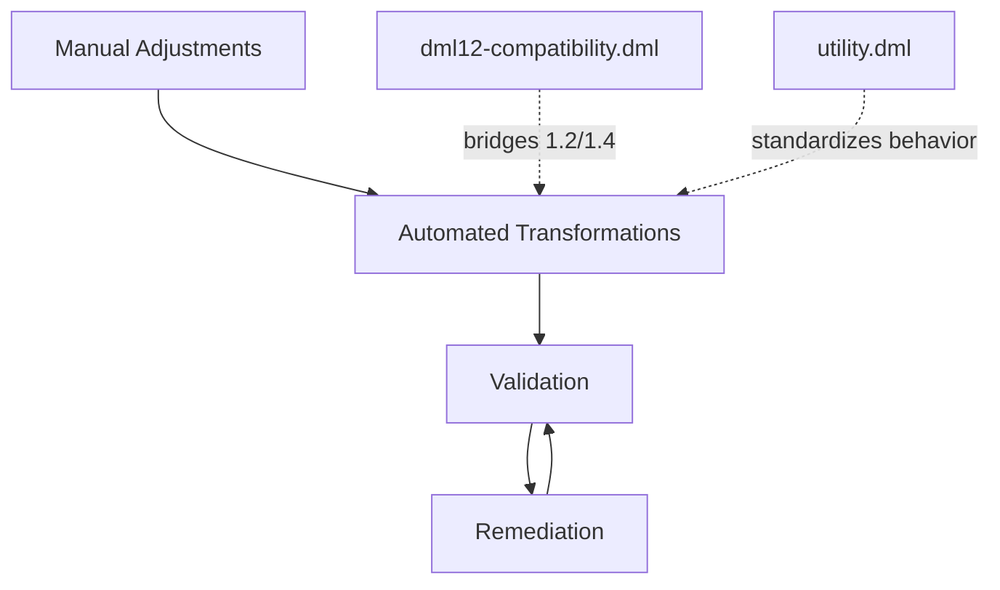

# Manual Migration Procedures

<cite>
**Referenced Files in This Document**
- [doc/1.4/changes-manual.md](file://doc/1.4/changes-manual.md)
- [doc/1.4/port-dml.md](file://doc/1.4/port-dml.md)
- [RELEASENOTES-1.2.md](file://RELEASENOTES-1.2.md)
- [RELEASENOTES-1.4.md](file://RELEASENOTES-1.4.md)
- [lib/1.2/dml12-compatibility.dml](file://lib/1.2/dml12-compatibility.dml)
- [lib/1.4/utility.dml](file://lib/1.4/utility.dml)
- [py/port_dml.py](file://py/port_dml.py)
- [test/1.2/misc/T_porting.dml](file://test/1.2/misc/T_porting.dml)
- [test/1.4/misc/T_porting.dml](file://test/1.4/misc/T_porting.dml)
- [test/1.2/misc/porting-common.dml](file://test/1.2/misc/porting-common.dml)
</cite>

## Table of Contents
1. [Introduction](#introduction)
2. [Project Structure](#project-structure)
3. [Core Components](#core-components)
4. [Architecture Overview](#architecture-overview)
5. [Detailed Component Analysis](#detailed-component-analysis)
6. [Dependency Analysis](#dependency-analysis)
7. [Performance Considerations](#performance-considerations)
8. [Troubleshooting Guide](#troubleshooting-guide)
9. [Conclusion](#conclusion)
10. [Appendices](#appendices)

## Introduction
This document provides comprehensive manual migration procedures for converting DML 1.2 device models to DML 1.4. It focuses on step-by-step manual conversion processes for common patterns, syntax changes, and structural modifications highlighted in the official change documentation. It also documents manual verification procedures, validation steps, testing methodologies, and guidance for handling edge cases, complex template instantiations, and custom device implementations. Finally, it includes checklists to ensure complete and correct migrations.

## Project Structure
The migration process centers on:
- Official change documentation that enumerates backward-incompatible changes and manual adjustments required
- The automated porting toolchain and its limitations
- Compatibility shims for shared code and legacy APIs
- Standard templates for reset and register/field behavior in DML 1.4
- Test scaffolding that demonstrates tagging and porting workflows

**Diagram sources**
- [doc/1.4/port-dml.md](file://doc/1.4/port-dml.md#L28-L77)
- [py/port_dml.py](file://py/port_dml.py#L1-L120)
- [lib/1.2/dml12-compatibility.dml](file://lib/1.2/dml12-compatibility.dml#L1-L120)
- [lib/1.4/utility.dml](file://lib/1.4/utility.dml#L1-L120)

**Section sources**
- [doc/1.4/port-dml.md](file://doc/1.4/port-dml.md#L28-L77)
- [py/port_dml.py](file://py/port_dml.py#L1-L120)

## Core Components
- Change documentation: Lists all backward-incompatible changes and manual adjustments required for DML 1.2 to 1.4 migration.
- Automated porting tool: Applies mechanical transformations to ease migration, but has known limitations and cannot fix all issues.
- Compatibility library: Provides 1.2-compatible wrappers and dummy templates to bridge shared code and legacy APIs.
- Utility templates: Provide standardized reset behavior and register/field templates in DML 1.4.
- Test scaffolding: Demonstrates tagging and porting workflows and showcases common migration patterns.

**Section sources**
- [doc/1.4/changes-manual.md](file://doc/1.4/changes-manual.md#L1-L411)
- [doc/1.4/port-dml.md](file://doc/1.4/port-dml.md#L28-L77)
- [lib/1.2/dml12-compatibility.dml](file://lib/1.2/dml12-compatibility.dml#L1-L120)
- [lib/1.4/utility.dml](file://lib/1.4/utility.dml#L1-L120)
- [test/1.2/misc/T_porting.dml](file://test/1.2/misc/T_porting.dml#L1-L14)
- [test/1.4/misc/T_porting.dml](file://test/1.4/misc/T_porting.dml#L1-L14)

## Architecture Overview
The migration pipeline integrates tagging, automated transformation, and manual remediation. The compatibility layer ensures shared code remains usable across versions, while utility templates standardize reset and register/field behavior in DML 1.4.

**Diagram sources**
- [doc/1.4/port-dml.md](file://doc/1.4/port-dml.md#L28-L77)
- [py/port_dml.py](file://py/port_dml.py#L1-L120)

## Detailed Component Analysis

### Step-by-Step Migration Workflow
- Prepare: Ensure you have a clean build environment and a fresh tagfile.
- Tag: Build with the -P flag to generate a tagfile listing required changes.
- Transform: Run port-dml to apply automated transformations.
- Validate: Compile the converted file; expect compiler errors for unresolved issues.
- Remediate: Manually apply changes listed in the “Backward incompatible changes” documentation.
- Iterate: Use strict mode and incremental validation to reduce scope of errors.

**Section sources**
- [doc/1.4/port-dml.md](file://doc/1.4/port-dml.md#L28-L77)

### Common Patterns and Manual Adjustments
Below are typical migration scenarios with manual steps and verification guidance. For each item, consult the change documentation for precise details.

- Top-level scope and object references
  - Remove reliance on $ for object references; merge top-level and global scopes.
  - Ensure no naming collisions between top-level banks/constants.
  - Verification: Compile and check for scope resolution errors.

- Reset API rewrite
  - Replace implicit reset behavior with explicit templates: instantiate poreset, hreset, sreset on the device.
  - Replace hard_reset and soft_reset methods with init_val defaults; override soft_reset for different reset values.
  - Replace hard_reset_value and soft_reset_value parameters with init_val.
  - Verification: Confirm reset behavior matches expectations; test power-on, hard, and soft reset paths.

- Event object API changes
  - Replace per-event timebase parameters with predefined templates: simple_time_event, simple_cycle_event, uint64_time_event, uint64_cycle_event, custom_time_event.
  - Remove methods not available in custom_*_event templates; adjust serialization accordingly.
  - Verification: Ensure event posting and retrieval work as expected; confirm method signatures align with chosen template.

- Bank parameters and behavior
  - partial and overlapping default to true; review bank behavior if relying on defaults.
  - Remove deprecated bank parameters (e.g., miss_bank, miss_bank_offset, miss_pattern, function, log_group) and replace with standard templates if needed.
  - Verification: Compile and test bank access behavior; ensure unmapped registers use unmapped templates.

- Attribute API changes
  - Remove allocate_type parameter; replace with dedicated templates: uint64_attr, int64_attr, bool_attr, double_attr.
  - Replace before_set/after_set with set method overrides that call default().
  - Verification: Compile and test attribute registration; ensure getters/setters behave correctly.

- Register and field storage model
  - Access values via .val member; update assignments and expressions accordingly.
  - Verification: Compile and run tests to ensure register/field reads/writes operate on .val.

- Template and parameter changes
  - Remove desc string from template declarations; templates renamed (e.g., unimplemented → unimpl).
  - Remove persistent parameter from fields; use checkpoint attributes if persistence differs within a register.
  - Verification: Compile and test template instantiations; ensure parameter usage is valid.

- Method and statement changes
  - Add throws keyword to methods that can throw; annotate throws on invocations or methods that call throwing methods.
  - Assignment operators are separate statements; update expressions accordingly.
  - Switch statement syntax is stricter; ensure compound statement with labeled cases.
  - Verification: Compile and test method bodies; ensure exception handling is correct.

- Identifier and syntax restrictions
  - Avoid using C keywords as local variable names; rename identifiers.
  - Remove goto statements and labels; refactor control flow.
  - Verification: Compile and ensure no goto-related errors.

- Arithmetic and operator semantics
  - Integer arithmetic promotions and stricter operator semantics; update code to avoid implicit assumptions.
  - Verification: Compile and test arithmetic-heavy logic.

- Interface and export changes
  - Replace method extern with export statements; ensure exported methods meet constraints.
  - Verification: Compile and verify exported function linkage.

- Validation and compatibility
  - Use strict-dml12 mode to catch issues early; split conversion into smaller steps.
  - Verification: Compile with strict mode; resolve flagged issues before running port-dml.

**Section sources**
- [doc/1.4/changes-manual.md](file://doc/1.4/changes-manual.md#L96-L411)
- [RELEASENOTES-1.2.md](file://RELEASENOTES-1.2.md#L19-L121)
- [RELEASENOTES-1.4.md](file://RELEASENOTES-1.4.md#L1-L362)

### Compatibility Layer for Shared Code
- Use dml12-compatibility.dml to bridge 1.2 and 1.4 APIs in shared code.
- Import compatibility templates to preserve override behavior for bank access and field/register access methods.
- Instantiate compatibility templates where necessary to honor overrides from 1.4 code in 1.2 devices.

**Section sources**
- [lib/1.2/dml12-compatibility.dml](file://lib/1.2/dml12-compatibility.dml#L1-L200)

### Standard Templates for Reset and Behavior
- Use utility.dml templates to standardize reset behavior and register/field templates.
- Instantiate poreset, hreset, sreset on the device to enable standard reset ports.
- Use soft_reset_val to customize soft reset values; leverage init_val for reset values.

**Section sources**
- [lib/1.4/utility.dml](file://lib/1.4/utility.dml#L170-L360)

### Testing and Validation Methodologies
- Tagging and porting workflow demonstration:
  - Use test scaffolding to understand tagging and porting steps.
  - Verify that tagfiles are generated and consumed by port-dml.
- Incremental validation:
  - Use strict-dml12 mode to catch issues incrementally.
  - Validate each transformed file before proceeding to the next.

**Section sources**
- [test/1.2/misc/T_porting.dml](file://test/1.2/misc/T_porting.dml#L1-L14)
- [test/1.4/misc/T_porting.dml](file://test/1.4/misc/T_porting.dml#L1-L14)
- [doc/1.4/port-dml.md](file://doc/1.4/port-dml.md#L28-L77)

### Edge Cases and Complex Scenarios
- Unused code paths:
  - port-dml may skip conversions for unused code; manually port or force analysis on additional modules.
- Template conflicts and overrides:
  - Resolve template instantiation conflicts by adjusting object scopes and explicit template application.
- Custom device implementations:
  - Review compatibility templates and utility templates to align custom logic with 1.4 semantics.

**Section sources**
- [doc/1.4/port-dml.md](file://doc/1.4/port-dml.md#L59-L77)
- [py/port_dml.py](file://py/port_dml.py#L1-L120)

## Dependency Analysis
Migration depends on:
- Correct application of automated transformations
- Availability of compatibility templates for shared code
- Proper instantiation of utility templates for reset and register/field behavior
- Strict validation and iterative remediation

**Diagram sources**
- [doc/1.4/changes-manual.md](file://doc/1.4/changes-manual.md#L96-L411)
- [lib/1.2/dml12-compatibility.dml](file://lib/1.2/dml12-compatibility.dml#L1-L120)
- [lib/1.4/utility.dml](file://lib/1.4/utility.dml#L1-L120)

**Section sources**
- [doc/1.4/changes-manual.md](file://doc/1.4/changes-manual.md#L96-L411)
- [lib/1.2/dml12-compatibility.dml](file://lib/1.2/dml12-compatibility.dml#L1-L120)
- [lib/1.4/utility.dml](file://lib/1.4/utility.dml#L1-L120)

## Performance Considerations
- Prefer utility templates to minimize custom logic and reduce complexity.
- Keep shared code compatible using dml12-compatibility.dml to avoid repeated manual fixes.
- Validate incrementally to catch regressions early and reduce rework.

## Troubleshooting Guide
- Tagfile issues:
  - Ensure tagfile is regenerated when source changes; port-dml appends to existing tagfiles.
- Script failures:
  - port-dml may fail due to script bugs; remove problematic tag entries and retry.
- Remaining compiler errors:
  - Apply manual fixes enumerated in the change documentation; use strict-dml12 mode to narrow issues.
- Compatibility mismatches:
  - Verify compatibility templates are imported and instantiated correctly; ensure overrides are honored.

**Section sources**
- [doc/1.4/port-dml.md](file://doc/1.4/port-dml.md#L48-L77)
- [py/port_dml.py](file://py/port_dml.py#L1-L120)

## Conclusion
Migrating from DML 1.2 to 1.4 requires combining automated transformations with careful manual remediation guided by the change documentation. Use the compatibility layer for shared code, leverage utility templates for standardized behavior, and validate incrementally with strict mode. Follow the checklists and verification steps to ensure correctness and completeness.

## Appendices

### Migration Checklist
- [ ] Generate a fresh tagfile with dmlc -P
- [ ] Run port-dml to apply automated transformations
- [ ] Compile and note remaining errors
- [ ] Manually apply changes from the “Backward incompatible changes” list
- [ ] Validate reset behavior with poreset/hreset/sreset
- [ ] Update event objects to use predefined templates
- [ ] Replace attribute allocate_type with dedicated templates
- [ ] Update register/field access to use .val
- [ ] Replace deprecated parameters and templates
- [ ] Add throws annotations and update method signatures
- [ ] Refactor switch statements and assignment operators
- [ ] Remove goto and rename restricted identifiers
- [ ] Test arithmetic and operator semantics
- [ ] Verify interface and export changes
- [ ] Validate with strict-dml12 mode
- [ ] Confirm compatibility layer usage for shared code

**Section sources**
- [doc/1.4/changes-manual.md](file://doc/1.4/changes-manual.md#L96-L411)
- [doc/1.4/port-dml.md](file://doc/1.4/port-dml.md#L28-L77)
- [lib/1.2/dml12-compatibility.dml](file://lib/1.2/dml12-compatibility.dml#L1-L120)
- [lib/1.4/utility.dml](file://lib/1.4/utility.dml#L170-L360)