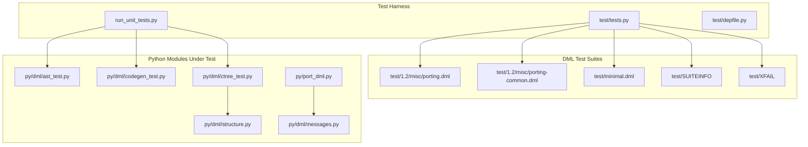
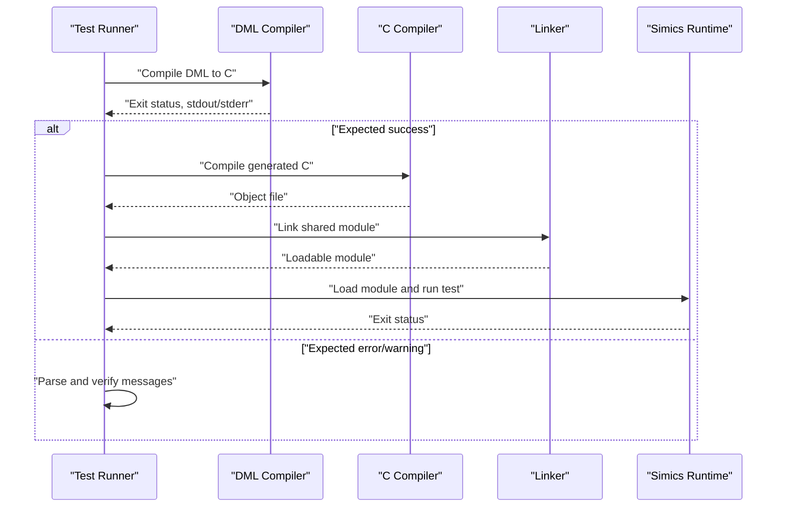
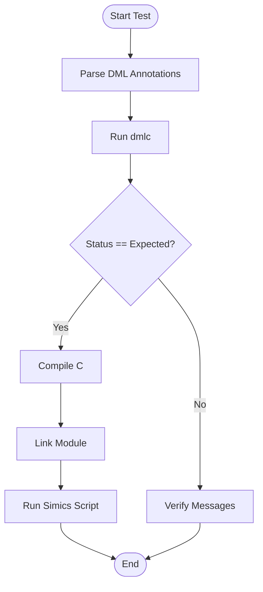
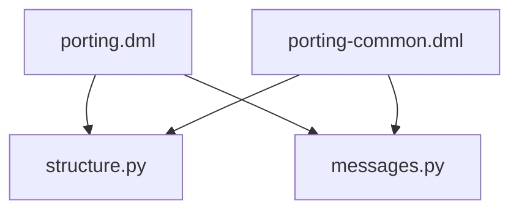
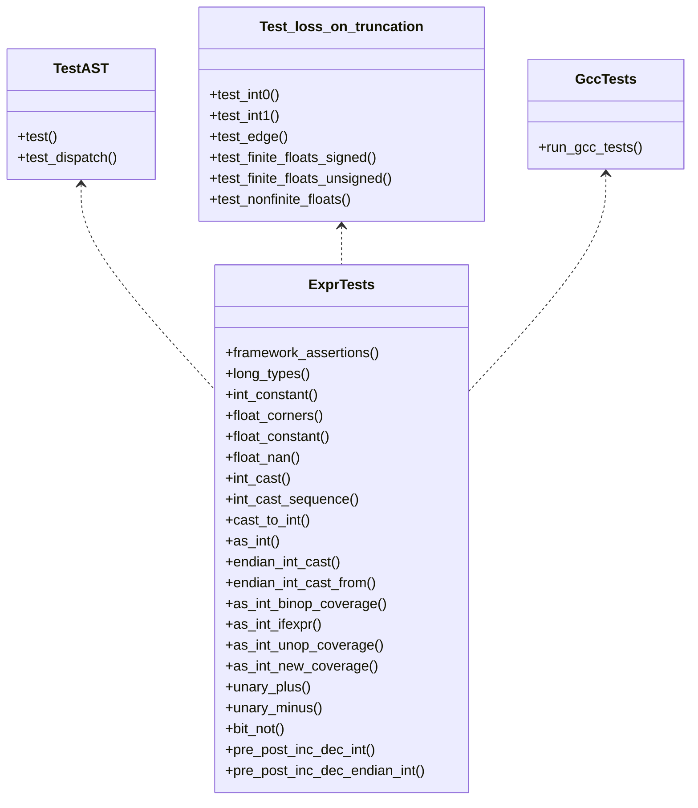
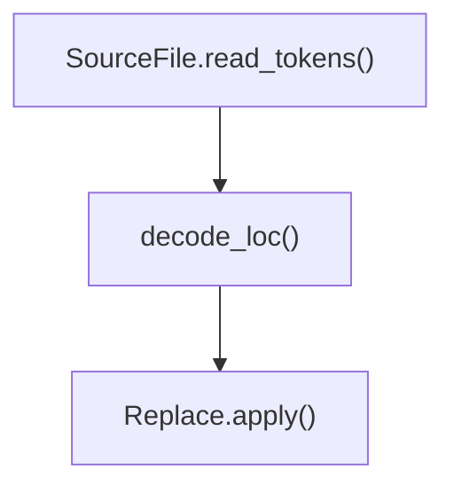
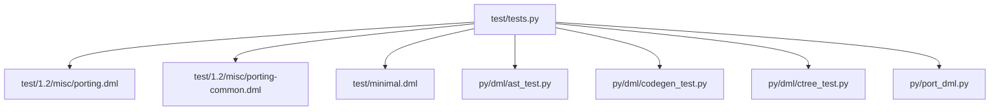

# Migration Validation and Testing

<cite>
**Referenced Files in This Document**
- [tests.py](file://test/tests.py)
- [run_unit_tests.py](file://run_unit_tests.py)
- [depfile.py](file://test/depfile.py)
- [minimal.dml](file://test/minimal.dml)
- [SUITEINFO](file://test/SUITEINFO)
- [XFAIL](file://test/XFAIL)
- [porting-common.dml](file://test/1.2/misc/porting-common.dml)
- [porting.dml](file://test/1.2/misc/porting.dml)
- [port_dml.py](file://py/port_dml.py)
- [ast_test.py](file://py/dml/ast_test.py)
- [codegen_test.py](file://py/dml/codegen_test.py)
- [ctree_test.py](file://py/dml/ctree_test.py)
- [structure.py](file://py/dml/structure.py)
- [messages.py](file://py/dml/messages.py)
</cite>

## Table of Contents
1. [Introduction](#introduction)
2. [Project Structure](#project-structure)
3. [Core Components](#core-components)
4. [Architecture Overview](#architecture-overview)
5. [Detailed Component Analysis](#detailed-component-analysis)
6. [Dependency Analysis](#dependency-analysis)
7. [Performance Considerations](#performance-considerations)
8. [Troubleshooting Guide](#troubleshooting-guide)
9. [Conclusion](#conclusion)
10. [Appendices](#appendices)

## Introduction
This document defines comprehensive validation and testing procedures for migrated Device Modeling Language (DML) code. It covers automated strategies to verify correctness and behavioral equivalence during migration from DML 1.2 to 1.4, including unit tests, integration tests, and end-to-end validation. It also outlines regression testing, performance validation, compatibility verification, and practical guidance for debugging transformed code.

## Project Structure
The repository organizes migration validation across:
- Test harness and orchestration for DML compilation, C compilation, linking, and Simics runtime execution
- Porting-specific test suites and fixtures for DML 1.2 to 1.4 conversions
- Unit tests for core Python modules (AST, code generation, C IR)
- Compatibility and porting utilities for migration diagnostics and transformations

**Diagram sources**
- [tests.py](file://test/tests.py#L1-L200)
- [run_unit_tests.py](file://run_unit_tests.py#L1-L20)
- [depfile.py](file://test/depfile.py#L1-L29)
- [porting.dml](file://test/1.2/misc/porting.dml#L1-L20)
- [porting-common.dml](file://test/1.2/misc/porting-common.dml#L1-L40)
- [minimal.dml](file://test/minimal.dml#L1-L8)
- [SUITEINFO](file://test/SUITEINFO#L1-L2)
- [XFAIL](file://test/XFAIL#L1-L20)
- [ast_test.py](file://py/dml/ast_test.py#L1-L52)
- [codegen_test.py](file://py/dml/codegen_test.py#L1-L117)
- [ctree_test.py](file://py/dml/ctree_test.py#L1-L120)
- [structure.py](file://py/dml/structure.py#L2081-L2150)
- [messages.py](file://py/dml/messages.py#L2586-L2610)
- [port_dml.py](file://py/port_dml.py#L273-L341)

**Section sources**
- [tests.py](file://test/tests.py#L1-L200)
- [run_unit_tests.py](file://run_unit_tests.py#L1-L20)
- [depfile.py](file://test/depfile.py#L1-L29)
- [porting.dml](file://test/1.2/misc/porting.dml#L1-L20)
- [porting-common.dml](file://test/1.2/misc/porting-common.dml#L1-L40)
- [minimal.dml](file://test/minimal.dml#L1-L8)
- [SUITEINFO](file://test/SUITEINFO#L1-L2)
- [XFAIL](file://test/XFAIL#L1-L20)
- [ast_test.py](file://py/dml/ast_test.py#L1-L52)
- [codegen_test.py](file://py/dml/codegen_test.py#L1-L117)
- [ctree_test.py](file://py/dml/ctree_test.py#L1-L120)
- [structure.py](file://py/dml/structure.py#L2081-L2150)
- [messages.py](file://py/dml/messages.py#L2586-L2610)
- [port_dml.py](file://py/port_dml.py#L273-L341)

## Core Components
- Test harness orchestrates DML compilation, optional PyPy parity checks, C compilation, linking, and Simics runtime execution. It parses annotated expectations embedded in test DML files and validates messages and exit statuses.
- Porting fixtures exercise conversion rules and porting messages across DML 1.2 and 1.4 constructs.
- Unit tests validate AST, code generation, and C IR generation correctness and edge cases.
- Compatibility utilities provide porting diagnostics and transformation primitives.

Key capabilities:
- Annotation-driven expectations via comments in DML files
- Message parsing and verification for errors/warnings
- Optional PyPy vs CPython parity checks for dmlc output
- Parallelized test execution with prerequisite handling
- Controlled timeouts and environment configuration

**Section sources**
- [tests.py](file://test/tests.py#L142-L330)
- [tests.py](file://test/tests.py#L354-L490)
- [tests.py](file://test/tests.py#L502-L581)
- [tests.py](file://test/tests.py#L606-L800)
- [porting.dml](file://test/1.2/misc/porting.dml#L1-L20)
- [porting-common.dml](file://test/1.2/misc/porting-common.dml#L1-L40)
- [ast_test.py](file://py/dml/ast_test.py#L1-L52)
- [codegen_test.py](file://py/dml/codegen_test.py#L1-L117)
- [ctree_test.py](file://py/dml/ctree_test.py#L152-L215)

## Architecture Overview
The validation pipeline integrates DML parsing, backend code generation, C compilation, and runtime simulation.

**Diagram sources**
- [tests.py](file://test/tests.py#L285-L331)
- [tests.py](file://test/tests.py#L614-L707)
- [tests.py](file://test/tests.py#L709-L764)

## Detailed Component Analysis

### Test Harness Orchestration
The test harness builds a suite of DML test cases, applies filters, and executes them in parallel. It supports:
- Parsing annotations in DML files to define expected errors/warnings, flags, and compile-only behavior
- Running dmlc, optionally comparing outputs against PyPy variant
- Compiling and linking generated C code into a Simics module
- Executing Simics scripts to validate runtime behavior
- Verifying message catalogs and exit statuses

**Diagram sources**
- [tests.py](file://test/tests.py#L521-L581)
- [tests.py](file://test/tests.py#L285-L331)
- [tests.py](file://test/tests.py#L614-L707)
- [tests.py](file://test/tests.py#L709-L764)

**Section sources**
- [tests.py](file://test/tests.py#L142-L330)
- [tests.py](file://test/tests.py#L354-L490)
- [tests.py](file://test/tests.py#L502-L581)
- [tests.py](file://test/tests.py#L606-L800)

### Porting and Compatibility Fixtures
Porting fixtures validate conversion rules and porting messages. They include:
- Common bank and method patterns for access, miss handling, and legacy compatibility
- Mixed constructs to exercise porting transformations and diagnostics

**Diagram sources**
- [porting-common.dml](file://test/1.2/misc/porting-common.dml#L79-L137)
- [porting.dml](file://test/1.2/misc/porting.dml#L1-L20)
- [structure.py](file://py/dml/structure.py#L2935-L2968)
- [messages.py](file://py/dml/messages.py#L2586-L2610)

**Section sources**
- [porting-common.dml](file://test/1.2/misc/porting-common.dml#L1-L137)
- [porting.dml](file://test/1.2/misc/porting.dml#L1-L20)
- [structure.py](file://py/dml/structure.py#L2935-L2968)
- [messages.py](file://py/dml/messages.py#L2586-L2610)

### Unit Tests for Core Modules
- AST tests validate AST construction and dispatch behavior
- Code generation tests validate truncation loss detection and numeric edge cases
- C IR tests compile and run small generated C snippets with GCC to validate type and control-flow handling

**Diagram sources**
- [ast_test.py](file://py/dml/ast_test.py#L11-L52)
- [codegen_test.py](file://py/dml/codegen_test.py#L8-L117)
- [ctree_test.py](file://py/dml/ctree_test.py#L152-L215)
- [ctree_test.py](file://py/dml/ctree_test.py#L235-L800)

**Section sources**
- [ast_test.py](file://py/dml/ast_test.py#L1-L52)
- [codegen_test.py](file://py/dml/codegen_test.py#L1-L117)
- [ctree_test.py](file://py/dml/ctree_test.py#L152-L215)
- [ctree_test.py](file://py/dml/ctree_test.py#L235-L800)

### Porting Utilities and Diagnostics
Porting utilities provide transformation primitives and decoding helpers used during migration and validation.

**Diagram sources**
- [port_dml.py](file://py/port_dml.py#L273-L341)

**Section sources**
- [port_dml.py](file://py/port_dml.py#L273-L341)

## Dependency Analysis
The test harness depends on:
- DML test fixtures under test/1.2 and test/1.4
- Python unit test modules under py/dml
- Porting utilities under py
- Build-time dependencies for C compilation and linking

**Diagram sources**
- [tests.py](file://test/tests.py#L1-L200)
- [porting.dml](file://test/1.2/misc/porting.dml#L1-L20)
- [porting-common.dml](file://test/1.2/misc/porting-common.dml#L1-L40)
- [minimal.dml](file://test/minimal.dml#L1-L8)
- [ast_test.py](file://py/dml/ast_test.py#L1-L52)
- [codegen_test.py](file://py/dml/codegen_test.py#L1-L117)
- [ctree_test.py](file://py/dml/ctree_test.py#L1-L120)
- [port_dml.py](file://py/port_dml.py#L273-L341)

**Section sources**
- [tests.py](file://test/tests.py#L1-L200)
- [porting.dml](file://test/1.2/misc/porting.dml#L1-L20)
- [porting-common.dml](file://test/1.2/misc/porting-common.dml#L1-L40)
- [minimal.dml](file://test/minimal.dml#L1-L8)
- [ast_test.py](file://py/dml/ast_test.py#L1-L52)
- [codegen_test.py](file://py/dml/codegen_test.py#L1-L117)
- [ctree_test.py](file://py/dml/ctree_test.py#L1-L120)
- [port_dml.py](file://py/port_dml.py#L273-L341)

## Performance Considerations
- Use compile-only tests to isolate parser/backend performance without runtime overhead
- Prefer targeted subsets of test suites when validating large migrations
- Leverage parallel execution with controlled thread counts to reduce total validation time
- Apply timeouts per test category to avoid long-running regressions

[No sources needed since this section provides general guidance]

## Troubleshooting Guide
Common issues and resolutions:
- Unexpected exit status: inspect dmlc stdout/stderr logs and verify expected status flags in test annotations
- Message mismatches: confirm parsed error/warning tags and locations match expectations; adjust annotations if needed
- PyPy parity failures: review unified diffs for differences in generated artifacts; resolve discrepancies in dmlc behavior
- Linker/runtime failures: validate include paths, module IDs, and Simics environment variables; ensure proper module loading and instantiation

Operational controls:
- Timeout multipliers for heavy tests
- Environment variables for dmlc invocation and line directive handling
- XFAIL lists for known failures tracked by issue IDs

**Section sources**
- [tests.py](file://test/tests.py#L332-L352)
- [tests.py](file://test/tests.py#L431-L490)
- [tests.py](file://test/tests.py#L254-L283)
- [tests.py](file://test/tests.py#L88-L90)
- [tests.py](file://test/tests.py#L79-L80)
- [XFAIL](file://test/XFAIL#L1-L81)

## Conclusion
The repository provides a robust, multi-layered validation framework for DML migration. By combining annotation-driven expectations, unit tests for core modules, porting fixtures, and end-to-end integration with Simics, teams can ensure correctness, compatibility, and performance across migrations from DML 1.2 to 1.4.

[No sources needed since this section summarizes without analyzing specific files]

## Appendices

### Test Case Organization for Migration Validation
- Unit tests: Validate AST, code generation, and C IR correctness
- Integration tests: Compile DML to C, link, and run via Simics
- End-to-end validation: Use porting fixtures to exercise conversion rules and diagnostics

**Section sources**
- [ast_test.py](file://py/dml/ast_test.py#L1-L52)
- [codegen_test.py](file://py/dml/codegen_test.py#L1-L117)
- [ctree_test.py](file://py/dml/ctree_test.py#L152-L215)
- [tests.py](file://test/tests.py#L606-L800)
- [porting.dml](file://test/1.2/misc/porting.dml#L1-L20)
- [porting-common.dml](file://test/1.2/misc/porting-common.dml#L1-L40)

### Automated Testing Strategies
- Annotation-driven expectations embedded in DML files
- Message parsing and verification for errors/warnings
- Optional PyPy parity checks for dmlc output
- Controlled timeouts and environment configuration

**Section sources**
- [tests.py](file://test/tests.py#L521-L581)
- [tests.py](file://test/tests.py#L354-L490)
- [tests.py](file://test/tests.py#L254-L283)
- [tests.py](file://test/tests.py#L88-L90)
- [tests.py](file://test/tests.py#L79-L80)

### Regression Testing Approaches
- Maintain XFAIL lists for known issues
- Use SUITEINFO to configure global timeouts
- Filter and parallelize test execution to detect regressions early

**Section sources**
- [XFAIL](file://test/XFAIL#L1-L81)
- [SUITEINFO](file://test/SUITEINFO#L1-L2)
- [tests.py](file://test/tests.py#L2116-L2152)

### Performance Validation and Compatibility Verification
- Validate numeric edge cases and truncation behavior
- Compile and run small C snippets to verify type and control-flow handling
- Use porting diagnostics to identify and resolve signature and semantic changes

**Section sources**
- [codegen_test.py](file://py/dml/codegen_test.py#L1-L117)
- [ctree_test.py](file://py/dml/ctree_test.py#L152-L215)
- [structure.py](file://py/dml/structure.py#L2935-L2968)
- [messages.py](file://py/dml/messages.py#L2586-L2610)

### Guidance for Debugging Transformed Code
- Inspect unified diffs between CPython and PyPy dmlc outputs
- Review parsed message catalogs and expected tags
- Use minimal DML fixtures to reproduce issues in isolation

**Section sources**
- [tests.py](file://test/tests.py#L254-L283)
- [tests.py](file://test/tests.py#L354-L490)
- [minimal.dml](file://test/minimal.dml#L1-L8)