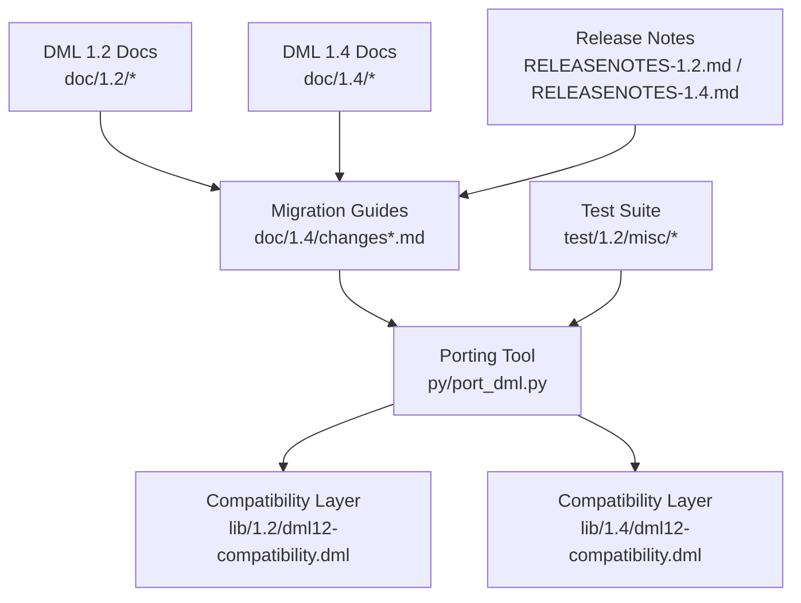
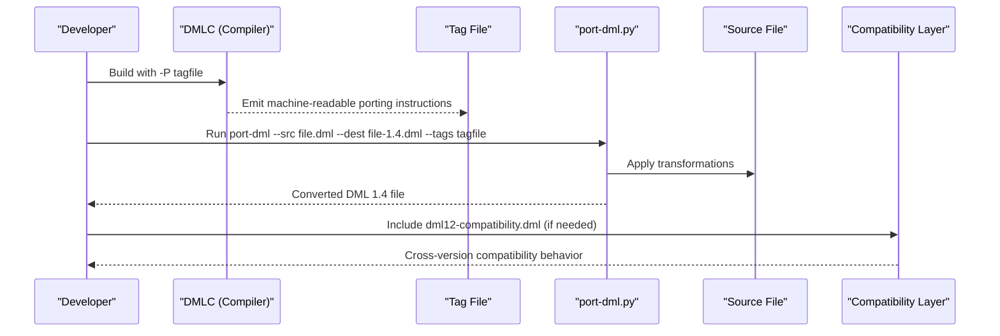
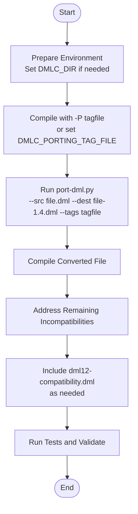
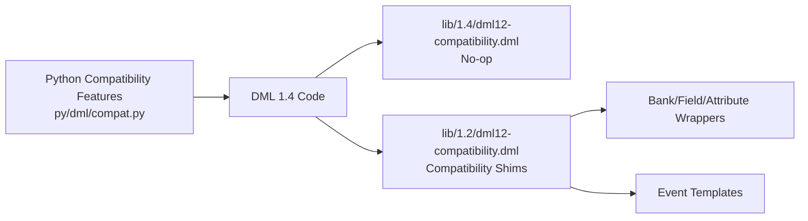
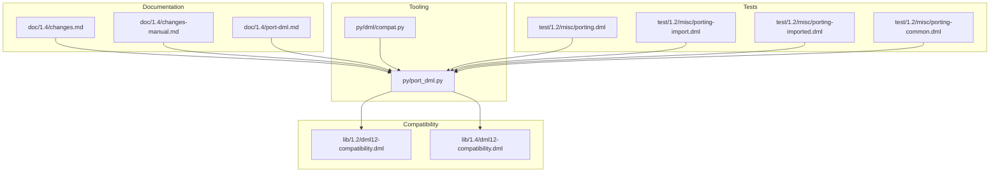

# Migration and Compatibility Resources

<cite>
**Referenced Files in This Document**
- [README.md](file://README.md)
- [RELEASENOTES-1.2.md](file://RELEASENOTES-1.2.md)
- [RELEASENOTES-1.4.md](file://RELEASENOTES-1.4.md)
- [doc/1.2/index.md](file://doc/1.2/index.md)
- [doc/1.4/index.md](file://doc/1.4/index.md)
- [doc/1.4/changes.md](file://doc/1.4/changes.md)
- [doc/1.4/changes-manual.md](file://doc/1.4/changes-manual.md)
- [doc/1.4/port-dml.md](file://doc/1.4/port-dml.md)
- [lib/1.2/dml12-compatibility.dml](file://lib/1.2/dml12-compatibility.dml)
- [lib/1.4/dml12-compatibility.dml](file://lib/1.4/dml12-compatibility.dml)
- [py/port_dml.py](file://py/port_dml.py)
- [py/dml/compat.py](file://py/dml/compat.py)
- [test/1.2/misc/porting.dml](file://test/1.2/misc/porting.dml)
- [test/1.2/misc/porting-import.dml](file://test/1.2/misc/porting-import.dml)
- [test/1.2/misc/porting-imported.dml](file://test/1.2/misc/porting-imported.dml)
- [test/1.2/misc/porting-common.dml](file://test/1.2/misc/porting-common.dml)
</cite>

## Table of Contents
1. [Introduction](#introduction)
2. [Project Structure](#project-structure)
3. [Core Components](#core-components)
4. [Architecture Overview](#architecture-overview)
5. [Detailed Component Analysis](#detailed-component-analysis)
6. [Dependency Analysis](#dependency-analysis)
7. [Performance Considerations](#performance-considerations)
8. [Troubleshooting Guide](#troubleshooting-guide)
9. [Conclusion](#conclusion)
10. [Appendices](#appendices)

## Introduction
This document provides comprehensive migration and compatibility resources for upgrading Device Modeling Language (DML) from version 1.2 to 1.4. It consolidates compatibility matrices, migration procedures, compatibility layers, deprecation handling, and validation practices. It also documents version-specific differences, breaking changes, and practical examples to guide teams through upgrades while preserving functionality and minimizing regressions.

## Project Structure
The repository organizes migration-related assets across documentation, compatibility libraries, and automated tooling:
- Documentation for DML 1.2 and 1.4, including migration guides and change summaries
- Compatibility libraries enabling cross-version behavior
- Automated porting tooling and supporting Python modules
- Test suites demonstrating migration patterns and edge cases

**Diagram sources**
- [doc/1.2/index.md](file://doc/1.2/index.md#L1-L7)
- [doc/1.4/index.md](file://doc/1.4/index.md#L1-L7)
- [doc/1.4/changes.md](file://doc/1.4/changes.md#L1-L249)
- [doc/1.4/changes-manual.md](file://doc/1.4/changes-manual.md#L1-L411)
- [py/port_dml.py](file://py/port_dml.py#L1-L800)
- [lib/1.2/dml12-compatibility.dml](file://lib/1.2/dml12-compatibility.dml#L1-L470)
- [lib/1.4/dml12-compatibility.dml](file://lib/1.4/dml12-compatibility.dml#L1-L15)
- [test/1.2/misc/porting.dml](file://test/1.2/misc/porting.dml#L1-L477)

**Section sources**
- [doc/1.2/index.md](file://doc/1.2/index.md#L1-L7)
- [doc/1.4/index.md](file://doc/1.4/index.md#L1-L7)
- [doc/1.4/changes.md](file://doc/1.4/changes.md#L1-L249)
- [doc/1.4/changes-manual.md](file://doc/1.4/changes-manual.md#L1-L411)
- [py/port_dml.py](file://py/port_dml.py#L1-L800)
- [lib/1.2/dml12-compatibility.dml](file://lib/1.2/dml12-compatibility.dml#L1-L470)
- [lib/1.4/dml12-compatibility.dml](file://lib/1.4/dml12-compatibility.dml#L1-L15)
- [test/1.2/misc/porting.dml](file://test/1.2/misc/porting.dml#L1-L477)

## Core Components
- Migration documentation: Change summaries and manual incompatibilities
- Automated porting tool: Parses DML, generates porting tags, and applies transformations
- Compatibility libraries: Provide 1.2 compatibility for 1.4 code and vice versa
- Compatibility features: Flags controlling legacy behavior for gradual migration
- Tests: Demonstrate migration patterns and edge cases

Key responsibilities:
- Documenting version differences and breaking changes
- Automating mechanical conversions
- Providing compatibility shims for cross-version usage
- Enabling controlled migration via compatibility flags

**Section sources**
- [doc/1.4/changes.md](file://doc/1.4/changes.md#L1-L249)
- [doc/1.4/changes-manual.md](file://doc/1.4/changes-manual.md#L1-L411)
- [py/port_dml.py](file://py/port_dml.py#L1-L800)
- [lib/1.2/dml12-compatibility.dml](file://lib/1.2/dml12-compatibility.dml#L1-L470)
- [lib/1.4/dml12-compatibility.dml](file://lib/1.4/dml12-compatibility.dml#L1-L15)
- [py/dml/compat.py](file://py/dml/compat.py#L1-L432)

## Architecture Overview
The migration pipeline integrates documentation, tooling, and compatibility layers:

**Diagram sources**
- [doc/1.4/port-dml.md](file://doc/1.4/port-dml.md#L1-L77)
- [py/port_dml.py](file://py/port_dml.py#L1-L800)
- [lib/1.2/dml12-compatibility.dml](file://lib/1.2/dml12-compatibility.dml#L1-L470)
- [lib/1.4/dml12-compatibility.dml](file://lib/1.4/dml12-compatibility.dml#L1-L15)

## Detailed Component Analysis

### Compatibility Matrix: Feature Availability Across DML 1.2 and 1.4
This matrix summarizes major feature availability and differences between DML 1.2 and 1.4. Items marked “Yes” indicate availability; “No” indicates absence or change in semantics.

- Version statement
  - DML 1.2: Optional in later versions; deprecated alias supported
  - DML 1.4: Required at top of file
- Method declarations
  - DML 1.2: Return values named in declaration; inline attribute on caller
  - DML 1.4: Return types declared; inline attribute on callee; explicit return
- Throws semantics
  - DML 1.2: No throws keyword
  - DML 1.4: Methods that may throw must be annotated with throws
- Object arrays
  - DML 1.2: Implicit index name; range syntax not standardized
  - DML 1.4: Explicit index name and standardized range syntax
- Field declarations
  - DML 1.2: Bit ranges without @
  - DML 1.4: Bit ranges must be prefixed with @
- Session variables
  - DML 1.2: data declarations
  - DML 1.4: session declarations
- Reset API
  - DML 1.2: hard_reset, soft_reset methods; reset parameters in registers/fields
  - DML 1.4: Reset via templates; init_val parameter; explicit reset methods
- Event API
  - DML 1.2: timebase parameter; describe_event method; post_on_queue
  - DML 1.4: Predefined event templates; event method abstract; no describe_event/post_on_queue
- Attribute API
  - DML 1.2: allocate_type parameter; before_set/after_set methods
  - DML 1.4: Type-specific attribute templates; set method override; val member
- Bank parameters
  - DML 1.2: Miss and function parameters; numbered_registers
  - DML 1.4: Miss and function parameters tentatively removed; partial/overlapping default true
- Extern methods
  - DML 1.2: method extern
  - DML 1.4: export statement
- Switch statement
  - DML 1.2: Looser structure
  - DML 1.4: Stricter switch structure
- Assignment operators
  - DML 1.2: Allowed inside expressions
  - DML 1.4: Separate statements; disallowed inside expressions
- goto statement
  - DML 1.2: Present
  - DML 1.4: Removed
- Parameter override behavior
  - DML 1.2: Heuristic selection
  - DML 1.4: Strict template hierarchy resolution
- $ prefix and scoping
  - DML 1.2: $ for object references; separate scopes
  - DML 1.4: $ removed; top-level and global scopes merged
- sizeof/typeof
  - DML 1.2: Operand may be non-lvalue
  - DML 1.4: Operands must be lvalues
- Integer arithmetic
  - DML 1.2: Legacy semantics
  - DML 1.4: Promotions and well-defined behavior

**Section sources**
- [doc/1.4/changes.md](file://doc/1.4/changes.md#L119-L249)
- [doc/1.4/changes-manual.md](file://doc/1.4/changes-manual.md#L1-L411)
- [RELEASENOTES-1.2.md](file://RELEASENOTES-1.2.md#L1-L121)
- [RELEASENOTES-1.4.md](file://RELEASENOTES-1.4.md#L1-L362)

### Migration Guides: Step-by-Step Conversion from DML 1.2 to 1.4
Follow these steps to migrate DML 1.2 to 1.4:

1. Prepare the environment
   - Ensure DMLC is available and configured in your development environment
   - Set DMLC_DIR to the appropriate bin directory if needed

2. Generate porting tags
   - Compile your DML 1.2 file with the -P tagfile option to capture migration instructions
   - Alternatively, set DMLC_PORTING_TAG_FILE in your build environment

3. Run the porting tool
   - Use the port-dml script to interpret and apply the tagfile to your source
   - Review the generated DML 1.4 file for correctness

4. Validate and refine
   - Compile the converted file to catch any remaining issues
   - Manually address incompatibilities flagged by the strict mode

5. Integrate compatibility layers
   - Include dml12-compatibility.dml in 1.4 code that must remain compatible with 1.2 devices
   - Use compatibility features to control legacy behavior during migration

6. Test and iterate
   - Run unit tests and integration tests against the migrated code
   - Iterate on any remaining manual fixes

**Diagram sources**
- [doc/1.4/port-dml.md](file://doc/1.4/port-dml.md#L1-L77)
- [py/port_dml.py](file://py/port_dml.py#L1-L800)
- [lib/1.2/dml12-compatibility.dml](file://lib/1.2/dml12-compatibility.dml#L1-L470)

**Section sources**
- [doc/1.4/port-dml.md](file://doc/1.4/port-dml.md#L1-L77)
- [py/port_dml.py](file://py/port_dml.py#L1-L800)

### Compatibility Layers and Deprecated Feature Handling
- dml12-compatibility.dml (DML 1.2)
  - Provides compatibility shims for banks, registers, fields, attributes, and events
  - Bridges 1.4 overrides into 1.2-compatible behavior
  - Includes compatibility templates for io_memory_access, transaction_access, read_register, write_register, read_field, write_field, and event wrappers
- dml12-compatibility.dml (DML 1.4)
  - Acts as a no-op when the device is 1.4, ensuring no overhead
- Compatibility features (Python)
  - Control legacy behavior via flags (e.g., lenient type checking, shared logs on device, io_memory default, etc.)
  - Gradual migration by toggling features to enforce stricter semantics

**Diagram sources**
- [lib/1.2/dml12-compatibility.dml](file://lib/1.2/dml12-compatibility.dml#L1-L470)
- [lib/1.4/dml12-compatibility.dml](file://lib/1.4/dml12-compatibility.dml#L1-L15)
- [py/dml/compat.py](file://py/dml/compat.py#L1-L432)

**Section sources**
- [lib/1.2/dml12-compatibility.dml](file://lib/1.2/dml12-compatibility.dml#L1-L470)
- [lib/1.4/dml12-compatibility.dml](file://lib/1.4/dml12-compatibility.dml#L1-L15)
- [py/dml/compat.py](file://py/dml/compat.py#L1-L432)

### Version-Specific Differences and Breaking Changes
Key differences and breaking changes impacting migration:
- Method declarations and inlining
  - Return value naming and inline attribute placement changed
- Throws semantics
  - Methods that may throw must be annotated with throws
- Object arrays
  - Index name must be explicit; range syntax standardized
- Field declarations
  - Bit ranges must be prefixed with @
- Session variables
  - data declarations replaced by session declarations
- Reset API
  - Reset methods and parameters removed; use templates and init_val
- Event API
  - Event templates predefined; event method abstract; describe_event/post_on_queue removed
- Attribute API
  - allocate_type removed; use type-specific templates; val member required
- Bank parameters
  - Miss/function parameters tentatively removed; partial/overlapping default true
- Extern methods
  - extern replaced by export
- Switch statement
  - Stricter structure enforced
- Assignment operators
  - Disallowed inside expressions; separate statements
- goto statement
  - Removed
- Parameter override behavior
  - Strict template hierarchy resolution
- $ prefix and scoping
  - $ removed; scopes merged
- sizeof/typeof
  - Operands must be lvalues
- Integer arithmetic
  - Promotions and well-defined behavior

**Section sources**
- [doc/1.4/changes.md](file://doc/1.4/changes.md#L119-L249)
- [doc/1.4/changes-manual.md](file://doc/1.4/changes-manual.md#L1-L411)

### Practical Migration Examples
- Converting method declarations
  - Move return value declarations into locals and add explicit return statements
  - Place inline attribute on the callee and adjust call sites accordingly
- Adjusting resets
  - Replace hard_reset/soft_reset methods and reset parameters with templates and init_val
- Updating events
  - Instantiate predefined event templates and adjust callback signatures
- Migrating attributes
  - Replace allocate_type with type-specific templates and access val member
- Updating field declarations
  - Prefix bit ranges with @
- Handling object arrays
  - Add explicit index names and standardized range syntax
- Switch statements
  - Restructure to meet stricter switch body requirements

**Section sources**
- [doc/1.4/changes.md](file://doc/1.4/changes.md#L119-L249)
- [doc/1.4/changes-manual.md](file://doc/1.4/changes-manual.md#L1-L411)

### Automated Migration Tools and Validation Procedures
- port-dml.py
  - Reads tag files produced by DMLC
  - Applies transformations to convert DML 1.2 to DML 1.4
  - Handles complex edits and maintains file offsets
- Validation
  - Compile the converted file to catch remaining issues
  - Use strict mode to identify problematic constructs early
  - Run tests to ensure behavioral parity

**Section sources**
- [py/port_dml.py](file://py/port_dml.py#L1-L800)
- [doc/1.4/port-dml.md](file://doc/1.4/port-dml.md#L1-L77)

### Common Migration Pitfalls and Troubleshooting Strategies
Common pitfalls:
- Forgetting to add the version statement in DML 1.4
- Incorrect inline attribute placement or missing explicit returns
- Misunderstanding throws semantics for methods that may throw
- Ignoring stricter switch statement requirements
- Not updating event templates or callback signatures
- Failing to migrate attributes to type-specific templates
- Not adjusting field declarations to use @ prefix
- Leaving $ prefixes or unused template instantiations unresolved
- Not handling object arrays with explicit index names

Troubleshooting strategies:
- Use strict mode to catch issues early
- Validate with unit tests and integration tests
- Incrementally apply compatibility features to control legacy behavior
- Consult port-dml limitations and apply manual fixes when necessary
- Review compatibility libraries for cross-version behavior

**Section sources**
- [doc/1.4/changes-manual.md](file://doc/1.4/changes-manual.md#L1-L411)
- [doc/1.4/port-dml.md](file://doc/1.4/port-dml.md#L1-L77)
- [py/dml/compat.py](file://py/dml/compat.py#L1-L432)

### Best Practices for Maintaining Compatibility During Upgrades
- Gradual migration
  - Use compatibility features to control legacy behavior during transition
- Comprehensive testing
  - Validate conversions with unit tests and integration tests
- Documentation and communication
  - Keep migration plans and decisions documented for team alignment
- Controlled rollouts
  - Apply compatibility layers selectively to minimize disruption
- Continuous validation
  - Regularly compile and test migrated code to catch regressions early

**Section sources**
- [py/dml/compat.py](file://py/dml/compat.py#L1-L432)
- [lib/1.2/dml12-compatibility.dml](file://lib/1.2/dml12-compatibility.dml#L1-L470)
- [lib/1.4/dml12-compatibility.dml](file://lib/1.4/dml12-compatibility.dml#L1-L15)

## Dependency Analysis
The migration ecosystem comprises interdependent components:

**Diagram sources**
- [doc/1.4/changes.md](file://doc/1.4/changes.md#L1-L249)
- [doc/1.4/changes-manual.md](file://doc/1.4/changes-manual.md#L1-L411)
- [doc/1.4/port-dml.md](file://doc/1.4/port-dml.md#L1-L77)
- [py/port_dml.py](file://py/port_dml.py#L1-L800)
- [py/dml/compat.py](file://py/dml/compat.py#L1-L432)
- [lib/1.2/dml12-compatibility.dml](file://lib/1.2/dml12-compatibility.dml#L1-L470)
- [lib/1.4/dml12-compatibility.dml](file://lib/1.4/dml12-compatibility.dml#L1-L15)
- [test/1.2/misc/porting.dml](file://test/1.2/misc/porting.dml#L1-L477)
- [test/1.2/misc/porting-import.dml](file://test/1.2/misc/porting-import.dml#L1-L25)
- [test/1.2/misc/porting-imported.dml](file://test/1.2/misc/porting-imported.dml#L1-L15)
- [test/1.2/misc/porting-common.dml](file://test/1.2/misc/porting-common.dml#L1-L137)

**Section sources**
- [doc/1.4/changes.md](file://doc/1.4/changes.md#L1-L249)
- [doc/1.4/changes-manual.md](file://doc/1.4/changes-manual.md#L1-L411)
- [doc/1.4/port-dml.md](file://doc/1.4/port-dml.md#L1-L77)
- [py/port_dml.py](file://py/port_dml.py#L1-L800)
- [py/dml/compat.py](file://py/dml/compat.py#L1-L432)
- [lib/1.2/dml12-compatibility.dml](file://lib/1.2/dml12-compatibility.dml#L1-L470)
- [lib/1.4/dml12-compatibility.dml](file://lib/1.4/dml12-compatibility.dml#L1-L15)
- [test/1.2/misc/porting.dml](file://test/1.2/misc/porting.dml#L1-L477)
- [test/1.2/misc/porting-import.dml](file://test/1.2/misc/porting-import.dml#L1-L25)
- [test/1.2/misc/porting-imported.dml](file://test/1.2/misc/porting-imported.dml#L1-L15)
- [test/1.2/misc/porting-common.dml](file://test/1.2/misc/porting-common.dml#L1-L137)

## Performance Considerations
- Compilation performance
  - DML 1.4 offers improved compilation performance for devices with large register banks
- Generated code size
  - Use profiling and statistics to optimize generated code size and reduce compile time
- Compatibility overhead
  - Prefer dml12-compatibility.dml only where necessary to minimize runtime overhead

**Section sources**
- [RELEASENOTES-1.4.md](file://RELEASENOTES-1.4.md#L8-L24)
- [README.md](file://README.md#L96-L117)

## Troubleshooting Guide
Common issues and resolutions:
- Porting failures
  - Review tag file and apply manual fixes for unsupported constructs
  - Use strict mode to catch issues early
- Compatibility mismatches
  - Enable/disable compatibility features to control legacy behavior
  - Verify compatibility libraries are included appropriately
- Validation errors
  - Compile converted files and run tests to identify regressions
  - Use compatibility layers to bridge differences during transition

**Section sources**
- [doc/1.4/port-dml.md](file://doc/1.4/port-dml.md#L66-L77)
- [py/dml/compat.py](file://py/dml/compat.py#L1-L432)

## Conclusion
Upgrading from DML 1.2 to 1.4 involves understanding significant syntax and semantic changes, leveraging automated porting tools, and applying compatibility layers where necessary. By following the step-by-step migration procedure, validating conversions, and using compatibility features, teams can achieve a smooth upgrade while maintaining functionality and performance.

## Appendices
- Additional references
  - Release notes for DML 1.2 and 1.4
  - Migration documentation and change summaries
  - Compatibility libraries and Python compatibility features
  - Test suites demonstrating migration patterns

**Section sources**
- [RELEASENOTES-1.2.md](file://RELEASENOTES-1.2.md#L1-L121)
- [RELEASENOTES-1.4.md](file://RELEASENOTES-1.4.md#L1-L362)
- [doc/1.4/changes.md](file://doc/1.4/changes.md#L1-L249)
- [doc/1.4/changes-manual.md](file://doc/1.4/changes-manual.md#L1-L411)
- [lib/1.2/dml12-compatibility.dml](file://lib/1.2/dml12-compatibility.dml#L1-L470)
- [lib/1.4/dml12-compatibility.dml](file://lib/1.4/dml12-compatibility.dml#L1-L15)
- [py/dml/compat.py](file://py/dml/compat.py#L1-L432)
- [test/1.2/misc/porting.dml](file://test/1.2/misc/porting.dml#L1-L477)
- [test/1.2/misc/porting-import.dml](file://test/1.2/misc/porting-import.dml#L1-L25)
- [test/1.2/misc/porting-imported.dml](file://test/1.2/misc/porting-imported.dml#L1-L15)
- [test/1.2/misc/porting-common.dml](file://test/1.2/misc/porting-common.dml#L1-L137)