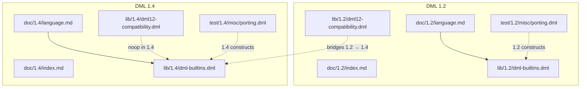
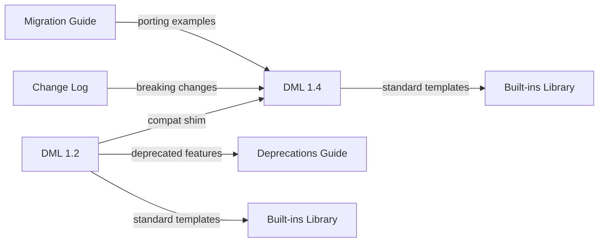
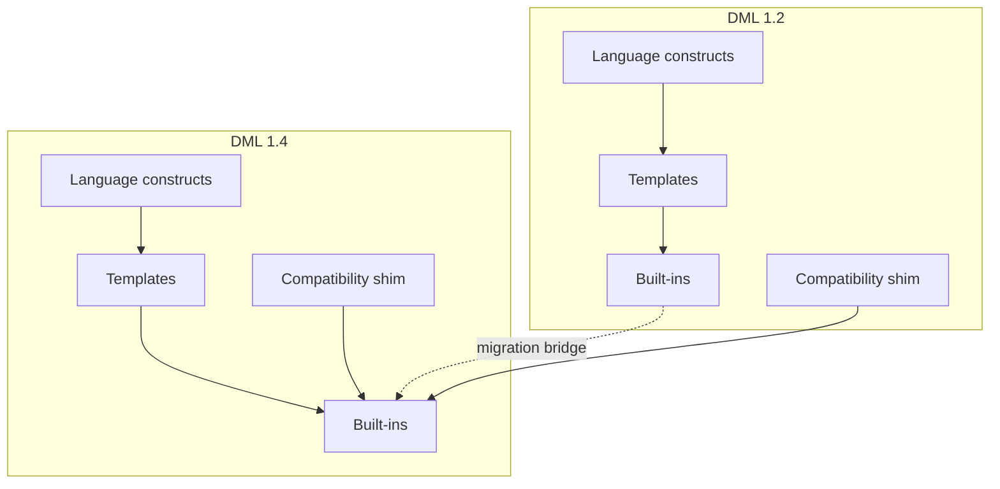

# Version Compatibility Matrix

<cite>
**Referenced Files in This Document**
- [doc/1.2/index.md](file://doc/1.2/index.md)
- [doc/1.2/language.md](file://doc/1.2/language.md)
- [doc/1.2/deprecations-header.md](file://doc/1.2/deprecations-header.md)
- [doc/1.4/index.md](file://doc/1.4/index.md)
- [doc/1.4/language.md](file://doc/1.4/language.md)
- [doc/1.4/changes.md](file://doc/1.4/changes.md)
- [doc/1.4/changes-manual.md](file://doc/1.4/changes-manual.md)
- [doc/1.4/deprecations-header.md](file://doc/1.4/deprecations-header.md)
- [lib/1.2/dml-builtins.dml](file://lib/1.2/dml-builtins.dml)
- [lib/1.2/dml12-compatibility.dml](file://lib/1.2/dml12-compatibility.dml)
- [lib/1.4/dml-builtins.dml](file://lib/1.4/dml-builtins.dml)
- [lib/1.4/dml12-compatibility.dml](file://lib/1.4/dml12-compatibility.dml)
- [test/1.2/misc/porting.dml](file://test/1.2/misc/porting.dml)
- [test/1.4/misc/porting.dml](file://test/1.4/misc/porting.dml)
</cite>

## Table of Contents
1. [Introduction](#introduction)
2. [Project Structure](#project-structure)
3. [Core Components](#core-components)
4. [Architecture Overview](#architecture-overview)
5. [Detailed Component Analysis](#detailed-component-analysis)
6. [Dependency Analysis](#dependency-analysis)
7. [Performance Considerations](#performance-considerations)
8. [Troubleshooting Guide](#troubleshooting-guide)
9. [Conclusion](#conclusion)
10. [Appendices](#appendices)

## Introduction
This document provides a comprehensive compatibility matrix comparing DML 1.2 and 1.4. It catalogs feature availability, syntax and semantic differences, deprecated constructs, breaking changes, and migration impact. The goal is to help users port models from DML 1.2 to 1.4 with confidence, using concrete references to official documentation and standard library files.

## Project Structure
The repository organizes DML 1.2 and 1.4 documentation, standard libraries, and migration tests separately. The compatibility matrix draws from:
- Official reference manuals for each version
- Standard library templates and compatibility shims
- Migration guides and change logs
- Test suites demonstrating ported constructs

**Diagram sources**
- [doc/1.2/language.md](file://doc/1.2/language.md#L1-L800)
- [doc/1.4/language.md](file://doc/1.4/language.md#L1-L800)
- [lib/1.2/dml-builtins.dml](file://lib/1.2/dml-builtins.dml#L1-L800)
- [lib/1.4/dml-builtins.dml](file://lib/1.4/dml-builtins.dml#L1-L800)
- [lib/1.2/dml12-compatibility.dml](file://lib/1.2/dml12-compatibility.dml#L1-L470)
- [lib/1.4/dml12-compatibility.dml](file://lib/1.4/dml12-compatibility.dml#L1-L15)
- [test/1.2/misc/porting.dml](file://test/1.2/misc/porting.dml#L1-L477)
- [test/1.4/misc/porting.dml](file://test/1.4/misc/porting.dml#L1-L494)

**Section sources**
- [doc/1.2/index.md](file://doc/1.2/index.md#L1-L7)
- [doc/1.4/index.md](file://doc/1.4/index.md#L1-L7)

## Core Components
- Language reference and syntax
- Standard library templates and built-ins
- Compatibility shims for cross-version migration
- Migration guides and change logs
- Test-driven examples of ported constructs

Key references:
- DML 1.2 language reference: [doc/1.2/language.md](file://doc/1.2/language.md#L1-L800)
- DML 1.4 language reference: [doc/1.4/language.md](file://doc/1.4/language.md#L1-L800)
- DML 1.2 standard library: [lib/1.2/dml-builtins.dml](file://lib/1.2/dml-builtins.dml#L1-L800)
- DML 1.4 standard library: [lib/1.4/dml-builtins.dml](file://lib/1.4/dml-builtins.dml#L1-L800)
- Compatibility shims:
  - [lib/1.2/dml12-compatibility.dml](file://lib/1.2/dml12-compatibility.dml#L1-L470)
  - [lib/1.4/dml12-compatibility.dml](file://lib/1.4/dml12-compatibility.dml#L1-L15)
- Migration guides:
  - [doc/1.4/changes.md](file://doc/1.4/changes.md#L1-L249)
  - [doc/1.4/changes-manual.md](file://doc/1.4/changes-manual.md#L1-L411)
- Deprecations:
  - [doc/1.2/deprecations-header.md](file://doc/1.2/deprecations-header.md#L1-L73)
  - [doc/1.4/deprecations-header.md](file://doc/1.4/deprecations-header.md#L1-L73)

**Section sources**
- [doc/1.2/language.md](file://doc/1.2/language.md#L1-L800)
- [doc/1.4/language.md](file://doc/1.4/language.md#L1-L800)
- [lib/1.2/dml-builtins.dml](file://lib/1.2/dml-builtins.dml#L1-L800)
- [lib/1.4/dml-builtins.dml](file://lib/1.4/dml-builtins.dml#L1-L800)
- [lib/1.2/dml12-compatibility.dml](file://lib/1.2/dml12-compatibility.dml#L1-L470)
- [lib/1.4/dml12-compatibility.dml](file://lib/1.4/dml12-compatibility.dml#L1-L15)
- [doc/1.4/changes.md](file://doc/1.4/changes.md#L1-L249)
- [doc/1.4/changes-manual.md](file://doc/1.4/changes-manual.md#L1-L411)
- [doc/1.2/deprecations-header.md](file://doc/1.2/deprecations-header.md#L1-L73)
- [doc/1.4/deprecations-header.md](file://doc/1.4/deprecations-header.md#L1-L73)

## Architecture Overview
The DML 1.2 vs 1.4 compatibility matrix centers on:
- Language constructs and syntax differences
- Template and API changes
- Deprecated features and replacements
- Breaking changes and migration impact
- Cross-version compatibility shims

**Diagram sources**
- [lib/1.2/dml12-compatibility.dml](file://lib/1.2/dml12-compatibility.dml#L1-L470)
- [lib/1.4/dml12-compatibility.dml](file://lib/1.4/dml12-compatibility.dml#L1-L15)
- [doc/1.2/deprecations-header.md](file://doc/1.2/deprecations-header.md#L1-L73)
- [doc/1.4/deprecations-header.md](file://doc/1.4/deprecations-header.md#L1-L73)
- [lib/1.2/dml-builtins.dml](file://lib/1.2/dml-builtins.dml#L1-L800)
- [lib/1.4/dml-builtins.dml](file://lib/1.4/dml-builtins.dml#L1-L800)
- [doc/1.4/changes.md](file://doc/1.4/changes.md#L1-L249)
- [doc/1.4/changes-manual.md](file://doc/1.4/changes-manual.md#L1-L411)

## Detailed Component Analysis

### Language Constructs and Syntax Differences
- Method declarations and return values
  - DML 1.2: Named return values in method signatures; available as locals in method body.
  - DML 1.4: Return types only; explicit return statements required; locals must be declared.
  - Reference: [doc/1.4/changes.md](file://doc/1.4/changes.md#L119-L164)
- Inlining
  - DML 1.2: Inline calls use `inline $method(...)` with inlined arguments.
  - DML 1.4: Inlining is an attribute of the called method; arguments marked inline.
  - Reference: [doc/1.4/changes.md](file://doc/1.4/changes.md#L128-L133)
- Throws annotation
  - DML 1.2: Methods default to potentially throwing; explicit nothrow required.
  - DML 1.4: Methods default to nothrow; methods that may throw require `throws`.
  - Reference: [doc/1.2/language.md](file://doc/1.2/language.md#L572-L576), [doc/1.4/changes.md](file://doc/1.4/changes.md#L167-L171)
- Variable scope and `$` prefix
  - DML 1.2: `$` prefix for object references; top-level and global scopes distinct.
  - DML 1.4: `$` removed; top-level scope merged with global; explicit `this.` for members.
  - Reference: [doc/1.4/changes.md](file://doc/1.4/changes.md#L185-L187), [doc/1.4/changes-manual.md](file://doc/1.4/changes-manual.md#L23-L27)
- Object arrays
  - DML 1.2: Implicit index; range syntax `index in start..end`.
  - DML 1.4: Explicit index; range syntax `index < size`.
  - Reference: [doc/1.4/changes.md](file://doc/1.4/changes.md#L174-L179)
- Field declarations
  - DML 1.2: `field name [msb:lsb]`.
  - DML 1.4: `field name @ [msb:lsb]`.
  - Reference: [doc/1.4/changes.md](file://doc/1.4/changes.md#L203-L207)
- Data declarations
  - DML 1.2: `data` for storage.
  - DML 1.4: `session` for storage; `.val` member for values.
  - Reference: [doc/1.4/changes.md](file://doc/1.4/changes.md#L210-L214)
- Parameter override behavior
  - DML 1.2: Multiple conflicting declarations resolved per-file.
  - DML 1.4: Strict template hierarchy determines overrides.
  - Reference: [doc/1.4/changes.md](file://doc/1.4/changes.md#L228-L232)
- Event API
  - DML 1.2: `after_read`, `before_set`, etc., plus `timebase` parameter.
  - DML 1.4: `read_register`, `write_register`, `set` method override; template-based event variants.
  - Reference: [doc/1.4/changes.md](file://doc/1.4/changes.md#L190-L200), [doc/1.4/changes-manual.md](file://doc/1.4/changes-manual.md#L127-L222)
- Attribute API
  - DML 1.2: `allocate_type` parameter; `before_set`, `after_set` methods.
  - DML 1.4: Typed templates (`bool_attr`, `int64_attr`, `uint64_attr`, `double_attr`); `set` override; `.val` member.
  - Reference: [doc/1.4/changes.md](file://doc/1.4/changes.md#L225-L244), [doc/1.4/changes-manual.md](file://doc/1.4/changes-manual.md#L316-L342)
- Reset API
  - DML 1.2: `hard_reset`, `soft_reset` methods; `hard_reset_value`, `soft_reset_value` parameters.
  - DML 1.4: Templates `hreset`, `sreset`; `init_val` parameter; `init` method.
  - Reference: [doc/1.4/changes-manual.md](file://doc/1.4/changes-manual.md#L99-L126)

**Section sources**
- [doc/1.4/changes.md](file://doc/1.4/changes.md#L119-L249)
- [doc/1.4/changes-manual.md](file://doc/1.4/changes-manual.md#L23-L342)
- [doc/1.2/language.md](file://doc/1.2/language.md#L572-L576)

### Standard Library Templates and APIs
- DML 1.2 built-ins
  - Provides templates for device, bank, register, field, attribute, connect, event, and utilities.
  - Includes compatibility helpers for 1.4 overrides.
  - References: [lib/1.2/dml-builtins.dml](file://lib/1.2/dml-builtins.dml#L1-L800), [lib/1.2/dml12-compatibility.dml](file://lib/1.2/dml12-compatibility.dml#L1-L470)
- DML 1.4 built-ins
  - Revised templates and APIs; standardized event and attribute handling; session variables.
  - References: [lib/1.4/dml-builtins.dml](file://lib/1.4/dml-builtins.dml#L1-L800), [lib/1.4/dml12-compatibility.dml](file://lib/1.4/dml12-compatibility.dml#L1-L15)
- Porting examples
  - Side-by-side 1.2 and 1.4 constructs demonstrate syntax and API transformations.
  - References: [test/1.2/misc/porting.dml](file://test/1.2/misc/porting.dml#L1-L477), [test/1.4/misc/porting.dml](file://test/1.4/misc/porting.dml#L1-L494)

**Section sources**
- [lib/1.2/dml-builtins.dml](file://lib/1.2/dml-builtins.dml#L1-L800)
- [lib/1.4/dml-builtins.dml](file://lib/1.4/dml-builtins.dml#L1-L800)
- [lib/1.2/dml12-compatibility.dml](file://lib/1.2/dml12-compatibility.dml#L1-L470)
- [lib/1.4/dml12-compatibility.dml](file://lib/1.4/dml12-compatibility.dml#L1-L15)
- [test/1.2/misc/porting.dml](file://test/1.2/misc/porting.dml#L1-L477)
- [test/1.4/misc/porting.dml](file://test/1.4/misc/porting.dml#L1-L494)

### Deprecated Features and Replacements
- Deprecated in DML 1.4
  - Removed or renamed symbols in libraries; renamed templates (`unimplemented` → `unimpl`, etc.).
  - Removed parameters and methods (e.g., `allocate_type` in attributes; `timebase` parameter in events).
  - Replaced with typed templates and template-based APIs.
  - References: [doc/1.4/changes-manual.md](file://doc/1.4/changes-manual.md#L399-L410), [doc/1.4/changes.md](file://doc/1.4/changes.md#L225-L244)
- Deprecation mechanisms
  - Controlled via Simics API versions and compiler flags (`--api-version`, `--no-compat=_tag_`).
  - References: [doc/1.2/deprecations-header.md](file://doc/1.2/deprecations-header.md#L60-L73), [doc/1.4/deprecations-header.md](file://doc/1.4/deprecations-header.md#L60-L73)

**Section sources**
- [doc/1.4/changes-manual.md](file://doc/1.4/changes-manual.md#L399-L410)
- [doc/1.4/changes.md](file://doc/1.4/changes.md#L225-L244)
- [doc/1.2/deprecations-header.md](file://doc/1.2/deprecations-header.md#L60-L73)
- [doc/1.4/deprecations-header.md](file://doc/1.4/deprecations-header.md#L60-L73)

### Breaking Changes and Migration Impact
- Incompatible changes not automatically converted
  - Unused template instantiation; `$` scope merging; inlining constant typing; anonymous banks; C keyword restrictions; integer arithmetic; `!` operator; `goto`; `vect` iteration; `const char *` string literals; `sizeof`/`typeof`; `implement` value usage; `extern` without type; `c_name` parameter; method parameter scoping; `loggroup` exposure; initialization/reset API rewrite; event API changes; `partial`/`overlapping` defaults; C macro availability; `throws` requirement; assignment operators; `export` method; strict `switch`; template `desc`; `#` operator; identifier restrictions; `undefined` in inline; `while` condition; `goto`; `persistent` parameter; `readable`/`writable` for pseudo attributes; removed parameters; removed bank parameters; merged `validate`/`validate_port`; removed `before_set`/`after_set`; removed `signed`/`noalloc`; `offset` cannot be `undefined`; template renames; `constant` reset value change.
  - References: [doc/1.4/changes-manual.md](file://doc/1.4/changes-manual.md#L17-L411)
- Migration examples
  - Porting test files show transformed constructs and required adjustments.
  - References: [test/1.2/misc/porting.dml](file://test/1.2/misc/porting.dml#L1-L477), [test/1.4/misc/porting.dml](file://test/1.4/misc/porting.dml#L1-L494)

**Section sources**
- [doc/1.4/changes-manual.md](file://doc/1.4/changes-manual.md#L17-L411)
- [test/1.2/misc/porting.dml](file://test/1.2/misc/porting.dml#L1-L477)
- [test/1.4/misc/porting.dml](file://test/1.4/misc/porting.dml#L1-L494)

### Cross-Version Compatibility
- Compatibility shims
  - DML 1.2 compatibility shim enables 1.4 overrides to be effective in 1.2 devices.
  - DML 1.4 compatibility shim is a NOOP for 1.4 devices.
  - References: [lib/1.2/dml12-compatibility.dml](file://lib/1.2/dml12-compatibility.dml#L1-L470), [lib/1.4/dml12-compatibility.dml](file://lib/1.4/dml12-compatibility.dml#L1-L15)
- Porting workflow
  - Use migration guide and change logs to identify and apply transformations.
  - Validate with porting test examples.
  - References: [doc/1.4/changes.md](file://doc/1.4/changes.md#L1-L249), [doc/1.4/changes-manual.md](file://doc/1.4/changes-manual.md#L1-L411)

**Section sources**
- [lib/1.2/dml12-compatibility.dml](file://lib/1.2/dml12-compatibility.dml#L1-L470)
- [lib/1.4/dml12-compatibility.dml](file://lib/1.4/dml12-compatibility.dml#L1-L15)
- [doc/1.4/changes.md](file://doc/1.4/changes.md#L1-L249)
- [doc/1.4/changes-manual.md](file://doc/1.4/changes-manual.md#L1-L411)

## Dependency Analysis
The compatibility matrix reveals dependencies between language constructs, templates, and APIs across versions.

**Diagram sources**
- [lib/1.2/dml-builtins.dml](file://lib/1.2/dml-builtins.dml#L1-L800)
- [lib/1.4/dml-builtins.dml](file://lib/1.4/dml-builtins.dml#L1-L800)
- [lib/1.2/dml12-compatibility.dml](file://lib/1.2/dml12-compatibility.dml#L1-L470)
- [lib/1.4/dml12-compatibility.dml](file://lib/1.4/dml12-compatibility.dml#L1-L15)

**Section sources**
- [lib/1.2/dml-builtins.dml](file://lib/1.2/dml-builtins.dml#L1-L800)
- [lib/1.4/dml-builtins.dml](file://lib/1.4/dml-builtins.dml#L1-L800)
- [lib/1.2/dml12-compatibility.dml](file://lib/1.2/dml12-compatibility.dml#L1-L470)
- [lib/1.4/dml12-compatibility.dml](file://lib/1.4/dml12-compatibility.dml#L1-L15)

## Performance Considerations
- Method inlining and return value handling changed in DML 1.4; review performance-sensitive code paths.
- Event and attribute APIs revised; ensure efficient use of new template-based approaches.
- Arithmetic and type promotion rules updated; validate numeric computations.

[No sources needed since this section provides general guidance]

## Troubleshooting Guide
Common migration issues and remedies:
- Scope and `$` removal
  - Replace `$` references with explicit `this.` where needed; merge top-level and global scopes.
  - References: [doc/1.4/changes.md](file://doc/1.4/changes.md#L185-L187), [doc/1.4/changes-manual.md](file://doc/1.4/changes-manual.md#L23-L27)
- Throws annotation
  - Add `throws` to methods that may throw; wrap risky calls in `try` blocks.
  - References: [doc/1.4/changes-manual.md](file://doc/1.4/changes-manual.md#L233-L245)
- Object arrays and fields
  - Update array index syntax and field declaration syntax.
  - References: [doc/1.4/changes.md](file://doc/1.4/changes.md#L174-L179), [doc/1.4/changes.md](file://doc/1.4/changes.md#L203-L207)
- Data declarations
  - Replace `data` with `session` and access `.val`.
  - References: [doc/1.4/changes.md](file://doc/1.4/changes.md#L210-L214)
- Event and attribute APIs
  - Use template-based event variants and typed attribute templates.
  - References: [doc/1.4/changes-manual.md](file://doc/1.4/changes-manual.md#L127-L222), [doc/1.4/changes.md](file://doc/1.4/changes.md#L225-L244)
- Compatibility shims
  - Import DML 1.2 compatibility templates to enable 1.4 overrides in 1.2 devices.
  - References: [lib/1.2/dml12-compatibility.dml](file://lib/1.2/dml12-compatibility.dml#L1-L470), [lib/1.4/dml12-compatibility.dml](file://lib/1.4/dml12-compatibility.dml#L1-L15)

**Section sources**
- [doc/1.4/changes.md](file://doc/1.4/changes.md#L174-L214)
- [doc/1.4/changes-manual.md](file://doc/1.4/changes-manual.md#L23-L245)
- [lib/1.2/dml12-compatibility.dml](file://lib/1.2/dml12-compatibility.dml#L1-L470)
- [lib/1.4/dml12-compatibility.dml](file://lib/1.4/dml12-compatibility.dml#L1-L15)

## Conclusion
DML 1.4 introduces significant improvements in safety, clarity, and maintainability, but requires careful migration from 1.2. Use the migration guides, change logs, compatibility shims, and porting examples to systematically transform models. Pay special attention to method declarations, inlining, throws annotations, object arrays, field declarations, data/session variables, event and attribute APIs, and deprecated features.

[No sources needed since this section summarizes without analyzing specific files]

## Appendices

### Side-by-Side Comparison Highlights
- Method declarations
  - 1.2: Named return values; implicit locals.
  - 1.4: Typed returns; explicit locals and return statements.
  - Reference: [doc/1.4/changes.md](file://doc/1.4/changes.md#L119-L164)
- Inlining
  - 1.2: `inline $method(...)`.
  - 1.4: `inline method(...)` with `inline` arguments.
  - Reference: [doc/1.4/changes.md](file://doc/1.4/changes.md#L128-L133)
- Throws
  - 1.2: Default potential throws; `nothrow`.
  - 1.4: Default nothrow; `throws`.
  - Reference: [doc/1.2/language.md](file://doc/1.2/language.md#L572-L576), [doc/1.4/changes.md](file://doc/1.4/changes.md#L167-L171)
- Scoping and `$`
  - 1.2: `$` prefix; separate top-level/global scopes.
  - 1.4: No `$`; merged scopes; `this.` for members.
  - Reference: [doc/1.4/changes.md](file://doc/1.4/changes.md#L185-L187), [doc/1.4/changes-manual.md](file://doc/1.4/changes-manual.md#L23-L27)
- Arrays and fields
  - 1.2: `index in start..end`; `field name [msb:lsb]`.
  - 1.4: `index < size`; `field name @ [msb:lsb]`.
  - Reference: [doc/1.4/changes.md](file://doc/1.4/changes.md#L174-L179), [doc/1.4/changes.md](file://doc/1.4/changes.md#L203-L207)
- Data/session
  - 1.2: `data`; direct value usage.
  - 1.4: `session`; `.val` member.
  - Reference: [doc/1.4/changes.md](file://doc/1.4/changes.md#L210-L214)
- Events and attributes
  - 1.2: `timebase`; `before_set`/`after_set`.
  - 1.4: Template-based events; typed templates; `set` override; `.val`.
  - Reference: [doc/1.4/changes.md](file://doc/1.4/changes.md#L190-L244), [doc/1.4/changes-manual.md](file://doc/1.4/changes-manual.md#L127-L222)

**Section sources**
- [doc/1.4/changes.md](file://doc/1.4/changes.md#L119-L244)
- [doc/1.4/changes-manual.md](file://doc/1.4/changes-manual.md#L127-L244)
- [doc/1.2/language.md](file://doc/1.2/language.md#L572-L576)